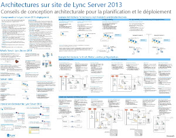
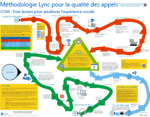
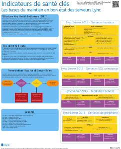
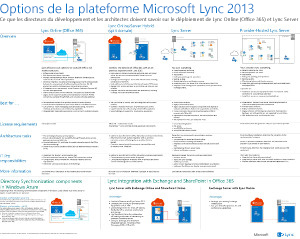
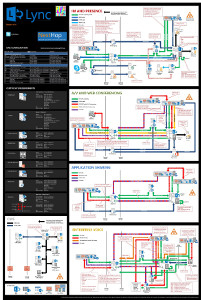

# Diagrammes techniques pour Lync Server 2013

 

_**Dernière modification de la rubrique :** 2014-03-14_

**Résumé :** ces diagrammes fournissent des représentations visuelles de solutions recommandées pour Lync 2013.

Ces ressources sont disponibles au format Visio (. VSD) (Visio 2010 ou Visio 2013) et le format PDF. Pour plus d’informations sur l’impression des documents, voir conseils pour l’impression des affiches.

Vous aurez peut-être besoin de logiciels supplémentaires pour afficher ces fichiers. Voir le tableau suivant pour plus d’informations.

<table>
<colgroup>
<col style="width: 50%" />
<col style="width: 50%" />
</colgroup>
<thead>
<tr class="header">
<th>Type de fichier</th>
<th>Logiciels</th>
</tr>
</thead>
<tbody>
<tr class="odd">
<td>
. VSD
</td>
<td>
Visio 2010, Visio 2013 ou la <a href="http://go.microsoft.com/fwlink/?linkid=393676">visionneuse Visio gratuite</a>

Si vous utilisez la visionneuse Visio, cliquez avec le bouton droit de la souris sur le lien VSD, puis cliquez sur <strong>Enregistrer la cible sous</strong>, enregistrez le fichier sur votre ordinateur et ouvrez-le depuis votre ordinateur.
</td>
</tr>
<tr class="even">
<td>
.pdf
</td>
<td>
N'importe quelle visionneuse PDF (par exemple, <a href="http://go.microsoft.com/fwlink/?linkid=393675">Adobe Reader</a>)
</td>
</tr>
<tr class="odd">
<td>
.zip
</td>
<td>
Tout utilitaire de compression de fichiers. Windows 7 et 8 ouvrent ces fichiers en mode natif.
</td>
</tr>
</tbody>
</table>

## Affiches

Ces affiches détaillent un domaine technique spécifique et sont destinées à être utilisées avec des articles correspondants sur TechNet ou du contenu disponible sur le centre de téléchargement.

<table>
<colgroup>
<col style="width: 50%" />
<col style="width: 50%" />
</colgroup>
<thead>
<tr class="header">
<th>Titre</th>
<th>Description</th>
</tr>
</thead>
<tbody>
<tr class="odd">
<td>
<strong>Architectures locales de Lync Server 2013</strong>

<a href="http://go.microsoft.com/fwlink/?linkid=392974">Zoomer sur l’affiche avec zoom.it de Microsoft</a>(recommandé pour les ordinateurs de bureau ou portables)

<a href="http://go.microsoft.com/fwlink/?linkid=392578">Version PDF</a> (recommandé pour les appareils mobiles ou les tablettes)

<a href="http://go.microsoft.com/fwlink/?linkid=392579">Version Visio</a> (recommandé pour les utilisateurs de Visio)
</td>
<td>
Affiche des conseils architecturaux pour la planification et le déploiement. L’affiche contient des informations sur les composants communs de Lync Server, la terminologie utilisée lors de la planification d’un déploiement, les nouvelles fonctionnalités, les rôles serveur et une vue d’ensemble de l’installation. De plus, l’affiche contient des exemples d’architectures pour l’augmentation de la haute disponibilité et de la récupération d’urgence, ainsi que des exemples de topologies de petite, moyenne ou grande taille.

Taille : 34-x-44 cm

Cette affiche a été créée à l’aide de Visio 2013. Aucune modification n’est nécessaire pour un environnement spécifique.
</td>
</tr>
<tr class="even">
<td>
<strong>Méthodologie de qualité des appels Lync</strong>

<a href="http://go.microsoft.com/fwlink/?linkid=392972">Zoomer sur l’affiche avec zoom.it de Microsoft</a>(recommandé pour les ordinateurs de bureau ou portables)

<a href="http://go.microsoft.com/fwlink/?linkid=391841">Versions de Visio et de PDF dans un fichier. zip</a>
</td>
<td>
Affiche décrivant la résolution des problèmes système Lync, en particulier pour les problèmes affectant la qualité voix entreprise. Utilisez cette affiche avec les éléments suivants :

<ul>
<li>
<a href="http://go.microsoft.com/fwlink/p/?linkid=390677">Guide de mise en réseau Lync Server</a>
</li>
<li>
<a href="lync-server-2013-poster-lync-call-quality-methodology.md">Méthodologie de qualité des appels Lync dans Lync Server 2013</a> (article sur l’accessibilité)
</li>
<li>
<a href="lync-server-2013-poster-key-health-indicators.md">Indicateurs d’intégrité clés dans Lync Server 2013</a> (article d’accessibilité)
</li>
</ul>

Taille : 34-x-44 cm

Cette affiche a été créée à l’aide de Visio 2010. Aucune modification n’est nécessaire pour un environnement spécifique.
</td>
</tr>
<tr class="odd">
<td>
<strong>Indicateurs d’intégrité clés</strong>

<a href="http://go.microsoft.com/fwlink/?linkid=392971">Zoomer sur l’affiche avec zoom.it de Microsoft</a>(recommandé pour les ordinateurs de bureau ou portables)

<a href="http://go.microsoft.com/fwlink/?linkid=391838">Versions de Visio et de PDF dans un fichier. zip</a>
</td>
<td>
Affiche décrivant les mesures de résolution des problèmes de serveur pour l’intégrité du serveur de base et pour un rôle de serveur donné dans l’implémentation Lync. Utilisez cette affiche avec les éléments suivants :

<ul>
<li>
<a href="http://go.microsoft.com/fwlink/p/?linkid=390677">Guide de mise en réseau Lync Server</a>
</li>
<li>
<a href="lync-server-2013-poster-lync-call-quality-methodology.md">Méthodologie de qualité des appels Lync dans Lync Server 2013</a> (article sur l’accessibilité)
</li>
<li>
<a href="lync-server-2013-poster-key-health-indicators.md">Indicateurs d’intégrité clés dans Lync Server 2013</a> (article d’accessibilité)
</li>
</ul>

Taille : 17 x 22 pouces

Cette affiche a été créée à l’aide de Visio 2010. Aucune modification n’est nécessaire pour un environnement spécifique.
</td>
</tr>
<tr class="even">
<td>
<strong>Options de plateforme Lync 2013</strong>

<a href="http://go.microsoft.com/fwlink/p/?linkid=391840">Zoomer sur l’affiche avec Zoom.it de Microsoft</a>

<a href="http://go.microsoft.com/fwlink/p/?linkid=391837">Version PDF</a> (recommandé pour les appareils mobiles ou les tablettes)

<a href="http://go.microsoft.com/fwlink/p/?linkid=391839">Version Visio</a> (recommandé pour les utilisateurs de Visio)
</td>
<td>
Cette affiche décrit les options de plateforme disponibles pour Lync 2013 aux BDM et architectes les clients peuvent choisir entre Lync Online et Office 365, hybride Lync, Lync Server local et Lync hébergé. L’affiche inclut les détails de chaque option d’architecture, y compris les scénarios idéaux pour chacune, les exigences de licence et les responsabilités des professionnels de l’informatique.

Taille : 34-x-44 cm

Cette affiche a été créée à l’aide de Visio 2013. Aucune modification n’est nécessaire pour un environnement spécifique.
</td>
</tr>
<tr class="odd">
<td>
<strong>Charges de travail du protocole Microsoft Lync Server 2013</strong>

<a href="http://go.microsoft.com/fwlink/?linkid=392970">Zoomer sur l’affiche avec Zoom.it de Microsoft</a>

<a href="http://go.microsoft.com/fwlink/?linkid=392512">Version PDF</a> (recommandé pour les appareils mobiles ou les tablettes)

<a href="http://go.microsoft.com/fwlink/?linkid=392513">Version Visio</a> (recommandé pour les utilisateurs de Visio)
</td>
<td>
Téléchargez cette affiche pour comprendre les capacités et les exigences de Lync 2013, Lync Phone, Lync Web App, Lync pour Mac et Lync mobile w. Découvrez comment les charges de travail Lync Server facilitent la communication au sein d’une organisation.

Taille : 24 x 36 cm

Cette affiche a été créée à l’aide de Visio 2013. Aucune modification n’est nécessaire pour un environnement spécifique.
</td>
</tr>
</tbody>
</table>

## Conseils d’impression pour les affiches

Si vous disposez d’un traceur, vous pouvez imprimer ces affiches à leur taille réelle. Sinon, suivez les étapes ci-après pour les imprimer en format réduit.

**Imprimer des affiches en format réduit**

1.  Ouvrez l’affiche dans Visio.

2.  Dans le menu **Fichier**, cliquez sur **Mise en page**.

3.  Dans l’onglet **Mise en page**, dans la section **Papier de l’imprimante**, sélectionnez la taille du papier sur lequel vous voulez imprimer.

4.  Dans l’onglet **Configuration de l’impression**, dans la section **Zoom d’impression**, cliquez sur **Ajuster** et entrez **1 page en largeur et 1 page en hauteur**.

5.  Dans l’onglet **Taille de la page**, cliquez sur **Ajuster au contenu du dessin**, puis sur **OK**.

6.  Dans le menu **Fichier**, cliquez sur **Imprimer**.

 

