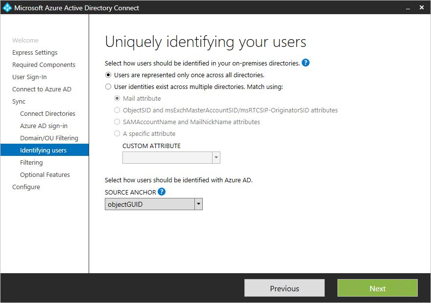

# Mettre à jour AAD Connect pour inclure plusieurs forêts

[!INCLUDE [sfbo-retirement](../../Hub/includes/sfbo-retirement.md)]

Azure AD Connecter prend en [charge la synchronisation à partir de plusieurs forêts.](/azure/active-directory/connect/active-directory-aadconnect-topologies) Toutefois, il ne prend en charge qu’une seule instance d’Azure AD Connecter synchronisation avec AAD. Par conséquent, dans les cas où Azure AD est déjà installé dans une forêt, l’instance existante d’AAD Connecter doit être mise à jour pour être synchronisée à partir de la forêt supplémentaire.

 - Si toutes les identités ne sont représentées qu’une seule fois dans les deux forêts (c’est-à-dire que vous n’avez pas de contacts à messagerie), vous pouvez simplement ré-exécuter l’Assistant AAD Connecter, choisir « Personnaliser les options de synchronisation », puis dans la page **Connecter** Vos répertoires, entrez le nom de la forêt supplémentaire et ajoutez des informations.  
 
 - Toutefois, si des utilisateurs peuvent exister dans plusieurs répertoires et que vous fusionnez les données (par exemple, si des objets contact existent dans une forêt correspondant aux utilisateurs d’une autre forêt), vous devrez désinstaller Azure AD Connecter et le réinstaller.  Cela est dû au fait que la condition de règles de jointeur entre forêts ne peut être configurée que lors de la première installation. Pour ce faire, voir la page suivante :  
 

## Voir aussi

[Consolidation du cloud pour Teams et Skype Entreprise](cloud-consolidation.md)