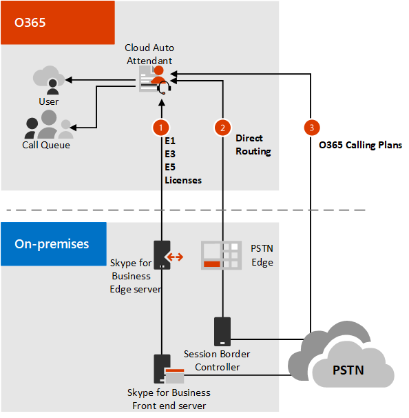

# Planifier les standards automatiques cloud

[!INCLUDE [sfbo-retirement](../../Hub/includes/sfbo-retirement.md)]

Le attendant automatique utilisé avec la messagerie unifiée Exchange (Exchange Server 2013 ou Exchange Server 2016) n’est plus disponible dans Exchange Server 2019 ou Exchange Online. Si votre implémentation de Skype Entreprise Server 2019 s’intègre à l’une de ces versions Exchange, vous devez utiliser les fonctionnalités Cloud Voice en ligne associées à Système téléphonique. Pour plus d’informations sur le déplacement des services de messagerie un Exchange Exchange sur Exchange server 2013 et 2016 vers le cloud, voir [Plan for Skype Entreprise Server and Exchange Server migration.](plan-um-migration.md)

Cela signifie intrinsèquement que vous aurez une implémentation hybride de Skype Entreprise Server 2019 si vous souhaitez utiliser des fonctionnalités de messagerie unifiée telles que les attendants automatiques. Pour [plus d’informations, voir](configure-hybrid-connectivity.md) Configurer la connectivité hybride entre Skype Entreprise Server et Microsoft 365 ou Office 365 hybride.

Un attendant automatique est un service cloud qui accepte les appels des clients et lit des salutations, leur fournit des options de menu et interagit avec les appelants à l’aide de la reconnaissance vocale ou du pavé de numérotation pour router leurs appels vers la bonne destination. Un compte de ressource *(voir* Configurer les comptes de [ressources)](configure-onprem-ra.md)est affecté à chaque attendant automatique sur votre système Skype Entreprise Server 2019 qui sera lié directement à un attendant automatique dans le Centre d’administration Microsoft Teams. Pour [plus d’informations sur](/microsoftteams/create-a-phone-system-auto-attendant) les attendants automatiques et les options et fonctionnalités disponibles pour les attendants automatiques, voir Configurer un attendant automatique.

> [!NOTE]
> Vous pouvez affecter plusieurs numéros de service Microsoft, des numéros de routage direct ou des numéros hybrides à un service de sécurité automatique.

Un appel entrant vers un service de attendant automatique cloud peut prendre l’un des chemins d’accès indiqués ci-après :

1. Via Skype Entreprise Server 2019
2. Via un contrôleur [de frontière de session](/microsoftteams/direct-routing-border-controllers) et un [routage direct.](/microsoftteams/direct-routing-plan-media-bypass)
3. Via un numéro en ligne Microsoft 365 ou Office 365.

Consulter également :

- [Configurer un standard automatique dans le cloud](/microsoftteams/create-a-phone-system-auto-attendant)
- [Réponse et routage automatique d’appels entrants](/exchange/voice-mail-unified-messaging/automatically-answer-and-route-calls/automatically-answer-and-route-calls)

## Conditions requises

Les conditions suivantes supposent que vous avez déjà déployé Skype Entreprise Server 2019 dans une topologie prise en charge.  Vos besoins dépendent de votre scénario :

- Si vous utilisez déjà la Exchange um en ligne ou en local et que vous faites une mise à niveau vers Skype Entreprise 2019, vous devez capturer la structure de vos attendants automatiques et les re-créer dans le cloud à l’aide des attendants automatiques cloud. Pour plus d’informations, voir [Moving an Exchange UM auto attendant or call queue to Système téléphonique](configure-onprem-ra.md#moving-an-exchange-um-auto-attendant-or-call-queue-to-phone-system).

- Pour une nouvelle configuration des attendants automatiques cloud, suivez les étapes décrites dans [Configurer les comptes de ressources.](configure-onprem-ra.md)

Outre la configuration requise ci-dessus, les conditions ci-dessous doivent être configurées pour se connecter au service de service de attendant automatique Microsoft Cloud :

- Connectivité hybride. Si vous avez déjà déployé Skype Entreprise Server et que vous souhaitez activer le service de sécurité automatique cloud pour vos utilisateurs locaux, vous devez vous assurer que la connectivité hybride est définie entre vos environnements locaux et en ligne. Il s’agit parfois d’une configuration de domaine fractionnement.

   Pour plus d’informations, voir Planifier la connectivité hybride entre Skype Entreprise Server et Microsoft 365 ou [Office 365](plan-hybrid-connectivity.md) et configurer la connectivité hybride entre Skype Entreprise Server et [Microsoft 365 ou Office 365](configure-hybrid-connectivity.md).

- Si vous affectez un numéro de téléphone à votre attendant automatique, vous aurez besoin [d’une licence Office 365 Entreprise E5.](../../SfbOnline/skype-for-business-and-microsoft-teams-add-on-licensing/license-options-based-on-your-plan/office-365-enterprise-e5-with-audio-conferencing.md)
- Créez un compte de ressource  [en ligne](/MicrosoftTeams/manage-resource-accounts) ou local pour chaque numéro de téléphone et attribuez des numéros de téléphone et des licences. 

## Migration et interopérabilité

Si vous envisagez de déployer Skype Entreprise Server 2019 et/ou Exchange Server 2019, vous devez planifier votre migration avec soin pour garantir une prise en charge continue des attendants automatiques. Gardez les éléments suivants à l’esprit :

- Exchange Server 2019 ne fournit plus la fonctionnalité Exchange de la Exchange de l’équipe
- Exchange La messagerie unifiée est en mode retrait
- Skype Entreprise Server 2019 ne s’intègre plus à la Exchange Online de l’équipe

Les attendants automatiques cloud peuvent être configurés avec Skype Entreprise Server 2019, 2015 et 2013.

Microsoft recommande les chemins de migration suivants :

- Si vous êtes en cours de mise à niveau vers Skype Entreprise Server 2019, vous pouvez utiliser la Exchange um dans Exchange Server 2013 ou 2016, mais vous devez mettre à niveau vers le service de cloud automatique si vous utilisez Exchange Server 2019.

- Si vous êtes en cours de mise à niveau vers Exchange Server 2019 et que vous utilisez des versions précédentes de la messagerie un Exchange Server pour la messagerie vocale Skype Entreprise Server, Microsoft vous recommande de mettre à niveau vers Skype Entreprise Server 2019 avant la mise à niveau de boîte aux lettres.  Dans le cas contraire, les fonctionnalités de messagerie vocale seront perdues.

Pour plus d’informations sur la planification de votre migration, voir [Plan for Skype Entreprise Server and Exchange Server migration.](plan-um-migration.md)

### Migration d’un système de attendant automatique de Exchange de la Exchange précédemment implémenté

Pour l’instant, nous ne allons pas prendre en charge la migration automatisée vers le cloud d’un système de surveillance automatique de la Exchange 2013 ou 2016. Pour créer manuellement un système de attendant automatique, vous devez :

1. Utilisez Exchange commandes PowerShell d’administration pour passer en revue la structure de l’ancien système de attendant automatique, y compris les files d’attente d’appels et les attendants automatiques imbrmbrés.  
2. Créez des copies de scripts de texte par reconnaissance vocale ou des messages enregistrés associés à chaque nœud de service de messagerie unée automatique.
3. Créez des points de terminaison locaux pour chaque nœud de attendant automatique, y compris l’attribution de numéros de téléphone de test et de licences aux objets. Notez que vous avez désormais la possibilité d’attribuer des licences de numéros de téléphone locaux utilisés par des services en ligne tels que Système téléphonique.
4. Implémentez un nouveau service de service de sécurité Microsoft Teams cloud Système téléphonique. Pour [plus d’informations sur l’implémentation,](configure-onprem-ra.md) voir Configurer les comptes de ressources. Comme vous le faites, téléchargez les scripts de texte par reconnaissance vocale ou les messages enregistrés associés à chaque nœud de service de messagerie unée automatique.
5. Testez les fonctionnalités du service de attendant automatique cloud.
6. Réaffectez le numéro de téléphone affecté à l’ancien Exchange de service automatique de la Exchange au nouveau numéro de téléphone principal du cloud.

Pour [plus d’Exchange,](configure-onprem-ra.md#moving-an-exchange-um-auto-attendant-or-call-queue-to-phone-system) voir Déplacement d’un Exchange de service ou d’une file d’attente d’appels de Système téléphonique pour plus d’informations.

Lorsque vous avez une structure solide qui répond à vos besoins et un script qui guide efficacement les clients, procédez à la configuration des comptes [de ressources.](configure-onprem-ra.md)

> [!CAUTION]
> Comme mentionné dans [la KB4480742,](https://support.microsoft.com/help/4480742/call-failures-and-500-server-internal-error-after-migration-to-2019)le déplacement de Exchange de serveurs automatiques de messagerie un Exchange créés dans Server 2015 vers des serveurs exécutant Server 2019 est déconseillé. Pour l’instant, vous devez les conserver sur un pool Skype Entreprise Server 2015 en mode coexistence.

## Voir aussi

[Planifier la migration pour Skype Entreprise Server et Exchange Server](plan-um-migration.md)

[Configurer des comptes de ressource](configure-onprem-ra.md)

[Activer l'enregistrement des invites personnalisées à l'aide de l'interface utilisateur de téléphonie](/exchange/voice-mail-unified-messaging/greetings-announcements-menus-and-prompts/enable-custom-prompt-recording)

[Un standard Cloud automatique, qu’est-ce que c’est ?](/SkypeForBusiness/what-is-phone-system-in-office-365/what-are-phone-system-auto-attendants)

[Configurer un standard automatique dans le cloud](/microsoftteams/create-a-phone-system-auto-attendant)

Exchange Um: [Automatically answer and route incoming calls](/exchange/voice-mail-unified-messaging/automatically-answer-and-route-calls/automatically-answer-and-route-calls)

[ Planifier une connectivité hybride entre Skype pour serveur d'entreprise et Microsoft 365 ou Office 365](plan-hybrid-connectivity.md)

[Configurer la connectivité hybride entre Skype Entreprise Server et Microsoft 365 ou Office 365](configure-hybrid-connectivity.md)

[KB4480742 : les appels à l’accès abonné ou au attendant automatique échouent avec une occupé rapide et une erreur « 500 Serveur interne » après le déplacement des objets contact vers Skype Entreprise Server 2019](https://support.microsoft.com/help/4480742/call-failures-and-500-server-internal-error-after-migration-to-2019)
