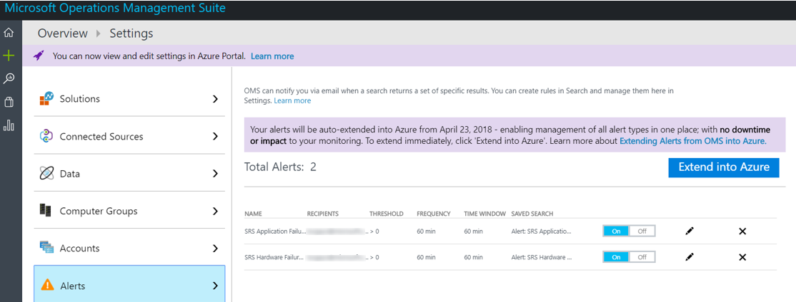

# <a name="deploy-skype-room-systems-v2-management-with-oms"></a><span data-ttu-id="b6a26-103">Déploiement de la gestion de Skype Room Systems v2 avec OMS</span><span class="sxs-lookup"><span data-stu-id="b6a26-103">Deploy Skype Room Systems v2 management with OMS</span></span>

<span data-ttu-id="b6a26-104">Cet article explique comment configurer et déployer une gestion intégrée, de bout en bout des périphériques v2 de systèmes de salle Skype à l’aide de Microsoft Operations Management Suite.</span><span class="sxs-lookup"><span data-stu-id="b6a26-104">This article discusses how to set up and deploy integrated, end-to-end management of Skype Room Systems v2 devices by using Microsoft Operations Management Suite.</span></span>

<span data-ttu-id="b6a26-105">Vous pouvez configurer Microsoft Operations Management Suite pour fournir la télémétrie de base et les alertes qui vous aideront à gérer Skype équipements de salle de réunion.</span><span class="sxs-lookup"><span data-stu-id="b6a26-105">You can configure Microsoft Operations Management Suite to provide basic telemetry and alerts that will help you manage Skype meeting room devices.</span></span> <span data-ttu-id="b6a26-106">Comme votre solution de gestion ailleurs, vous pouvez décider de déployer des données supplémentaires et les fonctionnalités de gestion pour créer une vue plus détaillée de performances et la disponibilité des périphériques.</span><span class="sxs-lookup"><span data-stu-id="b6a26-106">As your management solution matures, you might decide to deploy additional data and management capabilities to create a more detailed view of device availability and performance.</span></span>

<span data-ttu-id="b6a26-107">En suivant ce guide, vous pouvez utiliser un tableau de bord à l’exemple suivant pour obtenir le statut détaillé, création de rapports pour la disponibilité des périphériques, application et d’intégrité du matériel et la distribution de systèmes de salle Skype v2 application version.</span><span class="sxs-lookup"><span data-stu-id="b6a26-107">By following this guide, you can use a dashboard like the following example to get detailed status reporting for device availability, application and hardware health, and Skype Room Systems v2 application version distribution.</span></span>

<span data-ttu-id="b6a26-108">![Affichage d’exemple OMS pour SRS v2] (../../media/Deploy_OMS_1.png "Affichage d’exemple OMS pour SRS v2")</span><span class="sxs-lookup"><span data-stu-id="b6a26-108"></span></span>

<span data-ttu-id="b6a26-109">À haut niveau, vous devez effectuer les tâches suivantes :</span><span class="sxs-lookup"><span data-stu-id="b6a26-109">At a high level, you need to perform the following tasks:</span></span>


1.  [<span data-ttu-id="b6a26-110">Valider la configuration de la Suite de gestion des opérations</span><span class="sxs-lookup"><span data-stu-id="b6a26-110">Validate Operations Management Suite configuration</span></span>](with-oms.md#validate_OMS)
2.  [<span data-ttu-id="b6a26-111">Configurer les périphériques de test pour les paramètres de gestion des opérations Management Suite</span><span class="sxs-lookup"><span data-stu-id="b6a26-111">Configure test devices for Operations Management Suite management setup</span></span>](with-oms.md#configure_test_devices)
3.  [<span data-ttu-id="b6a26-112">Mapper les champs personnalisés</span><span class="sxs-lookup"><span data-stu-id="b6a26-112">Map custom fields</span></span>](with-oms.md#Custom_fields)
4.  [<span data-ttu-id="b6a26-113">Définir les affichages v2 de systèmes de salle Skype dans la Suite de gestion des opérations</span><span class="sxs-lookup"><span data-stu-id="b6a26-113">Define the Skype Room Systems v2 views in Operations Management Suite</span></span>](with-oms.md#Define_Views)
5.  [<span data-ttu-id="b6a26-114">Définir des alertes</span><span class="sxs-lookup"><span data-stu-id="b6a26-114">Define alerts</span></span>](with-oms.md#Alerts)
6.  [<span data-ttu-id="b6a26-115">Configurer tous les périphériques pour la Suite de gestion des opérations</span><span class="sxs-lookup"><span data-stu-id="b6a26-115">Configure all devices for Operations Management Suite</span></span>](with-oms.md#configure_all_devices)
7.  [<span data-ttu-id="b6a26-116">Configurer d’autres solutions de la Suite de gestion des opérations</span><span class="sxs-lookup"><span data-stu-id="b6a26-116">Configure additional Operations Management Suite solutions</span></span>](with-oms.md#Solutions)

> [!IMPORTANT]
> <span data-ttu-id="b6a26-117">Bien que la configuration minimale, la Suite de gestion des opérations permet de surveiller un ordinateur exécutant un système d’exploitation Windows, il y a encore certaines étapes Skype salle systèmes v2 spécifiques que vous devez prendre avant de commencer le déploiement des agents à toutes les salles de Skype Périphériques de systèmes.</span><span class="sxs-lookup"><span data-stu-id="b6a26-117">Although with minimal configuration, the Operations Management Suite can monitor a computer running a Windows operating system, there are still some Skype Room Systems v2–specific steps that you need to take before you start deploying agents to all Skype Room Systems devices.</span></span>
> <span data-ttu-id="b6a26-118">Par conséquent, nous vous recommandons vivement de que procéder à toutes les étapes de configuration dans le bon ordre pour un contrôle du programme d’installation et la configuration.</span><span class="sxs-lookup"><span data-stu-id="b6a26-118">Therefore, we highly recommend you perform all configuration steps in the right order for a controlled setup and configuration.</span></span> <span data-ttu-id="b6a26-119">La qualité du résultat final dépend beaucoup de la qualité de la configuration initiale.</span><span class="sxs-lookup"><span data-stu-id="b6a26-119">The quality of the end result very much depends on the quality of the initial configuration.</span></span>

## <a name="validate-operations-management-suite-configuration"></a><span data-ttu-id="b6a26-120">Valider la configuration de la Suite de gestion des opérations</span><span class="sxs-lookup"><span data-stu-id="b6a26-120">Validate Operations Management Suite configuration</span></span>
<span data-ttu-id="b6a26-121"><a name="validate_OMS"> </a></span><span class="sxs-lookup"><span data-stu-id="b6a26-121"></span></span>

<span data-ttu-id="b6a26-122">Vous devez disposer d’un espace de travail Suite de gestion des opérations pour démarrer la collecte de journaux à partir des périphériques v2 de systèmes de salle Skype.</span><span class="sxs-lookup"><span data-stu-id="b6a26-122">You need to have an Operations Management Suite workspace to start collecting logs from Skype Room Systems v2 devices.</span></span> <span data-ttu-id="b6a26-123">Un espace de travail est un environnement de journal Analytique unique avec son propre référentiel de données, les sources de données et les solutions.</span><span class="sxs-lookup"><span data-stu-id="b6a26-123">A workspace is a unique Log Analytics environment with its own data repository, data sources, and solutions.</span></span> <span data-ttu-id="b6a26-124">Si vous disposez déjà d’un espace de travail Analytique de journal existante, vous pouvez l’utiliser pour analyser votre déploiement de v2 Skype salle systèmes ou vous pouvez créer un espace de travail journal Analytique dédié spécifique à votre contrôle de systèmes de salle Skype v2 a besoin.</span><span class="sxs-lookup"><span data-stu-id="b6a26-124">If you already have an existing Log Analytics workspace, you might use it to monitor your Skype Room Systems v2 deployment or you can create a dedicated Log Analytics workspace specific to your Skype Room Systems v2 monitoring needs.</span></span>

<span data-ttu-id="b6a26-125">Si vous avez besoin créer un nouvel espace de travail de journal Analytique, suivez les instructions de l’article [créer un espace de travail Analytique journal dans le portail Azure](https://docs.microsoft.com/azure/log-analytics/log-analytics-quick-create-workspace)</span><span class="sxs-lookup"><span data-stu-id="b6a26-125">If you need to create a new Log Analytics workspace, follow the instructions in the article [Create a Log Analytics workspace in the Azure portal](https://docs.microsoft.com/azure/log-analytics/log-analytics-quick-create-workspace)</span></span>

> [!NOTE]
> <span data-ttu-id="b6a26-126">Pour utiliser journal Analytique avec la Suite de gestion des opérations, vous devez posséder un abonnement Azure actif.</span><span class="sxs-lookup"><span data-stu-id="b6a26-126">To use Log Analytics with Operations Management Suite, you need to have an active Azure subscription.</span></span> <span data-ttu-id="b6a26-127">Si vous ne disposez d’un abonnement Azure, vous pouvez créer [un abonnement d’évaluation gratuit](https://azure.microsoft.com/free) comme point de départ.</span><span class="sxs-lookup"><span data-stu-id="b6a26-127">If you don’t have an Azure subscription, you can create [a free trial subscription](https://azure.microsoft.com/free) as a starting point.</span></span>


### <a name="configure-operations-management-suite-to-collect-skype-room-systems-v2-event-logs"></a><span data-ttu-id="b6a26-128">Configurer la Suite de gestion des opérations pour collecter des journaux des événements Skype salle systèmes v2</span><span class="sxs-lookup"><span data-stu-id="b6a26-128">Configure Operations Management Suite to collect Skype Room Systems v2 event logs</span></span>

<span data-ttu-id="b6a26-129">Journal Analytique collecte uniquement les événements dans les journaux des événements Windows qui sont spécifiés dans les paramètres.</span><span class="sxs-lookup"><span data-stu-id="b6a26-129">Log Analytics only collects events from the Windows event logs that are specified in the settings.</span></span> <span data-ttu-id="b6a26-130">Pour chaque journal, seuls les événements avec les niveaux de gravité sélectionnés sont collectés.</span><span class="sxs-lookup"><span data-stu-id="b6a26-130">For each log, only the events with the selected severities are collected.</span></span>

<span data-ttu-id="b6a26-131">Vous devez configurer la Suite de gestion des opérations pour collecter les journaux requis pour surveiller l’état des périphériques et d’applications v2 Skype salle systèmes.</span><span class="sxs-lookup"><span data-stu-id="b6a26-131">You need to configure Operations Management Suite to collect the logs required to monitor Skype Room Systems v2 device and application status.</span></span> <span data-ttu-id="b6a26-132">Les appareils v2 Skype salle systèmes utilisent le journal des événements **Système de salle Skype** .</span><span class="sxs-lookup"><span data-stu-id="b6a26-132">Skype Room Systems v2 devices use the **Skype Room System** event log.</span></span>

<span data-ttu-id="b6a26-133">Pour configurer la Suite de gestion des opérations pour collecter les événements de v2 Skype salle systèmes, voir [les sources de données de journal des événements Windows dans le journal Analytique](https://docs.microsoft.com/azure/log-analytics/log-analytics-data-sources-windows-events)</span><span class="sxs-lookup"><span data-stu-id="b6a26-133">To configure Operations Management Suite to collect the Skype Room Systems v2 events, see [Windows event log data sources in Log Analytics](https://docs.microsoft.com/azure/log-analytics/log-analytics-data-sources-windows-events)</span></span>

<span data-ttu-id="b6a26-134">![Paramètres du journal des événements] (../../media/Deploy_OMS_2.png "Paramètres du journal des événements")</span><span class="sxs-lookup"><span data-stu-id="b6a26-134"></span></span>


> [!IMPORTANT]
> <span data-ttu-id="b6a26-135">Sélectionnez le journal des événements **Système de salle Skype** , puis activez les cases à cocher **erreur**, **Avertissement**et **informations** .</span><span class="sxs-lookup"><span data-stu-id="b6a26-135">Select the **Skype Room System** event log, and then select the **Error**, **Warning**, and **Information** check boxes.</span></span>

## <a name="configure-test-devices-for-operations-management-suite-setup"></a><span data-ttu-id="b6a26-136">Configurer les périphériques de test du programme d’installation de la Suite de gestion des opérations</span><span class="sxs-lookup"><span data-stu-id="b6a26-136">Configure test devices for Operations Management Suite setup</span></span>
<span data-ttu-id="b6a26-137"><a name="configure_test_devices"> </a></span><span class="sxs-lookup"><span data-stu-id="b6a26-137"></span></span>

<span data-ttu-id="b6a26-138">Vous devez préparer la Suite de gestion des opérations pour être en mesure de surveiller les événements Skype salle systèmes v2.</span><span class="sxs-lookup"><span data-stu-id="b6a26-138">You need to prepare Operations Management Suite to be able to monitor Skype Room Systems v2–related events.</span></span> <span data-ttu-id="b6a26-139">Vous devez déployer les agents Operations Management Suite à une ou deux périphériques v2 de systèmes de salle Skype que vous avez accès physique à et ces derniers sont les périphériques de test générer des données et l’envoyer à l’espace de travail journal Analytique.</span><span class="sxs-lookup"><span data-stu-id="b6a26-139">To start with, you need to deploy Operations Management Suite agents to just one or two Skype Room Systems v2 devices that you have physical access to and have those test devices generate some data and push it to the Log Analytics workspace.</span></span>

### <a name="install-operations-management-suite-agents-to-test-devices"></a><span data-ttu-id="b6a26-140">Installer des agents Operations Management Suite pour tester les périphériques</span><span class="sxs-lookup"><span data-stu-id="b6a26-140">Install Operations Management Suite agents to test devices</span></span>

<span data-ttu-id="b6a26-141">Déployer l’agent de la Suite de gestion des opérations sur les périphériques de test en suivant les instructions fournies dans [les ordinateurs Windows de se connecter au service journal Analytique dans Azure](https://docs.microsoft.com/azure/log-analytics/log-analytics-agent-windows).</span><span class="sxs-lookup"><span data-stu-id="b6a26-141">Deploy the Operations Management Suite agent to the test devices by using the instructions provided in [Connect Windows computers to the Log Analytics service in Azure](https://docs.microsoft.com/azure/log-analytics/log-analytics-agent-windows).</span></span> <span data-ttu-id="b6a26-142">Cet article donne des informations détaillées sur les étapes de déploiement de Microsoft surveillance Agent pour Windows, des instructions permettant d’obtenir *l’ID de l’espace de travail* Suite de gestion des opérations et la *clé primaire* pour obtenir des périphériques v2 de systèmes de salle de Skype connecté à votre déploiement de la Suite de gestion des opérations et étapes permettant de vérifier la connectivité de l’agent au journal Analytique.</span><span class="sxs-lookup"><span data-stu-id="b6a26-142">This article gives detailed information about the steps for deploying Microsoft Monitoring Agent for Windows, instructions for obtaining the Operations Management Suite *Workspace ID* and the *primary key* to get Skype Room Systems v2 devices connected to your Operations Management Suite deployment, and steps to verify agent connectivity to Log Analytics.</span></span>

### <a name="generate-sample-skype-room-systems-events"></a><span data-ttu-id="b6a26-143">Générer des exemples d’événements systèmes de salle Skype</span><span class="sxs-lookup"><span data-stu-id="b6a26-143">Generate sample Skype Room Systems events</span></span>

<span data-ttu-id="b6a26-144">Une fois que l’agent Operations Management Suite est déployé sur les périphériques de test, vérifiez que les données du journal des événements requis sont rassemblées par journal Analytique.</span><span class="sxs-lookup"><span data-stu-id="b6a26-144">After the Operations Management Suite agent is deployed onto the test devices, verify that the required event log data is collected by Log Analytics.</span></span>

1.  <span data-ttu-id="b6a26-145">Connectez-vous au [portail Microsoft Operations Management Suite](https://aka.ms/omsportal).</span><span class="sxs-lookup"><span data-stu-id="b6a26-145">Sign in to the [Microsoft Operations Management Suite portal](https://aka.ms/omsportal).</span></span>

2.  <span data-ttu-id="b6a26-146">Répertorie les événements générés par un appareil v2 de systèmes de salle de Skype :</span><span class="sxs-lookup"><span data-stu-id="b6a26-146">List the events generated by a Skype Room Systems v2 device:</span></span>
    1.  <span data-ttu-id="b6a26-147">Accédez à la **Recherche des journaux** et utiliser une requête pour récupérer les enregistrements dont le champ personnalisé.</span><span class="sxs-lookup"><span data-stu-id="b6a26-147">Go to **Log Search** and use a query to retrieve the records that will have the custom field.</span></span>
    2.  <span data-ttu-id="b6a26-148">Exemple de requête :`Event | where Source == "SRS-App"`</span><span class="sxs-lookup"><span data-stu-id="b6a26-148">Sample query: `Event | where Source == "SRS-App"`</span></span>

3.  <span data-ttu-id="b6a26-149">Assurez-vous que la requête renvoie les enregistrements du journal qui incluent des événements de pulsation correcte.</span><span class="sxs-lookup"><span data-stu-id="b6a26-149">Make sure that the query returns log records that include successful heartbeat events.</span></span>

4.  <span data-ttu-id="b6a26-150">Générer un problème de configuration matérielle et valider que les événements requis sont enregistrés dans la Suite de gestion des opérations.</span><span class="sxs-lookup"><span data-stu-id="b6a26-150">Generate a hardware issue, and validate that the required events are logged in Operations Management Suite.</span></span>
    1.  <span data-ttu-id="b6a26-151">Déconnectez un des périphériques sur le système de v2 Skype salle systèmes de test.</span><span class="sxs-lookup"><span data-stu-id="b6a26-151">Unplug one of the peripheral devices on the test Skype Room Systems v2 system.</span></span> <span data-ttu-id="b6a26-152">Cela peut être la caméra, téléphone mains libres, microphone ou affichage de la salle de premier plan</span><span class="sxs-lookup"><span data-stu-id="b6a26-152">This could be the camera, speakerphone, microphone, or Front Room Display</span></span>
    2.  <span data-ttu-id="b6a26-153">Attendez 10 minutes pour le journal des événements doivent être renseignés dans la Suite de gestion des opérations.</span><span class="sxs-lookup"><span data-stu-id="b6a26-153">Wait 10 minutes for the event log to be populated in Operations Management Suite.</span></span>
    3.  <span data-ttu-id="b6a26-154">Utiliser une requête d’événements d’erreur de matériel de liste :`Event | where EventID == 3001`</span><span class="sxs-lookup"><span data-stu-id="b6a26-154">Use a query to list hardware error events: `Event | where EventID == 3001`</span></span>

5.  <span data-ttu-id="b6a26-155">Générer un problème d’application et valider que les événements requis sont enregistrés.</span><span class="sxs-lookup"><span data-stu-id="b6a26-155">Generate an application issue, and validate that the required events are logged.</span></span>
    1.  <span data-ttu-id="b6a26-156">Modifier la configuration de l’application Skype salle systèmes v2, puis tapez une paire adresse/mot de passe de protocole SIP (Session Initiation) incorrect.</span><span class="sxs-lookup"><span data-stu-id="b6a26-156">Modify Skype Room Systems v2 application configuration, and type an incorrect Session Initiation Protocol (SIP) address/password pair.</span></span>
    2.  <span data-ttu-id="b6a26-157">Attendez 10 minutes pour le journal des événements doivent être renseignés dans la Suite de gestion des opérations.</span><span class="sxs-lookup"><span data-stu-id="b6a26-157">Wait 10 minutes for the event log to be populated in Operations Management Suite.</span></span>
    3.  <span data-ttu-id="b6a26-158">Utiliser une requête d’événements d’erreur liste application :`Event | where EventID == 2001`</span><span class="sxs-lookup"><span data-stu-id="b6a26-158">Use a query to list application error events: `Event | where EventID == 2001`</span></span>

> [!IMPORTANT]
> <span data-ttu-id="b6a26-159">Ces exemples les journaux des événements sont requis avant de pouvoir configurer des champs personnalisés.</span><span class="sxs-lookup"><span data-stu-id="b6a26-159">These sample event logs are required before custom fields can be configured.</span></span> <span data-ttu-id="b6a26-160">Ne pas passer à l’étape suivante jusqu'à ce que vous avez collecté les journaux d’événements.</span><span class="sxs-lookup"><span data-stu-id="b6a26-160">Don’t proceed to the next step until you have collected the required event logs.</span></span>

## <a name="map-custom-fields"></a><span data-ttu-id="b6a26-161">Mapper les champs personnalisés</span><span class="sxs-lookup"><span data-stu-id="b6a26-161">Map custom fields</span></span>
<span data-ttu-id="b6a26-162"><a name="Custom_fields"> </a></span><span class="sxs-lookup"><span data-stu-id="b6a26-162"></span></span>

<span data-ttu-id="b6a26-163">Vous utilisez des champs personnalisés pour extraire des données spécifiques dans les journaux des événements.</span><span class="sxs-lookup"><span data-stu-id="b6a26-163">You use custom fields to extract specific data from the event logs.</span></span> <span data-ttu-id="b6a26-164">Vous devez définir des champs personnalisés qui seront utilisés ultérieurement des mosaïques, les tableaux de bord et des alertes.</span><span class="sxs-lookup"><span data-stu-id="b6a26-164">You need to define custom fields that will be used later with your tiles, dashboard views, and alerts.</span></span> <span data-ttu-id="b6a26-165">Voir [les champs personnalisés dans le journal Analytique](https://docs.microsoft.com/azure/log-analytics/log-analytics-custom-fields) et de vous familiariser avec les concepts avant de commencer la création de vos champs personnalisés.</span><span class="sxs-lookup"><span data-stu-id="b6a26-165">See [Custom fields in Log Analytics](https://docs.microsoft.com/azure/log-analytics/log-analytics-custom-fields) and become familiar with the concepts before you start creating your custom fields.</span></span>

<span data-ttu-id="b6a26-166">Pour extraire vos champs personnalisés hors les journaux des événements capturés, procédez comme suit :</span><span class="sxs-lookup"><span data-stu-id="b6a26-166">To extract your custom fields out of the captured event logs, follow these steps:</span></span>

1. <span data-ttu-id="b6a26-167">Connectez-vous au [portail Microsoft Operations Management Suite](https://aka.ms/omsportal).</span><span class="sxs-lookup"><span data-stu-id="b6a26-167">Sign in to the [Microsoft Operations Management Suite portal](https://aka.ms/omsportal).</span></span>

2. <span data-ttu-id="b6a26-168">Répertorie les événements générés par un appareil v2 de systèmes de salle de Skype :</span><span class="sxs-lookup"><span data-stu-id="b6a26-168">List the events generated by a Skype Room Systems v2 device:</span></span>
   1.  <span data-ttu-id="b6a26-169">Accédez à la **Recherche des journaux** et utiliser une requête pour récupérer les enregistrements dont le champ personnalisé.</span><span class="sxs-lookup"><span data-stu-id="b6a26-169">Go to **Log Search** and use a query to retrieve the records that will have the custom field.</span></span>
   2.  <span data-ttu-id="b6a26-170">Exemple de requête :`Event | where Source == "SRS-App"`</span><span class="sxs-lookup"><span data-stu-id="b6a26-170">Sample query: `Event | where Source == "SRS-App"`</span></span>

3. <span data-ttu-id="b6a26-171">Sélectionnez une des enregistrements, sélectionnez le bouton situé à gauche et démarrer l’Assistant d’extraction de champ.</span><span class="sxs-lookup"><span data-stu-id="b6a26-171">Select one of the records, select the button to the left, and start the field extraction wizard.</span></span>

   <span data-ttu-id="b6a26-172">![Assistant d’extraction de champ] (../../media/Deploy_OMS_3.png "Assistant d’extraction de champ")</span><span class="sxs-lookup"><span data-stu-id="b6a26-172"></span></span>

4. <span data-ttu-id="b6a26-173">Mettez en surbrillance les données que vous souhaitez extraire la RenderedDescription et fournir un champ de titre.</span><span class="sxs-lookup"><span data-stu-id="b6a26-173">Highlight the data you’d like to extract from the RenderedDescription and provide a Field Title.</span></span> <span data-ttu-id="b6a26-174">Les noms de champ que vous devez utiliser sont fournies dans le tableau 1.</span><span class="sxs-lookup"><span data-stu-id="b6a26-174">The field names that you should use are provided in Table 1.</span></span>

   <span data-ttu-id="b6a26-175">![Définition de champ personnalisé] (../../media/Deploy_OMS_4.png "Définition de champ personnalisé")</span><span class="sxs-lookup"><span data-stu-id="b6a26-175"></span></span>

5. <span data-ttu-id="b6a26-176">Utilisez les mappages indiqués dans le *tableau 1*.</span><span class="sxs-lookup"><span data-stu-id="b6a26-176">Use the mappings shown in *Table 1*.</span></span> <span data-ttu-id="b6a26-177">Opérations Management Suite ajoute automatiquement le \*\* \_trésorerie\*\* lorsque vous définissez le nouveau champ de chaîne.</span><span class="sxs-lookup"><span data-stu-id="b6a26-177">Operations Management Suite will automatically add the **\_CF** string when you define the new field.</span></span>

> [!IMPORTANT]
> <span data-ttu-id="b6a26-178">N’oubliez pas que tous les champs JSON et opérations Management Suite respectent la casse.</span><span class="sxs-lookup"><span data-stu-id="b6a26-178">Remember that all JSON and Operations Management Suite fields are case-sensitive.</span></span>
> 
> <span data-ttu-id="b6a26-179">Prêtez attention à l’état de la case à cocher EventID dans le tableau ci-dessous.</span><span class="sxs-lookup"><span data-stu-id="b6a26-179">Pay attention to the state of the EventID check box in the table below.</span></span> <span data-ttu-id="b6a26-180">Assurez-vous que vous vérifiez l’état de cette case à cocher pour la Suite de gestion des opérations extraire des valeurs de champ personnalisé avec succès.</span><span class="sxs-lookup"><span data-stu-id="b6a26-180">Be sure you confirm the state of this check box for Operations Management Suite to successfully extract custom field values.</span></span>
> 
> <span data-ttu-id="b6a26-181">![Définition de champ personnalisé] (../../media/Deploy_OMS_5.png "Définition de champ personnalisé")</span><span class="sxs-lookup"><span data-stu-id="b6a26-181"></span></span>

<span data-ttu-id="b6a26-182">**Le tableau 1**</span><span class="sxs-lookup"><span data-stu-id="b6a26-182">**Table 1**</span></span>

| <span data-ttu-id="b6a26-183">Champ JSON</span><span class="sxs-lookup"><span data-stu-id="b6a26-183">JSON field</span></span>                   | <span data-ttu-id="b6a26-184">Champ OMS personnalisé</span><span class="sxs-lookup"><span data-stu-id="b6a26-184">OMS custom field</span></span>           | <span data-ttu-id="b6a26-185">ID d’événement</span><span class="sxs-lookup"><span data-stu-id="b6a26-185">Event ID</span></span>        |
|:-----------------------------|:---------------------------|:----------------|
| <span data-ttu-id="b6a26-186">Description</span><span class="sxs-lookup"><span data-stu-id="b6a26-186">Description</span></span>                  | <span data-ttu-id="b6a26-187">SRSEventDescription_CF</span><span class="sxs-lookup"><span data-stu-id="b6a26-187">SRSEventDescription_CF</span></span>     | <span data-ttu-id="b6a26-188">Non sélectionnée</span><span class="sxs-lookup"><span data-stu-id="b6a26-188">Not selected</span></span>    |
| <span data-ttu-id="b6a26-189">ResourceState</span><span class="sxs-lookup"><span data-stu-id="b6a26-189">ResourceState</span></span>                | <span data-ttu-id="b6a26-190">SRSResourceState_CF</span><span class="sxs-lookup"><span data-stu-id="b6a26-190">SRSResourceState_CF</span></span>        | <span data-ttu-id="b6a26-191">Non sélectionnée</span><span class="sxs-lookup"><span data-stu-id="b6a26-191">Not selected</span></span>    |
| <span data-ttu-id="b6a26-192">NomOpération</span><span class="sxs-lookup"><span data-stu-id="b6a26-192">OperationName</span></span>                | <span data-ttu-id="b6a26-193">SRSOperationName_CF</span><span class="sxs-lookup"><span data-stu-id="b6a26-193">SRSOperationName_CF</span></span>        | <span data-ttu-id="b6a26-194">Non sélectionnée</span><span class="sxs-lookup"><span data-stu-id="b6a26-194">Not selected</span></span>    |
| <span data-ttu-id="b6a26-195">OperationResult</span><span class="sxs-lookup"><span data-stu-id="b6a26-195">OperationResult</span></span>              | <span data-ttu-id="b6a26-196">SRSOperationResult_CF</span><span class="sxs-lookup"><span data-stu-id="b6a26-196">SRSOperationResult_CF</span></span>      | <span data-ttu-id="b6a26-197">Non sélectionnée</span><span class="sxs-lookup"><span data-stu-id="b6a26-197">Not selected</span></span>    |
| <span data-ttu-id="b6a26-198">OS</span><span class="sxs-lookup"><span data-stu-id="b6a26-198">OS</span></span>                           | <span data-ttu-id="b6a26-199">SRSOSVersion_CF</span><span class="sxs-lookup"><span data-stu-id="b6a26-199">SRSOSVersion_CF</span></span>            | <span data-ttu-id="b6a26-200">Non sélectionnée</span><span class="sxs-lookup"><span data-stu-id="b6a26-200">Not selected</span></span>    |
| <span data-ttu-id="b6a26-201">OSVersion</span><span class="sxs-lookup"><span data-stu-id="b6a26-201">OSVersion</span></span>                    | <span data-ttu-id="b6a26-202">SRSOSLongVersion_CF</span><span class="sxs-lookup"><span data-stu-id="b6a26-202">SRSOSLongVersion_CF</span></span>        | <span data-ttu-id="b6a26-203">Non sélectionnée</span><span class="sxs-lookup"><span data-stu-id="b6a26-203">Not selected</span></span>    |
| <span data-ttu-id="b6a26-204">Alias</span><span class="sxs-lookup"><span data-stu-id="b6a26-204">Alias</span></span>                        | <span data-ttu-id="b6a26-205">SRSAlias_CF</span><span class="sxs-lookup"><span data-stu-id="b6a26-205">SRSAlias_CF</span></span>                | <span data-ttu-id="b6a26-206">Non sélectionnée</span><span class="sxs-lookup"><span data-stu-id="b6a26-206">Not selected</span></span>    |
| <span data-ttu-id="b6a26-207">DisplayName</span><span class="sxs-lookup"><span data-stu-id="b6a26-207">DisplayName</span></span>                  | <span data-ttu-id="b6a26-208">SRSDisplayName_CF</span><span class="sxs-lookup"><span data-stu-id="b6a26-208">SRSDisplayName_CF</span></span>          | <span data-ttu-id="b6a26-209">Non sélectionnée</span><span class="sxs-lookup"><span data-stu-id="b6a26-209">Not selected</span></span>    |
| <span data-ttu-id="b6a26-210">AppVersion</span><span class="sxs-lookup"><span data-stu-id="b6a26-210">AppVersion</span></span>                   | <span data-ttu-id="b6a26-211">SRSAppVersion_CF</span><span class="sxs-lookup"><span data-stu-id="b6a26-211">SRSAppVersion_CF</span></span>           | <span data-ttu-id="b6a26-212">Non sélectionnée</span><span class="sxs-lookup"><span data-stu-id="b6a26-212">Not selected</span></span>    |
| <span data-ttu-id="b6a26-213">IPv4Address</span><span class="sxs-lookup"><span data-stu-id="b6a26-213">IPv4Address</span></span>                  | <span data-ttu-id="b6a26-214">SRSIPv4Address_CF</span><span class="sxs-lookup"><span data-stu-id="b6a26-214">SRSIPv4Address_CF</span></span>          | <span data-ttu-id="b6a26-215">Non sélectionnée</span><span class="sxs-lookup"><span data-stu-id="b6a26-215">Not selected</span></span>    |
| <span data-ttu-id="b6a26-216">IPv6Address</span><span class="sxs-lookup"><span data-stu-id="b6a26-216">IPv6Address</span></span>                  | <span data-ttu-id="b6a26-217">SRSIPv6Address_CF</span><span class="sxs-lookup"><span data-stu-id="b6a26-217">SRSIPv6Address_CF</span></span>          | <span data-ttu-id="b6a26-218">Non sélectionnée</span><span class="sxs-lookup"><span data-stu-id="b6a26-218">Not selected</span></span>    |
| <span data-ttu-id="b6a26-219">Avant de l’état d’affichage de la salle</span><span class="sxs-lookup"><span data-stu-id="b6a26-219">Front of Room Display status</span></span> | <span data-ttu-id="b6a26-220">SRSFORDStatus_CF</span><span class="sxs-lookup"><span data-stu-id="b6a26-220">SRSFORDStatus_CF</span></span>           | <span data-ttu-id="b6a26-221">3001</span><span class="sxs-lookup"><span data-stu-id="b6a26-221">3001</span></span>            |
| <span data-ttu-id="b6a26-222">État de l’appareil photo</span><span class="sxs-lookup"><span data-stu-id="b6a26-222">Camera status</span></span>                | <span data-ttu-id="b6a26-223">SRSCameraStatus_CF</span><span class="sxs-lookup"><span data-stu-id="b6a26-223">SRSCameraStatus_CF</span></span>         | <span data-ttu-id="b6a26-224">3001</span><span class="sxs-lookup"><span data-stu-id="b6a26-224">3001</span></span>            |
| <span data-ttu-id="b6a26-225">État de Microphone de conférence</span><span class="sxs-lookup"><span data-stu-id="b6a26-225">Conference Microphone status</span></span> | <span data-ttu-id="b6a26-226">SRSConfMicrophoneStatus_CF</span><span class="sxs-lookup"><span data-stu-id="b6a26-226">SRSConfMicrophoneStatus_CF</span></span> | <span data-ttu-id="b6a26-227">3001</span><span class="sxs-lookup"><span data-stu-id="b6a26-227">3001</span></span>            |
| <span data-ttu-id="b6a26-228">État de haut-parleur de conférence</span><span class="sxs-lookup"><span data-stu-id="b6a26-228">Conference Speaker status</span></span>    | <span data-ttu-id="b6a26-229">SRSConfSpeakerStatus_CF</span><span class="sxs-lookup"><span data-stu-id="b6a26-229">SRSConfSpeakerStatus_CF</span></span>    | <span data-ttu-id="b6a26-230">3001</span><span class="sxs-lookup"><span data-stu-id="b6a26-230">3001</span></span>            |
| <span data-ttu-id="b6a26-231">Haut-parleur statut par défaut</span><span class="sxs-lookup"><span data-stu-id="b6a26-231">Default Speaker status</span></span>       | <span data-ttu-id="b6a26-232">SRSDefaultSpeakerStatus_CF</span><span class="sxs-lookup"><span data-stu-id="b6a26-232">SRSDefaultSpeakerStatus_CF</span></span> | <span data-ttu-id="b6a26-233">3001</span><span class="sxs-lookup"><span data-stu-id="b6a26-233">3001</span></span>            |
| <span data-ttu-id="b6a26-234">État de détecteur de mouvement</span><span class="sxs-lookup"><span data-stu-id="b6a26-234">Motion Sensor status</span></span>         | <span data-ttu-id="b6a26-235">SRSMotionSensorStatus_CF</span><span class="sxs-lookup"><span data-stu-id="b6a26-235">SRSMotionSensorStatus_CF</span></span>   | <span data-ttu-id="b6a26-236">3001</span><span class="sxs-lookup"><span data-stu-id="b6a26-236">3001</span></span>            |
| <span data-ttu-id="b6a26-237">État d’acquisition HDMI</span><span class="sxs-lookup"><span data-stu-id="b6a26-237">HDMI Ingest status</span></span>           | <span data-ttu-id="b6a26-238">SRSHDMIIngestStatus_CF</span><span class="sxs-lookup"><span data-stu-id="b6a26-238">SRSHDMIIngestStatus_CF</span></span>     | <span data-ttu-id="b6a26-239">3001</span><span class="sxs-lookup"><span data-stu-id="b6a26-239">3001</span></span>            |


## <a name="define-the-skype-room-systems-v2-views-in-operations-management-suite"></a><span data-ttu-id="b6a26-240">Définir les affichages v2 de systèmes de salle Skype dans la Suite de gestion des opérations</span><span class="sxs-lookup"><span data-stu-id="b6a26-240">Define the Skype Room Systems v2 views in Operations Management Suite</span></span>
<span data-ttu-id="b6a26-241"><a name="Define_Views"> </a></span><span class="sxs-lookup"><span data-stu-id="b6a26-241"></span></span>

<span data-ttu-id="b6a26-242">Une fois que la collecte des données et des champs personnalisés sont mappées, vous pouvez utiliser Concepteur de vues de Suite de gestion des opérations pour développer un tableau de bord contenant des mosaïques différentes pour surveiller les systèmes de salle Skype v2 événements.</span><span class="sxs-lookup"><span data-stu-id="b6a26-242">After data is collected and custom fields are mapped, you can use Operations Management Suite View Designer to develop a dashboard containing various tiles to monitor Skype Room Systems v2 events.</span></span> <span data-ttu-id="b6a26-243">Utilisez le concepteur de vues pour créer les mosaïques suivantes.</span><span class="sxs-lookup"><span data-stu-id="b6a26-243">Use View Designer to create the following tiles.</span></span> <span data-ttu-id="b6a26-244">Pour plus d’informations, consultez [Concepteur de vues utilisées pour créer des vues personnalisées dans le journal Analytique](https://docs.microsoft.com/azure/log-analytics/log-analytics-view-designer)</span><span class="sxs-lookup"><span data-stu-id="b6a26-244">For more information, see [Use View Designer to create custom views in Log Analytics](https://docs.microsoft.com/azure/log-analytics/log-analytics-view-designer)</span></span>

> [!NOTE]
> <span data-ttu-id="b6a26-245">Les étapes précédentes dans ce guide doivent être effectuées pour les mosaïques de tableau de bord fonctionnent correctement.</span><span class="sxs-lookup"><span data-stu-id="b6a26-245">Earlier steps in this guide should have been completed for the dashboard tiles to work properly.</span></span>


### <a name="create-a-skype-room-systems-v2-dashboard-by-using-the-import-method"></a><span data-ttu-id="b6a26-246">Créer un tableau de bord v2 Skype salle systèmes à l’aide de la méthode d’importation</span><span class="sxs-lookup"><span data-stu-id="b6a26-246">Create a Skype Room Systems v2 dashboard by using the import method</span></span>

<span data-ttu-id="b6a26-247">Vous pouvez importer un tableau de bord Suite de gestion des opérations et démarrer l’analyse de vos périphériques immédiatement.</span><span class="sxs-lookup"><span data-stu-id="b6a26-247">You can import an Operations Management Suite dashboard and start monitoring your devices immediately.</span></span> <span data-ttu-id="b6a26-248">Procédez comme suit pour importer le tableau de bord :</span><span class="sxs-lookup"><span data-stu-id="b6a26-248">Take the following steps to import the dashboard:</span></span>

1.  <span data-ttu-id="b6a26-249">Obtenez le fichier de tableau de bord [SkypeRoomSystems_v2.omsview](https://go.microsoft.com/fwlink/?linkid=835675) .</span><span class="sxs-lookup"><span data-stu-id="b6a26-249">Get the [SkypeRoomSystems_v2.omsview](https://go.microsoft.com/fwlink/?linkid=835675) dashboard file.</span></span>
2.  <span data-ttu-id="b6a26-250">Connectez-vous au [portail Microsoft Operations Management Suite](https://aka.ms/omsportal).</span><span class="sxs-lookup"><span data-stu-id="b6a26-250">Sign in to the [Microsoft Operations Management Suite portal](https://aka.ms/omsportal).</span></span>
3.  <span data-ttu-id="b6a26-251">Ouvrez le **Concepteur de vues**.</span><span class="sxs-lookup"><span data-stu-id="b6a26-251">Open **View Designer**.</span></span>
4.  <span data-ttu-id="b6a26-252">Sélectionnez **Importer**, puis sélectionnez le fichier **SkypeRoomSystems_v2.omsview** .</span><span class="sxs-lookup"><span data-stu-id="b6a26-252">Select **Import**, and then select the **SkypeRoomSystems_v2.omsview** file.</span></span>
5.  <span data-ttu-id="b6a26-253">Cliquez sur **Enregistrer**.</span><span class="sxs-lookup"><span data-stu-id="b6a26-253">Select **Save**.</span></span>

### <a name="create-a-skype-room-systems-v2-dashboard-manually"></a><span data-ttu-id="b6a26-254">Créer un tableau de bord v2 Skype salle systèmes manuellement</span><span class="sxs-lookup"><span data-stu-id="b6a26-254">Create a Skype Room Systems v2 dashboard manually</span></span>

<span data-ttu-id="b6a26-255">Vous pouvez également créer votre propre tableau de bord et ajouter uniquement les mosaïques que vous souhaitez analyser.</span><span class="sxs-lookup"><span data-stu-id="b6a26-255">Alternatively, you can create your own dashboard and add only the tiles that you wish to monitor.</span></span>

#### <a name="configure-the-overview-tile"></a><span data-ttu-id="b6a26-256">Configurer la vignette de vue d’ensemble</span><span class="sxs-lookup"><span data-stu-id="b6a26-256">Configure the Overview Tile</span></span>
1.  <span data-ttu-id="b6a26-257">Ouvrez le **Concepteur de vues**.</span><span class="sxs-lookup"><span data-stu-id="b6a26-257">Open **View Designer**.</span></span>
2.  <span data-ttu-id="b6a26-258">Sélectionnez la **Vignette de vue d’ensemble**et sélectionnez à partir de la galerie de **deux nombres** .</span><span class="sxs-lookup"><span data-stu-id="b6a26-258">Select **Overview Tile**, and then select **Two numbers** from the gallery.</span></span>
3.  <span data-ttu-id="b6a26-259">Nom de la mosaïque **Skype salle systèmes v2**.</span><span class="sxs-lookup"><span data-stu-id="b6a26-259">Name the tile **Skype Room Systems v2**.</span></span>
4.  <span data-ttu-id="b6a26-260">Définir la **première mosaïque**:</span><span class="sxs-lookup"><span data-stu-id="b6a26-260">Define the **First Tile**:</span></span><br>
    <span data-ttu-id="b6a26-261">**Légende :** Périphériques qui a envoyé une pulsation au moins une fois depuis le mois dernier</span><span class="sxs-lookup"><span data-stu-id="b6a26-261">**Legend:** Devices that sent a heartbeat at least once within the last month</span></span><br>
    <span data-ttu-id="b6a26-262">**Requête :**```Event | where EventLog == "Skype Room System" and TimeGenerated > ago(30d) | summarize TotalSRSDevices = dcount(Computer)```</span><span class="sxs-lookup"><span data-stu-id="b6a26-262">**Query:** ```Event | where EventLog == "Skype Room System" and TimeGenerated > ago(30d) | summarize TotalSRSDevices = dcount(Computer)```</span></span>
5.  <span data-ttu-id="b6a26-263">Définir la **deuxième mosaïque**:</span><span class="sxs-lookup"><span data-stu-id="b6a26-263">Define the **Second Tile**:</span></span><br>
    <span data-ttu-id="b6a26-264">**Légende :** Dispositifs actifs qui a envoyé une pulsation au sein de la dernière heure</span><span class="sxs-lookup"><span data-stu-id="b6a26-264">**Legend:** Active devices that sent a heartbeat within the last hour</span></span><br>
    <span data-ttu-id="b6a26-265">**Requête :**```Event | where EventLog == "Skype Room System" and SRSOperationName_CF == "Heartbeat" and TimeGenerated > ago(1h) | summarize TotalSRSDevices = dcount(Computer)```</span><span class="sxs-lookup"><span data-stu-id="b6a26-265">**Query:** ```Event | where EventLog == "Skype Room System" and SRSOperationName_CF == "Heartbeat" and TimeGenerated > ago(1h) | summarize TotalSRSDevices = dcount(Computer)```</span></span>
6.  <span data-ttu-id="b6a26-266">Sélectionnez **Appliquer**.</span><span class="sxs-lookup"><span data-stu-id="b6a26-266">Select **Apply**.</span></span>

### <a name="create-a-tile-that-displays-active-devices"></a><span data-ttu-id="b6a26-267">Créer une mosaïque qui affiche les périphériques actives</span><span class="sxs-lookup"><span data-stu-id="b6a26-267">Create a tile that displays active devices</span></span>
1.  <span data-ttu-id="b6a26-268">Sélectionnez **Afficher le tableau de bord** à ajouter votre mosaïques.</span><span class="sxs-lookup"><span data-stu-id="b6a26-268">Select **View Dashboard** to start adding your tiles.</span></span>
2.  <span data-ttu-id="b6a26-269">Sélectionnez le **nombre et la liste** dans la galerie</span><span class="sxs-lookup"><span data-stu-id="b6a26-269">Select **Number & list** from the gallery</span></span>
3.  <span data-ttu-id="b6a26-270">Définir les propriétés **générales** :</span><span class="sxs-lookup"><span data-stu-id="b6a26-270">Define the **General** properties:</span></span><br>
    <span data-ttu-id="b6a26-271">**Titre de groupe :** État de pulsation</span><span class="sxs-lookup"><span data-stu-id="b6a26-271">**Group Title:** Heartbeat Status</span></span><br>
    <span data-ttu-id="b6a26-272">**Nouveau groupe :** Sélectionné</span><span class="sxs-lookup"><span data-stu-id="b6a26-272">**New Group:** Selected</span></span>
4.  <span data-ttu-id="b6a26-273">Définissez les propriétés de **Mosaïque** :</span><span class="sxs-lookup"><span data-stu-id="b6a26-273">Define the **Tile** properties:</span></span><br>
    <span data-ttu-id="b6a26-274">**Légende :** Dispositifs actifs (pulsation envoyée dans les 20 dernières minutes)</span><span class="sxs-lookup"><span data-stu-id="b6a26-274">**Legend:** Active devices (heartbeat sent in the last 20 minutes)</span></span><br>
    <span data-ttu-id="b6a26-275">\*\*Requête de mosaïque : \*\* ```Event | where EventLog == "Skype Room System" and SRSOperationName_CF == "Heartbeat" and TimeGenerated > ago(20m) | summarize AggregatedValue = count() by Computer | count```</span><span class="sxs-lookup"><span data-stu-id="b6a26-275">**Tile Query:** ```Event | where EventLog == "Skype Room System" and SRSOperationName_CF == "Heartbeat" and TimeGenerated > ago(20m) | summarize AggregatedValue = count() by Computer | count```</span></span>
5.  <span data-ttu-id="b6a26-276">Définissez les propriétés de **liste** :</span><span class="sxs-lookup"><span data-stu-id="b6a26-276">Define the **List** properties:</span></span><br>
    <span data-ttu-id="b6a26-277">**Requête de liste :**```Event | where EventLog == "Skype Room System" and SRSOperationName_CF == "Heartbeat" and TimeGenerated > ago(20m) | summarize TimeGenerated = max(TimeGenerated) by Computer | order by TimeGenerated```</span><span class="sxs-lookup"><span data-stu-id="b6a26-277">**List Query:** ```Event | where EventLog == "Skype Room System" and SRSOperationName_CF == "Heartbeat" and TimeGenerated > ago(20m) | summarize TimeGenerated = max(TimeGenerated) by Computer | order by TimeGenerated```</span></span>
6.  <span data-ttu-id="b6a26-278">Définir les **titres des colonnes**:</span><span class="sxs-lookup"><span data-stu-id="b6a26-278">Define **Column Titles**:</span></span><br>
    <span data-ttu-id="b6a26-279">**Nom :** Nom d’affichage</span><span class="sxs-lookup"><span data-stu-id="b6a26-279">**Name:** Display Name</span></span><br>
    <span data-ttu-id="b6a26-280">**Valeur :** Dernière pulsation</span><span class="sxs-lookup"><span data-stu-id="b6a26-280">**Value:** Last Heartbeat</span></span>
7.  <span data-ttu-id="b6a26-281">Définir la **requête de Navigation**.</span><span class="sxs-lookup"><span data-stu-id="b6a26-281">Define **Navigation Query**.</span></span><br>
    ```search {selected item} | where EventLog == "Skype Room System" and SRSOperationName_CF == "Heartbeat" | summarize arg_max(TimeGenerated, *) by Computer | project TimeGenerated, Computer, SRSAlias_CF, SRSAppVersion_CF, SRSOSVersion_CF, SRSOSLongVersion_CF, SRSIPv4Address_CF, SRSIPv6Address_CF, SRSOperationName_CF, SRSOperationResult_CF, SRSResourceState_CF, SRSEventDescription_CF```
8.  <span data-ttu-id="b6a26-282">Sélectionnez **Appliquer**, puis sur **Fermer**.</span><span class="sxs-lookup"><span data-stu-id="b6a26-282">Select **Apply**, and then **Close**.</span></span>

### <a name="create-a-tile-that-displays-devices-that-have-connectivity-issues"></a><span data-ttu-id="b6a26-283">Créer une mosaïque qui affiche les périphériques qui ont des problèmes de connectivité</span><span class="sxs-lookup"><span data-stu-id="b6a26-283">Create a tile that displays devices that have connectivity issues</span></span>
1.  <span data-ttu-id="b6a26-284">Sélectionnez le **nombre et la liste** dans la galerie, puis ajoutez une nouvelle mosaïque.</span><span class="sxs-lookup"><span data-stu-id="b6a26-284">Select **Number & list** from the gallery, and then add a new tile.</span></span>
2.  <span data-ttu-id="b6a26-285">Définir les propriétés **générales** :</span><span class="sxs-lookup"><span data-stu-id="b6a26-285">Define the **General** properties:</span></span><br>
    <span data-ttu-id="b6a26-286">**Titre de groupe :** Laissez vide</span><span class="sxs-lookup"><span data-stu-id="b6a26-286">**Group Title:** Leave empty</span></span><br>
    <span data-ttu-id="b6a26-287">**Nouveau groupe :** Non sélectionnée</span><span class="sxs-lookup"><span data-stu-id="b6a26-287">**New Group:** Not Selected</span></span>
3.  <span data-ttu-id="b6a26-288">Définissez les propriétés de **Mosaïque** :</span><span class="sxs-lookup"><span data-stu-id="b6a26-288">Define the **Tile** properties:</span></span><br>
    <span data-ttu-id="b6a26-289">**Légende :** Périphériques inactifs (aucun message heartbeat envoyé dans les 20 dernières minutes)</span><span class="sxs-lookup"><span data-stu-id="b6a26-289">**Legend:** Inactive Devices (no heartbeat message sent in the last 20 minutes)</span></span><br>
    <span data-ttu-id="b6a26-290">\*\*Requête de mosaïque : \*\* ```Event | where EventLog == "Skype Room System" and SRSOperationName_CF == "Heartbeat" | summarize LastHB = max(TimeGenerated) by Computer | where LastHB < ago(20m) | count```</span><span class="sxs-lookup"><span data-stu-id="b6a26-290">**Tile Query:** ```Event | where EventLog == "Skype Room System" and SRSOperationName_CF == "Heartbeat" | summarize LastHB = max(TimeGenerated) by Computer | where LastHB < ago(20m) | count```</span></span>
4.  <span data-ttu-id="b6a26-291">Définissez les propriétés de **liste** :</span><span class="sxs-lookup"><span data-stu-id="b6a26-291">Define the **List** properties:</span></span><br>
    <span data-ttu-id="b6a26-292">**Requête de liste :**```Event | where EventLog == "Skype Room System" and SRSOperationName_CF == "Heartbeat" | summarize TimeGenerated = max(TimeGenerated) by Computer | where TimeGenerated < ago(20m) | order by TimeGenerated```</span><span class="sxs-lookup"><span data-stu-id="b6a26-292">**List Query:** ```Event | where EventLog == "Skype Room System" and SRSOperationName_CF == "Heartbeat" | summarize TimeGenerated = max(TimeGenerated) by Computer | where TimeGenerated < ago(20m) | order by TimeGenerated```</span></span>
5.  <span data-ttu-id="b6a26-293">Définir les **titres des colonnes**:</span><span class="sxs-lookup"><span data-stu-id="b6a26-293">Define **Column Titles**:</span></span><br>
    <span data-ttu-id="b6a26-294">**Nom :** Nom d’affichage</span><span class="sxs-lookup"><span data-stu-id="b6a26-294">**Name:** Display Name</span></span><br>
    <span data-ttu-id="b6a26-295">**Valeur :** Dernière pulsation</span><span class="sxs-lookup"><span data-stu-id="b6a26-295">**Value:** Last Heartbeat</span></span>
6.  <span data-ttu-id="b6a26-296">Définir la **requête de Navigation**:</span><span class="sxs-lookup"><span data-stu-id="b6a26-296">Define **Navigation Query**:</span></span><br>
    ```search {selected item} | where EventLog == "Skype Room System" and SRSOperationName_CF == "Heartbeat" | summarize arg_max(TimeGenerated, *) by Computer | project TimeGenerated, Computer, SRSAlias_CF, SRSAppVersion_CF, SRSOSVersion_CF, SRSOSLongVersion_CF, SRSIPv4Address_CF, SRSIPv6Address_CF, SRSOperationName_CF, SRSOperationResult_CF, SRSResourceState_CF, SRSEventDescription_CF```
7.  <span data-ttu-id="b6a26-297">Sélectionnez **Appliquer**, puis sur **Fermer**.</span><span class="sxs-lookup"><span data-stu-id="b6a26-297">Select **Apply**, and then **Close**.</span></span>

### <a name="create-a-tile-that-displays-devices-that-have-a-hardware-error"></a><span data-ttu-id="b6a26-298">Créer une mosaïque qui affiche les périphériques qui ont une erreur matérielle</span><span class="sxs-lookup"><span data-stu-id="b6a26-298">Create a tile that displays devices that have a hardware error</span></span>

1.  <span data-ttu-id="b6a26-299">Sélectionnez le **nombre et la liste** dans la galerie, puis ajoutez une nouvelle mosaïque.</span><span class="sxs-lookup"><span data-stu-id="b6a26-299">Select **Number & list** from the gallery, and then add a new tile.</span></span>
2.  <span data-ttu-id="b6a26-300">Définir les propriétés **générales** :</span><span class="sxs-lookup"><span data-stu-id="b6a26-300">Define the **General** properties:</span></span><br>
    <span data-ttu-id="b6a26-301">**Titre de groupe :** État du matériel</span><span class="sxs-lookup"><span data-stu-id="b6a26-301">**Group Title:** Hardware Status</span></span><br>
    <span data-ttu-id="b6a26-302">**Nouveau groupe :** Sélectionné</span><span class="sxs-lookup"><span data-stu-id="b6a26-302">**New Group:** Selected</span></span>
3.  <span data-ttu-id="b6a26-303">Définissez les propriétés de **Mosaïque** :</span><span class="sxs-lookup"><span data-stu-id="b6a26-303">Define the **Tile** properties:</span></span><br>
    <span data-ttu-id="b6a26-304">**Légende :** Périphériques qui a rencontré une erreur matérielle dans la dernière heure</span><span class="sxs-lookup"><span data-stu-id="b6a26-304">**Legend:** Devices that experienced a hardware error in the last hour</span></span> <br>
    <span data-ttu-id="b6a26-305">\*\*Requête de mosaïque : \*\* ```Event | where EventLog == "Skype Room System" and EventLevelName == "Error" and EventID == "3001" and TimeGenerated > ago(1h) | summarize AggregatedValue = count() by Computer | count```</span><span class="sxs-lookup"><span data-stu-id="b6a26-305">**Tile Query:** ```Event | where EventLog == "Skype Room System" and EventLevelName == "Error" and EventID == "3001" and TimeGenerated > ago(1h) | summarize AggregatedValue = count() by Computer | count```</span></span>
4.  <span data-ttu-id="b6a26-306">Définissez les propriétés de **liste** :</span><span class="sxs-lookup"><span data-stu-id="b6a26-306">Define the **List** properties:</span></span><br>
    <span data-ttu-id="b6a26-307">**Requête de liste :**```Event | where EventLog == "Skype Room System" and EventLevelName == "Error" and EventID == "3001" and TimeGenerated > ago(1h) | summarize TimeGenerated = max(TimeGenerated) by Computer```</span><span class="sxs-lookup"><span data-stu-id="b6a26-307">**List Query:** ```Event | where EventLog == "Skype Room System" and EventLevelName == "Error" and EventID == "3001" and TimeGenerated > ago(1h) | summarize TimeGenerated = max(TimeGenerated) by Computer```</span></span>
5.  <span data-ttu-id="b6a26-308">Définir les **titres des colonnes**:</span><span class="sxs-lookup"><span data-stu-id="b6a26-308">Define **Column Titles**:</span></span><br>
    <span data-ttu-id="b6a26-309">**Nom :** Nom d’affichage</span><span class="sxs-lookup"><span data-stu-id="b6a26-309">**Name:** Display Name</span></span><br>
    <span data-ttu-id="b6a26-310">**Valeur :** Dernière erreur</span><span class="sxs-lookup"><span data-stu-id="b6a26-310">**Value:** Last Error</span></span>
6.  <span data-ttu-id="b6a26-311">Définir la **requête de Navigation**:</span><span class="sxs-lookup"><span data-stu-id="b6a26-311">Define **Navigation Query**:</span></span><br>
    ```search {selected item} | where EventLog == "Skype Room System" and EventID == 3001 and EventLevelName == "Error" | summarize arg_max(TimeGenerated, *) by Computer | project TimeGenerated, Computer, SRSAlias_CF, SRSAppVersion_CF, SRSOSVersion_CF, SRSOSLongVersion_CF, SRSIPv4Address_CF, SRSIPv6Address_CF, SRSOperationName_CF, SRSOperationResult_CF, SRSResourceState_CF, SRSConfMicrophoneStatus_CF, SRSConfSpeakerStatus_CF, SRSDefaultSpeakerStatus_CF, SRSCameraStatus_CF, SRSFORDStatus_CF, SRSMotionSensorStatus_CF, SRSHDMIIngestStatus_CF, SRSEventDescription_CF | sort by TimeGenerated desc```
7.  <span data-ttu-id="b6a26-312">Sélectionnez **Appliquer**, puis sur **Fermer**.</span><span class="sxs-lookup"><span data-stu-id="b6a26-312">Select **Apply**, and then **Close**.</span></span>

### <a name="create-a-tile-that-displays-skype-room-systems-v2-operating-system-versions"></a><span data-ttu-id="b6a26-313">Créer une mosaïque qui affiche les versions de système d’exploitation de systèmes de salle Skype v2</span><span class="sxs-lookup"><span data-stu-id="b6a26-313">Create a tile that displays Skype Room Systems v2 Operating System versions</span></span>

1.  <span data-ttu-id="b6a26-314">Sélectionnez **café et la liste** de la galerie, puis ajoutez une nouvelle mosaïque.</span><span class="sxs-lookup"><span data-stu-id="b6a26-314">Select **Donut & list** from the gallery, and then add a new tile.</span></span>
2.  <span data-ttu-id="b6a26-315">Définir les propriétés **générales** :</span><span class="sxs-lookup"><span data-stu-id="b6a26-315">Define the **General** properties:</span></span><br>
    <span data-ttu-id="b6a26-316">**Titre de groupe :** Détails de Syetem d’exploitation</span><span class="sxs-lookup"><span data-stu-id="b6a26-316">**Group Title:** Operating Syetem details</span></span> <br>
    <span data-ttu-id="b6a26-317">**Nouveau groupe :** Sélectionné</span><span class="sxs-lookup"><span data-stu-id="b6a26-317">**New Group:** Selected</span></span>
3.  <span data-ttu-id="b6a26-318">Définir les propriétés **d’en-tête** :</span><span class="sxs-lookup"><span data-stu-id="b6a26-318">Define the **Header** properties:</span></span><br>
    <span data-ttu-id="b6a26-319">**Titre :** Versions de système d’exploitation</span><span class="sxs-lookup"><span data-stu-id="b6a26-319">**Title:** Operating System versions</span></span><br>
    <span data-ttu-id="b6a26-320">**Sous-titre :** Appareils exécutant des versions spécifiques du système d’exploitation</span><span class="sxs-lookup"><span data-stu-id="b6a26-320">**Subtitle:** Devices running specific OS versions</span></span>
4.  <span data-ttu-id="b6a26-321">Définissez les propriétés de **l’anneau** :</span><span class="sxs-lookup"><span data-stu-id="b6a26-321">Define the **Donut** properties:</span></span><br>
    <span data-ttu-id="b6a26-322">**Requête :**```Event | where EventLog == "Skype Room System" and SRSOperationName_CF == "Heartbeat" | summarize OS_Version = max(SRSOSLongVersion_CF) by Computer | summarize AggregatedValue = count() by OS_Version | sort by OS_Version asc```</span><span class="sxs-lookup"><span data-stu-id="b6a26-322">**Query:** ```Event | where EventLog == "Skype Room System" and SRSOperationName_CF == "Heartbeat" | summarize OS_Version = max(SRSOSLongVersion_CF) by Computer | summarize AggregatedValue = count() by OS_Version | sort by OS_Version asc```</span></span><br>
    <span data-ttu-id="b6a26-323">**Centre le texte :** Périphériques</span><span class="sxs-lookup"><span data-stu-id="b6a26-323">**Center Text:** Devices</span></span><br>
    <span data-ttu-id="b6a26-324">**Opération :** Somme</span><span class="sxs-lookup"><span data-stu-id="b6a26-324">**Operation:** Sum</span></span>
5.  <span data-ttu-id="b6a26-325">Définir les propriétés de la **liste** .</span><span class="sxs-lookup"><span data-stu-id="b6a26-325">Define the **List** properties.</span></span><br>
    <span data-ttu-id="b6a26-326">**Requête de liste :**```Event | where EventLog == "Skype Room System" and SRSOperationName_CF == "Heartbeat" | summarize SRSOSLongVersion_CF = max(SRSOSLongVersion_CF) by Computer | sort by Computer asc```</span><span class="sxs-lookup"><span data-stu-id="b6a26-326">**List Query:** ```Event | where EventLog == "Skype Room System" and SRSOperationName_CF == "Heartbeat" | summarize SRSOSLongVersion_CF = max(SRSOSLongVersion_CF) by Computer | sort by Computer asc```</span></span><br>
    <span data-ttu-id="b6a26-327">**Masquer graphique :** Sélectionné</span><span class="sxs-lookup"><span data-stu-id="b6a26-327">**Hide Graph:** Selected</span></span><br>
    <span data-ttu-id="b6a26-328">**Activer les graphiques sparkline :** Non sélectionnée</span><span class="sxs-lookup"><span data-stu-id="b6a26-328">**Enable Sparklines:** Not selected</span></span>
6.  <span data-ttu-id="b6a26-329">Définir les **titres des colonnes**.</span><span class="sxs-lookup"><span data-stu-id="b6a26-329">Define **Column Titles**.</span></span><br>
    <span data-ttu-id="b6a26-330">**Nom :** Nom d’affichage</span><span class="sxs-lookup"><span data-stu-id="b6a26-330">**Name:** Display Name</span></span><br>
    <span data-ttu-id="b6a26-331">**Valeur :** Laissez vide</span><span class="sxs-lookup"><span data-stu-id="b6a26-331">**Value:** Leave Empty</span></span>
7.  <span data-ttu-id="b6a26-332">Définir la **requête de Navigation**.</span><span class="sxs-lookup"><span data-stu-id="b6a26-332">Define **Navigation Query**.</span></span><br>
    ```search {selected item} | where EventLog == "Skype Room System" and SRSOperationName_CF == "Heartbeat" | summarize arg_max(TimeGenerated, *) by Computer | project TimeGenerated, Computer, SRSDisplayName_CF, SRSAlias_CF, SRSAppVersion_CF, SRSOSVersion_CF, SRSOSLongVersion_CF, SRSIPv4Address_CF, SRSIPv6Address_CF, SRSOperationName_CF, SRSOperationResult_CF, SRSResourceState_CF, SRSEventDescription_CF```
8.  <span data-ttu-id="b6a26-333">Sélectionnez **Appliquer** , puis sur **Fermer**.</span><span class="sxs-lookup"><span data-stu-id="b6a26-333">Select **Apply** and then **Close**.</span></span>

### <a name="create-a-tile-that-displays-skype-room-systems-v2-application-versions"></a><span data-ttu-id="b6a26-334">Créer une mosaïque qui affiche les versions de l’application v2 systèmes de salle de Skype</span><span class="sxs-lookup"><span data-stu-id="b6a26-334">Create a tile that displays Skype Room Systems v2 application versions</span></span>

1.  <span data-ttu-id="b6a26-335">Sélectionnez **café et la liste** de la galerie, puis ajoutez une nouvelle mosaïque.</span><span class="sxs-lookup"><span data-stu-id="b6a26-335">Select **Donut & list** from the gallery, and then add a new tile.</span></span>
2.  <span data-ttu-id="b6a26-336">Définir les propriétés **générales** :</span><span class="sxs-lookup"><span data-stu-id="b6a26-336">Define the **General** properties:</span></span><br>
    <span data-ttu-id="b6a26-337">**Titre de groupe :** Détails de l’application v2 systèmes de salle de Skype</span><span class="sxs-lookup"><span data-stu-id="b6a26-337">**Group Title:** Skype Room Systems v2 application details</span></span> <br>
    <span data-ttu-id="b6a26-338">**Nouveau groupe :** Sélectionné</span><span class="sxs-lookup"><span data-stu-id="b6a26-338">**New Group:** Selected</span></span>
3.  <span data-ttu-id="b6a26-339">Définir les propriétés **d’en-tête** :</span><span class="sxs-lookup"><span data-stu-id="b6a26-339">Define the **Header** properties:</span></span><br>
    <span data-ttu-id="b6a26-340">**Titre :** Versions de l’application</span><span class="sxs-lookup"><span data-stu-id="b6a26-340">**Title:** Application versions</span></span><br>
    <span data-ttu-id="b6a26-341">**Sous-titre :** Appareils exécutant des versions des applications spécifiques</span><span class="sxs-lookup"><span data-stu-id="b6a26-341">**Subtitle:** Devices running specific application versions</span></span>
4.  <span data-ttu-id="b6a26-342">Définissez les propriétés de **l’anneau** :</span><span class="sxs-lookup"><span data-stu-id="b6a26-342">Define the **Donut** properties:</span></span><br>
    <span data-ttu-id="b6a26-343">**Requête :**```Event | where EventLog == "Skype Room System" and SRSOperationName_CF == "Heartbeat" | summarize App_Version = max(SRSAppVersion_CF) by Computer | summarize AggregatedValue = count() by App_Version | sort by App_Version asc```</span><span class="sxs-lookup"><span data-stu-id="b6a26-343">**Query:** ```Event | where EventLog == "Skype Room System" and SRSOperationName_CF == "Heartbeat" | summarize App_Version = max(SRSAppVersion_CF) by Computer | summarize AggregatedValue = count() by App_Version | sort by App_Version asc```</span></span><br>
    <span data-ttu-id="b6a26-344">**Centre le texte :** Périphériques</span><span class="sxs-lookup"><span data-stu-id="b6a26-344">**Center Text:** Devices</span></span><br>
    <span data-ttu-id="b6a26-345">**Opération :** Somme</span><span class="sxs-lookup"><span data-stu-id="b6a26-345">**Operation:** Sum</span></span>
5.  <span data-ttu-id="b6a26-346">Définir les propriétés de la **liste** .</span><span class="sxs-lookup"><span data-stu-id="b6a26-346">Define the **List** properties.</span></span><br>
    <span data-ttu-id="b6a26-347">**Requête de liste :**```Event | where EventLog == "Skype Room System" and SRSOperationName_CF == "Heartbeat" | summarize SRSAppVersion_CF = max(SRSAppVersion_CF) by Computer | sort by Computer asc```</span><span class="sxs-lookup"><span data-stu-id="b6a26-347">**List Query:** ```Event | where EventLog == "Skype Room System" and SRSOperationName_CF == "Heartbeat" | summarize SRSAppVersion_CF = max(SRSAppVersion_CF) by Computer | sort by Computer asc```</span></span><br>
    <span data-ttu-id="b6a26-348">**Masquer graphique :** Sélectionné</span><span class="sxs-lookup"><span data-stu-id="b6a26-348">**Hide Graph:** Selected</span></span><br>
    <span data-ttu-id="b6a26-349">**Activer les graphiques sparkline :** Non sélectionnée</span><span class="sxs-lookup"><span data-stu-id="b6a26-349">**Enable Sparklines:** Not selected</span></span>
6.  <span data-ttu-id="b6a26-350">Définir les **titres des colonnes**.</span><span class="sxs-lookup"><span data-stu-id="b6a26-350">Define **Column Titles**.</span></span><br>
    <span data-ttu-id="b6a26-351">**Nom :** Nom d’affichage</span><span class="sxs-lookup"><span data-stu-id="b6a26-351">**Name:** Display Name</span></span><br>
    <span data-ttu-id="b6a26-352">**Valeur :** Laissez vide</span><span class="sxs-lookup"><span data-stu-id="b6a26-352">**Value:** Leave Empty</span></span>
7.  <span data-ttu-id="b6a26-353">Définir la **requête de Navigation**.</span><span class="sxs-lookup"><span data-stu-id="b6a26-353">Define **Navigation Query**.</span></span><br>
    ```search {selected item} | where EventLog == "Skype Room System" and SRSOperationName_CF == "Heartbeat" | summarize arg_max(TimeGenerated, *) by Computer | project TimeGenerated, Computer, SRSAlias_CF, SRSAppVersion_CF, SRSOSVersion_CF, SRSOSLongVersion_CF, SRSIPv4Address_CF, SRSIPv6Address_CF, SRSOperationName_CF, SRSOperationResult_CF, SRSResourceState_CF, SRSEventDescription_CF```
8.  <span data-ttu-id="b6a26-354">Sélectionnez **Appliquer** , puis sur **Fermer**.</span><span class="sxs-lookup"><span data-stu-id="b6a26-354">Select **Apply** and then **Close**.</span></span>

### <a name="create-a-tile-that-displays-devices-that-have-an-application-error"></a><span data-ttu-id="b6a26-355">Créer une mosaïque qui affiche les périphériques qui ont une erreur d’application</span><span class="sxs-lookup"><span data-stu-id="b6a26-355">Create a tile that displays devices that have an application error</span></span>

1.  <span data-ttu-id="b6a26-356">Sélectionnez le **nombre et la liste** dans la galerie, puis ajoutez une nouvelle mosaïque.</span><span class="sxs-lookup"><span data-stu-id="b6a26-356">Select **Number & list** from the gallery, and then add a new tile.</span></span>
2.  <span data-ttu-id="b6a26-357">Définir les propriétés **générales** .</span><span class="sxs-lookup"><span data-stu-id="b6a26-357">Define the **General** properties.</span></span><br>
    <span data-ttu-id="b6a26-358">**Titre de groupe :** Laissez vide</span><span class="sxs-lookup"><span data-stu-id="b6a26-358">**Group Title:** Leave empty</span></span><br>
    <span data-ttu-id="b6a26-359">**Nouveau groupe :** Non sélectionnée</span><span class="sxs-lookup"><span data-stu-id="b6a26-359">**New Group:** Not Selected</span></span>
3.  <span data-ttu-id="b6a26-360">Définir les propriétés de **Mosaïque** .</span><span class="sxs-lookup"><span data-stu-id="b6a26-360">Define the **Tile** properties.</span></span><br>
    <span data-ttu-id="b6a26-361">**Légende :** Périphériques qui a rencontré une erreur d’application dans la dernière heure</span><span class="sxs-lookup"><span data-stu-id="b6a26-361">**Legend:** Devices that experienced an application error in the last hour</span></span><br>
    <span data-ttu-id="b6a26-362">\*\*Requête de mosaïque : \*\* ```Event | where EventLog == "Skype Room System" and EventLevelName == "Error" and EventID == "2001" and TimeGenerated > ago(1h) | summarize AggregatedValue = count() by Computer | count```</span><span class="sxs-lookup"><span data-stu-id="b6a26-362">**Tile Query:** ```Event | where EventLog == "Skype Room System" and EventLevelName == "Error" and EventID == "2001" and TimeGenerated > ago(1h) | summarize AggregatedValue = count() by Computer | count```</span></span>
4.  <span data-ttu-id="b6a26-363">Définir les propriétés de la **liste** .</span><span class="sxs-lookup"><span data-stu-id="b6a26-363">Define the **List** properties.</span></span><br>
    <span data-ttu-id="b6a26-364">**Requête de liste :**```Event | where EventLog == "Skype Room System" and EventLevelName == "Error" and EventID == "2001" and TimeGenerated > ago(1h) | summarize TimeGenerated = max(TimeGenerated) by Computer | order by TimeGenerated```</span><span class="sxs-lookup"><span data-stu-id="b6a26-364">**List Query:** ```Event | where EventLog == "Skype Room System" and EventLevelName == "Error" and EventID == "2001" and TimeGenerated > ago(1h) | summarize TimeGenerated = max(TimeGenerated) by Computer | order by TimeGenerated```</span></span>
5.  <span data-ttu-id="b6a26-365">Définir les **titres des colonnes**.</span><span class="sxs-lookup"><span data-stu-id="b6a26-365">Define **Column Titles**.</span></span><br>
    <span data-ttu-id="b6a26-366">**Nom :** Nom d’affichage</span><span class="sxs-lookup"><span data-stu-id="b6a26-366">**Name:** Display Name</span></span><br>
    <span data-ttu-id="b6a26-367">**Valeur :** Dernière erreur</span><span class="sxs-lookup"><span data-stu-id="b6a26-367">**Value:** Last Error</span></span>
6.  <span data-ttu-id="b6a26-368">Définir la **requête de Navigation**.</span><span class="sxs-lookup"><span data-stu-id="b6a26-368">Define **Navigation Query**.</span></span><br>
    ```search {selected item} | where EventLog == "Skype Room System" and EventID == 2001 and EventLevelName == "Error" | summarize arg_max(TimeGenerated, *) by Computer | project TimeGenerated, Computer, SRSAlias_CF, SRSAppVersion_CF, SRSOSVersion_CF, SRSOSLongVersion_CF, SRSIPv4Address_CF, SRSIPv6Address_CF, SRSOperationName_CF, SRSOperationResult_CF, SRSResourceState_CF, SRSEventDescription_CF | sort by TimeGenerated desc```
7.  <span data-ttu-id="b6a26-369">Sélectionnez **Appliquer** , puis sur **Fermer**.</span><span class="sxs-lookup"><span data-stu-id="b6a26-369">Select **Apply** and then **Close**.</span></span>

### <a name="create-a-tile-that-displays-devices-that-have-been-restarted"></a><span data-ttu-id="b6a26-370">Créer une mosaïque qui affiche les périphériques qui ont été redémarrés.</span><span class="sxs-lookup"><span data-stu-id="b6a26-370">Create a tile that displays devices that have been restarted</span></span>

1.  <span data-ttu-id="b6a26-371">Sélectionnez le **nombre et la liste** dans la galerie, puis ajoutez une nouvelle mosaïque.</span><span class="sxs-lookup"><span data-stu-id="b6a26-371">Select **Number & list** from the gallery, and then add a new tile.</span></span>
2.  <span data-ttu-id="b6a26-372">Définir les propriétés **générales** .</span><span class="sxs-lookup"><span data-stu-id="b6a26-372">Define the **General** properties.</span></span><br>
    <span data-ttu-id="b6a26-373">**Titre de groupe :** Laissez vide</span><span class="sxs-lookup"><span data-stu-id="b6a26-373">**Group Title:** Leave empty</span></span><br>
    <span data-ttu-id="b6a26-374">**Nouveau groupe :** Non sélectionnée</span><span class="sxs-lookup"><span data-stu-id="b6a26-374">**New Group:** Not Selected</span></span>
3.  <span data-ttu-id="b6a26-375">Définir les propriétés de **Mosaïque** .</span><span class="sxs-lookup"><span data-stu-id="b6a26-375">Define the **Tile** properties.</span></span><br>
    <span data-ttu-id="b6a26-376">**Légende :** Périphériques où l’application a été redémarrée dans la dernière 24 heures, nombre de redémarrages</span><span class="sxs-lookup"><span data-stu-id="b6a26-376">**Legend:** Devices where the application was restarted in the last 24 hours, and number of restarts</span></span><br>
    <span data-ttu-id="b6a26-377">\*\*Requête de mosaïque : \*\* ```Event | where EventLog == "Skype Room System" and EventID == "4000" and TimeGenerated > ago(24h) | summarize AggregatedValue = count() by Computer | count```</span><span class="sxs-lookup"><span data-stu-id="b6a26-377">**Tile Query:** ```Event | where EventLog == "Skype Room System" and EventID == "4000" and TimeGenerated > ago(24h) | summarize AggregatedValue = count() by Computer | count```</span></span>
4.  <span data-ttu-id="b6a26-378">Définir les propriétés de la **liste** .</span><span class="sxs-lookup"><span data-stu-id="b6a26-378">Define the **List** properties.</span></span><br>
    <span data-ttu-id="b6a26-379">**Requête de liste :**```Event | where EventLog == "Skype Room System" and EventID == "4000" and TimeGenerated > ago(24h) | order by TimeGenerated | summarize AggregatedValue = count(EventID) by Computer```</span><span class="sxs-lookup"><span data-stu-id="b6a26-379">**List Query:** ```Event | where EventLog == "Skype Room System" and EventID == "4000" and TimeGenerated > ago(24h) | order by TimeGenerated | summarize AggregatedValue = count(EventID) by Computer```</span></span>
5.  <span data-ttu-id="b6a26-380">Définir les **titres des colonnes**.</span><span class="sxs-lookup"><span data-stu-id="b6a26-380">Define **Column Titles**.</span></span><br>
    <span data-ttu-id="b6a26-381">**Nom :** Nom d’affichage</span><span class="sxs-lookup"><span data-stu-id="b6a26-381">**Name:** Display Name</span></span><br>
    <span data-ttu-id="b6a26-382">**Valeur :** Nombre de redémarrages</span><span class="sxs-lookup"><span data-stu-id="b6a26-382">**Value:** Number of Restarts</span></span>
6.  <span data-ttu-id="b6a26-383">Définir la **requête de Navigation**.</span><span class="sxs-lookup"><span data-stu-id="b6a26-383">Define **Navigation Query**.</span></span><br>
    ```search {selected item} | where EventLog == "Skype Room System" and EventID == "4000" and TimeGenerated > ago(24h) | project TimeGenerated, Computer, SRSAlias_CF, SRSAppVersion_CF, SRSOSVersion_CF, SRSOSLongVersion_CF, SRSIPv4Address_CF, SRSIPv6Address_CF, SRSOperationName_CF, SRSOperationResult_CF, SRSResourceState_CF, SRSEventDescription_CF```
7.  <span data-ttu-id="b6a26-384">Sélectionnez **Appliquer** , puis sur **Fermer**.</span><span class="sxs-lookup"><span data-stu-id="b6a26-384">Select **Apply** and then **Close**.</span></span>
8.  <span data-ttu-id="b6a26-385">Sélectionnez **Enregistrer** pour enregistrer votre tableau de bord.</span><span class="sxs-lookup"><span data-stu-id="b6a26-385">Select **Save** to save your dashboard.</span></span>

<span data-ttu-id="b6a26-386">Maintenant, vous avez terminé la création de votre vues.</span><span class="sxs-lookup"><span data-stu-id="b6a26-386">Now you’ve completed creating your views.</span></span>

<span data-ttu-id="b6a26-387">Vous pouvez utiliser le portail Microsoft Operations Management Suite ou les clients mobiles Suite de gestion des opérations pour [Windows Phone](https://www.microsoft.com/en-us/store/p/microsoft-operations-management-suite/9wzdncrfjz2r), [iOS](https://itunes.apple.com/us/app/microsoft-operations-management-suite/id1042424859)ou [Android](https://play.google.com/store/apps/details?id=com.microsoft.operations.AndroidPhone) pour accéder à vos vues.</span><span class="sxs-lookup"><span data-stu-id="b6a26-387">You can use the Microsoft Operations Management Suite portal or Operations Management Suite mobile clients for [Windows Phone](https://www.microsoft.com/en-us/store/p/microsoft-operations-management-suite/9wzdncrfjz2r), [iOS](https://itunes.apple.com/us/app/microsoft-operations-management-suite/id1042424859), or [Android](https://play.google.com/store/apps/details?id=com.microsoft.operations.AndroidPhone) to access your views.</span></span>

## <a name="configure-alerts-in-operations-management-suite"></a><span data-ttu-id="b6a26-388">Configurer les alertes dans la Suite de gestion des opérations</span><span class="sxs-lookup"><span data-stu-id="b6a26-388">Configure Alerts in Operations Management Suite</span></span>
<span data-ttu-id="b6a26-389"><a name="Alerts"></a> Dispositif de v2 lorsqu’un Skype salle systèmes rencontre un problème, Microsoft Operations Management Suite peut générer des alertes pour avertir les administrateurs avec les détails du problème.</span><span class="sxs-lookup"><span data-stu-id="b6a26-389"><a name="Alerts"> </a> When a Skype Room Systems v2 device encounters an issue, Microsoft Operations Management Suite can raise alerts to notify the administrators with the details of the issue.</span></span>

<span data-ttu-id="b6a26-390">Opérations Suite comprend un mécanisme d’alerte qui s’exécute par le biais de recherches de journal planifiées à intervalles réguliers.</span><span class="sxs-lookup"><span data-stu-id="b6a26-390">Operations Management Suite includes a built-in alerting mechanism that runs through scheduled log searches at regular intervals.</span></span> <span data-ttu-id="b6a26-391">Si les résultats de la recherche du journal correspond à certains critères particuliers, un enregistrement de l’alerte est créé.</span><span class="sxs-lookup"><span data-stu-id="b6a26-391">If the results of the log search match some particular criteria, an alert record is created.</span></span>

<span data-ttu-id="b6a26-392">![Mécanisme d’alerte OMS] (../../media/Deploy_OMS_6.png "Mécanisme d’alerte OMS")</span><span class="sxs-lookup"><span data-stu-id="b6a26-392"></span></span>

<span data-ttu-id="b6a26-393">La règle peut exécuter automatiquement une ou plusieurs actions pour vous informer de l’alerte proactive ou d’appeler un autre processus.</span><span class="sxs-lookup"><span data-stu-id="b6a26-393">The rule can then automatically run one or more actions to proactively notify you of the alert or invoke another process.</span></span> <span data-ttu-id="b6a26-394">Les options des alertes de la Suite de gestion des opérations possibles sont les suivants :</span><span class="sxs-lookup"><span data-stu-id="b6a26-394">The possible options with Operations Management Suite alerts are:</span></span>
-   <span data-ttu-id="b6a26-395">Envoyer un message électronique</span><span class="sxs-lookup"><span data-stu-id="b6a26-395">Sending an email</span></span>
-   <span data-ttu-id="b6a26-396">Appel d’un processus externe via une demande HTTP POST</span><span class="sxs-lookup"><span data-stu-id="b6a26-396">Invoking an external process through an HTTP POST request</span></span>
-   <span data-ttu-id="b6a26-397">Une procédure opérationnelle à compter d’Azure Automation Services</span><span class="sxs-lookup"><span data-stu-id="b6a26-397">Starting a runbook in Azure Automation service</span></span>

<span data-ttu-id="b6a26-398">Consultez la rubrique [Présentation des alertes dans le journal Analytique](https://docs.microsoft.com/azure/log-analytics/log-analytics-alerts) en savoir plus sur les alertes dans la Suite de gestion des opérations.</span><span class="sxs-lookup"><span data-stu-id="b6a26-398">See [Understanding alerts in Log Analytics](https://docs.microsoft.com/azure/log-analytics/log-analytics-alerts) to learn more about the alerts in Operations Management Suite.</span></span>

> [!NOTE]
> <span data-ttu-id="b6a26-399">Les exemples suivants envoient des alertes par courrier électronique lorsqu’un périphérique de v2 Skype salle systèmes génère un matériel ou une erreur d’application.</span><span class="sxs-lookup"><span data-stu-id="b6a26-399">The following examples send email alerts when a Skype Room Systems v2 device generates a hardware or an application error.</span></span>


### <a name="configure-an-email-alert-for-skype-room-systems-v2-hardware-issues"></a><span data-ttu-id="b6a26-400">Configurer un message d’alerte pour les problèmes matériels Skype salle systèmes v2</span><span class="sxs-lookup"><span data-stu-id="b6a26-400">Configure an email alert for Skype Room Systems v2 hardware issues</span></span>

<span data-ttu-id="b6a26-401">Configurer une règle qui vérifie les périphériques v2 Skype salle systèmes qui ont des problèmes liés au matériel au sein de la dernière heure d’alerte.</span><span class="sxs-lookup"><span data-stu-id="b6a26-401">Configure an alert rule that checks for Skype Room Systems v2 devices that have had hardware issues within the last hour.</span></span>
1.  <span data-ttu-id="b6a26-402">Connectez-vous au [portail Microsoft Operations Management Suite](https://aka.ms/omsportal).</span><span class="sxs-lookup"><span data-stu-id="b6a26-402">Sign in to the [Microsoft Operations Management Suite portal](https://aka.ms/omsportal).</span></span>

2.  <span data-ttu-id="b6a26-403">Sélectionnez la **recherche de journal**.</span><span class="sxs-lookup"><span data-stu-id="b6a26-403">Select **Log Search**.</span></span>

3.  <span data-ttu-id="b6a26-404">Entrez la requête suivante, puis sélectionnez **exécuter**.</span><span class="sxs-lookup"><span data-stu-id="b6a26-404">Enter the following query, and then select **Run**.</span></span><br>
    ```
    Event
    | where EventLog == "Skype Room System" and EventLevelName == "Error" and EventID == "3001" and TimeGenerated > ago(1h)
    | summarize arg_max(TimeGenerated, *) by Computer
    | project TimeGenerated, Computer, SRSAlias_CF, SRSAppVersion_CF, SRSOSVersion_CF, SRSOSLongVersion_CF, SRSIPv4Address_CF, SRSIPv6Address_CF, SRSOperationName_CF, SRSOperationResult_CF, SRSResourceState_CF, SRSConfMicrophoneStatus_CF, SRSConfSpeakerStatus_CF, SRSDefaultSpeakerStatus_CF, SRSCameraStatus_CF, SRSFORDStatus_CF, SRSMotionSensorStatus_CF, SRSHDMIIngestStatus_CF, SRSEventDescription_CF
    |sort by TimeGenerated desc
    ```

4.  <span data-ttu-id="b6a26-405">Une fois que la requête est exécutée, sélectionnez **l’alerte**.</span><span class="sxs-lookup"><span data-stu-id="b6a26-405">After the query is executed, select **Alert**.</span></span> <span data-ttu-id="b6a26-406">La page **Ajouter une règle de l’alerte** s’ouvre.</span><span class="sxs-lookup"><span data-stu-id="b6a26-406">This will open the **Add Alert Rule** page.</span></span>

5.  <span data-ttu-id="b6a26-407">Configurer les paramètres d’alerte en utilisant les informations ci-dessous :</span><span class="sxs-lookup"><span data-stu-id="b6a26-407">Configure alert settings by using the information below:</span></span><br>
    <span data-ttu-id="b6a26-408">**Nom de règle :** Alerte d’échec de matériel Skype salle systèmes v2</span><span class="sxs-lookup"><span data-stu-id="b6a26-408">**Rule Name:** Skype Room Systems v2 Hardware Failure Alert</span></span><br>
    <span data-ttu-id="b6a26-409">**Description :** Liste des périphériques qui a rencontré un problème de matériel au sein de la dernière heure</span><span class="sxs-lookup"><span data-stu-id="b6a26-409">**Description:** List of devices that encountered a hardware issue within the last hour</span></span><br>
    <span data-ttu-id="b6a26-410">**Gravité :** Critique</span><span class="sxs-lookup"><span data-stu-id="b6a26-410">**Severity:** Critical</span></span><br>
    <span data-ttu-id="b6a26-411">**Requête :** Utiliser la requête de recherche rempli</span><span class="sxs-lookup"><span data-stu-id="b6a26-411">**Query:** Use the prepopulated search query</span></span><br>
    <span data-ttu-id="b6a26-412">**Fenêtre de temps :** 1 heure</span><span class="sxs-lookup"><span data-stu-id="b6a26-412">**Time Window:** 1 hour</span></span><br>
    <span data-ttu-id="b6a26-413">**Fréquence de l’alerte :** 1 heure</span><span class="sxs-lookup"><span data-stu-id="b6a26-413">**Alert Frequency:** 1 hour</span></span><br>
    <span data-ttu-id="b6a26-414">**Nombre de résultats :** Supérieur à 0</span><span class="sxs-lookup"><span data-stu-id="b6a26-414">**Number of results:** Greater than 0</span></span><br>
    <span data-ttu-id="b6a26-415">**Objet de l’e-mail :** Alerte d’échec de matériel Skype salle systèmes v2</span><span class="sxs-lookup"><span data-stu-id="b6a26-415">**Email Subject:** Skype Room Systems v2 Hardware Failure Alert</span></span><br>
    <span data-ttu-id="b6a26-416">**Destinataires :** Inclure les adresses de messagerie, des points-virgules</span><span class="sxs-lookup"><span data-stu-id="b6a26-416">**Recipients:** Include the email addresses, using semicolons as separators</span></span><br>

6.  <span data-ttu-id="b6a26-417">Cliquez sur **Enregistrer**.</span><span class="sxs-lookup"><span data-stu-id="b6a26-417">Select **Save**.</span></span>

### <a name="configure-an-email-alert-for-skype-room-systems-v2-application-issues"></a><span data-ttu-id="b6a26-418">Configurer un message d’alerte pour les problèmes d’application Skype salle systèmes v2</span><span class="sxs-lookup"><span data-stu-id="b6a26-418">Configure an email alert for Skype Room Systems v2 application issues</span></span>

<span data-ttu-id="b6a26-419">Configurer une règle d’alerte qui vérifie les périphériques v2 qui ont des problèmes des applications au sein de la dernière heure pour les systèmes de salle Skype.</span><span class="sxs-lookup"><span data-stu-id="b6a26-419">Configure an alert rule, that checks for Skype Room Systems v2 devices that have had application issues within the last hour.</span></span>
1.  <span data-ttu-id="b6a26-420">Sélectionnez la **recherche de journal**.</span><span class="sxs-lookup"><span data-stu-id="b6a26-420">Select **Log Search**.</span></span>

2.  <span data-ttu-id="b6a26-421">Entrez la requête suivante, puis sélectionnez **exécuter**.</span><span class="sxs-lookup"><span data-stu-id="b6a26-421">Enter the following query, and then select **Run**.</span></span><br>
    ```
    Event
    | where EventLog == "Skype Room System" and EventLevelName == "Error" and EventID == "2001" and TimeGenerated > ago(10h)
    | summarize arg_max(TimeGenerated, *) by Computer
    | project TimeGenerated, Computer, SRSAlias_CF, SRSAppVersion_CF, SRSOSVersion_CF, SRSOSLongVersion_CF, SRSIPv4Address_CF, SRSIPv6Address_CF, SRSOperationName_CF, SRSOperationResult_CF, SRSResourceState_CF, SRSEventDescription_CF
    | sort by TimeGenerated desc
    ```

3.  <span data-ttu-id="b6a26-422">Une fois que la requête est exécutée, sélectionnez **l’alerte**.</span><span class="sxs-lookup"><span data-stu-id="b6a26-422">After the query is executed, select **Alert**.</span></span> <span data-ttu-id="b6a26-423">La page **Ajouter une règle de l’alerte** s’ouvre.</span><span class="sxs-lookup"><span data-stu-id="b6a26-423">This will open the **Add Alert Rule** page.</span></span>

4.  <span data-ttu-id="b6a26-424">Configurer les paramètres d’alerte en utilisant les informations ci-dessous :</span><span class="sxs-lookup"><span data-stu-id="b6a26-424">Configure alert settings by using the information below:</span></span><br>
    <span data-ttu-id="b6a26-425">**Nom de règle :** Alerte d’échec de salle Skype systèmes v2 Application</span><span class="sxs-lookup"><span data-stu-id="b6a26-425">**Rule Name:** Skype Room Systems v2 Application Failure Alert</span></span><br>
    <span data-ttu-id="b6a26-426">**Description :** Liste des périphériques qui a rencontré un problème d’application au sein de la dernière heure</span><span class="sxs-lookup"><span data-stu-id="b6a26-426">**Description:** List of devices that encountered an application issue within the last hour</span></span><br>
    <span data-ttu-id="b6a26-427">**Gravité :** Critique</span><span class="sxs-lookup"><span data-stu-id="b6a26-427">**Severity:** Critical</span></span><br>
    <span data-ttu-id="b6a26-428">**Requête :** Utiliser la requête de recherche rempli</span><span class="sxs-lookup"><span data-stu-id="b6a26-428">**Query:** Use the prepopulated search query</span></span><br>
    <span data-ttu-id="b6a26-429">**Fenêtre de temps :** 1 heure</span><span class="sxs-lookup"><span data-stu-id="b6a26-429">**Time Window:** 1 hour</span></span><br>
    <span data-ttu-id="b6a26-430">**Fréquence de l’alerte :** 1 heure</span><span class="sxs-lookup"><span data-stu-id="b6a26-430">**Alert Frequency:** 1 hour</span></span><br>
    <span data-ttu-id="b6a26-431">**Nombre de résultats :** Supérieur à 0</span><span class="sxs-lookup"><span data-stu-id="b6a26-431">**Number of results:** Greater than 0</span></span><br>
    <span data-ttu-id="b6a26-432">**Objet de l’e-mail :** Alerte d’échec de salle Skype systèmes v2 Application</span><span class="sxs-lookup"><span data-stu-id="b6a26-432">**Email Subject:** Skype Room Systems v2 Application Failure Alert</span></span><br>
    <span data-ttu-id="b6a26-433">**Destinataires :** Inclure les adresses de messagerie, des points-virgules</span><span class="sxs-lookup"><span data-stu-id="b6a26-433">**Recipients:** Include the email addresses, using semicolons as separators</span></span>

5.  <span data-ttu-id="b6a26-434">Cliquez sur **Enregistrer**.</span><span class="sxs-lookup"><span data-stu-id="b6a26-434">Select **Save**.</span></span>

<span data-ttu-id="b6a26-435">Maintenant vous avez terminé la définition des alertes.</span><span class="sxs-lookup"><span data-stu-id="b6a26-435">Now you’ve completed defining alerts.</span></span> <span data-ttu-id="b6a26-436">Vous pouvez définir des alertes supplémentaires à l’aide de l’exemple ci-dessus.</span><span class="sxs-lookup"><span data-stu-id="b6a26-436">You can define additional alerts by using the examples above.</span></span>

<span data-ttu-id="b6a26-437">Lorsqu’une alerte est générée, vous obtiendrez un message électronique qui répertorie les périphériques qui a rencontré un problème au sein de la dernière heure.</span><span class="sxs-lookup"><span data-stu-id="b6a26-437">When an alert is generated, you’ll get an email that lists the devices that encountered an issue within the last hour.</span></span>

<span data-ttu-id="b6a26-438">![Courrier électronique d’alerte exemple OMS] (../../media/Deploy_OMS_7.png "Courrier électronique d’alerte exemple OMS")</span><span class="sxs-lookup"><span data-stu-id="b6a26-438"></span></span>

<span data-ttu-id="b6a26-439">Vous utilisez une page de paramètres d’alerte pour modifier la configuration d’une alerte existante, ou pour désactiver ou supprimer une alerte.</span><span class="sxs-lookup"><span data-stu-id="b6a26-439">You use an alert settings page to modify an existing alert configuration, or to disable or remove an alert.</span></span>

<span data-ttu-id="b6a26-440">![Paramètres d’alerte OMS] (../../media/Deploy_OMS_8.png "Paramètres d’alerte OMS")</span><span class="sxs-lookup"><span data-stu-id="b6a26-440"></span></span>

> [!NOTE]
> <span data-ttu-id="b6a26-441">Vous devrez peut-être utiliser le portail Azure pour ajouter ou modifier des alertes Operations Management Suite si votre espace de travail Suite de gestion des opérations est configuré pour étendre les alertes de la Suite de gestion des opérations dans Azure.</span><span class="sxs-lookup"><span data-stu-id="b6a26-441">You might need to use the Azure portal to add or modify Operations Management Suite alerts if your Operations Management Suite workspace is configured to extend the Operations Management Suite alerts into Azure.</span></span> <span data-ttu-id="b6a26-442">Pour plus d’informations, voir [Extend alertes à partir du portail OMS dans Azure](https://docs.microsoft.com/azure/monitoring-and-diagnostics/monitoring-alerts-extend).</span><span class="sxs-lookup"><span data-stu-id="b6a26-442">For more details, see [Extend alerts from OMS portal into Azure](https://docs.microsoft.com/azure/monitoring-and-diagnostics/monitoring-alerts-extend).</span></span>

## <a name="configure-all-devices-for-operations-management-suite"></a><span data-ttu-id="b6a26-443">Configurer tous les périphériques pour la Suite de gestion des opérations</span><span class="sxs-lookup"><span data-stu-id="b6a26-443">Configure all devices for Operations Management Suite</span></span>
<span data-ttu-id="b6a26-444"><a name="configure_all_devices"></a> Après les tableaux de bord et les alertes sont configurés, vous pouvez installer et configurer agents Suite de gestion des opérations sur tous les périphériques v2 de systèmes de salle Skype pour effectuer votre déploiement de surveillance.</span><span class="sxs-lookup"><span data-stu-id="b6a26-444"><a name="configure_all_devices"> </a> After the dashboards and alerts are configured, you can set up and configure Operations Management Suite agents on all Skype Room Systems v2 devices to complete your monitoring deployment.</span></span>

<span data-ttu-id="b6a26-445">Bien que vous pouvez installer et configurer manuellement des agents de la Suite de gestion des opérations sur chaque périphérique, nous vous recommandons vivement de que vous tirer parti des méthodes et des outils de déploiement de logiciels existants.</span><span class="sxs-lookup"><span data-stu-id="b6a26-445">Although you can install and configure the Operations Management Suite agents manually on each device, we highly recommend you leverage existing software deployment tools and methods.</span></span>

<span data-ttu-id="b6a26-446">Si vous créez vos périphériques v2 de systèmes de salle Skype pour la première fois, vous souhaitez inclure les étapes du programme d’installation et configuration de l’agent Suite de gestion des opérations dans le cadre de votre processus de génération.</span><span class="sxs-lookup"><span data-stu-id="b6a26-446">If you’re building your Skype Room Systems v2 devices for the first time, you might want to include the Operations Management Suite agent setup and configuration steps as part of your build process.</span></span> <span data-ttu-id="b6a26-447">Pour plus d’informations, consultez [installation de l’agent à l’aide de la ligne de commande](https://docs.microsoft.com/azure/log-analytics/log-analytics-agent-windows#install-the-agent-using-the-command-line).</span><span class="sxs-lookup"><span data-stu-id="b6a26-447">For more information, see [Install the agent using the command line](https://docs.microsoft.com/azure/log-analytics/log-analytics-agent-windows#install-the-agent-using-the-command-line).</span></span>

### <a name="deploying-operations-management-suite-agents-by-using-a-group-policy-object"></a><span data-ttu-id="b6a26-448">Déploiement d’agents Operations Management Suite à l’aide d’un objet de stratégie de groupe</span><span class="sxs-lookup"><span data-stu-id="b6a26-448">Deploying Operations Management Suite agents by using a Group Policy Object</span></span>

<span data-ttu-id="b6a26-449">Si vous déjà déployé vos périphériques v2 de systèmes de salle Skype avant d’implémenter des opérations de gestion Suite, vous pouvez utiliser le script fourni pour installer et configurer les agents à l’aide de stratégies de groupe Active Directory.</span><span class="sxs-lookup"><span data-stu-id="b6a26-449">If you already deployed your Skype Room Systems v2 devices before you implement Operations Management Suite, you can use the provided script to set up and configure the agents by using Active Directory group policies.</span></span>

1.  <span data-ttu-id="b6a26-450">Créer un chemin d’accès réseau partagé et accorder un accès en lecture au groupe **d’Ordinateurs du domaine** .</span><span class="sxs-lookup"><span data-stu-id="b6a26-450">Create a shared network path and grant read access to **Domain Computers** group.</span></span>

2.  <span data-ttu-id="b6a26-451">Télécharger la version 64 bits de l’Agent Windows pour les opérations gestion Suite à partir de<https://go.microsoft.com/fwlink/?LinkID=517476></span><span class="sxs-lookup"><span data-stu-id="b6a26-451">Download the 64-bit version of the Operations Management Suite Agent for Windows from <https://go.microsoft.com/fwlink/?LinkID=517476></span></span>

3.  <span data-ttu-id="b6a26-452">Extrayez le contenu du package du programme d’installation dans le partage réseau.</span><span class="sxs-lookup"><span data-stu-id="b6a26-452">Extract the contents of the setup package into the network share.</span></span>
    1.  <span data-ttu-id="b6a26-453">Ouvrez une fenêtre d’invite de commandes et l’exécuter **/c MMASetup-AMD64.exe**</span><span class="sxs-lookup"><span data-stu-id="b6a26-453">Open a Command Prompt window, and then execute **MMASetup-AMD64.exe /c**</span></span>
    2.  <span data-ttu-id="b6a26-454">Spécifiez le partage que vous venez de créer et extraire le contenu.</span><span class="sxs-lookup"><span data-stu-id="b6a26-454">Specify the share you just created, and extract the content.</span></span>

4.  <span data-ttu-id="b6a26-455">Créer un nouvel objet de stratégie de groupe et l’affecter à l’unité d’organisation où se trouvent les comptes d’ordinateur Skype salle systèmes v2.</span><span class="sxs-lookup"><span data-stu-id="b6a26-455">Create a new Group Policy Object and assign it to the organizational unit where Skype Room Systems v2 machine accounts are located.</span></span>

5.  <span data-ttu-id="b6a26-456">Configurer la stratégie d’exécution PowerShell :</span><span class="sxs-lookup"><span data-stu-id="b6a26-456">Configure PowerShell execution policy:</span></span>
    1.  <span data-ttu-id="b6a26-457">Modifier l’objet de stratégie de groupe nouvellement créé et accédez à Configuration de l’ordinateur \\ stratégies \\ modèles d’administration \\ composants Windows \\ Windows PowerShell</span><span class="sxs-lookup"><span data-stu-id="b6a26-457">Edit the newly created Group Policy Object and navigate to Computer Configuration \\ Policies \\ Administrative Templates \\ Windows Components \\ Windows PowerShell</span></span>
    2.  <span data-ttu-id="b6a26-458">Activer l' **Activer l’exécution du Script** et définir la **Stratégie d’exécution** pour **Autoriser les Scripts locaux**.</span><span class="sxs-lookup"><span data-stu-id="b6a26-458">Enable the **Turn on Script Execution** and set **Execution Policy** to **Allow Local Scripts**.</span></span>

6.  <span data-ttu-id="b6a26-459">Configurer le script de démarrage :</span><span class="sxs-lookup"><span data-stu-id="b6a26-459">Configure the startup script:</span></span>
    1.  <span data-ttu-id="b6a26-460">Copiez le script suivant et enregistrez-le sous OMSAgent.ps1-Install.</span><span class="sxs-lookup"><span data-stu-id="b6a26-460">Copy the following script and save it as Install-OMSAgent.ps1.</span></span>
    2.  <span data-ttu-id="b6a26-461">Modifier les paramètres WorkspaceId, WorkspaceKey et SetupPath correspondant à votre configuration.</span><span class="sxs-lookup"><span data-stu-id="b6a26-461">Modify WorkspaceId, WorkspaceKey, and SetupPath parameters to match your configuration.</span></span>
    3.  <span data-ttu-id="b6a26-462">Modifier le même objet de stratégie de groupe et accédez à Configuration de l’ordinateur \\ stratégies \\ paramètres Windows \\ Scripts (démarrage/arrêt)</span><span class="sxs-lookup"><span data-stu-id="b6a26-462">Edit the same Group Policy Object and navigate to Computer Configuration \\ Policies \\ Windows Settings \\ Scripts (Startup/Shutdown)</span></span>
    4.  <span data-ttu-id="b6a26-463">Cliquez deux fois sur **démarrage**, puis sélectionnez **Scripts PowerShell**.</span><span class="sxs-lookup"><span data-stu-id="b6a26-463">Double-click to select **Startup**, and then select **PowerShell Scripts**.</span></span>
    5.  <span data-ttu-id="b6a26-464">Sélectionnez **Afficher les fichiers**, puis copiez le fichier **Install-OMSAgent.ps1** à ce dossier.</span><span class="sxs-lookup"><span data-stu-id="b6a26-464">Select **Show Files**, and then copy the **Install-OMSAgent.ps1** file to that folder.</span></span>
    6.  <span data-ttu-id="b6a26-465">Sélectionnez **Ajouter**, puis **Parcourir**.</span><span class="sxs-lookup"><span data-stu-id="b6a26-465">Select **Add**, and then **Browse**.</span></span>
    7.  <span data-ttu-id="b6a26-466">Sélectionnez le script ps1 que vous venez de copier.</span><span class="sxs-lookup"><span data-stu-id="b6a26-466">Select the ps1 script you just copied.</span></span>

7.  <span data-ttu-id="b6a26-467">Les appareils v2 Skype salle systèmes doivent installer et configurer l’agent Microsoft Monitoring du deuxième redémarrage.</span><span class="sxs-lookup"><span data-stu-id="b6a26-467">Skype Room Systems v2 devices should install and configure the Microsoft Monitoring agent with the second reboot.</span></span>


~~~
```
# Install-OMSAgent.ps1
<#
Date:        04/20/2018
Script:      Install-OMSAgent.ps1
Version:     1.0
#>

# Set the parameters
$WorkspaceId = "<your workspace id>"
$WorkspaceKey = "<your workspace key>"
$SetupPath = "\\Server\Share"

$SetupParameters = "/qn NOAPM=1 ADD_OPINSIGHTS_WORKSPACE=1 OPINSIGHTS_WORKSPACE_AZURE_CLOUD_TYPE=0 OPINSIGHTS_WORKSPACE_ID=$WorkspaceId OPINSIGHTS_WORKSPACE_KEY=$WorkspaceKey AcceptEndUserLicenseAgreement=1"

# $SetupParameters = $SetupParameters + " OPINSIGHTS_PROXY_URL=<Proxy server URL> OPINSIGHTS_PROXY_USERNAME=<Proxy server username> OPINSIGHTS_PROXY_PASSWORD=<Proxy server password>"

# Start PowerShell logging
Start-Transcript -Path C:\OMSAgentInstall.Log

# Check if the Microsoft Monitoring Agent is installed
$mma = New-Object -ComObject 'AgentConfigManager.MgmtSvcCfg'

# Check if the Microsoft Monitoring agent is installed
if (!$mma)
{
    #Install agent
    Start-Process -FilePath "$SetupPath\Setup.exe" -ArgumentList $SetupParameters -ErrorAction Stop -Wait
}

# Check if the agent has a valid configuration
$CheckOMS = $mma.GetCloudWorkspace($WorkspaceId).AgentId
if (!$CheckOMS)
{
    # Apply new configuration
    $mma.AddCloudWorkspace($WorkspaceId, $WorkspaceKey)
    $mma.ReloadConfiguration()
}

Stop-Transcript

```
~~~

> [!NOTE]
> <span data-ttu-id="b6a26-468">Vous pouvez faire référence à l’article [gestion et maintenance de l’agent de journal Analytique](https://docs.microsoft.com/azure/log-analytics/log-analytics-agent-manage) lorsque vous devez reconfigurer un agent, déplacer vers un autre espace de travail ou modifier les paramètres de proxy après l’installation initiale.</span><span class="sxs-lookup"><span data-stu-id="b6a26-468">You can refer to the article [Managing and maintaining the Log Analytics agent](https://docs.microsoft.com/azure/log-analytics/log-analytics-agent-manage) when you need to reconfigure an agent, move it to a different workspace, or modify proxy settings after the initial installation.</span></span>

## <a name="additional-solutions"></a><span data-ttu-id="b6a26-469">Autres Solutions</span><span class="sxs-lookup"><span data-stu-id="b6a26-469">Additional Solutions</span></span>
<span data-ttu-id="b6a26-470"><a name="Solutions"> </a></span><span class="sxs-lookup"><span data-stu-id="b6a26-470"></span></span>

<span data-ttu-id="b6a26-471">Opérations Management Suite fournit des solutions intégrées par le biais de son [Galerie de solutions](https://docs.microsoft.com/azure/log-analytics/log-analytics-add-solutions) pour vous aider analyser votre environnement.</span><span class="sxs-lookup"><span data-stu-id="b6a26-471">Operations Management Suite provides built-in solutions through its [solution gallery](https://docs.microsoft.com/azure/log-analytics/log-analytics-add-solutions) to further help you monitor your environment.</span></span> <span data-ttu-id="b6a26-472">Il est vivement recommandé d’ajouter des solutions de [Gestion des alertes](https://docs.microsoft.com/azure/log-analytics/log-analytics-solution-alert-management) et [D’intégrité de l’Agent](https://docs.microsoft.com/azure/operations-management-suite/oms-solution-agenthealth) à votre espace de travail Suite de gestion des opérations.</span><span class="sxs-lookup"><span data-stu-id="b6a26-472">We highly recommend that you add [Alert Management](https://docs.microsoft.com/azure/log-analytics/log-analytics-solution-alert-management) and [Agent Health](https://docs.microsoft.com/azure/operations-management-suite/oms-solution-agenthealth) solutions to your Operations Management Suite workspace as well.</span></span>

<span data-ttu-id="b6a26-473">![Affichages OMS] (../../media/Deploy_OMS_9.png "Affichages OMS")</span><span class="sxs-lookup"><span data-stu-id="b6a26-473"></span></span>

> [!NOTE]
> <span data-ttu-id="b6a26-474">La solution d’intégrité de l’Agent peut vous aider à identifier des agents Operations Management Suite obsolètes ou interrompus au sein de votre environnement, et la solution de gestion de l’alerte fournit plus d’informations sur les alertes qui ont été déclenchés dans une période donnée.</span><span class="sxs-lookup"><span data-stu-id="b6a26-474">The Agent Health solution can help you identify outdated or broken Operations Management Suite agents within your environment, and the Alert Management solution provides details about the alerts that have been raised within a given period.</span></span>

## <a name="see-also"></a><span data-ttu-id="b6a26-475">Voir aussi</span><span class="sxs-lookup"><span data-stu-id="b6a26-475">See also</span></span>

[<span data-ttu-id="b6a26-476">Planification de la gestion de Skype Room Systems v2 avec OMS</span><span class="sxs-lookup"><span data-stu-id="b6a26-476">Plan Skype Room Systems v2 management with OMS</span></span>](../../plan-your-deployment/clients-and-devices/oms-management.md)

[<span data-ttu-id="b6a26-477">Gestion des appareils Skype Room Systems v2 avec OMS</span><span class="sxs-lookup"><span data-stu-id="b6a26-477">Manage Skype Room Systems v2 devices with OMS</span></span>](../../manage/skype-room-systems-v2/oms.md)
