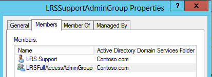

# <a name="deploy-srs-v1-administrative-web-portal-in-skype-for-business-server"></a>Déploiement du portail Web d’administration de SRS v1 dans Skype entreprise Server

Le portail Web d’administration Skype entreprise Server Skype Room Systems v1 (SRS v1, anciennement appelé Lync Room System) est un portail Web que les organisations peuvent utiliser pour gérer leurs salles de conférence de Skype Room Systems. Les administrateurs peuvent utiliser le portail Web d’administration de SRS v1 pour surveiller l’état de l’appareil, par exemple en surveillant les périphériques audio/vidéo. Grâce à ce portail, les administrateurs peuvent collecter à distance des informations de diagnostic pour surveiller l’état de la salle de conférence.

Pour utiliser cette fonctionnalité, le portail Web d’administration de SRS v1 doit être déployé sur chaque serveur frontal Skype entreprise Server. Ce guide fournit aux administrateurs des instructions sur l’installation et la configuration du portail Web d’administration de SRS. Elle est destinée aux administrateurs qui ont des connaissances sur l’administration de Skype entreprise Server et qui disposent des droits d’administrateur pour modifier la topologie Skype entreprise Server.

Une fois que le portail Web d’administration de SRS v1 est déployé sur le serveur, les administrateurs peuvent vérifier l’état des appareils SRS v1 en ouvrant une session sur le site à partir de leurs propres ordinateurs ou portables.

> [!IMPORTANT]
> Téléchargez le [portail Web d’administration de Microsoft Skype Room Systems v1 pour Skype entreprise Server 2015](https://www.microsoft.com/download/details.aspx?id=46906).

Dans cet article :

- [Configuration de votre environnement pour le portail Web d’administration de SRS v1](room-system-v1-administrative-web-portal.md#Config_Env)

- [Installer le portail Web d’administration de SRS v1](room-system-v1-administrative-web-portal.md#Install_SRS)

- [Utiliser le portail Web d’administration de SRS](room-system-v1-administrative-web-portal.md#Use_Portal)

## <a name="configure-your-environment-for-the-srs-v1-administrative-web-portal"></a>Configuration de votre environnement pour le portail Web d’administration de SRS v1
<a name="Config_Env"> </a>

Pour utiliser le portail Web d’administration de SRS v1, vous devrez installer ou configurer les éléments prérequis suivants.

> [!IMPORTANT]
> Si le serveur est configuré avec l’authentification Kerberos et NTLM et que SRS est en cours d’exécution sur un ordinateur qui n’est pas lié au domaine, l’authentification Kerberos échoue et l’utilisateur ne voit pas l’état de SRS dans le portail d’administration. Pour résoudre ce problème, configurez le serveur avec l’authentification NTLM ou l’authentification NTLM et TLS-DSK (sans Kerberos) ou associez l’ordinateur SRS au domaine.

1. Installez les mises à jour cumulatives de Skype entreprise Server dans la topologie Skype entreprise Server.

    Pour obtenir la mise à jour ou voir ce qu’elle contient, reportez-vous à la rubrique [mises à jour pour Skype entreprise Server 2015](https://support.microsoft.com/help/3061064/updates-for-skype-for-business-server-2015).

2. Créez un utilisateur Active Directory compatible SIP.

    Le portail Web d’administration de SRS v1 utilise ces informations d’identification pour demander des informations à partir de Skype entreprise Server. Le nom d’utilisateur dans les exemples donnés est LRSApp.

3. Créez un groupe de sécurité Active Directory avec le nom LRSSupportAdminGroup.

    Créez le groupe avec une étendue de groupe globale et de type de groupe comme sécurité. Les utilisateurs à extension SIP qui sont ajoutés à ce groupe seront autorisés à afficher la liste des salles et à exécuter certaines commandes, telles que la collecte des journaux.

4. Créez un groupe de sécurité Active Directory avec le nom LRSFullAccessAdminGroup.

    Créez le groupe avec une étendue de groupe comme global et un type de groupe pour les utilisateurs activés pour la sécurité. SIP qui sont ajoutés à ce groupe sont autorisés à utiliser toutes les fonctionnalités du portail d’administration sur une seule salle Skype. Pour inclure la prise en charge de la gestion en bloc des salles Skype, reportez-vous à l’étape 5.

     

5. Créez un groupe de sécurité Active Directory avec le nom LRSPowerUserAdminsGroup.

    Créez le groupe avec une étendue de groupe globale et de type de groupe comme sécurité. Les utilisateurs activés pour SIP qui sont ajoutés à ce groupe sont autorisés à utiliser toutes les fonctionnalités du portail d’administration, y compris la gestion en bloc des salles Skype entreprise.

6. Ajoutez LRSFullAccessAdminGroup en tant que membre de LRSSupportAdminGroup.

     

7. Créez un utilisateur Active Directory activé pour SIP avec le nom LRSSupport. Ajoutez cet utilisateur à LRSSupportAdminGroup.

     

8. Installez [ASP.NET MVC 4 pour Visual Studio 2010 SP1 et Visual Web developer 2010 SP1](https://go.microsoft.com/fwlink/p/?LinkId=323967).

## <a name="install-the-srs-v1-administrative-web-portal"></a>Installer le portail Web d’administration de SRS v1
<a name="Install_SRS"> </a>

Téléchargez le [portail Web d’administration de Microsoft Skype Room Systems v1 pour Skype entreprise Server 2015](https://www.microsoft.com/download/details.aspx?id=46906).

Pour installer le portail Web d’administration de SRS v1, procédez comme suit.

1. Configurez le port d’applications approuvées en exécutant l’applet de commande suivante dans Skype entreprise Server Management Shell :

   ```powershell
   Set-CsWebServer -Identity POOLFQDN -MeetingRoomAdminPortalInternalListeningPort 4456 -MeetingRoomAdminPortalExternalListeningPort 4457
   ```

2. Pour installer le portail de salle de réunion, téléchargez **MeetingRoomPortalInstaller. msi** , puis exécutez-le en tant qu’administrateur.

3. Ouvrez le fichier Web. config à partir de l’emplacement suivant :

    % Program Files%\Skype for Business Server 2015 \ Web Components\Meeting Room Portal\Int\Handler\

4. Dans le fichier Web. config, remplacez PortalUserName par le nom d’utilisateur créé à l’étape 2 sous la section «[configurer votre environnement pour le portail Web d’administration de SRS v1](room-system-v1-administrative-web-portal.md#Config_Env)» (le nom recommandé à l’étape est LRSApp) :

    ```xml
    <add key="PortalUserName" value="sip:LRSApp@domain.com" />
    ```

5. Étant donné que le portail d’administration de SRS v1 est une application approuvée, vous n’avez pas besoin de fournir le mot de passe dans la configuration du portail. Si cet utilisateur utilise un autre bureau d’enregistrement que le serveur d’inscriptions local, vous devez spécifier le serveur d’inscriptions en ajoutant la ligne suivante dans le fichier Web. config :

   ```xml
   <add key="PortalUserRegistrarFQDN" value="pool-xxxx.domain.com" />
   ```

6. Si le port utilisé n’est pas 5061, ajoutez la ligne suivante dans le fichier Web. config :

   ```xml
   <add key="PortalUserRegistrarPort" value="5061" />
   ```

### <a name="verify-installation-of-the-srs-administrative-web-portal"></a>Vérifier l’installation du portail Web d’administration de SRS

Pour vérifier l’installation du portail Web d’administration de SRS v1, procédez comme suit :

1. Sur un serveur frontal, accédez à l’URL suivante :

    https:// \<fe-server\> /LRS

    Vous ne devez pas voir les erreurs, comme illustré dans l’image suivante :

     

2. Si aucune erreur ne s’affiche, essayez d’accéder à l’URL suivante à partir de n’importe quel autre ordinateur de la topologie :

    https:// \<fe-server\> /LRS

    Pour accéder à la page, vous devez ajouter les enregistrements DNS comme décrit dans la section «[enregistrements DNS requis pour la connexion automatique des clients](https://go.microsoft.com/fwlink/p/?LinkId=318056)».

## <a name="use-the-srs-administrative-web-portal"></a>Utiliser le portail Web d’administration de SRS
<a name="Use_Portal"> </a>

Après avoir déployé SRS sur le serveur, vous pouvez vérifier l’état de toutes les salles SRS en vous connectant au portail Web d’administration de SRS v1 à partir d’un navigateur.

### <a name="sign-in"></a>Connexion

1. Accédez à l’URL suivante :

    https:// \<fe-server\> /LRS

2. Entrez les informations d’identification du compte LRSSupport ou d’un compte qui a été ajouté au groupe de sécurité LRSSupportAdminGroup.


### <a name="srs-administrative-web-portal-summary-page"></a>Page Résumé du portail Web d’administration de SRS

La page de résumé fournit les informations suivantes pour toutes les salles SRS déployées sur le serveur :

- **Balise** Nom personnalisé que l’administrateur fournit à la salle. La balise peut être définie dans le portail en cliquant sur le nom de la salle.

- **Intégrité** L’état d’intégrité de la salle, qui est dérivé de l’état d’intégrité agrégé de la salle, qui est affiché sous la section intégrité de la page Paramètres de la salle.

- **Réunion suivante** Date et heure de la prochaine réunion planifiée.

- **Version SRS, fabricant, modèle** Ces valeurs sont prédéfinies dans SRS. En fonction du fabricant, ces champs peuvent rester vides.

- **Dernière actualisation** Affiche la date de la dernière actualisation de la page Web.


> [!NOTE]
> Vous ne verrez le menu de gestion en bloc que si vous êtes membre du groupe de sécurité LRSPowerUserAdminsGroup.

### <a name="srs-room-information"></a>Informations sur la salle SRS

La section informations sur la salle du portail vous permet d’afficher et de configurer des salles SRS individuelles. Il contient quatre sections : paramètres, détails, journalisation et intégrité.

#### <a name="settings"></a>Paramètres

Dans la section paramètres, vous pouvez définir le mot de passe, la balise Room et les niveaux de volume par défaut pour la salle. Si vous configurez ces paramètres, les modifications ne sont répliquées qu’une fois que vous avez redémarré la console SRS. Vous verrez uniquement les paramètres de mise à jour du système pour les appareils SRS utilisant la version 15,12 et les versions ultérieures.


#### <a name="details"></a>Détails

La section Détails fournit une synthèse en lecture seule des paramètres de la salle des SRS, notamment : l’heure de la dernière actualisation ; réunion suivante ; dernières mises à jour, maintenance et étalonnage ; paramètres de haut-parleur, micro et sonnerie par défaut ; version9.0.2 URI SIP ; nombre d’écrans et détails sur chaque écran ; État et activité.


#### <a name="troubleshooting"></a>Résolution des problèmes

La section Troubleshooting peut être utilisée pour collecter des journaux à distance et les enregistrer à un emplacement spécifié. Vous pouvez également redémarrer la console SRS (interface utilisateur SRS) ou redémarrer l’ensemble du système. Pour collecter les journaux, fournissez un chemin d’accès au dossier au format spécifié et assurez-vous que le dossier dispose des autorisations d’écriture accordées au compte de l’ordinateur SRS. Si la taille du journal est trop importante, la collecte des journaux peut prendre jusqu’à 5 minutes. L’actualisation de la page vous donnera le dernier État.

#### <a name="health"></a>Intégrité

La section Health fournit une indication visuelle de l’intégrité de la connexion Skype entreprise Server, du périphérique audio, du périphérique vidéo, de l’état de résistance et de l’écran.


### <a name="additional-notes-about-the-administrative-web-portal"></a>Remarques supplémentaires sur le portail Web d’administration

> [!NOTE]
>  Les modifications de paramètres ne sont appliquées qu’après le redémarrage du système SRS. > si le mot de passe du compte LRSApp expire, vous ne pourrez pas voir l’état des salles. Configurez le mot de passe du compte LRSAppuser de sorte qu’il n’expire jamais ou veillez à mettre à jour le mot de passe lorsqu’il est proche de l’expiration. > le portail Web d’administration de SRS est pris en charge uniquement pour les déploiements locaux.

### <a name="bulk-management"></a>Gestion en bloc

La gestion en bloc des salles SRS est une fonctionnalité conçue pour les administrateurs informatiques avancés, pour simplifier leur flux de travail et leur permettre d’utiliser un outil pratique permettant de gérer à distance plusieurs salles de manière globale.

Pour afficher cette fonctionnalité, l’utilisateur doit être approvisionné en tant que membre du groupe de sécurité spécial **LRSPowerUserAdminsGroup**.

Il n’y a pas de limite au nombre de salles SRS que vous pouvez sélectionner pour la gestion en bloc. Toutefois, vous ne pouvez effectuer qu’une seule opération de gestion en bloc à la fois.

Pour effectuer une opération de gestion en bloc, sélectionnez les salles à surveiller, puis cliquez sur le menu gestion en bloc.

### <a name="frequently-asked-questions"></a>Questions fréquemment posées

#### <a name="why-cant-i-sign-in-to-the-administrative-web-portal"></a>Pourquoi ne puis-je pas me connecter au portail Web d’administration ?

Lorsque vous ouvrez https://localhost/lrs , vous pouvez voir la page de connexion, mais lorsque vous tapez vos informations d’identification, vous ne pouvez pas vous connecter. Dans ce cas, vous devez ouvrir https://FQDNofFEserver/SRS la session pour vous connecter au portail Web d’administration.

#### <a name="why-cant-i-see-srs-v1-in-the-administrative-web-portal"></a>Pourquoi ne puis-je pas voir SRS v1 dans le portail Web d’administration ?

- Assurez-vous que vous avez des comptes SRS dans votre déploiement et qu’ils sont créés conformément aux recommandations de déploiement du portail Web d’administration de SRS. Assurez-vous que les comptes SRS sont configurés à l’aide de Enable-CsMeetingRoom, et non pas Enable-CsUser, sur le serveur Skype entreprise.

- Si vous avez créé des comptes SRS et que vous ne voyez pas les comptes dans le portail Web d’administration, collectez les journaux du serveur à l’aide de l’outil de journalisation Skype entreprise Server avec le composant **MeetingPortal** sélectionné, puis envoyez-les à votre contact de support SRS.

- Si vous avez créé des comptes SRS et que vous ne parvenez pas à voir les comptes dans le portail Web d’administration, collectez les journaux client à l’aide de Fiddler et copiez également le journal de console à partir des outils de développement de navigateur, puis envoyez-les à votre contact de support SRS. Vous pouvez également modifier la valeur de niveau de suivi dans le fichier Web. config pour obtenir un journal plus détaillé.

  ```xml
  <system.diagnostics>
    <switches>
      <!--
      This switch controls logging message levels. 0 implies
      logging is turned off. 1 implies only errors are logged,
      2 implies errors &amp; warnings. 4 is the most detailed.
      -->
      <add name="TraceLevelSwitch" value="3" />
    </switches>
  </system.diagnostics>
  ```

#### <a name="why-cant-i-see-the-status-of-srs-in-the-administrative-web-portal"></a>Pourquoi ne puis-je pas voir l’état de SRS dans le portail Web d’administration ?

- Assurez-vous que le compte d’utilisateur LRSApp est compatible SIP.

- Si vous rencontrez encore des problèmes, récupérez le fichier **trace. log** dans le système SRS à partir de D:\Tracing\LRSAdminLogs, \, puis envoyez-le à votre contact de support SRS.

#### <a name="why-cant-i-see-the-bulk-management-menus-for-srs-in-the-administrative-web-portal"></a>Pourquoi ne puis-je pas voir les menus de gestion en bloc pour SRS dans le portail Web d’administration ?

Assurez-vous que le compte d’utilisateur LRSApp est compatible SIP et qu’il fait partie du groupe de sécurité LRSPowerUserAdminsGroup.

#### <a name="does-the-srs-v1-administrative-web-portal-work-with-microsoft-teams-rooms"></a>Le portail Web d’administration de SRS v1 fonctionne-t-il avec les salles Microsoft teams ?

Non.


