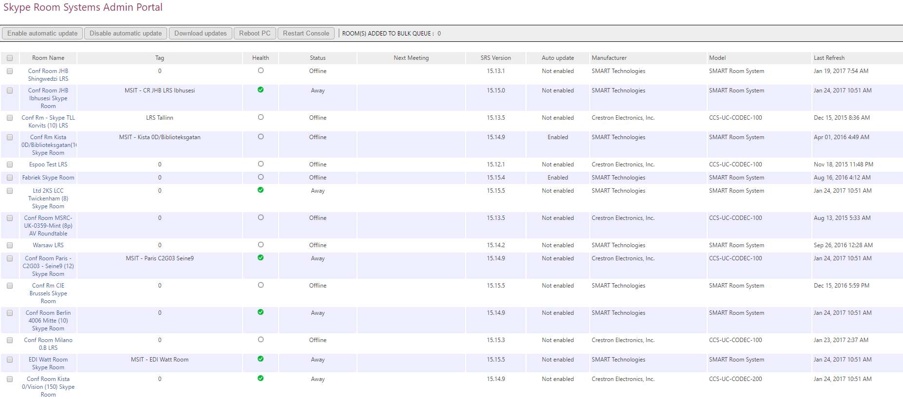

# <a name="deploy-srs-v1-administrative-web-portal-in-skype-for-business-server-2015"></a>Déploiement du portail Web d’administration de SRS v1 pour Skype Entreprise Server 2015
 
Le Skype pour systèmes de salle Skype Business Server 2015 v1 (v1 SRS, anciennement appelé système de salle Lync) d’administration Web Portal est un portail web que les organisations peuvent utiliser pour gérer leurs salles de conférence de systèmes de salle de Skype. Les administrateurs peuvent utiliser le portail Web d’administration de SRS v1 pour surveiller des état de santé, par exemple en surveillant les périphériques audio et vidéo. Ils peuvent également collecter à distance des informations de diagnostic pour surveiller l’intégrité des salles de conférence.
  
Pour utiliser cette fonctionnalité, le portail Web d’administration de SRS v1 doit être déployé sur chaque Skype pour Business Server serveur frontal. Ce guide fournit des instructions aux administrateurs sur l’installation et la configuration du portail Web d’administration SRS. Il est destiné aux administrateurs qui ont des connaissances de Skype pour l’administration du serveur de l’entreprise, et qui disposent des droits d’administrateur pour modifier le Skype pour la topologie du serveur de l’entreprise.
  
Après le SRS v1 d’administration Web Portal est déployé sur le serveur, les administrateurs peuvent vérifier les statuts des périphériques v1 SRS en ouvrant une session le site à partir de leurs propres ordinateurs portables ou d’ordinateurs. 
  
> [!IMPORTANT]
> Télécharger le [Microsoft Skype de portail Web d’administration systèmes v1 Skype pour Business Server 2015 l’espace](https://www.microsoft.com/en-us/download/details.aspx?id=46906). 
  
Contenu de cette rubrique :
  
- [Configurer votre environnement pour le portail Web d’administration de SRS v1](room-system-v1-administrative-web-portal.md#Config_Env)
    
- [Installez le portail d’administration de Web de v1 SRS](room-system-v1-administrative-web-portal.md#Install_SRS)
    
- [Utilisation du portail Web d’administration de SRS](room-system-v1-administrative-web-portal.md#Use_Portal)
    
## <a name="configure-your-environment-for-the-srs-v1-administrative-web-portal"></a>Configuration de votre environnement pour le portail Web d’administration de SRS v1
<a name="Config_Env"> </a>

Pour utiliser le portail Web d’administration de SRS v1, vous devez remplir les conditions préalables suivantes.
  
> [!IMPORTANT]
> Si le serveur est configuré avec les authentifications Kerberos et NTLM, et que SRS est en cours d’exécution sur un ordinateur non associé au domaine, l’authentification Kerberos échouera et l’utilisateur ne pourra pas visualiser le statut de SRS sur le portail d’administration. Pour résoudre ce problème, configurez le serveur avec l’authentification NTLM, ou avec les authentifications NTLM et TLS-DSK (sans Kerberos), ou associez l’ordinateur SRS au domaine. 
  
1. Installez Skype pour les mises à jour cumulatives Business Server dans le Skype pour la topologie du serveur de l’entreprise. 
    
    Pour obtenir la mise à jour ou de voir ce qui est inclus avec lui, reportez-vous à la section [mises à jour pour Skype pour Business Server 2015](https://support.microsoft.com/en-us/help/3061064/updates-for-skype-for-business-server-2015).
    
2. Créez un utilisateur Active Directory activé pour SIP.
    
    Le portail Web d’administration de SRS v1 utilise ces informations d’identification pour demander des informations à partir de Skype pour Business Server. Le nom d’utilisateur dans les exemples présentés est LRSApp.
    
3. Créez un groupe de sécurité Active Directory nommé LRSSupportAdminGroup.
    
    Créez le groupe avec une étendue globale et le type Sécurité. Les utilisateurs activés pour SIP ajoutés à ce groupe seront autorisés à afficher la liste des pièces et à exécuter certaines commandes, telles que la collecte de journaux.
    
4. Créez un groupe de sécurité Active Directory nommé LRSFullAccessAdminGroup.  
    
    Créez le groupe avec une étendue globale et le type Sécurité. Les utilisateurs activés pour SIP ajoutés à ce groupe sont autorisés à utiliser toutes les fonctionnalités du portail d’administration dans une seule salle Skype. Pour inclure la prise en charge de la gestion en bloc de salles Skype, reportez-vous à l’étape 5.  
    
     
  
5. Créez un groupe de sécurité Active Directory nommé LRSPowerUserAdminsGroup. 
    
    Créez le groupe avec une étendue globale et le type Sécurité. Utilisateur activé SIP qui est ajoutés à ce groupe est autorisés à utiliser toutes les fonctionnalités de portail administration y compris la gestion de bloc de Skype pour les locaux de l’entreprise. 
    
6. Ajoutez SRSFullAccessAdminGroup comme membre du groupe LRSSupportAdminGroup.
    
     
  
7. Créez un utilisateur Active Directory activé pour SIP avec le nom LRSSupport. Ajoutez cet utilisateur au groupe LRSSupportAdminGroup.
    
     
  
8. Installez [ASP.NET MVC 4 pour Visual Studio 2010 SP1 et Visual Web Developer 2010 SP1](http://go.microsoft.com/fwlink/p/?LinkId=323967).
    
## <a name="install-the-srs-v1-administrative-web-portal"></a>Installation du portail Web d’administration de SRS v1
<a name="Install_SRS"> </a>

Télécharger le [Microsoft Skype de portail Web d’administration systèmes v1 Skype pour Business Server 2015 l’espace](https://www.microsoft.com/en-us/download/details.aspx?id=46906). 
  
Pour installer le portail Web d’administration de SRS v1, procédez comme suit.
  
1. Configurer le Port d’Application de confiance en exécutant l’applet de commande suivante dans Skype pour Business Server Management Shell :
    
   ```
   Set-CsWebServer -Identity POOLFQDN -MeetingRoomAdminPortalInternalListeningPort 4456 -MeetingRoomAdminPortalExternalListeningPort 4457
   ```

2. Pour installer le portail d’administration de salles de réunions, téléchargez **MeetingRoomPortalInstaller.msi**, puis exécutez-le en tant qu’administrateur.
    
3. Ouvrez le fichier Web.config à partir de l’emplacement suivant :
    
    %Program Files%\Skype for Business Server 2015\Web Components\Meeting Room Portal\Int\Handler\
    
4. Dans le fichier Web.Config, modifiez la PortalUserName pour le nom d’utilisateur créé à l’étape 2 dans la section «[configurer votre environnement pour le portail Web d’administration de SRS v1](room-system-v1-administrative-web-portal.md#Config_Env)» (le nom recommandé lors de l’étape est LRSApp) : 
    
    ```
    <add key="PortalUserName" value="sip:LRSApp@domain.com" />
    ```

5. Comme le portail d’administration de SRS v1 est une application approuvée, vous n’avez pas besoin d’indiquer le mot de passe dans la configuration du portail. Si cet utilisateur utilise un autre serveur d’inscriptions que le serveur d’inscriptions local, vous devez le spécifier en ajoutant la ligne suivante dans le fichier Web.Config :  
    
   ```
   <add key="PortalUserRegistrarFQDN" value="pool-xxxx.domain.com" />
   ```

6. Si le port utilisé n’est autre que 5061, ajoutez la ligne suivante dans le fichier Web.Config : 
    
   ```
   <add key="PortalUserRegistrarPort" value="5061" />
   ```

### <a name="verify-installation-of-the-srs-administrative-web-portal"></a>Vérification du portail Web d’administration de SRS

Pour vérifier l’installation du portail Web d’administration de SRS v1, procédez comme suit :
  
1. Sur un serveur frontal, accédez à l’URL suivante :
    
    https://\<fe-serveur\>/lrs
    
    Aucune erreur ne doit s’afficher, comme dans l’image suivante :
    
     
  
2. Si aucune erreur ne s’affiche, essayez d’accéder à l’URL suivante à partir d’un autre ordinateur dans la topologie :
    
    https://\<fe-serveur\>/lrs
    
    Pour accéder à la page, vous devrez ajouter les enregistrements DNS, comme décrit dans «[requis des enregistrements DNS pour automatique Client connexion](https://go.microsoft.com/fwlink/p/?LinkId=318056). »
    
## <a name="use-the-srs-administrative-web-portal"></a>Utilisation du portail Web d’administration de SRS
<a name="Use_Portal"> </a>

Une fois que vous avez déployé SRS sur le serveur, vous pouvez vérifier le statut de toutes les salles LRS en vous connectant au portail Web d’administration de SRS v1 à partir d’un navigateur.
  
### <a name="sign-in"></a>Connexion

1. Accédez à l’URL suivante :
    
    https://\<fe-serveur\>/lrs
    
2. Entrez les données d’identification du compte LRSSupport ou d’un compte ajouté au groupe de sécurité LRSSupportAdminGroup.
    

  
### <a name="srs-administrative-web-portal-summary-page"></a>Page Récapitulatif du portail Web d’administration de SRS

La page Récapitulatif fournit les informations ci-dessous pour toutes les salles SRS déployées sur le serveur :
  
- **Balise** Le nom personnalisé qui donne à l’administrateur de l’espace. Le libellé peut être défini sur le portail en cliquant sur le nom de la salle.
    
- **Santé** L’état de santé de la pièce, qui est dérivée de l’état de santé globale de l’espace, ce qui est indiqué dans la section État de la page Paramètres de l’espace.
    
- **Prochaine réunion** Date et heure de que la prochaine réunion.
    
- **SRS Version, fabricant, modèle** Ces valeurs sont prédéfinies dans SRS. Selon la marque, ces champs peuvent rester vides.
    
- **Dernière actualisation** Affiche la dernière actualisation de la page web.
    

  
> [!NOTE]
> Vous verrez seulement le menu de gestion de bloc si vous faites partie du groupe de sécurité LRSPowerUserAdminsGroup. 
  
### <a name="srs-room-information"></a>Informations sur la salle SRS

La section Informations sur la salle du portail permet d’afficher et de configurer des salles SRS individuelles. Elle contient quatre sections : Paramètres, Détails, Journalisation et Intégrité.
  
#### <a name="settings"></a>Paramètres

Dans la section Paramètres, vous pouvez définir le mot de passe, le libellé de la salle et les niveaux de volume par défaut pour la salle. Si vous configurez ces paramètres, les modifications sont répliquées uniquement après le redémarrage de la console SRS. Les paramètres des mises à jour système seront visibles uniquement pour les périphériques SRS utilisant la version 15.12 ou une version ultérieure.
  

  
#### <a name="details"></a>Détails

La section de détails fournit un résumé en lecture seule, les paramètres de l’espace SRS, y compris : l’heure de dernière actualisation ; prochaine réunion ; dernières mises à jour, de maintenance et étalonnage ; par défaut haut-parleur, micro et paramètres de la sonnerie. version ; URI SIP ; nombre d’écrans et les détails de chaque écran. état et l’activité.
  

  
#### <a name="troubleshooting"></a>Résolution des problèmes

La section Dépannage peut être utilisée pour collecter à distance les journaux et les enregistrer à un emplacement spécifié. Vous pouvez également redémarrer la console SRS (interface utilisateur SRS) ou redémarrer tout le système. Pour collecter des journaux, fournissez un chemin d’accès à un dossier au format spécifié et assurez-vous que ce dossier accorde des autorisations en écriture au compte de l’ordinateur SRS. Si la taille du journal est trop volumineuse, la collecte peut prendre jusqu’à 5 minutes. Actualisez la page pour obtenir le dernier statut.
  
#### <a name="health"></a>Intégrité

La section santé donne une indication visuelle de l’état de santé de la Skype pour Business Server connexion périphérique audio, dispositif vidéo, état de résilience et dispositif d’écran.
  

  
### <a name="additional-notes-about-the-administrative-web-portal"></a>Remarques supplémentaires concernant le portail Web d’administration

> [!NOTE]
>  Modifications des paramètres sont appliquées uniquement après le redémarrage du système SRS. > Si le mot de passe du compte LRSApp arrive à expiration, vous ne serez pas en mesure de voir l’état des salles. Configurer le mot de passe du compte LRSAppuser pour qu’il expire, jamais ou veillez à mettre à jour le mot de passe lorsqu’il est près d’expiration. > portail d’administration web le SRS est pris en charge pour les déploiements sur site uniquement.
  
### <a name="bulk-management"></a>Gestion en bloc 

La gestion en bloc des salles SRS est une fonctionnalité conçue pour les administrateurs informatiques avancés, afin de simplifier leur flux de travail, et de leur proposer un outil rapide de gestion à distance de différentes salles en bloc.
  
Pour afficher cette fonctionnalité, l’utilisateur doit être approvisionné en tant que membre du groupe de sécurité spécial **LRSPowerUserAdminsGroup**.   
  
Le nombre de salles SRS que vous pouvez sélectionner pour la gestion en bloc est illimité. Toutefois, vous pouvez réaliser une seule opération de gestion en bloc à la fois.
  
Pour effectuer une opération de gestion en bloc, sélectionnez les salles à surveiller et cliquez sur le menu de gestion en bloc.  
  
### <a name="frequently-asked-questions"></a>Forum aux questions

#### <a name="why-cant-i-sign-in-to-the-administrative-web-portal"></a>Pourquoi n’arrive pas à me connecter au portail web d’administration ?

Lorsque vous ouvrez https://localhost/lrs, vous ne pourrez pas voir la page de connexion, mais lorsque vous tapez dans vos informations d’identification, vous ne pouvez pas vous connecter. Dans ce cas, vous devez ouvrir https://FQDNofFEserver/SRS pour vous connecter au portail web d’administration.
  
#### <a name="why-cant-i-see-srs-v1-in-the-administrative-web-portal"></a>Pourquoi ne puis-je pas voir v1 SRS dans le portail web d’administration ?

- Assurez-vous que votre déploiement comporte des comptes SRS et qu’ils ont été créés selon les recommandations de déploiement du portail Web d’administration de SRS. Assurez-vous que les comptes SRS sont mis en service à l’aide d’activer-CsMeetingRoom, pas Enable-CsUser, sur le Skype pour Business Server.
    
- Si vous avez créé des comptes SRS et que vous ne voyez pas les comptes dans le portail d’administration web, collecter les journaux du serveur à l’aide de la Skype pour outil de journalisation sur le serveur Business sélectionné le composant **MeetingPortal** et puis de les envoyer à votre contact de prise en charge du service SRS.
    
- Si vous avez créé des comptes SRS et que vous ne les voyez pas sur le portail Web d’administration, collectez les journaux clients à l’aide de Fiddler, copiez également le journal de la console à partir des outils de développement du navigateur et envoyez-les à votre contact d’assistance pour SRS. Vous pouvez également modifier la valeur de niveau du suivi dans le fichier Web.config pour obtenir un journal plus détaillé.
    
  ```
  <system.diagnostics>
    <switches>
      <!-- 
      This switch controls logging message levels. 0 implies
      logging is turned off. 1 implies only errors are logged,
      2 implies errors &amp; warnings. 4 is the most detailed.
      -->
      <add name="TraceLevelSwitch" value="3" />
    </switches>
  </system.diagnostics>
  ```

#### <a name="why-cant-i-see-the-status-of-srs-in-the-administrative-web-portal"></a>Pourquoi n’arrive pas à voir le statut de SRS dans le portail web d’administration ?

- Assurez-vous que le compte d’utilisateur LRSApp est activé pour SIP.
    
- Si vous rencontrez toujours des problèmes, collecte le fichier **Trace.log** dans le système SRS à partir de D:\Tracing\LRSAdminLogs\, et l’envoyer à votre contact de prise en charge du service SRS.
    
#### <a name="why-cant-i-see-the-bulk-management-menus-for-srs-in-the-administrative-web-portal"></a>Pourquoi ne puis-je pas voir les menus de gestion en bloc pour SRS dans le portail d’administration de web ?

Assurez-vous que le compte d’utilisateur LRSApp est activé pour SIP et fait partie du groupe de sécurité LRSPowerUserAdminsGroup. 
  
#### <a name="does-the-srs-v1-administrative-web-portal-work-with-skype-room-systems-v2"></a>Le portail Web d’administration de SRS v1 fonctionne-t-il avec Skype Room Systems v2 ?

Non
  

