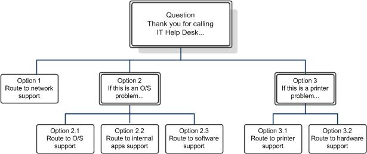

# <a name="designing-and-creating-response-group-workflows-in-skype-for-business"></a>Conception et création de flux de travail Response Group dans Skype Entreprise

Concevez et créez des flux de travail Response Group, Skype Entreprise Server Voix Entreprise. Les flux de travail de groupe de recherche et les flux de travail interactifs sont abordés.

Un flux de travail définit le comportement d’un appel, depuis le déclenchement de la sonnerie du téléphone jusqu’au moment où une personne répond à l’appel. Le flux de travail spécifie la file d’attente à utiliser pour la tenue de l’appel et spécifie la méthode de routage à utiliser pour les flux de travail de groupe de recherche ou les questions et réponses à utiliser pour les flux de travail Response Group interactifs.

Un flux de travail définit également des paramètres comme un message de bienvenue, l’attente musicale, les heures de bureau et les vacances.

> [!NOTE]
> Vous devez créer des groupes d’agents et des files d’attente avant de créer un flux de travail qui les utilise.

## <a name="creating-or-modifying-a-hunt-group-workflow"></a>Création ou modification d’un flux de travail de groupe de recherche

### <a name="to-use-response-group-configuration-tool-to-create-or-modify-a-hunt-group-workflow"></a>Pour utiliser l’outil de configuration Response Group pour créer ou modifier un flux de travail de groupe de recherche

1. Ouvrez une session en tant que membre du groupe RTCUniversalServerAdmins ou en tant que membre d’un des rôles d’administration prédéfinis prenant en charge Response Group.

2. Ouvrez une fenêtre de navigateur, puis entrez l’URL d’administration pour ouvrir Skype Entreprise Server panneau de bord.

3. Dans la barre de navigation de gauche, cliquez sur **Groupes Response Group**, puis sur **Flux de travail**.

4. Sur la page **Flux de travail**, cliquez sur **Créer ou modifier un flux de travail**.

5. Dans le champ de recherche **Sélectionner un service**, tapez entièrement ou partiellement le nom du service **ApplicationServer** qui héberge le flux de travail que vous voulez créer ou modifier. Dans la liste de services obtenue, cliquez sur le service de votre choix, puis sur **OK**.

    > [!NOTE]
    > L’outil de configuration Response Group s’ouvre. Vous pouvez également ouvrir l’outil de configuration Response Group directement à partir d’un navigateur web en tapant l’URL suivante : https:// \<webPoolFqdn\> /RgsConfig.

6. Effectuez l'une des opérations suivantes :

   - Sous **Créer un flux de travail**, en regard de **Groupe de recherche**, cliquez sur **Créer**.

   - Sous **Gérer un flux de travail existant**, recherchez le flux de travail que vous souhaitez modifier, puis sous **Action**, cliquez sur **Modifier**.

7. Si vous êtes prêt et que les utilisateurs peuvent commencer à appeler le flux de travail, activez la case à cocher **Activer le flux de travail**.

    > [!NOTE]
    >  Si vous créez un flux de travail géré, vous devez sélectionner **Activer le flux de travail.** Une fois le flux de travail géré actif enregistré, vous pouvez ensuite le modifier et le désactiver.

8. Pour autoriser les utilisateurs fédérés à appeler le groupe, activez la case à cocher **Activer pour la fédération**. Vous devez également avoir une stratégie d’accès externe qui s’applique à l’application Response Group configurée pour la fédération.

    > [!NOTE]
    > La stratégie d’accès externe globale s’applique à l’application Response Group. Vous pouvez configurer la stratégie globale pour la fédération response group à l’aide du Panneau de configuration Skype Entreprise Server ou à l’aide de l’cmdlet **Set-CsExternalAccessPolicy** pour définir le paramètre EnableOutsideAccess sur True. Gardez à l’esprit que les paramètres de stratégie globale s’appliquent à tous les utilisateurs sauf s’ils se voient affectés un site ou une stratégie utilisateur. Par conséquent, avant de modifier ce paramètre pour les groupes Response Group, assurez-vous que le paramètre de fédération satisfait les exigences de votre organisation. Pour plus d’informations sur l’application de stratégies à des utilisateurs, voir [Manage External Access Policy for Your Organization](/previous-versions/office/lync-server-2013/lync-server-2013-manage-external-access-policy-for-your-organization). Pour plus d’informations sur le paramètre de fédération, voir [Set-CsExternalAccessPolicy](/powershell/module/skype/set-csexternalaccesspolicy?view=skype-ps).

    > [!NOTE]
    > Les utilisateurs hébergés dans Skype Entreprise Online ne peuvent pas appeler des groupes Response Groups hébergés dans un déploiement local. Cela est vrai dans les déploiements hybrides et dans les cas où un déploiement local est fédéré avec un déploiement Skype Entreprise Online.

9. Pour masquer l’identité des agents pendant les appels, activez la case à cocher **Activer l’anonymat de l’agent**.

    > [!NOTE]
    > Les appels anonymes ne peuvent pas démarrer avec la messagerie instantanée ou la vidéo, mais l’agent ou l’appelant peut ajouter la messagerie instantanée et la vidéo une fois que l’appel a commencé. Un agent anonyme peut aussi mettre des appels en attente, transférer des appels (transferts invisibles et consultatifs), mais aussi parquer et récupérer des appels. Les appels anonymes ne prennent pas en charge la conférence, le partage d’application, le partage du Bureau, le transfert de fichiers, le tableau blanc, la collaboration de données et l’enregistrement d’appel. Les agents qui utilisent le plug-in Lync VDI peuvent recevoir des appels entrants de manière anonyme, mais ils ne peuvent pas effectuer d’appels sortants de manière anonyme.

10. Sous **Entrez l’adresse du groupe qui recevra les appels**, cliquez sur l’adresse URI SIP principale du groupe qui doit prendre les appels vers le flux de travail.

    > [!NOTE]
    > L’URI principal pour un flux de travail définit les modalités d’identification et de référencement du flux de travail. L’URI SIP que vous entrez est créé en tant qu’objet contact dans les services de domaine Active Directory. Pour créer l’URI, l’objet doit être unique dans Active Directory.

11. Dans **le nom d’affichage,** tapez le nom que vous souhaitez afficher pour le flux de travail (par exemple, Sales Response Group).

    > [!NOTE]
    > N’insérez pas les caractères « < » ni « > » dans le nom d’affichage. N’utilisez pas les noms d’affichage suivants, car ils sont réservés : **RGS Presence Watcher** ou **Service d’annonce**.

12. Sous **Numéro de téléphone**, tapez l’URI de ligne pour le groupe Response Group (par exemple, +14255550165).

13. Dans **Numéro affiché**, tapez le numéro tel qu’il doit apparaître pour le groupe Response Group (par exemple, +1 (425) 555-0165).

14. (Facultatif) Dans **Description,** tapez une description pour le flux de travail tel que vous souhaitez qu’il apparaisse sur la carte de visite dans Skype Entreprise.

15. Dans **Type de flux de travail**, sélectionnez **Géré** si ce flux de travail doit être géré par un gestionnaire Response Group. Pour affecter des responsables Response Group au flux de travail, faites les opérations suivantes :

    a. Tapez l’URI SIP d’un responsable pour ce flux de travail, puis cliquez sur **Ajouter**.

    b. Tapez l’URI SIP d’autres responsables à ajouter au flux de travail, puis cliquez sur **Ajouter**.

    > [!IMPORTANT]
    > Tous les utilisateurs désignés comme responsables d’un groupe Response Group doivent avoir le rôle CsResponseGroupManager. Si les utilisateurs n’ont pas ce rôle, ils ne peuvent pas gérer les groupes Response Group.

16. Sous **Étape 2 Sélectionner une langue**, cliquez sur la langue que vous souhaitez utiliser pour la reconnaissance vocale et la conversion de texte par synthèse vocale.

17. Si vous souhaitez configurer un message de bienvenue, sous **Étape 3 Configurer un message de bienvenue**, activez la case à cocher **Lisez un message de bienvenue**, puis effectuez l’une des opérations suivantes :

    - Pour entrer le message de bienvenue sous forme de texte converti en message vocal pour les appelants, cliquez sur **Utiliser la synthèse vocale**, puis tapez le message de bienvenue dans la zone de texte.

    > [!NOTE]
    > N’incluez pas de balises HTML dans le texte que vous entrez. Si vous incluez des balises HTML, vous recevrez un message d’erreur.

    - Pour utiliser un enregistrement de fichier son (.wav) ou audio Windows Media (.wma) pour le message de bienvenue, cliquez sur **Sélectionner un enregistrement**. Si vous souhaitez télécharger un nouveau fichier audio, cliquez sur le lien **un enregistrement**. Dans la nouvelle fenêtre de navigateur, cliquez sur **Parcourir**, sélectionnez le fichier audio que vous souhaitez utiliser, puis cliquez sur **Ouvrir**. Cliquez sur **Télécharger** pour charger le fichier audio.

    > [!NOTE]
    > Tous les fichiers audio fournis aux utilisateurs doivent remplir certains critères. Pour plus d’informations sur les formats de fichier pris en charge, voir [Technical Requirements for Response Groups](/previous-versions/office/lync-server-2013/lync-server-2013-technical-requirements-for-response-group).

18. Sous **Étape 4 Spécifier vos heures d’ouverture**, dans la zone **Votre fuseau horaire**, cliquez sur le fuseau horaire du flux de travail.

    > [!NOTE]
    > Il s’agit du fuseau horaire des appelants et des agents du workflow. Il est utilisé pour calculer les heures d’ouverture et de fermeture. Par exemple, si le flux de travail est configuré pour utiliser le fuseau horaire Est de l’Amérique du Nord et que l’ouverture et la fermeture du flux de travail sont planifiées respectivement pour 7 heures et 23 heures, il s’agit de l’heure d’ouverture 7:00 Est et de l’heure de fermeture 23:00 Est. (Vous devez entrer les heures au format 24 heures.)

19. Sélectionnez le type d’heures d’ouverture que vous souhaitez utiliser en effectuant l’une des opérations suivantes :

    - Pour utiliser un planning prédéfini d’heures d’ouverture, cliquez sur **Utiliser un planning prédéfini**, puis sélectionnez le planning souhaité dans la liste déroulante.

      > [!NOTE]
      > Vous devez avoir défini précédemment au moins un planning prédéfini pour pouvoir sélectionner cette option. Vous pouvez spécifier des plannings prédéfinis à l’aide de l’applet de commande **New-CsRgsHoursOfBusiness**. Pour plus d’informations, [voir (facultatif) Définir les heures d’ouverture de Response Group dans Skype Entreprise](optional-define-response-group-business-hours.md).

      > [!NOTE]
      > Lorsque vous sélectionnez un planning prédéfini, les champs **Jour**, **Ouverture** et **Fermeture** sont automatiquement renseignés avec les jours et les heures pendant lesquels le groupe Response Group est disponible.

    - Pour utiliser un planning personnalisé qui s’applique uniquement à ce workflow, cliquez sur **Utiliser un planning personnalisé**.

20. Si vous créez un planning personnalisé pour ce workflow, activez les cases à cocher correspondant aux jours de la semaine pendant lesquels le groupe Response Group est disponible.

21. Si vous créez une planification  personnalisée, tapez les heures d’ouverture et de fermeture pour chaque jour de la semaine où le groupe Response Group est disponible. 

    > [!NOTE]
    > Les heures **Ouverture** et **Fermeture** doivent être au format 24 heures. Par exemple, si votre bureau est ouvert de 9 heures à 17 heures et ferme à midi pour le déjeuner, les heures d’ouverture sont spécifiées comme suit : **Ouverture** 9:00, **Fermeture** 12:00, **Ouverture** 13:00 et **Fermeture** 17:00.

22. Si vous souhaitez que la lecture d’un message se déclenche lorsque le bureau est fermé, activez la case à cocher **Lisez un message lorsque le service Response Group est en dehors des heures d’ouverture**, puis spécifiez le message à lire en effectuant l’une des opérations suivantes :

    - Pour entrer le message sous forme de texte converti en message vocal pour l’appelant, cliquez sur **Utiliser la synthèse vocale**, puis tapez le message dans la zone de texte.

      > [!NOTE]
      > N’incluez pas de balises HTML dans le texte que vous entrez. Si vous incluez des balises HTML, vous recevrez un message d’erreur.

    - Pour utiliser un enregistrement de fichier audio pour le message, cliquez sur **Sélectionner un enregistrement**. Si vous souhaitez télécharger un nouveau fichier audio, cliquez sur le lien **un enregistrement**. Dans la nouvelle fenêtre de navigateur, cliquez sur **Parcourir**, sélectionnez le fichier que vous souhaitez utiliser, puis cliquez sur **Ouvrir**. Cliquez sur **Télécharger** pour charger le fichier audio.

      > [!NOTE]
      > Tous les fichiers audio fournis aux utilisateurs doivent remplir certains critères. Pour plus d’informations sur les formats de fichier audio pris en charge, voir [Technical Requirements for Response Groups](/previous-versions/office/lync-server-2013/lync-server-2013-technical-requirements-for-response-group).

23. Spécifiez comment gérer les appels après la lecture du message (si un message est configuré) :

    - Pour déconnecter l’appel, cliquez sur **Déconnecter l’appel**.

    - Pour transférer l’appel vers la messagerie vocale, cliquez sur **Transférer à la messagerie vocale**, puis tapez l’adresse de la messagerie vocale. Le format de l’adresse de messagerie vocale *\<username\>* @ *\<domainName\>* est (par exemple, bob@contoso.com).

    - Pour transférer l’appel vers un autre utilisateur, cliquez sur **Transférer à l’URI SIP**, puis tapez l’adresse de l’utilisateur. Le format de l’adresse utilisateur est _\<username\>_ @ _\<domainName\>_ .

    - Pour transférer l’appel vers un autre numéro de téléphone, cliquez sur **Transférer au numéro de téléphone**, puis tapez le numéro de téléphone. Le format du numéro de téléphone *\<number\>* @ *\<domainName\>* est (par exemple, +14255550121@contoso.com). Le nom de domaine est utilisé pour acheminer l’appelant vers la destination appropriée.

24. Sous **Étape 5 Spécifier vos congés**, activez les cases à cocher correspondant à une ou plusieurs périodes de congés définissant les jours où le groupe Response Group est fermé.

    > [!NOTE]
    > Vous devez définir les congés et les périodes de congé avant de configurer le flux de travail. Utilisez les applets de commande **New-CsRgsHoliday** et **New-CsRgsHolidaySet** pour créer des congés et des périodes de congé. Pour plus d’informations, [voir (facultatif) Définir les groupes de congés Response Group dans Skype Entreprise](optional-define-response-group-holiday-sets.md).

25. Si vous souhaitez que la lecture d’un message se déclenche pendant les congés, activez la case à cocher **Lisez un message pendant les congés**, puis spécifiez le message à lire en effectuant l’une des opérations suivantes :

    - Pour entrer le message sous forme de texte converti en message vocal pour l’appelant, cliquez sur **Utiliser la synthèse vocale**, puis tapez le message dans la zone de texte.

    > [!NOTE]
    > N’incluez pas de balises HTML dans le texte que vous entrez. Si vous incluez des balises HTML, vous recevrez un message d’erreur.

    - Pour utiliser un enregistrement de fichier audio pour le message, cliquez sur **Sélectionner un enregistrement**. Si vous souhaitez télécharger un nouveau fichier audio, cliquez sur le lien **un enregistrement**. Dans la nouvelle fenêtre de navigateur, cliquez sur **Parcourir**, sélectionnez le fichier que vous souhaitez utiliser, puis cliquez sur **Ouvrir**. Cliquez sur **Télécharger** pour charger le fichier audio.

      > [!NOTE]
      > Tous les fichiers audio fournis aux utilisateurs doivent remplir certains critères. Pour plus d’informations sur les formats de fichier audio pris en charge, voir [Technical Requirements for Response Groups](/previous-versions/office/lync-server-2013/lync-server-2013-technical-requirements-for-response-group).

26. Spécifiez comment gérer les appels après la lecture du message (si un message est configuré) :

    - Pour déconnecter l’appel, cliquez sur **Déconnecter l’appel**.

    - Pour transférer l’appel vers la messagerie vocale, cliquez sur **Transférer à la messagerie vocale**, puis tapez l’adresse de la messagerie vocale. Le format de l’adresse de messagerie vocale *\<username\>* @ *\<domainName\>* est (par exemple, bob@contoso.com).

    - Pour transférer l’appel vers un autre utilisateur, cliquez sur **Transférer à l’URI SIP**, puis tapez l’adresse de l’utilisateur. Le format de l’adresse utilisateur est _\<username\>_ @ _\<domainName\>_ .

    - Pour transférer l’appel vers un autre numéro de téléphone, cliquez sur **Transférer au numéro de téléphone**, puis tapez le numéro de téléphone. Le format du numéro de téléphone *\<number\>* @ *\<domainName\>* est (par exemple, +14255550121@contoso.com). Le nom de domaine est utilisé pour acheminer l’appelant vers la destination appropriée.

27. Sous **Étape 6 Configurer une file d’attente**, dans **Sélectionnez la file d’attente qui reçoit les appels**, sélectionnez la file d’attente sur laquelle mettre les appelants en attente de la disponibilité d’un agent.

28. Sous **Étape 7 Configurer une attente musicale**, choisissez la musique que les appelants entendront pendant l’attente d’un agent. Pour cela, procédez de l’une des façons suivantes :

    - Pour utiliser l’enregistrement d’attente musicale par défaut, cliquez sur **Utiliser la valeur par défaut**.

    - Pour utiliser un enregistrement de fichier audio pour l’attente musicale, cliquez sur **Sélectionner un fichier de musique**. Si vous souhaitez télécharger un nouveau fichier audio, cliquez sur le lien **un fichier de musique**. Dans la nouvelle fenêtre de navigateur, cliquez sur **Parcourir**, sélectionnez le fichier que vous souhaitez utiliser, puis cliquez sur **Ouvrir**. Cliquez sur **Télécharger** pour charger le fichier audio.

      > [!NOTE]
      > Tous les fichiers audio fournis aux utilisateurs doivent remplir certains critères. Pour plus d’informations sur les formats de fichier audio pris en charge, voir [Technical Requirements for Response Groups](/previous-versions/office/lync-server-2013/lync-server-2013-technical-requirements-for-response-group).

29. Cliquez sur **Déployer**.

### <a name="to-use-skype-for-business-server-management-shell-to-create-or-modify-a-hunt-group-workflow"></a>Pour utiliser Skype Entreprise Server Management Shell pour créer ou modifier un flux de travail de groupe de recherche

1. Ouvrez une session en tant que membre du groupe RTCUniversalServerAdmins ou en tant que membre d’un des rôles d’administration prédéfinis prenant en charge Response Group.

2. Démarrez l Skype Entreprise Server Management Shell : cliquez sur **Démarrer,** sur Tous les **programmes,** sur **Skype Entreprise 2015,** puis sur Skype Entreprise Server **Management Shell.**

3. Créez l’invite à exécuter pour le message de bienvenue, et enregistrez-la dans une variable. À partir de la ligne de commande, exécutez la commande suivante :

   ```powershell
   $promptWM = New-CsRgsPrompt -TextToSpeechPrompt "<text for TTS prompt>"
   ```

    Par exemple :

   ```powershell
   $promptWM = New-CsRgsPrompt -TextToSpeechPrompt "Welcome to Contoso. Please wait for an available agent."
   ```

     > [!NOTE]
     > Pour utiliser un fichier audio pour le message, utilisez l’applet de commande **Import-CsRgsAudioFile**. Pour plus d’informations, [voir Import-CsRgsAudioFile](/powershell/module/skype/import-csrgsaudiofile?view=skype-ps).

4. Obtenez l’identité de la file d’attente ou demandez où les appels seront dirigés. À partir de la ligne de commande, exécutez la commande suivante :

   ```powershell
   $qid = (Get-CsRgsQueue -Name "Help Desk").Identity
   ```

    Pour plus d’informations sur la création de la file d’attente, voir [New-CsRgsQueue](/powershell/module/skype/new-csrgsqueue?view=skype-ps).

5. Définissez l’action par défaut à entreprendre quand un flux de travail est ouvert durant les heures ouvrées, et enregistrez-la dans une variable. À partir de la ligne de commande, exécutez la commande suivante :

   ```powershell
   $actionWM = New-CsRgsCallAction -Prompt <saved prompt from previous step> -Action <action to be taken> -QueueID $qid
   ```

    > [!NOTE]
    > Pour les flux de travail de groupe de recherche, l’action par défaut doit rediriger l’appel vers une file d’attente. Ce paramètre est requis pour les flux de travail actifs. Il ne l’est pas pour les flux de travail inactifs.

    Par exemple :

   ```powershell
   $actionWM = New-CsRgsCallAction -Prompt $promptWM -Action TransferToQueue -QueueID $qid.Identity
   ```

6. Si vous voulez définir des heures ouvrées et des congés, vous devez les créer avant de créer et modifier le flux de travail. Pour plus d’informations, voir [(facultatif) Définir](optional-define-response-group-business-hours.md) les heures d’ouverture de Response Group dans Skype Entreprise et [(facultatif) Définir](optional-define-response-group-holiday-sets.md)les groupes de congés Response Group dans Skype Entreprise .

7. Pour avoir des invites pour les appels reçus en dehors des heures ouvrées ou pendant des congés, utilisez l’applet de commande **New-CsRgsPrompt** pour définir l’invite, et **New-CsRgsCallAction** pour définir l’action à entreprendre après l’invite. Pour plus d’informations, [voir New-CsRgsPrompt](/powershell/module/skype/new-csrgsprompt?view=skype-ps) et [New-CsRgsCallAction](/powershell/module/skype/new-csrgscallaction?view=skype-ps).

8. Récupérez le nom du service Response Group de Lync Server et affectez-le à une variable. À partir de la ligne de commande, exécutez la commande suivante :

   ```powershell
   $serviceId = "service:" + (Get-CsService | ?{$_.Applications -like "*RGS*"}).ServiceId;
   ```

9. Créez ou modifiez le flux de travail. Pour créer un flux de travail, utilisez **New-CsRgsWorkflow**. Pour modifier un flux de travail, utilisez **Set-CsRgsWorkflow**. Sur la ligne de commande, tapez :

   ```powershell
   $workflowHG = New-CsRgsWorkflow -Parent <service ID for the Response Group service> -Name "<hunt group name>" [-Description "<hunt group description>"] -PrimaryUri "<SIP address for the workflow>" [-LineUri "<Phone number for the workflow>"] [-DisplayNumber "<Phone number displayed in Lync>"] [-Active <$true | $false>] [-Anonymous <$true | $false>] [-DefaultAction <variable from preceding step>] [-EnabledForFederation <$true | $false>] [-Managed <$true | $false>] [-ManagersByUri <SIP addresses for Response Group Managers who can manage the workflow>]
   ```

    Par exemple :

   ```powershell
   $workflowHG = New-CsRgsWorkflow -Parent $serviceID -Name "Human Resources" -Description "Human Resources workflow" -PrimaryUri "sip:humanresources@contoso.com" -LineUri "TEL:+14255551219" -DisplayNumber "555-1219" -Active $true -Anonymous $true -DefaultAction $actionWM -EnabledForFederation $false -Managed $true -ManagersByUri "sip:bob@contoso.com", "mindy@contoso.com"
   ```

     > [!IMPORTANT]
     > Tous les utilisateurs désignés comme responsables pour les flux de travail doivent avoir le rôle CsResponseGroupManager.

     > [!NOTE]
     > Pour plus d’informations sur les paramètres facultatifs supplémentaires, voir [New-CsRgsWorkflow](/powershell/module/skype/new-csrgsworkflow?view=skype-ps) ou [Set-CsRgsWorkflow](/powershell/module/skype/set-csrgsworkflow?view=skype-ps)

## <a name="designing-an-interactive-workflow"></a>Conception d’un flux de travail interactif

Vous pouvez utiliser la réponse vocale interactive (IVR) pour obtenir des informations des appelants et acheminer l’appel jusqu’à la file d’attente appropriée. Les paires de questions et réponses déterminent la file d’attente à utiliser. Selon la réponse de l’appelant, l’appelant entend une question de suivi ou est acheminé vers la file d’attente appropriée. Les questions du système de réponse vocale vocale (IVR) et les réponses de l’appelant sont fournies à l’agent qui accepte l’appel, fournissant des informations précieuses à l’agent.

### <a name="overview-of-ivr-features"></a>Vue d’ensemble des fonctionnalités du système de réponse vocale interactive

L’application Response Group offre des fonctionnalités de reconnaissance vocale et de reconnaissance vocale dans 26 langues. Vous pouvez entrer les questions du système de réponse vocale interactive à l’aide de la conversion de texte par synthèse vocale, d’un fichier wave (.wav) ou d’un fichier audio Windows Media (.wma). Les appelants peuvent répondre à l’aide de la voix ou de réponses de numérotation en fréquences vocales (DTMF).

Les workflows interactifs prennent en charge jusqu’à deux niveaux de questions, chaque question comportant un maximum de quatre réponses possibles. Le système de réponse vocale (IVR) pose une question à l’appelant et, selon la réponse de l’appelant, l’approvisionnement vers une file d’attente ou une deuxième question. Quatre réponses sont également possibles pour la deuxième question. Selon la réponse à la question de second niveau, l’appelant est acheminé vers la file d’attente appropriée.

> [!NOTE]
> Lorsque vous concevez des flux d’appels à l’aide de Skype Entreprise Server Management Shell, vous pouvez définir n’importe quel nombre de niveaux de questions du système de réponse vocale vocale et n’importe quel nombre de réponses. Toutefois, pour faciliter l’utilisation par l’appelant, nous vous conseillons de vous limiter à trois niveaux de questions et cinq réponses par niveau. En outre, si vous concevez un flux d’appels qui a plus de deux niveaux de questions avec plus de quatre réponses, vous ne pouvez pas modifier le flux d’appels à l’aide du Panneau de Skype Entreprise Server.

Les questions du système de réponse vocale vocale (IVR) et les réponses de l’appelant sont fournies à l’agent qui accepte l’appel.

### <a name="working-with-speech-technologies"></a>Utilisation des technologies vocales

Les technologies vocales, telles que la reconnaissance vocale et la conversion de texte par synthèse vocale, peuvent améliorer le produit et permettre aux gens d’accéder aux informations de façon plus naturelle et plus efficace. Toutefois, il peut arriver que le texte spécifié ou la réponse vocale de l’utilisateur ne soit pas correctement reconnu par le moteur de synthèse vocale. Par exemple, le moteur de synthèse vocale traduit le symbole « # » par le mot « numéro ». Ce problème peut être atténué en procédant comme suit :

- Le moteur de synthèse vocale autorise cinq tentatives de réponse. Si la réponse de l’appelant est incorrecte (autrement dit, si elle ne figure pas parmi les réponses spécifiées) ou s’il ne fournit aucune réponse, l’appelant se voit offrir une autre opportunité de fournir la bonne réponse. L’appelant peut donner cinq réponses avant d’être déconnecté si aucune d’elles n’est correcte. Vous pouvez configurer le système de réponse vocale interactive pour qu’il lise un message personnalisé après chaque erreur de l’appelant. La question est répétée à chaque fois.

- Afin de minimiser le risque que le moteur de synthèse vocale n’interprète le bruit ambiant comme une réponse, utilisez des réponses plus longues. Par exemple, les réponses doivent comprendre plusieurs syllabes et être significativement différentes à l’oreille les unes des autres.

- Si vos questions présentent à la fois des réponses vocales et DTMF, configurez les réponses vocales en utilisant des mots qui représentent le concept plutôt que la réponse DTMF. Par exemple, plutôt que d’utiliser « Appuyez ou dites un », utilisez « Appuyez sur 1 ou dites facturation ».

- Après avoir conçu votre système de réponse vocale interactive, appelez le flux de travail, écoutez les invites, répondez à chacune d’elles à l’aide de la voix et vérifiez que le système de réponse vocale interactive se présente et se comporte comme prévu. Vous pouvez ensuite modifier le système de réponse vocale interactive afin de résoudre des problèmes liés à l’interprétation. Dans le cadre de notre exemple précédent, si vous devez faire référence à la touche #, vous pouvez réécrire votre invite de réponse vocale interactive pour qu’elle utilise le nom de la touche au lieu du symbole #. Par exemple, « Pour être mis en relation avec le service commercial, appuyez sur la touche dièse ».

### <a name="ivr-design-examples"></a>Exemples de conception IVR

Les sections suivantes contiennent des exemples de différents scénarios de réponse vocale interactive et de paires de questions-réponses.

#### <a name="ivr-with-one-level-of-questions"></a>Système de réponse vocale interactive avec un niveau de questions

L’exemple suivant illustre un système de réponse vocale interactive utilisant un niveau de questions. Il utilise la reconnaissance vocale pour détecter la réponse de l’appelant.

 **Question :** « Merci d’appeler le service des ressources humaines. Si vous souhaitez parler à une personne de l’équipe qui traite les salaires, dites salaire. Sinon, dites RH. »

- **L’option 1 est sélectionnée :** l’appelant est dirigé vers l’équipe en charge des salaires.

- **L’option 2 est sélectionnée :** l’appelant est dirigé vers l’équipe des ressources humaines.

L’illustration suivante montre le flux d’appels.

 **Flux d’appels pour un modèle interactif à un niveau**


#### <a name="ivr-with-two-levels-of-questions"></a>Système de réponse vocale interactive avec deux niveaux de questions

L’exemple suivant illustre un système de réponse vocale interactive utilisant deux niveaux de questions. Il permet aux appelants de répondre à l’aide de la voix ou de la numérotation en fréquences vocales (DTMF).

 **Question :** « Merci d’appeler le support technique informatique. Si vous rencontrez un problème d’accès réseau, appuyez sur 1 ou dites « réseau ». Si vous rencontrez un problème de logiciel, appuyez sur 2 ou dites « logiciel ». Si vous rencontrez un problème de matériel, appuyez 3 ou dites « matériel ». »

- **L’option 1 est sélectionnée :**  l’appelant est dirigé vers l’équipe de gestion du réseau.

- **L’option 2 est sélectionnée :** une question de suivi est posée à l’appelant :

    **Question :** « S’il s’agit d’un problème lié au système d’exploitation, appuyez sur 1 ou dites « système d’exploitation ». S’il s’agit d’un problème avec une application interne, appuyez sur 2 ou dites « application interne ». Sinon, appuyez sur 3 ou dites « autre ». »

  - **L’option 1 est sélectionnée :** l’appelant est dirigé vers l’équipe de support des systèmes d’exploitation.

  - **L’option 2 est sélectionnée :** l’appelant est dirigé vers l’équipe de support des applications internes.

  - **L’option 3 est sélectionnée :** l’appelant est dirigé vers l’équipe de support des logiciels.

- **L’option 3 est sélectionnée :** une question de suivi est posée à l’appelant :

    **Question :** « S’il s’agit d’un problème d’imprimante, appuyez sur 1. Sinon, appuyez sur 2. »

  - **L’option 1 est sélectionnée :** l’appelant est dirigé vers l’équipe de support des imprimantes.

  - **L’option 2 est sélectionnée :** l’appelant est dirigé vers l’équipe de support du matériel.

L’illustration suivante montre le flux d’appels.

 **Flux d’appels pour un modèle interactif à deux niveaux**



### <a name="best-practices"></a>Meilleures pratiques

La liste suivante décrit certaines meilleures pratiques lorsque vous concevez votre système de réponse vocale interactive :

- Permettez à l’appelant d’accéder rapidement à la tâche. Évitez de mettre trop d’informations ou de longs messages marketing dans votre système de réponse vocale interactive.

- Si vous souhaitez inclure un long message, envisagez de l’intégrer à la première question plutôt qu’au message d’accueil. Les appelant peuvent contourner le message s’il fait partie de la première question en répondant à la question, mais ils ne peuvent pas contourner le message d’accueil.

- Parlez dans la langue de l’appelant. Évitez le langage emprunté. Parlez naturellement.

- Écrivez des invites efficaces. Supprimez toutes les options inutiles. Structurez les informations de sorte que la réponse attendue de l’appelant se trouve à la fin de la phrase. Par exemple, « Pour parler à l’équipe commerciale, appuyez sur 1 ».

- Rendez les réponses vocales conviviales pour l’appelant. Par exemple, si vous spécifiez des réponses vocales et DTMF, utilisez quelque chose comme : « Pour parler à l’équipe commerciale, appuyez sur 1 ou dites commercial. »

- Testez le système de réponse vocale interactive sur un groupe d’utilisateurs avant de le déployer dans votre organisation.

## <a name="creating-or-modifying-an-interactive-workflow"></a>Création ou modification d’un flux de travail interactif

### <a name="to-use-response-group-configuration-tool-to-create-or-modify-an-interactive-workflow"></a>Pour utiliser l’outil de configuration Response Group pour créer ou modifier un flux de travail interactif

1. Ouvrez une session en tant que membre du groupe RTCUniversalServerAdmins ou en tant que membre d’un des rôles d’administration prédéfinis prenant en charge Response Group.

2. Ouvrez une fenêtre de navigateur, puis entrez l’URL d’administration pour ouvrir Skype Entreprise Server panneau de bord.

3. Dans la barre de navigation de gauche, cliquez sur **Groupes Response Group**, puis sur **Flux de travail**.

4. Sur la page **Flux de travail**, cliquez sur **Créer ou modifier un flux de travail**.

5. Dans le champ de recherche **Sélectionner un service**, tapez entièrement ou partiellement le nom du service **ApplicationServer** qui héberge le flux de travail à créer ou à modifier. Dans la liste des services qui s’affiche, cliquez sur le service de votre choix, puis sur **OK**.

    > [!NOTE]
    > L’outil de configuration Response Group s’ouvre. Vous pouvez également ouvrir l’outil de configuration Response Group directement à partir d’un navigateur web en tapant l’URL suivante : https:// \<webPoolFqdn\> /RgsConfig.

6. Effectuez l’une des actions suivantes :

   - Sous **Créer un flux de travail**, à côté de **Interactif**, cliquez sur **Créer**.

   - Sous **Gérer un flux de travail existant**, recherchez le flux de travail que vous souhaitez modifier, puis sous **Action**, cliquez sur **Modifier**.

7. Si vous n’êtes pas prêt et que les utilisateurs ne peuvent pas encore commencer à appeler le flux de travail, décochez la case **Activer le flux de travail**.

    > [!NOTE]
    >  Si vous créez un flux de travail géré, vous devez sélectionner **Activer le flux de travail.** Une fois le flux de travail géré actif enregistré, vous pouvez ensuite le modifier et le désactiver.

8. Pour autoriser les utilisateurs fédérés à appeler le groupe, activez la case à cocher **Activer pour la fédération**. Vous devez également avoir une stratégie d’accès externe qui s’applique à l’application Response Group configurée pour la fédération.

    > [!NOTE]
    > La stratégie d’accès externe globale s’applique à l’application Response Group. Vous pouvez configurer la stratégie globale pour la fédération response group à l’aide du Panneau de configuration Skype Entreprise Server ou à l’aide de l’cmdlet **Set-CsExternalAccessPolicy** pour définir le paramètre EnableOutsideAccess sur True. Gardez à l’esprit que les paramètres de stratégie globale s’appliquent à tous les utilisateurs sauf s’ils se voient affectés un site ou une stratégie utilisateur. Par conséquent, avant de modifier ce paramètre pour les groupes Response Group, assurez-vous que le paramètre de fédération satisfait les exigences de votre organisation. Pour plus d’informations sur l’application de stratégies à des utilisateurs, voir [Manage External Access Policy for Your Organization](/previous-versions/office/lync-server-2013/lync-server-2013-manage-external-access-policy-for-your-organization). Pour plus d’informations sur le paramètre de fédération, voir **Set-CsExternalAccessPolicy** dans la documentation.

    > [!NOTE]
    > Les utilisateurs hébergés dans Skype Entreprise Online ne peuvent pas appeler des groupes Response Groups hébergés dans un déploiement local. Cela est vrai dans les déploiements hybrides et dans les cas où un déploiement local est fédéré avec un déploiement Skype Entreprise Online.

9. Pour masquer l’identité des agents pendant les appels, activez la case à cocher **Activer l’anonymat de l’agent**.

    > [!NOTE]
    > Les appels anonymes ne peuvent pas démarrer avec la messagerie instantanée ou la vidéo, mais l’agent ou l’appelant peut ajouter la messagerie instantanée et la vidéo une fois que l’appel a commencé. Un agent anonyme peut aussi mettre des appels en attente, transférer des appels (transferts invisibles et consultatifs), mais aussi parquer et récupérer des appels. Les appels anonymes ne prennent pas en charge la conférence, le partage d’application, le partage du Bureau, le transfert de fichiers, le tableau blanc, la collaboration de données et l’enregistrement d’appel. Les agents qui utilisent le plug-in Lync VDI peuvent recevoir des appels entrants de manière anonyme, mais ils ne peuvent pas effectuer d’appels sortants de manière anonyme.

10. Sous **Entrez l’adresse du groupe qui recevra les appels**, cliquez sur l’adresse URI (Uniform Resource Identifier) du domaine SIP principal du groupe qui doit répondre aux appels pour le flux de travail.

11. Dans **Nom d’affichage**, tapez le nom que vous souhaitez voir s’afficher pour le flux de travail (par exemple, Sales IVR Response Group).

    > [!NOTE]
    > N’incluez pas les \<" or "\> caractères « » dans le nom complet. N’utilisez pas les noms d’affichage suivants, car ils sont réservés : **RGS Presence Watcher** ou **Service d’annonce**.

12. Dans **Numéro de téléphone**, tapez L’URI de ligne pour le groupe Response Group (par exemple, +14255550165).

13. Dans **Numéro affiché**, tapez le numéro tel qu’il doit apparaître pour le groupe Response Group (par exemple, +1 (425) 555-0165).

14. (Facultatif) Dans **Description,** tapez une description pour le flux de travail que vous souhaitez voir apparaître sur la carte de visite dans Skype Entreprise.

15. Dans **Type de flux de travail**, sélectionnez **Géré** si ce flux de travail doit être géré par un gestionnaire Response Group. Pour affecter des responsables Response Group au flux de travail, faites les opérations suivantes :

    a. Tapez l’URI SIP d’un responsable pour ce flux de travail, puis cliquez sur **Ajouter**.

    b. Tapez l’URI SIP d’autres responsables à ajouter au flux de travail, puis cliquez sur **Ajouter**.

    > [!IMPORTANT]
    > Tout utilisateur désigné comme responsable d’un groupe Response group doit avoir le rôle CsResponseGroupManager qui lui est assigné. Dans le cas contraire, il ne peut pas gérer de groupe Response group.

16. Sous **Étape 2 Sélectionner une langue**, cliquez sur la langue à utiliser pour la reconnaissance vocale et la synthèse vocale.

17. Si vous souhaitez configurer un message de bienvenue, sous **Étape 3 Configurer un message de bienvenue**, activez la case à cocher **Lisez un message de bienvenue**, puis effectuez l’une des opérations suivantes :

    - Pour entrer le message de bienvenue sous forme de texte converti en message vocal pour les appelants, cliquez sur **Utiliser la synthèse vocale**, puis tapez le message de bienvenue dans la zone de texte.

    > [!NOTE]
    > N’incluez pas de balises HTML dans le texte que vous entrez. Si vous incluez des balises HTML, vous recevrez un message d’erreur.

    - Pour utiliser un enregistrement de fichier Wave ou Windows Media Audio pour le message de bienvenue, cliquez sur **Sélectionner un enregistrement**. Si vous souhaitez télécharger un nouveau fichier audio, cliquez sur le lien **un enregistrement**. Dans la nouvelle fenêtre de navigateur, cliquez sur **Parcourir**, sélectionnez le fichier audio que vous souhaitez utiliser, puis cliquez sur **Ouvrir**. Cliquez sur **Télécharger** pour charger le fichier audio.

    > [!NOTE]
    > Tous les fichiers audio fournis aux utilisateurs doivent remplir certains critères. Pour plus d’informations sur les formats de fichier pris en charge, voir [Technical Requirements for Response Groups](/previous-versions/office/lync-server-2013/lync-server-2013-technical-requirements-for-response-group).

18. Sous **Étape 4 Spécifier vos heures d’ouverture**, dans la zone **Votre fuseau horaire**, cliquez sur le fuseau horaire du workflow.

    > [!NOTE]
    > Il s’agit du fuseau horaire des appelants et des agents du flux de travail. Il sert à calculer les heures d’ouverture et de fermeture. Par exemple, si le flux de travail est configuré pour utiliser le fuseau horaire Est de l’Amérique du Nord et que l’ouverture et la fermeture du flux sont planifiées respectivement pour 7 heures et 23 heures, il s’agit de l’heure d’ouverture 7:00 Est et de l’heure de fermeture 11:00:00 Est. (Vous devez entrer les heures au format 24 heures.)

19. Sélectionnez le type d’heures d’ouverture que vous souhaitez utiliser en effectuant l’une des opérations suivantes :

    - Pour utiliser un planning prédéfini d’heures d’ouverture, cliquez sur **Utiliser un planning prédéfini**, puis sélectionnez le planning souhaité dans la liste déroulante.

      > [!NOTE]
      > Vous devez avoir défini précédemment au moins un planning prédéfini pour pouvoir sélectionner cette option. Vous définissez des planifications prédéfinës à l’aide de l';cmdlet **New-CsRgsHoursOfBusiness.** Pour plus d’informations, [voir (facultatif) Définir les heures d’ouverture de Response Group dans Skype Entreprise](optional-define-response-group-business-hours.md). Lorsque vous sélectionnez un planning prédéfini, les champs **Jour**, **Ouverture** et **Fermeture** sont automatiquement renseignés avec les jours et les heures pendant lesquels le groupe Response Group est disponible.

    - Pour utiliser un planning personnalisé qui s’applique uniquement à ce workflow, cliquez sur **Utiliser un planning personnalisé**.

20. Si vous créez un planning personnalisé pour ce workflow, activez les cases à cocher correspondant aux jours de la semaine pendant lesquels le groupe Response Group est disponible.

21. Si vous créez une planification personnalisée, tapez les **heures** d’ouverture et de fermeture lorsque le groupe Response Group sera disponible. 

     > [!NOTE]
     > Les heures **Ouverture** et **Fermeture** doivent être au format 24 heures. Par exemple, si votre bureau est ouvert de 9 heures à 17 heures et ferme à midi pour le déjeuner, les heures d’ouverture sont spécifiées comme suit : **Ouverture** 9:00, **Fermeture** 12:00, **Ouverture** 13:00 et **Fermeture** 17:00.

22. Si vous souhaitez que la lecture d’un message se déclenche lorsque le bureau est fermé, activez la case à cocher **Lisez un message lorsque le service Response Group est en dehors des heures d’ouverture**, puis spécifiez le message à lire en effectuant l’une des opérations suivantes :

    - Pour entrer le message sous forme de texte converti en message vocal pour l’appelant, cliquez sur **Utiliser la synthèse vocale**, puis tapez le message dans la zone de texte.

      > [!NOTE]
      > N’incluez pas de balises HTML dans le texte que vous entrez. Si vous incluez des balises HTML, vous recevrez un message d’erreur.

    - Pour utiliser un enregistrement de fichier audio pour le message, cliquez sur **Sélectionner un enregistrement**. Si vous souhaitez télécharger un nouveau fichier audio, cliquez sur le lien **un enregistrement**. Dans la nouvelle fenêtre de navigateur, cliquez sur **Parcourir**, sélectionnez le fichier que vous souhaitez utiliser, puis cliquez sur **Ouvrir**. Cliquez sur **Télécharger** pour charger le fichier audio.

    > [!NOTE]
    > Tous les fichiers audio fournis aux utilisateurs doivent remplir certains critères. Pour plus d’informations sur les formats de fichier pris en charge, voir [Technical Requirements for Response Groups](/previous-versions/office/lync-server-2013/lync-server-2013-technical-requirements-for-response-group).

23. Spécifiez comment gérer les appels après la lecture du message (si un message est configuré) :

    - Pour déconnecter l’appel, cliquez sur **Déconnecter l’appel**.

    - Pour transférer l’appel vers la messagerie vocale, cliquez sur **Transférer à la messagerie vocale**, puis tapez l’adresse de la messagerie vocale. Le format de l’adresse de messagerie vocale *\<username\>* @ *\<domainname\>* est (par exemple, bob@contoso.com).

    - Pour transférer l’appel vers un autre utilisateur, cliquez sur **Transférer à l’URI SIP**, puis tapez l’adresse de l’utilisateur. Le format de l’adresse utilisateur est _\<username\>_ @ _\<domainname\>_ .

    - Pour transférer l’appel vers un autre numéro de téléphone, cliquez sur **Transférer au numéro de téléphone**, puis tapez le numéro de téléphone. Le format du numéro de téléphone *\<number\>* @ *\<domainname\>* est (par exemple, +14255550121@contoso.com). Le nom de domaine est utilisé pour acheminer l’appelant vers la destination appropriée.

24. Sous **Étape 5 Spécifier vos congés**, activez les cases à cocher correspondant à une ou plusieurs périodes de congés définissant les jours où le groupe Response Group est fermé.

    > [!NOTE]
    > Vous devez définir les congés et les périodes de congé avant de configurer le flux de travail. Utilisez les applets de commande **New-CsRgsHoliday** et **New-CsRgsHolidaySet** pour créer des congés et des périodes de congé. Pour plus d’informations, [voir (facultatif) Définir les groupes de congés Response Group dans Skype Entreprise](optional-define-response-group-holiday-sets.md).

25. Si vous souhaitez que la lecture d’un message se déclenche pendant les congés, activez la case à cocher **Lisez un message pendant les congés**, puis spécifiez le message à lire en effectuant l’une des opérations suivantes :

    - Pour entrer le message sous forme de texte converti en message vocal pour l’appelant, cliquez sur **Utiliser la synthèse vocale**, puis tapez le message dans la zone de texte.

      > [!NOTE]
      > N’incluez pas de balises HTML dans le texte que vous entrez. Si vous incluez des balises HTML, vous recevrez un message d’erreur.

    - Pour utiliser un enregistrement de fichier audio pour le message, cliquez sur **Sélectionner un enregistrement**. Si vous souhaitez télécharger un nouveau fichier audio, cliquez sur le lien **un enregistrement**. Dans la nouvelle fenêtre de navigateur, cliquez sur **Parcourir**, sélectionnez le fichier que vous souhaitez utiliser, puis cliquez sur **Ouvrir**. Cliquez sur **Télécharger** pour charger le fichier audio.

      > [!NOTE]
      > Tous les fichiers audio fournis aux utilisateurs doivent remplir certains critères. Pour plus d’informations sur les formats de fichier audio pris en charge, voir [Technical Requirements for Response Groups](/previous-versions/office/lync-server-2013/lync-server-2013-technical-requirements-for-response-group).

26. Spécifiez comment gérer les appels après la lecture du message (si un message est configuré) :

    - Pour déconnecter l’appel, cliquez sur **Déconnecter l’appel**.

    - Pour transférer l’appel vers la messagerie vocale, cliquez sur **Transférer à la messagerie vocale**, puis tapez l’adresse de la messagerie vocale. Le format de l’adresse de messagerie vocale *\<username\>* @ *\<domainname\>* est (par exemple, bob@contoso.com).

    - Pour transférer l’appel vers un autre utilisateur, cliquez sur **Transférer à l’URI SIP**, puis tapez l’adresse de l’utilisateur. Le format de l’adresse utilisateur est _\<username\>_ @ _\<domainname\>_ .

    - Pour transférer l’appel vers un autre numéro de téléphone, cliquez sur **Transférer au numéro de téléphone**, puis tapez le numéro de téléphone. Le format du numéro de téléphone *\<number\>* @ *\<domainname\>* est (par exemple, +14255550121@contoso.com). Le nom de domaine est utilisé pour acheminer l’appelant vers la destination appropriée.

27. Sous **Étape 6 Configurer une attente musicale**, choisissez ce que les appelants entendront pendant l’attente d’un agent. Pour cela, procédez de l’une des façons suivantes :

    - Pour utiliser l’enregistrement d’attente musicale par défaut, cliquez sur **Utiliser la valeur par défaut**.

    - Pour utiliser un enregistrement de fichier audio pour l’attente musicale, cliquez sur **Sélectionner un fichier de musique**. Si vous souhaitez télécharger un nouveau fichier audio, cliquez sur le lien **un fichier de musique**. Dans la nouvelle fenêtre de navigateur, cliquez sur **Parcourir**, sélectionnez le fichier que vous souhaitez utiliser, puis cliquez sur **Ouvrir**. Cliquez sur **Télécharger** pour charger le fichier audio.

    > [!NOTE]
    > Tous les fichiers audio fournis aux utilisateurs doivent remplir certains critères. Pour plus d’informations sur les formats de fichier pris en charge, voir [Technical Requirements for Response Groups](/previous-versions/office/lync-server-2013/lync-server-2013-technical-requirements-for-response-group).

28. Sous **Étape 7 Configurer la réponse vocale interactive**, dans l’en-tête **L’utilisateur entendra le texte ou message enregistré suivant**, spécifiez comme suit la question à poser aux appelants :

    - Pour entrer la question au format texte, cliquez sur **Utiliser la synthèse vocale**, puis tapez la question dans la zone de texte.

    > [!NOTE]
    > N’incluez pas de balises HTML dans le texte que vous entrez. Si vous incluez des balises HTML, vous recevrez un message d’erreur.

    > [!NOTE]
    > Le moteur de synthèse vocale traduit le symbole « # » par le mot « numéro ». Pour faire référence à la touche #, utilisez le nom de celle-ci au lieu de son symbole dans votre message d’invite. Par exemple, « Pour être mis en relation avec le service commercial, appuyez sur la touche dièse ».

    - Pour utiliser un fichier audio préenregistré contenant la question, cliquez sur **Sélectionner un enregistrement**, puis cliquez sur le lien **un enregistrement** pour télécharger le fichier. Dans la nouvelle fenêtre de navigateur, cliquez sur **Parcourir**, sélectionnez le fichier audio, puis cliquez sur **Ouvrir**. Cliquez **sur Télécharger** pour charger le fichier, puis, si vous le souhaitez, vous pouvez taper la question dans la zone de texte (cela permet de faire en sorte que la question, ainsi que la réponse de l’appelant, soient transmis à l’agent qui répond).

      > [!NOTE]
      > Tous les fichiers audio fournis aux utilisateurs doivent remplir certains critères. Pour plus d’informations sur les formats de fichier pris en charge, voir [Technical Requirements for Response Groups](/previous-versions/office/lync-server-2013/lync-server-2013-technical-requirements-for-response-group).

29. Sous **Réponse 1**, procédez comme suit pour spécifier la première réponse possible à la question :

    > [!IMPORTANT]
    > N’incluez pas de guillemets (") dans les réponses vocales. Les guillemets entraînent l’échec de la réponse vocale interactive (IVR).

    > [!NOTE]
    > Vous pouvez choisir d’autoriser les appelants à répondre via une réponse vocale et/ou le clavier alphanumérique.

    - Si vous souhaitez permettre à l’appelant de répondre à l’aide d’une réponse vocale, entrez la réponse dans **Entrer une réponse vocale**.

    - Si vous souhaitez permettre à l’appelant de répondre en appuyant sur une touche du pavé numérique, dans **Chiffre**, cliquez sur le chiffre du pavé numérique.

30. Spécifiez si l’appelant doit être acheminé vers une file d’attente ou si une autre question doit être posée. Pour ce faire, procédez comme suit :

    - Pour acheminer l’appelant vers une file d’attente, cliquez sur **Envoyer vers une file d’attente** et, dans **Sélectionner une file d’attente**, cliquez sur la file d’attente que vous souhaitez utiliser.

    - Pour poser une autre question, cliquez sur **Poser une autre question**, puis cliquez sur **Utiliser la synthèse vocale** et tapez la question, ou cliquez sur **Sélectionner un enregistrement**. Utilisez les regroupements de réponses de cette section pour spécifier jusqu’à quatre réponses possibles à la question supplémentaire, ainsi que la file d’attente à utiliser pour chaque réponse. Pour spécifier une troisième ou quatrième réponse possible, cochez la case **Réponse 3** ou **Réponse 4**.

31. Spécifiez jusqu’à trois autres réponses possibles à la question d’origine en répétant les étapes 28 et 29, pour indiquer les réponses possibles et l’action à effectuer pour chaque réponse. Pour spécifier une troisième ou quatrième réponse possible, cochez la case **Réponse 3** ou **Réponse 4**.

32. Cliquez sur **Déployer**.

### <a name="to-use-skype-for-business-server-management-shell-to-create-or-modify-an-interactive-workflow"></a>Pour utiliser Skype Entreprise Server Management Shell pour créer ou modifier un flux de travail interactif

1.  Ouvrez une session en tant que membre du groupe RTCUniversalServerAdmins ou en tant que membre d’un des rôles d’administration prédéfinis prenant en charge Response Group.

2. Démarrez l’Skype Entreprise Server Management Shell : cliquez sur **Démarrer,** sur Tous les **programmes,** sur **Skype Entreprise 2015,** puis sur Skype Entreprise Server **Management Shell.**

3. Déterminez le nom du service Response Group et affectez-le à une variable. À partir de la ligne de commande, exécutez la commande suivante :

   ```powershell
   $serviceId = "service:" + (Get-CsService | ?{$_.Applications -like "*RGS*"}).ServiceId;
   ```

4. Un flux de travail interactif nécessite au moins deux files d’attente et plusieurs groupes d’agents. Créez tout d’abord les groupes d’agents. Exécutez le code suivant :

   ```powershell
   $AGSupport = New-CsRgsAgentGroup -Parent $serviceId -Name "Technical Support" [-AgentAlertTime "20"] [-ParticipationPolicy "Informal"] [-RoutingMethod LongestIdle] [-AgentsByUri("sip:agent1@contoso.com", "sip:agent2@contoso.com")]
   $AGSales = New-CsRgsAgentGroup -Parent $serviceId -Name "Sales Team" [-AgentAlertTime "20"] [-ParticipationPolicy "Informal"] [-RoutingMethod LongestIdle] [-AgentsByUri("sip:bob@contoso.com", "sip:alice@contoso.com")]
   ```

5. Créez des files d’attente. Exécutez :

   ```powershell
   $QSupport = New-CsRgsQueue -Parent $ServiceId -Name "Contoso Support" -AgentGroupIDList($AG-Support.Identity)
   $QSales = New-CsRgsQueue -Parent $ServiceId -Name "Contoso Sales" -AgentGroupIDList($AG-Sales.Identity)
   ```

6. Créez la première invite Response group. Exécutez le code suivant :

   ```powershell
   $SupportPrompt = New-CsRgsPrompt -TextToSpeechPrompt "Please be patient while we connect you with Contoso Technical Support."
   ```

7. Créez ensuite l’action à effectuer après l’invite. Exécutez le code suivant :

   ```powershell
   $SupportAction = New-CsRgsCallAction -Prompt $SupportPrompt -Action TransferToQueue -QueueID $QSupport.Identity
   ```

8. Créez la première réponse Response group. Exécutez le code suivant :

   ```powershell
   $SupportAnswer = New-CsRgsAnswer -Action $SupportAction [-DtmfResponse 1]
   ```

9. Créez maintenant les deuxièmes invite, action d’appel et réponse. Créez d’abord l’invite. Exécutez le code suivant :

   ```powershell
   $SalesPrompt = New-CsRgsPrompt -TextToSpeechPrompt "Please hold while we connect you with Contoso Sales."
   ```

10. Créez la deuxième action d’appel. Exécutez le code suivant :

    ```powershell
    $SalesAction = New-CsRgsCallAction -Prompt $SalesPrompt -Action TransferToQueue -QueueID $QSales.Identity
    ```

11. Créez la seconde réponse Response group. Exécutez le code suivant :

    ```powershell
    $SalesAnswer = New-CsRgsAnswer -Action $SalesAction [-DtmfResponse 2]
    ```

12. Créez l’invite de niveau supérieur. Exécutez :

    ```powershell
    $TopLevelPrompt = New-CsRgsPrompt -TextToSpeechPrompt "Thank you for calling Contoso. For Technical Support, press 1. For a Sales Representative, press 2."
    ```

13. Créez la question de niveau supérieur. Exécutez :

    ```powershell
    $TopLevelQuestion = New-CsRgsQuestion -Prompt $TopLevelPrompt [-AnswerList ($SupportAnswer, $SalesAnswer)]
    ```

14. Créez maintenant le flux de travail. Exécutez :

    ```powershell
    $IVRAction = New-CsRgsCallAction -Action TransferToQuestion [-Question $Question]
    $IVRWorkflow = New-CsRgsWorkflow -Parent $ServiceId -Name "Contoso Helpdesk" [-Description "The Contoso Helpdesk line."] -PrimaryUri "sip:helpdesk@contoso.com" [-LineUri tel:+14255554321] [-DisplayNumber "+1 (425) 555-4321"] [-Active $true] [-Anonymous $true] [-DefaultAction $IVRAction] [-Managed $true] [-ManagersByURI ("sip:mindy@contoso.com", "sip:bob@contoso.com")]
    ```

     > [!NOTE]
     > Le rôle CsResponseGroupManager doit être attribué à tous les utilisateurs désignés comme responsables d’un groupe Response Group. Dans le cas contraire, ils ne peuvent pas gérer de groupe Response group.

## <a name="see-also"></a>Voir aussi

[(Facultatif) Définir des groupes de congés Response Group dans Skype Entreprise](optional-define-response-group-holiday-sets.md)

[(Facultatif) Définir les heures d’ouverture de Response Group dans Skype Entreprise](optional-define-response-group-business-hours.md)

[New-CsRgsWorkflow](/powershell/module/skype/new-csrgsworkflow?view=skype-ps)

[Set-CsRgsWorkflow](/powershell/module/skype/set-csrgsworkflow?view=skype-ps)

[New-CsRgsPrompt](/powershell/module/skype/new-csrgsprompt?view=skype-ps)

[New-CsRgsCallAction](/powershell/module/skype/new-csrgscallaction?view=skype-ps)