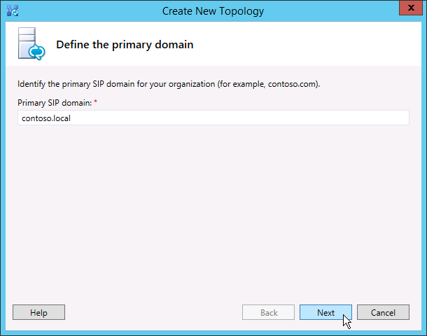

# Créer et publier une nouvelle topologie dans Skype Entreprise Server
 
**Résumé :** Découvrez comment créer, publier et vérifier une nouvelle topologie avant d’installer Skype Entreprise Server. Téléchargez une version d’évaluation gratuite de Skype Entreprise Server à partir du Centre d’évaluation Microsoft à l’adresse : [https://www.microsoft.com/evalcenter/evaluate-skype-for-business-server](https://www.microsoft.com/evalcenter/evaluate-skype-for-business-server)
  
Avant de pouvoir installer le système Skype Entreprise Server sur chacun des serveurs de la topologie, vous devez créer une topologie et la publier. Lorsque vous publiez une topologie, vous chargez les informations de topologie dans la base de données du magasin central de gestion. S’il s’agit d’un pool Enterprise Edition, vous créez la base de données du magasin central de gestion la première fois que vous publiez une nouvelle topologie. S’il s’agit de Standard Edition, vous devez exécuter le processus Préparer d’abord le serveur Standard Edition Server à partir de l’Assistant Déploiement avant de publier une topologie. Pour préparer Standard Edition, installez une instance Express Edition SQL Server et créez le magasin central de gestion. Vous pouvez suivre les étapes 1 à 5 dans n’importe quel ordre. Toutefois, vous devez suivre les étapes 6, 7 et 8 dans l’ordre et après les étapes 1 à 5, comme indiqué dans le diagramme. La création et la publication d’une nouvelle topologie sont décrites à l’étape 6 sur 8.
  

  
## Créer et publier une nouvelle topologie

Vous pouvez utiliser le Générateur de topologies Skype Entreprise Server pour concevoir, définir, configurer et publier des topologies. Cet outil a été installé lors de l’installation des outils d’administration plus tôt dans l’article. Vous pouvez faire de nombreux choix différents lorsque vous créez une topologie. Dans cette procédure, vous allez créer une topologie de base avec conférence.
  
> [!IMPORTANT]
> Skype Entreprise Server nécessite des SQL Server pour fonctionner. Les bases de données principales sont appelées magasin central de gestion. Si vous déployez Enterprise Edition, ces bases de données sont créées lorsque vous publiez la topologie en suivant les étapes ci-dessous. Dans ce cas, le Générateur de topologie vous demandera les informations de connexion à une SQL Server’installation. Si vous envisagez de déployer Standard Edition, vous devez installer SQL Server Express Edition avant de définir et de publier la nouvelle topologie. Pour installer SQL Server Express Edition, ouvrez l’Assistant Déploiement sur le serveur qui fera fonction du serveur frontal, puis exécutez Préparer d’abord le serveur Standard Edition Server. Lorsque vous cliquez sur Préparer le premier serveur Standard Edition Server, l’Assistant Déploiement installe automatiquement SQL Server Express Edition et crée les bases de données du magasin central de gestion. 
  
### Créer une topologie

1. Connectez-vous en tant qu’utilisateur standard ayant accès au Générateur de topologies.
    
2. Ouvrez le Générateur de topologies Skype Entreprise Server.
    
3. Sélectionnez **Nouvelle topologie,** puis cliquez sur **OK.**
    
4. Sélectionnez un emplacement et un nom de fichier pour le fichier de configuration de la topologie.
    
    > [!NOTE]
    > La configuration de la topologie est enregistrée en tant que fichier XML du Générateur de topologie (.tbxml). Lorsque vous publiez une topologie, vous poussez les informations de configuration du fichier vers la base de données SQL Server données. Lorsque vous ouvrirez le Générateur de topologies à l’avenir, vous pouvez télécharger la configuration existante à partir de SQL Server directement dans le Générateur de topologies et la publier sur SQL Server ou l’enregistrer en tant que fichier de configuration du Générateur de topologies. 
  
5. Dans **l’écran Définir le domaine principal,** entrez le domaine **SIP** principal, puis cliquez sur **Suivant**. Dans cet exemple, nous utilisons `contoso.local` , comme illustré dans la figure.
    
     
  
6. Ajoutez tous les domaines SIP supplémentaires pris en charge, puis cliquez sur **Suivant**.
    
7. Entrez un **nom et** une **description** pour le premier site (emplacement), puis cliquez sur **Suivant,** comme illustré dans la figure.
    
     
  
8. Entrez la **ville,** **le département/la province** et le **code du pays/de** la région pour le site, puis cliquez sur **Suivant**.
    
9. Cliquez **sur Terminer** pour terminer le processus de définition d’une nouvelle topologie. L’Assistant Nouveau frontal se lance automatiquement.
    
### Définir un pool frontal ou un serveur Standard Edition Server

1. Examinez les conditions préalables de l’Assistant, puis cliquez sur **Suivant.**
    
2. Entrez le nom de domaine complet (FQDN) du pool, sélectionnez le pool frontal **Enterprise Edition** ou le serveur **Standard Edition,** puis cliquez sur Suivant, comme illustré dans la figure. 
    
    > [!TIP]
    > Skype Entreprise Server Enterprise Edition peut inclure plusieurs serveurs qui travaillent ensemble pour fournir le rôle frontal. Lorsque plusieurs serveurs sont utilisés pour remplir le rôle, il s’agit d’un pool. Par conséquent, plusieurs serveurs travaillant ensemble pour fournir le rôle frontal sont également appelés pool frontal. Skype Entreprise Server Standard Edition ne peut inclure qu’un seul serveur pour fournir le rôle frontal. Il est courant de faire référence au pool frontal même si un seul serveur fournit le rôle. 
  
     
  
3. Entrez les noms de domaine complets (FQDN) de tous les ordinateurs du pool, puis cliquez sur **Suivant** comme illustré dans la figure.
    
     
  
4. Sélectionnez les fonctionnalités qui seront incluses dans cette topologie, puis cliquez sur **Suivant** comme illustré dans la figure.
    
    > [!NOTE]
    > Skype Entreprise Server inclut de nombreuses fonctionnalités avancées. Examinez la documentation de planification et de déploiement pour chaque fonctionnalité spécifique que vous souhaitez utiliser. 
  
     
  
5. Dans **la** page Sélectionner des rôles serveur cococérés, vous pouvez choisir de calérer le serveur de médiation sur le serveur frontal, ou vous pouvez choisir de le déployer en tant que serveur autonome.
    
    Si vous avez l’intention de cochez le serveur de médiation sur le pool frontal Enterprise Edition, assurez-vous que la case à cocher est cocher. Les rôles serveur seront déployés sur les serveurs du pool. Si vous avez l’intention de déployer le serveur de médiation en tant que serveur autonome, cochez la case appropriée. Vous allez déployer le serveur de médiation dans une étape de déploiement distincte après avoir déployé entièrement le serveur frontal. Pour plus d’informations sur la planification d’une cocation, voir [Topology Basics for Skype for Business Server](../../plan-your-deployment/topology-basics/topology-basics.md).
    
6. À l’aide de la page Associer des rôles serveur à cette page **de pool** frontal, vous pouvez définir et associer des rôles serveur au pool frontal. Le rôle suivant est disponible :
    
    **Activer un pool edge** Définit et associe un serveur Edge unique ou un pool de serveurs Edge. Un serveur Edge facilite la communication et la collaboration entre les utilisateurs au sein de l’organisation et les personnes extérieures à l’organisation, y compris les utilisateurs fédérés.
    
    Vous pouvez utiliser deux scénarios possibles pour déployer et associer les rôles serveur.
    
    Dans le premier scénario, vous définissez une nouvelle topologie pour un nouvelle installation. Vous pouvez aborder l’installation de l’une des deux manières suivantes :
    
   - Laissez la case à cocher vide et définissez la topologie. Après avoir publié, configuré et testé les rôles serveur frontal et principal, vous pouvez exécuter à nouveau le Générateur de topologie pour ajouter les serveurs de rôles à la topologie. À l’aide de cette stratégie, vous pouvez tester le pool frontal et le serveur exécutant SQL Server sans complications supplémentaires liées à des rôles supplémentaires. Une fois que vous avez terminé vos tests initiaux, vous pouvez exécuter à nouveau le Générateur de topologies pour sélectionner les rôles à déployer.
    
   - Sélectionnez les rôles à installer, puis configurez le matériel en fonction des rôles sélectionnés.
    
     Dans le deuxième scénario, vous avez un déploiement existant et votre infrastructure est prête pour de nouveaux rôles, ou vous devez associer des rôles existants à un nouveau serveur frontal.
    
   - Dans ce cas, vous allez sélectionner les rôles que vous avez l’intention de déployer ou d’associer au nouveau serveur frontal. Dans les deux cas, vous devez définir les rôles, configurer le matériel nécessaire et effectuer l’installation.
    
7. Ensuite, vous allez définir le magasin SQL Server qui sera utilisé avec la topologie. Dans cet exemple, nous utilisons l’instance Par défaut. Pour plus d’informations SQL Server fonctionnalités, telles que la haute disponibilité, voir Planifier la haute disponibilité et la récupération d’urgence [dans Skype Entreprise Server.](../../plan-your-deployment/high-availability-and-disaster-recovery/high-availability-and-disaster-recovery.md)
    
   - Pour utiliser un magasin SQL Server qui a déjà été défini dans votre topologie, sélectionnez une instance dans **Magasin SQL**.
    
   - Pour définir une nouvelle instance SQL Server pour stocker les informations du pool, cliquez sur **Nouveau,** puis spécifiez le **SQL Server FQDN** dans la boîte de dialogue Définir SQL **Store.**
    
   - Pour spécifier le nom d’une instance SQL Server, sélectionnez **Instance nommée**, puis spécifiez le nom de l’instance.
    
   - Pour utiliser l’instance par défaut, cliquez sur **Instance par défaut**.
    
   - Pour utiliser SQL miroir, sélectionnez Activer **SQL** mise en miroir, sélectionnez une instance existante ou créez une nouvelle instance.

     > [!NOTE]
     > SQL miroir est disponible dans Skype Entreprise Server 2015, mais n’est plus pris en charge dans Skype Entreprise Server 2019. Les groupes de disponibilité AlwaysOn, les instances de cluster de SQL AlwaysOn et les méthodes de clustering de SQL sont préférés avec Skype Entreprise Server 2019.
    
     Pour cet exemple, nous entrons le **nom SQL Server FQDN** et configurons les paramètres de haute disponibilité pertinents, puis cliquez sur **OK,** comme illustré dans la figure.
    
     
  
8. Décidez si vous souhaitez activer SQL Server de mise en miroir ou SQL Server témoin de mise en miroir, puis cliquez sur **Suivant**.
    
9. Définissez le partage de fichiers que vous souhaitez utiliser.
    
   - Pour utiliser un partage de fichiers qui a déjà été défini dans votre topologie, sélectionnez **Utiliser un partage de fichiers précédemment défini**.
    
   - Pour définir un nouveau partage de fichiers, sélectionnez **Définir un nouveau partage de fichiers**. Dans la zone **Nom de domaine complet du serveur de fichiers**, entrez le nom de domaine complet (FQDN) du serveur de fichiers existant où le partage de fichiers doit être placé, puis entrez un nom pour le partage de fichiers dans la zone **Partage de fichiers**.
    
     Pour cet exemple, nous allons cliquer sur Définir un nouveau magasin de **fichiers,** entrer le nom **deqdn** du serveur de fichiers et le partage de **fichiers,** puis cliquer sur **Suivant**.
    
     > [!NOTE]
     > Le partage de fichiers pour Skype Entreprise Server peut être coqueté, mais il n’est pas recommandé pour des raisons de performances. Notez que dans cet exemple, le partage de fichiers a été localisé sur un seul serveur dédié qui fera fonction du partage de fichiers. Toutefois, d’autres systèmes de partage de fichiers plus robustes, tels que DFS utilisant Windows Server 2012 R2, sont recommandés. Pour plus d’informations sur les systèmes de partage de fichiers pris en charge, voir [Requirements for your Skype Entreprise environment.](../../plan-your-deployment/requirements-for-your-environment/requirements-for-your-environment.md) Pour plus d’informations sur la création du partage de fichiers, voir Créer un partage de fichiers [dans Skype Entreprise Server](create-a-file-share.md). Vous pouvez définir le partage de fichiers sans qu’il soit nécessaire de le créer. Vous devrez créer le partage de fichiers à l’emplacement que vous définissez avant de publier la topologie. 
  
10. Dans la page Spécifier l’URL des services Web, vous devez décider si vous devez remplacer l’URL de base du pool de services web internes. La raison de ce remplacement est l’équilibrage de charge. Le trafic SIP de base peut être équilibrée par le biais d’un équilibrage de charge DNS simple. Toutefois, le trafic réseau des services Web HTTP/S doit utiliser une solution d’équilibrage de charge matérielle ou logicielle prise en charge. Pour les équilibreurs de charge pris en charge, [voir Infrastructure for Skype Entreprise](../../../SfbPartnerCertification/certification/infra-gateways.md). Dans cet exemple, nous avons utilisé l’équilibrage de charge DNS pour le trafic SIP et une solution d’équilibrage de charge logicielle prise en charge. Étant donné que nous divisons le trafic de cette façon, nous devons remplacer le FQDN du pool de services web internes. Sinon, si nous avons un équilibreur de charge de ligne supérieure et que nous avons envoyé tout le trafic via celui-ci au lieu d’utiliser l’équilibrage de charge DNS pour le trafic SIP, nous n’avons pas besoin de remplacer l’URL des services Web. 
    
    Dans la section DNS de cette rubrique, nous avons créé un enregistrement A pour `webint.contoso.local` . Il s’agit de l’URL que nous utilisons pour le trafic HTTP/S des services web et elle doit passer par l’équilibreur de charge logiciel pris en charge que nous avons installé. Par conséquent, dans cet exemple, nous allons remplacer l’URL pour Skype Entreprise Server savoir que tout le trafic HTTP/S doit se rendre à la place, comme illustré `webint.contoso.local` `pool.contoso.local` dans la figure. Pour plus d’informations sur l’équilibrage de charge, consultez [la](../../plan-your-deployment/network-requirements/load-balancing.md)Skype Entreprise .
    
    > [!IMPORTANT]
    > L’URL de base correspond à l’identité des services web pour l’URL, moins https://. Par exemple, si l’URL complète des services Web du pool est `https://webint.contoso.local` , l’URL de base est `webint.contoso.local` . 
  
    - Si vous configurez l’équilibrage de charge DNS, comme nous le faisons dans cet exemple, cochez la case Remplacer le nom de domaine de domaine public du pool de **services web** internes, puis entrez l’URL de base interne (qui doit être différente du nom de domaine de domaine public du pool) dans l’URL de base **interne.** 
    
    > [!CAUTION]
    > Si vous décidez de remplacer les services web internes par un FQDN auto-défini, chaque FQDN doit être unique à partir de n’importe quel autre pool frontal, directeur ou pool directeur. **Utilisez uniquement** des caractères standard (Y compris A-Z, a-z, 0-9 et tirets) lorsque vous définissez des URL ou des noms de domaine complets. N’utilisez ni caractère Unicode ni trait de soulignement. Les caractères nonstandards d’une URL ou d’un nom de domaine complet ne sont souvent pas pris en charge par le DNS externe et les autorités de certification publiques (c’est-à-dire, lorsque l’URL ou le nom de domaine complet doit être affecté au nom du sujet ou à l’autre nom du sujet dans le certificat).
  
    - Éventuellement, entrez l’URL de base externe dans **l’URL de base externe.** Entrez l’URL de base externe pour la différencier de votre nom de domaine interne. Par exemple, votre domaine interne est `contoso.local` , mais votre nom de domaine externe est `contoso.com` . Vous devez définir l’URL à l’aide du nom de domaine, car elle doit pouvoir être résolu à partir d’un `contoso.com` DNS public. Ceci est également important dans le cas d’un proxy inverse. Le nom de domaine de l’URL de base externe est le même que le nom de domaine du nom de domaine complet du proxy inverse. L’accès HTTP au pool frontal est requis pour la messagerie instantanée et la présence sur les clients mobiles.
    
      
  
11. Si vous avez sélectionné **Conférence** dans la **page** Sélectionner des fonctionnalités, vous serez invité à sélectionner un serveur Office Web Apps. Cliquez **sur Nouveau** pour lancer la boîte de dialogue.
    
12. Dans la boîte de dialogue Définir un nouveau **serveur Web Apps Office,** tapez le nom de groupe de votre serveur Office Web Apps dans la zone **FQDN du serveur Office Web Apps Server** . Dans ce cas, l’URL Office serveur Web Apps doit être entrée automatiquement dans la zone **Office’URL** de découverte du serveur Web Apps Server.
    
    Si le serveur Office Web Apps est installé en local et dans la même zone réseau que Skype Entreprise Server, ne sélectionnez pas l’option Office Web Apps Server est déployé dans un réseau externe **(périmètre/Internet).**
    
    Si le serveur Office Web Apps est déployé en dehors de votre pare-feu interne, sélectionnez l’option Office Web Apps Server est déployé dans un réseau externe **(périmètre/Internet).**
    
13. Cliquez **sur Terminer** pour terminer la configuration. Si vous avez défini d’autres serveurs de rôles sur la page Associer des rôles serveur à cette page **de pool** frontal, des pages distinctes de l’Assistant Configuration de rôle s’ouvrent et vous pouvez configurer les rôles serveur. Dans cet exemple, nous avons choisi uniquement la conférence.
    
### Configurer des URL simples

1. Dans le Générateur de topologie, cliquez avec le bouton **droit sur le Skype Entreprise Server** supérieur, puis cliquez sur Modifier les propriétés, comme illustré dans la figure. 
    
     
  
2. Dans  le volet URL simples, sélectionnez soit **Téléphone’accès** aux URL : (Dial-in) ou **Meeting URLs:** (Meet) pour modifier, puis cliquez sur **Modifier l’URL**.
    
3. Mettez à jour l’URL avec la valeur voulue, puis cliquez sur **OK** pour l’enregistrer. Vous devez configurer l’URL simple à l’aide du domaine SIP externe afin que les utilisateurs externes peuvent participer à des réunions, par exemple, qui est externe, par opposition à , qui est un domaine `contoso.com` `contoso.local` interne. Par conséquent, le domaine SIP doit pouvoir être résolu par un DNS externe.
    
4. Modifiez l’URL Meet en procédant de la même manière, si nécessaire.
    
### Pour définir l’URL simple Admin facultative

1. Dans le Générateur de topologie, cliquez avec le bouton **droit sur le Skype Entreprise Server,** puis cliquez sur **Modifier les propriétés.**
    
2. Dans la **zone URL d’accès administratif,** entrez l’URL simple que vous souhaitez pour l’accès administratif à Skype Entreprise Server panneau de Skype Entreprise Server, puis cliquez sur **OK.**
    
    > [!TIP]
    > Nous vous recommandons d’utiliser l’URL la plus simple possible pour l’URL Admin. L’option la plus simple https://admin est ... _\<domain\>_ L’URL d’administration peut être un domaine interne ou externe, par exemple, ou, tant que l’un ou l’autre enregistrement peut être résolu dans `contoso.local` `contoso.com` le DNS interne. 
  
    > [!IMPORTANT]
    > Si vous modifiez une URL simple après le déploiement initial, vous devez connaître les modifications qui ont une incidence sur vos enregistrements et certificats DNS (Domain Name System) pour les URL simples. Si la modification a un impact sur la base d’une URL simple, vous devez également modifier les enregistrements et les certificats DNS. Par exemple, la modification de l’URL de base à `https://sfb.contoso.com/Meet` `https://meet.contoso.com` partir de sfb.`contoso.com` to `meet.contoso.com` , so you would need to change the DNS records and certificates to refer to `meet.contoso.com` . Si vous avez modifié l’URL simple de , l’URL de base de reste identique, donc aucune modification de DNS ou de certificat `https://sfb.contoso.com/Meet` `https://sfb.contoso.com/Meetings` `sfb.contoso.com` n’est nécessaire. Toutefois, chaque fois que vous modifiez un nom d’URL simple, vous devez exécuter l’cmdlet **Enable-CsComputer** sur chaque directeur et serveur frontal pour enregistrer la modification.
  
### Publier et vérifier la topologie

1. Vérifiez que toutes les URL simples sont configurées correctement.
    
2. Confirmez que le serveur SQL Server est en ligne et disponible pour l’ordinateur sur lequel le Générateur de topologie est installé, y compris les règles de pare-feu nécessaires.
    
3. Confirmez que le partage de fichiers est disponible et que les autorisations adéquates sont définies.
    
4. Confirmez que les rôles serveur corrects qui répondent à la configuration requise pour le déploiement sont définis dans la topologie.
    
5. Vérifiez que les serveurs existent dans les services de domaine Active Directory (AD DS). Cela se produit automatiquement lorsque vous joignez les serveurs au domaine.
    
    Lorsque vous avez vérifié la topologie et qu’aucune erreur de validation n’a été détectée, vous êtes prêt à publier la topologie. S’il existe des erreurs de validation, vous devez les corriger avant de pouvoir publier la topologie.
    
6. Cliquez avec le bouton **droit sur Skype Entreprise Server,** puis cliquez **sur Publier la topologie.**
    
7. Dans la page **Publier la topologie**, cliquez sur **Suivant**.
    
8. Dans la page **Sélectionner le serveur central de** gestion, sélectionnez un pool frontal, comme illustré dans la figure.
    
    > [!NOTE]
    > Vous pouvez cliquer sur **Avancé** pour configurer les emplacements des fichiers de base de données.
  
     
  
9. Dans la page **Sélectionner des bases de** données, sélectionnez les bases de données que vous souhaitez publier.
    
    > [!NOTE]
    > Si vous n’avez pas les droits appropriés pour créer les bases de données, vous pouvez effacer les cases à cocher en regard de ces bases de données, et une personne ayant les droits appropriés peut ensuite créer les bases de données. Pour plus d’informations sur les conditions requises, voir [Server requirements for Skype Entreprise Server](../../plan-your-deployment/requirements-for-your-environment/server-requirements.md). 
  
10. Vous pouvez cliquer sur **Avancé**. À l’aide SQL Server options de placement des fichiers de données avancés, vous pouvez choisir entre les options suivantes : 
    
    -  Déterminer automatiquement l’emplacement des fichiers de base de données : cette option détermine les meilleures performances opérationnelles en fonction de la configuration du disque sur votre serveur SQL Server en répartissant les fichiers journaux et de données au meilleur emplacement.
    
    - **Utilisez SQL Server défaut de l’instance** : cette option place les fichiers journaux et de données sur le serveur SQL Server à l’aide des paramètres de l’instance. Elle ne fait pas appel à la fonctionnalité d’analyse opérationnelle de SQL Server qui permet de déterminer le meilleur emplacement des fichiers journaux et de données. L’administrateur SQL Server place généralement les fichiers journaux et de données à des emplacements conformes aux procédures de gestion des serveurs SQL Server et de l’organisation.
    
    Cliquez sur **OK**, puis sur **Suivant**. 
    
11. Vous pouvez éventuellement cliquer sur **Avancé.** À l’aide SQL Server options de placement des fichiers de données avancés, vous pouvez choisir entre les options suivantes : 
    
    -  Déterminer automatiquement l’emplacement des fichiers de base de données : cette option détermine les meilleures performances opérationnelles en fonction de la configuration du disque sur votre serveur SQL Server en répartissant les fichiers journaux et de données au meilleur emplacement.
    
    - **Utilisez SQL Server défaut de l’instance** : cette option place les fichiers journaux et de données sur le serveur SQL Server à l’aide des paramètres de l’instance. Elle ne fait pas appel à la fonctionnalité d’analyse opérationnelle de SQL Server qui permet de déterminer le meilleur emplacement des fichiers journaux et de données. L’administrateur SQL Server place généralement les fichiers journaux et de données à des emplacements conformes aux procédures de gestion des serveurs SQL Server et de l’organisation.
    
    Cliquez sur **OK**.
    
12. Cliquez sur **Suivant** pour terminer le processus de publication.
    
    > [!NOTE]
    > Un échec courant de cette étape est que les bases de données SQL Server ne peuvent pas être créées. Lorsque le processus ne peut pas se terminer, une erreur est fournie, comme illustré dans la figure. La cause la plus probable est que l’utilisateur qui tente de créer la base de données n’a pas les autorisations appropriées ou que le système SQL Server ne peut pas être contacté en raison d’un pare-feu ou d’un autre problème réseau. 
  
     
  
13. Une fois le processus de publication terminé, un lien vous permet d’ouvrir une liste des étapes suivantes. Cliquez **ici pour ouvrir la liste des** actions pour afficher les étapes suivantes, puis cliquez sur **Terminer.** 
    
    Le message « Terminé avec avertissements » pour la création de la base de données ne signifie pas qu’une erreur s’est produite. Le processus d’installation doit modifier les paramètres SQL Server pour Skype Entreprise Server fonctionne correctement. Lorsqu’un paramètre est modifié dans SQL Server, il est enregistré comme un avertissement afin que les administrateurs SQL Server comprennent exactement ce que le processus d’installation a terminé. Si vous recevez un avertissement, vous pouvez sélectionner l’enregistrement, puis cliquer sur **Afficher** les journaux pour afficher les détails de l’avertissement.
    
    Une fois la topologie publiée, vous pouvez commencer à installer un réplica local du magasin central de gestion sur chaque serveur exécutant Skype Entreprise Server dans votre topologie. Nous vous recommandons de commencer par le premier pool frontal. 
