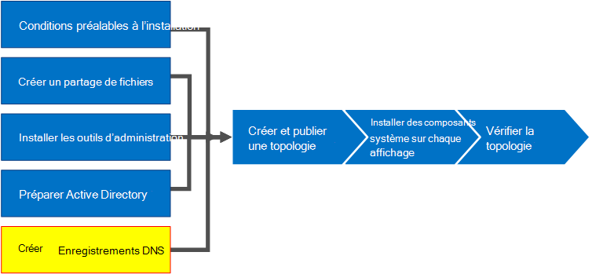

# Créer des enregistrements DNS pour Skype Entreprise Server
 
**Résumé:** Découvrez comment configurer DNS et créer des enregistrements DNS pour une installation de Skype Entreprise Server.
  
Pour que Skype Entreprise Server fonctionne correctement, un certain nombre de paramètres DNS (Domain Name System) doivent être en place. C’est pour que les clients sachent comment accéder aux services et que les serveurs se connaissent. Ces paramètres ne doivent être effectués qu’une seule fois par déploiement, car une fois que vous avez affecté une entrée DNS, elles sont disponibles dans l’ensemble du domaine. Vous pouvez effectuer les étapes 1 à 5 dans n’importe quel ordre. Toutefois, vous devez effectuer les étapes 6, 7 et 8 dans l’ordre, et après les étapes 1 à 5, comme indiqué dans le diagramme. La création d’enregistrements DNS comprend l’étape 5 sur 8. Pour plus d’informations sur la planification de DNS, consultez [Les exigences environnementales pour les exigences de Skype Entreprise Server](../../plan-your-deployment/requirements-for-your-environment/environmental-requirements.md) ou [de serveur pour Skype Entreprise Server 2019](../../../SfBServer2019/plan/system-requirements.md).
  
> [!IMPORTANT]
> Il est important de noter qu’il s’agit simplement d’un exemple de création d’enregistrements DNS dans un environnement DNS Windows Server. De nombreuses autres entrées DNS sont requises pour Skype Entreprise Server, et la procédure de création d’enregistrements DNS dépend du système que vous utilisez pour gérer DNS dans votre organisation. Pour obtenir la liste complète des exigences pour DNS, consultez [les exigences DNS pour Skype Entreprise Server](../../plan-your-deployment/network-requirements/dns.md). 
  

  
## Configurer le DNS

Les enregistrements DNS sont requis pour que Skype Entreprise Server fonctionnent correctement et soient accessibles par les utilisateurs.
  
Cet exemple utilise un nom de domaine complet d’équilibrage de charge DNS nommé pool.contoso.local. Ce pool se compose de trois serveurs exécutant Skype Entreprise Server Êdition Entreprise. Un serveur frontal Édition Standard ne peut contenir qu’un seul serveur. En utilisant Édition Standard, vous utilisez uniquement le nom de domaine complet (FQDN) du serveur Édition Standard unique lors du référencement du rôle frontal au lieu de créer un pool de serveurs à charge équilibrée DNS, comme le montre cet exemple. Cet exemple simple qui utilise uniquement le rôle frontal inclut les entrées DNS dans le tableau suivant. Pour planifier vos exigences DNS spécifiques, consultez [les exigences DNS pour Skype Entreprise Server](../../plan-your-deployment/network-requirements/dns.md). 
  
 
|**Description**|**Type d’enregistrement**|**Nom**|**Résolu en**|**Type d’équilibrage de charge**|
|:-----|:-----|:-----|:-----|:-----|
|Nom de domaine complet des services web internes    |A    |webint.contoso.local    |Adresse IP virtuelle pour les services web internes    |Logiciels et matériel pris en charge    |
|Nom de domaine complet du pool    |A    |pool.contoso.local    |Adresse IP du serveur SFB01    |DNS    |
|Nom de domaine complet SFB01    |A    |SFB01.contoso.local    |Adresse IP du serveur SFB01    |DNS    |
|Nom de domaine complet du pool    |A    |pool.contoso.local    |Adresse IP du serveur SFB02    |DNS    |
|Nom de domaine complet SFB02    |A    |SFB02.contoso.local    |Adresse IP du serveur SFB02    |DNS    |
|Nom de domaine complet du pool    |A    |pool.contoso.local    |Adresse IP du serveur SFB03    |DNS    |
|Nom de domaine complet SFB03    |A    |SFB03.contoso.local    |Adresse IP du serveur SFB03    |DNS    |
|découverte automatique Skype Entreprise    |A    |lyncdiscoverinternal.contoso.local    |Adresse IP virtuelle pour les services web internes    |Logiciels et matériel pris en charge    |
|URL simple de réunion    |A    |meet.contoso.local    |Adresse IP virtuelle pour les services web internes    |Logiciels et matériel pris en charge    |
|URL simple de connexion    |A    |dialin.contoso.local    |Adresse IP virtuelle pour les services web internes    |Logiciels et matériel pris en charge    |
|URL simple du planificateur web    |A    |scheduler.contoso.local    |Adresse IP virtuelle pour les services web internes    |Logiciels et matériel pris en charge    |
|URL simple d’administration    |A    |admin.contoso.local    |Adresse IP virtuelle pour les services web internes    |Logiciels et matériel pris en charge    |
|Découverte héritée    |SRV    |_sipinternaltls._tcp.contoso.local    |Nom de domaine complet du pool (port 5061)    |N/A    |
   
### Créer des enregistrements DNS

1. Connectez-vous au serveur DNS et ouvrez **Gestionnaire de serveur**.
    
2. Cliquez sur le menu déroulant **Outils** , puis sur **DNS**.
    
3. Dans l’arborescence de console de votre domaine SIP, **développez Zones de recherche** avancée, puis développez le domaine SIP dans lequel Skype Entreprise Server seront installés.
    
4. Cliquez avec le bouton droit sur le domaine SIP, puis **sélectionnez Nouvel hôte (A ou AAAA),** comme illustré dans la figure.
    
     
  
5. Dans la zone **Nom** , tapez le nom de l’enregistrement hôte (le nom de domaine sera ajouté automatiquement).
    
6. Dans la **zone Adresse IP**, tapez l’adresse IP du serveur frontal individuel, puis **sélectionnez Créer un enregistrement de pointeur associé (PTR)** ou **autorisez tout utilisateur authentifié à mettre à jour les enregistrements DNS portant le même nom de propriétaire, le** cas échéant. Notez que cela suppose que DNS est utilisé pour équilibrer la charge de tout le trafic à l’exception des services web. Dans cet exemple, nous avons trois serveurs frontaux, comme indiqué dans le tableau.
    
   |**Nom du serveur**|**Type**|**Données**|
   |:-----|:-----|:-----|
   |SFB01    |Hôte (A)    |10.0.0.5    |
   |SFB02    |Hôte (A)    |10.0.0.6    |
   |SFB03    |Hôte (A)    |10.0.0.7    |
   
7. Ensuite, créez les entrées d’équilibrage de charge DNS pour le pool. L’équilibrage de charge DNS permet à DNS d’envoyer des demandes aux serveurs individuels du pool tout en utilisant le même nom de pool DNS. Pour plus d’informations sur le DNS et l’équilibrage de charge, consultez [les exigences DNS pour Skype Entreprise Server](../../plan-your-deployment/network-requirements/dns.md). 
    
    > [!NOTE]
    > Le regroupement de plusieurs serveurs n’est disponible que dans Êdition Entreprise déploiements. Si vous déployez un seul serveur Enterprise ou Édition Standard serveur, vous devez créer uniquement un enregistrement A pour le serveur unique. 
  
    Par exemple, si vous aviez un pool nommé pool.contoso.local et trois serveurs frontaux, vous devez créer les entrées DNS suivantes :
    
   |**FQDN**|**Type**|**Données**|
   |:-----|:-----|:-----|
   |pool.contoso.local    |Hôte (A)    |10.0.0.5    |
   |pool.contoso.local    |Hôte (A)    |10.0.0.6    |
   |pool.contoso.local    |Hôte (A)    |10.0.0.7    |
   
8. Continuez à créer des enregistrements A pour tous les serveurs dans le déploiement planifié. 
    
9. Pour créer l’enregistrement d’enregistrement de service (SRV) pour la découverte héritée, cliquez avec le bouton droit sur le domaine SIP, puis sélectionnez **Autres nouveaux enregistrements**.
    
10. Dans **Choisissez un type d’enregistrement de ressource**, cliquez sur **Emplacement du service (SRV)**, puis sur **Créer un enregistrement**.
    
11. Cliquez sur **Service**, puis tapez **_sipinternaltls**.
    
12. Cliquez sur **Protocole**, puis tapez **_tcp**.
    
13. Cliquez sur **Numéro de port**, puis tapez **5061**.
    
14. Cliquez sur **Hôte offrant ce service**, puis tapez le nom de domaine complet du pool ou du serveur Édition Standard.
    
     
  
15. Cliquez sur **OK**, puis sur **Terminé**.
    
### Vérifier les enregistrements DNS

1. Ouvrez une session sur un ordinateur client du domaine dont le compte est membre du groupe Utilisateurs authentifiés ou qui dispose des autorisations équivalentes.
    
2. Cliquez sur **Démarrer**, puis tapez **cmd**, puis appuyez sur Entrée.
    
3. Tapez **nslookup \<FQDN of the Front End pool\>** ou **\<FQDN of the Standard Edition server or single Enterprise Edition server\>**, puis appuyez sur Entrée.
    
4. Continuez à vérifier le reste des enregistrements A pour votre déploiement.
    
5. Si vous prenez en charge les clients hérités et que vous avez créé l’enregistrement SRV, vérifiez-le en tapant **set type=srv** à l’invite **nslookup** , puis appuyez sur Entrée.
    
6. Tapez **_sipinternaltls._tcp. *Domaine*** (par exemple, _sipinternaltls._tcp.contoso.local), puis appuyez sur Entrée.
    
7. La sortie attendue doit être similaire à celle indiquée dans la figure. Notez que tous les enregistrements DNS ne sont pas affichés dans l’exemple de sortie, mais que tous les enregistrements doivent être vérifiés. 
    
     
  

