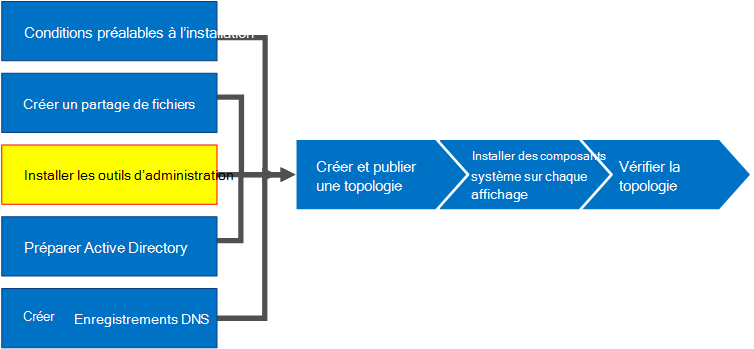
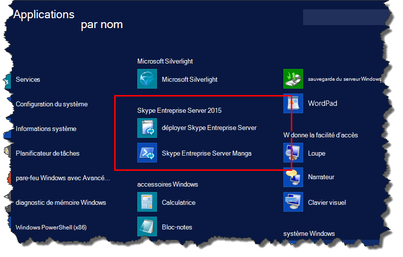
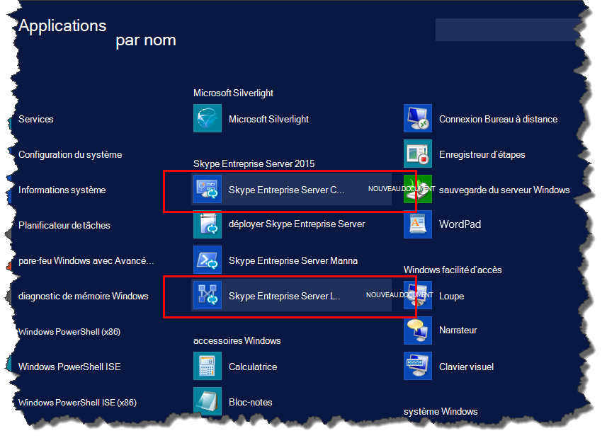

# Installer les outils d’administration dans Skype Entreprise Server
 
**Résumé :** Découvrez comment installer les outils d’administration requis pour une installation de Skype Entreprise Server. Téléchargez une version d’Skype Entreprise Server gratuite à partir du Centre d’évaluation Microsoft à [https://www.microsoft.com/evalcenter/evaluate-skype-for-business-server](https://www.microsoft.com/evalcenter/evaluate-skype-for-business-server) l':.
  
Les outils d’administration incluent le Générateur de topologie et le Panneau de contrôle. Les outils d’administration doivent être installés sur au moins un serveur de la topologie ou sur une station de travail de gestion 64 bits exécutant une version du système d’exploitation Windows prise en charge pour Skype Entreprise Server. Vous pouvez suivre les étapes 1 à 5 dans n’importe quel ordre. Toutefois, vous devez suivre les étapes 6, 7 et 8 dans l’ordre et après les étapes 1 à 5, comme indiqué dans le diagramme. L’installation des outils d’administration est l’étape 3 sur 8.
  

  
## Installer les Skype Entreprise Server d’administration

Le support d’installation Skype Entreprise Server offre une expérience flexible. Lors de la première Setup.exe, les seuls outils installés sont l’Assistant Déploiement Skype Entreprise Server et l’Skype Entreprise Server Management Shell. À l’aide de ces deux outils, appelés composants principaux, vous pouvez poursuivre le processus d’installation, mais ils ne fournissent pas de fonctionnalités principales pour l’environnement Skype Entreprise Server globale. L’Assistant Déploiement se lance automatiquement après l’installation des composants principaux. La section de l’Assistant Déploiement intitulée **Installer** les outils d’administration installe Skype Entreprise Server générateur de topologie et Skype Entreprise Server panneau de contrôle.
  
> [!IMPORTANT]
> Chaque Skype Entreprise Server doit avoir au moins un serveur avec les outils d’administration installés. 
  
Regardez les étapes vidéo pour **installer les outils d’administration**:
  
> [!video https://www.microsoft.com/videoplayer/embed/99a5c436-963b-4eed-b423-651568c87cb1?autoplay=false]
  
### Installer les Skype Entreprise Server d’administration à partir de l’Assistant Déploiement

1. Insérez le Skype Entreprise Server d’installation. Si le programme d’installation ne démarre pas automatiquement, double-cliquez sur **Installation.**
    
2. Le support d’installation nécessite Microsoft Visual C++'exécuter. Une boîte de dialogue apparaît pour vous demander si vous souhaitez l’installer. Cliquez sur **Oui**.
    
3. À l’aide de Smart Setup, une nouvelle fonctionnalité de Skype Entreprise Server, vous pouvez vous connecter à Internet pour vérifier les mises à jour au cours du processus d’installation. Cela permet d’améliorer l’expérience en vous assurez que vous disposez des mises à jour les plus récentes du produit lors de l’installation. Cliquez sur **Installer** pour commencer l’installation.
    
4. Examinez attentivement le contrat de licence et, si vous acceptez, sélectionnez **J’accepte** les termes du contrat de licence, puis cliquez sur **OK**.
    
5. Les Skype Entreprise Server principaux composants seront installés sur le serveur. 
    
    Les composants principaux sont constitués des éléments suivants, comme illustré dans la figure.
    
    
  
   - **Assistant Skype Entreprise Server déploiement d’une Skype Entreprise Server** Programme de déploiement qui fournit un pavé de lancement pour l’installation des différents composants de Skype Entreprise Server.
    
   - **Skype Entreprise Server Management Shell** Programme PowerShell préconfiguré qui permet l’administration de Skype Entreprise Server.
    
     Une fois l’installation des composants principaux terminée, l’Assistant Déploiement Skype Entreprise Server se lance automatiquement, comme illustré dans la figure. 
    
     
  
6. Outre les composants principaux, vous devez également installer le Générateur de topologies Skype Entreprise Server et le Panneau de Skype Entreprise Server sur au moins un serveur de l’environnement. Cliquez **sur Installer les outils d’administration** dans l’Assistant Déploiement.
    
7. Cliquez sur **Suivant** pour commencer l’installation.
    
8. Une fois l’installation terminée, cliquez sur **Terminer.** Les outils d’administration sont désormais ajoutés au serveur, comme illustré dans la figure.
    
    
  
   - **Skype Entreprise Server de topologie** Programme utilisé pour créer, déployer et gérer des topologies.
    
   - **Skype Entreprise Server panneau de commande** Programme utilisé pour administrer l’installation.
    

