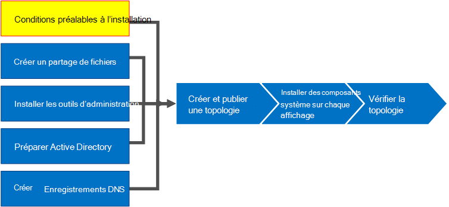

# Installer les conditions préalables pour Skype Entreprise Server
 
**Résumé :** Découvrez les serveurs et les rôles serveur que vous devez configurer avant d’installer Skype Entreprise Server. Téléchargez une version d’évaluation Skype Entreprise Server gratuite à partir du [Centre d’évaluation Microsoft.](https://www.microsoft.com/evalcenter/evaluate-skype-for-business-server)
  
L’installation des éléments prérequis consiste à installer Windows Server en installant les rôles et fonctionnalités requis sur chacun des serveurs de la topologie. Les exigences sont basées sur le rôle que le serveur remplira dans la topologie. Vous pouvez suivre les étapes 1 à 5 dans n’importe quel ordre. Toutefois, vous devez suivre les étapes 6, 7 et 8 dans l’ordre et après les étapes 1 à 5, comme indiqué dans le diagramme. L’installation des prérequis est l’étape 1 sur 8.
  

  
## Installation Windows Server

Skype Entreprise Server nécessite le système d’exploitation Windows Server et un certain nombre de conditions préalables avant de pouvoir être installé. Pour plus d’informations sur la planification des conditions préalables, voir [La](../../../SfBServer2019/plan/system-requirements.md)Skype Entreprise Server . 
  
> [!TIP]
> Cette procédure utilise Windows Server 2012 R2. Si vous utilisez une version différente de Windows Server, la procédure peut être légèrement différente. 
  
> [!IMPORTANT]
> Avant de commencer, assurez-vous que Windows Server est à jour à l’aide de Windows Update. 
  

  
Regardez les étapes de la vidéo pour **les conditions préalables à l’installation**:
  
> [!video https://www.microsoft.com/videoplayer/embed/02447c2a-5b26-432f-aad6-b9b05cc93478?autoplay=false]
  
### Installer les rôles et fonctionnalités requis pour les serveurs frontux

Vous pouvez installer les rôles et fonctionnalités requis à l’aide du Gestionnaire de serveur. 
    
1. Installez les fonctionnalités logicielles prérequises répertoriées dans la liste des conditions [requises pour Skype Entreprise Server](../../../SfBServer2019/plan/system-requirements.md). Le logiciel requis doit se trouver sur le serveur qui exécutera Skype Entreprise Server.
    
    > [!CAUTION]
    > Windows Server 2012 R2 n’installe pas tous les fichiers sources pour les fonctionnalités requises par défaut. Si le serveur n’est pas connecté à Internet, vous devez insérer le média Windows Server 2012 R2 et sélectionner Spécifier un autre chemin **d’accès source** pour installer les fonctionnalités requises. Les fichiers sources se trouvent dans le répertoire sources\sxs. Par exemple, si le Windows Server 2012 R2 se trouve dans le lecteur D, vous devez définir le chemin d’accès sur `d:\sources\sxs` . Il est important que vous avez les dernières mises à jour de Windows Update. Si vous n’êtes pas connecté à Internet, vous devrez installer manuellement toutes les mises à jour pertinentes, ainsi que les conditions préalables aux mises à jour requises. 
  
1. Lorsque la boîte de dialogue indique que l’installation est terminée, vous devez redémarrer le serveur pour terminer le processus.
    
1. Exécutez **Windows update à** nouveau pour vérifier s’il existe des mises à jour des rôles et services qui ont été installés.
    
1. Si vous utilisez le Panneau de Skype Entreprise Server sur ce serveur, vous devez également installer Silverlight. Pour installer Silverlight, voir [Microsoft Silverlight.](https://www.microsoft.com/silverlight/)

> [!IMPORTANT]
> Les conditions préalables pour les serveurs qui jouent des rôles autres que les serveurs frontaux, tels que le rôle de directeur, de conversation permanente ou de serveur Edge, ont leurs propres conditions préalables. Pour plus d’informations sur les conditions préalables exactes requises par chaque type de [serveur,](../../../SfBServer2019/plan/system-requirements.md)voir La Skype Entreprise Server . 
  

