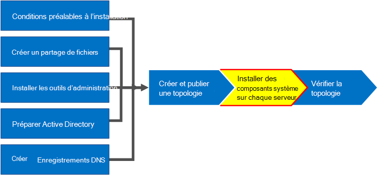
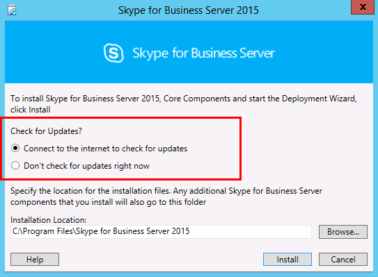
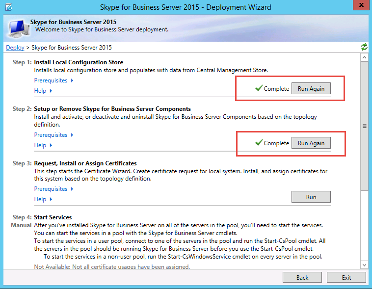
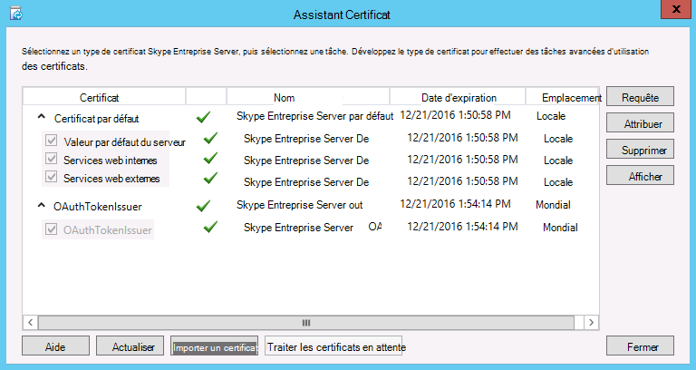
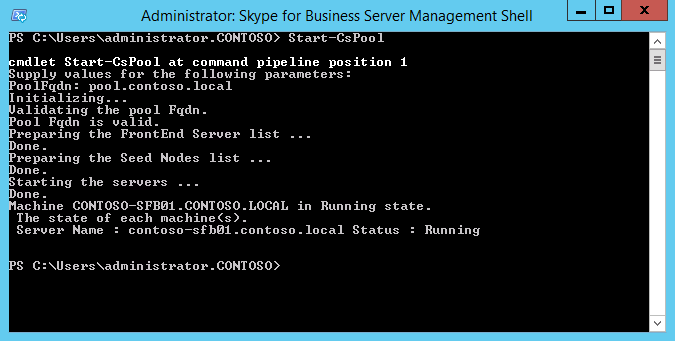

# Installer Skype Entreprise Server sur des serveurs dans la topologie
 
**Résumé:** Découvrez comment installer les composants système Skype Entreprise Server sur chaque serveur de la topologie.
  
Une fois que la topologie est chargée dans le magasin de gestion centrale et qu’Active Directory sait quels serveurs effectueront les rôles, vous devez installer le système Skype Entreprise Server sur chacun des serveurs de la topologie. Vous pouvez effectuer les étapes 1 à 5 dans n’importe quel ordre. Toutefois, vous devez effectuer les étapes 6, 7 et 8 dans l’ordre, et après les étapes 1 à 5, comme indiqué dans le diagramme. L’installation du système Skype Entreprise Server est l’étape 7 sur 8.
  

  
## Installer Skype Entreprise Server système

Une fois que vous avez publié une topologie, vous pouvez installer les composants Skype Entreprise Server sur chaque serveur de la topologie. Cette section vous guide tout au long de l’installation de Skype Entreprise Server et de la configuration des rôles serveur pour le pool frontal et tous les rôles de serveur colocalisés avec les serveurs frontaux. Pour installer et configurer des rôles serveur, vous exécutez l’Assistant Déploiement Skype Entreprise Server sur chaque ordinateur sur lequel vous installez un rôle serveur. Vous utilisez l’Assistant Déploiement pour effectuer les quatre étapes de déploiement, notamment l’installation du magasin de configuration local, l’installation des serveurs frontaux, la configuration des certificats et le démarrage des services.
  
> [!IMPORTANT]
> Vous devez utiliser topologie Builder pour terminer et publier la topologie avant de pouvoir installer Skype Entreprise Server sur les serveurs. 
  
> [!NOTE]
> Cette procédure doit être effectuée pour tous les serveurs de la topologie. 
  
> [!CAUTION]
> Après avoir installé Skype Entreprise Server sur un serveur frontal, la première fois que vous démarrez des services, vous devez vous assurer que le service de pare-feu Windows s’exécute sur le serveur. 
  
> [!CAUTION]
> Avant de suivre ces étapes, vérifiez que vous êtes connecté au serveur avec un compte d’utilisateur de domaine qui est à la fois un administrateur local et un membre du groupe RTCUniversalServerAdmins. 
  
> [!NOTE]
> Si vous n’avez pas exécuté Skype Entreprise Server configuration sur ce serveur auparavant, vous êtes invité à entrer un lecteur et un chemin d’accès pour l’installation. Cela offre la possibilité d’installer sur un lecteur autre que le lecteur système, si votre organisation en a besoin ou si vous avez des problèmes d’espace. Vous pouvez modifier le chemin d’emplacement d’installation des fichiers Skype Entreprise Server dans la boîte de dialogue **Installation** en un nouveau lecteur disponible. Si vous installez les fichiers d’installation sur ce chemin d’accès, y compris OCSCore.msi, le reste des fichiers Skype Entreprise Server s’y déploie également.
  
> [!IMPORTANT]
> Avant de commencer l’installation, assurez-vous que Windows Server est à jour à l’aide de Windows Update. 
  

  
### Installer Skype Entreprise Server système

1. Insérez le support d’installation Skype Entreprise Server. Si le programme d’installation ne démarre pas automatiquement, double-cliquez sur **Configurer**.
    
2. Le support d’installation nécessite l’exécution de Microsoft Visual C++. Une boîte de dialogue s’affiche pour vous demander si vous souhaitez l’installer. Cliquez sur **Oui.**
    
3. Examinez attentivement le contrat de licence et, si vous acceptez, sélectionnez **J’accepte les termes du contrat de licence**, puis cliquez sur **OK**. 
    
4. Le programme d’installation intelligente est une fonctionnalité de Skype Entreprise Server dans laquelle vous pouvez vous connecter à Internet pour rechercher des mises à jour à partir de Microsoft Update (MU) pendant le processus d’installation, comme illustré dans la figure. Cela offre une meilleure expérience en vous assurant que vous disposez des mises à jour les plus récentes pour le produit. Cliquez sur **Installer** pour commencer l’installation.
    
    > [!NOTE]
    > De nombreuses organisations ont Windows Server Update Services (WSUS) déployées dans leurs environnements d’entreprise. WSUS permet aux administrateurs de gérer entièrement la distribution des mises à jour publiées via Microsoft Update sur les ordinateurs de leur réseau. Dans le cadre de la mise à jour cumulative 1 Skype Entreprise Server introduit la prise en charge de l’installation intelligente pour fonctionner avec WSUS. Les clients avec WSUS qui déploient Skype Entreprise Server pour la première fois ou qui effectuent une mise à niveau à partir de l’environnement Lync Server 2013 à l’aide de la fonctionnalité de mise à niveau In-Place disposeront d’une Skype d’extraction de configuration intelligente pour Windows mises à jour de WSUS, au lieu d’extraire des mises à jour à partir de MU. Les clients qui souhaitent utiliser Smart Setup doivent exécuter SmartSetupWithWSUS.psq sur toutes les machines avant d’exécuter Setup.exe. 
  
     
  
5. Dans la page De l’Assistant Déploiement, cliquez sur **Installer ou Mettre à jour Skype Entreprise Server Système**.
    
6. Effectuez les procédures décrites dans les procédures suivantes. Une fois que vous les avez terminées, cliquez sur **Quitter** pour fermer l’Assistant Déploiement. Répétez les procédures pour chaque serveur frontal dans le pool.
    
### Étape 1 : Installer le magasin de configuration local

1. Passez en revue les prérequis, puis cliquez sur **Exécuter** en regard de **l’étape 1 : Installer le magasin de configuration local**.
    
    > [!NOTE]
    > Le magasin de configuration local est une copie en lecture seule du magasin central de gestion. Dans un déploiement Édition Standard, le magasin de gestion centrale est créé à l’aide d’une copie locale de SQL Server Express Edition sur le serveur frontal. Cela se produit lorsque vous exécutez la procédure Préparer le premier serveur Édition Standard. Dans un déploiement Êdition Entreprise, le magasin de gestion centrale est créé lorsque vous publiez la topologie qui inclut un pool frontal Êdition Entreprise. 
  
2. Dans la page **Installer le magasin de configuration local** , vérifiez que l’option **Récupérer directement à partir de l’option Magasin de gestion centrale** est sélectionnée, puis cliquez sur **Suivant**.
    
    SQL Server Express Edition est installé sur le serveur local. SQL Server Express Edition est nécessaire pour le magasin de configuration local.
    
3. Une fois l’installation terminée, cliquez sur **Terminer**.
    
### Étape 2 : Configurer ou supprimer des composants Skype Entreprise Server

1. Passez en revue les prérequis, puis cliquez sur **Exécuter** en regard de **l’étape 2 : Configurer ou supprimer Skype Entreprise Server composants**.
    
2. Dans la page **Configurer Skype Entreprise Server Composants**, cliquez sur **Suivant** pour configurer les composants tels que définis dans votre topologie publiée.
    
3. La page **Commandes en cours d’exécution** affiche un résumé des commandes et des informations d’installation au fur et à mesure de la configuration. Lorsque vous avez terminé, vous pouvez utiliser la liste pour sélectionner un journal à afficher, puis cliquer sur **Afficher le journal**.
    
4. Lorsque Skype Entreprise Server configuration des composants est terminée et que vous avez examiné les journaux en fonction des besoins, cliquez sur **Terminer** pour terminer cette étape de l’installation.
    
    > [!NOTE]
    > Redémarrez le serveur si vous y êtes invité (ce qui peut se produire si Windows expérience de bureau doit être installée). Lorsque l’ordinateur est en cours d’exécution, vous devez réexécuter cette procédure (étape 2 : Configurer ou supprimer Skype Entreprise Server composants). 
  
    > [!NOTE]
    > Si le programme d’installation trouve des conditions préalables qui n’ont pas été satisfaites, un message « Prérequis non satisfait » s’affiche, comme indiqué dans la figure. Remplissez les conditions préalables requises, puis redémarrez cette procédure (étape 2 : Configurer ou supprimer Skype Entreprise Server composants). 
  
     
  
5. Vérifiez que les deux premières étapes se sont terminées comme prévu. Vérifiez qu’il existe une coche verte avec le mot **Terminé**, comme illustré dans la figure.
    
     
  
6. **Réexélez Windows Update** pour vérifier s’il existe des mises à jour après avoir installé les composants Skype Entreprise Server.
    
### Étape 3 : Demander, installer ou affecter des certificats

1. Passez en revue les prérequis, puis cliquez sur **Exécuter** en regard de **l’étape 3 : Demander, installer ou attribuer des certificats**.
    
    > [!NOTE]
    > Skype Entreprise Server prend en charge la suite SHA-2 (SHA-2 utilise des longueurs digestes de 224, 256, 384 ou 512 bits) d’algorithmes de hachage et de signature de synthèse pour les connexions à partir de clients exécutant les Windows 10, Windows 8, Windows 7, Windows Server 2012 R2, systèmes d’exploitation Windows Server 2012 ou Windows Server 2008 R2. Pour prendre en charge l’accès externe à l’aide de la suite SHA-2, le certificat externe est émis par une autorité de certification publique qui peut également émettre un certificat avec la même synthèse de longueur de bits. 
  
    > [!IMPORTANT]
    > La sélection de l’algorithme de hachage et de signature dépend des clients et des serveurs qui utiliseront le certificat, ainsi que d’autres ordinateurs et appareils que les clients et les serveurs communiqueront avec ceux qui doivent également savoir comment utiliser les algorithmes utilisés dans le certificat. Pour plus d’informations sur les longueurs de synthèse prises en charge dans le système d’exploitation et certaines applications clientes, consultez [Windows blog PKI - SHA2 et Windows](/archive/blogs/pki/sha2-and-windows). 
  
    Chaque Édition Standard ou serveur frontal nécessite jusqu’à quatre certificats : le certificat oAuthTokenIssuer, un certificat par défaut, un certificat interne web et un certificat externe web. Toutefois, vous pouvez demander et attribuer un certificat par défaut unique avec les entrées de nom de remplacement d’objet appropriées ainsi que le certificat oAuthTokenIssuer. Pour plus d’informations sur les exigences en matière de certificat, consultez [Les exigences environnementales pour les exigences de Skype Entreprise Server](../../plan-your-deployment/requirements-for-your-environment/environmental-requirements.md) ou [de serveur pour Skype Entreprise Server 2019](../../../SfBServer2019/plan/system-requirements.md).
    
    > [!IMPORTANT]
    > La procédure suivante décrit comment configurer des certificats à partir d’une autorité de certification active Directory Certificate Services interne. 
  
2. Dans la page **Assistant Certificat**, cliquez sur **Demander**.
    
3. Dans la page **Demande de certificat** , renseignez les données pertinentes, notamment en sélectionnant le domaine SIP, puis cliquez sur **Suivant**.
    
4. Dans la page **Demandes différées ou immédiates**, vous pouvez accepter l’option par défaut **Envoyer la demande immédiatement à une autorité de certification en ligne** en cliquant sur **Suivant**. L’autorité de certification interne avec inscription en ligne automatique doit être disponible si vous sélectionnez cette option. Si vous choisissez de mettre la demande en attente, vous serez invité à indiquer un nom et un emplacement pour enregistrer le fichier de demande de certificat. La demande de certificat doit être présentée et traitée par une autorité de certification interne à votre entreprise ou publique. Vous devrez ensuite importer la réponse du certificat et lui attribuer le rôle approprié.
    
5. Dans la page **Choisir une autorité de certification,** **sélectionnez l’autorité de certification dans la liste détectée dans votre option d’environnement**, puis sélectionnez une autorité de certification connue (par le biais de l’inscription dans services de domaine Active Directory) dans la liste. Ou sélectionnez l’option **Spécifier une autre autorité de certification**, entrez le nom d’une autre autorité de certification dans la zone, puis cliquez sur **Suivant**.
    
6. Sur la page **Compte d’autorité de certification**, vous êtes invité à saisir des informations d’identification pour demander et traiter la demande de certificat auprès de l’autorité de certification. Vous devez avoir déterminé si un nom d’utilisateur et un mot de passe sont nécessaires pour demander un certificat à l’avance. Votre administrateur d’autorité de certification disposera des informations requises et devra peut-être vous aider dans cette étape. Si vous devez fournir des informations d’identification de remplacement, saisissez un nom d’utilisateur et un mot de passe dans les champs de texte, puis cliquez sur **Suivant**.
    
7. Sur la page **Spécifier un autre modèle de certificat**, pour utiliser le modèle de serveur Web par défaut, cliquez sur **Suivant**.
    
    > [!NOTE]
    > Si votre entreprise a créé un modèle à employer en remplacement du modèle d’autorité de certification de serveur web, activez la case à cocher et entrez le nom du modèle de remplacement. Vous devez utiliser le nom du modèle défini par l’administrateur de l’autorité de certification. 
  
8. Dans la page **Nom et sécurité Paramètres**, spécifiez un **nom convivial**. En utilisant un nom convivial, vous pouvez identifier rapidement le certificat et l’objectif. Si vous laissez ce champ vide, un nom est créé automatiquement. Définissez la **Longueur en bits** de la clé, ou acceptez la valeur par défaut de 2 048 bits. Sélectionnez la **clé privée du certificat comme exportable** si vous déterminez que le certificat et la clé privée doivent être déplacés ou copiés vers d’autres systèmes, puis cliquez sur **Suivant**.
    
    > [!NOTE]
    > Skype Entreprise Server a des exigences minimales pour une clé privée exportable. L’un de ces emplacements concerne les serveurs Edge dans un pool, où le service d’authentification du serveur relais multimédia utilise des copies du certificat au lieu de plusieurs certificats individuels pour chaque instance du pool. 
  
9. Dans la page **Informations relatives à l’entreprise**, entrez éventuellement des informations sur l’entreprise, puis cliquez sur **Suivant**.
    
10. Dans la page **Informations géographiques**, entrez éventuellement des informations géographiques, puis cliquez sur **Suivant**.
    
11. Sur la page **Nom du sujet/Autres noms du sujet**, passez en revue les autres noms du sujet à ajouter, puis cliquez sur **Suivant**.
    
12. Dans la page **Paramètre du domaine SIP**, sélectionnez le **domaine SIP**, puis cliquez sur **Suivant**.
    
13. Dans la page **Configurer d’autres noms du sujet supplémentaires**, ajoutez d’éventuels noms de sujet supplémentaires requis, y compris ceux nécessaires aux futurs domaines SIP supplémentaires, puis cliquez sur **Suivant**.
    
14. Dans la page **Résumé de la demande de certificat**, passez en revue les informations du résumé. Si les informations sont correctes, cliquez sur **Suivant**. Si vous devez corriger ou modifier un paramètre, cliquez sur **Précédent** pour revenir à la page correspondante afin d’y apporter la correction ou modification requise.
    
15. Dans la page **Exécution de commandes**, cliquez sur **Suivant**.
    
16. Dans la page **État de la demande de certificat en ligne**, passez en revue les informations affichées. Notez que le certificat a été émis et installé dans le magasin de certificats local. S’il est signalé comme ayant été émis et installé, mais qu’il n’est pas valide, assurez-vous que le certificat racine de l’autorité de certification a été installé dans le magasin d’autorité de certification racine approuvée du serveur. Consultez la documentation de votre autorité de certification pour savoir comment extraire le certificat d’une autorité de certification racine de confiance. Si vous devez consulter le certificat extrait, cliquez sur **Afficher les détails du certificat**. Par défaut, la case à cocher **Affecter le certificat à Skype Entreprise Server utilisations de certificat** est cochée. Si vous souhaitez attribuer manuellement le certificat, désactivez la case à cocher, puis cliquez sur **Terminer**.
    
17. Si vous avez désactivé la case à cocher **Affecter le certificat à Skype Entreprise Server utilisations de certificat** sur la page précédente, la page **Affectation** de certificat s’affiche. Cliquez sur **Suivant**.
    
18. Dans la page **Magasin de certificats**, sélectionnez le certificat que vous avez demandé. Si vous souhaitez afficher le certificat, cliquez sur **Afficher les détails du certificat**, puis sur **Suivant** pour continuer.
    
    > [!NOTE]
    > Si la page État de la **demande de certificat en ligne** a signalé un problème avec le certificat, tel que le certificat n’est pas valide, consultez le certificat réel pour obtenir de l’aide pour résoudre le problème. Il existe deux problèmes spécifiques pouvant entraîner l’invalidité d’un certificat : il manque le certificat de l’autorité de certification racine de confiance indiqué ci-dessus et il manque une clé privée associée au certificat. Consultez la documentation de votre autorité de certification pour résoudre ces deux problèmes.
  
19. Dans la page **Résumé de l’attribution de certificat** , passez en revue les informations présentées pour vous assurer qu’il s’agit du certificat qui doit être attribué, puis cliquez sur **Suivant**.
    
20. Dans la page **Exécution de commandes**, passez en revue le résultat de la commande. Cliquez sur **Afficher le journal** si vous souhaitez passer en revue le processus d’attribution ou en cas d’erreur ou d’avertissement. Lorsque vous avez terminé votre vérification, cliquez sur **Terminer**.
    
21. Dans la page **De l’Assistant Certificat** , vérifiez que tous les services disposent d’une vérification verte pour indiquer que tous ont reçu un certificat, y compris OAuthTokenIssuer, comme illustré dans la figure, puis cliquez sur **Fermer**.
    
     
  
    > [!TIP]
    > Si vous effectuez l’installation dans un environnement lab et que vous venez de configurer l’autorité de certification à l’aide des services de certificats Active Directory, vous devez redémarrer à la fois le serveur exécutant les services de certificats et le serveur frontal avant que l’attribution de certificat puisse réussir. 
  
    > [!TIP]
    >  Pour plus d’informations sur les certificats dans les services de certificats Active Directory, consultez [Services de certificats Active Directory](/windows/deployment/deploy-whats-new). 
  
### Étape 4 : Démarrer les services

1. Passez en revue les prérequis de **l’étape 4 : Démarrer les services**.
    
2. S’il s’agit d’un pool frontal Êdition Entreprise avec au moins trois serveurs, Windows Fabric est utilisé et vous devez utiliser l’applet **de commande Start-CsPool**. Si un serveur unique est utilisé, ce qui est toujours le cas avec Édition Standard, vous utilisez l’applet de commande **Start-CsWindowsService**. Dans cet exemple, nous utilisons Êdition Entreprise avec trois serveurs frontaux dans le pool, ouvrez le **Skype Entreprise Server Management Shell** et exécutez l’applet de commande **Start-CsPool** comme illustré dans la figure. Pour tous les autres rôles, y compris Édition Standard serveur, vous devez utiliser **Start-CsWindowsService**. Pour déployer des rôles autres que le rôle frontal, consultez la documentation relative à ces rôles particuliers.
    
     
  
3. Sur la page **Exécution de commandes**, une fois que tous les services ont démarré correctement, cliquez sur **Terminer**.
    
    > [!IMPORTANT]
    > La commande permettant de démarrer les services sur le serveur est la meilleure méthode pour signaler que les services ont, en fait, démarré. Cependant, il est possible qu’elle n’indique pas l’état actuel du service. Nous vous recommandons d’utiliser l’étape **État du service (facultatif)** pour ouvrir la console de gestion Microsoft (MMC) et vérifier que les services ont démarré correctement, comme illustré dans la figure. Si aucun service Skype Entreprise Server n’a démarré, vous pouvez cliquer avec le bouton droit sur ce service dans le MMC, puis cliquer sur **Démarrer**. 
  
     
