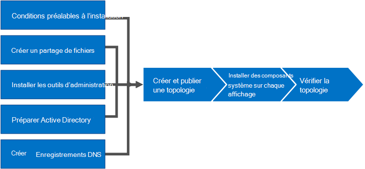

# Installer Skype Entreprise Server
 
**Résumé :** Découvrez comment préparer votre environnement pour une installation de Skype Entreprise Server. Téléchargez une version d’évaluation Skype Entreprise Server gratuite à partir du Centre d’évaluation Microsoft à [https://www.microsoft.com/evalcenter/evaluate-skype-for-business-server](https://www.microsoft.com/evalcenter/evaluate-skype-for-business-server) l':.
  
Cet article vous présente un exemple d’installation de Skype Entreprise Server. Cet article ne tente pas de couvrir toutes les procédures dont vous avez besoin pour effectuer une installation Skype Entreprise Server complète. L’objectif est de fournir des exemples de procédures dans une topologie définie de manière étroite qui inclut des fonctionnalités de base de meet-and-share.
  
## Vue d’ensemble du processus d’installation Skype Entreprise Server

Une installation de Skype Entreprise Server comprend de nombreuses procédures différentes. Les procédures dont vous avez besoin pour Skype Entreprise Server en cours d’exécution dans votre environnement dépendent des spécificités de votre environnement. Par exemple, si vous utilisez Windows Server pour DNS, vous bénéficierez de l’exemple de procédure d’ajout d’une entrée DNS. Si vous utilisez un autre système pour DNS, vous devez suivre les procédures pour votre système DNS particulier. Cela est vrai pour de nombreuses procédures de cette section.
  
Skype Entreprise Server est disponible dans Édition Standard et Êdition Entreprise. La principale différence est que Édition Standard ne prend pas en charge les fonctionnalités de haute disponibilité incluses dans Êdition Entreprise. 
  
Skype Entreprise Server est un produit avancé et le processus d’installation exact dépend grandement de vos circonstances spécifiques. Cette section vous présente les étapes générales d’installation du produit. Toutefois, chaque procédure peut être différente en fonction de votre environnement et des décisions de planification. Par exemple, pour les petites organisations, l’exécution de Skype Entreprise Server Édition Standard peut être appropriée, alors qu’une grande organisation multinationale peut avoir 50 serveurs dans le monde entier dédiés au produit.
  
> [!NOTE]
> Pour en savoir plus sur les dernières mises à jour cumulatives, voir Mises à jour [Skype Entreprise Server](https://support.microsoft.com/kb/3061064). Après avoir installé le correctif CU1, un administrateur doit exécuter  `Update-CsAdminRole` l’cmdlet. Cette cmdlet est nécessaire pour accéder aux nouvelles cmdlets GCP sur Remote PowerShell.
  
> [!IMPORTANT]
> Les procédures de cette section servent d’exemple à l’aide d’un ensemble d’exigences défini de manière étroite et supposent que des décisions spécifiques ont déjà été prises. Les procédures réelles que vous devez installer Skype Entreprise Server seront probablement très différentes. Utilisez les procédures de cette section comme exemple uniquement et non pas comme un guide pas à pas pour l’installation de Skype Entreprise Server dans chaque environnement. 
  
La mise Skype Entreprise Server en cours d’exécution pour la première fois implique huit étapes principales. Vous devez comprendre que les exemples de procédures de cette section ne sont pas les seules procédures requises pour l’installation Skype Entreprise Server. Les huit étapes suivantes sont simplement des exemples pour vous aider à mieux comprendre le processus global et à mettre en place un environnement de travail de base. Vous pouvez suivre les étapes 1 à 5 dans n’importe quel ordre. Toutefois, vous devez suivre les étapes 6, 7 et 8 dans l’ordre et après les étapes 1 à 5, comme indiqué dans le diagramme. Les huit étapes sont les suivantes :
  

  
- [Installez les conditions préalables Skype Entreprise Server](install-prerequisites.md) : installez les prérequis sur tous les serveurs qui Skype Entreprise Server topologie. Notez que les conditions préalables ne sont pas les mêmes pour tous les rôles. Par exemple, les serveurs qui fournissent le rôle frontal ont un ensemble de conditions préalables et les serveurs qui fournissent un rôle de directeur ont un ensemble différent de conditions préalables. Pour plus d’informations, voir la documentation de planification des conditions préalables.
    
- [Créez un partage de fichiers dans Skype Entreprise Server](create-a-file-share.md) : créez un partage de fichiers qui sera utilisé par les serveurs dans l’ensemble Skype Entreprise Server topologie.
    
- [Installez les outils d’administration dans Skype Entreprise Server](install-administrative-tools.md) : les outils d’administration incluent le Générateur de topologie et le Panneau de contrôle. Vous devez installer les outils d’administration sur au moins un serveur dans la topologie ou sur une station de travail de gestion 64 bits exécutant une version de système d’exploitation Windows prise en charge pour Skype Entreprise Server.
    
- [Préparez Active Directory pour Skype Entreprise Server](prepare-active-directory.md) : Skype Entreprise Server fonctionne en étroite collaboration avec Active Directory. Vous devez préparer le domaine Active Directory à l’Skype Entreprise Server. Vous pouvez le faire à l’aide de l’Assistant Déploiement, qui n’est effectué qu’une seule fois pour le domaine. En effet, le processus crée des groupes et modifie le domaine, et vous ne devez le faire qu’une seule fois.
    
- [Créez des enregistrements DNS pour Skype Entreprise Server](create-dns-records.md) : pour que Skype Entreprise Server fonctionne correctement, un certain nombre de paramètres DNS doivent être en place. C’est pour que les clients sachent comment accéder aux services et que les serveurs se connaissent mutuellement. Ces paramètres ne doivent être remplis qu’une seule fois par déploiement, car une fois que vous avez attribué une entrée DNS, elle est disponible dans l’ensemble du domaine.
    
- [Créez](create-and-publish-new-topology.md) et publiez une nouvelle topologie dans Skype Entreprise Server : avant de pouvoir installer le système Skype Entreprise Server sur chacun des serveurs de la topologie, vous devez créer une topologie et la publier. Lorsque vous publiez une topologie, vous chargez les informations de topologie dans la base de données du magasin central de gestion. S’il s’agit d’un pool Êdition Entreprise, vous créez la base de données du magasin central de gestion la première fois que vous publiez une nouvelle topologie. S’il Édition Standard, vous devez exécuter le processus Préparer le premier serveur Édition Standard à partir de l’Assistant Déploiement avant de publier une topologie. Cela permet de préparer les Édition Standard en installant une instance SQL Server Express Edition et en créant le magasin central de gestion.
    
- Installez [Skype Entreprise Server](install-skype-for-business-server.md) sur les serveurs de la topologie : une fois que la topologie est chargée dans le magasin central de gestion et qu’Active Directory sait quels serveurs rempliront les rôles, vous devez installer le système Skype Entreprise Server sur chacun des serveurs de la topologie.
    
- Vérifiez la topologie dans [Skype Entreprise Server](verify-the-topology.md) : une fois la topologie publiée et les composants système Skype Entreprise Server installés sur chacun des serveurs de la topologie, vous êtes prêt à vérifier que la topologie fonctionne comme prévu. Cela inclut la vérification que la configuration s’est propagée à tous les serveurs Active Directory afin que l’ensemble du domaine sache que Skype Entreprise est disponible dans le domaine.
    

