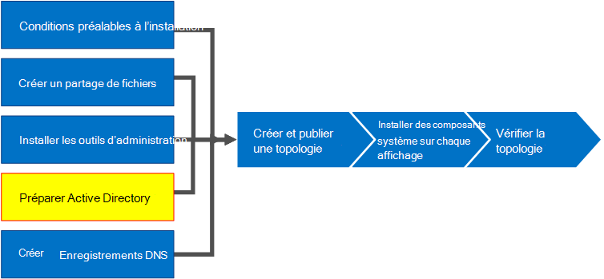
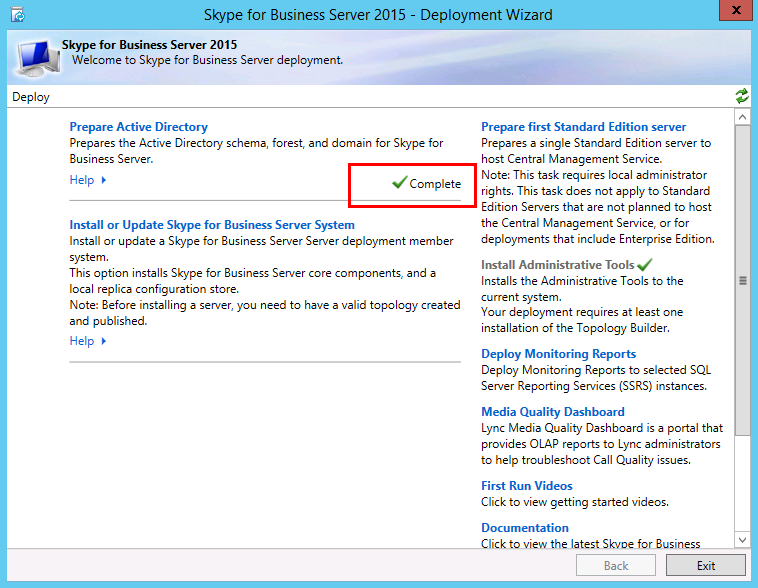

# <a name="skype-for-business-server-prepare-active-directory"></a>Skype Entreprise Server : Préparer Active Directory
 
**Résumé:** Découvrez comment préparer votre domaine Active Directory pour une installation de Skype Entreprise Server.
  
Skype Entreprise Server travaille en étroite collaboration avec Active Directory. Vous devez préparer le domaine Active Directory pour qu’il fonctionne avec Skype Entreprise Server. Ce processus est effectué dans l’Assistant Déploiement et n’est effectué qu’une seule fois pour le domaine. Cela est dû au fait que le processus crée des groupes et modifie le domaine, et vous n’avez besoin de le faire qu’une seule fois. Vous pouvez effectuer les étapes 1 à 5 dans n’importe quel ordre. Toutefois, vous devez effectuer les étapes 6, 7 et 8 dans l’ordre, et après les étapes 1 à 5, comme indiqué dans le diagramme. La préparation d’Active Directory est l’étape 4 sur 8. Pour plus d’informations sur la planification d’Active Directory, consultez [Les exigences environnementales pour les exigences de Skype Entreprise Server](../../plan-your-deployment/requirements-for-your-environment/environmental-requirements.md) ou [de serveur pour Skype Entreprise Server 2019](../../../SfBServer2019/plan/system-requirements.md).
  

  
## <a name="prepare-active-directory"></a>Préparer Active Directory

Skype Entreprise Server est étroitement intégré à services de domaine Active Directory (AD DS). Avant de pouvoir installer Skype Entreprise Server pour la première fois, Active Directory doit être préparé. La section de l’Assistant Déploiement intitulée **Préparer Active Directory** prépare l’environnement Active Directory à utiliser avec Skype Entreprise Server.
  
> [!NOTE]
> Skype Entreprise Server utilise (AD DS) pour suivre et communiquer avec tous les serveurs d’une topologie. La majorité de ces serveurs doivent être joints au domaine afin que Skype Entreprise Server puisse fonctionner correctement. Gardez à l’esprit que les serveurs tels que Edge et proxy inverse ne doivent pas être joints à un domaine.
  
> [!IMPORTANT]
> La procédure Préparer Active Directory ne doit être exécutée qu’une seule fois pour chaque domaine du déploiement. 
  
Regardez les étapes vidéo de **préparation d’Active Directory** :
  
> [!video https://www.microsoft.com/videoplayer/embed/RE1Ybuk]
  
### <a name="prepare-active-directory-from-the-deployment-wizard"></a>Préparer Active Directory à partir de l’Assistant Déploiement

1. Connectez-vous en tant qu’utilisateur avec les informations d’identification d’administrateur de schéma pour le domaine Active Directory.
    
2. Ouvrez Skype Entreprise Server Assistant Déploiement.
    
    > [!TIP]
    > Si vous souhaitez passer en revue les fichiers journaux créés par l’Assistant Déploiement Skype Entreprise Server, vous pouvez les trouver sur l’ordinateur sur lequel l’Assistant Déploiement a été exécuté, dans le répertoire Utilisateurs de l’utilisateur AD DS qui a exécuté l’étape. Par exemple, si l’utilisateur s’est connecté en tant qu’administrateur de domaine dans le domaine, contoso.local, les fichiers journaux se trouvent dans : C:\Users\Administrator.Contoso\AppData\Local\Temp. 
  
3. Cliquez sur le lien **Préparer Active Directory** .
    
4. **Étape 1 : Préparer le schéma**
    
    a. Passez en revue les informations sur les prérequis de l’étape 1 accessibles en cliquant sur la liste déroulante sous le titre de l’étape 1.
    
    b. Cliquez sur **Exécuter** à l’étape 1 pour lancer l’Assistant Préparation du schéma.
    
    c. Notez que la procédure ne doit être exécutée qu’une seule fois pour chaque déploiement, puis cliquez sur **Suivant**.
    
    d. Une fois le schéma préparé, vous pouvez afficher le journal en cliquant sur Afficher le **journal**. 
    
    e. Cliquez sur **Terminer** pour fermer l’Assistant Préparer le schéma, puis revenez aux étapes préparer Active Directory.
    
5. **Étape 2 : Vérifier la réplication de la partition de schéma**
    
    a. Connectez-vous au contrôleur de domaine pour le domaine.
    
    b. Ouvrez **ADSI Edit** à partir du menu déroulant **Outils** dans **Gestionnaire de serveur**.
    
    c. Dans le menu **Action**, cliquez sur **Connexion à**.
    
    d. Dans la boîte de dialogue **Paramètres de connexion** sous **Sélectionnez un contexte d’attribution de noms connu**, sélectionnez **Schéma**, puis cliquez sur **OK**.
    
    e. Sous le conteneur de schéma, recherchez **CN=ms-RTC-SIP-SchemaVersion**. Si cet objet existe et que la valeur de l’attribut **rangeUpper** est 1150 et que la valeur de l’attribut **rangeLower** est 3, le schéma a été correctement mis à jour et répliqué. Si cet objet n’existe pas ou que les valeurs des attributs **rangeUpper** et **rangeLower** ne sont pas telles que spécifiées, le schéma n’a pas été modifié ou n’a pas été répliqué.
    
6. **Étape 3 : Préparer la forêt actuelle**
    
    a. Passez en revue les informations sur les prérequis de l’étape 3 accessibles en cliquant sur la liste déroulante sous le titre de l’étape 3.
    
    b. Cliquez sur **Exécuter** à l’étape 3 pour lancer l’Assistant Préparer la forêt active.
    
    c. Notez que la procédure ne doit être exécutée qu’une seule fois par déploiement, puis cliquez sur **Suivant**.
    
    d. Spécifiez le domaine dans lequel les groupes universels seront créés. Si le serveur fait partie du domaine, vous pouvez choisir **domaine local**, puis cliquer sur **Suivant**.
    
    e. Une fois la forêt préparée, vous pouvez afficher le journal en cliquant sur **Afficher le journal**. 
    
    f. Cliquez sur **Terminer** pour fermer l’Assistant Préparer la forêt active, puis revenez aux étapes de préparation d’Active Directory.
    
    g. Cliquez sur **Skype Entreprise Server Shell de gestion** à partir de la page **Applications** pour lancer PowerShell.
    
    h. Tapez la commande Get-CsAdForest, puis **appuyez sur Entrée**.
    
    i. Si le résultat est **LC_FORESTSETTINGS_STATE_READY**, la forêt a été préparée avec succès, comme illustré dans la figure.
    
     
  
7. **Étape 4 : Vérifier la réplication du catalogue global**
    
    a. Sur un contrôleur de domaine (de préférence dans un site distant à partir des autres contrôleurs de domaine), dans la forêt où la préparation de la forêt a été exécutée, ouvrez **Utilisateurs et ordinateurs Active Directory**.
    
    b. Dans **Utilisateurs et ordinateurs Active Directory**, développez le nom de domaine de votre forêt ou un domaine enfant.
    
    c. Cliquez sur le conteneur **Utilisateurs** dans le volet gauche, puis recherchez le groupe universel **CsAdministrator** dans le volet de droite. Si CsAdministrator (entre autres nouveaux groupes universels commençant par Cs) est présent, la réplication Active Directory a réussi.
    
    d. Si les groupes ne sont pas encore présents, vous pouvez forcer la réplication, ou attendre 15 minutes et actualiser le volet de droite. Lorsque les groupes apparaissent, la réplication est terminée.
    
8. **Étape 5 : Préparer le domaine actuel**
    
    a. Passez en revue les informations sur les prérequis pour l’étape 5.
    
    b. Cliquez sur **Exécuter** à l’étape 5 pour lancer l’Assistant Préparer le domaine actuel.
    
    c. Notez que la procédure ne doit être exécutée qu’une seule fois pour chaque domaine du déploiement, puis cliquez sur **Suivant**.
    
    d. Une fois le domaine préparé, vous pouvez afficher le journal en cliquant sur **Afficher le journal**. 
    
    e. Cliquez sur **Terminer** pour fermer l’Assistant Préparer le domaine actuel, puis revenez aux étapes de préparation d’Active Directory.
    
    Ces étapes doivent être effectuées dans chaque domaine où Skype Entreprise Server objets sont trouvés, sinon les services risquent de ne pas démarrer. Cela inclut tout type d’objet Active Directory, tel que les utilisateurs, les objets de contact, les groupes d’administration ou tout autre type d’objet. Vous pouvez utiliser Set-CsUserReplicatorConfiguration -ADDomainNamingContextList pour ajouter uniquement les domaines avec des objets Skype Entreprise Server, si nécessaire.
    
9. **Étape 6 : Vérifier la réplication dans le domaine**
    
    a. Cliquez sur **l’interpréteur de commandes de gestion Skype Entreprise Server** à partir de la page **Applications** pour lancer PowerShell.
    
    b. Utilisez la commande Get-CsAdDomain pour vérifier la réplication au sein du domaine.
    
   ```powershell
   Get-CsAdDomain [-Domain <Fqdn>] [-DomainController <Fqdn>] [-GlobalCatalog <Fqdn>] [-GlobalSettingsDomainController <Fqdn>]
   ```

    > [!NOTE]
    > Si vous omettez le paramètre Domain, le domaine local est utilisé. 
  
    Exemple d’exécution de la commande pour le domaine contoso.local :
    
   ```powershell
   Get-CsAdDomain -Domain contoso.local -GlobalSettingsDomainController dc.contoso.local
   ```

    > [!NOTE]
    > En utilisant le paramètre GlobalSettingsDomainController, vous pouvez indiquer où sont stockés les paramètres globaux. Si vos paramètres sont stockés dans le conteneur système (ce qui est courant avec les déploiements de mise à niveau qui n’ont pas fait migrer le paramètre global vers le conteneur configuration), vous définissez un contrôleur de domaine à la racine de votre forêt AD DS. Si les paramètres globaux se trouvent dans le conteneur de configuration (ce qui est caractéristique des nouveaux déploiements ou des déploiements de mise à niveau où les paramètres ont été migrés vers le conteneur de configuration, vous définissez tout contrôleur de domaine de la forêt. Si vous ne spécifiez pas ce paramètre, l’applet de commande suppose que les paramètres sont stockés dans le conteneur configuration et fait référence à n’importe quel contrôleur de domaine dans Active Directory. 
  
    c. Si le résultat est **LC_DOMAINSETTINGS_STATE_READY**, le domaine a été répliqué avec succès.
    
10. **Étape 7 : Ajouter des utilisateurs pour fournir un accès administratif au Skype Entreprise Server Panneau de configuration**
    
    a. Ouvrez une session en tant que membre du groupe Administrateurs du domaine ou du groupe RTCUniversalServerAdmins.
    
    b. Ouvrez **Utilisateurs et ordinateurs Active Directory**, développez votre domaine, cliquez sur le conteneur **Utilisateurs**, cliquez avec le bouton droit sur CSAdministrator, puis choisissez **Propriétés**.
    
    c. Dans **Propriétés de CSAdministrator**, cliquez sur l’onglet **Membres**.
    
    d. Sous l'onglet **Membres**, cliquez sur **Ajouter**. Dans **Sélectionner des utilisateurs, des contacts, des ordinateurs, des comptes de service ou des groupes**, recherchez **Entrez les noms des objets à sélectionner**. Tapez le ou les noms d’utilisateur ou de groupe à ajouter au groupe CSAdministrators. Cliquez sur **OK**.
    
    e. Sous l’onglet **Membres** , vérifiez que les utilisateurs ou groupes que vous avez sélectionnés sont présents. Cliquez sur **OK**.
    
    > [!CAUTION]
    > Le Skype Entreprise Server Panneau de configuration est un outil de contrôle d’accès en fonction du rôle. L’appartenance au groupe CsAdministrator donne à un utilisateur qui utilise le Skype Entreprise Server Panneau de configuration contrôle total pour toutes les fonctions de configuration disponibles. D’autres rôles conçus pour des fonctions spécifiques sont disponibles. Pour plus d’informations sur les rôles disponibles, consultez [Les exigences environnementales pour Skype Entreprise Server](../../plan-your-deployment/requirements-for-your-environment/environmental-requirements.md) ou les [exigences de serveur pour Skype Entreprise Server 2019](../../../SfBServer2019/plan/system-requirements.md). Notez que les utilisateurs n’ont pas besoin d’être activés pour Skype Entreprise Server afin d’être membres des groupes d’administration. 
  
    > [!CAUTION]
    > Pour conserver la sécurité et l’intégrité du contrôle d’accès en fonction du rôle, ajoutez des utilisateurs aux groupes qui définissent le rôle que l’utilisateur joue dans la gestion du déploiement Skype Entreprise Server. 
  
11. Déconnectez-vous, puis reconnectez-vous à Windows afin que votre jeton de sécurité soit mis à jour avec le nouveau groupe de sécurité Skype Entreprise Server, puis rouvrez l’Assistant Déploiement.
    
12. Vérifiez que vous voyez une coche verte en regard de **Préparer Active Directory** pour confirmer la réussite, comme illustré dans la figure.
    
     
  

## <a name="see-also"></a>Voir aussi
 
[services de domaine Active Directory pour Skype Entreprise Server 2015](../../plan-your-deployment/security/active-directory-domain-services.md)
