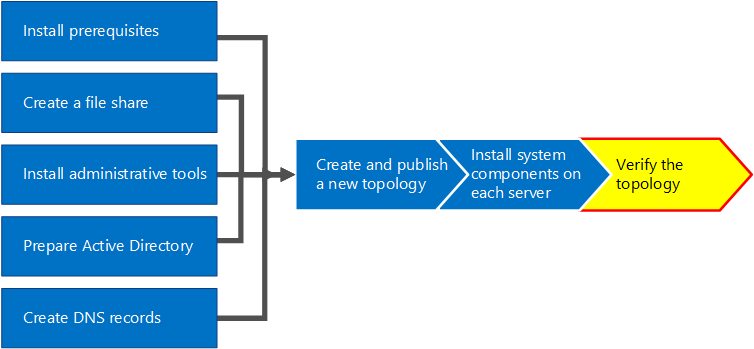
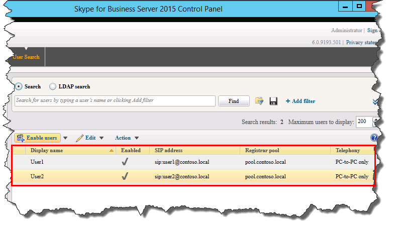

# Vérifier la topologie dans Skype Entreprise Server
 
**Résumé :** Découvrez comment vérifier que la topologie Skype Entreprise Server serveurs Active Directory fonctionnent comme prévu. Téléchargez une version d’évaluation Skype Entreprise Server gratuite à partir du [Centre d’évaluation Microsoft.](https://www.microsoft.com/evalcenter/evaluate-skype-for-business-server)
  
Une fois la topologie publiée et les composants système Skype Entreprise Server installés sur chacun des serveurs de la topologie, vous êtes prêt à vérifier que la topologie fonctionne comme prévu. Cela inclut la vérification que la configuration s’est propagée à tous les serveurs Active Directory afin que l’ensemble du domaine sache Skype Entreprise est disponible dans le domaine. Vous pouvez suivre les étapes 1 à 5 dans n’importe quel ordre. Toutefois, vous devez suivre les étapes 6, 7 et 8 dans l’ordre et après les étapes 1 à 5, comme indiqué dans le diagramme. La vérification de la topologie est l’étape 8 sur 8.
  

  
## Tester le déploiement de pool frontal

La dernière étape consiste à tester le pool frontal et à vérifier que les clients Skype Entreprise peuvent communiquer entre eux. 
  
### Ajouter des utilisateurs et vérifier la connectivité du client

1. Utilisez les ordinateurs et les utilisateurs Active Directory pour ajouter l’objet utilisateur Active Directory du rôle d’administrateur pour le déploiement Skype Entreprise Server (sur lequel le Panneau de Skype Entreprise Server est installé) au groupe **CSAdministrator.**
    
    > [!IMPORTANT]
    > Si vous n’ajoutez pas les utilisateurs et groupes appropriés au groupe CsAdministors, vous recevrez une erreur lorsque vous ouvrirez le Panneau de Skype Entreprise Server qui indique « Non autorisé : l’accès est refusé en raison d’un échec d’autorisation de contrôle d’accès basé sur un rôle (RBAC). » 
  
2. Si l’objet utilisateur est actuellement connecté, fermez, puis rouvrez la session pour inscrire la nouvelle affectation de groupe.
    
    > [!NOTE]
    > Le compte d’utilisateur ne peut pas être l’administrateur local d’un serveur exécutant Skype Entreprise Server. 
  
3. Utilisez le compte d’administration pour vous connecter à l’ordinateur Skype Entreprise Server panneau de Skype Entreprise Server est installé.
    
4. Démarrez Skype Entreprise Server panneau de contrôle, puis fournissez les informations d’identification, si vous y êtes invité. Skype Entreprise Server Le Panneau de contrôle affiche les informations de déploiement.
    
5. Dans la barre de navigation de gauche, cliquez sur Topologie, puis vérifiez que l’état du service affiche un ordinateur avec une flèche verte et qu’une coche verte pour l’état de la réplication est en regard de chaque rôle Skype Entreprise Server qui a été déployé et mis en ligne. 
    
6. Dans la barre de navigation de gauche, cliquez sur **Utilisateurs**, puis sur **Activer les utilisateurs**. 
    
7. Dans la page **Nouvel Skype Entreprise Server utilisateur,** cliquez sur **Ajouter.**
    
8. Pour définir les paramètres de recherche des objets que vous souhaitez trouver, sur la page **Sélectionner à partir d’Active Directory**, vous pouvez sélectionner **Rechercher**, puis éventuellement cliquer sur **Ajouter un filtre**. Vous pouvez également sélectionner **Recherche LDAP** et entrer une expression LDAP pour filtrer ou limiter les objets qui seront renvoyés. Une fois que vous avez choisi vos options de recherche, cliquez sur **Rechercher.**
    
9. Dans le volet Résultats de la recherche, sélectionnez les utilisateurs que vous souhaitez ajouter, puis cliquez sur **OK.**
    
10. Dans la page **Nouvel Skype Entreprise Server utilisateur,** les utilisateurs que vous avez sélectionnés sont affichés dans **l’affichage** Utilisateurs. Dans la **liste Affecter des utilisateurs à un pool,** sélectionnez le serveur où les utilisateurs doivent résider.
    
    Voici une liste d’options que vous pouvez utiliser pour configurer les objets.
    
    - **Générer l’URI SIP de l’utilisateur**
    
    - **Téléphonie**
    
    - **URI de ligne**
    
    - **Stratégie de conférence**
    
    - **Stratégie de version du client**
    
    - **Stratégie de code confidentiel**
    
    - **Stratégie d’accès externe**
    
    - **Stratégie d’archivage**
    
    - **Stratégie d’emplacement**
    
    - **Stratégie du client**
    
    Pour tester les fonctionnalités de base, sélectionnez l’option de votre choix pour le paramètre Générer **l’URI SIP de l’utilisateur** (les autres options de la configuration utilisent les paramètres par défaut), puis cliquez sur **Activer,** comme illustré dans la figure.
    
     
  
11. Une page récapitulatif s’affiche et affiche une coche dans la colonne **Enabled** pour indiquer que les utilisateurs sont en cours d’installation. La **colonne d’adresse SIP** affiche l’adresse dont vous avez besoin pour la configuration de la connectez-vous de l’utilisateur.
    
     
  
12. Connectez un utilisateur à un ordinateur qui est joint au domaine et un autre utilisateur sur un autre ordinateur du domaine.
    
13. Installez Skype Entreprise client sur chacun des deux ordinateurs clients, puis vérifiez que les deux utilisateurs peuvent se Skype Entreprise Server et envoyer des messages instantanés entre eux.
    

