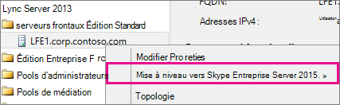
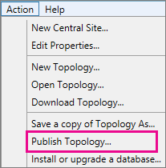
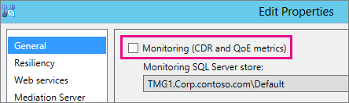
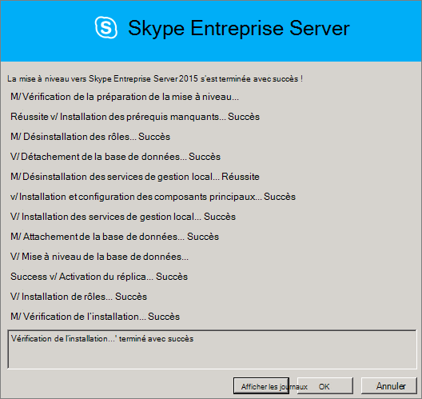
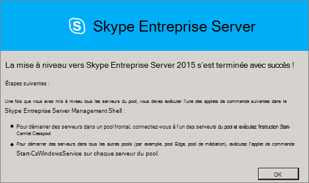
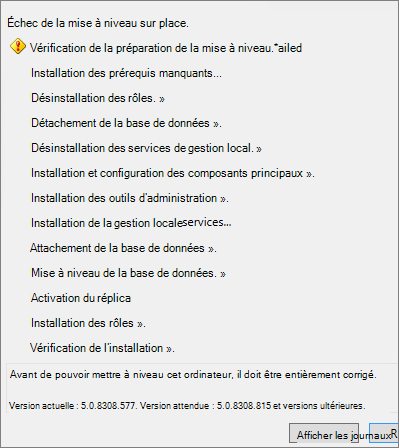

# <a name="upgrade-to-skype-for-business-server-2015"></a>Mise à niveau vers Skype Entreprise Server 2015
 
**Résumé :** Découvrez comment mettre à niveau Lync Server 2013 vers Skype Entreprise Server 2015. Téléchargez une version d’évaluation gratuite Skype Entreprise Server 2015 à partir du Centre [d’évaluation Microsoft.](https://www.microsoft.com/evalcenter/evaluate-skype-for-business-server)
  
Utilisez les procédures de ce document pour mettre à niveau de Lync Server 2013 vers Skype Entreprise Server 2015 à l’aide du Générateur de topologie Skype Entreprise Server et de la nouvelle fonctionnalité In-Place Upgrade. Si vous souhaitez mettre à niveau Lync Server 2010 ou Office Communications Server 2007 R2, voir [Plan to upgrade to Skype Entreprise Server 2015](../plan-your-deployment/upgrade.md).

> [!NOTE]
> Les mises à niveau sur place étaient disponibles Skype Entreprise Server 2015, mais ne sont plus Skype Entreprise Server 2019. La coexistence côte à côte est prise en charge, voir [Migration vers Skype Entreprise Server 2019](../../SfBServer2019/migration/migration-to-skype-for-business-server-2019.md) pour plus d’informations.
  
## <a name="upgrade-from-lync-server-2013"></a>Mise à niveau à partir de Lync Server 2013

La mise à niveau de Lync Server 2013 vers Skype Entreprise Server 2015 implique l’installation des logiciels prérequis, l’utilisation du Générateur de topologie Skype Entreprise Server pour mettre à niveau les bases de données dans le pool et l’utilisation de la mise à niveau Skype Entreprise Server In-Place sur chacun des serveurs associés au pool. Pour terminer la mise à niveau, vous allez au bout des huit étapes de cette rubrique.
  
### <a name="before-you-begin"></a>Avant de commencer

- Examiner [le plan de mise à niveau vers Skype Entreprise Server 2015](../plan-your-deployment/upgrade.md).
    
- Passer [en revue la Skype Entreprise Server serveur pour 2015.](../plan-your-deployment/requirements-for-your-environment/server-requirements.md)
    
- [Installez les conditions préalables Skype Entreprise Server 2015.](install/install-prerequisites.md)
    
- [Installez Skype Entreprise Server 2015.](install/install.md)
    
### <a name="step-1-install-administrator-tools-and-download-topology"></a>Étape 1 : Installer les outils d’administrateur et télécharger la topologie

1. Connecter sur l’ordinateur de la topologie où Lync OCSCore ou aucun autre composant Lync n’est installé.
    
2. À partir Skype Entreprise Server d’installation 2015, exécutezSetup.exeà partir de **OCS_Volume\Setup\AMD64**.  
    
3. Cliquez sur **Installer**. 
    
4. Permet d'accepter le contrat de licence.
    
5. Dans l’Assistant Déploiement, cliquez sur Installer les outils **d’administrateur** et suivez les étapes d’installation.
    
     
  
6. Dans l’Windows de démarrage, ouvrez Skype Entreprise Server générateur de topologie.
    
7. Cliquez **sur Télécharger la topologie à partir d’un déploiement existant,** puis sur **Suivant.**
    
8. Entrez un nom pour la topologie, puis cliquez sur **Enregistrer.**
    
9. Go to location where you saved the topology, and make a copy of the topology.
    
### <a name="step-2-upgrade-and-publish-topology-using-topology-builder"></a>Étape 2 : Mettre à niveau et publier la topologie à l’aide du Générateur de topologie

Avant de commencer le processus de mise à niveau, tous les services doivent être en cours d’exécution pour les pools que vous prévoyez de mettre à niveau. Ainsi, les modifications apportées à la topologie seront répliquées sur la base de données locale des serveurs du pool.
  
> [!IMPORTANT]
>  Enregistrez une copie de votre fichier de topologie avant la mise à niveau. Après la mise à niveau, vous ne pourrez pas rétrograder la topologie.> Si vos services sont sur les mêmes serveurs que vos bases de données, comme le service de conversation permanente se trouve sur le même serveur que la base de données de conversation permanente, ignorez cette étape et passez à l’étape 4. Après avoir arrêté les services, exécutez le programme dIn-Place de mise à niveau sur chaque serveur pour mettre à niveau les bases de données locales.
  
> [!NOTE]
> Si la topologie dispose d’une base de données principale mise en miroir, les  bases de données Principale et Miroir s’afficheront lorsque vous publierez la topologie à l’aide du Générateur de topologies. Assurez-vous que toutes les bases de données sont en cours d’exécution sur le principal et sélectionnez uniquement le principal, et non le miroir, lors de la publication de la topologie, sinon vous verrez un avertissement après la publication de la topologie.
  
Choisissez l’une des options ci-dessous pour mettre à niveau et publier une nouvelle topologie à l’aide du Générateur de topologies Skype Entreprise Server 2015. Une fois que vous avez terminé les étapes et publié la topologie mise à jour, passer à l’étape 3 de cette rubrique.
  
#### <a name="option-1-upgrade-an-isolated-front-end-pool-and-associated-archiving-and-monitoring-stores"></a>Option 1 : mettre à niveau un pool frontal isolé et les magasins d’archivage et de surveillance associés

Si le pool que vous mettre à niveau possède une dépendance au magasin d’archivage et de surveillance, lorsque vous utilisez les étapes suivantes, le magasin d’archivage et de surveillance est également mis à niveau.
  
1. Dans le Générateur de topologie, cliquez avec le bouton droit sur un pool Lync Server 2013, sélectionnez Mettre à niveau **vers Skype Entreprise Server 2015** et suivez les étapes. 
    
     
  
2. Dans le Générateur de topologie, cliquez sur Publier une **topologie d’action**  >   ou sur Publier une   >    >  **topologie d’action.** 
    
     
  
3. Lors de la publication, choisissez d’installer une base de données dans le magasin d’archivage et de surveillance.
    
#### <a name="option-2-upgrade-front-end-pool-without-upgrading-archiving-and-monitoring-stores"></a>Option 2 : mettre à niveau le pool frontal sans mettre à niveau les magasins d’archivage et de surveillance

Si vous utilisez les étapes suivantes, l’archivage et la surveillance du pool sélectionné sont désactivés. Le pool n’aura pas de magasins d’archivage et de surveillance après la mise à niveau.
  
1. Dans le Générateur de topologie, sélectionnez le pool Lync Server 2013 à mettre à niveau.
    
2. Supprimez la dépendance aux magasins d’archivage et de surveillance Lync Server 2013. 
    
   - Go to **Action**  >  **Edit properties**.
    
   - Cochez **la case** Archivage.
    
     
  
   - Cochez **la case** Analyse.
    
     
  
3. Cliquez avec le bouton droit sur le pool Lync Server 2013, sélectionnez Mettre à niveau **vers Skype Entreprise Server 2015** et suivez les étapes. 
    
     
  
4. Dans le Générateur de topologie, cliquez sur Publier une **topologie d’action**  >   ou sur Publier une   >    >  **topologie d’action.** 
    
#### <a name="option-3-upgrade-front-end-pool-and-associated-it-to-new-skype-for-business-server-2015-archiving-and-monitoring-stores"></a>Option 3 : Mettre à niveau le pool frontal et l’associer aux nouveaux magasins d’archivage et de surveillance Skype Entreprise Server 2015

Si vous utilisez les étapes suivantes, l’archivage et la surveillance s’arrêtent dans le magasin précédent et démarrent dans le nouveau magasin que vous avez créé. 
  
1. Dans le Générateur de topologie, sélectionnez le pool Lync Server 2013 à mettre à niveau. 
    
2. Supprimez la dépendance aux magasins d’archivage et de surveillance Lync Server 2013. 
    
   - Go to **Action**  >  **Edit properties**.
    
   - Cochez **la case** Archivage.
    
     
  
   - Cochez **la case** Analyse.
    
     
  
3. Cliquez avec le bouton droit sur le pool Lync Server 2013, sélectionnez Mettre à niveau **vers Skype Entreprise Server 2015** et suivez les étapes. 
    
     
  
4. Créez un magasin SQL’archivage. 
    
   - Sélectionnez le pool et les **propriétés Action**  >  **Edit**. 
    
   -  Activez la case à cocher **Archivage**.
    
   - Cliquez sur **Nouveau**.
    
     
  
5. Créez un magasin SQL pour la surveillance. 
    
   - Sélectionnez le pool et les **propriétés Action**  >  **Edit**. 
    
   -  Cochez **la case** Analyse.
    
   - Cliquez sur **Nouveau**.
    
     
  
6. Dans le Générateur de topologie, cliquez sur Publier une **topologie d’action**  >   ou sur Publier une   >    >  **topologie d’action.** 
    
7. Lors de la publication, choisissez d’installer la base de données sur le nouveau magasin d’archivage et de surveillance.
    
### <a name="step-3-wait-for-replication"></a>Étape 3 : Attendre la réplication

Donnez à la réplication le temps de publier la topologie mise à jour sur tous les serveurs de l’environnement.
  
### <a name="step-4-stop-all-services-in-pool-to-be-upgraded"></a>Étape 4 : Arrêter tous les services du pool à mettre à niveau

Sur chaque serveur qui dessert le pool que vous allez mettre à niveau, exécutez l’cmdlet suivante dans PowerShell :
  
```powershell
Disable-CsComputer -Scorch
```

Nous vous recommandons d'Disable-CsComputer, car vous devrez peut-être redémarrer le serveur pendant le In-Place de mise à niveau. Si vous utilisez Stop-CsWindowsService, certains services peuvent redémarrer automatiquement après un redémarrage. Cela peut entraîner l’échec In-Place mise à niveau.
  
### <a name="step-5-upgrade-front-end-pools-and-non-front-end-pool-servers"></a>Étape 5 : Mettre à niveau les pools frontux et les serveurs de pools non frontiers

> [!NOTE]
>  Avant la mise à niveau, installez toutes les nouvelles conditions préalables requises pour Skype Entreprise Server 2015 qui incluent :> au moins 32 Go d’espace libre avant de tenter une mise à niveau. En outre, assurez-vous que le lecteur est un lecteur local fixe, qu’il n’est pas connecté par USB ou Firewire, est mis en forme avec le système de fichiers NTFS, n’est pas compressé et ne contient pas de fichier de page.> PowerShell version 6.2.9200.0 ou ultérieure.> La dernière mise à jour cumulative Lync Server 2013 installée.> SQL Server 2012 SP1 installé.> La base de données suivante est installée (installée automatiquement si vous utilisez Microsoft Update) : > Windows Server 2008 R2 -[KB2533623](https://support.microsoft.com/kb/2533623)> Windows Server 2012 -[KB2858668](https://support.microsoft.com/kb/2858668)> Windows Server 2012 R2 -[KB2982006](https://support.microsoft.com/kb/2982006)
  
Utilisez la In-Place sur chaque serveur pour mettre à jour le pool frontal, le pool edge, le serveur de médiation et le pool de conversation permanente.
  
1. Sur chaque serveur, exécutez **Setup.exe** à partir **OCS_Volume\Setup\amd64** sur le support d’installation Skype Entreprise Server 2015.
    
2. Acceptez le contrat de licence et suivez les invites pour la In-Place mise à niveau.
    
3. Répétez ces étapes pour chaque serveur du pool frontal et sur chaque serveur de pool non frontal.
    
> [!NOTE]
> Vous pouvez être invité à redémarrer le serveur pendant la In-Place mise à niveau. C'est d'accord. Après le redémarrage, la mise à niveau In-Place continue là où elle s’est éteinte. 
  
Lorsque la In-Place de mise à niveau se termine correctement, le message suivant s’envoie.
  

  
### <a name="step-6-restart-services-on-all-upgraded-servers"></a>Étape 6 : Redémarrer les services sur tous les serveurs mis à niveau

> [!NOTE]
> Avant de redémarrer les services, assurez-vous que %ProgramData%\WindowsFabric n’existe pas sur tous les serveurs frontaux. S’il existe, supprimez-le avant de démarrer les services. 
  
- Après avoir mis à niveau tous les serveurs du pool frontal, redémarrez les services à l’aide de la commande PowerShell suivante : 
    
  ```powershell
  Start-CsPool
  ```

    > [!NOTE]
    > Si un redémarrage du système est déjà nécessaire avant de commencer l’exécution de In-Place Upgrade, In-Place Upgrade ne vous demandera pas de redémarrer à la fin de l’installation. Certaines exceptions d’assembly seront alors lancées sur le premier serveur frontal lorsque vous tenterez de démarrer des services à l’aide de la cmdlet Start-CSPool. Pour résoudre ces erreurs, redémarrez tous les serveurs du pool et ré-exécutez l’applet de calcul. 
  
- Sur les serveurs de pool non frontaux, redémarrez les services à l’aide de la commande suivante :
    
  ```powershell
  Start-CsWindowsService
  ```

Une fois que vous avez cliqué sur **OK** sur In-Place page Mise à niveau, vous verrez le rappel suivant pour effectuer cette étape.
  

  
### <a name="step-7-verify-skype-for-business-functionality-works"></a>Étape 7 : Vérifier que la fonctionnalité Skype Entreprise fonctionne

Pour vous assurer que la mise à niveau a réussi, pour le pool qui a été mis à niveau, testez Skype Entreprise pour vous assurer que la fonctionnalité fonctionne comme prévu. 
  
### <a name="step-8-upgrade-secondary-pools"></a>Étape 8 : Mettre à niveau les pools secondaires

Répétez les étapes de cette rubrique pour mettre à niveau les pools supplémentaires dont vous avez besoin dans votre environnement.
  
## <a name="troubleshoot-issues-with-the-in-place-upgrade"></a>Résoudre les problèmes avec la mise à niveau In-Place mise à niveau

Si la In-Place mise à niveau échoue, vous pouvez voir un message semblable à celui de l’image suivante. 
  

  
Examinez le message complet au bas de la page pour vous aider à résoudre le problème. Cliquez **sur Afficher les journaux** pour obtenir plus de détails.
  
Si la mise à niveau  In-Place échoue lors de la vérification de la préparation à la mise à niveau ou de l’installation des conditions **préalables manquantes,** assurez-vous que toutes les dernières mises à jour de Windows Server, Lync Server et SQL Server sont appliquées au serveur, et que tous les logiciels et rôles requis sont installés. Pour obtenir la liste des conditions requises, voir Server [requirements for Skype Entreprise Server 2015](../plan-your-deployment/requirements-for-your-environment/server-requirements.md) and [Install prerequisites for Skype Entreprise Server 2015](install/install-prerequisites.md).
  
## <a name="see-also"></a>Voir aussi

[Planifier la mise à niveau vers Skype Entreprise Server 2015](../plan-your-deployment/upgrade.md)
  
[Server requirements for Skype Entreprise Server 2015](../plan-your-deployment/requirements-for-your-environment/server-requirements.md)
  
[Conditions préalables à l’installation Skype Entreprise Server 2015](install/install-prerequisites.md)
  
[Installer Skype Entreprise Server 2015](install/install.md)
