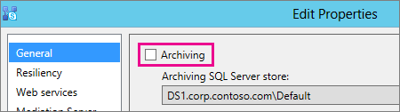

# <a name="upgrade-to-skype-for-business-server-2015"></a><span data-ttu-id="a9c84-104">Mise à niveau vers Skype Entreprise Server 2015</span><span class="sxs-lookup"><span data-stu-id="a9c84-104">Upgrade to Skype for Business Server 2015</span></span>
 
<span data-ttu-id="a9c84-105">**Résumé :** Découvrez comment mettre à niveau Lync Server 2013 vers Skype Entreprise Server 2015.</span><span class="sxs-lookup"><span data-stu-id="a9c84-105">**Summary:** Learn how to upgrade from Lync Server 2013 to Skype for Business Server 2015.</span></span> <span data-ttu-id="a9c84-106">Téléchargez une version d’évaluation gratuite de Skype Entreprise Server 2015 à partir du Centre [d’évaluation Microsoft.](https://www.microsoft.com/evalcenter/evaluate-skype-for-business-server)</span><span class="sxs-lookup"><span data-stu-id="a9c84-106">Download a free trial of Skype for Business Server 2015 from the  [Microsoft Evaluation center](https://www.microsoft.com/evalcenter/evaluate-skype-for-business-server).</span></span>
  
<span data-ttu-id="a9c84-107">Utilisez les procédures de ce document pour mettre à niveau Lync Server 2013 vers Skype Entreprise Server 2015 à l’aide du Générateur de topologies Skype Entreprise Server et de la nouvelle fonctionnalité In-Place Upgrade.</span><span class="sxs-lookup"><span data-stu-id="a9c84-107">Use the procedures in this document to upgrade from Lync Server 2013 to Skype for Business Server 2015 by using the Skype for Business Server Topology Builder and the new In-Place Upgrade feature.</span></span> <span data-ttu-id="a9c84-108">Si vous souhaitez mettre à niveau à partir de Lync Server 2010 ou Office Communications Server 2007 R2, voir [Plan to upgrade to Skype for Business Server 2015](../plan-your-deployment/upgrade.md).</span><span class="sxs-lookup"><span data-stu-id="a9c84-108">If you want to upgrade from Lync Server 2010 or Office Communications Server 2007 R2, see [Plan to upgrade to Skype for Business Server 2015](../plan-your-deployment/upgrade.md).</span></span>

> [!NOTE]
> <span data-ttu-id="a9c84-109">Les mises à niveau sur place étaient disponibles dans Skype Entreprise Server 2015, mais ne sont plus pris en charge dans Skype Entreprise Server 2019.</span><span class="sxs-lookup"><span data-stu-id="a9c84-109">In-place upgrades were available in Skype for Business Server 2015 but are no longer supported in Skype for Business Server 2019.</span></span> <span data-ttu-id="a9c84-110">La coexistence côte à côte est prise en charge. Pour plus d’informations, voir Migration vers Skype Entreprise [Server 2019.](../../SfBServer2019/migration/migration-to-skype-for-business-server-2019.md)</span><span class="sxs-lookup"><span data-stu-id="a9c84-110">Side by side coexistance is supported, see [Migration to Skype for Business Server 2019](../../SfBServer2019/migration/migration-to-skype-for-business-server-2019.md) for more information.</span></span>
  
## <a name="upgrade-from-lync-server-2013"></a><span data-ttu-id="a9c84-111">Mise à niveau à partir de Lync Server 2013</span><span class="sxs-lookup"><span data-stu-id="a9c84-111">Upgrade from Lync Server 2013</span></span>

<span data-ttu-id="a9c84-112">La mise à niveau de Lync Server 2013 vers Skype Entreprise Server 2015 implique l’installation des logiciels prérequis, l’utilisation du Générateur de topologie Skype Entreprise Server pour mettre à niveau les bases de données dans le pool et la mise à niveau de Skype Entreprise Server In-Place sur chacun des serveurs associés au pool.</span><span class="sxs-lookup"><span data-stu-id="a9c84-112">Upgrading Lync Server 2013 to Skype for Business Server 2015 involves installing prerequisite software, using the Skype for Business Server Topology Builder to upgrade databases in the pool, and using the Skype for Business Server In-Place Upgrade on each of the servers associated with the pool.</span></span> <span data-ttu-id="a9c84-113">Pour terminer la mise à niveau, vous allez au bout des huit étapes de cette rubrique.</span><span class="sxs-lookup"><span data-stu-id="a9c84-113">To complete the upgrade, go through the eight steps in this topic.</span></span>
  
### <a name="before-you-begin"></a><span data-ttu-id="a9c84-114">Avant de commencer</span><span class="sxs-lookup"><span data-stu-id="a9c84-114">Before you begin</span></span>

- <span data-ttu-id="a9c84-115">Examiner [le plan de mise à niveau vers Skype Entreprise Server 2015.](../plan-your-deployment/upgrade.md)</span><span class="sxs-lookup"><span data-stu-id="a9c84-115">Review [Plan to upgrade to Skype for Business Server 2015](../plan-your-deployment/upgrade.md).</span></span>
    
- <span data-ttu-id="a9c84-116">Passer [en revue la demande de serveur pour Skype Entreprise Server 2015.](../plan-your-deployment/requirements-for-your-environment/server-requirements.md)</span><span class="sxs-lookup"><span data-stu-id="a9c84-116">Review [Server requirements for Skype for Business Server 2015](../plan-your-deployment/requirements-for-your-environment/server-requirements.md).</span></span>
    
- <span data-ttu-id="a9c84-117">[Installez les conditions préalables pour Skype Entreprise Server 2015.](install/install-prerequisites.md)</span><span class="sxs-lookup"><span data-stu-id="a9c84-117">[Install prerequisites for Skype for Business Server 2015](install/install-prerequisites.md) .</span></span>
    
- <span data-ttu-id="a9c84-118">[Installez Skype Entreprise Server 2015.](install/install.md)</span><span class="sxs-lookup"><span data-stu-id="a9c84-118">[Install Skype for Business Server 2015](install/install.md) .</span></span>
    
### <a name="step-1-install-administrator-tools-and-download-topology"></a><span data-ttu-id="a9c84-119">Étape 1 : Installer les outils d’administrateur et télécharger la topologie</span><span class="sxs-lookup"><span data-stu-id="a9c84-119">Step 1: Install Administrator tools and download topology</span></span>

1. <span data-ttu-id="a9c84-120">Connectez-vous à l’ordinateur de la topologie où Lync OCSCore ou tout autre composant Lync n’est pas installé.</span><span class="sxs-lookup"><span data-stu-id="a9c84-120">Connect to computer in the topology that does not have Lync OCSCore or any other Lync components installed.</span></span>
    
2. <span data-ttu-id="a9c84-121">À partir du support d’installation de Skype Entreprise Server 2015, exécutez **Setup.exe** à partir de **OCS_Volume\Setup\AMD64**.</span><span class="sxs-lookup"><span data-stu-id="a9c84-121">From Skype for Business Server 2015 installation media, run **Setup.exe** from **OCS_Volume\Setup\AMD64**.</span></span> 
    
3. <span data-ttu-id="a9c84-122">Cliquez sur **Installer**.</span><span class="sxs-lookup"><span data-stu-id="a9c84-122">Click **Install**.</span></span> 
    
4. <span data-ttu-id="a9c84-123">Permet d'accepter le contrat de licence.</span><span class="sxs-lookup"><span data-stu-id="a9c84-123">Accept the license agreement.</span></span>
    
5. <span data-ttu-id="a9c84-124">Dans l’Assistant Déploiement, cliquez sur Installer les outils **d’administrateur** et suivez les étapes d’installation.</span><span class="sxs-lookup"><span data-stu-id="a9c84-124">On the Deployment Wizard, click **Install Administrator tools**, and follow the steps to install.</span></span>
    
     
  
6. <span data-ttu-id="a9c84-126">À partir de l’écran d’accueil de Windows, ouvrez le Générateur de topologie Skype Entreprise Server.</span><span class="sxs-lookup"><span data-stu-id="a9c84-126">From the Windows Start screen, open Skype for Business Server Topology Builder.</span></span>
    
7. <span data-ttu-id="a9c84-127">Cliquez **sur Télécharger la topologie à partir d’un déploiement existant,** puis sur **Suivant.**</span><span class="sxs-lookup"><span data-stu-id="a9c84-127">Click **Download topology from existing deployment**, and click **Next**.</span></span>
    
8. <span data-ttu-id="a9c84-128">Entrez un nom pour la topologie, puis cliquez sur **Enregistrer.**</span><span class="sxs-lookup"><span data-stu-id="a9c84-128">Enter a name for the topology, and click **Save**.</span></span>
    
9. <span data-ttu-id="a9c84-129">Go to location where you saved the topology, and make a copy of the topology.</span><span class="sxs-lookup"><span data-stu-id="a9c84-129">Go to location where you saved the topology, and make a copy of the topology.</span></span>
    
### <a name="step-2-upgrade-and-publish-topology-using-topology-builder"></a><span data-ttu-id="a9c84-130">Étape 2 : Mettre à niveau et publier la topologie à l’aide du Générateur de topologie</span><span class="sxs-lookup"><span data-stu-id="a9c84-130">Step 2: Upgrade and publish topology using Topology Builder</span></span>

<span data-ttu-id="a9c84-131">Avant de commencer le processus de mise à niveau, tous les services doivent être en cours d’exécution pour les pools que vous prévoyez de mettre à niveau.</span><span class="sxs-lookup"><span data-stu-id="a9c84-131">Before you start the upgrade process, all services must be running for the pools you plan to upgrade.</span></span> <span data-ttu-id="a9c84-132">Ainsi, les modifications apportées à la topologie seront répliquées sur la base de données locale des serveurs du pool.</span><span class="sxs-lookup"><span data-stu-id="a9c84-132">This is so the topology changes will be replicated to the local database of the servers in the pool.</span></span>
  
> [!IMPORTANT]
>  <span data-ttu-id="a9c84-133">Enregistrez une copie de votre fichier de topologie avant la mise à niveau.</span><span class="sxs-lookup"><span data-stu-id="a9c84-133">Save a copy of your topology file before you upgrade.</span></span> <span data-ttu-id="a9c84-134">Après la mise à niveau, vous ne pourrez pas rétrograder la topologie.> Si vos services sont sur les mêmes serveurs que vos bases de données, comme le service de conversation permanente se trouve sur le même serveur que la base de données de conversation permanente, ignorez cette étape et passez à l’étape 4.</span><span class="sxs-lookup"><span data-stu-id="a9c84-134">After you upgrade, you will not be able to downgrade the topology.>  If your services are on the same servers as your databases, like the Persistent Chat service is on the same server as the Persistent Chat database, skip this step, and go to step 4.</span></span> <span data-ttu-id="a9c84-135">Après avoir arrêté les services, exécutez le programme dIn-Place de mise à niveau sur chaque serveur pour mettre à niveau les bases de données locales.</span><span class="sxs-lookup"><span data-stu-id="a9c84-135">After you stop the services, run the In-Place Upgrade setup on each server to upgrade the local databases.</span></span>
  
> [!NOTE]
> <span data-ttu-id="a9c84-136">Si la topologie dispose d’une base de données principale mise en miroir, les  bases de données Principale et Miroir s’afficheront lorsque vous publierez la topologie à l’aide du Générateur de topologies.</span><span class="sxs-lookup"><span data-stu-id="a9c84-136">If the topology has a back-end database that is mirrored then you will see both the Principal and the Mirrored databases show up **when you publish the topology** using Topology Builder.</span></span> <span data-ttu-id="a9c84-137">Assurez-vous que toutes les bases de données sont en cours d’exécution sur le principal et sélectionnez uniquement le principal, et non le miroir, lors de la publication de la topologie, sinon vous verrez un avertissement après la publication de la topologie.</span><span class="sxs-lookup"><span data-stu-id="a9c84-137">Make sure all of the databases are running on the Principal and only select the Principal, not the mirror, when publishing the topology otherwise you will see a warning after publishing the topology.</span></span>
  
<span data-ttu-id="a9c84-138">Choisissez l’une des options ci-dessous pour mettre à niveau et publier une nouvelle topologie à l’aide du Générateur de topologies Skype Entreprise Server 2015.</span><span class="sxs-lookup"><span data-stu-id="a9c84-138">Pick one of the options below to upgrade and publish a new topology by using the Skype for Business Server 2015 Topology Builder.</span></span> <span data-ttu-id="a9c84-139">Une fois que vous avez terminé les étapes et publié la topologie mise à jour, passer à l’étape 3 de cette rubrique.</span><span class="sxs-lookup"><span data-stu-id="a9c84-139">After you complete the steps and publish the updated topology, move to Step 3 in this topic.</span></span>
  
#### <a name="option-1-upgrade-an-isolated-front-end-pool-and-associated-archiving-and-monitoring-stores"></a><span data-ttu-id="a9c84-140">Option 1 : mettre à niveau un pool frontal isolé et les magasins d’archivage et de surveillance associés</span><span class="sxs-lookup"><span data-stu-id="a9c84-140">Option 1: Upgrade an isolated Front End pool and associated Archiving and Monitoring stores</span></span>

<span data-ttu-id="a9c84-141">Si le pool que vous mettre à niveau possède une dépendance au magasin d’archivage et de surveillance, lorsque vous utilisez les étapes suivantes, le magasin d’archivage et de surveillance est également mis à niveau.</span><span class="sxs-lookup"><span data-stu-id="a9c84-141">If the pool you're upgrading has an Archiving and Monitoring store dependency, when you use the following steps, the Archiving and Monitoring store will be upgraded as well.</span></span>
  
1. <span data-ttu-id="a9c84-142">Dans le Générateur de topologie, cliquez avec le bouton droit sur un pool Lync Server 2013, sélectionnez Mettre à niveau vers Skype Entreprise **Server 2015** et suivez les étapes.</span><span class="sxs-lookup"><span data-stu-id="a9c84-142">In Topology Builder, right-click a Lync Server 2013 pool, select **Upgrade to Skype for Business Server 2015**, and follow the steps.</span></span> 
    
     
  
2. <span data-ttu-id="a9c84-144">Dans le Générateur de topologie, cliquez sur Publier une **topologie d’action**  >   ou sur Publier une   >    >  **topologie d’action.**</span><span class="sxs-lookup"><span data-stu-id="a9c84-144">In Topology Builder, click **Action** > **Publish topology** or **Action** > **Topology** > **Publish**.</span></span> 
    
     
  
3. <span data-ttu-id="a9c84-146">Lors de la publication, choisissez d’installer une base de données dans le magasin d’archivage et de surveillance.</span><span class="sxs-lookup"><span data-stu-id="a9c84-146">During publishing, choose to install a database on the Archiving and Monitoring store.</span></span>
    
#### <a name="option-2-upgrade-front-end-pool-without-upgrading-archiving-and-monitoring-stores"></a><span data-ttu-id="a9c84-147">Option 2 : mettre à niveau le pool frontal sans mettre à niveau les magasins d’archivage et de surveillance</span><span class="sxs-lookup"><span data-stu-id="a9c84-147">Option 2: Upgrade Front End pool without upgrading Archiving and Monitoring stores</span></span>

<span data-ttu-id="a9c84-148">Si vous utilisez les étapes suivantes, l’archivage et la surveillance du pool sélectionné sont désactivés.</span><span class="sxs-lookup"><span data-stu-id="a9c84-148">If you use the following steps, archiving and monitoring for the selected pool are disabled.</span></span> <span data-ttu-id="a9c84-149">Le pool n’aura pas de magasins d’archivage et de surveillance après la mise à niveau.</span><span class="sxs-lookup"><span data-stu-id="a9c84-149">The pool will not have Archiving and Monitoring stores after the upgrade.</span></span>
  
1. <span data-ttu-id="a9c84-150">Dans le Générateur de topologie, sélectionnez le pool Lync Server 2013 à mettre à niveau.</span><span class="sxs-lookup"><span data-stu-id="a9c84-150">In Topology Builder, select the Lync Server 2013 pool that you want to upgrade.</span></span>
    
2. <span data-ttu-id="a9c84-151">Supprimez la dépendance aux magasins d’archivage et de surveillance Lync Server 2013.</span><span class="sxs-lookup"><span data-stu-id="a9c84-151">Remove the dependency to the Lync Server 2013 Archiving and Monitoring stores.</span></span> 
    
   - <span data-ttu-id="a9c84-152">Go to **Action**  >  **Edit properties**.</span><span class="sxs-lookup"><span data-stu-id="a9c84-152">Go to **Action** > **Edit properties**.</span></span>
    
   - <span data-ttu-id="a9c84-153">Cochez **la case** Archivage.</span><span class="sxs-lookup"><span data-stu-id="a9c84-153">Clear the **Archiving** check box.</span></span>
    
     
  
   - <span data-ttu-id="a9c84-155">Cochez **la case** Analyse.</span><span class="sxs-lookup"><span data-stu-id="a9c84-155">Clear the **Monitoring** check box.</span></span>
    
     
  
3. <span data-ttu-id="a9c84-157">Cliquez avec le bouton droit sur le pool Lync Server 2013, sélectionnez Mettre à niveau vers Skype Entreprise **Server 2015** et suivez les étapes.</span><span class="sxs-lookup"><span data-stu-id="a9c84-157">Right-click the Lync Server 2013 pool, select **Upgrade to Skype for Business Server 2015**, and follow the steps.</span></span> 
    
     
  
4. <span data-ttu-id="a9c84-159">Dans le Générateur de topologie, cliquez sur Publier une **topologie d’action**  >   ou sur Publier une   >    >  **topologie d’action.**</span><span class="sxs-lookup"><span data-stu-id="a9c84-159">In Topology Builder, click **Action** > **Publish topology** or **Action** > **Topology** > **Publish**.</span></span> 
    
#### <a name="option-3-upgrade-front-end-pool-and-associated-it-to-new-skype-for-business-server-2015-archiving-and-monitoring-stores"></a><span data-ttu-id="a9c84-160">Option 3 : Mettre à niveau le pool frontal et l’associer aux nouveaux magasins d’archivage et de surveillance de Skype Entreprise Server 2015</span><span class="sxs-lookup"><span data-stu-id="a9c84-160">Option 3: Upgrade Front End pool and associated it to new Skype for Business Server 2015 Archiving and Monitoring stores</span></span>

<span data-ttu-id="a9c84-161">Si vous utilisez les étapes suivantes, l’archivage et la surveillance s’arrêtent dans le magasin précédent et démarrent dans le nouveau magasin que vous avez créé.</span><span class="sxs-lookup"><span data-stu-id="a9c84-161">If you use the following steps, archiving and monitoring will stop in the previous store and start in the new store you've created.</span></span> 
  
1. <span data-ttu-id="a9c84-162">Dans le Générateur de topologie, sélectionnez le pool Lync Server 2013 à mettre à niveau.</span><span class="sxs-lookup"><span data-stu-id="a9c84-162">In Topology Builder, select the Lync Server 2013 pool that you want to upgrade.</span></span> 
    
2. <span data-ttu-id="a9c84-163">Supprimez la dépendance aux magasins d’archivage et de surveillance Lync Server 2013.</span><span class="sxs-lookup"><span data-stu-id="a9c84-163">Remove the dependency to the Lync Server 2013 Archiving and Monitoring stores.</span></span> 
    
   - <span data-ttu-id="a9c84-164">Go to **Action**  >  **Edit properties**.</span><span class="sxs-lookup"><span data-stu-id="a9c84-164">Go to **Action** > **Edit properties**.</span></span>
    
   - <span data-ttu-id="a9c84-165">Cochez **la case** Archivage.</span><span class="sxs-lookup"><span data-stu-id="a9c84-165">Clear the **Archiving** check box.</span></span>
    
     
  
   - <span data-ttu-id="a9c84-167">Cochez **la case** Analyse.</span><span class="sxs-lookup"><span data-stu-id="a9c84-167">Clear the **Monitoring** check box.</span></span>
    
     
  
3. <span data-ttu-id="a9c84-169">Cliquez avec le bouton droit sur le pool Lync Server 2013, sélectionnez Mettre à niveau vers Skype Entreprise **Server 2015** et suivez les étapes.</span><span class="sxs-lookup"><span data-stu-id="a9c84-169">Right-click the Lync Server 2013 pool, select **Upgrade to Skype for Business Server 2015**, and follow the steps.</span></span> 
    
     
  
4. <span data-ttu-id="a9c84-171">Créez un magasin SQL’archivage.</span><span class="sxs-lookup"><span data-stu-id="a9c84-171">Create a new SQL store for Archiving.</span></span> 
    
   - <span data-ttu-id="a9c84-172">Sélectionnez le pool et les **propriétés Action**  >  **Edit**.</span><span class="sxs-lookup"><span data-stu-id="a9c84-172">Select the pool and **Action** > **Edit properties**.</span></span> 
    
   -  <span data-ttu-id="a9c84-173">Activez la case à cocher **Archivage**.</span><span class="sxs-lookup"><span data-stu-id="a9c84-173">Select the **Archiving** check box.</span></span>
    
   - <span data-ttu-id="a9c84-174">Cliquez sur **Nouveau**.</span><span class="sxs-lookup"><span data-stu-id="a9c84-174">Click **New**.</span></span>
    
     
  
5. <span data-ttu-id="a9c84-176">Créez un magasin SQL pour la surveillance.</span><span class="sxs-lookup"><span data-stu-id="a9c84-176">Create a new SQL store for Monitoring.</span></span> 
    
   - <span data-ttu-id="a9c84-177">Sélectionnez le pool et les **propriétés Action**  >  **Edit**.</span><span class="sxs-lookup"><span data-stu-id="a9c84-177">Select the pool and **Action** > **Edit properties**.</span></span> 
    
   -  <span data-ttu-id="a9c84-178">Cochez **la case** Analyse.</span><span class="sxs-lookup"><span data-stu-id="a9c84-178">Select the **Monitoring** check box.</span></span>
    
   - <span data-ttu-id="a9c84-179">Cliquez sur **Nouveau**.</span><span class="sxs-lookup"><span data-stu-id="a9c84-179">Click **New**.</span></span>
    
     
  
6. <span data-ttu-id="a9c84-181">Dans le Générateur de topologie, cliquez sur Publier une **topologie d’action**  >   ou sur Publier une   >    >  **topologie d’action.**</span><span class="sxs-lookup"><span data-stu-id="a9c84-181">In Topology Builder, click **Action** > **Publish topology** or **Action** > **Topology** > **Publish**.</span></span> 
    
7. <span data-ttu-id="a9c84-182">Lors de la publication, choisissez d’installer la base de données sur le nouveau magasin d’archivage et de surveillance.</span><span class="sxs-lookup"><span data-stu-id="a9c84-182">During publishing, choose to install the database on the new Archiving and Monitoring store.</span></span>
    
### <a name="step-3-wait-for-replication"></a><span data-ttu-id="a9c84-183">Étape 3 : Attendre la réplication</span><span class="sxs-lookup"><span data-stu-id="a9c84-183">Step 3: Wait for replication</span></span>

<span data-ttu-id="a9c84-184">Donnez à la réplication le temps de publier la topologie mise à jour sur tous les serveurs de l’environnement.</span><span class="sxs-lookup"><span data-stu-id="a9c84-184">Give replication some time to publish the updated topology to all the servers in the environment.</span></span>
  
### <a name="step-4-stop-all-services-in-pool-to-be-upgraded"></a><span data-ttu-id="a9c84-185">Étape 4 : Arrêter tous les services du pool à mettre à niveau</span><span class="sxs-lookup"><span data-stu-id="a9c84-185">Step 4: Stop all services in pool to be upgraded</span></span>

<span data-ttu-id="a9c84-186">Sur chaque serveur qui dessert le pool que vous allez mettre à niveau, exécutez l’cmdlet suivante dans PowerShell :</span><span class="sxs-lookup"><span data-stu-id="a9c84-186">On each server that is servicing the pool that you're going to upgrade, run the following cmdlet in PowerShell:</span></span>
  
```powershell
Disable-CsComputer -Scorch
```

<span data-ttu-id="a9c84-187">Nous vous recommandons d'Disable-CsComputer car vous devrez peut-être redémarrer le serveur pendant le In-Place de mise à niveau.</span><span class="sxs-lookup"><span data-stu-id="a9c84-187">We recommend using Disable-CsComputer because you may need to reboot the server during the In-Place Upgrade process.</span></span> <span data-ttu-id="a9c84-188">Si vous utilisez Stop-CsWindowsService, certains services peuvent redémarrer automatiquement après un redémarrage.</span><span class="sxs-lookup"><span data-stu-id="a9c84-188">If you use Stop-CsWindowsService, some services may restart automatically after a reboot.</span></span> <span data-ttu-id="a9c84-189">Cela peut entraîner l’échec In-Place mise à niveau.</span><span class="sxs-lookup"><span data-stu-id="a9c84-189">This may cause the In-Place Upgrade to fail.</span></span>
  
### <a name="step-5-upgrade-front-end-pools-and-non-front-end-pool-servers"></a><span data-ttu-id="a9c84-190">Étape 5 : Mettre à niveau les pools frontux et les serveurs de pools non frontiers</span><span class="sxs-lookup"><span data-stu-id="a9c84-190">Step 5: Upgrade Front End pools and non-Front End pool servers</span></span>

> [!NOTE]
>  <span data-ttu-id="a9c84-191">Avant la mise à niveau, installez toutes les nouvelles conditions préalables requises pour Skype Entreprise Server 2015 qui incluent :> au moins 32 Go d’espace libre avant de tenter une mise à niveau.</span><span class="sxs-lookup"><span data-stu-id="a9c84-191">Before upgrading please install all new prerequisites required for Skype for Business Server 2015 which include:>  At least 32GB of free space before attempting an upgrade.</span></span> <span data-ttu-id="a9c84-192">En outre, assurez-vous que le lecteur est un lecteur local fixe, qu’il n’est pas connecté par USB ou Firewire, est formaté avec le système de fichiers NTFS, n’est pas compressé et ne contient pas de fichier de page.> PowerShell version 6.2.9 200.0 ou version ultérieure.> La dernière mise à jour cumulative Lync Server 2013 installée.> SQL Server 2012 SP1 installé.> La base de données suivante est installée (installée automatiquement si vous utilisez Microsoft Update) :> La base de données suivante est installée (installée automatiquement si vous utilisez Microsoft Update) :> > Windows Server 2008 R2 -[KB2533623](https://support.microsoft.com/kb/2533623)> Windows Server 2012 -[KB2858668](https://support.microsoft.com/kb/2858668)> Windows Server 2012 R2 -[KB2982006](https://support.microsoft.com/kb/2982006)</span><span class="sxs-lookup"><span data-stu-id="a9c84-192">In addition, make sure that the drive is a fixed local drive, is not connected by USB or Firewire, is formatted with NTFS file system, is not compressed, and does not contain a page file.>  PowerShell version 6.2.9200.0 or later.>  The latest Lync Server 2013 Cumulative Update installed.>  SQL Server 2012 SP1 installed.>  The following KB's installed (installed automatically if using Microsoft Update):>  Windows Server 2008 R2 -[KB2533623](https://support.microsoft.com/kb/2533623)>  Windows Server 2012 -[KB2858668](https://support.microsoft.com/kb/2858668)>  Windows Server 2012 R2 -[KB2982006](https://support.microsoft.com/kb/2982006)</span></span>
  
<span data-ttu-id="a9c84-193">Utilisez la In-Place sur chaque serveur pour mettre à jour le pool frontal, le pool edge, le serveur de médiation et le pool de conversation permanente.</span><span class="sxs-lookup"><span data-stu-id="a9c84-193">Use the In-Place Upgrade on each server to update the Front End pool, Edge pool, Mediation server, and the Persistent Chat pool.</span></span>
  
1. <span data-ttu-id="a9c84-194">Sur chaque serveur, exécutez **Setup.exe** à partir **de OCS_Volume\Setup\amd64** sur le support d’installation de Skype Entreprise Server 2015.</span><span class="sxs-lookup"><span data-stu-id="a9c84-194">On each server, run **Setup.exe** from **OCS_Volume\Setup\amd64** on the Skype for Business Server 2015 installation media.</span></span>
    
2. <span data-ttu-id="a9c84-195">Acceptez le contrat de licence et suivez les invites pour la In-Place mise à niveau.</span><span class="sxs-lookup"><span data-stu-id="a9c84-195">Accept the license agreement and follow the prompts for the In-Place Upgrade.</span></span>
    
3. <span data-ttu-id="a9c84-196">Répétez ces étapes pour chaque serveur du pool frontal et sur chaque serveur de pool non frontal.</span><span class="sxs-lookup"><span data-stu-id="a9c84-196">Repeat these steps for each server in the Front End pool and on each non-Front End pool server.</span></span>
    
> [!NOTE]
> <span data-ttu-id="a9c84-197">Vous pouvez être invité à redémarrer le serveur pendant la In-Place mise à niveau.</span><span class="sxs-lookup"><span data-stu-id="a9c84-197">You might be prompted to reboot the server during the In-Place Upgrade.</span></span> <span data-ttu-id="a9c84-198">C'est d'accord.</span><span class="sxs-lookup"><span data-stu-id="a9c84-198">That's ok.</span></span> <span data-ttu-id="a9c84-199">Après le redémarrage, la mise à niveau In-Place se poursuit là où elle s’est éteinte.</span><span class="sxs-lookup"><span data-stu-id="a9c84-199">After you reboot, the In-Place Upgrade will continue from where it left off.</span></span> 
  
<span data-ttu-id="a9c84-200">Lorsque la In-Place de mise à niveau se termine correctement, le message suivant s’envoie.</span><span class="sxs-lookup"><span data-stu-id="a9c84-200">When the In-Place Upgrade completes successfully, you see the following message.</span></span>
  

  
### <a name="step-6-restart-services-on-all-upgraded-servers"></a><span data-ttu-id="a9c84-202">Étape 6 : Redémarrer les services sur tous les serveurs mis à niveau</span><span class="sxs-lookup"><span data-stu-id="a9c84-202">Step 6: Restart services on all upgraded servers</span></span>

> [!NOTE]
> <span data-ttu-id="a9c84-203">Avant de redémarrer les services, assurez-vous que %ProgramData%\WindowsFabric n’existe pas sur tous les serveurs frontaux.</span><span class="sxs-lookup"><span data-stu-id="a9c84-203">Before restarting the services, please make sure %ProgramData%\WindowsFabric doesn't exist on all Front End Servers.</span></span> <span data-ttu-id="a9c84-204">S’il existe, supprimez-le avant de démarrer les services.</span><span class="sxs-lookup"><span data-stu-id="a9c84-204">If it exists, delete it before starting the services.</span></span> 
  
- <span data-ttu-id="a9c84-205">Après avoir mis à niveau tous les serveurs du pool frontal, redémarrez les services à l’aide de la commande PowerShell suivante :</span><span class="sxs-lookup"><span data-stu-id="a9c84-205">After you've upgraded all servers in the Front End pool, restart the services by using the following PowerShell command:</span></span> 
    
  ```powershell
  Start-CsPool
  ```

    > [!NOTE]
    > <span data-ttu-id="a9c84-206">Si un redémarrage du système est déjà nécessaire avant de commencer l’exécution de In-Place Upgrade, In-Place Upgrade ne vous demandera pas de redémarrer à la fin de l’installation.</span><span class="sxs-lookup"><span data-stu-id="a9c84-206">If there is already a pending system reboot needed before you start running In-Place Upgrade, then In-Place Upgrade won't ask you to reboot at the end of the installation.</span></span> <span data-ttu-id="a9c84-207">Certaines exceptions d’assembly seront alors lancées sur le premier serveur frontal lorsque vous tenterez de démarrer des services à l’aide de l'Start-CSPool cmdlet.</span><span class="sxs-lookup"><span data-stu-id="a9c84-207">This will cause some assembly exceptions to be thrown against the first Front End server when you try to start services using the Start-CSPool cmdlet.</span></span> <span data-ttu-id="a9c84-208">Pour résoudre ces erreurs, redémarrez tous les serveurs du pool et ré-exécutez l’applet de calcul.</span><span class="sxs-lookup"><span data-stu-id="a9c84-208">To resolve these errors, reboot all of the servers in the pool and run the cmdlet again.</span></span> 
  
- <span data-ttu-id="a9c84-209">Sur les serveurs de pool non frontaux, redémarrez les services à l’aide de la commande suivante :</span><span class="sxs-lookup"><span data-stu-id="a9c84-209">On the non-Front End pool servers, restart the services by using the following command:</span></span>
    
  ```powershell
  Start-CsWindowsService
  ```

<span data-ttu-id="a9c84-210">Une fois que vous avez cliqué sur **OK** sur In-Place page Mise à niveau, vous verrez le rappel suivant pour effectuer cette étape.</span><span class="sxs-lookup"><span data-stu-id="a9c84-210">After you click **OK** on the In-Place Upgrade page, you'll see the following reminder to complete this step.</span></span>
  

  
### <a name="step-7-verify-skype-for-business-functionality-works"></a><span data-ttu-id="a9c84-212">Étape 7 : Vérifier que les fonctionnalités de Skype Entreprise fonctionnent</span><span class="sxs-lookup"><span data-stu-id="a9c84-212">Step 7: Verify Skype for Business functionality works</span></span>

<span data-ttu-id="a9c84-213">Pour vous assurer que la mise à niveau a réussi, pour le pool qui a été mis à niveau, testez Skype Entreprise pour vous assurer que la fonctionnalité fonctionne comme prévu.</span><span class="sxs-lookup"><span data-stu-id="a9c84-213">To make sure the upgrade was successful, for the pool that was upgraded, test Skype for Business to make sure the functionality is working as expected.</span></span> 
  
### <a name="step-8-upgrade-secondary-pools"></a><span data-ttu-id="a9c84-214">Étape 8 : Mettre à niveau les pools secondaires</span><span class="sxs-lookup"><span data-stu-id="a9c84-214">Step 8: Upgrade secondary pools</span></span>

<span data-ttu-id="a9c84-215">Répétez les étapes de cette rubrique pour mettre à niveau les pools supplémentaires dont vous avez besoin dans votre environnement.</span><span class="sxs-lookup"><span data-stu-id="a9c84-215">Repeat the steps in this topic to upgrade any additional pools that you have in your environment.</span></span>
  
## <a name="troubleshoot-issues-with-the-in-place-upgrade"></a><span data-ttu-id="a9c84-216">Résoudre les problèmes avec la mise à niveau In-Place mise à niveau</span><span class="sxs-lookup"><span data-stu-id="a9c84-216">Troubleshoot issues with the In-Place Upgrade</span></span>

<span data-ttu-id="a9c84-217">Si la In-Place mise à niveau échoue, vous pouvez voir un message semblable à celui de l’image suivante.</span><span class="sxs-lookup"><span data-stu-id="a9c84-217">If the In-Place Upgrade fails, you might see a message similar to what's in the following image.</span></span> 
  

  
<span data-ttu-id="a9c84-219">Examinez le message complet au bas de la page pour vous aider à résoudre le problème.</span><span class="sxs-lookup"><span data-stu-id="a9c84-219">Review the full message at the bottom of the page to help you troubleshoot the issue.</span></span> <span data-ttu-id="a9c84-220">Cliquez **sur Afficher les journaux** pour obtenir plus de détails.</span><span class="sxs-lookup"><span data-stu-id="a9c84-220">Click **View logs** to get more detail.</span></span>
  
<span data-ttu-id="a9c84-221">Si la mise à niveau  In-Place échoue lors de la vérification de la préparation à la mise à niveau ou de l’installation des prérequis **manquants,** assurez-vous que toutes les dernières mises à jour de Windows Server, Lync Server et SQL Server sont appliquées au serveur, et que tous les logiciels et rôles requis sont installés.</span><span class="sxs-lookup"><span data-stu-id="a9c84-221">If the In-Place Upgrade fails on **Verifying upgrade readiness** or **Installing missing prerequisites**, make sure the server has all the latest Windows Server, Lync Server, and SQL Server updates applied, and all the required software and roles are installed.</span></span> <span data-ttu-id="a9c84-222">Pour obtenir la liste des conditions requises, voir [Server requirements for Skype for Business Server 2015](../plan-your-deployment/requirements-for-your-environment/server-requirements.md) and Install [prerequisites for Skype for Business Server 2015](install/install-prerequisites.md).</span><span class="sxs-lookup"><span data-stu-id="a9c84-222">For a list of what's required, see [Server requirements for Skype for Business Server 2015](../plan-your-deployment/requirements-for-your-environment/server-requirements.md) and [Install prerequisites for Skype for Business Server 2015](install/install-prerequisites.md).</span></span>
  
## <a name="see-also"></a><span data-ttu-id="a9c84-223">Voir aussi</span><span class="sxs-lookup"><span data-stu-id="a9c84-223">See also</span></span>

[<span data-ttu-id="a9c84-224">Planifier la mise à niveau vers Skype Entreprise Server 2015</span><span class="sxs-lookup"><span data-stu-id="a9c84-224">Plan to upgrade to Skype for Business Server 2015</span></span>](../plan-your-deployment/upgrade.md)
  
[<span data-ttu-id="a9c84-225">Server requirements for Skype for Business Server 2015</span><span class="sxs-lookup"><span data-stu-id="a9c84-225">Server requirements for Skype for Business Server 2015</span></span>](../plan-your-deployment/requirements-for-your-environment/server-requirements.md)
  
[<span data-ttu-id="a9c84-226">Installation des prérequis pour Skype Entreprise Server 2015</span><span class="sxs-lookup"><span data-stu-id="a9c84-226">Install prerequisites for Skype for Business Server 2015</span></span>](install/install-prerequisites.md)
  
[<span data-ttu-id="a9c84-227">Installer Skype Entreprise Server 2015</span><span class="sxs-lookup"><span data-stu-id="a9c84-227">Install Skype for Business Server 2015</span></span>](install/install.md)
