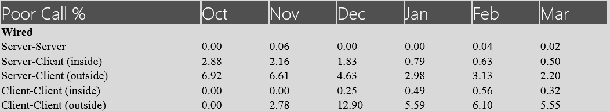
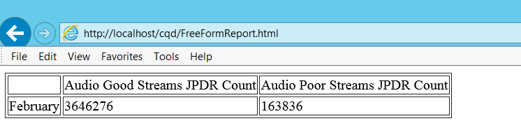

# <a name="cqd-development-samples"></a>Exemples de développement du tableau de bord de qualité des appels (TBQA)

**Résumé :** Examinez un didacticiel et des exemples de développement pour le Tableau de bord de qualité des appels. Le Tableau de bord de qualité des appels est un outil pour Skype Entreprise Server.

Cet article fournit un didacticiel et des exemples sur le développement du tableau de bord de qualité des appels (CQD).

## <a name="call-quality-dashboard-cqd-development-samples"></a>Exemples de développement du tableau de bord de qualité des appels

Didacticiel : création d’une présentation de rapport personnalisée à l’aide des API du service de données et du référentiel CQD.

### <a name="introduction-to-cqd"></a>Présentation du CQD

Le CQD offre un accès rapide et facile aux informations de qualité d’appel agrégées pour les déploiements Skype Entreprise Server locaux. Le CQD se compose de trois composants : la base de données d’archivage QoE, le cube et le portail. Le portail est la couche de présentation principale et peut être divisé en trois composants :

1. Service de données, accessible pour les utilisateurs authentifiés via l’API de données pour le tableau de bord de qualité des appels [(CQD) dans Skype Entreprise Server](data-api.md).

2. Service de référentiel, accessible pour les utilisateurs authentifiés via l’API de référentiel pour le tableau de bord de qualité des appels [(CQD) dans Skype Entreprise Server](repository-api.md).

3. Portail Web, qui est l’interface HTML5 que les utilisateurs de CQD voient et utilisent. Ceci est accessible pour les utilisateurs authentifiés.

Les rapports affichés sur le portail web sont regroupés en « ensembles de rapports ». La figure illustre un ensemble de rapports avec deux rapports. Chaque rapport de ce tableau de bord ci-dessous présente les résultats des requêtes sur le nombre d’appels de qualité, les appels médiocres et le pourcentage d’appels médiocres pendant plusieurs mois, avec différents filtres appliqués. 


Le CQD est créé selon la méthodologie de qualité des appels (CQM), de sorte que l’ensemble de rapports par défaut est conçu pour s’aligner sur le flux d’examen introduit par CQM. Les utilisateurs ont également la possibilité de modifier ou de créer des rapports personnalisés pour répondre à leurs besoins. Toutefois, étant donné qu’il existe plusieurs façons de visualiser les données, la visualisation fournie par CQD peut ne pas répondre entièrement aux besoins de chaque utilisateur. Dans de telles situations, un utilisateur peut tirer parti des API de données et des API de référentiel pour créer des pages de rapport personnalisées. Nous allons passer en suivant une série d’exemples dans ce didacticiel.

### <a name="how-the-dashboard-consumes-the-data-service"></a>Consommation du service de données par le tableau de bord

Lorsque vous naviguez vers la page d’accueil du CQD (par exemple, l’ensemble de rapports et les rapports correspondants d’un utilisateur authentifié et autorisé sont récupérés à partir du service de http://localhost/cqd) référentiel. Une URL complète sera construite à partir de l’ID de l’ensemble de rapports et de l’ID year-month (l’ID de l’ensemble de rapports est le nombre entier après la section « /#/ » dans l’URL et, par défaut, le mois de l’année en cours est ajouté à la fin de l’ID d’ensemble de rapports après la barre oblique). Les définitions de rapport sont stockées au format JSON et lorsqu’elles sont récupérées à partir du service de référentiel, elles sont ensuite utilisées comme entrées pour le service de données. Le service de données génère des requêtes MDX (Multi-Dimension expressions) en fonction de l’entrée, puis exécute ces requêtes MDX sur le cube pour récupérer des données pour chaque rapport. 

### <a name="building-customized-reports"></a>Création de rapports personnalisés

Le CQD offre déjà beaucoup de flexibilité dans la personnalisation des rapports, mais il peut y avoir des situations dans lesquelles les utilisateurs peuvent vouloir agréger des données dans plusieurs rapports créés dans le CQD. Par exemple, il peut être nécessaire de créer un rapport qui indique les pourcentages d’appels médiocres de toutes les combinaisons possibles d’appels câblés dans une table (un résultat comme la figure) :



À l’aide du portail fourni par le CQD, un utilisateur doit accéder à plusieurs rapports pour extraire et enregistrer le pourcentage d’appels médiocres pour chacun d’eux, ce qui peut être laborieux si de nombreux points de données doivent être collectés. Les API de données permettent aux utilisateurs d’effectuer cette tâche par programme, en récupérant des données à partir du service de données (par exemple, via des appels AJAX). 

 **Exemple 1 : exemple de rapport simple**

Prenons d’abord un exemple simple. Si nous voulons afficher le nombre de flux Audio Good Stream et Audio Bad de février 2015 sur une page HTML comme dans la figure :



Nous devons envoyer un appel au service de données avec les paramètres appropriés et afficher les résultats de la requête dans une table HTML. Voici un exemple de code JavaScript :

```javascript        
$($.fn.freeFormReport = function (queries, urlApi, presentation) {
            var query = {
                Dimensions: [{ DataModelName: '[StartDate].[Month]' }],
                Filters: [{
                    DataModelName: '[StartDate].[Month]',
                    Value: '[2015-02-01T00:00:00]',
                    Operand: 0
                }],
                Measurements:
                    [{ DataModelName: '[Measures].[Audio Good Streams JPDR Count]' },
                     { DataModelName: '[Measures].[Audio Poor Streams JPDR Count]' },]
            };            

            $.ajax({
                url: 'http://localhost/QoEDataService/RunQuery',
                data: JSON.stringify(query),
                type: 'POST',
                async: true,
                contentType: 'application/json;charset=utf-8',
                success: function (data) {
                    //This is the jQuery syntax for document.GetElementById()
                    $('#AudioGoodStreamsJPDRCount').html(data.DataResult[0][1]);
                    $('#AudioPoorStreamsJPDRCount').html(data.DataResult[0][2]);
                }
                error: function (error) {
                    alert('Error getting data, check that the data service is running and that the URL is correct.');
           }
            });
        });
```

Cet exemple peut être déconstruit en trois étapes :

1. Construisez la requête (dans l’exemple, elle est définie dans la variable « query »). La requête est définie comme un objet JSON, qui inclut les données suivantes :

   a. Zéro ou plusieurs dimensions. Chaque dimension est indiquée par un DataModelName.

   b. Zéro filtre ou plus. Chaque filtre a :

   - DataModelName (la dimension qui aura le jeu de filtres).

   - Valeur (valeur qui sera comparée par l’opérande).

   - Opérande (type de comparaison, 0 signifie « Égal »).

     c. Une ou plusieurs mesures.

2. Envoyez la requête au service de données via un appel AJAX. Les paramètres de requête suivants doivent être fournis :

   a. url (qui doit être http://[ServerName]/QoEDataService/RunQuery).

   b. (il s’agit de la représentation sous la chaîne de l’objet JSON défini dans la variable « query »). Le service de données retourne les résultats de la requête en tant que paramètre de la fonction de retour d’appel en cas de réussite.

   c. (pour QoEDataService, RunQuery accepte uniquement les demandes « POST »).

   d. asynchrone (indicateur indiquant si l’appel AJAX doit être synchrone ou asynchrone).

   e. contentType (doit être « application/json »).

   f. réussite (fonction de call-back pour la fin de l’appel AJAX).

   g. erreur (fonction de gestion des erreurs en cas d’échec de l’appel AJAX).

3. Placez les données dans des éléments div dans le code HTML (dans l’exemple du code, cette procédure est effectuée via l’appel de fonction anonyme une fois la demande AJAX terminée avec succès).

Le code JavaScript est inclus dans une page HTML, et la page affiche un rapport comme celui illustré dans la figure. Le code HTML complet est le suivant :

```javascript
<!DOCTYPE html>
<html xmlns="http://www.w3.org/1999/xhtml">
<head>
</head>
<body>
    <script src="OpenSourceSoftware/Scripts/jquery-2.1.1.js"></script>

    <script>
        $($.fn.freeFormReport = function (queries, urlApi, presentation) {

            var query = {
                Dimensions: [{ DataModelName: '[StartDate].[Month]' }],
                Filters: [{
                    DataModelName: '[StartDate].[Month]',
                    Value: '[2015-02-01T00:00:00]',
                    Operand: 0
                }],
                Measurements:
                    [{ DataModelName: '[Measures].[Audio Good Streams JPDR Count]' },
                     { DataModelName: '[Measures].[Audio Poor Streams JPDR Count]' },]
            };            

            $.ajax({
                url: 'http://localhost/QoEDataService/RunQuery',
                data: JSON.stringify(query),
                type: 'POST',
                async: true,
                contentType: 'application/json;charset=utf-8',
                success: function (data) {
                    //This is the jQuery syntax for document.GetElementById()
                    $('#AudioGoodStreamsJPDRCount').html(data.DataResult[0][1]);
                    $('#AudioPoorStreamsJPDRCount').html(data.DataResult[0][2]);
                }
                error: function (error) {
                    alert('Error getting data, check that the data service is running and that the URL is correct.');
           }

            });
        });
    </script>
    <table border="1">
        <tr>
            <td></td>
            <td><div>Audio Good Streams JPDR Count</div></td>
            <td><div>Audio Poor Streams JPDR Count</div></td>
        </tr>
        <tr>
            <td>February</td>
            <td><div id="AudioGoodStreamsJPDRCount"></div></td>
            <td><div id="AudioPoorStreamsJPDRCount"></div></td>
        </tr>
    </table>
</body>
</html>
```

Jusqu’à présent, le rapport est toujours très simple. L’utilisateur peut ajouter des mesures, des dimensions ou des filtres supplémentaires pour personnaliser le rapport. Par exemple, si vous souhaitez afficher le pourcentage d’appels médiocres AppSharing, une nouvelle mesure concernant AppSharing doit être ajoutée. Si vous souhaitez afficher tous les appels TCP v.s. Les appels UDP, une nouvelle dimension concernant le type de transport doit être ajoutée. Si vous souhaitez afficher le nombre d’appels médiocres dans un bâtiment spécifique, un nouveau filtre doit être ajouté pour sélectionner les appels vers et depuis ce bâtiment.

 **Exemple 2 : exemple de définition de rapport**

Il peut être difficile pour quelqu’un de déterminer comment écrire la liste complète des mesures/dimensions/filtres et leurs valeurs correspondantes lors de la construction d’une requête. Dans ce cas, vous pouvez aller sur le portail, créer un rapport à l’aide de l’éditeur de rapport, afficher la chaîne JSON de la définition du rapport, puis copier la définition dans un rapport personnalisé. 

Dans cet exemple, nous allons créer une page web comme celle présentée dans la figure dans laquelle un utilisateur peut entrer l’ID de n’importe quel ensemble de rapports (ou rapport) existant et afficher la définition de l’ensemble de rapports ou du rapport sur la page web. L’utilisateur peut ensuite brancher la chaîne JSON de chaque rapport dans du code semblable à celui de l’exemple 1 et construire n’importe quel rapport personnalisé souhaité par l’utilisateur. 


Pour créer l’outil visionneuse de définition de rapport, nous devons envoyer des appels au service de référentiel pour récupérer les représentations de chaîne JSON des définitions de chaque ensemble de rapports que nous voulons. L’API Référentiel retourne la définition de l’ensemble de rapports en fonction d’un ID d’ensemble de rapports donné. 

Voici un exemple rapide : le code contient un bloc qui est un exemple simple d’envoi d’une requête au service référentiel pour obtenir le contenu d’un élément de référentiel en fonction de son identificateur. Et la partie suivante du code (méthode processReportSetData) envoie des appels AJAX pour obtenir la définition de chaque rapport au sein de cet ensemble de rapports. Étant donné que l’ID dans le portail web CQD est l’ID d’un ensemble de rapports, l’appel AJAX retourne un élément d’ensemble de rapports. Vous pouvez trouver plus de détails sur l’API du référentiel et, plus spécifiquement, GetItems, dans [l’article Obtenir des éléments.](get-items.md) 

```html
<!DOCTYPE html>
<html lang="en">
<head>
    <meta charset="utf-8" />
    <meta http-equiv='cache-control' content='no-cache'>
    <meta http-equiv='expires' content='0'>
    <meta http-equiv='pragma' content='no-cache'>
    <meta http-equiv="X-UA-Compatible" content="IE=edge">
    <meta http-equiv="x-content-type-options" content="nosniff">
    <title>CQD Report definition viewer</title>
</head>
<body>    
    <div style="font-size:32pt">CQD Report definition viewer</div>
        <p>ReportSet Id: <input id="reportSetId" /></p>
        <button onclick='loadReportSet()'>Load</button>
        <div id="Report"></div>
    <!-- Third party Libraries -->
    <script src="OpenSourceSoftware/Scripts/jquery-2.1.1.js"></script>

    <script>
        var urlRepositoryApi = 'http://localhost/QoERepositoryService/repository/item/';

        var loadReportSet = function ()
        {
            var reportSetId = document.getElementById('reportSetId').value;

            $.ajax({
                url: urlRepositoryApi + reportSetId,
                data: '',
                type: 'GET',
                async: false,
                contentType: 'application/json;charset=utf-8',
                success: function (data) {
                    var reportSetDiv = document.getElementById('Report');
                    reportSetDiv.innerHTML = '';
                    processReportSetData(reportSetDiv, data);
                },
                error: function (error) {
                    alert('Error getting Report, check that the qoe data service is running and url is correct.');
                }
            });
        };

        var processReportSetData = function (divReportSet, reportSetDef) {
             //show the report set definition like Title, Description, etc
            showReportSetDefinition(divReportSet, reportSetDef);

            //for each Report in the Reportset, get the Report definition from the Repository Service
            for (var i = 0; i < reportSetDef.subItemIds.length; i++)
            {
                //the reportId is in the subItemIds array.  This is not shown in the CQD UI at all
                var reportId = reportSetDef.subItemIds[i];

                var divReport = document.createElement('div');
                divReport.style.margin = '12px';                
                divReportSet.appendChild(divReport);

                //retrieve the report definition with the reportId
                $.ajax({
                    url: urlRepositoryApi + reportId,
                    data: '',
                    type: 'GET',
                    async: false,
                    contentType: 'application/json;charset=utf-8',
                    success: function (reportData) {
                        processReportData(divReport, reportData, reportId);
                    },
                    error: function (error) {
                        alert('Error getting Report ' + reportId.toString() + ', check that the qoe data service is running and url is correct.');
                    }
                });
            }
        };

        //helper function to render the ReportSet definition
        var showReportSetDefinition = function (divReportSet, reportSetDef) {
            var div = document.createElement('div');
            ReportSetDefinition = reportSetDef.content;
            txt = document.createTextNode(ReportSetDefinition);
            div.style.margin = '12px';
            div.appendChild(txt);
            divReportSet.appendChild(div);
        };

        //show the report definition
        var processReportData = function (divReport, reportData, itemId) {
            if (divReport != undefined &amp;&amp; reportData.content != undefined) {
                var Report = JSON.parse(reportData.content);

                var divReportId = document.createElement('div');
                var subItemId = reportData.subItemIds.length > 0 ? reportData.subItemIds[0].toString() : 'none';
                divReportId.innerHTML = 'ItemId: ' + itemId.toString() + ' (' + Report.Title + ') [subItemId:' + subItemId + ']';
                divReport.appendChild(divReportId);

                var divReportDef = document.createElement('div');
                txt = document.createTextNode(JSON.stringify(Report));
                divReportDef.style.margin = '12px';
                divReportDef.appendChild(txt);                            
                divReport.appendChild(divReportDef);
            }
        };
    </script>
</body>
</html>
```

La page web ci-dessus se présente comme celle de la figure (sans la définition du rapport lors de la visite initiale). Obtenir l’ID de l’ensemble de rapports à partir du portail CQD (après la signature « /# / » dans l’URL du portail CQD (par exemple, dans la première figure, l’ID de l’ensemble de rapports est 3024, puis placez cet ID de jeu de rapports dans la section d’entrée de cette page web. Appuyez sur le bouton « charger » et voir la définition complète (mesures, dimensions, listes de filtres) de l’ensemble de rapports.

En résumé, afin d’obtenir rapidement la définition complète d’un ensemble de rapports/rapports. Voici comment procéder :

1. Go to the Portal and use the query editor to customize a report (click the « Edit » button above a report to edit, add, remove measurements/dimensions/filters, and then save the report).

2. Obtenez l’ID de l’ensemble de rapports à partir de l’URL (l’nombre integer après l’URL de la signature « /# / »).

3. Lancez cette page web définition de rapport créée dans l’exemple 2, entrez l’ID de l’ensemble de rapports et récupérez la définition complète d’un ensemble de rapports (à utiliser dans les appels d’API de données).

   **Exemple 3 : Exemple de carte de performance**

Temps pour une tâche plus complexe. Que se passe-t-il si nous voulons créer une page web comme la figure ? Nous devons mettre à jour l’exemple 1 (à l’aide de la page web générée dans l’exemple 2 pour récupérer la définition complète d’un rapport) afin de pouvoir gérer une plus grande quantité de données.

Dans ce cas, nous devons mettre à jour la liste de mesures et de dimensions. Pour déterminer comment ajouter/modifier une mesure et/ou une dimension, suivez les instructions de l’exemple 2 et récupérez la définition complète du rapport, y compris les listes complètes de mesures et de dimensions. Branchez la définition complète du rapport dans l’exemple de code. 

Voici les étapes détaillées pour obtenir la page de carte de performance dans la figure à partir de l’exemple fourni dans l’exemple 1 :

1. Mettre à jour les mesures dans la variable « requête » de  `[Measures].[Audio Good Streams JPDR Count]` et `[Measures].[Audio Poor Streams JPDR Count]` vers `[Measures].[AudioPoorJPDRPercentage]` . 

2. Mettez à jour les filtres. Les données JSON pour filtres de l’exemple 1 ont un filtre, qui est définie sur la dimension  `[StartDate].[Month]` . Étant donné que Filtres est un tableau JSON, des dimensions supplémentaires peuvent être ajoutées à la liste des filtres. Par exemple, pour obtenir le client-serveur à l’intérieur d’appels câblés pour le « currentMonth », nous devons avoir les filtres suivants :

   ```javascript
   Filters: [
     { DataModelName: '[StartDate].[Month]', Value: currentMonth, Operand: 0 },
    {
        "DataModelName": "[Scenarios].[ScenarioPair]",
         "Caption": " Server-Inside-wired,Client-Inside-wired",
         "Value": "[1]&amp;[0]&amp;[1]&amp;[1]&amp;[Wired]&amp;[Wired]",
         "Operand": 0,
         "UnionGroup": ""
     },

     { DataModelName: '[StreamType].[StreamType]', Caption: "Valid", Value: "[False]", Operand: 0, UnionGroup: "" }
   ],
   ```

   Ici, la dimension  `[Scenarios].[ScenarioPair]` est définie sur égal `[1]&amp;[0]&amp;[1]&amp;[1]&amp;[Wired]&amp;[Wired]` . Il  `[Scenario.][ScenarioPair]` s’agit d’une dimension spéciale créée pour simplifier la création de rapports. Il a six valeurs correspondant à `[FirstIsServer], [SecondIsServer], [FirstInside], [SecondIsServer], [FirstConnectionType], [SecondConnectionType]` . Ainsi, au lieu d’utiliser une combinaison de 6 filtres pour définir un scénario, nous n’avons besoin que d’utiliser 1 filtre. Dans notre exemple, la valeur se traduit par le scénario dans lequel : le premier est serveur, le deuxième n’est pas le serveur, le premier est à l’intérieur, le deuxième est à l’intérieur, le premier type de connexion est câblé et le second type de connexion est câblé, qui est la définition exacte de «  `[1]&amp;[0]&amp;[1]&amp;[1]&amp;[Wired]&amp;[Wired]` Serveur-Client-à-l’intérieur câblé ».

3. Créez un ensemble de filtres par scénario. Chaque ligne de la carte de performance, dans la figure, représente un scénario différent, qui sera un filtre différent (tandis que les dimensions et les mesures restent identiques). 

4. Parse the results from the AJAX calls and place them in the correct position of the table. Étant donné qu’il s’agit principalement de manipulations HTML et JavaScript, nous n’allons pas entrer dans les détails ici. Au lieu de cela, le code est fourni dans l’Annexe A.

    > [!NOTE]
    >  Si le partage des ressources d’origine croisée (CORS) est activé, les utilisateurs peuvent rencontrer des erreurs telles que « Aucun en-tête Access-Control-Allow-Origin » n’est présent sur la ressource demandée. L’origine « null » n’est donc pas autorisée à accéder ». Pour résoudre le problème, placez le fichier HTML sous le dossier où le portail est installé (par défaut, il doit `%SystemDrive%\Program Files\Skype for Business 2015 CQD\CQD)` l’être). Accédez ensuite au code HTML via n’importe quel navigateur avec  `http://<servername>/cqd/<html_file_name>` l’URL. (L’URL par défaut du tableau de bord CQD local est  `http://<servername>/cqd.` ) 

### <a name="appendix-a"></a>Annexe A

Code HTML pour l’exemple 3 (exemple de carte de performance) :

```html
<!DOCTYPE html>
<html xmlns="http://www.w3.org/1999/xhtml">
<head>
    <meta charset="utf-8" />
    <meta http-equiv='cache-control' content='no-cache'>
    <meta http-equiv='expires' content='0'>
    <meta http-equiv='pragma' content='no-cache'>
    <meta http-equiv="X-UA-Compatible" content="IE=edge">
    <title>Scoreboard Sample</title>

    <style>
        .row {
            margin-right: -15px;
            margin-left: -15px;
            display: table-row;
        }
        .col-md-3 {
            width: 25%;
            display: table-cell;
        }
        .col-md-2 {
            width: 16.66666667%;
            display: table-cell;
        }
        .col-md-1 {
            width: 8.33333333%;
            display: table-cell;
        }

    </style>
</head>
<body>    

    <!-- Third party Libraries -->
    <script src="OpenSourceSoftware/Scripts/jquery-2.1.1.js"></script>

    <table id="ScoreCardTable" style="margin:100px">
        <tr>
            <td width="250px" style="text-align: center; font-size: 24px; font-family: 'Segoe UI'; font-weight: lighter; color: white; background-color: #505050">
                <div style="margin:10px">Scoreboard Sample</div>
            </td>
            <td width="1200px">
                <div style="margin:10px;background-color:#D9D9D9" >
                    <div class="row" id="Header" style="font-size:24px;font-family:'Segoe UI';font-weight:lighter;color:white;background-color:#505050">
                        <div class="col-md-3">Poor Call %</div>
                        <div class="col-md-1">Month1</div>
                        <div class="col-md-1">Month2</div>
                        <div class="col-md-1">Month3</div>
                        <div class="col-md-1">Month4</div>
                        <div class="col-md-1">Month5</div>
                        <div class="col-md-1">Month6</div>
                    </div>                    
                    <div class="row"><div class="col-md-3" style="font-weight:bold">Wired</div></div>
                    <div class="row" id="SS"><div class="col-md-3">Server-Server</div><div class="col-md-1"></div><div class="col-md-1"></div><div class="col-md-1"></div><div class="col-md-1"></div><div class="col-md-1"></div><div class="col-md-1"></div></div>
                    <div class="row" id="SWI"><div class="col-md-3">Server-Client (inside)</div><div class="col-md-1"></div><div class="col-md-1"></div><div class="col-md-1"></div><div class="col-md-1"></div><div class="col-md-1"></div><div class="col-md-1"></div></div>
                    <div class="row" id="SWO"><div class="col-md-3">Server-Client (outside)</div><div class="col-md-1"></div><div class="col-md-1"></div><div class="col-md-1"></div><div class="col-md-1"></div><div class="col-md-1"></div><div class="col-md-1"></div></div>
                    <div class="row" id="WWI"><div class="col-md-3">Client-Client (inside)</div><div class="col-md-1"></div><div class="col-md-1"></div><div class="col-md-1"></div><div class="col-md-1"></div><div class="col-md-1"></div><div class="col-md-1"></div></div>
                    <div class="row" id="WIWO"><div class="col-md-3">Client-Client (outside)</div><div class="col-md-1"></div><div class="col-md-1"></div><div class="col-md-1"></div><div class="col-md-1"></div><div class="col-md-1"></div><div class="col-md-1"></div></div>
                    <div class="row"><div class="col-md-3" style="font-weight:bold">Wireless</div></div>
                    <div class="row" id="SWFI"><div class="col-md-3">Server-Client (inside)</div><div class="col-md-1"></div><div class="col-md-1"></div><div class="col-md-1"></div><div class="col-md-1"></div><div class="col-md-1"></div><div class="col-md-1"></div></div>
                    <div class="row" id="SWFO"><div class="col-md-3">Server-Client (outside)</div><div class="col-md-1"></div><div class="col-md-1"></div><div class="col-md-1"></div><div class="col-md-1"></div><div class="col-md-1"></div><div class="col-md-1"></div></div>
                    <div class="row" id="WFIWFI"><div class="col-md-3">Client-Client (inside)</div><div class="col-md-1"></div><div class="col-md-1"></div><div class="col-md-1"></div><div class="col-md-1"></div><div class="col-md-1"></div><div class="col-md-1"></div></div>
                    <div class="row" id="WFOWFO"><div class="col-md-3">Client-Client (outside)</div><div class="col-md-1"></div><div class="col-md-1"></div><div class="col-md-1"></div><div class="col-md-1"></div><div class="col-md-1"></div><div class="col-md-1"></div></div>
                    <div class="row"><div class="col-md-3" style="font-weight:bold">Mobile/Broadband</div></div>
                    <div class="row" id="SMP"><div class="col-md-3">Server-MobilePhone</div><div class="col-md-1"></div><div class="col-md-1"></div><div class="col-md-1"></div><div class="col-md-1"></div><div class="col-md-1"></div><div class="col-md-1"></div></div>
                    <div class="row" id="SMBB"><div class="col-md-3">Server-MobileBroadBand</div><div class="col-md-1"></div><div class="col-md-1"></div><div class="col-md-1"></div><div class="col-md-1"></div><div class="col-md-1"></div><div class="col-md-1"></div></div>
                    <div class="row"><div class="col-md-3" style="font-weight:bold">Lync Web App</div></div>
                    <div class="row" id="SLWA"><div class="col-md-3">Server-Client (inside &amp; outside)</div><div class="col-md-1"></div><div class="col-md-1"></div><div class="col-md-1"></div><div class="col-md-1"></div><div class="col-md-1"></div><div class="col-md-1"></div></div>
                </div>
            </td>
        </tr>
        <tr>
            <td><br /></td>
        </tr>
    </table>

    <script>

        $(function () {
            var month_names_short = ['NAM', 'Jan', 'Feb', 'Mar', 'Apr', 'May', 'Jun', 'Jul', 'Aug', 'Sep', 'Oct', 'Nov', 'Dec'];
            var currentMonth = '2015-3';

            //update the header with the month names
            var row = document.getElementById('Header');
            var numMonthsToShow = 6;
            for (var m = numMonthsToShow-1; m >= 0; m--) {
                var dateSplit = currentMonth.split('-');
                var monthInt = parseInt(dateSplit[1]);
                var yearInt = parseInt(dateSplit[0]);
                monthInt = monthInt - m;
                if (monthInt < 1)
                {
                    monthInt += 12;
                    yearInt--;
                }
                row.children[numMonthsToShow-m].innerHTML = month_names_short[monthInt];
            }

            var queries = [
            {
                Label: "Server-Server",
                ID: "SS",
                Query:
                {
                  Dimensions: [{ DataModelName: '[StartDate].[Month]'}],
                  Filters: [
                      {
                          "DataModelName": "[Scenarios].[ScenarioPair]",
                          "Caption": " Server-Inside-wired,Server-Inside-wired",
                          "Value": "[1]&amp;[1]&amp;[1]&amp;[1]&amp;[Wired]&amp;[Wired]",
                          "Operand": 0,
                          "UnionGroup": ""
                      },
                      { DataModelName: '[StartDate].[Month]', Value: currentMonth, Operand: 0 },
                      { DataModelName: '[StreamType].[StreamType]', Caption: "Valid", Value: "[False]", Operand: 0, UnionGroup: ""}
                  ],
                  Measurements: [{ DataModelName: '[Measures].[AudioPoorJPDRPercentage]'}],
                  Trend: { EnableTrend: true, SpanCount: numMonthsToShow, TrendDate: currentMonth, Type: 0 }
                 }
            },
            {
                Label: "Server-Client (inside)",
                ID: "SWI",
                Query:
                {
                  Dimensions: [{ DataModelName: '[StartDate].[Month]' }],
                  Filters: [
                      {
                          "DataModelName": "[Scenarios].[ScenarioPair]",
                          "Caption": " Server-Inside-wired,Client-Inside-wired",
                          "Value": "[1]&amp;[0]&amp;[1]&amp;[1]&amp;[Wired]&amp;[Wired]",
                          "Operand": 0,
                          "UnionGroup": ""
                      },
                      { DataModelName: '[StartDate].[Month]', Value: currentMonth, Operand: 0 },
                      { DataModelName: '[StreamType].[StreamType]', Caption: "Valid", Value: "[False]", Operand: 0, UnionGroup: "" }
                  ],
                  Measurements: [{ DataModelName: '[Measures].[AudioPoorJPDRPercentage]' }],
                  Trend: { EnableTrend: true, SpanCount: numMonthsToShow, TrendDate: currentMonth, Type: 0 }
                }
            },
            {
                Label: "Server-Client (outside)",
                ID: "SWO",
                Query:
                {
                  Dimensions: [{ DataModelName: '[StartDate].[Month]' }],
                  Filters: [
                      {
                          "DataModelName": "[Scenarios].[ScenarioPair]",
                          "Caption": " Server-Inside-wired,Client-Outside-wired",
                          "Value": "[1]&amp;[0]&amp;[1]&amp;[0]&amp;[Wired]&amp;[Wired]",
                          "Operand": 0,
                          "UnionGroup": ""
                      },
                      { DataModelName: '[StartDate].[Month]', Value: currentMonth, Operand: 0 },
                      { DataModelName: '[StreamType].[StreamType]', Caption: "Valid", Value: "[False]", Operand: 0, UnionGroup: "" }
                  ],
                  Measurements: [{ DataModelName: '[Measures].[AudioPoorJPDRPercentage]' }],
                  Trend: { EnableTrend: true, SpanCount: numMonthsToShow, TrendDate: currentMonth, Type: 0 }
                 }
            },
            {
                Label: "Client-Client (inside)",
                ID: "WWI",
                Query:
                {
                    Dimensions: [{ DataModelName: '[StartDate].[Month]' }],
                    Filters: [
                        {
                            "DataModelName": "[Scenarios].[ScenarioPair]",
                            "Caption": " Client-Inside-wired,Client-Inside-wired",
                            "Value": "[0]&amp;[0]&amp;[1]&amp;[1]&amp;[Wired]&amp;[Wired]",
                            "Operand": 0,
                            "UnionGroup": ""
                        },
                        { DataModelName: '[StartDate].[Month]', Value: currentMonth, Operand: 0 },
                        { DataModelName: '[StreamType].[StreamType]', Caption: "Valid", Value: "[False]", Operand: 0, UnionGroup: "" }
                    ],
                    Measurements: [{ DataModelName: '[Measures].[AudioPoorJPDRPercentage]' }],
                    Trend: { EnableTrend: true, SpanCount: numMonthsToShow, TrendDate: currentMonth, Type: 0 }
                }
            }
            ,
            {
                Label: "Client-Client (outside)",
                ID: "WIWO",
                Query:
                {
                    Dimensions: [{ DataModelName: '[StartDate].[Month]' }],
                    Filters: [
                        {
                          "DataModelName": "[Scenarios].[ScenarioPair]",
                          "Caption": "Client-Outside-Wired,Client-Outside-Wired",
                          "Value": "[0]&amp;[0]&amp;[0]&amp;[0]&amp;[Wired]&amp;[Wired]",
                          "Operand": 0,
                          "UnionGroup": ""
                        },
                        { DataModelName: '[StartDate].[Month]', Value: currentMonth, Operand: 0 },
                        { DataModelName: '[StreamType].[StreamType]', Caption: "Valid", Value: "[False]", Operand: 0, UnionGroup: "" }
                    ],
                    Measurements: [{ DataModelName: '[Measures].[AudioPoorJPDRPercentage]' }],
                    Trend: { EnableTrend: true, SpanCount: numMonthsToShow, TrendDate: currentMonth, Type: 0 }
                }
            },
            {
                Label: "Server-Client (inside)",
                ID: "SWFI",
                Query:
                {
                    Dimensions: [{ DataModelName: '[StartDate].[Month]' }],
                    Filters: [
                        {
                            "DataModelName": "[Scenarios].[ScenarioPair]",
                            "Caption": " Server-Inside-wired,Client-Inside-wifi",
                            "Value": "[1]&amp;[0]&amp;[1]&amp;[1]&amp;[Wired]&amp;[Wifi]",
                            "Operand": 0,
                            "UnionGroup": ""
                        },
                        { DataModelName: '[StartDate].[Month]', Value: currentMonth, Operand: 0 },
                        { DataModelName: '[StreamType].[StreamType]', Caption: "Valid", Value: "[False]", Operand: 0, UnionGroup: "" }
                    ],
                    Measurements: [{ DataModelName: '[Measures].[AudioPoorJPDRPercentage]' }],
                    Trend: { EnableTrend: true, SpanCount: numMonthsToShow, TrendDate: currentMonth, Type: 0 }
                }
            },
            {
                Label: "Server-Client (outside)",
                ID: "SWFO",
                Query:
                {
                    Dimensions: [{ DataModelName: '[StartDate].[Month]' }],
                    Filters: [
                         {
                             "DataModelName": "[Scenarios].[ScenarioPair]",
                             "Caption": " Server-Inside-wired,Client-Outside-wifi",
                             "Value": "[1]&amp;[0]&amp;[1]&amp;[0]&amp;[Wired]&amp;[Wifi]",
                             "Operand": 0,
                             "UnionGroup": ""
                         },
                        { DataModelName: '[StartDate].[Month]', Value: currentMonth, Operand: 0 },
                        { DataModelName: '[StreamType].[StreamType]', Caption: "Valid", Value: "[False]", Operand: 0, UnionGroup: "" }
                    ],
                    Measurements: [{ DataModelName: '[Measures].[AudioPoorJPDRPercentage]' }],
                    Trend: { EnableTrend: true, SpanCount: numMonthsToShow, TrendDate: currentMonth, Type: 0 }
                }
            },
            {
                Label: "Client-Client (inside)",
                ID: "WFIWFI",
                Query:
                {
                    Dimensions: [{ DataModelName: '[StartDate].[Month]' }],
                    Filters: [
                        {
                            "DataModelName": "[Scenarios].[ScenarioPair]",
                            "Caption": " Client-Inside-Wifi,Client-Inside-Wifi",
                            "Value": "[0]&amp;[0]&amp;[1]&amp;[1]&amp;[Wifi]&amp;[Wifi]",
                            "Operand": 0,
                            "UnionGroup": ""
                        },
                        { DataModelName: '[StartDate].[Month]', Value: currentMonth, Operand: 0 },
                        { DataModelName: '[StreamType].[StreamType]', Caption: "Valid", Value: "[False]", Operand: 0, UnionGroup: "" }
                    ],
                    Measurements: [{ DataModelName: '[Measures].[AudioPoorJPDRPercentage]' }],
                    Trend: { EnableTrend: true, SpanCount: numMonthsToShow, TrendDate: currentMonth, Type: 0 }
                }
            },
            {
                Label: "Client-Client (outside)",
                ID: "WFOWFO",
                Query:
                {
                    Dimensions: [{ DataModelName: '[StartDate].[Month]' }],
                    Filters: [
                        {
                          "DataModelName": "[Scenarios].[ScenarioPair]",
                          "Caption": "Client-Outside-Wifi,Client-Outside-Wifi",
                          "Value": "[0]&amp;[0]&amp;[0]&amp;[0]&amp;[Wifi]&amp;[Wifi]",
                          "Operand": 0,
                          "UnionGroup": ""
                        },
                        { DataModelName: '[StartDate].[Month]', Value: currentMonth, Operand: 0 },
                        { DataModelName: '[StreamType].[StreamType]', Caption: "Valid", Value: "[False]", Operand: 0, UnionGroup: "" }
                    ],
                    Measurements: [{ DataModelName: '[Measures].[AudioPoorJPDRPercentage]' }],
                    Trend: { EnableTrend: true, SpanCount: numMonthsToShow, TrendDate: currentMonth, Type: 0 }
                }
            },
            {
                Label: "Server-MobilePhone",
                ID: "SMP",
                Query:
                {
                    Dimensions: [{ DataModelName: '[StartDate].[Month]' }],
                    Filters: [
                        {"DataModelName": "[First Is Server].[Agent]","Caption": "Server","Value": "[1]","Operand": 0,"UnionGroup": ""},
                        {"DataModelName": "[Second User Agent].[User Agent Type]","Caption": "AndroidLync | iPhoneLync | WPLync","Value": "[AndroidLync],[iPhoneLync],[WPLync]","Operand": 0,"UnionGroup": ""},
                        { DataModelName: '[StartDate].[Month]', Value: currentMonth, Operand: 0 },
                    ],
                    Measurements: [{ DataModelName: '[Measures].[AudioPoorJPDRPercentage]' }],
                    Trend: { EnableTrend: true, SpanCount: numMonthsToShow, TrendDate: currentMonth, Type: 0 }
                }
            },
            {
                Label: "Server-MobileBroadBand",
                ID: "SMBB",
                Query:
                {
                    Dimensions: [{ DataModelName: '[StartDate].[Month]' }],
                    Filters: [
                        {"DataModelName": "[Second Network Connection Type].[Network Connection Detail]","Caption": "MobileBB","Value": "[MobileBB]","Operand": 0,"UnionGroup": ""},
                        {"DataModelName": "[First Is Server].[Agent]","Caption": "Server","Value": "[1]","Operand": 0,"UnionGroup": ""},
                        {"DataModelName": "[Second Is Server].[Agent]","Caption": "Client ","Value": "[0]","Operand": 0,"UnionGroup": ""},
                        { DataModelName: '[StartDate].[Month]', Value: currentMonth, Operand: 0 }                       
                    ],
                    Measurements: [{ DataModelName: '[Measures].[AudioPoorJPDRPercentage]' }],
                    Trend: { EnableTrend: true, SpanCount: numMonthsToShow, TrendDate: currentMonth, Type: 0 }
                }
            },
            {
                Label: "Server-LWA",
                ID: "SLWA",
                Query:
                {
                    Dimensions: [{ DataModelName: '[StartDate].[Month]' }],
                    Filters: [
                        {"DataModelName": "[First Is Server].[Agent]","Caption": "Server","Value": "[1]","Operand": 0,"UnionGroup": ""},
                        {"DataModelName": "[Second User Agent].[User Agent Type]","Caption": "LWA","Value": "[LWA]","Operand": 0,"UnionGroup": ""},
                        { DataModelName: '[StartDate].[Month]', Value: currentMonth, Operand: 0 }                       
                    ],
                    Measurements: [{ DataModelName: '[Measures].[AudioPoorJPDRPercentage]' }],
                    Trend: { EnableTrend: true, SpanCount: numMonthsToShow, TrendDate: currentMonth, Type: 0 }
                }
            }

            ];

            //get the overall corpnet data
            for (var i = 0; i < queries.length; i++) {
                $.ajax({

                    url: 'http://localhost/QoEDataService/RunQuery',
                    data: JSON.stringify(queries[i].Query),
                    type: 'POST',
                    async: false,
                    withCredentials: true,
                    contentType: 'application/json;charset=utf-8',
                    success: function (data) {

                        //find the table row corresponding to the name of this query
                        var row = document.getElementById(queries[i].ID);

                        //update the values for each month
                        for (var m = 0; m < data.DataResult.length; m++)
                        {
                            row.children[m + 1].innerHTML = data.DataResult[m][1].toFixed(2).toString();
                        }

                    },
                    error: function (error) {
                        var row = document.getElementById(queries[i].ID);
                        row.children[1].innerHTML = 'error';
                    }
                });
            }
        });
    </script>
</body>
</html>
```
