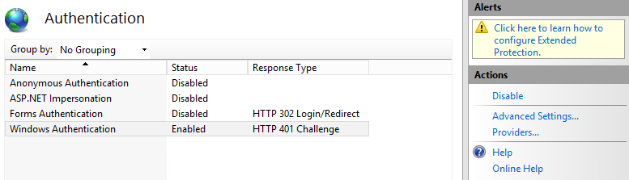

# <a name="deploy-call-quality-dashboard-for-skype-for-business-server"></a>Déploiement du tableau de bord de qualité des appels pour Skype entreprise Server
 
**Résumé:** En savoir plus sur le processus de déploiement du tableau de bord de qualité des appels. Le tableau de bord de qualité des appels est un outil pour Skype entreprise Server.
  
## <a name="deployment-overview"></a>Présentation du déploiement

Le tableau de bord de qualité des appels (bord) comporte trois composants principaux:
  
- **Base de données**d’archivage dans laquelle les données de qualité de l’expertise sont répliquées et stockées.
    
- **Cube**, dans lequel les données de la base de données d’archive QoE sont agrégées pour un accès optimisé et rapide.
    
- **Portail**permettant aux utilisateurs de rechercher et de visualiser facilement des données QoE.
    

  
Le processus de configuration de l’archivage QoE implique la création de la base de données d’archive QoE, le déploiement d’une procédure stockée SQL Server permettant de déplacer les données de la base de données de valeurs QoE sources dans la base de données d’archive QoE et de configurer le travail de l’agent SQL Server pour exécuter les données stockées. procédure à un intervalle régulier. 
  
Le déploiement d’un cube obtient des informations de la part de l’utilisateur sur l’emplacement de l’archive QoE, déploie le cube et configure une tâche standard de l’agent SQL Server qui actualisera le cube à intervalles réguliers.
  
L’installation du portail crée une base de données de référentiel qui stocke le mappage des utilisateurs de bord sur les rapports/requêtes de chaque utilisateur. Il configure alors une application Web IIS, qui est le tableau de bord dans lequel les utilisateurs peuvent voir un ensemble prédéfini de rapports, ainsi que personnaliser et créer leurs propres requêtes pour visualiser les données du cube. L’installation du portail crée deux applications Web supplémentaires qui exposent les API destinées aux utilisateurs pour accéder par programmation au référentiel et au cube. (Ces API sont également utilisées en interne par le tableau de bord.)
  

|**Phase**|**Étapes**|**Rôles et appartenances aux groupes**|**Documentation**|
|:-----|:-----|:-----|:-----|
|Installez le matériel et les logiciels requis.  <br/> |Déterminez la configuration de bord, puis choisissez un serveur SQL à partir duquel effectuer l’installation.  <br/> |Utilisateur du domaine membre du groupe Administrateurs local.  <br/> |Section «Configuration requise pour la préinstallation» de la documentation de déploiement.  <br/> |
|Installez bord.  <br/> |Exécutez le MSI en suivant le document de déploiement.  <br/> |Pour effectuer l’installation, le compte d’installation doit être un utilisateur de domaine membre du groupe Administrateurs local et disposer d’un accès en lecture à la base de données QoE Metrics du serveur de surveillance.  <br/> |Sections «comptes et étapes de déploiement» de la documentation de déploiement.  <br/> |
|Octroyez l’accès aux utilisateurs.  <br/> |Pour gérer les autorisations de l’utilisateur sur le portail, nous vous recommandons d’utiliser l’autorisation d’URL incluse dans IIS 7,0. Pour plus d’informations, voir présentation de l' [autorisation d’URL d’IIS 7,0](https://www.iis.net/learn/manage/configuring-security/understanding-iis-url-authorization).  <br/> |Utilisateur du domaine membre du groupe Administrateurs local.  <br/> |Gestion de l’accès utilisateur de la section portail dans la documentation de déploiement.  <br/> |
|Facultatif: fournissez les informations de mappage de sous-réseau.  <br/> |Peuplez les tables de mappage réseau et de construction dans la base de données d’archive QoE.  <br/> |Un compte avec accès en écriture à la base de données d’archive QoE.  <br/> |Section «fourniture des informations de sous-réseau» dans la documentation de l’utilisateur.  <br/> |
   


Le déploiement du tableau de bord de qualité des appels consiste à configurer l’infrastructure et à installer le logiciel. La procédure suivante décrit le processus.
  
## <a name="deployment-steps"></a>Étapes du déploiement

1. Copiez le fichier CallQualityDashboard. msi sur l’ordinateur sur lequel le composant de base de données d’archive d’bord doit être installé (il s’agit de l’ordinateur sur lequel est installé SQL Server). 
    
2. Exécutez le fichier MSI (Windows sera invité à s’exécuter avec les privilèges d’administrateur, procédez ainsi). 
    
3. Acceptez le contrat de licence.
    
4. Sélectionnez le dossier de destination dans lequel les fichiers liés aux composants de tableau de bord de qualité des appels seront localisés ou acceptent l’emplacement par défaut.
    
5. Sélectionnez toutes les fonctionnalités.
    
6. Dans la page Configuration de l’archivage QoE, entrez les informations suivantes:
    
   - **Valeur QoE de SQL Server:** Nom de l’instance SQL Server pour l’emplacement de la base de données QoE Metrics (il s’agit de la source de données).
    
   - **Nom de serveur SQL du serveur d’archivage:** Il s’agit d’un champ en lecture seule et est fixé sur le nom de domaine complet de l’ordinateur local. La base de BDD d’archivage ne peut être installée que sur l’ordinateur local.
    
   - **Instance QoE SQL Server d’archive:** Nom d’instance SQL Server local pour l’emplacement où la base de donnees d’archive doit être créée. Pour utiliser une instance SQL Server par défaut, laissez ce champ vide. Pour utiliser une instance SQL Server nommée, spécifiez le nom de l’instance (par exemple, le\"nom du «)».
    
   - **Base de données d’archive QoE:** Par défaut, cette option est définie sur «créer une nouvelle base de données». Dans la mesure où la mise à niveau d’archive de base de données n’est pas prise en charge, les seules circonstances pour lesquelles l’option «utiliser la base de données existante» peut être utilisée sont les mêmes que celles de la build à installer.
    
   - **Répertoire du fichier de base de données:** Chemin d’accès à l’emplacement où se trouvent les fichiers de base de données (. mdf et. ldf) de la base de données d’archivage. Il doit s’agir d’un lecteur (HDD2 dans la configuration matérielle recommandée) distinct du système d’exploitation. Notez que, dans la mesure où les noms de fichiers sont résolus dans l’installation, nous vous conseillons de ne pas utiliser un répertoire vide sans fichier pour éviter tout conflit potentiel.
    
   - **Utiliser plusieurs partitions:** Par défaut, la valeur est «multiple partition», qui nécessite Business Intelligence Edition ou Enterprise Edition de SQL Server. Pour l’édition standard, sélectionnez l’option «partition unique». Notez que les performances de traitement de cube risquent d’être affectées en cas d’utilisation d’une partition unique.
    
     > [!NOTE]
     > L’option sélection de plusieurs partitions ne peut pas être modifiée une fois l’installation terminée. Pour le modifier, la fonctionnalité de cube doit d’abord être désinstallée, puis réinstallée à l’aide de l’option «modifier» dans le panneau de configuration. 
  
   - **Répertoire de fichiers de partitions:** Chemin d’accès vers l’emplacement où vous souhaitez placer les partitions pour la base de données d’archive QoE. Il doit s’agir d’un lecteur (HDD3 dans la configuration matérielle recommandée) distinct du lecteur du système d’exploitation et du lecteur de fichiers journaux de base de données SQL. Notez que, dans la mesure où les noms de fichiers sont résolus dans l’installation, nous vous conseillons de ne pas utiliser un répertoire vide sans fichier pour éviter tout conflit potentiel.
    
   - **Tâche de l’agent SQL user- &amp; mot de passe nom d’utilisateur:** Nom du compte de domaine et mot de passe (masqué) qui seront utilisés pour exécuter l’étape «données d’archive QoE» du poste de travail de l’agent SQL Server (qui exécute la procédure stockée pour extraire les données de la base de données QoE de la base de données d’archivage.  comme indiqué dans la section comptes. Ce compte doit également avoir une connexion dans l’instance de SQL Server d’archive QoE.
    
     > [!NOTE]
     > Le compte sous lequel l’instance SQL Server est en cours d’exécution (par exemple, NT SERVICE\MSSQLSERVER) doit disposer d’un accès ou d’une autorisation aux annuaires ci-dessus pour que l’installation réussisse. Pour plus d’informations, voir [configurer les autorisations du système de fichiers pour l’accès du moteur de base de données](https://msdn.microsoft.com/en-us/library/jj219062%28v=sql.110%29.aspx)
  
7. Lorsque vous cliquez sur suivant, le programme d’installation effectue des vérifications et signale les conditions préalables en cas de problème. Lorsque toutes les vérifications préalables sont réussies, le programme d’installation accède à la page Configuration du cube. 
    
    > [!NOTE]
    > Si le programme d’installation affiche un message d’avertissement indiquant que le service Agent SQL Server pour l’instance de SQL Server d’archive QoE n’est pas en cours d’exécution, l’installation peut avoir lieu, mais après l’installation, assurez-vous que le service Agent SQL est en cours d’exécution et définissez le type de démarrage sur Automatique pour que le travail planifié s’exécute. 
  
8. Dans la page Configuration du cube, entrez les informations suivantes:
    
   - **Nom de serveur SQL du serveur d’archivage:** Il s’agit d’un champ en lecture seule et est fixé sur le nom de domaine complet de l’ordinateur local. Le cube peut être installé uniquement à partir de l’ordinateur qui dispose de la base de données d’archive QoE (Remarque. Le cube proprement dit doit être installé sur un ordinateur distant. Voir ci-dessous)
    
   - **Instance QoE SQL Server d’archive:** Nom de l’instance SQL Server pour lequel se trouve la BDD d’archive QoE. Pour spécifier une instance SQL Server par défaut, laissez ce champ vide. Pour spécifier une instance nommée de SQL Server, entrez le nom de l’instance (par exemple, le\"nom suivant le "). Si le composant d’archive QoE a été sélectionné pour l’installation, ce champ est pré-rempli avec la valeur figurant dans la page Configuration d’archive QoE.
    
   - **Serveur d’analyse du cube:** Nom de l’instance de SQL Server Analysis Services pour l’emplacement de création du cube. Il peut s’agir d’un autre ordinateur, mais l’utilisateur doit être membre des administrateurs de serveurs de l’instance de service SQL Server Analysis Services cible.
    
     > [!NOTE]
     >  Pour plus d’informations sur la configuration des autorisations d’administrateur du serveur Analysis Services, voir [accorder des autorisations d’administrateur serveur (Analysis Services)](https://msdn.microsoft.com/en-us/library/ms174561.aspx) .
  
   - **Utiliser plusieurs partitions:** Par défaut, la valeur est «multiple partition», qui nécessite Business Intelligence Edition ou Enterprise Edition de SQL Server. Pour l’édition standard, sélectionnez l’option «partition unique». Notez que les performances de traitement de cube risquent d’être affectées en cas d’utilisation d’une partition unique.
    
     > [!NOTE]
     >  L’option sélection de plusieurs partitions ne peut pas être modifiée une fois l’installation terminée. Pour le modifier, la fonctionnalité de cube doit d’abord être désinstallée, puis réinstallée à l’aide de l’option «modifier» dans le panneau de configuration.
  
   - **Utilisateur du cube-mot &amp; de passe du nom d’utilisateur:** Nom du compte de service de domaine et mot de passe (masqué) déclenchant le traitement du cube. Si le composant d’archive QoE a été sélectionné pour l’installation, ce champ est pré-rempli avec la valeur fournie dans la page Configuration de l’archivage pour l’utilisateur du travail d’agent SQL, mais nous vous recommandons de spécifier un autre compte de service de domaine pour que le programme d’installation puisse accorder le le moins de privilèges requis.
    
9. Lorsque vous cliquez sur suivant, un autre arrondi de validation est effectué et tout problème est signalé. Une fois la validation terminée, le programme d’installation accède à la page de configuration du portail. 
    
10. Dans la page Configuration du portail, entrez les informations suivantes:
    
    - **QoE archiver SQL Server:** Nom de l’instance SQL Server pour lequel se trouve la base de données d’archive QoE. Notez que, contrairement à la page Configuration d’archive QoE et la page de configuration du cube, le nom de l’ordinateur n’est pas fixe et doit être fourni. Si le composant d’archive QoE a été sélectionné pour l’installation, ce champ est pré-rempli avec la valeur figurant dans la page Configuration d’archive QoE.
    
    - **Serveur d’analyse du cube:** Nom de l’instance de SQL Server Analysis Services pour l’emplacement du cube. Si le composant cube a été sélectionné pour l’installation, ce champ est pré-rempli avec la valeur fournie dans la page Configuration du cube.
    
    - **Référentiel SQL Server:** Nom de l’instance SQL Server où la base de données du référentiel doit être créée. Si le nom de l’instance SQL Server pour l’emplacement de la base de données d’archive QoE a été fourni auparavant dans le programme d’installation (dans d’autres composants), ce champ sera pré-rempli avec le nom de l’instance de SQL Server BDD archive. Il peut s’agir d’une instance SQL Server.
    
    - **Base de données du référentiel:** Par défaut, l’option est définie sur «créer une nouvelle base de données». Dans la mesure où la mise à niveau de la base de données du référentiel n’est pas prise en charge, les seules circonstances pour lesquelles l’option «utiliser la base de données existante» peut être utilisée sont les mêmes que la base de données du référentiel existant à installer.
    
    - **Utilisateur du pool d’applications IIS- &amp; mot de passe du nom d’utilisateur:** Le compte sous lequel le pool d’applications IIS doit s’exécuter. Les champs nom d’utilisateur et mot de passe seront grisés si les comptes système intégrés sont sélectionnés. Ces champs ne seront activés que si l’option «autre» est sélectionnée dans la zone de liste déroulante, afin que l’utilisateur puisse entrer les informations de compte de service de domaine.
    
11. Lorsque vous cliquez sur suivant, le dernier arrondi de validation est effectué pour vérifier que les instances SQL Server sont accessibles à l’aide des informations d’identification fournies et qu’IIS est disponible sur l’ordinateur. Une fois la validation terminée, le programme d’installation continue de procéder à la configuration. 
    
Lorsque le programme d’installation est en cours d’exécution, il est probable que le travail de l’agent SQL Server soit en cours, ce qui a pour effet de charger l’initiale des données QoE et de traiter le cube. En fonction de la quantité de données dans QoE, les données du portail ne seront pas encore disponibles pour être affichées. Pour vérifier l’état du traitement des données et du chargement des données, accédez `http://<machinename>/CQD/#/Health`à. 
> [!NOTE]
> Notez que l’URL pour vérifier le statut de téléchargement du cube est sensible à la casse. Si vous entrez «Health», l’URL ne fonctionnera pas. Vous devez entrer «Health» à la fin de l’URL avec un H majuscule. 
  
Les messages détaillés du journal seront affichés en mode débogage. Pour activer le mode de débogage, accédez à **%systemdrive%\Program Files\Skype pour Business 2015 CQD\QoEDataService\web.config**, puis mettez à jour la ligne suivante de sorte que la valeur soit définie sur **true**:

```
<add key="QoEDataLib.DebugMode" value="True" /> 
```

La page principale du portail est accessible `http://<machinename>/CQD`via. 
## <a name="managing-user-access-for-the-portal"></a>Gestion de l’accès des utilisateurs au portail

Pour gérer les autorisations de l’utilisateur sur le portail, nous vous recommandons d’utiliser l’autorisation d’URL incluse dans IIS 7,0. Pour plus d’informations sur la sécurité IIS, voir présentation de l' [autorisation d’URL d’iis 7,0](https://www.iis.net/learn/manage/configuring-security/understanding-iis-url-authorization).
  
Tout site Web ou application Web hérite de l’autorisation d’URL par défaut configurée pour l’ensemble des services Internet, qui est généralement «autoriser tous les utilisateurs». Si l’accès au portail doit être plus restrictif, les administrateurs peuvent accorder l’accès uniquement aux groupes d’utilisateurs spécifiques en modifiant les «règles d’autorisation».
  

  
> [!NOTE]
> L’icône règles d’autorisation ne doit pas être confondus avec l’autorisation «.NET Authorization» sous la section ASP.NET, qui est un autre mécanisme d’autorisation. 
  
Les administrateurs doivent commencer par supprimer la règle «autoriser tous les utilisateurs». Cela empêche les utilisateurs non autorisés d’accéder au portail.
  

  
Par la suite, les administrateurs doivent ajouter de nouvelles règles d’autorisation et accorder à des utilisateurs spécifiques l’accès au portail. Il est recommandé de créer un groupe local appelé «CQDPortalUsers» pour gérer les utilisateurs.
  

  
Les détails de la configuration sont stockés dans le fichier Web. config situé dans le répertoire physique du portail.
  
```
<?xml version="1.0" encoding="UTF-8"?> <configuration> <system.webServer> <security> <authorization> <remove users="*" roles="" verbs="" /> <add accessType="Allow" roles="CQDPortalUsers" /> </authorization> </security> </system.webServer> </configuration> 
```

L’étape suivante consiste à configurer le tableau de bord du bord. Une fois les utilisateurs authentifiés par IIS, ils doivent disposer d’autorisations de fichiers sur le répertoire bord pour pouvoir accéder au contenu du portail Web. Il est possible de modifier les ACL par le biais de l’onglet sécurité des propriétés de l’annuaire bord pour ajouter des utilisateurs ou des groupes individuels. Néanmoins, nous vous conseillons de ne pas laisser les autorisations de fichier intactes. Au lieu de cela, modifiez le paramètre IIS pour utiliser le processus de travail IIS pour accéder au répertoire bord, quel que soit l’utilisateur authentifié. 
  
> [!IMPORTANT]
> Il est important de changer uniquement ce paramètre pour l’application bord et non pour les deux applications API: QoEDataService et QoERepositoryService. 
  
## <a name="configuring-file-access-for-the-cqd-dashboard"></a>Configuration de l’accès aux fichiers pour le bord (tableau de bord)

1. Ouvrez l’éditeur de configuration pour bord.
    
     
  
2. Sous section, sélectionnez **System. webServer/ServerRuntime**.
    
     
  
3. Remplacez authenticatedUserOverride par **UseWorkerProcessUser**.
    
     
  
4. Cliquez sur **appliquer** sur le côté droit de la page.
    
## <a name="known-issues"></a>Problèmes connus

### <a name="the-cqd-shows-no-data-after-deployment"></a>BORD n’affiche aucune donnée après le déploiement

Le message d’erreur suivant peut apparaître:

*Nous n’avons pas pu exécuter la requête lors de son exécution sur le cube. Utilisez l’éditeur de requête pour modifier la requête et résoudre les éventuels problèmes. Assurez-vous également que le cube est accessible.*

Cela signifie que le cube doit être traité dans SQL Server Analysis Services avant d’être utilisé dans bord. Vous pouvez résoudre ce problème en procédant comme suit:

1. Ouvrez SQL Management Studio et sélectionnez **Analysis Services**.

2. Développez l’objet **QoECube** , sélectionnez le **QoE métrique**, cliquez avec le bouton droit, puis sélectionnez **Parcourir**. 

    Si cela renvoie un navigateur vide, le cube n’a pas encore été exécuté.

3. Cliquez avec le bouton droit sur **QoE Metric** angain et sélectionnez **processus**.

4. Lorsque le traitement est terminé, cliquez à nouveau avec le bouton droit sur l’objet, puis sélectionnez **Parcourir** pour vérifier que la page du navigateur affiche désormais des données. 


### <a name="users-have-trouble-logging-in-because-installer-fails-to-create-the-correct-settings-in-iis"></a>Les utilisateurs rencontrent des problèmes de connexion, car le programme d’installation ne parvient pas à créer les paramètres corrects dans IIS

Dans de rares cas, le programme d’installation ne parvient pas à créer les paramètres appropriés dans les services Internet (IIS). Le changement manuel est requis pour permettre aux utilisateurs de se connecter à bord. Si les utilisateurs rencontrent des problèmes de connexion, procédez comme suit:
  
1. Ouvrez le gestionnaire des services Internet (IIS), puis accédez au site Web par défaut.
    
     
  
2. Cliquez sur «authentification». Si les options «authentification anonyme», «l’emprunt d’identité ASP.NET», «authentification par formulaire» et «authentification Windows» ne correspondent pas aux paramètres indiqués ci-dessous, modifiez-les manuellement pour qu’ils correspondent aux paramètres ci-dessous. Tout autre mécanisme d’authentification doit être désactivé.
    
     
  
3. Pour «authentification Windows», cliquez sur Paramètres avancés sur le côté droit de la fenêtre.
    
     
  
4. Définissez «protection étendue» pour accepter et cocher la case «Activer l’authentification en mode noyau».
    
     
  
5. Répétez les étapes ci-dessus pour chacune des entrées «bord», «QoEDataService» et «QoERepositoryService» sous «site Web par défaut».
    
Pour les liaisons de port HTTP et HTTPs, le programme d’installation va créer des liaisons de port sur les numéros de port par défaut (port 80 pour HTTP et 443 pour HTTPs). S’il existe un autre site Web sur l’ordinateur qui utilise ces liaisons, il y a un conflit alors que le comportement d’IIS ne peut pas être prédit. Le meilleur moyen d’éviter ce problème consiste à vous assurer qu’aucun autre site Web n’est mappé aux ports 80 et 443 avant d’installer bord. 
  
Pour activer SSL/TLS dans IIS et obliger les utilisateurs à se connecter par le biais de HTTPS au lieu de HTTP:
  
1. Configurer le protocole SSL (Secure Sockets Layer) dans IIS, voir [configurer le protocole SSL (Secure Sockets Layer) dans IIS 7](https://technet.microsoft.com/en-us/library/cc771438%28v=ws.10%29.aspx). Après cela, remplacez `http` par `https`.
    
2. Pour obtenir des instructions sur l’activation de TLS dans les connexions SQL Server, voir [activation du chiffrement SSL pour une instance de SQL Server à l’aide de Microsoft Management Console](https://support.microsoft.com/en-us/kb/316898/).
    
## <a name="cube-sync-fails"></a>Échec de la synchronisation du cube

QoEMetrics pourrait contenir des enregistrements non valides en fonction des horloges de l’utilisateur final. Si le décalage de temps est supérieur à 60 ans, l’importation du cube échoue.
  
 Utilisez les sélections suivantes pour les options min et Max StartTime/heure_fin. Recherchez et supprimez des enregistrements à l’avenir et à un avenir très éloigné, ils peuvent être ignorés et débloquer les processus de synchronisation.
  
- Select MIN (StartTime) FROM CqdPartitionedStreamView
    
- SELECT MAX (StartTime) FROM CqdPartitionedStreamView
    
- Sélectionner MIN (heure_fin) de CqdPartitionedStreamView
    
- Sélectionner MAX (heure_fin) de CqdPartitionedStreamView
    
## <a name="post-install-tasks"></a>Tâches après l’installation

### <a name="importing-buildings-and-networks"></a>Importation d’immeubles et de réseaux

Après l’installation de bord, effectuez les tâches de configuration suivantes:
  
1. Définir les types de construction (recommandé)
    
2. Définir les types de propriété de construction (recommandé)
    
3. Définir les types de réseaux (fortement recommandés)
    
4. Importer des bâtiments (recommandé)
    
5. Importez des sous-réseaux (recommandé)
    
### <a name="define-building-types"></a>Définir les types de construction

Les types de construction permettent de décrire les différentes définitions ou types de constructions au sein de votre organisation. 
  
> [!NOTE]
> Cette étape est facultative, mais recommandée. 
  
Exemples
  
- Siège social
    
- Bureau distant
    
- Emplacement d’entreprise conjointe
    
  **Exemple de syntaxe SQL**
  
```
INSERT INTO
[dbo].[CqdBuildingType]
([BuildingTypeId],
[BuildingTypeDesc])
VALUES
(1, 
'Headquarters')   
```

Les paramètres BuildingTypeId et BuildingTypeDesc sont obligatoires.
  
### <a name="define-building-ownership-types"></a>Définir les types de propriété

Les types de propriété permettent de faire la distinction entre les ressources appartenant à un bail.
  
> [!NOTE]
> Cette étape est facultative, mais recommandée. 
  
Exemples
  
- Contoso bail non-&amp;F
    
- Contoso bail RE&amp;F
    
- Contoso appartient
    
- Filiale en location
    
  **Exemple de syntaxe SQL**
  
```
INSERT INTO
[dbo].[CqdBuildingOwnershipType]
([OwnershipTypeId],
[OwnershipTypeDesc]
)

VALUES
(1,
'Contoso Owned'
)
```

Les paramètres OwnershipTypeId et OwnershipTypeDesc sont obligatoires. 
  
### <a name="define-network-names"></a>Définir des noms de réseaux

Les types de réseaux permettent de décrire différents types de réseaux au sein de l’organisation. Cela vous permet de filtrer les types de réseaux spécifiques (ou de les filtrer).
  
> [!NOTE]
> Il est vivement recommandé de définir des noms de réseau, mais facultatif. Si vous décidez de ne pas définir de nom réseau, assurez-vous que chaque entrée CqdNetwork a un BuildingId de 0. 
  
Exemples
  
- VPN
    
- LABO
    
  **Exemple de syntaxe SQL**
  
```
INSERT INTO [dbo].[CqdNetworkName] 
( [NetworkName]
,[NetworkType]
 ) 
VALUES
('VPN','VPN') 
```

Les paramètres NetworkNameID et nom réseau sont requis, le paramètre NetworkType est facultatif, mais recommandé.
  
### <a name="import-buildings"></a>Importer des bâtiments

L’importation d’immeubles vous donne la possibilité de créer des analyses spécifiques (appels médiocres par bâtiment sur WiFi/filaire, etc.). 
  
> [!NOTE]
> Cette étape est facultative, mais recommandée. 
  
Avant d’importer un nouveau bâtiment, une BuildingKey prédéfinie doit déjà être identifiée. Pour ce faire, utilisez la commande SQL «SELECT MAX (BuildingKey) FROM CqdBuilding» pour identifier la valeur actuelle et ajouter 1 au résultat.
  
 **Exemple de syntaxe SQL**
  
```
INSERT INTO [dbo].[CqdBuilding] 
( [BuildingKey]
,[BuildingName]
,[BuildingShortName]
,[OwnershipTypeId],
[BuildingTypeId]
)
VALUES
(2, 'Ann Arbor', 'AA', 0, 0)
```

Les paramètres BuildingKey, nom du bâtiment, BuildingShortName, OwnershipTypeId, BuildingTypeId sont requis, et les autres paramètres sont facultatifs.
  
### <a name="import-subnets"></a>Importez des sous-réseaux

L’importation d’immeubles vous donne la possibilité de créer des analyses spécifiques (appels médiocres par bâtiment sur WiFi/filaire, etc.). 
  
> [!NOTE]
> Cette étape est facultative, mais recommandée. 
  
Importez des sous-réseaux et associez-les aux bâtiments importés lors de la dernière étape. Si vous décidez de ne pas remplir nom réseau, assurez-vous que chaque entrée de ce tableau utilise un NetworkNameID de 0.
  
 **Exemple de syntaxe SQL**
  
```
INSERT INTO [dbo].[CqdNetwork] 
([Network]
,[NetworkNameID]
,[BuildingKey]
,[UpdatedDate]
)

VALUES
 ('172.16.254.0',0,1,'2015-11-11')
```

Les paramètres réseau et UpdatedDate sont obligatoires, et les autres paramètres sont facultatifs.
  
### <a name="optional-bssid"></a>Facultatif: BSSID

Le fait de renseigner les informations BSSID vous donne accès à des flux Wi-Fi supplémentaires par Controller ou radio. Il s’agit d’une nouveauté de filtrage par bâtiment ou sous-réseau. 
  
 **Exemple de syntaxe SQL**
  
```
INSERT INTO [dbo].[CqdBssid]
([Ap],
[Bss],
[Building],
[ess],
[phy]
)
VALUES
('AP1','00-00-00-00-00-00','Aruba AP 1','Controller1','bgn')
```

**Détails sur CqdBssidTable**

|**Comme illustré dans bord**|**Table CQDBssid**|**Exemples d’entrée**|
|:-----|:-----|:-----|
|AP NName  <br/> |CALQUE  <br/> |AP1  <br/> |
|BBssid  <br/> |BSS  <br/> |00-00-00-00-00-00 (vous devez utiliser le fformat délimité)  <br/> |
|Commande  <br/> |Bâtiment  <br/> |Aruba AP 7  <br/> |
|Device  <br/> |ess  <br/> |Controller1  <br/> |
|-  <br/> |phy  <br/> |BGN  <br/> |
   
### <a name="processing-the-imported-data"></a>Traitement des données importées

Par défaut, une fois que vous avez importé des données de bâtiment/réseau, il s’applique uniquement aux enregistrements générés après ce moment. 
  
Pour marquer tous les enregistrements précédents avec ces nouvelles données, vous devez exécuter la procédure stockée CqdUpdateBuilding, comme illustré ci-dessous: 
  
Attribuez-la à la date de votre premier enregistrement (à l’aide de la commande SELECT MIN (StartTime) de CqdPartitionedStreamView), d’une date de demain, puis de la valeur NULL pour les deux dernières valeurs.
  
Lorsque les données sont associées à des données de flux, le cube SSIS doit retraiter tous les enregistrements. Cela s’applique également lors de l’ajout en bloc des données de BSSID/fournisseur de services Internet. Assurez-vous que la case «processus complet» est cochée.
  

