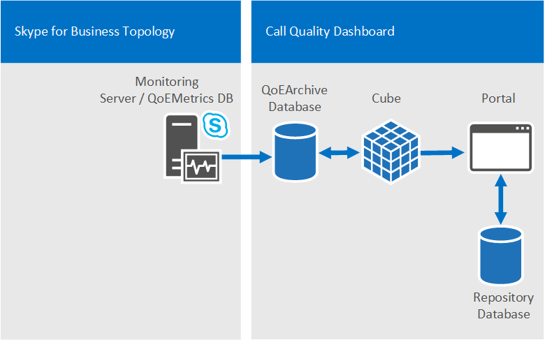
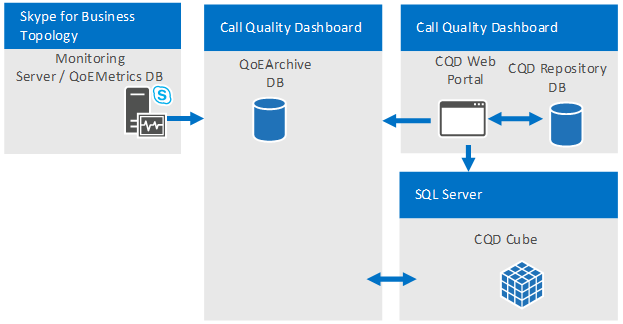

# <a name="skype-for-business-server-plan-for-call-quality-dashboard"></a>Skype Entreprise Server : planifier le tableau de bord de qualité des appels 
 
**Résumé :** Découvrez les éléments à prendre en compte lorsque vous planifiez le Tableau de bord de qualité des appels.
  
## <a name="overview-of-the-skype-for-business-server-call-quality-dashboard"></a>Vue d’ensemble du tableau de bord Skype Entreprise Server qualité des appels

Le tableau Skype Entreprise Server de qualité des appels (CQD) est une couche de rapports au-dessus de la base de données de qualité de l’expérience dans le serveur de surveillance dans Skype Entreprise Server. Le CQD utilise Microsoft SQL Server Analysis Services pour fournir des informations agrégées sur l’utilisation et la qualité des appels, ainsi que pour filtrer et pivoter sur le jeu de données. Les fonctionnalités de CQD sont les suivantes :
  
- **Archivage du stockage des données QoE via le composant d’archivage QoE du CQD.** Le composant d’archivage QoE peut stocker les données QoE pendant une durée bien plus longue que celle du serveur de surveillance. Cela permet de faire des tendances et de créer des rapports pendant sept mois de données à la fois, avec la possibilité de faire glisser la fenêtre de rapport aussi loin qu’il y a de données.
- **Rapports et analyse à l’aide de la puissance et de la vitesse de Microsoft SQL Server Analysis Services.** CQD utilise Microsoft SQL Analysis Services pour fournir des fonctionnalités rapides de synthèse, de filtrage et de pivotement pour alimenter le tableau de bord via un cube d’analyse. La vitesse d’exécution des rapports et la possibilité d’analyser les données peuvent réduire considérablement les temps d’analyse.
- **Nouveau schéma de données optimisé pour la génération de rapports de qualité des appels.** Le cube possède un schéma conçu pour les examens et les rapports de qualité vocale. Les utilisateurs du portail peuvent se concentrer sur les tâches de rapport au lieu de déterminer la façon dont le schéma de base de données des mesures QoE est mapdé aux affichages dont ils ont besoin. La combinaison de l’archive QoE et du cube fournit une abstraction qui réduit la complexité des rapports et de l’analyse via le CQD. Le schéma de base de données d’archivage QoE contient également des tables qui peuvent être remplies avec des données spécifiques au déploiement afin d’améliorer la valeur globale des données.
- **Concepteur de rapports intégré et modification de rapport sur place.** Le composant Portail est livré avec plusieurs rapports intégrés modélisés selon la méthodologie de qualité des appels. Les utilisateurs du portail peuvent modifier les rapports et créer de nouveaux rapports via la fonctionnalité d’édition du portail.
- **Accès à l’API web aux données de cube Structure de rapport et Analyse.** L’infrastructure de rapports du tableau de bord n’est pas la seule façon d’afficher les données du cube. Le CQD fournit plusieurs exemples d’utilisation de CODE HTML et JavaScript pour récupérer des données à partir des API Web CQD et restituer les données dans un format personnalisé. La combinaison de l’Éditeur de rapports et des API Web CQD permet un prototypage rapide des rapports et de la disposition personnalisée des rapports.

> [!NOTE]
> Un administrateur peut désormais gérer Skype Entreprise Server 2019 à l’aide du [CQD version 3](https://cqd.teams.microsoft.com) (connectez-vous avec les informations d’identification d’administrateur). Cela nécessite une implémentation hybride et l’utilisation du connecteur de données d’appel (CAS). Pour [plus d’informations](../../../SfbHybrid/hybrid/plan-call-data-connector.md) sur l’activation du connecteur de données d’appel, voir Plan Call Data Connector. Pour la documentation de la version 3 du tableau de bord de qualité des appels, voir Activer et utiliser le tableau de bord de qualité des appels pour [Microsoft Teams et Skype Entreprise Online](/MicrosoftTeams/turning-on-and-using-call-quality-dashboard) pour plus d’informations sur CQD version 3.

## <a name="cqd-design-goals"></a>Objectifs de conception du CQD

Le CQD permet aux professionnels de l’informatique d’utiliser des données agrégées pour identifier les zones de focus dans leur environnement qui rencontrent des problèmes de qualité des médias. Il permet à un Pro de comparer des statistiques pour différents groupes d’utilisateurs et d’identifier des tendances et des modèles. Il ne se concentre pas sur la résolution des problèmes d’appels individuels, mais sur l’identification des problèmes et des solutions qui s’appliqueront à de nombreux utilisateurs dans un environnement donné. 
  
## <a name="call-quality-dashboard-components"></a>Composants du tableau de bord de qualité des appels

Le tableau de bord de qualité des appels se compose de plusieurs bases de données, de tâches, de processus et d’applications web SQL Microsoft. Les travaux de l’agent Microsoft SQL copient régulièrement les données de la base de données de mesures QoE dans la base de données d’archivage QoE et traitent le cube avec les données de la base de données d’archivage QoE. La base de données du référentiel stocke les définitions de rapport qui sont à l’alimentation du portail. Le portail permet aux navigateurs d’accéder aux données du cube. 
  
Les composants CQD, y compris les bases de données d’archivage, de cube et de référentiel QoE, peuvent être installés sur le serveur de surveillance, installés sur leur propre serveur ou sur plusieurs serveurs. La méthode d’installation particulière dépend des exigences de performances du CQD et de l’impact sur les autres processus sur les mêmes serveurs. Pour plus d’informations, reportez-vous à la section « Composants et topologies pour le CQD » plus loin dans cet article.
  
### <a name="architectural-overview"></a>Vue d’ensemble de l’architecture

Pour résumer, le CQD requiert les éléments suivants :
  
- Deux bases de données : une base de données d’archivage et une base de données de référentiel.
    
- Un cube SSAS visualisant les données agrégées 
    
- IiS héberge le portail web CQD
    

  
La même architecture CQD prend en charge Lync Server 2013 et Skype Entreprise. 
  
### <a name="cqd-and-skype-for-business-vs-lync-2013"></a>CQD et Skype Entreprise par rapport à Lync 2013

 Dans un environnement Skype Entreprise, les fonctionnalités suivantes sont disponibles :
  
- Wi-Fi rapport de force du signal
    
- Wi-Fi rapports sur les pilotes de chipset
    
- Évaluer mes données d’appel 
    
## <a name="information-available-through-cqd"></a>Informations disponibles via le CQD

Le CQD peut afficher Skype Entreprise Server nombre de flux audio, vidéo et de partage d’application, ainsi que le nombre d’appels bons ou mauvais, ainsi que les ratios entre les appels mauvais et bons. Les vues peuvent être découpées et filtrées selon de nombreuses dimensions différentes. Le CQD dessine les données de la base de données de mesures QoE dans le serveur de surveillance. Les données sont ensuite fusionnées avec toutes les données fournies par le client, telles que le mappage de sous-réseau à bâtiment pour rendre possibles des rapports tels que « Qualité des appels par bâtiment ». 
  
Le CQD extrait également de nombreuses idiosyncrasies de données QoE internes, telles que « appelant » et « appelé », de telle façon que l’utilisateur peut se concentrer sur la création d’affichages de rapports autour de « serveur » et de « client ». À la suite de la méthodologie de qualité des appels, le CQD est rationalisé pour vous aider à identifier les conditions communes à des poches d’appels médiocres, l’un des principes d’amélioration de la qualité des appels.
  
## <a name="viewing-data-in-cqd"></a>Affichage des données dans le CQD

Les données CQD peuvent être vues via le portail CQD et accessibles via des appels d’API REST.
  
### <a name="cqd-portal"></a>Portail CQD

Le portail est le moyen le plus rapide d’afficher les données dans le cube. Le portail est livré avec plusieurs rapports intégrés qui sont utilisables immédiatement. Les rapports intégrés sont liés de manière structurée pour guider l’utilisateur dans des tranches de données d’appel successivement plus petites et plus petites. Les rapports intégrés mettent également en évidence les différentes façons dont les données peuvent être affichées en montrant une combinaison de graphiques et de tableaux avec différents tableaux croisés dynamiques, filtres et mesures. Chaque utilisateur qui accède au portail peut avoir son propre ensemble de rapports qu’il peut modifier et partager. Pour plus d’informations sur l’utilisation du portail Web CQD, voir Utiliser le tableau de bord de qualité des [appels pour Skype Entreprise Server](use.md).
  
Systèmes d’exploitation pris en charge pour le portail CQD : Windows 8.1, Windows 8, Windows Server 2012 R2, Windows Server 2012 et Windows Server 2016 (Skype Entreprise Server CQD 2019 uniquement).
  
Navigateurs pris en charge pour le portail CQD : Internet Explorer 11, Internet Explorer 10 et Internet Explorer 9.
  
### <a name="rest-apis"></a>API REST

Les données de cube sont également accessibles via des appels d’API REST. Les données récupérées via les appels d’API REST peuvent être rendues via des pages HTML. Les utilisateurs peuvent tirer parti de la vitesse de requête et du schéma de haut niveau du CQD tout en créant des rapports personnalisés adaptés à leurs besoins professionnels. Pour plus d’informations sur l’API et les exemples, voir Développer le tableau de bord de qualité des [appels pour Skype Entreprise Server](develop.md). 
  
## <a name="defining-your-organizations-requirements-for-cqd"></a>Définition des exigences de votre organisation pour le CQD

Le CQD fournit l’archivage des données QoE et une analyse rapide et approfondie des données de qualité des appels. Le guide suivant vous aide à déterminer quand et pourquoi vous devez déployer le CQD.
  
### <a name="when-to-deploy-cqd"></a>Quand déployer le CQD

 **Le CQD peut être déployé pour établir une mesure de qualité d’appel de référence, même si une organisation ne fait pas l’expérience de problèmes de qualité des appels.** Il est important d’établir une mesure de qualité d’appel de référence, car chaque organisation possède une combinaison différente de Wi-Fi câblés et distants par rapport aux travailleurs du bureau. Lorsque des problèmes de qualité des appels surviennent, les mesures de qualité des appels les plus récentes peuvent être comparées aux intervalles de temps précédents. Les fonctionnalités de tendance du CQD permettent de détecter facilement les modifications apportées à la qualité des appels au fil du temps.
  
 **Le CQD peut être déployé pour rechercher de manière proactive les problèmes qui peuvent avoir un impact sur la qualité des appels.** Même si la qualité moyenne des appels d’une organisation peut atteindre les objectifs fixés par l’organisation, il peut y avoir des poches de problèmes de qualité des appels qui sont masquées derrière les mesures moyennes. Le tableau de qualité des appels permet une répartition des mesures de qualité des appels de la même façon que dans un tableau croisé dynamique en plusieurs dimensions dans la base de données QoEMetrics. La recherche des valeurs aberrantes dans les groupes d’homologues est un moyen rapide de localiser de manière proactive les problèmes de qualité des appels.
  
 **Le CQD doit être déployé s’il existe des problèmes de qualité des appels dans l’organisation afin de réduire le temps nécessaire à la résolution des problèmes.** Le CQD peut simplifier les examens de qualité des appels existants en offrant des performances de rapport rapides et des fonctionnalités d’analyse dynamique. Le CQD est conçu pour de nombreux types de flux de travail lors d’examens de qualité des appels qui valident les réparations de l’environnement.
  
### <a name="why-deploy-cqd"></a>Pourquoi déployer le CQD

 **Le CQD doit être déployé si la rapports QoE doit avoir lieu pendant plus de 3 mois de données.** Les rapports sur la base de données QoEMetrics et le serveur de surveillance sont conçus pour conserver et signaler un petit ensemble de données. La base de données de mesures QoE est optimisée pour les insertions rapides et, par conséquent, les performances de rapport peuvent être ralenties par un grand nombre d’appels ou par un accès concurrent aux rapports à la base de données. La base de données d’archivage QoE de CQD fournit une deuxième copie des données de mesures QoE avec des fonctionnalités de rétention beaucoup plus longues. Le portail est également optimisé pour afficher jusqu’à 7 mois de données à la fois et peut signaler toutes les données de l’archive QoE selon vos besoins.
  
 **Le CQD doit être déployé si des rapports QoE personnalisés sont nécessaires.** Le portail dispose d’une fonctionnalité d’éditeur de rapports pour créer et prototypage des rapports rapidement et facilement. Il rend également disponibles les API REST pour l’accès par programmation aux données de cube, ce qui permet une présentation personnalisée à l’aide de HTML/JavaScript ou de nombreuses autres frameworks. Il n’est plus nécessaire de créer de nouvelles requêtes SQL aux fins de création d’affichages de données personnalisés pour la création de rapports.
  
 **Le CQD doit être déployé si la fonctionnalité de rapport QoE existante ne répond pas à la vitesse ou à la profondeur requises par l’organisation.** Le CQD est fourni avec de nombreux rapports intégrés. Les rapports sont immédiatement utiles et montrent comment l’exploration progressive des données peut offrir des informations supplémentaires à chaque niveau. La hiérarchie des rapports facilite également la gestion logique des nombreux rapports et favorise la création de nombreux autres rapports facilement accessibles et compréhensibles. Le CQD n’offre pas seulement de la rapidité et de la flexibilité, mais il est également optimisé pour les flux de travail développés par la méthodologie de qualité des appels.
  
## <a name="components-and-topologies-for-cqd"></a>Composants et topologies pour le CQD

Le CQD est fourni avec plusieurs composants et permet de comprendre les exigences de chaque composant et leur relation les uns avec les autres pour obtenir le déploiement de l’outil le plus simple et le plus performant. Le tableau suivant décrit le composant dépendant pour chaque composant CQD.
  

|Nom du composant|Composant dépendant|
|:-----|:-----|
|QoE Archive   |Microsoft SQL Server   |
|Cube   |Microsoft SQL Server Analysis Services   |
|Portail   |Services d’information Microsoft   |
|Service de référentiel (partie de l’installation du portail)   |Microsoft SQL Server   |
   
> [!NOTE]
> Pour l’archivage et le cube QoE, certaines options de déploiement nécessitent l’Enterprise ou des éditions Microsoft SQL Server. Pour plus d’informations, reportez-vous à la section Conditions requises pour l’infrastructure pour [le](plan.md#Infrastructure_Req) tableau de qualité des besoins ci-dessous.
  

  
### <a name="single-server-configuration"></a>Configuration d’un seul serveur

Tous les composants CQD et les composants dépendants peuvent être installés sur un seul ordinateur. La configuration à case unique est la configuration la plus simple et permet à CQD d’être autonome. Le CQD doit simplement accéder à la base de données de mesures QoE sur le serveur de surveillance. Le serveur CQD peut être un ordinateur autonome, un ordinateur virtuel ou même le serveur de surveillance, en fonction des ressources disponibles de l’ordinateur hôte et des exigences de performances. 
  
Pendant l’installation, l’utilisateur qui effectue l’installation doit simplement fournir les instances Microsoft SQL Server et Microsoft SQL Server Analysis Services qui ont été précédemment définies sur l’ordinateur sur lequel le CQD doit être installé. Pour plus d’informations, reportez-vous au Tableau de [bord de qualité Skype Entreprise Server](deploy-0.md) appels.
  
### <a name="multiserver-configuration"></a>Configuration multiserveur

Dans une configuration multiserveur, l’archive QoE, le cube et le portail peuvent tous se trouver sur des ordinateurs différents. Il existe deux utilisations principales pour la configuration multiserveur :
  
- Hébergement du portail web CQD et du cube CQD sur différents serveurs.
    
- Hébergement d’un portail de « développement » distinct du portail de « production ». 
    
  **Hébergement du portail web CQD et du cube CQD sur différents ordinateurs.** Les organisations qui peuvent avoir besoin de séparer le portail CQD de l’installation SQL Server ou qui souhaitent combiner et faire correspondre des éditions SQL Server pour l’instance SQL Server et l’instance SQL Server Analysis Services peuvent choisir d’installer le portail CQD et le cube CQD sur différents ordinateurs. Le composant d’archivage QoE peut également être le seul composant CQD installé si l’organisation souhaite simplement avoir une méthode durable pour archiver les données QoE sans atteindre les limites de performances sur le serveur de surveillance.
  

  
 **Hébergement d’un portail de « développement » distinct du portail de « production ».** Les organisations qui développent leurs propres rapports personnalisés (via les API REST) peuvent préférer déployer des instances de portail (CQD) supplémentaires en même temps que le portail de production accessibles aux utilisateurs réguliers pour la surveillance ou les examens de la qualité des appels. Le portail de développement peut isoler les modifications apportées au portail de l’environnement de production. Les portails web supplémentaires peuvent être déployés sur différents ordinateurs (voir ci-dessous) ou sur différents répertoires web sur le même ordinateur (non affiché). Pour ce faire, le portail web CQD supplémentaire doit être copié manuellement sur l’ordinateur de production, car le processus d’installation du CQD déploie toujours le portail Web CQD sur le site web par défaut avec des noms d’application web prédéfincis.
  

  
### <a name="supported-topologies"></a>Topologies prises en charge

Le CQD ne fusionne pas les données de plusieurs bases de données QoEMetrics, comme c’est le cas lorsqu’il existe plusieurs topologies Skype Entreprise Server, chacune avec son propre serveur de surveillance. Chaque instance de CQD doit pointer vers une base de données QoEMetrics. Toutefois, étant donné que le CQD déplace une grande partie de la charge de travail de rapport du serveur de surveillance, les grandes organisations qui ont besoin de déployer un serveur de surveillance par topologie Skype Entreprise Server doivent envisager d’utiliser un serveur de surveillance pour toutes les topologies.
  
## <a name="infrastructure-requirements-for-cqd"></a>Conditions requises pour l’infrastructure pour le CQD
<a name="Infrastructure_Req"> </a>

Le CQD, y compris tous ses composants et composants dépendants, peut être déployé sur une machine virtuelle, un seul ordinateur ou sur plusieurs ordinateurs. La configuration logicielle et matérielle minimale requise est répertoriée ci-dessous. La disponibilité des données et les performances des requêtes peuvent varier de minutes à heures, en fonction du nombre d’utilisateurs de Skype Entreprise Server actifs, du matériel et de la configuration, de sorte que certaines mesures de performances sont données ci-dessous.
  

|Pour CQD 2015 |&nbsp;  |
|:-----|:-----|
|Systèmes d’exploitation pris en charge    |Windows Server 2008 R2, Windows Server 2012, Windows Server 2012 R2   |
|Prise en charge SQL Server   |SQL Server 2012, SQL Server 2014, SQL Server 2016   |


|Pour CQD 2019  |&nbsp;  |
|:-----|:-----|
|Systèmes d’exploitation pris en charge    |Windows Server 2016, Windows Server 2019   |
|Prise en charge SQL Server   |SQL Server 2017, SQL Server 2019   |
   
Le CQD utilise Microsoft SQL Server, Microsoft SQL Server Analysis Services et Microsoft Internet Information Services de sorte que la configuration matérielle et logicielle minimale requise du CQD soit fondamentalement identique à celle de ces composants dépendants. Toutefois, en fonction des besoins de l’organisation en matière d’actualité des données (qui dépendent en partie du volume de données QoE générés par l’organisation) et du coût de déploiement, des considérations supplémentaires sur le déploiement doivent être prises en compte.
  
Le traitement des données dans le CQD est divisé en deux étapes principales : 
  
- Processus d’archivage QoE
    
- Traitement du cube CQD
    
  **Traitement de l’archive QoE.** La tâche de traitement de l’archivage QoE copie les données de la base de données de mesures QoE du serveur de surveillance vers la base de données d’archivage QoE. Il existe deux situations dans lesquelles le temps de traitement de la tâche aurait des caractéristiques de performances fondamentalement différentes. La première est après l’installation initiale du CQD. Lorsque la tâche est exécuté pour la première fois après une nouvelle installation, la tâche de traitement de l’archive QoE copie toutes les données de la base de données de mesures QoE dans la base de données d’archivage QoE. La seconde est le traitement périodique après cette série initiale. La tâche de traitement de l’archivage QoE s’exécutera toutes les 15 minutes et traitera tous les nouveaux enregistrements QoE de la base de données de mesures QoE. En règle générale, le temps de traitement initial n’est pas un problème, car il est exécuté uniquement la première fois, lors de l’installation du CQD. Toutefois, si le serveur CQD est gravement sous-mis en service, cette tâche peut prendre plusieurs heures. Reportez-vous au tableau ci-dessous pour obtenir des exemples de temps de traitement initiaux de l’archive QoE.
  
  **Traitement du cube CQD.** La tâche de traitement du cube regroupe les données de la base de données d’archivage QoE dans le cube. Le temps de traitement initial du cube et le temps de traitement de cube suivant sont déterminés par la SQL Server Analysis Services utilisée pour le cube CQD. Si l’édition Standard est utilisée, il n’y a aucune différence entre le temps de traitement initial du cube et le temps de traitement du cube suivant, car chaque fois que les données du cube sont actualisées, il s’agit toujours d’un traitement complet de toutes les données disponibles. (Cela signifie que le temps de traitement du cube augmente à mesure que la quantité de données dans la base de données d’archivage QoE augmente.) Étant donné que l’édition d’aide à la décision et les Êdition Entreprise de SQL Server ont une prise en charge de partition, si l’une ou l’autre édition est utilisée, seule l’édition initiale traitera toutes les données de la base de données d’archivage QoE. Dans les séries suivantes, lorsque la tâche est déclenchée toutes les 15 minutes, elle ne traitera que les nouveaux enregistrements ajoutés à la base de données d’archivage QoE depuis la dernière fois que la tâche a été exécuté. Une fois par jour, il y aura également un traitement complet sur la partition qui contient les données du mois en cours.
  
Les caractéristiques de l’ordinateur physique peuvent affecter les performances du CQD, ainsi que les fonctionnalités logicielles disponibles à partir SQL Server composants. Le composant d’archivage QoE sera plus important en disque que les autres composants, tandis que le composant Cube sera plus important en processeur et en mémoire. Tous ces facteurs contribuent au temps total de traitement des données du CQD, ce qui affecte directement l’actualité et la disponibilité des données. Les organisations doivent prendre des décisions sur le matériel et les logiciels en fonction des besoins individuels de l’organisation. 
  
### <a name="tested-hardware-configurations"></a>Configurations matérielles testées

Cette section suppose qu’il existe une seule base de données QoEMetrics dans l’environnement. 
  
**Profils d’ordinateur**

|Ordinateur|Cœurs d’UC|Mémoire RAM|Archive QoE et cube sur le même disque|Archivage QoE et SQL temp DB sur le même disque|
|:-----|:-----|:-----|:-----|:-----|
|Machine virtuelle   |4   |7 Go   |Oui   |Oui   |
|4 cœurs   |4   |20 Go   |Oui   |Non   |
|8 cœurs   |8    |32 Go    |Oui   |Non   |
|16 cœurs   |16   |128 Go   |Non   |Non   |
   
**Résultats de performances**

|Ordinateur|Taille de la DB des mesures QoE|SQL partitions|Type de disque|Nombre de flux|Processus d’archivage initial|Processus initial du cube|Processus d’archivage ultérieur|Processus de cube suivant|
|:-----|:-----|:-----|:-----|:-----|:-----|:-----|:-----|:-----|
|Machine virtuelle   |900 Mo   |Unique   |DISQUE DUR (taille variable)   |0,5 M   |30 m   |2 m   |30 s   |1 m   |
|Machine virtuelle   |9 Go   |Unique   |DISQUE DUR (taille variable)   |5 M   |4 h   |15 m   |1 m   |5 m   |
|Machine virtuelle   |9 Go   |Unique   |DISQUE DUR (taille fixe)   |5 M   |2 h   |5 m   |1 m   |5 m   |
|Machine virtuelle   |30+ Go   |Unique   |DISQUE DUR (taille fixe)   |10 M   |15 h   |20 m   |2 m   |45 m   |
|8 cœurs   |9 Go   |Unique   |Disques multiples   |5 M   |2 h   |5 m   |25 s   |5 m   |
|8 cœurs   |9 Go   |Multiple   |Disques multiples   |5 M   |2 h   |15 m   |35 s   |2 m   |
|8 cœurs   |30+ Go   |Unique   |Disques multiples   |20 M   |9 h   |20 m   |1 m   |20 m   |
|8 cœurs   |30+ Go   |Multiple   |Disques multiples   |20 M   |9 h   |30 m   |2 m   |2 m   |
|4 cœurs   |200 Go   |Unique   |Disques multiples   |125 M   |6+ jours   |7 h   |2 m   |6 h   |
|16 cœurs   |500 Go   |Multiple   |Plusieurs spindles   |250 M   |8 jours   |2 h   |2 m   |10 m   |
   
\*Ces problèmes ne sont pas censés être rencontrés dans des déploiements réels, car la base de données de mesures QoE doit avoir respectivement 9 et 18 mois de données, mais elles sont fournies ici pour être complètes.
  
### <a name="service-account-requirements"></a>Conditions requises pour les comptes de service

Vous aurez besoin d’un compte (avec accès en lecture à QoEMetrics) que l’agent SQL sur le serveur CQD peut utiliser pour importer des données dans QoEArchiveDB.
  
Vous devrez peut-être également configurer un compte distinct pour qu’une tâche SSAS puisse tirer des données de QoEArchiveDB (il s’agit d’un processus facultatif).
  
Les services Internet (IIS) utilisent généralement le service réseau comme identité du pool d’applications, mais peuvent être configurés sur un compte de service.
  
### <a name="portal-access-control"></a>Contrôle d’accès au portail

Par défaut, tout utilisateur authentifié a accès. Cela peut être modifié à l’aide de règles d’autorisation IIS pour limiter à un groupe spécifique.
  
### <a name="pre-install-requirements"></a>Conditions préalables à l’installation

Ces instructions supposent qu’une base de données de mesures QoE a déjà été installée et qu’elle est en cours d’exécution dans Skype Entreprise Server topologie.
  
#### <a name="hardware-requirements"></a>Configuration matérielle requise

Le CQD utilise Microsoft SQL Server, Microsoft SQL Analysis Server et Microsoft Internet Information Server afin que la configuration matérielle et logicielle minimale requise du CQD soit fondamentalement la même que pour les composants dépendants. Toutefois, en fonction des besoins de l’organisation en matière d’actualité des données (qui dépendent en partie du volume de données QoE générés par l’organisation) et du coût de déploiement, des considérations supplémentaires sur le déploiement doivent être prises en compte.
  
#### <a name="software-requirements"></a>Configuration logicielle requise

Les systèmes d’exploitation suivants sont requis pour le CQD :
  
- Windows Server 2008 R2 avec IIS 7.5
    
- Windows Server 2012 avec IIS 8.0
    
- Windows Server 2012 R2 avec IIS 8.5

- Windows Server 2016 avec IIS 10.0 (Skype Entreprise Server 2019 CQD uniquement)

- Windows Server 2019 (Skype Entreprise Server CQD 2019 uniquement)
    
Les services de rôle IIS requis (dans l’ordre hiérarchique) sont les suivants :
  
- Serveur web
    
  - Fonctionnalités HTTP communes
    
  - Contenu statique
    
  - Document par défaut
    
  - Développement d’applications
    
  - ASP.NET
    
  - Filtres ISAPI
    
  - Diagnostics &amp; d’état
    
  - Journalisation HTTP
    
  - Sécurité
    
  - Autorisation d’URL
    
  - Authentification Windows
    
  - Outils de gestion
    
  - Console de gestion IIS
    
> [!NOTE]
>  Notez ce qui suit pour les conditions requises ci-dessus : > versions 3.5 et 4.5 de .Net Framework sont disponibles. Les deux sont obligatoires (plus spécifiquement, 3.5 SP1 est requis).> Dans certains systèmes, si ASP.NET est configuré avant l’installation d’IIS, ASP.NET peut ne pas être inscrit dans IIS. Le problème se manifeste par l’absence de pools d’applications pour la version .Net correspondante et par l’absence de la version CLR .NET dans la configuration du pool d’applications. Pour corriger un tel problème sur Windows Server 2008 R2, exécutez `%systemroot%\Microsoft.NET\Framework64\4.0.30319\aspnet_regiis.exe -iru`. Sur Windows Server 2012 et Windows Server 2012 R2, `dism /online /enable-Feature /all /FeatureName:WCF-HTTP-Activation45` exécutez le module « ServiceModel » en supprimant le module « ServiceModel » du site Web par défaut dans les outils de gestion du Gestionnaire des services Internet.> est facultatif, mais recommandé.
  
Pour installer ces conditions requises à l’aide de PowerShell, exécutez la suivante :
  
```PowerShell
import-module servermanager
```

```PowerShell
add-windowsfeature Web-Server, Web-Static-Content, Web-Default-Doc, Web-Asp-Net, Web-Asp-Net45, Web-Net-Ext, Web-Net-Ext45, Web-ISAPI-Ext, Web-ISAPI-Filter, Web-Http-Logging, Web-Url-Auth, Web-Windows-Auth, Web-Mgmt-Console
```

Les versions suivantes de SQL Server sont pris en charge :

- CQD 2015 : SQL Server 2012, SQL Server 2014, SQL Server 2016
- CQD 2019 : SQL Server 2017, SQL Server 2019 
    
L’édition d’Enterprise ou d’Enterprise est recommandée pour des raisons de performances. Ces éditions permettent d’utiliser plusieurs fichiers de partition qui peuvent être traitées en parallèle, ce qui est utile pour le traitement des données sur plusieurs mois ou plus. 
  
Bien que cela ne soit pas recommandé, l’édition Standard est également prise en charge. Le traitement est limité à une seule partition (qui doit être configurée lors de l’installation). 
  
Dans tous les cas, « Moteur de base de données Services » et « Analysis Services » doivent être installés. Il est recommandé, mais pas obligatoire, d’installer également la fonctionnalité « Outils de gestion - Complète », qui ajoute SQL Server Management Studio prise en charge d’Analysis Services. L’écran de sélection des fonctionnalités doit ressembler à la figure.
  

  
Lors de la configuration de l’installation de SSAS, dans la configuration Analysis Services, définissez « Mode serveur » sur « Mode multidimensionnel et exploration de données ». 
  
Pour obtenir de l’aide supplémentaire sur l’installation et la configuration SQL Server fonctionnalités d’aide à la gestion des données, voir [Installer Analysis Services en mode multidimensionnel](/previous-versions/sql/sql-server-2012/ms143708(v=sql.110)) et en mode d’exploration de données.
  
#### <a name="account-requirements"></a>Conditions requises pour les comptes

Trois comptes de service de domaine sont recommandés sur le principe du moindre privilège : 
  
- Il dispose déjà d’un principal de sécurité de connexion pour la base de données de mesures QoE (avec un privilège db_datareader) et d’un principal de sécurité de connexion dans l’instance de SQL Server d’archivage QoE (nécessaire pour créer un objet serveur lié lors de l’installation). Ce compte sera utilisé pour exécuter l’étape « Données d’archivage QoE » du travail SQL Server’agent.
    
    > [!NOTE]
    > Si vous travaillez dans un environnement fortement verrouillé, vous devez vérifier que ce compte de service est effectivement autorisé à « Se connecter en tant que travail par lot » et à « Autoriser l’connexion localement » sur les SQL Server de base de données de surveillance des mesures QoE et la SQL Server d’archivage QoE.
    
- Un qui sera utilisé pour exécuter l’étape « Cube de processus » du travail SQL Server agent de traitement. Le programme d’installation crée un principal de sécurité de connexion à la base de données d’archivage QoE (avec un privilège de lecture et d’écriture) et crée également un membre dans le rôle QoE (avec un privilège de contrôle total) pour le cube.
    
- Un processus qui sera utilisé pour exécuter le processus de travail IIS pour les portails web et les API web. Le programme d’installation crée un principal de sécurité de connexion à la base de données d’archivage QoE (avec un privilège de lecture), un principal de sécurité de connexion à la base de données du référentiel (avec un privilège de lecture et d’écriture) et un membre dans QoERole (avec un privilège de contrôle total) pour le cube. 
    
    > [!NOTE]
    > Lorsque la base de données d’archivage QoE et la base de données de référentiel sont hébergées dans la même SQL Server, un seul principal de sécurité de connexion avec deux mappages utilisateur est créé. 
  
Les deux premiers comptes peuvent être logiquement considérés comme des « comptes de service back end » et le dernier compte est un « compte de service frontal ». Bien que cela ne soit pas recommandé, il est possible d’utiliser un seul compte dans tous les cas.
  
> [!NOTE]
> Le compte d’utilisateur à l’origine de l’installation doit également disposer d’un accès en lecture à la base de données des mesures QoE (en plus d’avoir des droits d’administrateur d’ordinateur sur le serveur QoE Archive DB où l’installation doit avoir lieu). 
  
## <a name="capacity-planning"></a>Planification de la capacité
<a name="Infrastructure_Req"> </a>

Le CQD est conçu pour un impact minimal sur QoEMetrics : le code a été optimisé pour ne pas verrouiller les données et les travaux d’importation sont tunables.
  
Le type de matériel à utiliser dépend de vos besoins en matière de rapidité d’utilisation des synchronisations. Le resserrage du disque est le suivant :
  
- QoEArchive est environ 1,5 fois plus grand que QoEMetrics DB initialement
    
- Le cube SSIS compresse les données presque 10 fois par rapport à la base de données
    
- Les données sont partitionées tous les mois ; partitions peuvent être supprimées
