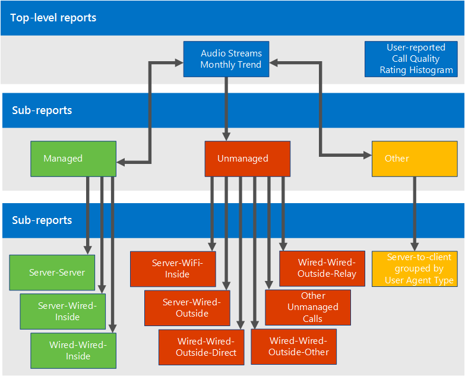

# Utiliser le Tableau de bord de qualité des appels pour Skype Entreprise Server

**Résumé :** Découvrez comment utiliser le tableau de bord de qualité des appels. Le Tableau de bord de qualité des appels est un outil pour Skype Entreprise Server.

Le Tableau de bord de qualité des appels (CQD) permet aux professionnels de l’informatique d’utiliser des données agrégées pour identifier les problèmes de création de problèmes de qualité des médias en comparant des statistiques pour les groupes d’utilisateurs afin d’identifier les tendances et les modèles. Le CQD ne se concentre pas sur la résolution des problèmes d’appels individuels, mais sur l’identification des problèmes et des solutions qui s’appliquent à de nombreux utilisateurs.

## Guide de l’utilisateur du tableau de bord de qualité des appels

Le CQD est un portail web qui permet de créer et d’organiser rapidement des rapports basés sur des données de qualité de l’expérience (QoE). Le CQD déploie un cube SSAS pour agréger les données dans la base de données de mesures QoE et permet aux administrateurs de créer et de modifier des rapports ou d’enquêter en temps réel. Bien qu’il soit possible d Excel pour se connecter directement au cube, le portail est optimisé pour plusieurs flux de travail impliquant des données QoE. Les données incluent :

- Données de rapport mises en cache pour un accès rapide
- Liens profonds vers des pages de rapport pour le partage et la publication d’informations
- Modification et création simplifiées des rapports, et métadonnées modifiables pour les descriptions des rapports.

En outre, le tableau de bord de qualité des applications expose des API web qui donnent aux utilisateurs un accès par programmation aux données de cube à utiliser dans des tableaux de bord personnalisés.

### Vue d’ensemble des fonctionnalités

Lorsque vous visitez le Tableau de bord de qualité des appels, l’écran suivant s’affiche :

1. Le volet « Résumé » est l’endroit où se trouve le contexte de l’ensemble de rapports (à droite).
2. Cliquez sur « Modifier » dans le volet Résumé Pour définir les propriétés de niveau (y compris la hauteur de l’axe Y).
3. La breadcrumb vous permet d’identifier votre emplacement actuel dans la hiérarchie des ensembles de rapports.
4. Les rapports avec des sous-rapports sont affichés avec un lien bleu. Cliquez sur le lien pour descendre dans les rapports enfants.

Déplacez la souris sur les graphiques à barres et les lignes de tendance pour afficher des valeurs détaillées. Le rapport qui a le focus affiche le menu d’action : « Modifier », « Cloner », « Supprimer » et « Télécharger ».

### Rapports par défaut

Lorsque vous accédez pour la première fois au portail Tableau de bord de qualité des appels, un ensemble de rapports par défaut est créé automatiquement. Ces rapports sont parfois appelés rapports système. Vous pouvez librement modifier ou supprimer ces rapports ou les étendre en créant de nouveaux rapports frères et enfants.

Au niveau supérieur, le rapport « Audio Flux Monthly Trend » affiche la tendance mensuelle pour tous les flux audio. Déplacez la souris sur les barres d’un graphique à barres pour afficher une vue plus détaillée des données représentées par le graphique à barres. Cliquez sur le titre du rapport de tendance mensuelle de l’audio Flux pour accéder au rapport « Managed vs Unmanaged Audio Flux », où les rapports sont répartis entre les appels gérés et non gérés. Les appels gérés sont des appels effectués à l’intérieur du pare-feu d’entreprise sur des connexions câblés. Les appels non pris en compte incluent les appels effectués depuis l’extérieur du pare-feu d’entreprise et tous les appels effectués via le Wi-Fi.

L’autre rapport de niveau supérieur est appelé « Histogramme d’évaluation de la qualité des appels signalé par l’utilisateur ». Les évaluations de la qualité des appels sont les numéros Skype Entreprise utilisateurs à la fin d’un appel pour indiquer la qualité de l’appel. Les numéros d’évaluation vont de 1 à 5, 1 est le pire et 5 est le meilleur. L’histogramme indique le nombre d’appels audio dont l’évaluation a été indiquée dans un mois.

Cliquez sur le titre de l’un des rapports pour accéder aux rapports avec d’autres filtres sur les données. Dans les rapports système, chaque rapport enfant affiche un sous-ensemble des données disponibles dans son rapport parent. Le modèle de résolution des problèmes est simple : examinez la sous-information des données ou de la tendance suggèrent qu’un problème est limité et réduisez progressivement l’espace du problème. La possibilité de créer des sous-états vous permet d’examiner vos propres estimations sur la cause de tendances de données spécifiques.

### Créer et modifier des rapports

Cliquez sur « Modifier » dans le menu Actions d’un rapport pour voir l’Éditeur de rapport. Chaque rapport est dosé par une requête dans le cube. Un rapport est une visualisation des données renvoyées par sa requête. L’Éditeur de rapport vous aide à modifier ces requêtes et les options d’affichage du rapport. Lorsque vous ouvrez l’Éditeur de rapports, vous voyez :

1. Les dimensions, les mesures et les filtres sont choisis dans le volet gauche. Pointez sur l’une des valeurs existantes pour afficher un bouton « x » qui permet de supprimer la valeur. Cliquez sur le bouton « plus » en haut d’un titre pour ouvrir la boîte de dialogue dans laquelle vous pouvez ajouter une nouvelle dimension, une nouvelle mesure ou un nouveau filtre.
2. Les options de personnalisation de graphique sont affichées en haut.
3. Un aperçu du rapport est disponible dans l’Éditeur de rapports.
4. Une description détaillée du rapport peut être créée avec la zone d’édition en bas.

### Sparklines dans les tableaux

Lorsque StartDate.Month est ajouté en tant que dimension et que les données sont affichées sous forme de tendance sous forme de tableau, les graphiques à barres et les graphiques sparkline peuvent être affichés à l’intérieur des cellules du tableau. Déplacez le pointeur de la souris sur le graphique à barres et les graphiques sparkline pour afficher les valeurs des mois individuels.

Pour que les graphiques à barres et les graphiques sparkline apparaissent, la case à cocher « Afficher les graphiques sparkline » en haut de l’Éditeur de rapports doit être cochée. Cette option sélectionne l’option Tendance et déplace Month vers le bas pour qu’il soit la dernière dimension, ce qui peut également être réalisé en cliquant sur Mois et en utilisant les flèches haut et bas pour décaler StartDate.Month vers le haut ou vers le bas.

### Paramètres

Le menu Paramètres contient des liens vers des pages utiles telles que les pages État du système et À propos de, et se trouve dans le coin supérieur droit du tableau de bord.

L’affichage des descriptions et des horodaodatés doit être pris en compte par les utilisateurs individuels, et ces paramètres affectent uniquement la version individuelle du tableau de bord et ne modifient pas l’ensemble de rapports ou ce que voient les autres utilisateurs. L’effacement du cache entraîne le rechargement des données de toutes les requêtes à partir du cube, tandis que la restauration par défaut supprime tous les rapports créés ou modifiés par l’utilisateur et recrée l’ensemble de rapports système , ce qu’un utilisateur voit lorsqu’il se connecte pour la première fois.

Le lien Tableau de bord utilisateurs affiche une page dans laquelle les utilisateurs peuvent afficher d’autres utilisateurs du tableau de bord des utilisateurs et parcourir leurs rapports. Pour partager un ensemble de rapports, copiez le lien dans la barre d’URL et partagez-le avec un autre utilisateur CQD. Ce lien est le même que celui que les autres utilisateurs peuvent voir dans la page Lien du tableau de bord des utilisateurs sous le nom d’utilisateur de l’utilisateur.

### Fourniture d’informations de sous-réseau

Des informations supplémentaires peuvent être révélées si des informations spécifiques au site sont entrées dans la base de données d’archivage pour fournir des informations de mappage de sous-réseau à bâtiment (par exemple, qualité des appels câblés/sans fil par bâtiment).

Pour créer ces rapports, complétez au minimum les tableaux suivants :

- CqdBuilding
- CqdNetwork

Des informations supplémentaires peuvent être fournies dans les tables CqdBuildingType et CqdBuildingOwnershipType pour permettre un filtrage et une recherche supplémentaires.

Les données utilisées pour ces tables sont définies comme suit :

**CqdBuilding**

|Colonne|Type de données|Autoriser les valeurs Null ?|Détails|
|:-----|:-----|:-----|:-----|
|BuildingKey |int |Non |Clé primaire de la table CqdBuilding. |
|BuildingName |varchar(80) |Non |Nom du bâtiment. |
|BuildingShortName |varchar(10) |Non |Version plus courte du nom du bâtiment. |
|OwnershipTypeId |int |Non |Clé étrangère, correspond à l’une des entrées de la table CqdBuildingOwners. |
|BuildingTypeId |int |Non |Clé étrangère, correspond à l’une des entrées de la table CqdBuildingType. |
|Latitude |float |Oui |Latitude du bâtiment. |
|Longitude |float |Oui |Longitude du bâtiment. |
|CityName |varchar(30) |Oui |Nom de la ville où se trouve le bâtiment. |
|ZipCode |varchar(25) |Oui |Code postal où se trouve le bâtiment. |
|CountryShortCode |varchar(2) |Oui |Codes ISO 3166-1 alpha-2 pour le pays où se trouve le bâtiment. |
|StateProvinceCode |varchar(3) |Oui |Abréviation à trois lettres du département/de la province où se trouve le bâtiment. |
|InsideCorp |bit |Oui |Bit indique si le bâtiment fait partie du réseau d’entreprise. |
|BuildingOfficeType |nvarchar(150) |Oui |Description du type de bureau de bâtiment. |
|Région |varchar(25) |Oui |Région où se trouve le bâtiment. |

**CqdNetwork**

|Colonne|Type de données|Autoriser les valeurs Null ?|Détails|
|:-----|:-----|:-----|:-----|
|Réseau |varchar(25) |Non |Adresse de sous-réseau. |
|NetworkRange |tinyint |Oui |Masque de sous-réseau. |
|NetworkNameID |int |Oui |Mapille éventuellement à une ligne dans la table CqdNetworkName. |
|BuildingKey |int |Oui |Clé étrangère, correspond à l’une des entrées de la table CqdBuilding. |
|UpdatedDate |DateHeure |Non |Date et heure de la dernière mise à jour de l’entrée. |

Par défaut, le tableau suivant possède une entrée (0, « Inconnu »).

**CqdBuildingType**

|Colonne|Type de données|Autoriser les valeurs Null ?|Détails|
|:-----|:-----|:-----|:-----|
|BuildingTypeId |int |Non |Clé primaire de la table CqdBuildingType. |
|BuildingTypeDesc |char(18) |Non |Description du type de bâtiment. |

Par défaut, le tableau suivant possède une entrée (0, « Inconnu » et 0, null).

**CqdBuildingOwnershipType**

|Colonne|Type de données|Autoriser les valeurs Null ?|Détails|
|:-----|:-----|:-----|:-----|
|OwnershipTypeId |int |Non |Clé primaire de la table CqdBuildingOwnershipType. |
|OwnershipTypeDesc |varchar(25) |Non |Description du type de propriété. |
|LeaseInd |tinyint |Oui |Index référencant une autre ligne dans la table CqdBuildingOwnershipType, utilisée pour identifier les bâtiments en bail. |
|Propriétaire |varchar(50) |Oui |Propriétaire du bâtiment. |

Par défaut, le tableau suivant possède une entrée (0, « Inconnu » et 0, null).

**CqdBssid**

|Colonne|Type de données|Autoriser les valeurs Null ?|Détails|
|:-----|:-----|:-----|:-----|
|bss |nvarchar(50) |Non |Clé primaire de la table CqdBssid. Est le BSSID du point d’accès WiFi. |
|ess |nvarchar(50) |Oui |Informations sur le contrôleur de point d’accès Wifi. |
|phy |nvarchar(50) |Oui |Informations sur Phy. |
|ap |nvarchar(50) |Oui |Nom du point d’accès Wifi. |
|Création |nvarchar(500) |Oui |Nom du bâtiment où se trouve le point d’accès WiFi. |

## CQD Flux

Un flux CQD est considéré comme bon, médiocre ou non classifié. CQM 1.5 utilise désormais la définition CQD suivante :

- Un flux médiocre est une combinaison quelconque de mesures d’appels médiocres au-delà du seuil.
- Lorsqu’un flux d’un appel est médiocre, les deux flux de l’appel sont marqués comme médiocres. Dans les conférences, chaque participant est compté comme un appel unique et est signalé indépendamment de tous les autres.
- Les flux non classifiés sont des flux sans mesures de qualité (transactions synthétiques ou appels courts).
- Valeurs Flux = clients non mobiles
- Le classificateur ne peut pas être modifié

**Définition/classifieur d’appel médiocre**

|Métrique|Seuil|
|:-----|:-----|
|DegradationAvg |Supérieur à 1.0 (-1 mos réseau) |
|RoundTrip |Supérieur à 500 |
|PacketLossRate |Supérieur à 0,1 (10 %) |
|JitterInterArrival |Supérieur à 30 |
|RatioConcealedSamplesAvg |Supérieur à 0,07 |

Définition JPDR = Définition d’appel médiocre moins RatioConcealedSamplesAvg

## Où se trouve l’appelant/l’appelé ?

Le CQD n’utilise pas les champs Appelant/Appelé, mais « Premier » et « Second », car il existe des étapes intermédiaires entre l’appelant et l’appelé.

 **First** Sera toujours le point de terminaison du serveur (par exemple, av MCU ou serveur de médiation) si un serveur est impliqué dans le flux.

 **Second** Sera toujours le point de terminaison client, sauf s’il s’agit d’un flux Server-Server client.

**Exemple de classification first et second**

|Point de terminaison 1 UAType|Point de terminaison 2 UUAType|Premier|Deuxième|
|:-----|:-----|:-----|:-----|
|2 (AVMCU) |4 (Skype Entreprise) |Point de terminaison 1 |Point de terminaison 2 |
|2 (AVMCU) |1 (mMediationServer) |Point de terminaison 2 |Point de terminaison 1 |
|4 (Skype Entreprise) |4 (Skype Entreprise) |L’appelant dans MediaLine |Appelé dans MMediaLine |

Si les deux points de terminaison sont du même type, le CQD fait de l’entrée de l’appelant la première et la deuxième de l’appelé. Pour plus d’informations sur les noms des points de terminaison, [consultez ce blog.](/archive/blogs/jenstr/call-quality-dashboard-tips-and-tricks)

## Comptabilité du VPN

Si la solution VPN est connue pour définir avec précision l’indicateur VPN, vous êtes tous ensemble. Sinon, utilisez l’une des méthodes suivantes :

- Créez un type de réseau appelé VPN (préféré), puis associez des sous-réseaux VPN à ce nouveau networkType VPN.
- Créez un bâtiment appelé VPN, puis associez des sous-réseaux VPN à ce bâtiment.

## Principes de base de la requête

Une requête bien formée contient les trois paramètres suivants :

- Mesure
- Dimension
- Filtre

Un exemple de requête bien formée serait « Show me Poor Flux [Measurement] by Subnet [Dimension] for Building 6 [Filter]. »

## Que fait UNION ?

Union vous permet de filtrer les conditions avec l’opérateur AND. Il existe des scénarios dans lequel vous pouvez combiner plusieurs conditions filter pour obtenir un résultat semblable à une opération OR.

Exemple : pour obtenir tous les flux à partir d’un bâtiment, UNION fournit une vue distincte du jeu de données fusionné. Pour utiliser UNION, insérez du texte commun dans le champ UNION dans les deux conditions de filtre que vous souhaitez utiliser pour UNION.

## Répartition des rapports par défaut

Si la technologie sans fil est gérée en interne, vous pouvez recréer les rapports sans fil dans le compartiment géré.

## Processus opérationnels

Examinez et remédiez d’abord aux Flux gérés. La qualité dans ce domaine doit être à 100 % dans votre contrôle et, par conséquent, la solution la plus simple.

### Gestion des Flux

Examinez et remédiez aux flux gérés dans l’ordre suivant :

1. Server-Server
2. Server-Wired-Inside
3. Wired-Wired-Inside

### Les Flux

Examinez et remédiez aux flux nonmanagés dans l’ordre suivant :

1. Server-Wifi-Inside
2. Server-Wired-Outside
3. Server-Wifi-Outside
4. Wired-Outside-Direct
5. Wired-Outside-Relay
6. Autres nonmanagés