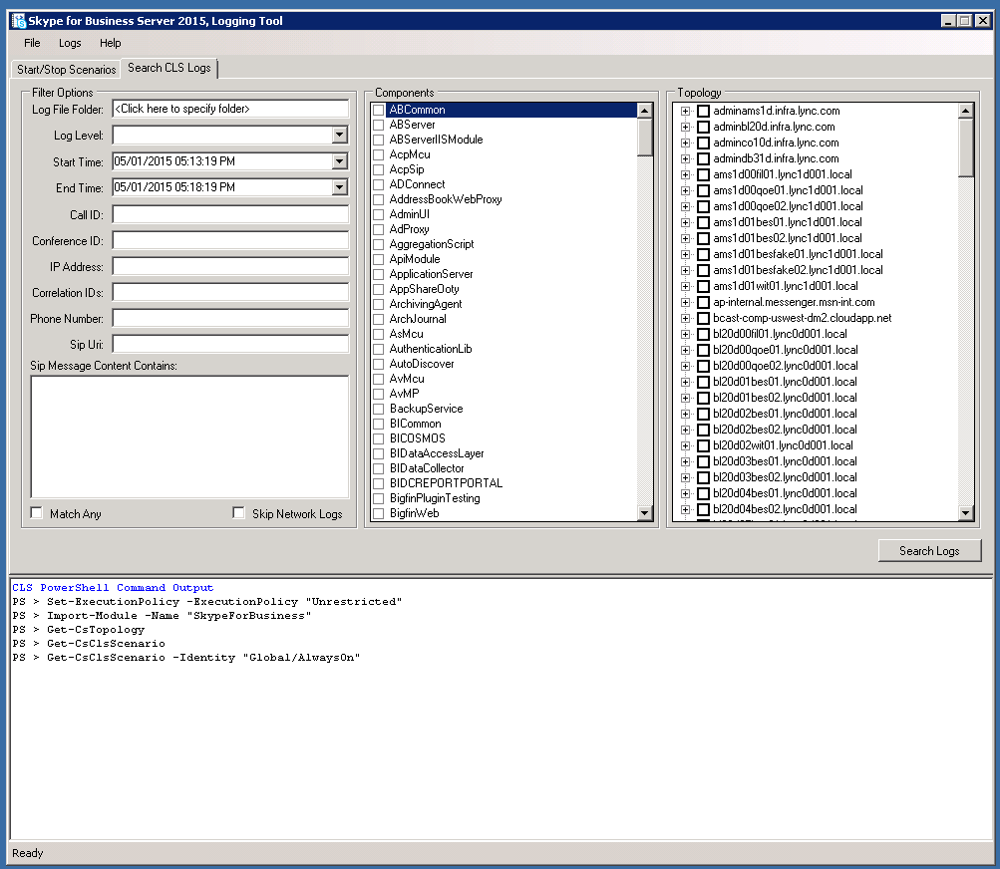

# CLS Logger pour Skype Entreprise Server 2015
 
**Résumé :** Découvrez comment utiliser l’enregistreur CLS (Centralized Logging Service) dans Skype Entreprise Server 2015.
  
ClS Logger est un outil qui vous permet de gérer les journaux générés par le service de journalisation centralisée.
  
## Configuration requise

Pour utiliser correctement CLS Logger, vous devez vous assurer que les valeurs suivantes sont vraies :
  
- Vous utilisez l’outil sur un ordinateur membre du domaine dans lequel le SERVICE de journalisation centralisée (CLS) est en cours d’exécution. L’outil n’est actuellement pas pris en charge dans les sessions PowerShell à distance.
    
- Le fichier Default.tmx du dossier de suivi (dossier dans lequel les données de suivi sont capturées pour le CLS) et Snooper doit être copié dans le dossier où l’outil CLS Logger est installé.
    
## Vérifier l’état de journalisation d’un ensemble de pools/ordinateurs

Utilisez les commandes suivantes pour vérifier l’état de la journalisation :
  
1. Dans l’onglet « Scénarios de démarrage/arrêt », sélectionnez un regroupement de pools et/ou d’ordinateurs dans l’arborescence topologie.
    
2. Cliquez sur le bouton État de la journalisation.
    
3. Affichez la sortie de commande dans la zone sortie de commande PowerShell pour plus d’informations sur l’état de journalisation des pools et/ou ordinateurs sélectionnés.
    
## Démarrer un scénario existant

Pour démarrer un scénario existant :
  
1. Dans l’onglet « Scénarios de démarrage/arrêt », sélectionnez un scénario existant dans le menu déroulant Scénarios.
    
2. Sélectionnez un regroupement de pools et/ou d’ordinateurs dans l’arborescence topologie.
    
3. Cliquez sur le bouton Démarrer le scénario. L’interface utilisateur est désactivée jusqu’à la fin de l’opération. Cela peut être lent sur les déploiements de grande taille.
    
4. L’interface utilisateur est de nouveau activée une fois le scénario démarré, les détails de l’action sont également affichés dans la zone de sortie de commande PowerShell.
    
5. La tâche peut prendre un certain temps avant que la journalisation soit reprise par le CLS avant toute nouvelle donnée de ce scénario.
    
## Arrêter un scénario existant

Pour arrêter un scénario existant :
  
1. Dans l’onglet « Scénarios de démarrage/arrêt », sélectionnez un scénario existant dans le menu déroulant Scénarios.
    
2. Sélectionnez un regroupement de pools et/ou d’ordinateurs dans l’arborescence topologie.
    
3. Cliquez sur le bouton Arrêter le scénario. L’interface utilisateur est désactivée jusqu’à la fin de l’opération. Cela peut être lent sur les déploiements de grande taille.
    
4. L’interface utilisateur est de nouveau activée une fois que le scénario s’est arrêté, les détails de l’action sont également affichés dans la zone de sortie de commande PowerShell.
    

  
## Rechercher des journaux

Pour rechercher des journaux, sélectionnez l’onglet « Rechercher les journaux CLS », puis cliquez sur le bouton « Journaux de recherche » après avoir rempli les champs affichés, comme décrit ci-dessous :
  
> **Dossier du fichier journal** Dossier pour enregistrer les résultats de la recherche dans le journal. (Obligatoire)
> 
> **Niveau du journal** Cette valeur détermine le niveau le plus bas qui s’affichera dans les résultats. Par exemple, si Avertissement est sélectionné, seuls Avertissement, Erreur et Fatal s’afficheront. Par défaut: Débogage.
> 
> **Pools** Pools d’ordinateurs pour effectuer la recherche de journal par rapport à, il s’est s’il s’t des nodes parents de l’arborescence. (Obligatoire)
> 
> **Ordinateurs** Ordinateurs individuels sur qui effectuer la recherche dans les journaux, il s’hui de tous les nodes enfants dans l’arborescence. (Obligatoire)
> 
> **Heure de début** Période à partir de laquelle le CLS interrogera les journaux. (Obligatoire)
> 
> **Heure de fin** Période à partir de laquelle le CLS cessera d’interroger les journaux. (Obligatoire)
> 
> **Composants** Permet de sélectionner les composants à ajouter à la requête. (Facultatif)
> 
> **ID d’appel** ID d’appel de toutes les boîtes de dialogue SIP qui doivent être filtrées. Remarque : ce champ utilise la correspondance exacte. (Facultatif)
> 
> **ID de conférence** ID de conférence de toutes les conférences à filtrer. Remarque : ce champ utilise la correspondance exacte. (Facultatif)
> 
> **Adresse IP** Adresse IP qui doit être filtrée. Remarque : ce champ utilise la correspondance exacte. (Facultatif)
> 
> **ID de corrélation** Instructions de suivi liées logiquement par cet ID. (Facultatif)
> 
> **Téléphone number** Filtrer par numéro de téléphone. (Facultatif)
> 
> **URI SIP** Filtrez par URI SIP. (Facultatif)
> 
> **Contenu des messages SIP** Filtrer par contenu de message SIP, cela sous-stre la recherche dans ce champ. (Facultatif)
> 
> **Match Any** Recherche à l’aide d’un ou logique s’il est vérifié. Par défaut, correspond exactement à tous les paramètres.
> 
> **Ignorer les journaux réseau** Ignore la recherche dans les journaux réseau s’il est vérifié.
    

  
## Créer un scénario

1. Dans **l’onglet Modifier les scénarios,** cliquez sur le **bouton Créer un** scénario.
    
    > [!NOTE]
    > La création d’un scénario clonera la configuration du scénario actuellement sélectionné. Si vous cliquez **sur Effacer Paramètres** avant de créer un nouveau scénario, aucun composant et aucun indicateur n’est sélectionné.
  
2. Entrez le nom du scénario que vous créez et appuyez sur Entrée ou cliquez sur le bouton Ok.
    
3. Le nouveau scénario sera désormais créé. Une fois la création réussie, la drop-down Scenarios est sélectionnée avec le scénario nouvellement créé.
    
## Modifier un scénario

  
1. Dans **l’onglet Modifier les scénarios,** recherchez le scénario souhaité à modifier.
    
2. A apporté les modifications souhaitées aux composants, niveaux et indicateurs.
    
3. Cliquez sur **le bouton Enregistrer le scénario.**
    
4. Une fois le scénario correctement enregistrer, il actualisera le volet d’informations du scénario avec la configuration mise à jour.
    
## Supprimer un scénario

1. Dans **l’onglet Modifier les scénarios,** sélectionnez un scénario existant dans le menu déroulant Scénarios.
    
2. Cliquez **sur Supprimer le scénario** pour supprimer le scénario.
    
3. Une fois l’action confirmée, le scénario est supprimé.
    

