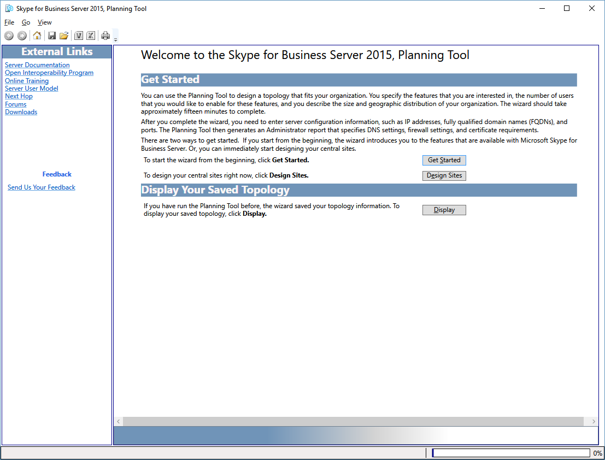

# Naviguer dans l’outil de planification Skype Entreprise Server 2015

Vous naviguez dans Skype Entreprise Server Outil de planification 2015 à l’aide d’une barre d’outils, de boutons et de liens spécifiques à une page, et de volets spécifiques au contexte. Les volets spécifiques au contexte fournissent des informations de conception pour la planification et la capacité qui sont pertinentes pour les options de sélection sur une page spécifique.

Au démarrage de l’outil de planification, un concepteur voit d’abord la page Bienvenue dans l’outil de planification **Skype Entreprise Server 2015.**

Sur la page d’accueil, le concepteur choisit **Prise en main**, Concevoir **des sites** ou **Afficher**. Pour plus d’informations, voir [Create the initial topology design for Skype Entreprise Server 2015](create-the-initial-design.md).

En haut de l’outil de planification se trouve une barre d’outils qui permet d’accéder facilement aux fonctions fréquemment utilisées. La barre d’outils s’affiche ici pour référence et chaque fonction sera abordée dans des rubriques connexes.

L’outil de planification dispose d’une section Liens externes sur le côté gauche de l’outil. À partir de cette section, le concepteur peut accéder facilement aux informations de planification et de déploiement et à d’autres ressources techniques, telles que des formations, des blogs techniques, des forums et d’autres ressources téléchargeables. La section Liens externes contient également un lien commentaires vers l’équipe Skype Entreprise Server 2015 Planning Tool.

Un volet Actions context sociaux est affiché sur de nombreuses pages de l’outil de planification. Le volet Actions permet au concepteur d’accéder facilement aux principales sections de la topologie. Les liens disponibles dans le volet Actions changent en fonction du niveau de détail dans votre topologie. Le volet Actions est disponible une fois que vous avez répondu aux questions de l’entretien et affiché votre topologie. La section Vue d’ensemble, qui affiche les numéros que le concepteur a entrés dans le cadre du processus d’entretien, est incluse dans le volet Actions. La vue d’ensemble correspond au contexte des informations affichées.

En outre, des informations de matériel sont affichées dans la vue d’ensemble sous le volet Actions. La configuration matérielle indique le matériel que la topologie actuelle recommande.

## Voir aussi

[Créer la conception de topologie initiale pour Skype Entreprise Server 2015](create-the-initial-design.md)

[Modification de la conception](/previous-versions/office/lync-server-2013/lync-server-2013-editing-the-design)

[Consultation des rapports de l’administrateur](/previous-versions/office/lync-server-2013/lync-server-2013-reviewing-the-administrator-reports)