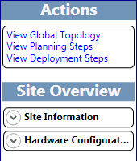

# Accéder à l’outil de planification dans Skype Entreprise Server 2015
 
Vous accédez le Skype pour outil de planification de 2015 Business Server à l’aide d’une combinaison d’une barre d’outils, les boutons spécifiques à la page des liens et des volets de spécifique au contexte. Les volets contextuels fournissent des informations conceptuelles sur la planification et la capacité appropriées pour les options de sélection sur une page spécifique.
  
Lors du démarrage de l’outil de planification, un concepteur voit tout d’abord la page **Bienvenue dans l’outil de planification pour Skype pour Business Server 2015** .
  

  
Dans la page d’accueil, le concepteur choisit entre **Prise en main**, **Concevoir des sites** ou **Afficher**. Pour plus d’informations, voir [créer la conception de la topologie initiale de Skype pour Business Server 2015](create-the-initial-design.md).
  
En haut de l’outil de planification est une barre d’outils qui permet d’accéder aux fonctions les plus utilisées. La barre d’outils est affichée ici à titre de référence, et chaque fonction sera abordée dans Rubriques connexes.
  

  
L’outil de planification a une section liens externes sur le côté gauche de l’outil. À partir de cette section, le concepteur peut accéder facilement aux informations de planification et de déploiement et à d’autres ressources techniques, telles que des formations, des blogs techniques, des forums et d’autres ressources téléchargeables. Dans les liens externes section est également un lien de retour vers le Skype pour l’équipe de l’outil de planification Microsoft Business Server 2015.
  

  
Un volet d’Actions contextuel s’affiche sur plusieurs pages dans l’outil de planification. Grâce au volet Actions, le concepteur peut accéder facilement aux principales sections de la topologie. Les liens disponibles dans le volet Actions changent en fonction du niveau de détail de la topologie. Le volet Actions est disponible une fois que vous avez répondu aux questions initiales et affiché la topologie. Le volet Actions comporte une section de vue d’ensemble, qui affiche les chiffres que le concepteur a indiqués en réponse aux questions initiales. La vue d’ensemble correspond au contexte des informations affichées.
  
En outre, des informations de matériel sont affichées dans la vue d’ensemble sous le volet Actions. La configuration matérielle indique le matériel que la topologie actuelle recommande.
  

  
## Voir aussi

#### 

[Créer la conception de la topologie initiale pour Skype pour Business Server 2015](create-the-initial-design.md)
#### 

[Modification de la conception](http://technet.microsoft.com/library/08f639ba-0e5f-4ae7-9191-c3d96c25b169.aspx)
  
[Examiner les rapports de l’administrateur](http://technet.microsoft.com/library/1dee56a9-a033-4201-9765-e3469bd7d3e3.aspx)

