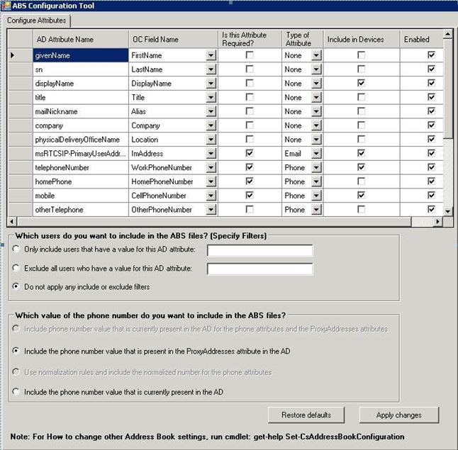
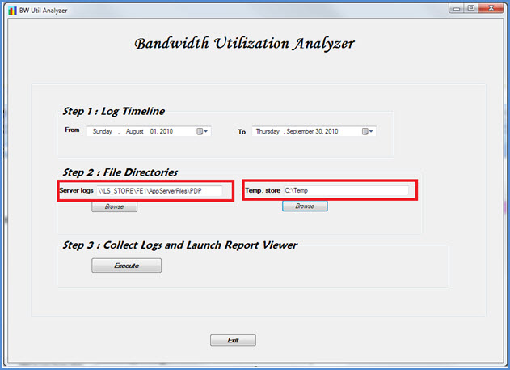
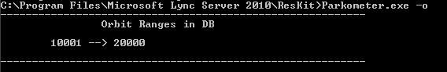
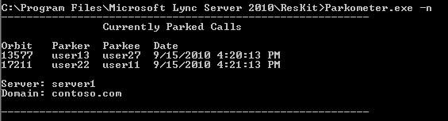
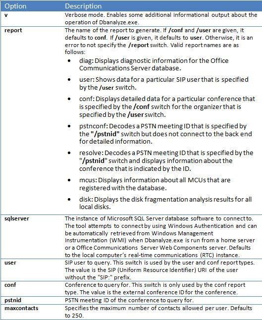
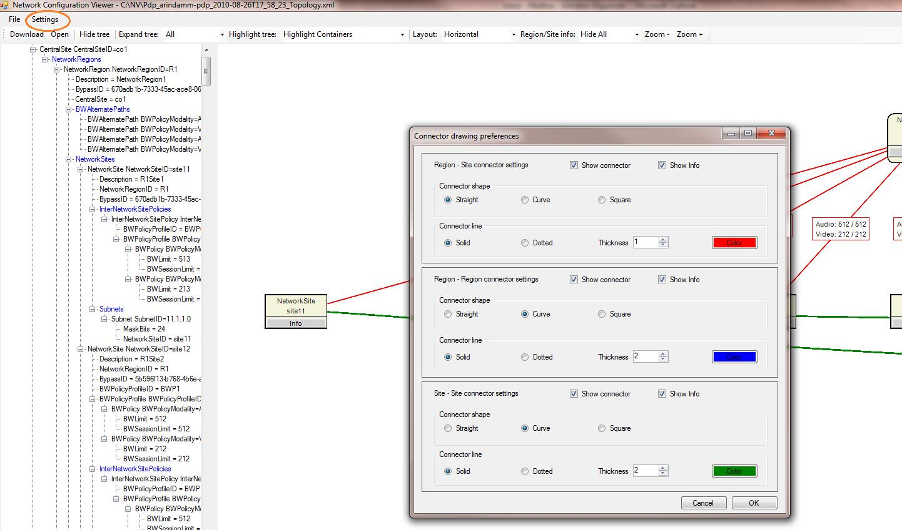
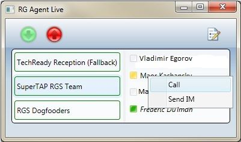

# <a name="skype-for-business-server-2015-resource-kit-tools-documentation"></a>documentation Skype Entreprise Server kit de ressources 2015

Cet article décrit les outils du Kit de ressources Skype Entreprise Server 2015, y compris l’objectif de chaque outil et des exemples de son utilisation. Le kit de ressources Skype Entreprise Server 2015 facilite les tâches de routine pour les administrateurs informatiques qui déploient et gèrent Skype Entreprise Server 2015. Par exemple, **l’outil Web Conf Data** permet de contrôler facilement les données téléchargées par les utilisateurs au cours d’une réunion en ligne. **L’outil SEFAUtil** peut être utilisé pour configurer le forwarding d’appel délégué et le répondage pour les utilisateurs. Nous encourageons les administrateurs informatiques à utiliser ces outils pour gérer plus efficacement Skype Entreprise Server 2015.

## <a name="installation-of-the-resource-kit-tools"></a>Installation des outils du Kit de ressources

Pour installer le Kit de ressources Skype Entreprise Server 2015, téléchargez [OCSReskit.msi](https://www.microsoft.com/download/details.aspx?id=52631) à partir du Centre de téléchargement.

Exécutez **OCSResKit.msi** pour une installation simple. Le .msi installe tous les outils dans le chemin d’accès suivant : **%Program Files%\Skype Entreprise Server 2015\ResKit**. Ce dossier contient des outils exécutables autonomes. Les outils qui ont également des fichiers de prise en charge se font dans leurs propres sous-dossiers.

## <a name="supported-environments"></a>Environnements pris en charge

Le Kit de ressources Skype Entreprise Server 2015 doit être installé sur un serveur qui répond aux spécifications requises pour Skype Entreprise Server 2015, généralement utilisé pour exécuter Skype Entreprise Server 2015.

## <a name="resource-kit-tools-overview"></a>Vue d’ensemble des outils du Kit de ressources

Voici une liste des outils fournis dans le Kit de ressources Skype Entreprise Server 2015. Une description de chaque outil, y compris les conditions requises et l’exemple d’utilisation, est détaillée dans les sections suivantes.

- [ABSConfig](resource-kit-tools.md#ABSConfig)

- [Bandwidth Policy Service Monitor](resource-kit-tools.md#bpsm)

- [Bandwidth Utilization Analyzer](resource-kit-tools.md#bua)

- [Call Parkometer](resource-kit-tools.md#callpark)

- [DBAnalyze](resource-kit-tools.md#dba)

- [Importer des Stockage service d’importation](resource-kit-tools.md#Issd)

- [LCSSync](resource-kit-tools.md#LCSSync)

- [Console utilisateur de recherche](resource-kit-tools.md#LUC)

- [MsTurnPing](resource-kit-tools.md#MsTurnPing)

- [Visionneuse de configuration réseau](resource-kit-tools.md#NCV)

- [Response Group Agent Live](resource-kit-tools.md#RGAL)

- [SEFAUtil](resource-kit-tools.md#SEFAUtil)

- [SYSPrep.ps1](resource-kit-tools.md#SYSPrep)

- [Migration des annonces de numéro non signé](resource-kit-tools.md#UNAM)

- [Web Conf Data](resource-kit-tools.md#WebConfData)

## <a name="absconfig"></a>ABSConfig
<a name="ABSConfig"> </a>

L’outil de configuration du service de carnet d’adresses (ABSConfig) est un outil d’administration qui permet aux administrateurs de personnaliser la configuration du service de carnet d’adresses dans Skype Entreprise Server 2015. Cet outil permet également aux administrateurs Skype Entreprise Server 2015 de restaurer les paramètres du service de carnet d’adresses par défaut.

### <a name="description"></a>Description

ABSConfig est une application d’interface utilisateur graphique qui permet aux administrateurs de configurer les attributs des services de domaine Active Directory liés au service de carnet d’adresses.

Les principaux scénarios de l’outil sont les suivants :

- Pour permettre aux administrateurs de ma cartographier les attributs des services de domaine Active Directory aux attributs de Skype Entreprise Server 2015.

- Pour permettre aux administrateurs de spécifier l’attribut Services de domaine Active Directory à inclure ou à exclure dans les fichiers du service de carnet d’adresses.

- Pour permettre aux administrateurs de restaurer, paramètres par défaut du service de carnet d’adresses.

L’outil ABSConfig peut être démarré à l’aide ABSConfig.exe fichier. L’outil s’ouvre dans **l’onglet Configurer les attributs.** Ce tableau dispose d’options pour ma cartographier les attributs des services de domaine Active Directory sur les champs d’attribut pour Skype Entreprise Server 2015 et pour spécifier les utilisateurs à inclure ou à exclure dans les fichiers du service de carnet d’adresses en fonction de filtres d’attributs spécifiques. Il dispose également d’options pour personnaliser la valeur du numéro de téléphone à inclure dans le fichier de carnet d’adresses. **L’option Restaurer les valeurs par** défaut permet aux administrateurs de restaurer les valeurs par défaut des paramètres du service de carnet d’adresses.

> [!NOTE]
> Le ré-mappage des attributs AD à différents noms de champs OC fonctionne uniquement pour le téléchargement de fichier de carnet d’adresses et n’est pas pris en charge par la requête web du carnet d’adresses.

### <a name="output"></a>Sortie

ABSConfig stocke la configuration du service de carnet d’adresses dans la base de données.

```console
Path: %ProgramFiles%\Skype for Business Server 2015\Reskit
```

### <a name="purpose"></a>Objectif

ABSConfig offre un moyen rapide et facile de personnaliser Skype Entreprise Server service de carnet d’adresses 2015.

### <a name="requirements"></a>Conditions requises

#### <a name="computer"></a>Ordinateur*

ABSConfig ne peut être exécuté qu’à partir d’un ordinateur joint à un domaine sur Skype Entreprise Server 2015. Dans le cas de Skype Entreprise Server 2015, Êdition Entreprise, cet outil peut être exécuté sur n’importe quel serveur Front-End dont le service de carnet d’adresses est activé lors de l’installation.

#### <a name="network"></a>Réseau

L’ordinateur doit pouvoir se connecter au pool Front-End base de données principale.

#### <a name="software"></a>Logiciels

Les composants logiciels suivants doivent être installés avant d’utiliser l’outil ABSConfig :

- Skype Entreprise Server 2015

#### <a name="users"></a>Utilisateurs

Administrateurs qui ont les autorisations requises pour mettre à jour Skype Entreprise Server déploiement 2015.

### <a name="examples"></a>Exemples

ABSConfig peut être démarré en tapantABSConfig.exe **à** une invite de commandes. L’interface utilisateur de l’outil ABSConfig est présentée ci-dessous.



### <a name="summary"></a>Résumé

L’outil ABSConfig fournit aux administrateurs un outil rapide et facile à utiliser pour personnaliser Skype Entreprise Server service de carnet d’adresses 2015.

## <a name="bandwidth-policy-service-monitor"></a>Bandwidth Policy Service Monitor
<a name="bpsm"> </a>

L’outil Bandwidth Policy Service Monitor est conçu pour permettre aux administrateurs d’afficher la liste des suivants :

1. Tous les services de stratégie de Skype Entreprise Server 2015 configurés (Authentification et base) dans la topologie

2. Les connexions que chaque service effectue à d’autres services de stratégie de bande passante et aux serveurs Edge

3. Tous les liens configurés dans le document de configuration réseau et l’utilisation de la bande passante en temps réel, comme indiqué par chacun des services de stratégie de bande passante

### <a name="description"></a>Description

L’outil Bandwidth Policy Service Monitor est implémenté en tant qu’application gui. Les administrateurs démarrent l’outil en exécutant PDPMonUI.exe.

Lorsque l’outil démarre, il tente de découvrir la liste des services de stratégie de bande passante dans la topologie. Une fois la mise à jour initiale effectuée, le volet à gauche de la fenêtre est rempli avec une liste de services regroupés par les clusters à qui ils appartiennent.

Lorsque les administrateurs sélectionnent un service de stratégie de bande passante particulier, le volet de droite affiche les informations sur ce service particulier. Ce volet comprend également deux onglets principaux qui affichent des informations.

#### <a name="machine-info-tab"></a>Onglet Infos sur l’ordinateur

**L’onglet** Informations sur l’ordinateur affiche les détails du service de stratégie de bande passante sélectionné, ainsi que la liste et l’état de toutes les connexions qui sont réalisées par le service de stratégie de bande passante sélectionné à d’autres services.

#### <a name="topology-info-tab"></a>Onglet Informations sur la topologie

**L’onglet Informations sur** la topologie affiche la liste de tous les liens configurés dans les paramètres de configuration réseau. Pour chaque lien, la capacité de bande passante audio et vidéo s’affiche. En outre, la bande passante actuellement utilisée s’affiche, à la fois en Kbits/s et en pourcentage de la capacité. L’outil utilise le codage de couleurs pour mettre en évidence les liens dont l’utilisation est proche de la capacité, ce qui permet aux administrateurs d’isoler rapidement ces liens.

> [!NOTE]
>  Si l’outil Bandwidth Policy Service Monitor subit une défaillance lorsqu’il se connecte à  l’un des services de stratégie de bande passante configurés, les informations des onglets Informations sur l’ordinateur et Informations sur la topologie ne sont pas remplies.  Toutefois, il est possible que l’outil se connecte initialement, mais par la suite perd sa connexion au service. Dans ce cas, les administrateurs peuvent voir des informations obsolètes. Il existe **un** horodat de dernière mise à jour sur chacun des onglets qui permet aux administrateurs de voir quand les données ont été mises à jour pour la dernière fois pour un service de stratégie de bande passante particulier.

### <a name="output"></a>Sortie

Il n’y a pas de sortie de ligne de commande ; la sortie du programme est contenue dans l’interface utilisateur graphique principale.

### <a name="purpose"></a>Objectif

L’objectif de l’outil Bandwidth Policy Service Monitor est de permettre aux administrateurs de voir l’état de chacun des services de stratégie de bande passante définis dans la topologie. En outre, les administrateurs peuvent voir l’utilisation de la bande passante en temps réel pour tous les liens définis dans le document de configuration du réseau.

### <a name="requirements"></a>Conditions requises

L’outil Bandwidth Policy Service Monitor doit être exécuté sur un ordinateur qui fait partie de la topologie Skype Entreprise Server bande passante.

### <a name="summary"></a>Résumé

L’outil Bandwidth Policy Service Monitor peut être une ressource précieuse pour les administrateurs afin qu’ils peuvent inspecter l’état de tous les services de stratégie de bande passante dans la topologie, et plus important encore, ils peuvent obtenir l’utilisation de la bande passante en temps réel pour les liens définis dans les paramètres de configuration réseau.

## <a name="bandwidth-utilization-analyzer"></a>Bandwidth Utilization Analyzer
<a name="bua"> </a>

Bandwidth Utilization Analyzer est un outil qui crée des rapports sur différents affichages de la consommation de bande passante par les points de terminaison UC sur les liaisons WAN du réseau d’entreprise. Ces rapports peuvent être utilisés pour comprendre le modèle actuel de consommation de bande passante et pour faciliter la planification de la capacité de la bande passante.

### <a name="description"></a>Description

Bandwidth Utilization Analyzer est implémenté en tant qu’application graphique. Cet outil génère des rapports spécifiques à l’utilisation audio sur le réseau et facilite la planification de la capacité. Il itérera également sur la capacité de bande passante affectée à différents liens.

### <a name="output"></a>Sortie

Bandwidth Utilization Analyzer fournit des graphiques de la capacité et de l’utilisation de la bande passante pour l’audio pour toutes les liaisons wan qui sont configurées dans le système.

### <a name="purpose"></a>Objectif

Dans tout déploiement vocal et vidéo, il est essentiel de surveiller et de comprendre la tendance de l’utilisation de la bande passante du trafic multimédia sur le réseau d’entreprise. L’outil Bandwidth Utilization Analyzer permet à un administrateur d’y parvenir. Cet outil permet d’utiliser les outils suivants :

- Génère des rapports spécifiques pour l’utilisation audio sur le réseau

- Permet une planification et une itération plus efficaces de la capacité de bande passante affectée à différents liens

Bandwidth Utilization Analyzer peut générer des graphiques de graphiques de rapports de capacité et d’utilisation de la bande passante . Elles sont les suivantes :

- Toutes les liaisons wan dans le réseau d’entreprise

- Filtrée par les liaisons wan sélectionnées qui ont été choisies

- Filtrés par des liaisons wan qui ont dépassé la capacité de liaison

- Filtrés par des liaisons de réseau wan qui n’ont pas assez utilisée la bande passante mise en service

- Filtrage des liaisons de réseau wan qui ont atteint des niveaux critiques (utilisation de la bande passante supérieure à 90 % de la capacité de bande passante de la liaison de réseau wan wan)

- Filtrée par type de liaison WAN (liaisons réseau-site, liaisons interrégion et liaisons au sein d’un site)

- Filtré par région réseau

#### <a name="applications"></a>Applications

Bandwidth Utilization Analyzer dispose des deux applications suivantes (outils) :

- **WanLinkLogCollector.exe** Cet outil permet à son utilisateur d’entrer les informations requises.

- **BandwidthUtilizationAnalyzer.xlsm** A Microsoft Excel spreadsheet software report is automatically launched by WanLinkLogCollector.exe. Cette application permet à l’utilisateur d’appliquer des filtres au rapport, comme indiqué plus loin dans cet article.

#### <a name="phases-of-using-bandwidth-utilization-analyzer"></a>Phases d’utilisation de Bandwidth Utilization Analyzer

Il existe deux phases lors de l’utilisation de Bandwidth Utilization Analyzer :

- Collecter les journaux, qui sont effectués à l’aide de WanLinkLogCollector.exe

- Personnaliser les rapports, qui sont effectués à l’aide de BandwidthUtilizationAnalyzer.xlsm

    > [!IMPORTANT]
    > Nous recommandons vivement que BandwidthUtilizationAnalyzer.xlsm ne soit pas lancé manuellement par les utilisateurs finaux.

#### <a name="starting-bandwidth-utilization-analyzer"></a>Démarrage de Bandwidth Utilization Analyzer

Démarrez WanLinkLogCollector.exe à l’invite de commandes ou à l’aide Windows Explorer.

 **Utilisation de WanLinkLogCollector.exe**

L’utilisation de la WanLinkLogCollector.exe se fait en trois étapes :

1. **Journal de la chronologie** Fournir la chronologie pour la générée du rapport

2. **Spécifier les répertoires de fichiers** Fournir des informations sur l’emplacement du fichier

3. **Collecter les journaux et lancer la visionneuse de rapports** Exécuter la commande pour générer le rapport

#### <a name="step-1---log-the-timeline"></a>Étape 1 : journal de la chronologie

La journalisation de la chronologie permet à l’utilisateur de l’outil de spécifier les informations suivantes, comme illustré dans la figure ci-dessous.

1. **Date de début** Il s’agit de la date de début de la chronologie pour laquelle le rapport doit être généré ; par exemple, 1er août 2010.

2. **Date de fin** Il s’agit de la date de fin de la chronologie pour laquelle le rapport doit être généré ; par exemple, 30 septembre 2010.

     

#### <a name="step-2---specify-the-file-directories"></a>Étape 2 : spécifier les répertoires de fichiers

Les répertoires de fichiers suivants peuvent être spécifiés par l’utilisateur comme indiqué.

- **Emplacement des fichiers journaux du serveur** Emplacement du dossier où sont stockés les journaux du serveur de stratégie de bande passante. Il s’agit \<fileserver\> \\ généralement<choix de FE \> \AppServerFiles\PDP.

- **Emplacement de stockage de fichiers temporaire** Emplacement de fichier temporaire dans lequel les fichiers intermédiaires sont stockés pendant que le rapport est généré.

    

    > [!NOTE]
    > Assurez-vous qu’un accès suffisant aux journaux du serveur et au dossier du magasin de fichiers temporaire est fourni à l’utilisateur de l’outil.

#### <a name="step-3---collect-the-logs-and-start-the-report-viewer"></a>Étape 3 : collecter les journaux et démarrer la visionneuse de rapports

Pour collecter les journaux et démarrer la visionneuse de rapports, cliquez sur **Exécuter** comme illustré ci-dessous. Cette étape collecte les données requises.


Lorsque la validation d’entrée réussit, le message ci-dessous s’affiche.


Cliquez sur **OK**. BandwidthUtilizationAnalyzer.xlsm est démarré automatiquement. Suivez les instructions de la boîte de message. Pour plus d’informations, voir **Utilisation de BandwidthUtilizationAnalyzer.xlsm** dans la section suivante.


### <a name="using-bandwidthutilizationanalyzerxlsm"></a>Utilisation de BandwidthUtilizationAnalyzer.xlsm

1. Lorsque BandwidthUtilizationAnalyzer.xlsm est démarré automatiquement, cliquez sur **Actualiser** comme illustré ci-dessous.

     

2. Lorsqu’un dossier de fichiers est ouvert, sélectionnez consolidated.csv l’emplacement spécifié dans la zone de message, comme illustré ci-dessous. Il indique également l’emplacement **en tant que C:\Temp**.

     

3. Cliquez sur **Importer**.

4. Le traçage graphique est généré automatiquement. Elle est disponible lorsque le pointeur de travail en arrière-plan disparaît.

     

#### <a name="applying-filters-to-the-report-view"></a>Application de filtres à l’affichage De rapport

Les filtres qui peuvent être appliqués à l’affichage du rapport comme indiqué ci-dessous sont décrits comme suit :


1. **Nom** Filtrer par liaisons wan (le filtre se trouve sur le côté droit du graphique). Le préfixe indique les types de liens suivants . voir la zone verticale (bleue) :

   - **Site S** Liaison de réseau wan à partir d’un site réseau vers une région réseau

   - **IS Intersess** Liaison de réseau wan entre deux sites réseau

   - **R Inter-région** Liaison de réseau wan entre deux régions réseau

2. **Limite dépassée** Filtrer par liaisons WAN dont l’utilisation de la bande passante est plus importante que la capacité de bande passante

3. **Niveaux critiques** Filtrage des liaisons WAN dont l’utilisation de la bande passante a atteint 90 % ou plus que la capacité de bande passante

4. **Sous-utilisé** Filtrage par liaisons wan wan dont l’utilisation de la bande passante a été inférieure à 25 % de la capacité de bande passante

5. **Type de lien** Filtrez selon les types de liaisons WAN suivants :

   - **Type de site** réseau

   - **Type inters site**

   - **Type de liaison inter-région**

6. **Région** Filtrer par région réseau

Les figures suivantes montrent les filtres décrits précédemment.

Filtrer par **nom.** Sélectionnez la liste des liens qui doivent être affichés dans le graphique.


Filtrer **par limite dépassée**. Sélectionnez **True** pour appliquer le filtre.


Filtrer par **niveaux critiques.** Sélectionnez **True** pour appliquer le filtre.


Filtrer **par Sous utilisé.** Sélectionnez **True** pour appliquer le filtre.


Filtrer par **type de lien.** Sélectionnez le ou les types à afficher.


Filtrer par **région.** Sélectionnez une liste des régions dont les liens doivent être affichés.


### <a name="requirements"></a>Conditions requises

- Le .NET Framework 3.5

- Microsoft Excel 2010 ou Excel 2007

### <a name="summary"></a>Résumé

Bandwidth Utilization Analyzer est utilisé pour tracer l’utilisation de la bande passante audio pour le trafic UC sur le réseau. Cet outil peut également être utilisé pour signaler l’utilisation de la bande passante vidéo sur le réseau.

## <a name="call-parkometer"></a>Call Parkometer
<a name="callpark"> </a>

Call Parkometer est une application de ligne de commande qui permet d’accéder facilement à la base de données des orbites de parcage d’appel.

### <a name="description"></a>Description

L’outil Parcomètre des appels permet de suivre les appels actuellement par parcés. Il collecte également des statistiques sur les orbites et l’utilisation du serveur de parc d’appel (CPS). Cet outil en ligne de commande fournit à la fois un accès en lecture et en écriture à la base de données de SQL Server d’orbites CPS à partir d’un ordinateur connecté localement ou à distance.

Toutes les options s’excluent mutuellement. La syntaxe de ligne de commande est la suivante :

- **Paramètre -o** : répertorie toutes les plages d’orbites configurées pour ce pool.

- **Paramètre -n** : répertorie toutes les orbites actuellement utilisées dans ce pool. Les informations affichées sont les suivantes :

  - URI (Uniform Resource Identifier) SIP de la personne à parcer et du parc.

  - Nom d’hôte du cps où l’appel est paré.

  - Horodaodaté du moment où l’appel a été paré.

- **Paramètre -f** : répertorie le nombre d’orbites actuellement libres dans le pool.

- **-r \<n\>** : répertorie \<n\> les derniers appels par parcés. Les informations affichées sont les suivantes :

  - URI SIP parkee.

  - URI SIP dePér.

  - Nom d’hôte du cps où l’appel a été paré.

  - Horodaté de la récupération ou de l’abandon de l’appel.

- **-t \<n\>** - teste la réservation d’une orbite dans la base de données pour afficher le caractère aléatoire des numéros d’orbite affectés.

### <a name="output"></a>Sortie

Selon les paramètres d’entrée spécifiés à l’invite de commandes, le parcomètre d’appel affiche la sortie suivante :

- Toutes les plages d’orbites configurées pour ce pool

- Appels actuellement par parcés

- Nombre d’orbites libres (disponibles)

- Appels par parcés récemment

- Orbites réservées pour tester les valeurs d’orbite uniformes et aléatoires

### <a name="purpose"></a>Objectif

L’objectif de l’outil CPS est de fournir un accès en ligne de commande à la base de données CPS. L’administrateur peut afficher l’utilisation de CPS et déterminer le nombre d’orbites affectées à un pool.

### <a name="requirements"></a>Conditions requises

Il n’existe aucune exigence si cet outil est exécuté sur le même ordinateur que celui qui exécute cps. Si cet outil est exécuté sur un ordinateur distant, la base de données SQL Server utilisée par Skype Entreprise Server 2015 doit être configurée pour autoriser l’accès à distance. Le parcomètre d’appel doit être configuré avec une chaîne SQL Server de connexion de base de données pour se connecter au pool SQL Server. Cette SQL Server de connexion de base de données est définie dans le fichier de configuration, **parkometer.exe.config**. Elle doit être placée dans le même répertoire que celui parkometer.exe se trouve. Le fichier XML suivant est un exemple d'parkometer.exe.config. Les paramètres qui doivent être configurés sont le nom d’utilisateur (par exemple, mydomain\Administrator), le mot de passe (par exemple, mypassword) et le nom d’hôte (par exemple, myserver).

```xml
<?xml version="1.0" encoding="utf-8" ?>
<configuration>
  <appSettings>
   <add key="SQL" value="server=myserver\RTC;
database=cpsdyn;
User Id=mydomain\Administrator;
Password=mypassword.;
Integrated Security=false;"/>
  </appSettings>
</configuration>
```

### <a name="examples"></a>Exemples

Plages d’orbites déployées : le paramètre -o répertorie toutes les plages d’orbites configurées pour ce pool, comme illustré



Appels actuellement par parcés : le paramètre -n répertorie toutes les orbites actuellement utilisées sur ce pool, comme illustré



Nombre d’orbites libres : le paramètre -f répertorie le nombre d’orbites actuellement libres dans le pool, comme illustré


Appels par parcés récemment : le paramètre -r répertorie les derniers appels par \<n\> \<n\> parcés, comme illustré


Réservation d’orbite de test : le paramètre -t teste la réservation d’une orbite dans la base \<n\> de données, comme illustré


### <a name="summary"></a>Résumé

L’outil de ligne de commande Call Parkometer fournit des informations détaillées sur le serveur de parclage d’appel.

## <a name="dbanalyze"></a>DBAnalyze
<a name="dba"> </a>

### <a name="description"></a>Description

DBAnalyze est un outil en ligne de commande qui permet aux administrateurs de collecter des rapports d’analyse sur Skype Entreprise Server bases de données 2015. DBAnalyze dispose des modes suivants : diagnostic, données utilisateur, conférence, MUS et fragmentation de disque :

- **Mode diagnostic** Crée un rapport qui inclut des informations sur les tables (nombre d’enregistrements, fragmentation, taille des données et taille d’index), les tailles de fichiers de données et de journaux, la dernière durée de stockage, la distribution des contacts entre les serveurs exécutant Microsoft Office Communications Server, le nombre moyen d’autorisations, de contacts, de conteneurs, d’abonnements, de publications, de points de terminaison par utilisateur, les utilisateurs mal dosés, les utilisateurs qui ne peuvent pas être acheminés,  le nombre moyen de conférences organisées par utilisateur, les conférences programmées, les conférences actives et la version de la base de données.

    > [!NOTE]
    > L’exécution du mode de diagnostic peut affecter les performances du serveur.

- **Mode de données utilisateur** Signale les données de contact, de conteneur, d’abonnement, de publication, d’autorisation et de groupe de contacts pour un utilisateur spécifié ou pour les utilisateurs qui ont cet utilisateur dans leurs listes de contacts et d’autorisations. Ce mode signale également des données récapitulatifs pour les conférences qu’un utilisateur organise ou à qui il est invité.

- **Mode conférence** Rapporte des données détaillées pour une conférence spécifique, notamment tous les détails de l’heure de planification de la conférence, la liste des invités, la liste des types de médias autorisés pour la conférence, les unités de contrôle multipoint actives, la liste des participants actifs et l’état de signalisation de chaque participant.

- **Décoder l’ID de réunion** Décode un ID de réunion PSTN (réseau téléphonique commuté) spécifié par le commutateur **/pstnid,** mais qui ne se connecte pas au système d’extrémité arrière pour obtenir des informations détaillées.

- **Résoudre une conférence** Décode un ID de réunion PSTN spécifié par le commutateur **/pstnid** et affiche des informations sur la conférence indiquée par l’ID.

- **Mode mcus** Signale l’ID, le type de média, l’URL, l’état de pulsation, la charge de conférence et la charge des participants pour chaque MCU du pool.

- **Mode fragmentation du disque** Affiche l’état de fragmentation de tous les disques.

Cet outil peut être utilisé pour diagnostiquer différents problèmes ou pour aider les administrateurs à planifier la capacité. Par exemple, si la plupart des utilisateurs sur le serveur A choisissent des utilisateurs sur le serveur B comme contacts, l’administrateur peut déplacer les utilisateurs du serveur A vers le serveur B pour réduire le trafic entre les serveurs.

### <a name="output"></a>Sortie

Cet outil produit des rapports prédéfincis sur Skype Entreprise Server base de données 2015. **Chemin** d’accès : %ProgramFiles%\Skype Entreprise Server 2015\Reskit

### <a name="purpose"></a>Objectif

Pour installer Dbanalyze.exe, copiez-le dans un dossier local, puis exécutez l’outil. Pour utiliser l’outil, exécutez la commande suivante à partir de la ligne de commande. `dbanalyze.exe [/v] [/report:value] [/sqlserver:value] [/user:user@domain.com] [/conf:value][/pstnid:Value] [/maxcontacts:value]` Les descriptions des options de ligne de commande sont indiquées ci-dessous.



### <a name="requirements"></a>Conditions requises

 **Ordinateur** DBAnalyze ne peut être exécuté qu’à partir d’un ordinateur joint à un domaine sur Skype Entreprise Server 2015.

 **Réseau** L’ordinateur doit pouvoir se connecter à la base de données principale.

 **Les** Skype Entreprise Server logiciels 2015 doivent être installés avant d’être en cours d’exécution de DBAnalyze.

 **Utilisateurs** Le tableau ci-dessous indique les administrateurs qui ont les autorisations nécessaires pour accéder Skype Entreprise Server bases de données 2015.


> [!NOTE]
> Un compte d’administrateur local est requis pour le mode **/report:disk.**

### <a name="examples"></a>Exemples

Voici des exemples de commandes Dbanalyze.exe valides :

```console
dbanalyze.exe /report:diag
dbanalyze.exe /report:user /user:usera@domainb.com
dbanalyze.exe /report:conf /user:bob@example.com /conf:1W9J71SKSX2X
dbanalyze.exe /report:resolve /pstnid:12345
dbanalyze.exe /report:mcus
dbanalyze.exe /report:disk
```

### <a name="summary"></a>Résumé

DBAnalyzer fournit aux administrateurs une analyse rapide et facile Skype Entreprise Server bases de données 2015.

## <a name="import-storage-service-data"></a>Importer des Stockage service de gestion
<a name="Issd"> </a>

L’outil kit de ressources ImportStorageServiceData permet de réimporter les données de file d’attente et de point de terminaison qui ont été vidées du service Stockage (LYSS) dans le service Stockage.

### <a name="description"></a>Description

Les données vidées du service Stockage service peuvent avoir été automatiques (périodiques) en fonction de l’état de l’élément de file d’attente ou de la taille de la base de données. Cela aurait pu se produire en raison de l’appel manuel de l’cmdlet deover du pool, ou de l’cmdlet StorageServiceFullFlush (que l’cmdlet de restauration automatique du pool appelle). Notez que, dans l’idéal, les données ne doivent pas être réimportées si l’une des tailles de base de données du service Stockage (LYSS) sur les bases de données frontales est supérieure au niveau normal, car cela risque d’entraîner la réexportation d’autres données. En outre, tous les problèmes qui auraient pu contribuer aux erreurs à l’origine de l’expansion de la file d’attente de service Stockage doivent d’abord être résolus Exchange (par exemple, des erreurs de point de terminaison, des problèmes réseau ou d’autres problèmes).

 **Scénario 1 : pendant** le pool deover, les fichiers peuvent être vidés du service de stockage pour chaque frontal. Une fois leoverage terminé, l’outil doit être exécuté pour réimporter les données.

 **Scénario 2** : les données sont vidées automatiquement chaque jour ou en réponse à un dépassement de certains seuils de taille par la base de données de service Stockage (par exemple, 60 %, 80 %, 90 % plein). Ces données automatiquement vidées doivent être réimportées régulièrement par l’administrateur. Dans la situation ci-dessus, si le pack SCOM de surveillance n’est pas déployé, il existe des événements pour Skype Entreprise Server Stockage Service relatifs à la purge des données du service Stockage. ID d’événement de 32075 (l’opération de purge complète est démarrée), 32076 (le purge complet est terminé), 32082 ( purge de niveau maintenance démarré), 32083 ( purge de niveau maintenance terminée), 32089 ( purge due au remplissage de la base de données). Notez que ces ID d’événement correspondent à la version RTM. Lorsqu’un administrateur voit ces événements, cela signifie qu’il existe des fichiers qui ont été vidés. Ces données doivent régulièrement être importées à l’aide de cet outil, par exemple une fois par semaine.

Pour la version de service en ligne, si le pack SCOM de surveillance de l’état d’Skype Entreprise Server est déployé, de nouvelles alertes peuvent être élevées, qui demandent à l’administrateur de réimporter les données vidées dans Stockage Service. Il y aura un événement correspondant dans le journal des événements sur le serveur Front-End qui a déclenché l’alerte. L’événement donne une description du chemin d’accès parent sous lequel se trouvent les fichiers de données vidés, ainsi que le nombre de fichiers qui répondent aux critères d’alerte. Le critère d’alerte est qu’il existe X ou plusieurs fichiers sous le chemin d’accès parent particulier qui ont au moins Y jours (où X et Y sont prédéfinis dans storageService mais peuvent être changés en modifiant le fichier APPCONFIG.) Deux exemples d’événements qui peuvent déclencher l’alerte d’état d’santé sont présentés ci-dessous, la différence étant leur chemin d’accès parent. Une possibilité se trouve sous le partage de fichiers de service Web, tandis que l’autre possibilité est le répertoire de données d’application local de chaque serveur frontal. (par exemple c:\ProgramData\Microsoft\Skype Entreprise Server 2015\StorageService). L’administrateur exécutera ensuite cet outil reskit.

Cet outil augmente la charge de l’UC et de l’UC sur le frontal sur laquelle il s’exécute, et d’autres frontux, dans la situation où les données ne sont pas la propriété du frontal sur laquelle l’outil est exécuté. Nous vous recommandons d’utiliser cet outil lorsque les extrémités frontales ne sont pas sous une charge élevée du processeur et des entrées/sorties, par exemple en dehors des heures de pointe. Deuxièmement, cet outil peut 2 à 3 minutes pour importer un fichier de données. Gardez cela à l’esprit lors de l’estimation de la durée d’exécution de l’outil. Le fichier journal détaillé généré par l’outil s’affiche par défaut dans le magasin de fichiers. Supprimez-le s’il n’y a aucune erreur signalée, car le fichier journal peut être de dizaines de Mo ou plus.


### <a name="requirements"></a>Conditions requises

Installez les outils Skype Entreprise Server Kit de ressources 2015. L’outil s’exécute sur les ordinateurs joints au domaine Skype Entreprise Server et Skype Entreprise Server Management Shell sont installés. L’outil utilise une cmdlet de l’shell de gestion pour identifier tous les serveurs Front-End du pool. Ensuite, l’outil doit être exécuté à partir d’un ordinateur du pool sur qui la base de données **RtcLocal** est installée. Cette base de données est utilisée par l’outil pour récupérer l’emplacement du partage de fichiers WEBSERVICE pour le pool. En outre, avant d’utiliser l’outil, chaque serveur Front-End doit d’abord activer la communication à Windows PowerShell à l’aide de **Enable-PSRemoting** sur chaque serveur Front-End et l’ordinateur à partir de l’ordinateur à partir de qui l’outil est exécuté. Sinon, les commandes Windows PowerShell distantes de cet outil échoueront. Windows PowerShell L’remoting peut être désactivé sur tous Front-End serveurs du pool une fois terminé. Enfin, le compte ou les informations d’identification qui invoment l’outil doivent avoir une autorisation en lecture/écriture sur le partage de fichiers du service web pour le pool sur qui ils exécutent cet outil. Dans le cas contraire, l’outil échouera avec des erreurs d’autorisation d’IO.

> [!NOTE]
> Sur Windows Server 2012, Windows PowerShell l’accès à la remoting est activé par défaut, mais pas sur le système d’exploitation Windows Server 2008.

### <a name="examples"></a>Exemples

```console
>  C:\StorageService>ImportStorageServiceData.exe
Description:
This tool will re-import Storage Service (LYSS) flushed queue data back in.  For a pool: you are required to run this tool on a machine inside the pool which has the Lync Server Management Shell installed.  Additionally, all front end machines need to have Windows Powershell Remoting enabled before executing this tool by executing Enable-PSRemoting.  Also, please ensure that all Storage Service instance DB Size are at the 'Normal' level (verify this by viewing Eventlog events). Otherwise re-importing may cause data to be flushed out again if any Storage Service instance DB size level goes above 'Normal'.
Usage: Default behavior is to Import data from web service file share as well as any files on all Front End machines in pool.
Additional Options:
-Verbose                    : Turn verbose output on.

-StorageServiceHostName     : Host Name of Storage Service WCF endpoint.  ( Default=localhost netnamedpipe binding. )

-FileSharePath              : Import only all data from just under the UNC path specified.

ActivityID: cc3b62ff-bb66-4e61-a6e2-96cb3626315c. <-- Use this to correlate with StorageService trace logs if troubleshooting.
Type Server name (TCP binding) or press <enter> for localhost (NamePipe binding):
Using NetNamedPipeBinding...
OnTopologyChanged Event received
Web Service File Share: \\dc.vdomain.com\OcsFileStore\co1-WebServices-1\StorageService

Front Ends:
server.vdomain.com
server2.vdomain.com
server1.vdomain.com
server3.vdomain.com
Looking under directory: \\dc.vdomain.com\OcsFileStore\co1-WebServices-1\StorageService for exported data.
# Files found: 8
Starting Import for file:\\dc.vdomain.com\OcsFileStore\co1-WebServices-1\StorageService\DataExport\2
0120910\SERVER.vdomain.com\944f5724c65c5f93900dc1c8c898b102__0.xml
Items deserialized: 20

All items in file were enqueued successfully, will try to delete file: \\dc.vdomain.com\OcsFileStore\co1-WebServices-1\StorageService\DataExport\20120910\SERVER.vdomain.com\944f5724c65c5f93900dc1c8c898b102__0.xml

All items in file failed to enqueue so file will not be deleted.  File path: \\dc.vdomain.com\OcsFileStore\co1-WebServices-1\StorageService\DataExport\20120910\SERVER.vdomain.com\944f5724c65c5f93900dc1c8c898b102__0.xml

Summary for file \\dc.vdomain.com\OcsFileStore\co1-WebServices-1\StorageService\DataExport\20120910\SERVER.vdomain.com\944f5724c65c5f93900dc1c8c898b102__0.xml: succeeded: 20, failed: 0

Starting Import for file:\\dc.vdomain.com\OcsFileStore\co1-WebServices-1\StorageService\DataExport\20120910\SERVER1.vdomain.com\17d5435ae40259f7bbdf1866776386e4__0.xml
Items deserialized: 20

[cc3b62ff-bb66-4e61-a6e2-96cb3626315c] Send EnqueueMessages to redirected, targetServer=server1.vdomain.com, queueItems=20

All items in file were enqueued successfully, will try to delete file: \\dc.vdomain.com\OcsFileStore\co1-WebServices-1\StorageService\DataExport\20120910\SERVER1.vdomain.com\17d5435ae40259f7bbdf1866776386e4__0.xml

All items in file failed to enqueue so file will not be deleted.  File path: \\dc.vdomain.com\OcsFileStore\co1-WebServices-1\StorageService\DataExport\20120910\SERVER1.vdomain.com\17d5435ae40259f7bbdf1866776386e4__0.xml

Summary for file \\dc.vdomain.com\OcsFileStore\co1-WebServices-1\StorageService\DataExport\20120910\
SERVER1.vdomain.com\17d5435ae40259f7bbdf1866776386e4__0.xml: succeeded: 20, failed: 0

Starting Import for file:\\dc.vdomain.com\OcsFileStore\co1-WebServices-1\StorageService\DataExport\20120910\SERVER1.vdomain.com\904f6c9b8ac951ae8b3c86684d3832e4__0.xml

Items deserialized: 20
[cc3b62ff-bb66-4e61-a6e2-96cb3626315c] Send EnqueueMessages to redirected, targetServer=server1.vdomain.com, queueItems=20

All items in file were enqueued successfully, will try to delete file: \\dc.vdomain.com\OcsFileStore
\co1-WebServices-1\StorageService\DataExport\20120910\SERVER1.vdomain.com\904f6c9b8ac951ae8b3c86684d
3832e4__0.xml

All items in file failed to enqueue so file will not be deleted.  File path: \\dc.vdomain.com\OcsFil
eStore\co1-WebServices-1\StorageService\DataExport\20120910\SERVER1.vdomain.com\904f6c9b8ac951ae8b3c
86684d3832e4__0.xml

Summary for file \\dc.vdomain.com\OcsFileStore\co1-WebServices-1\StorageService\DataExport\20120910\
SERVER1.vdomain.com\904f6c9b8ac951ae8b3c86684d3832e4__0.xml: succeeded: 20, failed: 0

Starting Import for file:\\dc.vdomain.com\OcsFileStore\co1-WebServices-1\StorageService\DataExport\2
0120910\SERVER2.vdomain.com\69844a271e6c5633a1f2b46a42287dd6__0.xml

Items deserialized: 20

[cc3b62ff-bb66-4e61-a6e2-96cb3626315c] Send EnqueueMessages to redirected, targetServer=server2.vdom
ain.com, queueItems=20

All items in file were enqueued successfully, will try to delete file: \\dc.vdomain.com\OcsFileStore
\co1-WebServices-1\StorageService\DataExport\20120910\SERVER2.vdomain.com\69844a271e6c5633a1f2b46a42
287dd6__0.xml

All items in file failed to enqueue so file will not be deleted.  File path: \\dc.vdomain.com\OcsFil
eStore\co1-WebServices-1\StorageService\DataExport\20120910\SERVER2.vdomain.com\69844a271e6c5633a1f2
b46a42287dd6__0.xml

Summary for file \\dc.vdomain.com\OcsFileStore\co1-WebServices-1\StorageService\DataExport\20120910\
SERVER2.vdomain.com\69844a271e6c5633a1f2b46a42287dd6__0.xml: succeeded: 20, failed: 0

Starting Import for file:\\dc.vdomain.com\OcsFileStore\co1-WebServices-1\StorageService\DataExport\2
0120910\SERVER3.vdomain.com\3313935458e35b9b9759e08a15d251e6__0.xml

Items deserialized: 20

[cc3b62ff-bb66-4e61-a6e2-96cb3626315c] Send EnqueueMessages to redirected, targetServer=server3.vdom
ain.com, queueItems=1

All items in file were enqueued successfully, will try to delete file: \\dc.vdomain.com\OcsFileStore
\co1-WebServices-1\StorageService\DataExport\20120910\SERVER3.vdomain.com\3313935458e35b9b9759e08a15
d251e6__0.xml

All items in file failed to enqueue so file will not be deleted.  File path: \\dc.vdomain.com\OcsFil
eStore\co1-WebServices-1\StorageService\DataExport\20120910\SERVER3.vdomain.com\3313935458e35b9b9759
e08a15d251e6__0.xml

Summary for file \\dc.vdomain.com\OcsFileStore\co1-WebServices-1\StorageService\DataExport\20120910\
SERVER3.vdomain.com\3313935458e35b9b9759e08a15d251e6__0.xml: succeeded: 20, failed: 0

Starting Import for file:\\dc.vdomain.com\OcsFileStore\co1-WebServices-1\StorageService\DataExport\2
0120910\SERVER3.vdomain.com\4501e04eae4856059346949ff817c220__0.xml
Items deserialized: 20
[cc3b62ff-bb66-4e61-a6e2-96cb3626315c] Send EnqueueMessages to redirected, targetServer=server3.vdom
ain.com, queueItems=1
All items in file were enqueued successfully, will try to delete file: \\dc.vdomain.com\OcsFileStore
\co1-WebServices-1\StorageService\DataExport\20120910\SERVER3.vdomain.com\4501e04eae4856059346949ff8
17c220__0.xml
All items in file failed to enqueue so file will not be deleted.  File path: \\dc.vdomain.com\OcsFil
eStore\co1-WebServices-1\StorageService\DataExport\20120910\SERVER3.vdomain.com\4501e04eae4856059346
949ff817c220__0.xml

Summary for file \\dc.vdomain.com\OcsFileStore\co1-WebServices-1\StorageService\DataExport\20120910\
SERVER3.vdomain.com\4501e04eae4856059346949ff817c220__0.xml: succeeded: 20, failed: 0
Starting Import for file:\\dc.vdomain.com\OcsFileStore\co1-WebServices-1\StorageService\DataExport\2
0120910\SERVER3.vdomain.com\5ad77443ad955a22a876749be66d5317__0.xml

Items deserialized: 20
[cc3b62ff-bb66-4e61-a6e2-96cb3626315c] Send EnqueueMessages to redirected, targetServer=server3.vdom
ain.com, queueItems=20
All items in file were enqueued successfully, will try to delete file: \\dc.vdomain.com\OcsFileStore
\co1-WebServices-1\StorageService\DataExport\20120910\SERVER3.vdomain.com\5ad77443ad955a22a876749be6
6d5317__0.xml
All items in file failed to enqueue so file will not be deleted.  File path: \\dc.vdomain.com\OcsFil
eStore\co1-WebServices-1\StorageService\DataExport\20120910\SERVER3.vdomain.com\5ad77443ad955a22a876
749be66d5317__0.xml
Summary for file \\dc.vdomain.com\OcsFileStore\co1-WebServices-1\StorageService\DataExport\20120910\
SERVER3.vdomain.com\5ad77443ad955a22a876749be66d5317__0.xml: succeeded: 20, failed: 0
Starting Import for file:\\dc.vdomain.com\OcsFileStore\co1-WebServices-1\StorageService\DataExport\2
0120910\SERVER3.vdomain.com\a11e27ae439a582288d4657eda86b565__0.xml
Items deserialized: 20
[cc3b62ff-bb66-4e61-a6e2-96cb3626315c] Send EnqueueMessages to redirected, targetServer=server3.vdom
ain.com, queueItems=20
All items in file were enqueued successfully, will try to delete file: \\dc.vdomain.com\OcsFileStore
\co1-WebServices-1\StorageService\DataExport\20120910\SERVER3.vdomain.com\a11e27ae439a582288d4657eda
86b565__0.xml
All items in file failed to enqueue so file will not be deleted.  File path: \\dc.vdomain.com\OcsFil
eStore\co1-WebServices-1\StorageService\DataExport\20120910\SERVER3.vdomain.com\a11e27ae439a582288d4
657eda86b565__0.xml
Summary for file \\dc.vdomain.com\OcsFileStore\co1-WebServices-1\StorageService\DataExport\20120910\
SERVER3.vdomain.com\a11e27ae439a582288d4657eda86b565__0.xml: succeeded: 20, failed: 0
All files have been imported into Storage Service for path: \\dc.vdomain.com\OcsFileStore\co1-WebSer
vices-1\StorageService
Importing files for: server.vdomain.com
No files founds.
Importing files for: server2.vdomain.com
No files founds.
Importing files for: server1.vdomain.com
No files founds.
Importing files for: server3.vdomain.com
No files founds.
Writing log: \\dc.vdomain.com\OcsFileStore\co1-WebServices-1\StorageService\ImportStorageServiceData
Log20120910_1609SS
Tool has finished execution.
>  C:\StorageService>
```

## <a name="lcssync"></a>LCSSync
<a name="LCSSync"> </a>

L’outil LCSSync permet de déployer Skype Entreprise Server 2015 dans un environnement à forêts multiples. Cet outil est utilisé pour synchroniser des utilisateurs et des groupes de différentes forêts d’utilisateurs en tant qu’objet contact des services de domaine Active Directory à une forêt centrale où Skype Entreprise Server 2015 est installé.

### <a name="description"></a>Description

 LCSSync utilise les objets contact des services de domaine Active Directory synchronisés dans la forêt centrale pour permettre aux utilisateurs de Skype Entreprise Server. Pour fournir une seule inscription, le compte d’utilisateur principal doit être mappé à l’objet contact des services de domaine Active Directory dans la forêt centrale pour Skype Entreprise Server 2015. Cet outil permet d’effectuer ce mappage. Cet outil fournit des modèles pour la création d’agents de gestion dans Microsoft Identity Integration Server.

### <a name="summary"></a>Résumé

L’outil LCSSync permet de déployer Skype Entreprise Server 2015 dans un environnement à forêts multiples.

## <a name="lookup-user-console"></a>Console utilisateur de recherche
<a name="LUC"> </a>

L’outil LookupUserConsole affiche les informations de routage Skype Entreprise Server utilisateurs spécifiques. Ces informations peuvent être utiles pour le personnel du support technique Microsoft dans le diagnostic des problèmes de déploiement et de routage.

### <a name="description"></a>Description

 L’exécution LookupUserConsole.exe ouvre une invite de commandes qui accepte les adresses SIP et tente d’afficher les informations de routage Skype Entreprise Server interne les concernant. Tapez **exit** pour quitter l’outil LookupUserConsole.

### <a name="requirements"></a>Conditions requises

Installez le kit Skype Entreprise Server ressources 2015. L’outil s’exécute sur les ordinateurs joints au domaine Skype Entreprise Server sont installés.

### <a name="examples"></a>Exemples

C:\Program Files\Skype Entreprise Server 2015\ResKit \>LookupUserConsole.exe

```console
> sip:john.doe@vdomain.com

  Execution time (ms):                            171.094
  Exeuction result:                               Success
  SIP URI:                                        sip:john.doe@vdomain.com
  User info:
    SID:                                          S-1-5-21-2831376166-29632525...    Display name:                                     John Doe
    Grouping ID:                                  00000000-0000-0000-0000-...
    Line URI:                                     <null>
    Policy assignment:                            TenantId={00000000--0000-000....
    SIP enabled:                                  True
    UC enabled:                                   False
    Tenant ID:                                    00000000-0000-0000-0000-...  Cluster info:
    Active cluster:                               pool0.vdomain.com
    Backup registrar cluster:                     <null>
    Deployment location:                          <null>
    Home Front-End FQDN:                          SERVER.vdomain.com
    Primary Registrar cluster:                    pool0.vdomain.com
    Remote Director external SIP FQDN:            <null>
    Remote Director internal SIP FQDN:            <null>
    Remote Director Web FQDN:                     <null>
    Routing group ID:                             4501e04e-ae48-5605-9346...
    Service tag ID:                               1266953005
    User Front-End resolved:                      True
    User in local forest:                         True
    User in remote forest:                        False
    User in split domain:                         False
    User-Services cluster:                        pool0.vdomain.com

> sip:nouser@vdomain.com

  Execution time (ms):                            948.7574
  Exeuction result:                               UserDoesNotExist

> exit
```

## <a name="msturnping"></a>MsTurnPing
<a name="MsTurnPing"> </a>

L’outil MSTurnPing permet à un administrateur du logiciel de communication Skype Entreprise Server 2015 de vérifier l’état des serveurs exécutant le serveur Edge audio/vidéo, les services d’authentification audio/vidéo et les serveurs qui exécutent les services de stratégie de bande passante dans la topologie.

### <a name="description"></a>Description

L’outil MSTurnPing permet à un administrateur du logiciel de communication Skype Entreprise Server 2015 de vérifier l’état des serveurs exécutant le serveur Edge audio/vidéo, les services d’authentification audio/vidéo et les serveurs qui exécutent les services de stratégie de bande passante dans la topologie.

L’outil permet à l’administrateur d’effectuer les tests suivants :

1. Test du serveur Edge A/V : l’outil effectue des tests sur tous les serveurs Edge A/V de la topologie en suivant les mesures suivantes :

   - Vérifier que le service d Skype Entreprise Server d’authentification audio/vidéo est démarré et qu’il peut émettre des informations d’identification correctes.

   - Vérifier que le service Edge Skype Entreprise Server audio/vidéo est démarré et qu’il peut allouer correctement les ressources sur le bord externe.

2. Test du service de stratégie de bande passante : l’outil effectue des tests sur tous les serveurs qui exécutent les services de stratégie de bande passante dans la topologie en suivant les mesures suivantes :

   - Vérifier que le service de stratégie Skype Entreprise Server bande passante (authentification) est démarré et peut émettre des informations d’identification correctes.

   - Vérifier que le service Skype Entreprise Server de stratégie de bande passante (principal) est démarré et qu’il peut effectuer la vérification de la bande passante avec succès.

Cet outil doit être exécuté à partir d’un ordinateur qui fait partie de la topologie et où le magasin local est installé.

### <a name="output"></a>Sortie

L’outil produit les résultats de chacune des opérations.

- Si le **test AudioVideoEdgeServer est** effectué, les sorties de l’outil sont les suivantes :

  - Résultats des tests des ordinateurs qui fournissent le service d’authentification audio/vidéo Skype Entreprise Server 2015 dans la topologie

  - Résultats des tests des ordinateurs qui fournissent le service Edge audio/vidéo Skype Entreprise Server 2015 dans la topologie

- Si le test **BandwidthPolicyServer est** effectué, les sorties de l’outil sont les suivantes :

  - Résultats des tests des ordinateurs qui fournissent Skype Entreprise Server 2015 Bandwidth Policy Service (Authentication) dans la topologie

  - Résultats des tests des ordinateurs qui fournissent Skype Entreprise Server 2015 Bandwidth Policy Service (Core) dans la topologie

### <a name="requirements"></a>Configuration requise

- Cet outil doit être exécuté à partir d’un ordinateur qui se trouve dans la topologie et qui dispose du magasin local.

- L’outil doit être exécuté en tant qu’administrateur ayant accès au magasin local.

### <a name="examples"></a>Exemples

Voici un exemple d’entrée d’outil.

```console
MsTurnPing -ServerRole AudioVideoEdgeServer

MsTurnPing -ServerRole BandwidthPolicyServer
```

### <a name="summary"></a>Résumé

Cet outil peut être une ressource précieuse pour les administrateurs Skype Entreprise Server 2015 qui souhaitent vérifier l’état des serveurs qui exécutent les services de stratégie audio/vidéo et de bande passante.

## <a name="network-configuration-viewer"></a>Visionneuse de configuration réseau
<a name="NCV"> </a>

La visionneuse de configuration réseau peut être utilisée par les administrateurs de logiciels de communication Skype Entreprise Server 2015 pour afficher la topologie réseau du contrôle d’admission des appels (CAC) pour une entreprise qui est mise en service pour autoriser les sessions de communication en temps réel, telles que les appels vocaux ou vidéo en fonction de la capacité de bande passante spécifiée. Skype Entreprise Server 2015 définit les stratégies cac, qui sont appliquées par les services de stratégie de bande passante installés avec Skype Entreprise Server 2015.

### <a name="description"></a>Description

La visionneuse de configuration réseau (NetworkConfigurationViewer.exe) permet aux administrateurs d’effectuer les tâches suivantes :

- Charger et afficher la topologie réseau cac à partir d Skype Entreprise Server déploiement 2015 dans un format graphique.

- Charger et afficher la topologie réseau cac à partir d’un fichier journal de serveur de stratégie de bande passante dans un format graphique.

- Enregistrez et stockez la topologie réseau CAC au format XML sur le disque.

- Enregistrez et stockez le diagramme de topologie réseau cac au format JPG ou BMP.

- Afficher les données de configuration de la topologie réseau cac.

- Afficher la topologie réseau cac dans un style arborescence.

- Définissez des connecteurs personnalisés pour les liens de topologie de réseau CAC (par exemple, les liaisons de site à région, de région à région et de site à site).

- Afficher les informations du site de topologie réseau CAC, les informations de région, les stratégies de bande passante et les liaisons réseau.

### <a name="purpose"></a>Objectif

Afficher les liens de topologie réseau CAC d’entreprise dans une interface graphique.

### <a name="examples"></a>Exemples

 Charger et afficher la topologie réseau cac à partir d’un déploiement **Skype Entreprise Server 2015** dans un format graphique : les administrateurs Skype Entreprise Server 2015 peuvent charger et afficher la configuration de la topologie réseau cac sur n’importe quel ordinateur Skype Entreprise Server 2015 à l’aide du réseau de téléchargement **Option de** configuration, comme illustré dans la figure ci-dessous. L’outil ne peut pas télécharger ou afficher une telle configuration lorsqu’il est déployé sur un ordinateur qui n’a pas de connectivité au magasin de configuration Skype Entreprise Server 2015.


 Chargez et affichez la topologie réseau cac à partir d’un fichier journal de serveur de stratégie de bande passante dans un **format** graphique : les serveurs de stratégie de bande passante Skype Entreprise Server 2015 enregistrent la topologie du réseau CAC dans le cadre du mécanisme de journalisation sous l’emplacement de partage de fichiers Skype Entreprise Server 2015. Skype Entreprise Server 2015 peuvent afficher un tel fichier dans un format graphique à l’aide de l’option Configuration d’Open **Network,** comme illustré ci-dessous.


Enregistrez et stockez la topologie réseau cac dans un format XML sur le disque : les administrateurs Skype Entreprise Server 2015 peuvent enregistrer le fichier de configuration de la topologie réseau CAC au format XML à l’aide de l’option Enregistrer une copie de la **configuration** réseau, comme illustré ci-dessous. Le fichier de configuration enregistré peut ensuite être utilisé hors connexion à des fins d’affichage graphique.


Enregistrez et stockez le diagramme de topologie réseau cac au format JPG ou BMP : les administrateurs Skype Entreprise Server 2015 peuvent enregistrer la configuration de la topologie réseau CAC dans un format graphique (formats de fichier JPG et BMP) à l’aide de l’option Enregistrer la **configuration** réseau en tant qu’option d’image, comme illustré ci-dessous.


 Afficher les données de <strong>configuration</strong>de topologie réseau CAC : les administrateurs Skype Entreprise Server 2015 peuvent afficher les données de configuration réseau associées telles que les régions réseau, les sites réseau, les profils de bande passante et les adresses IP de sous-réseau de site dans un format textuel à l’aide de l’option Afficher les données de configuration réseau, comme illustré ci-dessous.


 Affichez la topologie réseau cac dans un style arborescence : les administrateurs Skype Entreprise Server 2015 peuvent afficher les données de configuration réseau associées dans un style d’arborescence graphique à l’aide du panneau de configuration sur le côté gauche de la fenêtre d’outils, comme illustré **ci-dessous.**


 Définissez des **connecteurs personnalisés** pour les liens de topologie de réseau CAC (tels que les liaisons de site à région, de région à région et de site à site) : les administrateurs Skype Entreprise Server 2015 peuvent définir des connecteurs graphiques personnalisés pour les liaisons réseau wan de configuration du réseau CAC à l’aide de l’option Paramètres, comme illustré ci-dessous. Cela permet de différencier les différents types de liaisons réseau qui sont provisionn es dans la configuration réseau.



 Afficher les informations du site de topologie réseau **CAC,** les informations de région et les stratégies de bande passante mise en service : les administrateurs Skype Entreprise Server 2015 peuvent afficher les informations de région réseau CAC associées, les informations de site et les informations de mise en service de la bande passante CAC à l’aide des options ci-dessous. (Par exemple, cliquez sur **Informations** dans une région réseau ou un objet de site réseau.)


### <a name="summary"></a>Résumé

Cet outil peut être une ressource précieuse pour les administrateurs Skype Entreprise Server 2015 qui souhaitent afficher la topologie réseau cac pour leur déploiement dans un format graphique.

## <a name="response-group-agent-live"></a>Response Group Agent Live
<a name="RGAL"> </a>

L’application Response Group permet aux agents d’accéder à des informations utiles en temps réel à l’aide de son service Web intégré. Malheureusement, aucun affichage graphique de ces données n’est disponible en dehors de l’application. L’outil Response Group Agent Live Resource Kit résout ce problème en fournissant un moyen simple et graphique d’accéder à ces informations, amélioré avec des informations logicielles de communication en temps réel Skype Entreprise telles que la présence d’autres agents.

### <a name="description"></a>Description

Response Group Agent Live est une application Windows qui fournit des fonctionnalités de signature et de sortie, ainsi que des informations en temps réel (telles que l’appartenance au groupe et le nombre actuel d’appels) aux agents Response Group. Il s’agit d’une version améliorée de la page Groupes d’agents (accessible à partir Skype Entreprise.

### <a name="purpose"></a>Objectif

L’application Response Group place en file d’attente les appels entrants, puis les approvisionnements vers des groupes d’agents. Pour prendre des décisions éclairées sur les appels au service, les agents peuvent accéder à des informations en temps réel sur leurs groupes d’agents, telles que les autres agents disponibles et le nombre d’appels en attente dans chaque file d’attente. Ces informations, initialement accessibles uniquement via le service Response Group, sont rendues disponibles de manière intuitive par Response Group Agent Live.

#### <a name="features"></a>Fonctionnalités

L’outil Response Group Agent Live repose sur le service Response Group et le SDK Skype Entreprise Server 2015. Il fournit aux agents Response Group les informations et fonctionnalités disponibles à partir du service Response Group (par exemple, appartenance à un groupe, présence d’autres agents et nombre d’appels en attente).

La figure ci-dessous illustre l’interface principale de Response Group Agent Live.


Les trois fonctionnalités principales suivantes sont disponibles pour les agents dans Response Group Agent Live :

- **Connectez-vous/se connectez-vous :** Contrairement à la page Groupes d’agents (accessible à partir de Skype Entreprise Server 2015), Response Group Agent Live permet uniquement aux agents de se connecter à tous les groupes d’agents ou de s’en sortir en même temps. Cette application offre trois méthodes rapides pour que les agents se connectent ou se connectent :

  - Cliquez sur les boutons Se connectez/se connectez (vert et rouge) dans l’application.

  - Cliquez avec le bouton droit sur l’icône de la plaque système, puis sélectionnez Se connectez-vous ou se connectez-vous.

  - Utilisation de raccourcis clavier configurables.

- **Appartenance au groupe :** Lorsqu’un groupe d’agents est sélectionné, Response Group Agent Live affiche la liste des agents de ce groupe dans le volet droit. Si Skype Entreprise Server 2015 s’exécute sur le même ordinateur que cette application, les informations de présence et la carte de visite sont affichées dans Response Group Agent Live. Les agents peuvent envoyer un message instantané ou appeler d’autres agents directement à partir de là.

- **Statistiques en temps réel :** Response Group Agent Live fournit des statistiques en temps réel pour tous les groupes d’agents. La fréquence de mise à jour est d’une minute. Lorsqu’un response group répond à un appel, un indicateur visuel est ajouté en plus du nom du groupe avec le nombre actuel d’appels en file d’attente. La suspension du pointeur sur un groupe affiche également le temps d’attente le plus long.

### <a name="requirements"></a>Conditions requises

Response Group Agent Live nécessite la .NET Framework 4.0. En outre, pour tirer parti des fonctionnalités de présence et de carte de visite, Skype Entreprise doit être installé localement (et être en cours d’exécution).

#### <a name="configuration"></a>Configuration

Response Group Agent Live peut être personnalisé selon des préférences individuelles à l’aide de la boîte de dialogue Options de l’application. En outre, l’administrateur peut définir l’adresse d’hôte par défaut en éditant directement la propriété defaultHostAddress du RGAgentLive.exe.config fichier.

La figure ci-dessous illustre la boîte de dialogue Options que les agents peuvent utiliser pour configurer l’adresse hôte et les touches de raccourci. Cette boîte de dialogue est accessible en cliquant sur le bouton Options en haut à droite de l’interface principale.


Les trois paramètres suivants peuvent être personnalisés dans la configuration Response Group Agent Live :

- Adresse d’hôte : il s’agit généralement du FQDN du pool web appartenant au pool d’accueil de l’agent. L’adresse de service Response Group exacte est automatiquement dérivée en arrière-plan de ces informations (en appending the right path after the host).

- Raccourcis : les raccourcis exacts pour se connecter/se sortir peuvent être personnalisés. La seule limitation est que les deux raccourcis doivent contenir la touche « Windows Logo » (en plus au moins d’une autre touche).

- Commencez par Windows : l’application peut être configurée pour démarrer automatiquement avec Windows.

### <a name="examples"></a>Exemples

La figure ci-dessous illustre comment appeler ou envoyer un message instantané à un autre agent en cliquant avec le bouton droit sur le contact dans le volet droit.



La figure ci-dessous illustre comment Response Group Agent Live affiche le nombre actuel d’appels dans la file d’attente et le temps d’attente le plus long parmi tous ces appels entrants.


### <a name="summary"></a>Résumé

La signature et la sortie rapides, l’appartenance à un groupe et les statistiques de base en temps réel sont des fonctionnalités intéressantes de l’agent Response Group qui ne sont disponibles qu’en dehors de l’application à partir du service Response Group. Avec l’outil Kit de ressources Response Group Agent Live, les administrateurs Skype Entreprise Server 2015 peuvent fournir à leurs agents une application Windows qui leur permet d’effectuer des tâches de manière plus rapide et graphique.

## <a name="sefautil"></a>SEFAUtil
<a name="SEFAUtil"> </a>

SEFAUtil (secondary extension feature activation) est un outil en ligne de commande qui permet aux administrateurs de logiciels de communication et aux agents du service d’aide Skype Entreprise Server 2015 de configurer la sonnerie de délégué, le transfert d’appel, la sonnerie simultanée, les paramètres d’appel d’équipe et la prise d’appel de groupe pour le compte d’un utilisateur Skype Entreprise Server 2015. L’outil permet également aux administrateurs d’interroger les paramètres de routage des appels publiés pour un utilisateur particulier. L’outil SEFAUtil permet à l’administrateur d’activer/désactiver/de modifier le forwarding d’appel ou de sonner simultanément pour le compte de l’utilisateur. L’administrateur peut spécifier la cible (sous la forme d’un URI SIP) ou utiliser une cible qui a déjà été publiée par l’utilisateur. Cet outil permet également aux administrateurs d’ajouter ou de supprimer des délégués ou des membres du groupe d’appel d’équipe pour le compte de l’utilisateur. Cet outil repose sur Microsoft Unified Communications Managed API (UCMA) 3.0 et nécessite que les administrateurs créent une application fiable dans le magasin central de gestion pour SEFAUtil.

SEFAUtil (secondary extension feature activation) permet aux administrateurs et agents du service d’aide Skype Entreprise Server 2015 de configurer la sonnerie de délégué, le transfert d’appel, la sonnerie simultanée, les paramètres d’appel d’équipe et la prise d’appel de groupe pour le compte d’un utilisateur Skype Entreprise Server 2015. Cet outil permet également aux administrateurs d’interroger les paramètres de routage des appels publiés pour un utilisateur particulier.

### <a name="description"></a>Description

La version actuelle de SEFAUtil n’est qu’un outil en ligne de commande . il n’existe aucune interface utilisateur graphique prise en charge. Cet outil est basé sur Microsoft Unified Communications Managed API (UCMA) 3.0. Les fonctionnalités de cet outil permettent aux administrateurs et aux agents du helpdesk d’être les suivants :

- Afficher tous les paramètres de routage des appels pour un utilisateur (y compris le transfert d’appel, la délégation, la sonnerie simultanée, l’appel d’équipe et la prise d’appel de groupe)

- Activer/désactiver/modifier le paramètre de forwarding d’appel (inclut le timer de destination et sans réponse)

- Activer/désactiver/modifier des configurations immédiates de forwarding d’appel

- Activer/désactiver/modifier les paramètres de délégation

- Activer/désactiver/modifier les paramètres du groupe d’appel d’équipe

    > [!NOTE]
    > Nouveauté de l Skype Entreprise Server SEFAUtil 2015

- Activer/désactiver/modifier les paramètres de sonnerie simultanée (y compris la destination)

    > [!NOTE]
    > Nouveauté de l Skype Entreprise Server SEFAUtil 2015

- Activer/désactiver/modifier les paramètres de prise d’appel de groupe

    > [!CAUTION]
    > Nouveauté de l Skype Entreprise Server SEFAUtil 2015

Cet outil présente les limitations suivantes :

- Pris en charge uniquement pour les utilisateurs Skype Entreprise Server pool

- La modification en bloc des paramètres de routage des appels pour plusieurs utilisateurs n’est pas prise en charge

### <a name="output"></a>Sortie

La version actuelle de cet outil fournit une sortie uniquement dans la fenêtre d’invite de commandes. Pour plus d’informations, voir la section Exemples plus loin dans ce document.

### <a name="purpose"></a>Objectif

Voici quelques-uns des scénarios clés dans lequel cet outil peut être utilisé :

- Bob est cadre et a été déplacé vers Skype Entreprise Server téléphonie. Il dispose d’une délégation sur son système PBX existant. Dans le cadre du passage à Skype Entreprise Server 2015, l’administrateur est en mesure de configurer le routage de Bob pour refléter sa configuration de délégation pré-existante.

- Alice est en déplacement et réalise qu’elle attend un appel important de l’un de ses clients. Toutefois, elle se trouve à l’hôtel et n’a pas accès à un ordinateur. Elle appelle le helpdesk et demande qu’il soit transmis à son numéro de téléphone mobile tous les appels effectués vers son numéro de travail. Le personnel du service d’aide peut faire la configuration en son nom.

- Les appels de Joe vers son numéro de travail sont appelés sur sa messagerie vocale mobile chaque fois qu’il est au travail . toutefois, les choses semblent fonctionner correctement dans la plupart des autres emplacements. Le technicien du service d’aide est en mesure d’afficher la configuration de routage de Joe et découvre que la sonnerie simultanée de Joe est configurée sur son téléphone mobile. Le technicien demande à Joe la couverture mobile de son bureau et peut déterminer que la règle de sonnerie simultanée est à l’origine des appels vers la messagerie vocale mobile de Joe lorsque sa couverture réseau est médiocre.

- Mike est un nouvel employé chez Contoso et rejoint une nouvelle équipe sur laquelle tous les membres sont configurés pour l’appel d’équipe. Lorsqu’il est activé pour Skype Entreprise Server 2015, l’administrateur peut définir ses paramètres de groupe d’appel d’équipe pour inclure tous ses nouveaux membres d’équipe. En outre, l’administrateur ajoute Mike en tant que membre du groupe d’appel d’équipe pour chacun des membres de son équipe.

- Une pratique du service clientèle dans le service des ressources humaines de Contoso consiste à fournir un service personnel pour tous les appelants depuis le premier appel. Étant donné que tous les membres du service sont très proches les uns des autres, le fait que tous les téléphones sonnent en même temps avec l’appel d’équipe perturbe l’équipe. Pour fournir le meilleur service sans perturber les membres de l’équipe, l’administrateur Skype Entreprise Server 2015 tire parti de la fonctionnalité de prise d’appel de groupe. L’administrateur ajoute tous les membres du service à un groupe de collecte et communique au service le numéro du groupe de collecte. Lorsqu’Elle est absente de son bureau, Joe remarque que son téléphone sonne et il répond à l’appel depuis son bureau.

### <a name="requirements"></a>Conditions requises

L’outil SEFAUtil peut être exécuté uniquement sur un ordinateur qui fait partie d’un pool d’applications fiables. UCMA 3.0 doit être installé sur cet ordinateur. Pour exécuter l’outil, une nouvelle application de confiance avec l’ID d’application SEFAUtil doit être créée sur ce pool.

### <a name="creating-a-new-trusted-application-for-the-sefautil-tool"></a>Création d’une application de confiance pour l’outil SEFAUtil

1. L’outil SEFAUTil peut être exécuté uniquement sur un ordinateur qui fait partie d’un pool d’applications fiables. Si nécessaire, l’ajout d’un pool en tant que nouveau pool d’applications fiables peut être effectué via l’Skype Entreprise Server Management Shell avec l’cmdlet suivante :

   ```powershell
   New-CsTrustedApplicationPool -id <Pool FQDN> -Registrar <Pool Registrar FQDN> -site Site:<Pool Site>
   ```

    > [!NOTE]
    > UCMA 3.0 doit être installé sur n’importe quel ordinateur qui sera utilisé pour exécuter l’outil SEFAUtil.

2. Une application fiable doit être définie dans la topologie de l’outil SEFAUtil. Pour définir SEFAUtil en tant que nouvelle application fiable, utilisez l’Skype Entreprise Server Management Shell et exécutez l’cmdlet suivante :

   ```powershell
   New-CsTrustedApplication -ApplicationId sefautil -TrustedApplicationPoolFqdn <Pool FQDN> -Port 7489
   ```

    > [!NOTE]
    > Un autre port peut être utilisé si nécessaire.
    
    > [!NOTE]
    > FQDN du pool : nom de pool du serveur ou du pool qui hébergera l’application SEFAUtil (généralement un serveur frontal Skype Entreprise > ou pool).
    > FQDN du serveur d’inscriptions de pool : nom de domaine Skype Entreprise serveur frontal ou pool associé à ce pool d’applications.
    > Site du pool : ID de site du site sur lequel ce pool est situé.

3. Les modifications apportées à la topologie doivent être activées. L’activation des modifications de topologie peut être effectuée via Skype Entreprise Server Management Shell en exécutant la cmdlet suivante :

   ```powershell
   Enable-CsToplogy
   ```

4. Si nécessaire, installez les outils du Kit de ressources Skype Entreprise Server 2015 sur le serveur qui sera utilisé pour exécuter l’outil SEFAUtil (le serveur doit faire partie d’un pool d’applications fiables).

5. Vérifiez que SEFAUtil s’exécute correctement. Pour ce faire, exécutez l’outil à partir d’une invite de commandes Windows avec des privilèges d’administrateur pour afficher les paramètres de forwarding d’appel d’un utilisateur dans le déploiement. Par défaut, l’outil se trouve dans : « ...\Program Files\Skype Entreprise Server 2015\Reskit ». Pour afficher les paramètres de forwarding d’appel d’un utilisateur, utilisez la commande suivante :

   ```console
   SEFAUtil.exe <user SIP address> /server:<Skype for Business Server/Pool FQDN>
   ```

    Les paramètres de forwarding d’appel de l’utilisateur doivent être affichés.

#### <a name="group-call-pickup"></a>Prise d’appel de groupe

La prise d’appel de groupe nécessite une configuration Skype Entreprise Server 2015 pour que la fonctionnalité soit entièrement activée. Avant d’affecter des groupes de collecte aux utilisateurs, reportez-vous à la documentation du produit de prise d’appel de groupe pour les étapes de planification et de déploiement de cette fonctionnalité.

### <a name="examples"></a>Exemples

#### <a name="display-current-call-handling-settings"></a>Afficher les règles de gestion des appels Paramètres

La commande suivante affiche la gestion des appels pour l’utilisateur.  `SEFAUtil.exe /server:SfBS2015server.contoso.com katarina@contoso.com`

> [!NOTE]
> Cet exemple utilise le **commutateur /server** pour spécifier le Skype Entreprise Server connexion.

 **Résultat**

```console
User Aor: sip:katarina@contoso.com
Display Name: Katarina Larsson
UM Enabled: True
Simulring enabled: False
User Ring time: 00:00:20
Call Forward No Answer to: voicemail
```

#### <a name="set-the-call-forwardno-answer-destination"></a>Définir la destination de l’appel sans réponse

Cet exemple définit la destination de l’appel sans réponse et le délai de sonnerie. Ici, le commutateur /server n’est pas fourni ; SEFAUtil tente de découverte automatique du Skype Entreprise Server 2015.

```console
SEFAUtil.exe /server:SfBserver.contoso.com sip:katarina@contoso.com /enablefwdnoanswer /callanswerwaittime:30 /setfwddestination:+14255550126@contoso.com;user=phone
```

 **Résultat**

```console
User Aor: sip:katarina@contoso.com
Display Name: Katarina Larsson
UM Enabled: True
Simulring enabled: False
User Ring time: 00:00:30
Call Forward No Answer to: sip:+14255550126@contoso.com;user=phone
```

#### <a name="enable-call-forwarding-immediately"></a>Activer immédiatement le forwarding d’appel

Cet exemple active immédiatement le forwarding d’appel vers un autre utilisateur.

```console
SEFAUtil.exe sip:katarina@contoso.com /enablefwdimmediate /setfwddestination:anders@contoso.com
```

 **Résultat**

```console
User Aor: sip:katarina@contoso.com
Display Name: Katarina Larsson
UM Enabled: True
Simulring enabled: False
Forward immediate to: sip:anders@contoso.com
```

#### <a name="disable-call-forwarding-immediately"></a>Désactiver immédiatement le forwarding d’appel

Cet exemple désactive immédiatement le forwarding d’appel.

```console
SEFAUtil.exe /server:SfBserver.contoso.com katarina@contoso.com /disablefwdimmediate
```

 **Résultat**

```console
User Aor: sip:katarina@contoso.com
Display Name: Katarina Larsson
UM Enabled: True
Simulring enabled: False
User Ring time: 00:00:30
Call Forward No Answer to: voicemail
```

#### <a name="add-a-user-as-a-delegate-and-set-up-simultaneous-ringing-of-delegates"></a>Ajouter un utilisateur en tant que délégué et configurer la sonnerie simultanée des délégués

Cet exemple ajoute un utilisateur en tant que délégué et définit la sonnerie simultanée des délégués.

```console
SEFAUtil.exe /server:SfBserver.contoso.com sip:katarina@contoso.com /adddelegate:joe@contoso.com /simulringdelegates
```

 **Résultat**

```console
User Aor: sip:katarina@contoso.com
Display Name: Katarina Larsson
UM Enabled: True
Simultaneously Ringing Delegates: sip:joe@contoso.com
```

#### <a name="change-simultaneous-ringing-rule-of-delegates"></a>Modifier la règle de sonnerie simultanée des délégués

Cet exemple modifie la règle de sonnerie simultanée définie dans l’exemple précédent en règle de sonnerie différée.

```console
SEFAUtil.exe /server:SfBserver.contoso.com sip:katarina@contoso.com /delayringdelegates:10
```

 **Résultat**

```console
User Aor: sip:katarina@contoso.com
Display Name: Katarina Larsson
UM Enabled: True
Simulring enabled: False
Delay Ringing Delegates (delay:10 seconds): sip:joe@contoso.com
```

#### <a name="remove-the-delegate"></a>Supprimer le délégué

Cet exemple supprime le délégué.

> [!NOTE]
> Lorsque le dernier délégué est supprimé, la sonnerie de délégué est automatiquement désactivée.

```console
SEFAUtil.exe /server:SfBserver.contoso.com sip:katarina@contoso.com /removedelegate:joe@contoso.com
```

 **Résultat**

```console
User Aor: sip:katarina@contoso.com
Display Name: Katarina Larsson
UM Enabled: True
Simulring enabled: False
User Ring time: 00:00:30
Call Forward No Answer to: voicemail
```

#### <a name="add-a-delegate-and-set-up-the-call-forward-to-delegates-rule"></a>Ajouter un délégué et configurer l'Call-Forward règle de délégués

Cet exemple ajoute un délégué et définit la règle de pré-appel aux délégués.

```console
SEFAUtil.exe /server:SfBserver.contoso.com sip:katarina@contoso.com /adddelegate:anders@contoso.com /fwdtodelegates
```

 **Résultat**

```console
User Aor: sip:katarina@contoso.com
Display Name: Katarina Larsson
UM Enabled: True
Forwarding calls to Delegates: sip:anders@contoso.com
```

#### <a name="enable-simultaneous-ringing-and-set-a-destination-number"></a>Activer la sonnerie simultanée et définir un numéro de destination

Cet exemple active la sonnerie simultanée et définit un numéro de destination de sonnerie simultanée.

```console
SEFAUtil.exe /server:SfBserver.contoso.com sip:katarina@contoso.com /setsimulringdestination:+14255550126 /enablesimulring
```

> [!NOTE]
> Pour modifier le numéro de destination de sonnerie simultanée d’un utilisateur pour qui la sonnerie simultanée est déjà activée, conservez la commande avec le commutateur /enablesimulring, sinon le numéro de destination ne sera pas modifié.

 **Résultat**

```console
User Aor: sip:katarina@contoso.com
Display Name: Katarina Larsson
UM Enabled: True
Simulring enabled: True
Simul_Ringing to: sip:+14255550126@contoso.com;user=phone
```

#### <a name="disable-simultaneous-ringing"></a>Désactiver la sonnerie simultanée

Cet exemple désactive la sonnerie simultanée.

```console
SEFAUtil.exe /server:SfBserver.contoso.com sip:katarina@contoso.com /disablesimulring
```

 **Résultat**

```console
User Aor: sip:katarina@contoso.com
Display Name: Katarina Larsson
UM Enabled: True
Simulring enabled: False
User Ring time: 00:00:30
Call Forward No Answer to: voicemail
```

#### <a name="add-a-team-member-for-team-call-and-set-up-simultaneous-ringing-to-the-team-call-members-group"></a>Ajouter un membre d’équipe pour Team-Call et configurer la sonnerie simultanée au groupe Team-Call'équipe

Cet exemple ajoute un membre d’équipe au groupe d’appels d’équipe d’un utilisateur et active la sonnerie simultanée au groupe d’appels d’équipe.

```console
SEFAUtil.exe /server:SfBserver.contoso.com sip:katarina@contoso.com /addteammember:anders@contoso.com /simulringteam
```

> [!NOTE]
> L’ajout d’un membre au groupe d’appels d’équipe d’un utilisateur entraîne automatiquement le basculement du jeu de sonneries simultanées des utilisateurs pour qu’il appelle simultanément son groupe d’appels d’équipe.

 **Résultat**

```console
User Aor: sip:katarina@contoso.com
Display Name: Katarina Larsson
UM Enabled: True
Team ringing enabled. Team: sip:anders@contoso.com
```

#### <a name="remove-a-member-from-the-team-call-group"></a>Supprimer un membre du groupe d'Team-Call

Cet exemple supprime un membre d’équipe du groupe d’appels d’équipe d’un utilisateur.

```console
SEFAUtil.exe /server:SfBserver.contoso.com sip:katarina@contoso.com /removeteammember:anders@contoso.com
```

> [!NOTE]
> Si le membre supprimé est le seul membre du groupe d’appel d’équipe, la sonnerie simultanée au groupe d’appels d’équipe est automatiquement désactivée.

 **Résultat**

```console
User Aor: sip:katarina@contoso.com
Display Name: Katarina Larsson
UM Enabled: True
User Ring time: 00:00:30
Call Forward No Answer to: voicemail
```

#### <a name="set-the-delayed-ring-to-the-team-call-group"></a>Définir l’anneau différé sur le groupe Team-Call'attente

Cet exemple modifie la sonnerie différée sur le paramètre d’heure du groupe d’appel d’équipe.

```console
SEFAUtil.exe /server:SfBserver.contoso.com sip:katarina@contoso.com /delayringteam:5
```

 **Résultat**

```console
User Aor: sip:katarina@contoso.com
Display Name: Katarina Larsson
UM Enabled: True
Delay Ringing Team (delay:5 seconds). Team: sip:anders@contoso.com
```

#### <a name="enable-team-call"></a>Activer Team-Call

Cet exemple active l’appel d’équipe pour un utilisateur donné.

```console
SEFAUtil.exe /server:SfBserver.contoso.com sip:katarina@contoso.com /simulringteam
```

> [!NOTE]
> Si le groupe d’appels d’équipe de l’utilisateur n’a pas de membres, l’appel d’équipe n’est pas activé.

 **Résultat**

#### <a name="disable-team-call"></a>Désactiver la Team-Call

Cet exemple désactive l’appel d’équipe pour un utilisateur donné.

```console
SEFAUtil.exe /server:SfBserver.contoso.com sip:katarina@contoso.com /disableteamcall
```

 **Résultat**

```console
User Aor: sip:katarina@contoso.com
Display Name: Katarina Larsson
UM Enabled: True
User Ring time: 00:00:30
Call Forward No Answer to: voicemail
```

#### <a name="enable-group-call-pickup-and-assign-a-pickup-group-to-a-user"></a>Activer la prise d’appel de groupe et affecter un groupe de collecte à un utilisateur

Cet exemple affecte un groupe de prise à un utilisateur et active la prise d’appel de groupe.

```console
SEFAUtil.exe /server:SfBserver.contoso.com sip:katarina@contoso.com /enablegrouppickup:199
```

 **Résultat**

```console
User Aor: sip:katarina@contoso.com
Display Name: Katarina Larsson
UM Enabled: True
Group Pickup Orbit: sip:199;phone-context=user-default@contoso.com;user=phone
```

#### <a name="disable-group-call-pickup"></a>Désactiver la prise d’appel de groupe

Cet exemple désactive la prise d’appel de groupe pour un utilisateur donné.

```console
SEFAUtil.exe /server:SfBserver.contoso.com sip:katarina@contoso.com /disablegrouppickup
```

> [!NOTE]
> Lorsque vous désactivez la prise d’appel de groupe pour un utilisateur, le numéro de groupe affecté à l’utilisateur n’est pas conservé. Si vous souhaitez ensuite ré-activer la prise d’appel de groupe pour cet utilisateur, vous devez ré affecter le numéro de groupe avec le commutateur /enablegrouppickup.

```console
User Aor: sip:katarina@contoso.com
Display Name: Katarina Larsson
UM Enabled: True
```

## <a name="sysprepps1"></a>SYSPrep.ps1
<a name="SYSPrep"> </a>

### <a name="description"></a>Description

SYSPrep.ps1 est un script Windows PowerShell qui installera les conditions préalables Skype Entreprise Server 2015 suivantes sur votre ordinateur du système d’exploitation Windows Server 2008.

- Microsoft .NET Framework 4.5

- Microsoft SQL Server Express

- Windows PowerShell version 3.0

- Visual C++ 2010 Redistributable

- Mises à jour Internet Information Server

- Windows Identity Foundation

- Skype Entreprise Server 2015 Core

  Bien que le nom du script soit similaire à celui de l’Outil de préparation du système pour les systèmes d Windows d’exploitation Microsoft, ils sont différents. Ce script installe uniquement les conditions préalables requises pour Skype Entreprise Server 2015. Une fois ces conditions préalables installées, l Windows’outil SYSPrep peut ensuite être utilisé pour créer une image du serveur.

### <a name="requirements"></a>Conditions requises

Avant d’exécutez le script SYSPrep.ps1, vous devez copier les fichiers prérequis dans un dossier local sur l’ordinateur du système d’exploitation Windows Server 2008 (par exemple **D:\Setup).** Ce dossier doit également inclure une copie des fichiers Skype Entreprise Server 2015, **Setup.exe.** Les fichiers prérequis peuvent être téléchargés à partir des emplacements suivants :


| **Conditions préalables**                                | **Location**                                                            |
|:------------------------------------------------|:------------------------------------------------------------------------|
| Microsoft .NET Framework 4.5  <br/>             | <https://go.microsoft.com/?linkid=9816306>  <br/>                       |
| Microsoft SQL Server Express 2008 R2  <br/>     | <https://www.microsoft.com/download/details.aspx?id=23650>  <br/> |
| Windows PowerShell version 3.0  <br/>           | <https://www.microsoft.com/download/details.aspx?id=34595>  <br/> |
| Visual C++ 2010 Redistributable  <br/>          | <https://support.microsoft.com/en-us/topic/the-latest-supported-visual-c-downloads-2647da03-1eea-4433-9aff-95f26a218cc0>  <br/>  |
| Mises à jour Internet Information Server  <br/>      | <https://www.microsoft.com/download/details.aspx?id=34869>  <br/> |
| Windows Identity Foundation  <br/>              | <https://www.microsoft.com/download/details.aspx?id=17331>  <br/> |
| Skype Entreprise Server 2015 Setup.exe  <br/> | Copier à partir Skype Entreprise Server multimédia 2015  <br/>                   |

### <a name="parameter"></a>Paramètre

Le **paramètre -SetupFolder** prend comme argument l’emplacement du répertoire des fichiers prérequis

### <a name="examples"></a>Exemples

Pour exécuter le script SYSPrep.ps1 et installer les conditions préalables Skype Entreprise Server 2015, exécutez la commande suivante à partir d’une invite de commandes avec élévation de niveaux :

```console
./SysPrep.PS1 -SetupFolder D:\Setup
```

## <a name="unassigned-number-announcements-migration"></a>Migration des annonces de numéro non signé
<a name="UNAM"> </a>

L’outil De migration des annonces de numéros non signés permet à un administrateur Skype Entreprise Server 2015 de déplacer la configuration des numéros non signés pris en service par l’application d’annonce d’une Skype Entreprise Server source ou d’un pool vers un pool ou un Skype Entreprise Server de destination.

### <a name="description"></a>Description

L’outil De migration des annonces de numéros non signés est un script Windows PowerShell qui déplace la configuration des numéros non signés, qui est mise en service par l’application d’annonce d’un serveur source ou d’un pool vers un autre serveur ou pool.

Lorsqu’il est exécuté, le script de migration Annonces de numéro non signé effectue les opérations suivantes :

1. Déplacez tous les fichiers audio utilisés par les annonces de numéro non assignés de l’application d’annonce hébergée dans le pool ou le serveur source vers le magasin de fichiers du serveur ou pool de destination.

    > [!NOTE]
    > Les fichiers audio sont supprimés du pool source une fois copiés dans le pool de destination.

2. Déplacez toutes les annonces de numéro non signé configurées pour l’application d’annonce hébergée dans le serveur ou le pool source vers le serveur ou pool de destination.

3. Réaffectez toutes les plages de numéro non affectation qui sont pris en service par l’application d’annonce hébergée dans le pool ou serveur source au serveur ou pool de destination.

Après l’exécution du script, toutes les plages de numéro non assignés qui ont été pris en service par l’application d’annonce hébergée dans le serveur source ou le pool seront désormais pris en service avec la même configuration par le serveur ou le pool de destination.

### <a name="output"></a>Sortie

Le script **Move-CsAnnouncementConfiguration** indique dans la fenêtre Skype Entreprise Server Management Shell d’où il a exécuté la réussite ou l’échec de l’opération de migration.

Si l’exécution de l’opération est interrompue par une erreur, les plages de numéro non assignés qui ont été correctement déplacées vers la destination resteront dans la destination sous une forme opérationnelle et le reste des plages de numéro non transférés restera dans la source également sous une forme opérationnelle. Pour migrer entièrement le reste de la configuration, réexécutez le script après avoir corriger l’erreur.

### <a name="purpose"></a>Objectif

Le script de migration Annonces de numéro non signé peut être utilisé dans les trois scénarios suivants :

- **Migration des paramètres de configuration vers une nouvelle version de Skype Entreprise Server :** Contoso est en cours de migration vers Skype Entreprise Server 2015 et, dans le cadre du processus de migration, l’administrateur Skype Entreprise Server souhaite déplacer la configuration des numéros non affectation pris en service par l’application d’annonce du déploiement Lync Server 2013 vers le nouveau déploiement Skype Entreprise Server 2015. Pour déplacer les paramètres de configuration, l’administrateur Skype Entreprise Server utilise l’outil De migration des annonces de numéro non signé.

- **Retour à un déploiement de Skype Entreprise Server 2015 vers Lync Server 2013 :** En raison de facteurs inattendus, Contoso doit revenir à la migration vers le nouveau déploiement Skype Entreprise Server 2015. Pour minimiser les perturbations du service, l’administrateur Skype Entreprise Server utilise l’outil de migration Annonces de numéro non affectation pour revenir à la configuration du déploiement Skype Entreprise Server 2015 vers le déploiement Lync Server 2013.

- **Déplacement de données entre les déploiements :** Contoso est en train de remplacer tous les serveurs d’un pool par des serveurs plus nouveaux. Leur stratégie consiste à déployer un nouveau pool Skype Entreprise Server 2015, à déplacer toutes les données de l’ancien pool vers le nouveau, puis à passer de l’ancien pool à l’ancienne. Une fois le nouveau pool déployé, l’outil De migration des annonces de numéro non signé est utilisé pour déplacer la configuration de l’ancien pool vers le nouveau.

#### <a name="requirements"></a>Conditions requises

Les principales conditions requises pour exécuter l’outil sont les suivantes :

1. Le script doit être exécuté à partir d’un ordinateur sur Skype Entreprise Server Management Shell est installé.

2. L’application d’annonce doit être déployée avec succès dans la source et la destination Skype Entreprise serveurs ou pools.

#### <a name="move-csannouncementconfiguration-script"></a>Move-CsAnnouncementConfiguration script

Le script Move-CsAnnouncementConfiguration nécessite les deux paramètres décrits dans le tableau ci-dessous.


### <a name="examples"></a>Exemples

#### <a name="moving-the-unassigned-number-announcements-configuration-from-a-lync-server-2013-pool-to-a-skype-for-business-server-2015-pool"></a>Déplacement de la configuration des annonces de numéro non signé d’un pool Lync Server 2013 vers un pool Skype Entreprise Server 2015

Cet exemple déplace les annonces de numéro non signé du pool source (Lync Server 2013) vers le pool de destination (Skype Entreprise Server 2015).

```powershell
Move-CsAnnouncementConfiguration.ps1 -Source LS2013Pool.contoso.com -Destination SfBS2015Pool.contoso.com
```

#### <a name="moving-the-unassigned-number-announcements-configuration-from-a-skype-for-business-server-2015-pool-to-a-lync-server-2013-pool"></a>Déplacement de la configuration des annonces de numéro non Skype Entreprise Server 2015 vers un pool Lync Server 2013

Cet exemple déplace les annonces de numéro non signé du pool source (Skype Entreprise Server 2015) vers le pool de destination (Lync Server 2013).

```powershell
Move-CsAnnouncementConfiguration.ps1 -Source SfBS2015Pool.contoso.com -Destination LS2013Pool.contoso.com
```

## <a name="web-conf-data"></a>Web Conf Data
<a name="WebConfData"> </a>

L’outil Web Conf Data permet à un administrateur du logiciel de communication Skype Entreprise Server 2015 de contrôler davantage les données associées aux conférences Web d’un organisateur. Les scénarios incluent la possibilité de supprimer les données de réunion d’un utilisateur spécifique en fonction d’un critère d’horodat.

### <a name="description"></a>Description

Cet outil permet à l’administrateur d’effectuer les opérations suivantes :

1. Recherchez toutes les données de conférence Web associées à un seul utilisateur.

2. Supprimez toutes les données de conférence Web associées à un seul utilisateur.

3. Supprimez toutes les données de conférence Web associées à un utilisateur unique plus anciennes qu’une date donnée.

4. Déplacez toutes les données de conférence Web associées à un seul utilisateur lorsque cet utilisateur est déplacé d’un pool vers un autre.

    > [!NOTE]
    > Les outils du Kit de ressources pour Lync Server 2010 ont pris en charge le déplacement de toutes les données de conférence Web associées à un seul utilisateur lorsque cet utilisateur est déplacé d’un pool vers un autre. Cette fonctionnalité est désormais dépréciée de cet outil au profit du paramètre **MoveConferenceData.** Pour plus d’informations sur ce paramètre, voir l’cmdlet [Move-CsUser.](/powershell/module/skype/move-csuser?)

L’outil supprime les données de réunion uniquement pour les réunions inactives. Les réunions actives (ou les réunions dans les sessions) ne peuvent pas être supprimées.

Cet outil doit être exécuté à partir d’un ordinateur qui se trouve dans le même pool que l’utilisateur cible. L’utilisateur dont les données de contenu de réunion sont gérées par cet outil doit être homed dans le même pool d’utilisateurs.

### <a name="output"></a>Sortie

Cet outil produit les résultats de chacune des opérations :

- Si une requête est exécutée, l’outil produit la liste de tous les dossiers de données de réunion inactifs qui ont cet utilisateur en tant qu’organisateur.

- Si une suppression est effectuée, l’outil produit la liste de tous les dossiers de données de réunion dont les données seront supprimées.

### <a name="requirements"></a>Conditions requises

L’outil doit être exécuté dans le pool où l’organisateur est actuellement homed.

L’outil doit être exécuté à l’aide de privilèges d’administrateur avec accès au magasin de fichiers de contenu.

### <a name="examples"></a>Exemples

Le tableau suivant décrit les paramètres, dont certains sont utilisés dans les exemples.


```console
WebConfDataTool.exe /User:user0@contoso.com /Action:query ""/ExpirationDate:08/09/2010 12:00:00""
```

L’exemple précédent illustre le fonctionnement d’une commande de requête. Le résultat d’une telle commande serait une liste de tous les dossiers de contenu de réunion qui seraient affectés par cet outil.

```console
WebConfDataTool.exe /User:user0@contoso.com /Action:delete
```

L’exemple précédent illustre une commande de suppression. La commande de suppression supprime tous les dossiers de réunion inactifs de cet utilisateur.

### <a name="summary"></a>Résumé

Cet outil peut être une ressource précieuse pour les administrateurs qui ont besoin d’un contrôle plus précis sur les données de réunion de conférence.
