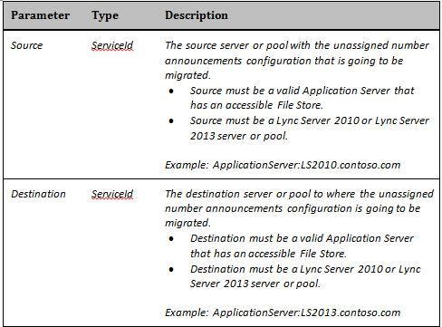

# <a name="skype-for-business-server-2015-resource-kit-tools-documentation"></a><span data-ttu-id="d53fb-107">documentation Skype Entreprise Server kit de ressources 2015</span><span class="sxs-lookup"><span data-stu-id="d53fb-107">Skype for Business Server 2015 Resource Kit Tools Documentation</span></span>

<span data-ttu-id="d53fb-108">Cet article décrit les outils du Kit de ressources Skype Entreprise Server 2015, y compris l’objectif de chaque outil et des exemples de son utilisation.</span><span class="sxs-lookup"><span data-stu-id="d53fb-108">This article describes the tools in the Skype for Business Server 2015 Resource Kit, including the purpose of each tool, and examples of its use.</span></span> <span data-ttu-id="d53fb-109">Le kit de ressources Skype Entreprise Server 2015 facilite les tâches de routine pour les administrateurs informatiques qui déploient et gèrent Skype Entreprise Server 2015.</span><span class="sxs-lookup"><span data-stu-id="d53fb-109">The Skype for Business Server 2015 Resource Kit helps to make routine tasks easier for IT administrators who deploy and manage Skype for Business Server 2015.</span></span> <span data-ttu-id="d53fb-110">Par exemple, **l’outil Web Conf Data** permet de contrôler facilement les données téléchargées par les utilisateurs au cours d’une réunion en ligne.</span><span class="sxs-lookup"><span data-stu-id="d53fb-110">For example, the **Web Conf Data** tool can be used to easily control data that is uploaded by users during an online meeting.</span></span> <span data-ttu-id="d53fb-111">**L’outil SEFAUtil** peut être utilisé pour configurer le forwarding d’appel délégué et le répondage pour les utilisateurs.</span><span class="sxs-lookup"><span data-stu-id="d53fb-111">The **SEFAUtil** tool can be used to set up delegate call forwarding and answering for users.</span></span> <span data-ttu-id="d53fb-112">Nous encourageons les administrateurs informatiques à utiliser ces outils pour gérer plus efficacement Skype Entreprise Server 2015.</span><span class="sxs-lookup"><span data-stu-id="d53fb-112">We encourage IT administrators to use these tools to more effectively manage Skype for Business Server 2015.</span></span>

## <a name="installation-of-the-resource-kit-tools"></a><span data-ttu-id="d53fb-113">Installation des outils du Kit de ressources</span><span class="sxs-lookup"><span data-stu-id="d53fb-113">Installation of the Resource Kit Tools</span></span>

<span data-ttu-id="d53fb-114">Pour installer le Kit de ressources Skype Entreprise Server 2015, téléchargez [OCSReskit.msi](https://www.microsoft.com/download/details.aspx?id=52631) à partir du Centre de téléchargement.</span><span class="sxs-lookup"><span data-stu-id="d53fb-114">To install the Skype for Business Server 2015 Resource Kit, download [OCSReskit.msi](https://www.microsoft.com/download/details.aspx?id=52631) from the Download Center.</span></span>

<span data-ttu-id="d53fb-115">Exécutez **OCSResKit.msi** pour une installation simple.</span><span class="sxs-lookup"><span data-stu-id="d53fb-115">Run **OCSResKit.msi** to do a simple installation.</span></span> <span data-ttu-id="d53fb-116">Le .msi installe tous les outils dans le chemin d’accès suivant : **%Program Files%\Skype Entreprise Server 2015\ResKit**.</span><span class="sxs-lookup"><span data-stu-id="d53fb-116">The .msi installs all the tools in the following path: **%Program Files%\Skype for Business Server 2015\ResKit**.</span></span> <span data-ttu-id="d53fb-117">Ce dossier contient des outils exécutables autonomes.</span><span class="sxs-lookup"><span data-stu-id="d53fb-117">Tools that are self-contained executables are in this folder.</span></span> <span data-ttu-id="d53fb-118">Les outils qui ont également des fichiers de prise en charge se font dans leurs propres sous-dossiers.</span><span class="sxs-lookup"><span data-stu-id="d53fb-118">Tools that also have supporting files are in their own subfolders.</span></span>

## <a name="supported-environments"></a><span data-ttu-id="d53fb-119">Environnements pris en charge</span><span class="sxs-lookup"><span data-stu-id="d53fb-119">Supported Environments</span></span>

<span data-ttu-id="d53fb-120">Le Kit de ressources Skype Entreprise Server 2015 doit être installé sur un serveur qui répond aux spécifications requises pour Skype Entreprise Server 2015, généralement utilisé pour exécuter Skype Entreprise Server 2015.</span><span class="sxs-lookup"><span data-stu-id="d53fb-120">The Skype for Business Server 2015 Resource Kit should be installed on a server that meets the specifications required for Skype for Business Server 2015, usually one being used to run Skype for Business Server 2015.</span></span>

## <a name="resource-kit-tools-overview"></a><span data-ttu-id="d53fb-121">Vue d’ensemble des outils du Kit de ressources</span><span class="sxs-lookup"><span data-stu-id="d53fb-121">Resource Kit Tools Overview</span></span>

<span data-ttu-id="d53fb-122">Voici une liste des outils fournis dans le Kit de ressources Skype Entreprise Server 2015.</span><span class="sxs-lookup"><span data-stu-id="d53fb-122">The following is a list of the tools that are provided in the Skype for Business Server 2015 Resource Kit.</span></span> <span data-ttu-id="d53fb-123">Une description de chaque outil, y compris les conditions requises et l’exemple d’utilisation, est détaillée dans les sections suivantes.</span><span class="sxs-lookup"><span data-stu-id="d53fb-123">A description of each tool, including the requirements and example usage is covered in the following sections.</span></span>

- [<span data-ttu-id="d53fb-124">ABSConfig</span><span class="sxs-lookup"><span data-stu-id="d53fb-124">ABSConfig</span></span>](resource-kit-tools.md#ABSConfig)

- [<span data-ttu-id="d53fb-125">Moniteur de service de stratégie de bande passante</span><span class="sxs-lookup"><span data-stu-id="d53fb-125">Bandwidth Policy Service Monitor</span></span>](resource-kit-tools.md#bpsm)

- [<span data-ttu-id="d53fb-126">Bandwidth Utilization Analyzer</span><span class="sxs-lookup"><span data-stu-id="d53fb-126">Bandwidth Utilization Analyzer</span></span>](resource-kit-tools.md#bua)

- [<span data-ttu-id="d53fb-127">Call Parkometer</span><span class="sxs-lookup"><span data-stu-id="d53fb-127">Call Parkometer</span></span>](resource-kit-tools.md#callpark)

- [<span data-ttu-id="d53fb-128">DBAnalyze</span><span class="sxs-lookup"><span data-stu-id="d53fb-128">DBAnalyze</span></span>](resource-kit-tools.md#dba)

- [<span data-ttu-id="d53fb-129">Importer des Stockage service de gestion</span><span class="sxs-lookup"><span data-stu-id="d53fb-129">Import Storage Service Data</span></span>](resource-kit-tools.md#Issd)

- [<span data-ttu-id="d53fb-130">LCSSync</span><span class="sxs-lookup"><span data-stu-id="d53fb-130">LCSSync</span></span>](resource-kit-tools.md#LCSSync)

- [<span data-ttu-id="d53fb-131">Console utilisateur de recherche</span><span class="sxs-lookup"><span data-stu-id="d53fb-131">Lookup User Console</span></span>](resource-kit-tools.md#LUC)

- [<span data-ttu-id="d53fb-132">MsTurnPing</span><span class="sxs-lookup"><span data-stu-id="d53fb-132">MsTurnPing</span></span>](resource-kit-tools.md#MsTurnPing)

- [<span data-ttu-id="d53fb-133">Visionneuse de configuration réseau</span><span class="sxs-lookup"><span data-stu-id="d53fb-133">Network Configuration Viewer</span></span>](resource-kit-tools.md#NCV)

- [<span data-ttu-id="d53fb-134">Response Group Agent Live</span><span class="sxs-lookup"><span data-stu-id="d53fb-134">Response Group Agent Live</span></span>](resource-kit-tools.md#RGAL)

- [<span data-ttu-id="d53fb-135">SEFAUtil</span><span class="sxs-lookup"><span data-stu-id="d53fb-135">SEFAUtil</span></span>](resource-kit-tools.md#SEFAUtil)

- [<span data-ttu-id="d53fb-136">SYSPrep.ps1</span><span class="sxs-lookup"><span data-stu-id="d53fb-136">SYSPrep.ps1</span></span>](resource-kit-tools.md#SYSPrep)

- [<span data-ttu-id="d53fb-137">Migration des annonces de numéro non signé</span><span class="sxs-lookup"><span data-stu-id="d53fb-137">Unassigned Number Announcements Migration</span></span>](resource-kit-tools.md#UNAM)

- [<span data-ttu-id="d53fb-138">Web Conf Data</span><span class="sxs-lookup"><span data-stu-id="d53fb-138">Web Conf Data</span></span>](resource-kit-tools.md#WebConfData)

## <a name="absconfig"></a><span data-ttu-id="d53fb-139">ABSConfig</span><span class="sxs-lookup"><span data-stu-id="d53fb-139">ABSConfig</span></span>
<span data-ttu-id="d53fb-140"><a name="ABSConfig"> </a></span><span class="sxs-lookup"><span data-stu-id="d53fb-140"><a name="ABSConfig"> </a></span></span>

<span data-ttu-id="d53fb-141">L’outil de configuration du service de carnet d’adresses (ABSConfig) est un outil d’administration qui permet aux administrateurs de personnaliser la configuration du service de carnet d’adresses Skype Entreprise Server 2015.</span><span class="sxs-lookup"><span data-stu-id="d53fb-141">The Address Book Service Configuration tool (ABSConfig) is an administrative tool that helps administrators customize Address Book Service configuration in Skype for Business Server 2015.</span></span> <span data-ttu-id="d53fb-142">Cet outil permet également aux administrateurs Skype Entreprise Server 2015 de restaurer les paramètres du service de carnet d’adresses par défaut.</span><span class="sxs-lookup"><span data-stu-id="d53fb-142">This tool also enables Skype for Business Server 2015 administrators to restore the default Address Book Service settings.</span></span>

### <a name="description"></a><span data-ttu-id="d53fb-143">Description</span><span class="sxs-lookup"><span data-stu-id="d53fb-143">Description</span></span>

<span data-ttu-id="d53fb-144">ABSConfig est une application d’interface utilisateur graphique qui permet aux administrateurs de configurer les attributs des services de domaine Active Directory liés au service de carnet d’adresses.</span><span class="sxs-lookup"><span data-stu-id="d53fb-144">ABSConfig is a graphical user interface application that enables administrators to configure Active Directory Domain Services attributes that are related to Address Book Service.</span></span>

<span data-ttu-id="d53fb-145">Les principaux scénarios de l’outil sont les suivants :</span><span class="sxs-lookup"><span data-stu-id="d53fb-145">The primary scenarios for the tool are the following:</span></span>

- <span data-ttu-id="d53fb-146">Pour permettre aux administrateurs de ma cartographier les attributs des services de domaine Active Directory aux attributs de Skype Entreprise Server 2015.</span><span class="sxs-lookup"><span data-stu-id="d53fb-146">To enable administrators to map attributes in Active Directory Domain Services to the attributes for Skype for Business Server 2015.</span></span>

- <span data-ttu-id="d53fb-147">Permettre aux administrateurs de spécifier l’attribut Services de domaine Active Directory à inclure ou à exclure dans les fichiers du service de carnet d’adresses.</span><span class="sxs-lookup"><span data-stu-id="d53fb-147">To enable administrators to specify the Active Directory Domain Services attribute to be included or excluded in the Address Book Service files.</span></span>

- <span data-ttu-id="d53fb-148">Pour permettre aux administrateurs de restaurer, paramètres par défaut du service de carnet d’adresses.</span><span class="sxs-lookup"><span data-stu-id="d53fb-148">To enable administrators to restore,  default Address Book Service settings.</span></span>

<span data-ttu-id="d53fb-149">L’outil ABSConfig peut être démarré à l’aide ABSConfig.exe fichier.</span><span class="sxs-lookup"><span data-stu-id="d53fb-149">The ABSConfig tool can be started by using the ABSConfig.exe file.</span></span> <span data-ttu-id="d53fb-150">L’outil s’ouvre dans **l’onglet Configurer les attributs.** Ce tableau dispose d’options pour ma cartographier les attributs des services de domaine Active Directory sur les champs d’attribut pour Skype Entreprise Server 2015 et pour spécifier les utilisateurs à inclure ou à exclure dans les fichiers du service de carnet d’adresses en fonction de filtres d’attributs spécifiques.</span><span class="sxs-lookup"><span data-stu-id="d53fb-150">The tool opens to the **Configure Attributes** tab. This table has options to map Active Directory Domain Services attributes to the attribute fields for Skype for Business Server 2015 and to specify which users to include or exclude in Address Book Service files based on specific attribute filters.</span></span> <span data-ttu-id="d53fb-151">Il dispose également d’options pour personnaliser la valeur du numéro de téléphone à inclure dans le fichier de carnet d’adresses.</span><span class="sxs-lookup"><span data-stu-id="d53fb-151">It also has options to customize which value of the phone number to be included in the Address Book file.</span></span> <span data-ttu-id="d53fb-152">**L’option Restaurer les valeurs par** défaut permet aux administrateurs de restaurer les valeurs par défaut des paramètres du service de carnet d’adresses.</span><span class="sxs-lookup"><span data-stu-id="d53fb-152">The **Restore Defaults** option enables administrators to restore Address Book Service settings to default values.</span></span>

> [!NOTE]
> <span data-ttu-id="d53fb-153">Le nouveau mappage des attributs AD à différents noms de champs OC fonctionne uniquement pour le téléchargement de fichier de carnet d’adresses et n’est pas pris en charge par la requête web du carnet d’adresses.</span><span class="sxs-lookup"><span data-stu-id="d53fb-153">Re-mapping of AD attributes to different OC Field Names will only work for Address Book File Download, and is not supported by Address Book Web Query.</span></span>

### <a name="output"></a><span data-ttu-id="d53fb-154">Sortie</span><span class="sxs-lookup"><span data-stu-id="d53fb-154">Output</span></span>

<span data-ttu-id="d53fb-155">ABSConfig stocke la configuration du service de carnet d’adresses dans la base de données.</span><span class="sxs-lookup"><span data-stu-id="d53fb-155">ABSConfig stores the Address Book Service configuration in the database.</span></span>

```console
Path: %ProgramFiles%\Skype for Business Server 2015\Reskit
```

### <a name="purpose"></a><span data-ttu-id="d53fb-156">Objectif</span><span class="sxs-lookup"><span data-stu-id="d53fb-156">Purpose</span></span>

<span data-ttu-id="d53fb-157">ABSConfig offre un moyen rapide et facile de personnaliser Skype Entreprise Server service de carnet d’adresses 2015.</span><span class="sxs-lookup"><span data-stu-id="d53fb-157">ABSConfig provides a quick and easy way to customize Skype for Business Server 2015 Address Book Service.</span></span>

### <a name="requirements"></a><span data-ttu-id="d53fb-158">Configuration requise</span><span class="sxs-lookup"><span data-stu-id="d53fb-158">Requirements</span></span>

#### <a name="computer"></a><span data-ttu-id="d53fb-159">Ordinateur</span><span class="sxs-lookup"><span data-stu-id="d53fb-159">Computer</span></span>

<span data-ttu-id="d53fb-160">ABSConfig ne peut être exécuté qu’à partir d’un ordinateur joint à un domaine sur Skype Entreprise Server 2015.</span><span class="sxs-lookup"><span data-stu-id="d53fb-160">ABSConfig can be run only from a domain-joined computer that has Skype for Business Server 2015 installed.</span></span> <span data-ttu-id="d53fb-161">Dans le cas de Skype Entreprise Server 2015, Êdition Entreprise, cet outil peut être exécuté sur n’importe quel serveur Front-End sur qui le service de carnet d’adresses est activé lors de l’installation.</span><span class="sxs-lookup"><span data-stu-id="d53fb-161">In the case of Skype for Business Server 2015, Enterprise Edition, this tool can be run on any Front-End servers that have the Address Book Service enabled during setup.</span></span>

#### <a name="network"></a><span data-ttu-id="d53fb-162">Réseau</span><span class="sxs-lookup"><span data-stu-id="d53fb-162">Network</span></span>

<span data-ttu-id="d53fb-163">L’ordinateur doit pouvoir se connecter au pool Front-End base de données principale.</span><span class="sxs-lookup"><span data-stu-id="d53fb-163">The computer should be able to connect to the Front-End pool and back-end database.</span></span>

#### <a name="software"></a><span data-ttu-id="d53fb-164">Logiciels</span><span class="sxs-lookup"><span data-stu-id="d53fb-164">Software</span></span>

<span data-ttu-id="d53fb-165">Les composants logiciels suivants doivent être installés avant d’utiliser l’outil ABSConfig :</span><span class="sxs-lookup"><span data-stu-id="d53fb-165">The following software components must be installed before running the ABSConfig tool:</span></span>

- <span data-ttu-id="d53fb-166">Skype Entreprise Server 2015</span><span class="sxs-lookup"><span data-stu-id="d53fb-166">Skype for Business Server 2015</span></span>

#### <a name="users"></a><span data-ttu-id="d53fb-167">Utilisateurs</span><span class="sxs-lookup"><span data-stu-id="d53fb-167">Users</span></span>

<span data-ttu-id="d53fb-168">Administrateurs qui ont les autorisations requises pour mettre à jour Skype Entreprise Server déploiement 2015.</span><span class="sxs-lookup"><span data-stu-id="d53fb-168">Administrators who have the permissions required to update the Skype for Business Server 2015 deployment.</span></span>

### <a name="examples"></a><span data-ttu-id="d53fb-169">Exemples</span><span class="sxs-lookup"><span data-stu-id="d53fb-169">Examples</span></span>

<span data-ttu-id="d53fb-170">ABSConfig peut être démarré en tapantABSConfig.exe **à** une invite de commandes.</span><span class="sxs-lookup"><span data-stu-id="d53fb-170">ABSConfig can be started by typing **ABSConfig.exe** at a command prompt.</span></span> <span data-ttu-id="d53fb-171">L’interface utilisateur de l’outil ABSConfig est présentée ci-dessous.</span><span class="sxs-lookup"><span data-stu-id="d53fb-171">Shown below is the ABSConfig tool user interface.</span></span>


### <a name="summary"></a><span data-ttu-id="d53fb-173">Résumé</span><span class="sxs-lookup"><span data-stu-id="d53fb-173">Summary</span></span>

<span data-ttu-id="d53fb-174">L’outil ABSConfig fournit aux administrateurs un outil rapide et facile à utiliser pour personnaliser Skype Entreprise Server service de carnet d’adresses 2015.</span><span class="sxs-lookup"><span data-stu-id="d53fb-174">The ABSConfig tool provides administrators a quick and easy to use tool to customize Skype for Business Server 2015 Address Book Service.</span></span>

## <a name="bandwidth-policy-service-monitor"></a><span data-ttu-id="d53fb-175">Moniteur de service de stratégie de bande passante</span><span class="sxs-lookup"><span data-stu-id="d53fb-175">Bandwidth Policy Service Monitor</span></span>
<span data-ttu-id="d53fb-176"><a name="bpsm"> </a></span><span class="sxs-lookup"><span data-stu-id="d53fb-176"><a name="bpsm"> </a></span></span>

<span data-ttu-id="d53fb-177">L’outil Bandwidth Policy Service Monitor est conçu pour permettre aux administrateurs d’afficher une liste des données suivantes :</span><span class="sxs-lookup"><span data-stu-id="d53fb-177">The Bandwidth Policy Service Monitor tool is intended to allow administrators to view a list of the following:</span></span>

1. <span data-ttu-id="d53fb-178">Tous les services de stratégie de Skype Entreprise Server 2015 configurés (Authentification et base) dans la topologie</span><span class="sxs-lookup"><span data-stu-id="d53fb-178">All the configured Skype for Business Server 2015 Bandwidth Policy services (Authentication and Core) in the topology</span></span>

2. <span data-ttu-id="d53fb-179">Les connexions que chaque service effectue à d’autres services de stratégie de bande passante et aux serveurs Edge</span><span class="sxs-lookup"><span data-stu-id="d53fb-179">The connections that each service makes to other Bandwidth Policy services and to the Edge servers</span></span>

3. <span data-ttu-id="d53fb-180">Tous les liens configurés dans le document de configuration réseau et l’utilisation de la bande passante en temps réel, comme indiqué par chacun des services de stratégie de bande passante</span><span class="sxs-lookup"><span data-stu-id="d53fb-180">All the links that are configured in the Network configuration document and real-time bandwidth usage as reported by each of the Bandwidth Policy services</span></span>

### <a name="description"></a><span data-ttu-id="d53fb-181">Description</span><span class="sxs-lookup"><span data-stu-id="d53fb-181">Description</span></span>

<span data-ttu-id="d53fb-182">L’outil Bandwidth Policy Service Monitor est implémenté en tant qu’application gui.</span><span class="sxs-lookup"><span data-stu-id="d53fb-182">The Bandwidth Policy Service Monitor tool is implemented as a GUI-based application.</span></span> <span data-ttu-id="d53fb-183">Les administrateurs démarrent l’outil en exécutant PDPMonUI.exe.</span><span class="sxs-lookup"><span data-stu-id="d53fb-183">Administrators start the tool by running PDPMonUI.exe.</span></span>

<span data-ttu-id="d53fb-184">Lorsque l’outil démarre, il tente de découvrir la liste des services de stratégie de bande passante dans la topologie.</span><span class="sxs-lookup"><span data-stu-id="d53fb-184">When the tool starts, it attempts to discover the list of Bandwidth Policy services in the topology.</span></span> <span data-ttu-id="d53fb-185">Une fois la mise à jour initiale effectuée, le volet à gauche de la fenêtre est rempli avec une liste de services regroupés par les clusters à qui ils appartiennent.</span><span class="sxs-lookup"><span data-stu-id="d53fb-185">After the initial update is done, the pane to the left of the window is populated with a list of services that are grouped by the clusters that they belong to.</span></span>

<span data-ttu-id="d53fb-186">Lorsque les administrateurs sélectionnent un service de stratégie de bande passante particulier, le volet de droite affiche les informations sur ce service particulier.</span><span class="sxs-lookup"><span data-stu-id="d53fb-186">When administrators select a particular Bandwidth Policy Service, the pane on the right displays the information about that particular service.</span></span> <span data-ttu-id="d53fb-187">Ce volet comprend également deux onglets principaux qui affichent des informations.</span><span class="sxs-lookup"><span data-stu-id="d53fb-187">That pane also has two main tabs that display information.</span></span>

#### <a name="machine-info-tab"></a><span data-ttu-id="d53fb-188">Onglet Infos sur l’ordinateur</span><span class="sxs-lookup"><span data-stu-id="d53fb-188">Machine Info Tab</span></span>

<span data-ttu-id="d53fb-189">**L’onglet** Informations sur l’ordinateur affiche les détails du service de stratégie de bande passante sélectionné, ainsi que la liste et l’état de toutes les connexions qui sont réalisées par le service de stratégie de bande passante sélectionné à d’autres services.</span><span class="sxs-lookup"><span data-stu-id="d53fb-189">The **Machine Info** tab shows the details of the Bandwidth Policy Service that is selected and the list and state of all the connections that are made by the selected Bandwidth Policy Service to other services.</span></span>

#### <a name="topology-info-tab"></a><span data-ttu-id="d53fb-190">Onglet Informations sur la topologie</span><span class="sxs-lookup"><span data-stu-id="d53fb-190">Topology Info Tab</span></span>

<span data-ttu-id="d53fb-191">**L’onglet Informations sur** la topologie affiche la liste de tous les liens configurés dans les paramètres de configuration réseau.</span><span class="sxs-lookup"><span data-stu-id="d53fb-191">The **Topology Info** tab shows a list of all the links that are configured in the Network configuration settings.</span></span> <span data-ttu-id="d53fb-192">Pour chaque lien, la capacité de bande passante audio et vidéo s’affiche.</span><span class="sxs-lookup"><span data-stu-id="d53fb-192">For each link, the audio and video bandwidth capacity is displayed.</span></span> <span data-ttu-id="d53fb-193">En outre, la bande passante actuellement utilisée s’affiche, à la fois en Kbits/s et en pourcentage de la capacité.</span><span class="sxs-lookup"><span data-stu-id="d53fb-193">Additionally, the currently utilized bandwidth is displayed, both in Kbps and as a percentage of the capacity.</span></span> <span data-ttu-id="d53fb-194">L’outil utilise le codage de couleurs pour mettre en évidence les liens dont l’utilisation est proche de la capacité, ce qui permet aux administrateurs d’isoler rapidement ces liens.</span><span class="sxs-lookup"><span data-stu-id="d53fb-194">The tool uses color-coding to highlight links that have utilization that is close to the capacity—this allows administrators to quickly isolate such links.</span></span>

> [!NOTE]
>  <span data-ttu-id="d53fb-195">Si l’outil Bandwidth Policy Service Monitor subit une défaillance lorsqu’il se connecte à  l’un des services de stratégie de bande passante configurés, les informations des onglets Informations sur l’ordinateur et Info topologie ne sont pas remplies. </span><span class="sxs-lookup"><span data-stu-id="d53fb-195">If the Bandwidth Policy Service Monitor tool experiences failure when it connects to any of the configured Bandwidth Policy services, the information in the **Machine Info** and the **Topology Info** tabs won't be populated.</span></span> <span data-ttu-id="d53fb-196">Toutefois, il est possible que l’outil se connecte initialement, mais par la suite perd sa connexion au service.</span><span class="sxs-lookup"><span data-stu-id="d53fb-196">However, it is possible that the tool might connect initially but subsequently lose its connection to the service.</span></span> <span data-ttu-id="d53fb-197">Dans ce cas, les administrateurs peuvent voir des informations obsolètes.</span><span class="sxs-lookup"><span data-stu-id="d53fb-197">In such cases, administrators might see outdated information.</span></span> <span data-ttu-id="d53fb-198">Il existe **un** horodat de dernière mise à jour sur chacun des onglets qui permet aux administrateurs de voir quand les données ont été mises à jour pour la dernière fois pour un service de stratégie de bande passante particulier.</span><span class="sxs-lookup"><span data-stu-id="d53fb-198">There is a **Last Updated** time stamp on each of the tabs that can allow administrators to see when the data was last updated for a particular Bandwidth Policy Service.</span></span>

### <a name="output"></a><span data-ttu-id="d53fb-199">Sortie</span><span class="sxs-lookup"><span data-stu-id="d53fb-199">Output</span></span>

<span data-ttu-id="d53fb-200">Il n’y a pas de sortie de ligne de commande ; la sortie du programme est contenue dans l’interface utilisateur graphique principale( GUI).</span><span class="sxs-lookup"><span data-stu-id="d53fb-200">There is no command-line output; the program output is contained within the main graphical user interface (GUI).</span></span>

### <a name="purpose"></a><span data-ttu-id="d53fb-201">Objectif</span><span class="sxs-lookup"><span data-stu-id="d53fb-201">Purpose</span></span>

<span data-ttu-id="d53fb-202">L’objectif de l’outil Bandwidth Policy Service Monitor est de permettre aux administrateurs de voir l’état de chacun des services de stratégie de bande passante définis dans la topologie.</span><span class="sxs-lookup"><span data-stu-id="d53fb-202">The purpose of the Bandwidth Policy Service Monitor tool is to allow administrators visibility into the state of each of the Bandwidth Policy services that are defined in the topology.</span></span> <span data-ttu-id="d53fb-203">En outre, les administrateurs peuvent voir l’utilisation de la bande passante en temps réel pour tous les liens définis dans le document de configuration du réseau.</span><span class="sxs-lookup"><span data-stu-id="d53fb-203">In addition, administrators can see real-time bandwidth usage for all the links that are defined in the Network configuration document.</span></span>

### <a name="requirements"></a><span data-ttu-id="d53fb-204">Configuration requise</span><span class="sxs-lookup"><span data-stu-id="d53fb-204">Requirements</span></span>

<span data-ttu-id="d53fb-205">L’outil Bandwidth Policy Service Monitor doit être exécuté sur un ordinateur qui fait partie de la topologie Skype Entreprise Server bande passante.</span><span class="sxs-lookup"><span data-stu-id="d53fb-205">The Bandwidth Policy Service Monitor tool needs to be run on a computer that is part of the Skype for Business Server topology.</span></span>

### <a name="summary"></a><span data-ttu-id="d53fb-206">Résumé</span><span class="sxs-lookup"><span data-stu-id="d53fb-206">Summary</span></span>

<span data-ttu-id="d53fb-207">L’outil Bandwidth Policy Service Monitor peut être une ressource précieuse pour les administrateurs afin qu’ils peuvent inspecter l’état de tous les services de stratégie de bande passante dans la topologie, et plus important encore, ils peuvent obtenir l’utilisation de la bande passante en temps réel pour les liens définis dans les paramètres de configuration réseau.</span><span class="sxs-lookup"><span data-stu-id="d53fb-207">The Bandwidth Policy Service Monitor tool can be a valuable resource to administrators so they can inspect the state of all the Bandwidth Policy services in the topology—and more importantly—they can obtain real-time bandwidth utilization for the links that are defined in the Network configuration settings.</span></span>

## <a name="bandwidth-utilization-analyzer"></a><span data-ttu-id="d53fb-208">Bandwidth Utilization Analyzer</span><span class="sxs-lookup"><span data-stu-id="d53fb-208">Bandwidth Utilization Analyzer</span></span>
<span data-ttu-id="d53fb-209"><a name="bua"> </a></span><span class="sxs-lookup"><span data-stu-id="d53fb-209"><a name="bua"> </a></span></span>

<span data-ttu-id="d53fb-210">Bandwidth Utilization Analyzer est un outil qui crée des rapports sur différents affichages de la consommation de bande passante par les points de terminaison UC sur les liaisons WAN du réseau d’entreprise.</span><span class="sxs-lookup"><span data-stu-id="d53fb-210">Bandwidth Utilization Analyzer is a tool that creates reports about various views of bandwidth consumption by the UC endpoints across WAN links in the enterprise network.</span></span> <span data-ttu-id="d53fb-211">Ces rapports peuvent être utilisés pour comprendre le modèle actuel de consommation de bande passante et pour faciliter la planification de la capacité de la bande passante.</span><span class="sxs-lookup"><span data-stu-id="d53fb-211">These reports can be used to understand the current bandwidth consumption pattern and to aid in bandwidth capacity planning.</span></span>

### <a name="description"></a><span data-ttu-id="d53fb-212">Description</span><span class="sxs-lookup"><span data-stu-id="d53fb-212">Description</span></span>

<span data-ttu-id="d53fb-213">Bandwidth Utilization Analyzer est implémenté en tant qu’application graphique.</span><span class="sxs-lookup"><span data-stu-id="d53fb-213">Bandwidth Utilization Analyzer is implemented as a GUI-based application.</span></span> <span data-ttu-id="d53fb-214">Cet outil génère des rapports spécifiques à l’utilisation audio sur le réseau et facilite la planification de la capacité.</span><span class="sxs-lookup"><span data-stu-id="d53fb-214">This tool generates reports specifically for audio utilization across the network and helps with capacity planning.</span></span> <span data-ttu-id="d53fb-215">Il itérera également sur la capacité de bande passante affectée à différents liens.</span><span class="sxs-lookup"><span data-stu-id="d53fb-215">It also iterates on the bandwidth capacity that is assigned to various links.</span></span>

### <a name="output"></a><span data-ttu-id="d53fb-216">Sortie</span><span class="sxs-lookup"><span data-stu-id="d53fb-216">Output</span></span>

<span data-ttu-id="d53fb-217">Bandwidth Utilization Analyzer fournit des graphiques de la capacité et de l’utilisation de la bande passante pour l’audio pour toutes les liaisons wan qui sont configurées dans le système.</span><span class="sxs-lookup"><span data-stu-id="d53fb-217">Bandwidth Utilization Analyzer provides graphical plots of bandwidth capacity and utilization for audio for all the WAN links that are configured in the system.</span></span>

### <a name="purpose"></a><span data-ttu-id="d53fb-218">Objectif</span><span class="sxs-lookup"><span data-stu-id="d53fb-218">Purpose</span></span>

<span data-ttu-id="d53fb-219">Dans tout déploiement vocal et vidéo, il est essentiel de surveiller et de comprendre la tendance de l’utilisation de la bande passante du trafic multimédia sur le réseau d’entreprise.</span><span class="sxs-lookup"><span data-stu-id="d53fb-219">In any voice and video deployment, it's critical to monitor and understand the trend of bandwidth utilization of media traffic across the enterprise network.</span></span> <span data-ttu-id="d53fb-220">L’outil Bandwidth Utilization Analyzer permet à un administrateur d’y parvenir.</span><span class="sxs-lookup"><span data-stu-id="d53fb-220">The Bandwidth Utilization Analyzer tool allows an administrator to achieve just that.</span></span> <span data-ttu-id="d53fb-221">Cet outil permet d’utiliser les outils suivants :</span><span class="sxs-lookup"><span data-stu-id="d53fb-221">This tool does the following:</span></span>

- <span data-ttu-id="d53fb-222">Génère des rapports spécifiques pour l’utilisation audio sur le réseau</span><span class="sxs-lookup"><span data-stu-id="d53fb-222">Generates specific reports for audio utilization across the network</span></span>

- <span data-ttu-id="d53fb-223">Permet une planification et une itération plus efficaces de la capacité de bande passante affectée à différents liens</span><span class="sxs-lookup"><span data-stu-id="d53fb-223">Helps with more effective capacity planning and iteration on the bandwidth capacity that is assigned to various links</span></span>

<span data-ttu-id="d53fb-224">Bandwidth Utilization Analyzer peut générer des graphiques de graphiques de rapports de capacité et d’utilisation de la bande passante . Elles sont les suivantes :</span><span class="sxs-lookup"><span data-stu-id="d53fb-224">Bandwidth Utilization Analyzer can generate graphical plots of bandwidth capacity and utilization reports; they are as follows:</span></span>

- <span data-ttu-id="d53fb-225">Toutes les liaisons wan dans le réseau d’entreprise</span><span class="sxs-lookup"><span data-stu-id="d53fb-225">All the WAN links in the enterprise network</span></span>

- <span data-ttu-id="d53fb-226">Filtrée par les liaisons wan sélectionnées qui ont été choisies</span><span class="sxs-lookup"><span data-stu-id="d53fb-226">Filtered by selected WAN links that have been chosen</span></span>

- <span data-ttu-id="d53fb-227">Filtrés par des liaisons wan qui ont dépassé la capacité de liaison</span><span class="sxs-lookup"><span data-stu-id="d53fb-227">Filtered by WAN links that have exceeded link capacity</span></span>

- <span data-ttu-id="d53fb-228">Filtrés par des liaisons de réseau wan qui n’ont pas assez utilisée la bande passante mise en service</span><span class="sxs-lookup"><span data-stu-id="d53fb-228">Filtered by WAN links that have been under-utilizing the provisioned bandwidth</span></span>

- <span data-ttu-id="d53fb-229">Filtrage des liaisons de réseau wan qui ont atteint des niveaux critiques (utilisation de la bande passante supérieure à 90 % de la capacité de bande passante de la liaison de réseau wan).</span><span class="sxs-lookup"><span data-stu-id="d53fb-229">Filter by WAN links that have been reaching critical levels (a bandwidth utilization that is greater than 90% of bandwidth capacity of the WAN link)</span></span>

- <span data-ttu-id="d53fb-230">Filtrée par type de liaison WAN (liaisons réseau-site, liaisons interrégion et liaisons au sein d’un site)</span><span class="sxs-lookup"><span data-stu-id="d53fb-230">Filtered by WAN link type—network-site links, interregional links, and links within a site</span></span>

- <span data-ttu-id="d53fb-231">Filtré par région réseau</span><span class="sxs-lookup"><span data-stu-id="d53fb-231">Filtered by network region</span></span>

#### <a name="applications"></a><span data-ttu-id="d53fb-232">Applications</span><span class="sxs-lookup"><span data-stu-id="d53fb-232">Applications</span></span>

<span data-ttu-id="d53fb-233">Bandwidth Utilization Analyzer dispose des deux applications suivantes (outils) :</span><span class="sxs-lookup"><span data-stu-id="d53fb-233">Bandwidth Utilization Analyzer has the following two applications (tools):</span></span>

- <span data-ttu-id="d53fb-234">**WanLinkLogCollector.exe** Cet outil permet à son utilisateur d’entrer les informations requises.</span><span class="sxs-lookup"><span data-stu-id="d53fb-234">**WanLinkLogCollector.exe** This tool enables its user to input the required information.</span></span>

- <span data-ttu-id="d53fb-235">**BandwidthUtilizationAnalyzer.xlsm** Un Microsoft Excel logiciel de feuille de calcul automatique est automatiquement lancé par WanLinkLogCollector.exe.</span><span class="sxs-lookup"><span data-stu-id="d53fb-235">**BandwidthUtilizationAnalyzer.xlsm** A Microsoft Excel spreadsheet software report is automatically launched by WanLinkLogCollector.exe.</span></span> <span data-ttu-id="d53fb-236">Cette application permet à l’utilisateur d’appliquer des filtres au rapport, comme indiqué plus loin dans cet article.</span><span class="sxs-lookup"><span data-stu-id="d53fb-236">This application allows the user to apply filters to the report as shown later in this article.</span></span>

#### <a name="phases-of-using-bandwidth-utilization-analyzer"></a><span data-ttu-id="d53fb-237">Phases d’utilisation de l’analyseur d’utilisation de la bande passante</span><span class="sxs-lookup"><span data-stu-id="d53fb-237">Phases of Using Bandwidth Utilization Analyzer</span></span>

<span data-ttu-id="d53fb-238">Il existe deux phases lors de l’utilisation de Bandwidth Utilization Analyzer :</span><span class="sxs-lookup"><span data-stu-id="d53fb-238">There are two phases when using Bandwidth Utilization Analyzer:</span></span>

- <span data-ttu-id="d53fb-239">Collecter les journaux, qui sont effectués à l’aide de WanLinkLogCollector.exe</span><span class="sxs-lookup"><span data-stu-id="d53fb-239">Collect logs, which are performed by using WanLinkLogCollector.exe</span></span>

- <span data-ttu-id="d53fb-240">Personnaliser les rapports, qui sont effectués à l’aide BandwidthUtilizationAnalyzer.xlsm</span><span class="sxs-lookup"><span data-stu-id="d53fb-240">Customize reports, which are performed by using BandwidthUtilizationAnalyzer.xlsm</span></span>

    > [!IMPORTANT]
    > <span data-ttu-id="d53fb-241">Nous vous recommandons vivement BandwidthUtilizationAnalyzer.xlsne pas être lancé manuellement par les utilisateurs finaux.</span><span class="sxs-lookup"><span data-stu-id="d53fb-241">We strongly recommend that BandwidthUtilizationAnalyzer.xlsm not be manually launched by end users.</span></span>

#### <a name="starting-bandwidth-utilization-analyzer"></a><span data-ttu-id="d53fb-242">Démarrage de Bandwidth Utilization Analyzer</span><span class="sxs-lookup"><span data-stu-id="d53fb-242">Starting Bandwidth Utilization Analyzer</span></span>

<span data-ttu-id="d53fb-243">Démarrez WanLinkLogCollector.exe à l’invite de commandes ou à l’aide Windows Explorer.</span><span class="sxs-lookup"><span data-stu-id="d53fb-243">Start WanLinkLogCollector.exe at the command prompt or by using Windows Explorer.</span></span>

 <span data-ttu-id="d53fb-244">**Utilisation de WanLinkLogCollector.exe**</span><span class="sxs-lookup"><span data-stu-id="d53fb-244">**Using WanLinkLogCollector.exe**</span></span>

<span data-ttu-id="d53fb-245">L’utilisation des WanLinkLogCollector.exe se fait en trois étapes :</span><span class="sxs-lookup"><span data-stu-id="d53fb-245">There are three steps to using WanLinkLogCollector.exe:</span></span>

1. <span data-ttu-id="d53fb-246">**Journal de la chronologie** Fournir la chronologie pour qui le rapport doit être généré</span><span class="sxs-lookup"><span data-stu-id="d53fb-246">**Log the timeline** Provide the timeline that the report needs to be generated for</span></span>

2. <span data-ttu-id="d53fb-247">**Spécifier les répertoires de fichiers** Fournir des informations sur l’emplacement du fichier</span><span class="sxs-lookup"><span data-stu-id="d53fb-247">**Specify the file directories** Provide file location information</span></span>

3. <span data-ttu-id="d53fb-248">**Collecter les journaux et lancer la visionneuse de rapports** Exécuter la commande pour générer le rapport</span><span class="sxs-lookup"><span data-stu-id="d53fb-248">**Collect the logs and launch the report viewer** Execute the command to generate the report</span></span>

#### <a name="step-1---log-the-timeline"></a><span data-ttu-id="d53fb-249">Étape 1 : journal de la chronologie</span><span class="sxs-lookup"><span data-stu-id="d53fb-249">Step 1 - Log the timeline</span></span>

<span data-ttu-id="d53fb-250">La journalisation de la chronologie permet à l’utilisateur de l’outil de spécifier les informations suivantes, comme illustré dans la figure ci-dessous.</span><span class="sxs-lookup"><span data-stu-id="d53fb-250">Logging the timeline allows the tool user to specify the following as shown in the figure below.</span></span>

1. <span data-ttu-id="d53fb-251">**Date de début** Il s’agit de la date de début de la chronologie pour laquelle le rapport doit être généré ; par exemple, 1er août 2010.</span><span class="sxs-lookup"><span data-stu-id="d53fb-251">**Start date** This is the start date of the timeline that the report is to be generated for; for example, August 1, 2010.</span></span>

2. <span data-ttu-id="d53fb-252">**Date de fin** Il s’agit de la date de fin de la chronologie pour laquelle le rapport doit être généré ; par exemple, 30 septembre 2010.</span><span class="sxs-lookup"><span data-stu-id="d53fb-252">**End date** This is the end date of the timeline that the report is to be generated for; for example, September 30, 2010.</span></span>

     

#### <a name="step-2---specify-the-file-directories"></a><span data-ttu-id="d53fb-254">Étape 2 : spécifier les répertoires de fichiers</span><span class="sxs-lookup"><span data-stu-id="d53fb-254">Step 2 - Specify the file directories</span></span>

<span data-ttu-id="d53fb-255">Les répertoires de fichiers suivants peuvent être spécifiés par l’utilisateur comme indiqué.</span><span class="sxs-lookup"><span data-stu-id="d53fb-255">The following file directories can be specified by the user as shown.</span></span>

- <span data-ttu-id="d53fb-256">**Emplacement des fichiers journaux du serveur** Emplacement du dossier où sont stockés les journaux du serveur de stratégie de bande passante.</span><span class="sxs-lookup"><span data-stu-id="d53fb-256">**Server log files location** The folder location where Bandwidth policy server logs are stored.</span></span> <span data-ttu-id="d53fb-257">Il s’agit \<fileserver\> \\ généralement<choix de FE \> \AppServerFiles\PDP.</span><span class="sxs-lookup"><span data-stu-id="d53fb-257">This is typically in \<fileserver\>\\<choice of FE\>\AppServerFiles\PDP.</span></span>

- <span data-ttu-id="d53fb-258">**Emplacement de stockage de fichiers temporaire** Emplacement des fichiers temporaires dans lequel les fichiers intermédiaires sont stockés pendant la générer.</span><span class="sxs-lookup"><span data-stu-id="d53fb-258">**Temporary file storage location** The temporary file location where intermediate files are stored while the report is being generated.</span></span>

    

    > [!NOTE]
    > <span data-ttu-id="d53fb-260">Assurez-vous qu’un accès suffisant aux journaux du serveur et au dossier du magasin de fichiers temporaire est fourni à l’utilisateur de l’outil.</span><span class="sxs-lookup"><span data-stu-id="d53fb-260">Ensure that sufficient file access to the server logs and the temporary file store folder is provided to the tool user.</span></span>

#### <a name="step-3---collect-the-logs-and-start-the-report-viewer"></a><span data-ttu-id="d53fb-261">Étape 3 : collecter les journaux et démarrer la visionneuse de rapports</span><span class="sxs-lookup"><span data-stu-id="d53fb-261">Step 3 - Collect the logs and start the report viewer</span></span>

<span data-ttu-id="d53fb-262">Pour collecter les journaux et démarrer la visionneuse de rapports, cliquez sur **Exécuter** comme illustré ci-dessous.</span><span class="sxs-lookup"><span data-stu-id="d53fb-262">To collect the logs and start the report viewer, click **Execute** as shown below.</span></span> <span data-ttu-id="d53fb-263">Cette étape collecte les données requises.</span><span class="sxs-lookup"><span data-stu-id="d53fb-263">This step collects the required data.</span></span>


<span data-ttu-id="d53fb-265">Lorsque la validation d’entrée réussit, le message ci-dessous s’affiche.</span><span class="sxs-lookup"><span data-stu-id="d53fb-265">When the input validation is successful, the message shown below is displayed.</span></span>


<span data-ttu-id="d53fb-267">Cliquez sur **OK**.</span><span class="sxs-lookup"><span data-stu-id="d53fb-267">Click **OK**.</span></span> <span data-ttu-id="d53fb-268">BandwidthUtilizationAnalyzer.xlsm est démarré automatiquement.</span><span class="sxs-lookup"><span data-stu-id="d53fb-268">BandwidthUtilizationAnalyzer.xlsm is automatically started.</span></span> <span data-ttu-id="d53fb-269">Suivez les instructions de la boîte de message.</span><span class="sxs-lookup"><span data-stu-id="d53fb-269">Follow the instructions in the message box.</span></span> <span data-ttu-id="d53fb-270">Pour plus d’informations, **voir Utilisation BandwidthUtilizationAnalyzer.xlsm** dans la section suivante.</span><span class="sxs-lookup"><span data-stu-id="d53fb-270">For details, see **Using BandwidthUtilizationAnalyzer.xlsm** in the next section.</span></span>


### <a name="using-bandwidthutilizationanalyzerxlsm"></a><span data-ttu-id="d53fb-271">Utilisation de BandwidthUtilizationAnalyzer.xlsm</span><span class="sxs-lookup"><span data-stu-id="d53fb-271">Using BandwidthUtilizationAnalyzer.xlsm</span></span>

1. <span data-ttu-id="d53fb-272">Lorsque BandwidthUtilizationAnalyzer.xlsm est automatiquement démarré, cliquez sur **Actualiser** comme illustré ci-dessous.</span><span class="sxs-lookup"><span data-stu-id="d53fb-272">When BandwidthUtilizationAnalyzer.xlsm is automatically started, click **Refresh** as shown below.</span></span>

     

2. <span data-ttu-id="d53fb-274">Lorsqu’un dossier de fichiers est ouvert, sélectionnez consolidated.csv l’emplacement spécifié dans la zone de message, comme illustré ci-dessous.</span><span class="sxs-lookup"><span data-stu-id="d53fb-274">When a file folder is opened, select consolidated.csv from the location that is specified in the message box as shown below.</span></span> <span data-ttu-id="d53fb-275">Il indique également l’emplacement **en tant que C:\Temp**.</span><span class="sxs-lookup"><span data-stu-id="d53fb-275">It also shows the location as **C:\Temp**.</span></span>

     

3. <span data-ttu-id="d53fb-277">Cliquez sur **Importer**.</span><span class="sxs-lookup"><span data-stu-id="d53fb-277">Click **Import**.</span></span>

4. <span data-ttu-id="d53fb-278">Le traçage graphique est généré automatiquement.</span><span class="sxs-lookup"><span data-stu-id="d53fb-278">The graphical plot is automatically generated.</span></span> <span data-ttu-id="d53fb-279">Elle est disponible lorsque le pointeur de travail en arrière-plan disparaît.</span><span class="sxs-lookup"><span data-stu-id="d53fb-279">It is available when the working-in-the-background pointer disappears.</span></span>

     

#### <a name="applying-filters-to-the-report-view"></a><span data-ttu-id="d53fb-281">Application de filtres à l’affichage De rapport</span><span class="sxs-lookup"><span data-stu-id="d53fb-281">Applying Filters to the Report View</span></span>

<span data-ttu-id="d53fb-282">Les filtres qui peuvent être appliqués à l’affichage du rapport comme indiqué ci-dessous sont décrits comme suit :</span><span class="sxs-lookup"><span data-stu-id="d53fb-282">The filters that can be applied to the report view as shown below are described as follows:</span></span>


1. <span data-ttu-id="d53fb-284">**Nom** Filtrer par liaisons wan (le filtre se trouve sur le côté droit du graphique).</span><span class="sxs-lookup"><span data-stu-id="d53fb-284">**Name** Filter by WAN links (the filter is on the right side of the graph).</span></span> <span data-ttu-id="d53fb-285">Le préfixe indique les types de liens suivants . voir la zone verticale (bleue) :</span><span class="sxs-lookup"><span data-stu-id="d53fb-285">The prefix denotes the following link types; see the vertical (blue) box:</span></span>

   - <span data-ttu-id="d53fb-286">**Site S** Liaison de réseau wan à partir d’un site réseau vers une région réseau</span><span class="sxs-lookup"><span data-stu-id="d53fb-286">**S Site** The WAN link from a network site to a network region</span></span>

   - <span data-ttu-id="d53fb-287">**IS Intersess** Liaison de réseau wan entre deux sites réseau</span><span class="sxs-lookup"><span data-stu-id="d53fb-287">**IS Inter-Site** The WAN link between two network sites</span></span>

   - <span data-ttu-id="d53fb-288">**R Inter-région** Liaison de réseau wan entre deux régions réseau</span><span class="sxs-lookup"><span data-stu-id="d53fb-288">**R Inter-Region** The WAN link between two network region</span></span>

2. <span data-ttu-id="d53fb-289">**Limite dépassée** Filtrer par liaisons WAN dont l’utilisation de la bande passante est plus importante que la capacité de bande passante</span><span class="sxs-lookup"><span data-stu-id="d53fb-289">**Exceeded limit** Filter by WAN links whose bandwidth utilization is more than the bandwidth capacity</span></span>

3. <span data-ttu-id="d53fb-290">**Niveaux critiques** Filtrage des liaisons wan wan dont l’utilisation de la bande passante a atteint 90 % ou plus que la capacité de bande passante</span><span class="sxs-lookup"><span data-stu-id="d53fb-290">**Critical levels** Filter by WAN links whose bandwidth utilization has reached 90% or more than the bandwidth capacity</span></span>

4. <span data-ttu-id="d53fb-291">**Sous-utilisé** Filtrage par liaisons wan wan dont l’utilisation de la bande passante a été inférieure à 25 % de la capacité de bande passante</span><span class="sxs-lookup"><span data-stu-id="d53fb-291">**Under-utilized** Filter by WAN links whose bandwidth utilization has been less than 25% of the bandwidth capacity</span></span>

5. <span data-ttu-id="d53fb-292">**Type de lien** Filtrez selon les types de liaisons WAN suivants :</span><span class="sxs-lookup"><span data-stu-id="d53fb-292">**Link type** Filter by the following WAN links types:</span></span>

   - <span data-ttu-id="d53fb-293">**Type de site** réseau</span><span class="sxs-lookup"><span data-stu-id="d53fb-293">**Network site** type</span></span>

   - <span data-ttu-id="d53fb-294">**Type inters site**</span><span class="sxs-lookup"><span data-stu-id="d53fb-294">**Inter-site** type</span></span>

   - <span data-ttu-id="d53fb-295">**Type de liaison inter-région**</span><span class="sxs-lookup"><span data-stu-id="d53fb-295">**Inter-Region link** type</span></span>

6. <span data-ttu-id="d53fb-296">**Région** Filtrer par région réseau</span><span class="sxs-lookup"><span data-stu-id="d53fb-296">**Region** Filter by network region</span></span>

<span data-ttu-id="d53fb-297">Les figures suivantes montrent les filtres décrits précédemment.</span><span class="sxs-lookup"><span data-stu-id="d53fb-297">The following figures show the previously described filters.</span></span>

<span data-ttu-id="d53fb-298">Filtrer par **nom.**</span><span class="sxs-lookup"><span data-stu-id="d53fb-298">Filter by **Name**.</span></span> <span data-ttu-id="d53fb-299">Sélectionnez la liste des liens qui doivent être affichés dans le graphique.</span><span class="sxs-lookup"><span data-stu-id="d53fb-299">Select the list of links that need to be displayed in the graph.</span></span>


<span data-ttu-id="d53fb-301">Filtrer **par limite dépassée**.</span><span class="sxs-lookup"><span data-stu-id="d53fb-301">Filter by **Exceeded limit**.</span></span> <span data-ttu-id="d53fb-302">Sélectionnez **True** pour appliquer le filtre.</span><span class="sxs-lookup"><span data-stu-id="d53fb-302">Select **True** to enforce the filter.</span></span>


<span data-ttu-id="d53fb-304">Filtrer par **niveaux critiques.**</span><span class="sxs-lookup"><span data-stu-id="d53fb-304">Filter by **Critical levels**.</span></span> <span data-ttu-id="d53fb-305">Sélectionnez **True** pour appliquer le filtre.</span><span class="sxs-lookup"><span data-stu-id="d53fb-305">Select **True** to enforce the filter.</span></span>


<span data-ttu-id="d53fb-307">Filtrer **par Sous utilisé.**</span><span class="sxs-lookup"><span data-stu-id="d53fb-307">Filter by **Under utilized**.</span></span> <span data-ttu-id="d53fb-308">Sélectionnez **True** pour appliquer le filtre.</span><span class="sxs-lookup"><span data-stu-id="d53fb-308">Select **True** to enforce the filter.</span></span>


<span data-ttu-id="d53fb-310">Filtrer par **type de lien.**</span><span class="sxs-lookup"><span data-stu-id="d53fb-310">Filter by **Link Type**.</span></span> <span data-ttu-id="d53fb-311">Sélectionnez le ou les types à afficher.</span><span class="sxs-lookup"><span data-stu-id="d53fb-311">Select the type or types that need to be displayed.</span></span>


<span data-ttu-id="d53fb-313">Filtrer par **région.**</span><span class="sxs-lookup"><span data-stu-id="d53fb-313">Filter by **Region**.</span></span> <span data-ttu-id="d53fb-314">Sélectionnez une liste de régions dont les liens doivent être affichés.</span><span class="sxs-lookup"><span data-stu-id="d53fb-314">Select a list of regions whose links need to be displayed.</span></span>


### <a name="requirements"></a><span data-ttu-id="d53fb-316">Configuration requise</span><span class="sxs-lookup"><span data-stu-id="d53fb-316">Requirements</span></span>

- <span data-ttu-id="d53fb-317">Le .NET Framework 3.5</span><span class="sxs-lookup"><span data-stu-id="d53fb-317">The .NET Framework 3.5</span></span>

- <span data-ttu-id="d53fb-318">Microsoft Excel 2010 ou Excel 2007</span><span class="sxs-lookup"><span data-stu-id="d53fb-318">Microsoft Excel 2010 or Excel 2007</span></span>

### <a name="summary"></a><span data-ttu-id="d53fb-319">Résumé</span><span class="sxs-lookup"><span data-stu-id="d53fb-319">Summary</span></span>

<span data-ttu-id="d53fb-320">Bandwidth Utilization Analyzer est utilisé pour tracer l’utilisation de la bande passante audio pour le trafic UC sur le réseau.</span><span class="sxs-lookup"><span data-stu-id="d53fb-320">Bandwidth Utilization Analyzer is used to plot the audio bandwidth utilization for UC traffic across the network.</span></span> <span data-ttu-id="d53fb-321">Cet outil peut également être utilisé pour signaler l’utilisation de la bande passante vidéo sur le réseau.</span><span class="sxs-lookup"><span data-stu-id="d53fb-321">This tool can be used to report the utilization of video bandwidth on the network as well.</span></span>

## <a name="call-parkometer"></a><span data-ttu-id="d53fb-322">Call Parkometer</span><span class="sxs-lookup"><span data-stu-id="d53fb-322">Call Parkometer</span></span>
<span data-ttu-id="d53fb-323"><a name="callpark"> </a></span><span class="sxs-lookup"><span data-stu-id="d53fb-323"><a name="callpark"> </a></span></span>

<span data-ttu-id="d53fb-324">Le parcomètre d’appel est une application de ligne de commande qui permet d’accéder facilement à la base de données des orbites de parcage d’appel.</span><span class="sxs-lookup"><span data-stu-id="d53fb-324">Call Parkometer is a command-line application that provides easy access to the Call Park orbit database.</span></span>

### <a name="description"></a><span data-ttu-id="d53fb-325">Description</span><span class="sxs-lookup"><span data-stu-id="d53fb-325">Description</span></span>

<span data-ttu-id="d53fb-326">L’outil Parcomètre des appels permet de suivre les appels actuellement par parcés.</span><span class="sxs-lookup"><span data-stu-id="d53fb-326">Call Parkometer is a tool to track currently parked calls.</span></span> <span data-ttu-id="d53fb-327">Il collecte également des statistiques sur les orbites et l’utilisation du serveur de parc d’appel (CPS).</span><span class="sxs-lookup"><span data-stu-id="d53fb-327">It also collects statistics about orbits and Call Park Server (CPS) usage.</span></span> <span data-ttu-id="d53fb-328">Cet outil en ligne de commande fournit à la fois un accès en lecture et en écriture à la base de données de SQL Server d’orbites CPS à partir d’un ordinateur connecté localement ou à distance.</span><span class="sxs-lookup"><span data-stu-id="d53fb-328">This command-line tool provides both read and write-access to the CPS orbit SQL Server database from a local or remotely connected computer.</span></span>

<span data-ttu-id="d53fb-329">Toutes les options s’excluent mutuellement.</span><span class="sxs-lookup"><span data-stu-id="d53fb-329">All options are mutually exclusive.</span></span> <span data-ttu-id="d53fb-330">La syntaxe de ligne de commande est la suivante :</span><span class="sxs-lookup"><span data-stu-id="d53fb-330">Command-line syntax is as follows:</span></span>

- <span data-ttu-id="d53fb-331">**Paramètre -o** : répertorie toutes les plages d’orbites configurées pour ce pool.</span><span class="sxs-lookup"><span data-stu-id="d53fb-331">**-o** parameter—lists all orbit ranges configured for this pool.</span></span>

- <span data-ttu-id="d53fb-332">**Paramètre -n** : répertorie toutes les orbites actuellement utilisées dans ce pool.</span><span class="sxs-lookup"><span data-stu-id="d53fb-332">**-n** parameter—lists all currently used orbits in this pool.</span></span> <span data-ttu-id="d53fb-333">Les informations affichées sont les suivantes :</span><span class="sxs-lookup"><span data-stu-id="d53fb-333">The information displayed is as follows:</span></span>

  - <span data-ttu-id="d53fb-334">URI (Uniform Resource Identifier) SIP de la personne à parcer et du parc.</span><span class="sxs-lookup"><span data-stu-id="d53fb-334">SIP Uniform Resource Identifier (URI) of the parkee and parker.</span></span>

  - <span data-ttu-id="d53fb-335">Nom d’hôte du cps où l’appel est paré.</span><span class="sxs-lookup"><span data-stu-id="d53fb-335">Host name of the CPS where the call is parked.</span></span>

  - <span data-ttu-id="d53fb-336">Horodaodaté de l’heure de pare-temps de l’appel.</span><span class="sxs-lookup"><span data-stu-id="d53fb-336">Time stamp of when the call was parked.</span></span>

- <span data-ttu-id="d53fb-337">**Paramètre -f** : répertorie le nombre d’orbites actuellement libres dans le pool.</span><span class="sxs-lookup"><span data-stu-id="d53fb-337">**-f** parameter—lists the number of currently free orbits in the pool.</span></span>

- <span data-ttu-id="d53fb-338">**-r \<n\>** : répertorie \<n\> les derniers appels par parcés.</span><span class="sxs-lookup"><span data-stu-id="d53fb-338">**-r \<n\>** parameter—lists the \<n\> last parked calls.</span></span> <span data-ttu-id="d53fb-339">Les informations affichées sont les suivantes :</span><span class="sxs-lookup"><span data-stu-id="d53fb-339">The information displayed is as follows:</span></span>

  - <span data-ttu-id="d53fb-340">URI SIP parkee.</span><span class="sxs-lookup"><span data-stu-id="d53fb-340">Parkee SIP URI.</span></span>

  - <span data-ttu-id="d53fb-341">URI SIP dePér.</span><span class="sxs-lookup"><span data-stu-id="d53fb-341">Parker SIP URI.</span></span>

  - <span data-ttu-id="d53fb-342">Nom d’hôte du cps où l’appel a été paré.</span><span class="sxs-lookup"><span data-stu-id="d53fb-342">Host name of the CPS where the call was parked.</span></span>

  - <span data-ttu-id="d53fb-343">Horodaté de la récupération ou de l’abandon de l’appel.</span><span class="sxs-lookup"><span data-stu-id="d53fb-343">Time stamp of when the call was retrieved or dropped.</span></span>

- <span data-ttu-id="d53fb-344">**-t \<n\>** - teste la réservation d’une orbite dans la base de données pour afficher le caractère aléatoire des numéros d’orbite affectés.</span><span class="sxs-lookup"><span data-stu-id="d53fb-344">**-t\<n\>** parameter - tests reserving an orbit in the database to show the randomness of the assigned orbit numbers.</span></span>

### <a name="output"></a><span data-ttu-id="d53fb-345">Sortie</span><span class="sxs-lookup"><span data-stu-id="d53fb-345">Output</span></span>

<span data-ttu-id="d53fb-346">Selon les paramètres d’entrée spécifiés à l’invite de commandes, le parcomètre d’appel affiche la sortie suivante :</span><span class="sxs-lookup"><span data-stu-id="d53fb-346">Depending on the input parameters that are specified at a command prompt, Call Parkometer displays the following output:</span></span>

- <span data-ttu-id="d53fb-347">Toutes les plages d’orbites configurées pour ce pool</span><span class="sxs-lookup"><span data-stu-id="d53fb-347">All orbit ranges that are configured for this pool</span></span>

- <span data-ttu-id="d53fb-348">Appels actuellement par parcés</span><span class="sxs-lookup"><span data-stu-id="d53fb-348">Currently parked calls</span></span>

- <span data-ttu-id="d53fb-349">Nombre d’orbites libres (disponibles)</span><span class="sxs-lookup"><span data-stu-id="d53fb-349">Number of free (available) orbits</span></span>

- <span data-ttu-id="d53fb-350">Appels par parcés récemment</span><span class="sxs-lookup"><span data-stu-id="d53fb-350">Recently parked calls</span></span>

- <span data-ttu-id="d53fb-351">Orbites réservées pour tester les valeurs d’orbite uniformes et aléatoires</span><span class="sxs-lookup"><span data-stu-id="d53fb-351">Reserved orbits for testing uniform and random orbit values</span></span>

### <a name="purpose"></a><span data-ttu-id="d53fb-352">Objectif</span><span class="sxs-lookup"><span data-stu-id="d53fb-352">Purpose</span></span>

<span data-ttu-id="d53fb-353">L’objectif de l’outil CPS est de fournir un accès en ligne de commande à la base de données CPS.</span><span class="sxs-lookup"><span data-stu-id="d53fb-353">The purpose of the CPS tool is to provide command-line access to the CPS database.</span></span> <span data-ttu-id="d53fb-354">L’administrateur peut afficher l’utilisation de CPS et déterminer le nombre d’orbites affectées à un pool.</span><span class="sxs-lookup"><span data-stu-id="d53fb-354">The administrator can view the CPS usage and determine the number of orbits assigned to a pool.</span></span>

### <a name="requirements"></a><span data-ttu-id="d53fb-355">Configuration requise</span><span class="sxs-lookup"><span data-stu-id="d53fb-355">Requirements</span></span>

<span data-ttu-id="d53fb-356">Il n’existe aucune exigence si cet outil est exécuté sur le même ordinateur que celui qui exécute cps.</span><span class="sxs-lookup"><span data-stu-id="d53fb-356">There are no requirements if this tool is run on the same computer that is running CPS.</span></span> <span data-ttu-id="d53fb-357">Si cet outil est exécuté sur un ordinateur distant, la base de données SQL Server utilisée par Skype Entreprise Server 2015 doit être configurée pour autoriser l’accès à distance.</span><span class="sxs-lookup"><span data-stu-id="d53fb-357">If this tool is run on a remote computer, the SQL Server database used by Skype for Business Server 2015 must be configured to allow remote access.</span></span> <span data-ttu-id="d53fb-358">Le parcomètre d’appel doit être configuré avec une chaîne SQL Server de connexion de base de données pour se connecter au pool SQL Server.</span><span class="sxs-lookup"><span data-stu-id="d53fb-358">Call Parkometer must be configured with a SQL Server database connection string to connect to the pool's SQL Server.</span></span> <span data-ttu-id="d53fb-359">Cette SQL Server de connexion de base de données est définie dans le fichier de configuration, **parkometer.exe.config**. Elle doit être placée dans le même répertoire que celui parkometer.exe se trouve.</span><span class="sxs-lookup"><span data-stu-id="d53fb-359">This SQL Server database connection string is defined in the configuration file, **parkometer.exe.config**. It must be placed in the same directory where parkometer.exe is located.</span></span> <span data-ttu-id="d53fb-360">Le fichier XML suivant est un exemple d'parkometer.exe.config. Les paramètres qui doivent être configurés sont le nom d’utilisateur (par exemple, mydomain\Administrator), le mot de passe (par exemple, mypassword) et le nom d’hôte (par exemple, myserver).</span><span class="sxs-lookup"><span data-stu-id="d53fb-360">The following XML file is an example of a parkometer.exe.config. The parameters that must be configured are user name (for example, mydomain\Administrator), password (for example, mypassword), and host name (for example, myserver).</span></span>

```xml
<?xml version="1.0" encoding="utf-8" ?>
<configuration>
  <appSettings>
   <add key="SQL" value="server=myserver\RTC;
database=cpsdyn;
User Id=mydomain\Administrator;
Password=mypassword.;
Integrated Security=false;"/>
  </appSettings>
</configuration>
```

### <a name="examples"></a><span data-ttu-id="d53fb-361">Exemples</span><span class="sxs-lookup"><span data-stu-id="d53fb-361">Examples</span></span>

<span data-ttu-id="d53fb-362">Plages d’orbites déployées : le paramètre -o répertorie toutes les plages d’orbites configurées pour ce pool, comme illustré</span><span class="sxs-lookup"><span data-stu-id="d53fb-362">Deployed orbit ranges: the -o parameter lists all orbit ranges that are configured for this pool as shown</span></span>


<span data-ttu-id="d53fb-364">Appels actuellement par parcés : le paramètre -n répertorie toutes les orbites actuellement utilisées sur ce pool, comme illustré</span><span class="sxs-lookup"><span data-stu-id="d53fb-364">Currently parked calls: the -n parameter lists all currently used orbits on this pool as shown</span></span>


<span data-ttu-id="d53fb-366">Nombre d’orbites libres : le paramètre -f répertorie le nombre d’orbites actuellement libres dans le pool, comme illustré</span><span class="sxs-lookup"><span data-stu-id="d53fb-366">Number of free orbits: the -f parameter lists the number of currently free orbits in the pool as shown</span></span>


<span data-ttu-id="d53fb-368">Appels par parcés récemment : le paramètre -r \<n\> répertorie les derniers appels par \<n\> parcés, comme illustré</span><span class="sxs-lookup"><span data-stu-id="d53fb-368">Recently parked calls: the -r \<n\> parameter lists the \<n\> last parked calls as shown</span></span>


<span data-ttu-id="d53fb-370">Réservation d’orbite de test : le paramètre -t teste la réservation d’une orbite dans la base \<n\> de données, comme illustré</span><span class="sxs-lookup"><span data-stu-id="d53fb-370">Test orbit reservation: the -t \<n\> parameter tests reserving an orbit in the database as shown</span></span>


### <a name="summary"></a><span data-ttu-id="d53fb-372">Résumé</span><span class="sxs-lookup"><span data-stu-id="d53fb-372">Summary</span></span>

<span data-ttu-id="d53fb-373">Le parcomètre d’appel est un outil en ligne de commande qui fournit des informations détaillées sur le serveur de parclage d’appel.</span><span class="sxs-lookup"><span data-stu-id="d53fb-373">Call Parkometer is a command-line tool that provides detailed information about the Call Park Server.</span></span>

## <a name="dbanalyze"></a><span data-ttu-id="d53fb-374">DBAnalyze</span><span class="sxs-lookup"><span data-stu-id="d53fb-374">DBAnalyze</span></span>
<span data-ttu-id="d53fb-375"><a name="dba"> </a></span><span class="sxs-lookup"><span data-stu-id="d53fb-375"><a name="dba"> </a></span></span>

### <a name="description"></a><span data-ttu-id="d53fb-376">Description</span><span class="sxs-lookup"><span data-stu-id="d53fb-376">Description</span></span>

<span data-ttu-id="d53fb-377">DBAnalyze est un outil en ligne de commande qui permet aux administrateurs de collecter des rapports d’analyse sur Skype Entreprise Server bases de données 2015.</span><span class="sxs-lookup"><span data-stu-id="d53fb-377">DBAnalyze is a command-line tool that helps administrators to gather analysis reports about the Skype for Business Server 2015 databases.</span></span> <span data-ttu-id="d53fb-378">DBAnalyze dispose des modes suivants : diagnostic, données utilisateur, conférence, UTIL et fragmentation de disque :</span><span class="sxs-lookup"><span data-stu-id="d53fb-378">DBAnalyze has the following modes: diagnostic, user data, conference, MCUs, and disk fragmentation:</span></span>

- <span data-ttu-id="d53fb-379">**Mode diagnostic** Crée un rapport qui inclut des informations sur les tables (nombre d’enregistrements, fragmentation, taille des données et taille d’index), taille des données et des fichiers journaux, date de la dernière période de stockage, répartition des contacts entre les serveurs exécutant Microsoft Office Communications Server, nombre moyen d’autorisations, contacts, conteneurs, abonnements, publications, points de terminaison par utilisateur, utilisateurs mal dosés, utilisateurs qui ne peuvent pas être acheminés, nombre moyen de conférences organisées par utilisateur, conférences programmées, conférences actives et version de base de données.</span><span class="sxs-lookup"><span data-stu-id="d53fb-379">**Diagnostic mode** Creates a report that includes information about tables (number of records, fragmentation, data size, and index size), data and log file sizes, the last back-up time, contact distribution among servers that are running Microsoft Office Communications Server, the average number of permissions, contacts, containers, subscriptions, publications, endpoints per user, any improperly homed users, users that can't be routed, the average number of conferences organized per user, scheduled conferences, active conferences, and the database version.</span></span>

    > [!NOTE]
    > <span data-ttu-id="d53fb-380">L’exécution du mode de diagnostic peut affecter les performances du serveur.</span><span class="sxs-lookup"><span data-stu-id="d53fb-380">Running diagnostic mode can affect server performance.</span></span>

- <span data-ttu-id="d53fb-381">**Mode de données utilisateur** Signale les données de contact, de conteneur, d’abonnement, de publication, d’autorisation et de groupe de contacts pour un utilisateur spécifié ou pour les utilisateurs qui ont cet utilisateur dans leurs listes de contacts et d’autorisations.</span><span class="sxs-lookup"><span data-stu-id="d53fb-381">**User data mode** Reports contact, container, subscription, publication, permission, and contact-group data for a specified user or for users who have that user in their contact and permission lists.</span></span> <span data-ttu-id="d53fb-382">Ce mode signale également des données récapitulatifs pour les conférences qu’un utilisateur organise ou à qui il est invité.</span><span class="sxs-lookup"><span data-stu-id="d53fb-382">This mode also reports summary data for conferences that a user organizes or is invited to.</span></span>

- <span data-ttu-id="d53fb-383">**Mode conférence** Rapporte des données détaillées pour une conférence spécifique, notamment tous les détails de l’heure de planification de la conférence, la liste des invités, la liste des types de médias autorisés pour la conférence, les unités de contrôle multipoint actives, la liste des participants actifs et l’état de signalisation de chaque participant.</span><span class="sxs-lookup"><span data-stu-id="d53fb-383">**Conference mode** Reports detailed data for a specific conference, including all schedule-time details for the conference, the invitee list, the list of media types allowed for the conference, active MCUs (multipoint control units), the active participant list, and each participant's signaling state.</span></span>

- <span data-ttu-id="d53fb-384">**Décoder l’ID de réunion** Décode un ID de réunion PSTN (réseau téléphonique commuté) spécifié par le commutateur **/pstnid,** mais qui ne se connecte pas au système d’extrémité arrière pour obtenir des informations détaillées.</span><span class="sxs-lookup"><span data-stu-id="d53fb-384">**Decode Meeting ID** Decodes a public switched telephone network (PSTN) meeting ID that is specified by the **/pstnid** switch but does not connect to the back end for detailed information.</span></span>

- <span data-ttu-id="d53fb-385">**Résoudre une conférence** Décode un ID de réunion PSTN spécifié par le commutateur **/pstnid** et affiche des informations sur la conférence indiquée par l’ID.</span><span class="sxs-lookup"><span data-stu-id="d53fb-385">**Resolve conference** Decodes a PSTN meeting ID that is specified by the **/pstnid** switch and displays information about the conference indicated by the ID.</span></span>

- <span data-ttu-id="d53fb-386">**Mode mcus** Signale l’ID, le type de média, l’URL, l’état de pulsation, la charge de conférence et la charge des participants pour chaque MCU du pool.</span><span class="sxs-lookup"><span data-stu-id="d53fb-386">**MCUs mode** Reports the ID, media type, URL, heartbeat status, conference load, and participant load for each MCU in the pool.</span></span>

- <span data-ttu-id="d53fb-387">**Mode fragmentation du disque** Affiche l’état de fragmentation de tous les disques.</span><span class="sxs-lookup"><span data-stu-id="d53fb-387">**Disk fragmentation mode** Displays the fragmentation status of all disks.</span></span>

<span data-ttu-id="d53fb-388">Cet outil peut être utilisé pour diagnostiquer différents problèmes ou pour aider les administrateurs à planifier la capacité.</span><span class="sxs-lookup"><span data-stu-id="d53fb-388">This tool can be used to diagnose various problems or to assist administrators with capacity planning.</span></span> <span data-ttu-id="d53fb-389">Par exemple, si la plupart des utilisateurs sur le serveur A choisissent des utilisateurs sur le serveur B comme contacts, l’administrateur peut déplacer les utilisateurs du serveur A vers le serveur B pour réduire le trafic entre les serveurs.</span><span class="sxs-lookup"><span data-stu-id="d53fb-389">For example, if most of the users homed on server A choose users homed on server B as their contacts, the administrator can move the users on server A to server B to reduce cross-server traffic.</span></span>

### <a name="output"></a><span data-ttu-id="d53fb-390">Sortie</span><span class="sxs-lookup"><span data-stu-id="d53fb-390">Output</span></span>

<span data-ttu-id="d53fb-391">Cet outil produit des rapports prédéfincis sur Skype Entreprise Server base de données 2015.</span><span class="sxs-lookup"><span data-stu-id="d53fb-391">This tool outputs predefined reports about the Skype for Business Server 2015 database.</span></span> <span data-ttu-id="d53fb-392">**Chemin** d’accès : %ProgramFiles%\Skype Entreprise Server 2015\Reskit</span><span class="sxs-lookup"><span data-stu-id="d53fb-392">**Path**: %ProgramFiles%\Skype for Business Server 2015\Reskit</span></span>

### <a name="purpose"></a><span data-ttu-id="d53fb-393">Objectif</span><span class="sxs-lookup"><span data-stu-id="d53fb-393">Purpose</span></span>

<span data-ttu-id="d53fb-394">Pour installer Dbanalyze.exe, copiez-le dans un dossier local, puis exécutez l’outil.</span><span class="sxs-lookup"><span data-stu-id="d53fb-394">To install Dbanalyze.exe, copy it to a local folder and then run the tool.</span></span> <span data-ttu-id="d53fb-395">Pour utiliser l’outil, exécutez la commande suivante à partir de la ligne de commande.</span><span class="sxs-lookup"><span data-stu-id="d53fb-395">To use the tool, run the following command from the command line.</span></span> <span data-ttu-id="d53fb-396">`dbanalyze.exe [/v] [/report:value] [/sqlserver:value] [/user:user@domain.com] [/conf:value][/pstnid:Value] [/maxcontacts:value]` Les descriptions des options de ligne de commande sont indiquées ci-dessous.</span><span class="sxs-lookup"><span data-stu-id="d53fb-396">`dbanalyze.exe [/v] [/report:value] [/sqlserver:value] [/user:user@domain.com] [/conf:value][/pstnid:Value] [/maxcontacts:value]` The descriptions for the command-line options are shown below.</span></span>


### <a name="requirements"></a><span data-ttu-id="d53fb-398">Configuration requise</span><span class="sxs-lookup"><span data-stu-id="d53fb-398">Requirements</span></span>

 <span data-ttu-id="d53fb-399">**Ordinateur** DBAnalyze ne peut être exécuté qu’à partir d’un ordinateur joint à un domaine sur Skype Entreprise Server 2015.</span><span class="sxs-lookup"><span data-stu-id="d53fb-399">**Computer** DBAnalyze can be run only from a domain-joined computer that has Skype for Business Server 2015 installed.</span></span>

 <span data-ttu-id="d53fb-400">**Réseau** L’ordinateur doit pouvoir se connecter à la base de données principale.</span><span class="sxs-lookup"><span data-stu-id="d53fb-400">**Network** The computer should be able to connect to the back-end database.</span></span>

 <span data-ttu-id="d53fb-401">**Les** Skype Entreprise Server logiciels 2015 doivent être installés avant d’être en cours d’exécution de DBAnalyze.</span><span class="sxs-lookup"><span data-stu-id="d53fb-401">**Software** Skype for Business Server 2015 software components must be installed before running DBAnalyze.</span></span>

 <span data-ttu-id="d53fb-402">**Utilisateurs** Le tableau ci-dessous indique les administrateurs qui ont les autorisations nécessaires pour accéder Skype Entreprise Server bases de données 2015.</span><span class="sxs-lookup"><span data-stu-id="d53fb-402">**Users** The table below shows the administrators who have the necessary permissions to access Skype for Business Server 2015 databases.</span></span>


> [!NOTE]
> <span data-ttu-id="d53fb-404">Un compte d’administrateur local est requis pour le mode **/report:disk.**</span><span class="sxs-lookup"><span data-stu-id="d53fb-404">A local administrator account is required for **/report:disk** mode.</span></span>

### <a name="examples"></a><span data-ttu-id="d53fb-405">Exemples</span><span class="sxs-lookup"><span data-stu-id="d53fb-405">Examples</span></span>

<span data-ttu-id="d53fb-406">Voici des exemples de commandes Dbanalyze.exe valides :</span><span class="sxs-lookup"><span data-stu-id="d53fb-406">The following are examples of valid Dbanalyze.exe commands:</span></span>

```console
dbanalyze.exe /report:diag
dbanalyze.exe /report:user /user:usera@domainb.com
dbanalyze.exe /report:conf /user:bob@example.com /conf:1W9J71SKSX2X
dbanalyze.exe /report:resolve /pstnid:12345
dbanalyze.exe /report:mcus
dbanalyze.exe /report:disk
```

### <a name="summary"></a><span data-ttu-id="d53fb-407">Résumé</span><span class="sxs-lookup"><span data-stu-id="d53fb-407">Summary</span></span>

<span data-ttu-id="d53fb-408">DBAnalyzer fournit aux administrateurs une analyse rapide et facile Skype Entreprise Server bases de données 2015.</span><span class="sxs-lookup"><span data-stu-id="d53fb-408">DBAnalyzer provides administrators a quick and easy to analyze Skype for Business Server 2015 databases.</span></span>

## <a name="import-storage-service-data"></a><span data-ttu-id="d53fb-409">Importer des Stockage service de gestion</span><span class="sxs-lookup"><span data-stu-id="d53fb-409">Import Storage Service Data</span></span>
<span data-ttu-id="d53fb-410"><a name="Issd"> </a></span><span class="sxs-lookup"><span data-stu-id="d53fb-410"><a name="Issd"> </a></span></span>

<span data-ttu-id="d53fb-411">L’outil kit de ressources ImportStorageServiceData permet de réimporter les données de file d’attente et de point de terminaison qui ont été vidées du service Stockage (LYSS) dans le service Stockage.</span><span class="sxs-lookup"><span data-stu-id="d53fb-411">The ImportStorageServiceData resource kit tool allows for reimporting Queue and Endpoint data that was flushed out of the Storage Service (LYSS) back into the Storage Service.</span></span>

### <a name="description"></a><span data-ttu-id="d53fb-412">Description</span><span class="sxs-lookup"><span data-stu-id="d53fb-412">Description</span></span>

<span data-ttu-id="d53fb-413">Les données vidées du service Stockage service peuvent avoir été automatiques (périodiques) en fonction de l’état de l’élément de file d’attente ou de la taille de la base de données.</span><span class="sxs-lookup"><span data-stu-id="d53fb-413">The data flushed out of the Storage Service could have been automatic (periodic) based on Queue Item status or database size.</span></span> <span data-ttu-id="d53fb-414">Cela aurait pu se produire en raison de l’appel manuel de l’cmdlet deover du pool, ou de l’cmdlet StorageServiceFullFlush (que l’cmdlet de restauration automatique du pool appelle).</span><span class="sxs-lookup"><span data-stu-id="d53fb-414">It could have happened due to the manual invocation of the pool failover cmdlet, or the StorageServiceFullFlush cmdlet (which the pool failover cmdlet invokes).</span></span> <span data-ttu-id="d53fb-415">Notez que, dans l’idéal, les données ne doivent pas être réimportées si l’une des tailles de base de données du service Stockage (LYSS) sur les bases de données frontales est supérieure au niveau normal, car cela risque d’entraîner la réexportation d’autres données. En outre, tous les problèmes qui auraient pu contribuer aux erreurs à l’origine de l’expansion de la file d’attente de service Stockage doivent d’abord être résolus Exchange (par exemple, des erreurs de point de terminaison, des problèmes réseau ou d’autres problèmes).</span><span class="sxs-lookup"><span data-stu-id="d53fb-415">Note that data should ideally not be reimported if any of the Storage Service (LYSS ) database sizes on the front ends is above the normal level, because doing so will likely just cause more data to be exported back out. Furthermore, any problems that could have contributed to errors that caused the Storage Service Queue to grow should first be resolved (for example Exchange endpoint errors, network issues, or other problems).</span></span>

 <span data-ttu-id="d53fb-416">**Scénario 1 : pendant** le pool deover, les fichiers peuvent être vidés du service de stockage pour chaque frontal.</span><span class="sxs-lookup"><span data-stu-id="d53fb-416">**Scenario 1:** during pool failover, files may be flushed out from storage service for each front end.</span></span> <span data-ttu-id="d53fb-417">Une fois leoverage terminé, l’outil doit être exécuté pour réimporter les données.</span><span class="sxs-lookup"><span data-stu-id="d53fb-417">After failover is completed, the tool should be run to reimport the data.</span></span>

 <span data-ttu-id="d53fb-418">**Scénario 2** : les données sont vidées automatiquement chaque jour ou en réponse à un dépassement de certains seuils de taille par la base de données de service Stockage (par exemple, 60 %, 80 %, 90 % plein).</span><span class="sxs-lookup"><span data-stu-id="d53fb-418">**Scenario 2:** data is being flushed automatically each day or in response to Storage Service database exceeding certain size thresholds (for example 60%, 80%, 90% full).</span></span> <span data-ttu-id="d53fb-419">Ces données automatiquement vidées doivent être réimportées régulièrement par l’administrateur.</span><span class="sxs-lookup"><span data-stu-id="d53fb-419">This automatically flushed data should be reimported routinely by the administrator.</span></span> <span data-ttu-id="d53fb-420">Dans la situation ci-dessus, si le pack SCOM de surveillance n’est pas déployé, il existe des événements pour Skype Entreprise Server Stockage Service relatifs à la purge des données du service Stockage.</span><span class="sxs-lookup"><span data-stu-id="d53fb-420">In the above situation, if the monitoring SCOM pack is not deployed, there are events for Skype for Business Server Storage Service relating to data being flushed from the Storage Service.</span></span> <span data-ttu-id="d53fb-421">ID d’événement de 32075 (l’opération de purge complète est démarrée), 32076 (le purge complet est terminé), 32082 ( purge de niveau maintenance démarré), 32083 ( purge de niveau maintenance terminée), 32089 ( purge due au remplissage de la base de données).</span><span class="sxs-lookup"><span data-stu-id="d53fb-421">Event IDs of 32075 (full flush operation is started), 32076 (full flush has completed), 32082 (maintenance level flush started), 32083 (maintenance level flush complete), 32089 (flush occurred due to filling up of database).</span></span> <span data-ttu-id="d53fb-422">Notez que ces ID d’événement correspondent à la version RTM.</span><span class="sxs-lookup"><span data-stu-id="d53fb-422">Note these event Ids correspond to the RTM release.</span></span> <span data-ttu-id="d53fb-423">Lorsqu’un administrateur voit ces événements, cela signifie qu’il existe des fichiers qui ont été vidés. Ces données doivent régulièrement être importées à l’aide de cet outil, par exemple une fois par semaine.</span><span class="sxs-lookup"><span data-stu-id="d53fb-423">When an administrator sees these events, it means that there are files that have been flushed out. This data should routinely be imported back using this tool, for example once per week.</span></span>

<span data-ttu-id="d53fb-424">Pour la version de service en ligne, si le pack SCOM d’analyse d’état pour Skype Entreprise Server est déployé, de nouvelles alertes peuvent être élevées et demandent à l’administrateur de réimporter les données vidées dans Stockage Service.</span><span class="sxs-lookup"><span data-stu-id="d53fb-424">For the Online Service release, if health monitoring SCOM pack for Skype for Business Server is deployed, there are new alerts that may be raised which ask the administrator to reimport the flushed data back into Storage Service.</span></span> <span data-ttu-id="d53fb-425">Il y aura un événement correspondant dans le journal des événements sur le serveur Front-End qui a déclenché l’alerte.</span><span class="sxs-lookup"><span data-stu-id="d53fb-425">There will be a corresponding event in the event log on the Front-End server that triggered the alert.</span></span> <span data-ttu-id="d53fb-426">L’événement donne une description du chemin d’accès parent sous lequel se trouvent les fichiers de données vidés, ainsi que le nombre de fichiers qui répondent aux critères d’alerte.</span><span class="sxs-lookup"><span data-stu-id="d53fb-426">The event will give a description of the Parent path under which the flushed data files are located, and how many files there are which meet the alert criteria.</span></span> <span data-ttu-id="d53fb-427">Le critère d’alerte est qu’il existe X ou plusieurs fichiers sous le chemin d’accès parent particulier qui ont au moins Y jours (où X et Y sont prédéfinis dans storageService mais peuvent être changés en modifiant le fichier APPCONFIG.) Deux exemples d’événements qui peuvent déclencher l’alerte d’état d’santé sont présentés ci-dessous, la différence étant leur chemin d’accès parent.</span><span class="sxs-lookup"><span data-stu-id="d53fb-427">The alert criteria is that there are X or more files under the particular parent path that are at least Y days old (where X and Y are preset within the StorageService but can be overridden by changing the APPCONFIG file.)Two examples of events that can trigger the health alert are shown below, with the difference being their parent path.</span></span> <span data-ttu-id="d53fb-428">Une possibilité se trouve sous le partage de fichiers de service Web, tandis que l’autre possibilité est le répertoire de données d’application local de chaque serveur frontal.</span><span class="sxs-lookup"><span data-stu-id="d53fb-428">One possibility is under Web service file share, while the other possibility is the local Application Data directory of each front end.</span></span> <span data-ttu-id="d53fb-429">(par exemple c:\ProgramData\Microsoft\Skype Entreprise Server 2015\StorageService).</span><span class="sxs-lookup"><span data-stu-id="d53fb-429">(for example c:\ProgramData\Microsoft\Skype for Business Server 2015\StorageService).</span></span> <span data-ttu-id="d53fb-430">L’administrateur exécutera ensuite cet outil reskit.</span><span class="sxs-lookup"><span data-stu-id="d53fb-430">The administrator will then run this reskit tool.</span></span>

<span data-ttu-id="d53fb-431">Cet outil augmente la charge de l’UC et de l’UC sur le frontal sur qui il s’exécute, et d’autres frontux, dans la situation où les données ne sont pas la propriété du frontal sur laquelle l’outil est exécuté.</span><span class="sxs-lookup"><span data-stu-id="d53fb-431">This tool will increase CPU and IO load on the front end it is running on, and other front ends, in the situation that the data is not owned by the front end that the tool is executed on.</span></span> <span data-ttu-id="d53fb-432">Nous vous recommandons d’utiliser cet outil lorsque les extrémités frontales ne sont pas sous une charge élevée de l’UC et de l’UC, par exemple en dehors des heures de pointe.</span><span class="sxs-lookup"><span data-stu-id="d53fb-432">We recommend running this tool when front ends are not under heavy CPU and IO load, for example outside of peak hours.</span></span> <span data-ttu-id="d53fb-433">Deuxièmement, cet outil peut 2 à 3 minutes pour importer un fichier de données.</span><span class="sxs-lookup"><span data-stu-id="d53fb-433">Secondly, this tool can 2 to 3 minutes to import one data file.</span></span> <span data-ttu-id="d53fb-434">Gardez cela à l’esprit lors de l’estimation de la durée d’exécution de l’outil.</span><span class="sxs-lookup"><span data-stu-id="d53fb-434">Keep this in mind when estimating how long tool will be running.</span></span> <span data-ttu-id="d53fb-435">Le fichier journal détaillé généré par l’outil s’affiche par défaut dans le magasin de fichiers.</span><span class="sxs-lookup"><span data-stu-id="d53fb-435">The verbose log file generated by the tool will by default appear on the File Store.</span></span> <span data-ttu-id="d53fb-436">Supprimez-le si aucune erreur n’est signalée, car le fichier journal peut être de dizaines de Mo ou plus.</span><span class="sxs-lookup"><span data-stu-id="d53fb-436">Delete it if there are no errors reported, because the log file can be tens of MB or more.</span></span>


### <a name="requirements"></a><span data-ttu-id="d53fb-438">Configuration requise</span><span class="sxs-lookup"><span data-stu-id="d53fb-438">Requirements</span></span>

<span data-ttu-id="d53fb-439">Installez les outils Skype Entreprise Server Kit de ressources 2015.</span><span class="sxs-lookup"><span data-stu-id="d53fb-439">Install the Skype for Business Server 2015 Resource Kit tools.</span></span> <span data-ttu-id="d53fb-440">L’outil s’exécute sur les ordinateurs joints au domaine Skype Entreprise Server et Skype Entreprise Server Management Shell sont installés.</span><span class="sxs-lookup"><span data-stu-id="d53fb-440">The tool runs on domain-joined machines where Skype for Business Server and Skype for Business Server Management Shell are installed.</span></span> <span data-ttu-id="d53fb-441">L’outil utilise une cmdlet de l’shell de gestion pour identifier tous les serveurs Front-End du pool.</span><span class="sxs-lookup"><span data-stu-id="d53fb-441">The tool uses a cmdlet from the management shell to identify all the Front-End servers in the pool.</span></span> <span data-ttu-id="d53fb-442">Deuxièmement, l’outil doit être exécuté à partir d’un ordinateur du pool où la base de données **RtcLocal** est installée.</span><span class="sxs-lookup"><span data-stu-id="d53fb-442">Secondly, the tool must be executed from a machine in the pool that has the **RtcLocal** database installed.</span></span> <span data-ttu-id="d53fb-443">Cette base de données est utilisée par l’outil pour récupérer l’emplacement du partage de fichiers WEBSERVICE pour le pool.</span><span class="sxs-lookup"><span data-stu-id="d53fb-443">This database is used by the tool to retrieve the location of the WEBSERVICE file share for the pool.</span></span> <span data-ttu-id="d53fb-444">En outre, avant d’utiliser l’outil, chaque serveur Front-End doit d’abord activer la communication à Windows PowerShell à l’aide de **Enable-PSRemoting** sur chaque serveur Front-End et l’ordinateur à partir de l’ordinateur à partir de qui l’outil est exécuté.</span><span class="sxs-lookup"><span data-stu-id="d53fb-444">Additionally, before using the tool, each Front-End server must first enable Windows PowerShell Remoting using **Enable-PSRemoting** on each Front-End server, and the machine that the tool is executed from.</span></span> <span data-ttu-id="d53fb-445">Sinon, les commandes Windows PowerShell à distance de cet outil échoueront.</span><span class="sxs-lookup"><span data-stu-id="d53fb-445">Otherwise, remote Windows PowerShell commands from this tool will fail.</span></span> <span data-ttu-id="d53fb-446">Windows PowerShell L’remoting peut être désactivé sur tous Front-End serveurs du pool une fois terminé.</span><span class="sxs-lookup"><span data-stu-id="d53fb-446">Windows PowerShell Remoting can be turned off on all Front-End servers in the pool after it is finished.</span></span> <span data-ttu-id="d53fb-447">Enfin, le compte ou les informations d’identification qui invoment l’outil doivent avoir une autorisation en lecture/écriture sur le partage de fichiers du service web pour le pool sur qui ils exécutent cet outil.</span><span class="sxs-lookup"><span data-stu-id="d53fb-447">Finally, the account or credential invoking the tool must have read/write permission to the webservice file share for the pool they are executing this tool on.</span></span> <span data-ttu-id="d53fb-448">Dans le cas contraire, l’outil échouera avec des erreurs d’autorisation d’IO.</span><span class="sxs-lookup"><span data-stu-id="d53fb-448">Otherwise the tool will fail with IO Permission errors.</span></span>

> [!NOTE]
> <span data-ttu-id="d53fb-449">Sur Windows Server 2012, Windows PowerShell la remoting est activée par défaut, mais pas sur le système d’exploitation Windows Server 2008.</span><span class="sxs-lookup"><span data-stu-id="d53fb-449">On Windows Server 2012, Windows PowerShell Remoting is enabled by default, but not on the Windows Server 2008 operating system.</span></span>

### <a name="examples"></a><span data-ttu-id="d53fb-450">Exemples</span><span class="sxs-lookup"><span data-stu-id="d53fb-450">Examples</span></span>

```console
>  C:\StorageService>ImportStorageServiceData.exe
Description:
This tool will re-import Storage Service (LYSS) flushed queue data back in.  For a pool: you are required to run this tool on a machine inside the pool which has the Lync Server Management Shell installed.  Additionally, all front end machines need to have Windows Powershell Remoting enabled before executing this tool by executing Enable-PSRemoting.  Also, please ensure that all Storage Service instance DB Size are at the 'Normal' level (verify this by viewing Eventlog events). Otherwise re-importing may cause data to be flushed out again if any Storage Service instance DB size level goes above 'Normal'.
Usage: Default behavior is to Import data from web service file share as well as any files on all Front End machines in pool.
Additional Options:
-Verbose                    : Turn verbose output on.

-StorageServiceHostName     : Host Name of Storage Service WCF endpoint.  ( Default=localhost netnamedpipe binding. )

-FileSharePath              : Import only all data from just under the UNC path specified.

ActivityID: cc3b62ff-bb66-4e61-a6e2-96cb3626315c. <-- Use this to correlate with StorageService trace logs if troubleshooting.
Type Server name (TCP binding) or press <enter> for localhost (NamePipe binding):
Using NetNamedPipeBinding...
OnTopologyChanged Event received
Web Service File Share: \\dc.vdomain.com\OcsFileStore\co1-WebServices-1\StorageService

Front Ends:
server.vdomain.com
server2.vdomain.com
server1.vdomain.com
server3.vdomain.com
Looking under directory: \\dc.vdomain.com\OcsFileStore\co1-WebServices-1\StorageService for exported data.
# Files found: 8
Starting Import for file:\\dc.vdomain.com\OcsFileStore\co1-WebServices-1\StorageService\DataExport\2
0120910\SERVER.vdomain.com\944f5724c65c5f93900dc1c8c898b102__0.xml
Items deserialized: 20

All items in file were enqueued successfully, will try to delete file: \\dc.vdomain.com\OcsFileStore\co1-WebServices-1\StorageService\DataExport\20120910\SERVER.vdomain.com\944f5724c65c5f93900dc1c8c898b102__0.xml

All items in file failed to enqueue so file will not be deleted.  File path: \\dc.vdomain.com\OcsFileStore\co1-WebServices-1\StorageService\DataExport\20120910\SERVER.vdomain.com\944f5724c65c5f93900dc1c8c898b102__0.xml

Summary for file \\dc.vdomain.com\OcsFileStore\co1-WebServices-1\StorageService\DataExport\20120910\SERVER.vdomain.com\944f5724c65c5f93900dc1c8c898b102__0.xml: succeeded: 20, failed: 0

Starting Import for file:\\dc.vdomain.com\OcsFileStore\co1-WebServices-1\StorageService\DataExport\20120910\SERVER1.vdomain.com\17d5435ae40259f7bbdf1866776386e4__0.xml
Items deserialized: 20

[cc3b62ff-bb66-4e61-a6e2-96cb3626315c] Send EnqueueMessages to redirected, targetServer=server1.vdomain.com, queueItems=20

All items in file were enqueued successfully, will try to delete file: \\dc.vdomain.com\OcsFileStore\co1-WebServices-1\StorageService\DataExport\20120910\SERVER1.vdomain.com\17d5435ae40259f7bbdf1866776386e4__0.xml

All items in file failed to enqueue so file will not be deleted.  File path: \\dc.vdomain.com\OcsFileStore\co1-WebServices-1\StorageService\DataExport\20120910\SERVER1.vdomain.com\17d5435ae40259f7bbdf1866776386e4__0.xml

Summary for file \\dc.vdomain.com\OcsFileStore\co1-WebServices-1\StorageService\DataExport\20120910\
SERVER1.vdomain.com\17d5435ae40259f7bbdf1866776386e4__0.xml: succeeded: 20, failed: 0

Starting Import for file:\\dc.vdomain.com\OcsFileStore\co1-WebServices-1\StorageService\DataExport\20120910\SERVER1.vdomain.com\904f6c9b8ac951ae8b3c86684d3832e4__0.xml

Items deserialized: 20
[cc3b62ff-bb66-4e61-a6e2-96cb3626315c] Send EnqueueMessages to redirected, targetServer=server1.vdomain.com, queueItems=20

All items in file were enqueued successfully, will try to delete file: \\dc.vdomain.com\OcsFileStore
\co1-WebServices-1\StorageService\DataExport\20120910\SERVER1.vdomain.com\904f6c9b8ac951ae8b3c86684d
3832e4__0.xml

All items in file failed to enqueue so file will not be deleted.  File path: \\dc.vdomain.com\OcsFil
eStore\co1-WebServices-1\StorageService\DataExport\20120910\SERVER1.vdomain.com\904f6c9b8ac951ae8b3c
86684d3832e4__0.xml

Summary for file \\dc.vdomain.com\OcsFileStore\co1-WebServices-1\StorageService\DataExport\20120910\
SERVER1.vdomain.com\904f6c9b8ac951ae8b3c86684d3832e4__0.xml: succeeded: 20, failed: 0

Starting Import for file:\\dc.vdomain.com\OcsFileStore\co1-WebServices-1\StorageService\DataExport\2
0120910\SERVER2.vdomain.com\69844a271e6c5633a1f2b46a42287dd6__0.xml

Items deserialized: 20

[cc3b62ff-bb66-4e61-a6e2-96cb3626315c] Send EnqueueMessages to redirected, targetServer=server2.vdom
ain.com, queueItems=20

All items in file were enqueued successfully, will try to delete file: \\dc.vdomain.com\OcsFileStore
\co1-WebServices-1\StorageService\DataExport\20120910\SERVER2.vdomain.com\69844a271e6c5633a1f2b46a42
287dd6__0.xml

All items in file failed to enqueue so file will not be deleted.  File path: \\dc.vdomain.com\OcsFil
eStore\co1-WebServices-1\StorageService\DataExport\20120910\SERVER2.vdomain.com\69844a271e6c5633a1f2
b46a42287dd6__0.xml

Summary for file \\dc.vdomain.com\OcsFileStore\co1-WebServices-1\StorageService\DataExport\20120910\
SERVER2.vdomain.com\69844a271e6c5633a1f2b46a42287dd6__0.xml: succeeded: 20, failed: 0

Starting Import for file:\\dc.vdomain.com\OcsFileStore\co1-WebServices-1\StorageService\DataExport\2
0120910\SERVER3.vdomain.com\3313935458e35b9b9759e08a15d251e6__0.xml

Items deserialized: 20

[cc3b62ff-bb66-4e61-a6e2-96cb3626315c] Send EnqueueMessages to redirected, targetServer=server3.vdom
ain.com, queueItems=1

All items in file were enqueued successfully, will try to delete file: \\dc.vdomain.com\OcsFileStore
\co1-WebServices-1\StorageService\DataExport\20120910\SERVER3.vdomain.com\3313935458e35b9b9759e08a15
d251e6__0.xml

All items in file failed to enqueue so file will not be deleted.  File path: \\dc.vdomain.com\OcsFil
eStore\co1-WebServices-1\StorageService\DataExport\20120910\SERVER3.vdomain.com\3313935458e35b9b9759
e08a15d251e6__0.xml

Summary for file \\dc.vdomain.com\OcsFileStore\co1-WebServices-1\StorageService\DataExport\20120910\
SERVER3.vdomain.com\3313935458e35b9b9759e08a15d251e6__0.xml: succeeded: 20, failed: 0

Starting Import for file:\\dc.vdomain.com\OcsFileStore\co1-WebServices-1\StorageService\DataExport\2
0120910\SERVER3.vdomain.com\4501e04eae4856059346949ff817c220__0.xml
Items deserialized: 20
[cc3b62ff-bb66-4e61-a6e2-96cb3626315c] Send EnqueueMessages to redirected, targetServer=server3.vdom
ain.com, queueItems=1
All items in file were enqueued successfully, will try to delete file: \\dc.vdomain.com\OcsFileStore
\co1-WebServices-1\StorageService\DataExport\20120910\SERVER3.vdomain.com\4501e04eae4856059346949ff8
17c220__0.xml
All items in file failed to enqueue so file will not be deleted.  File path: \\dc.vdomain.com\OcsFil
eStore\co1-WebServices-1\StorageService\DataExport\20120910\SERVER3.vdomain.com\4501e04eae4856059346
949ff817c220__0.xml

Summary for file \\dc.vdomain.com\OcsFileStore\co1-WebServices-1\StorageService\DataExport\20120910\
SERVER3.vdomain.com\4501e04eae4856059346949ff817c220__0.xml: succeeded: 20, failed: 0
Starting Import for file:\\dc.vdomain.com\OcsFileStore\co1-WebServices-1\StorageService\DataExport\2
0120910\SERVER3.vdomain.com\5ad77443ad955a22a876749be66d5317__0.xml

Items deserialized: 20
[cc3b62ff-bb66-4e61-a6e2-96cb3626315c] Send EnqueueMessages to redirected, targetServer=server3.vdom
ain.com, queueItems=20
All items in file were enqueued successfully, will try to delete file: \\dc.vdomain.com\OcsFileStore
\co1-WebServices-1\StorageService\DataExport\20120910\SERVER3.vdomain.com\5ad77443ad955a22a876749be6
6d5317__0.xml
All items in file failed to enqueue so file will not be deleted.  File path: \\dc.vdomain.com\OcsFil
eStore\co1-WebServices-1\StorageService\DataExport\20120910\SERVER3.vdomain.com\5ad77443ad955a22a876
749be66d5317__0.xml
Summary for file \\dc.vdomain.com\OcsFileStore\co1-WebServices-1\StorageService\DataExport\20120910\
SERVER3.vdomain.com\5ad77443ad955a22a876749be66d5317__0.xml: succeeded: 20, failed: 0
Starting Import for file:\\dc.vdomain.com\OcsFileStore\co1-WebServices-1\StorageService\DataExport\2
0120910\SERVER3.vdomain.com\a11e27ae439a582288d4657eda86b565__0.xml
Items deserialized: 20
[cc3b62ff-bb66-4e61-a6e2-96cb3626315c] Send EnqueueMessages to redirected, targetServer=server3.vdom
ain.com, queueItems=20
All items in file were enqueued successfully, will try to delete file: \\dc.vdomain.com\OcsFileStore
\co1-WebServices-1\StorageService\DataExport\20120910\SERVER3.vdomain.com\a11e27ae439a582288d4657eda
86b565__0.xml
All items in file failed to enqueue so file will not be deleted.  File path: \\dc.vdomain.com\OcsFil
eStore\co1-WebServices-1\StorageService\DataExport\20120910\SERVER3.vdomain.com\a11e27ae439a582288d4
657eda86b565__0.xml
Summary for file \\dc.vdomain.com\OcsFileStore\co1-WebServices-1\StorageService\DataExport\20120910\
SERVER3.vdomain.com\a11e27ae439a582288d4657eda86b565__0.xml: succeeded: 20, failed: 0
All files have been imported into Storage Service for path: \\dc.vdomain.com\OcsFileStore\co1-WebSer
vices-1\StorageService
Importing files for: server.vdomain.com
No files founds.
Importing files for: server2.vdomain.com
No files founds.
Importing files for: server1.vdomain.com
No files founds.
Importing files for: server3.vdomain.com
No files founds.
Writing log: \\dc.vdomain.com\OcsFileStore\co1-WebServices-1\StorageService\ImportStorageServiceData
Log20120910_1609SS
Tool has finished execution.
>  C:\StorageService>
```

## <a name="lcssync"></a><span data-ttu-id="d53fb-451">LCSSync</span><span class="sxs-lookup"><span data-stu-id="d53fb-451">LCSSync</span></span>
<span data-ttu-id="d53fb-452"><a name="LCSSync"> </a></span><span class="sxs-lookup"><span data-stu-id="d53fb-452"><a name="LCSSync"> </a></span></span>

<span data-ttu-id="d53fb-453">L’outil LCSSync permet de déployer Skype Entreprise Server 2015 dans un environnement à forêts multiples.</span><span class="sxs-lookup"><span data-stu-id="d53fb-453">The LCSSync tool helps to deploy Skype for Business Server 2015 communications software in a multi-forest environment.</span></span> <span data-ttu-id="d53fb-454">Cet outil est utilisé pour synchroniser les utilisateurs et les groupes de différentes forêts d’utilisateurs en tant qu’objet contact des services de domaine Active Directory à une forêt centrale où Skype Entreprise Server 2015 est installé.</span><span class="sxs-lookup"><span data-stu-id="d53fb-454">This tool is used to synchronize users and groups from different user forests as an Active Directory Domain Services contact object to a central forest where Skype for Business Server 2015 is installed.</span></span>

### <a name="description"></a><span data-ttu-id="d53fb-455">Description</span><span class="sxs-lookup"><span data-stu-id="d53fb-455">Description</span></span>

 <span data-ttu-id="d53fb-456">LCSSync utilise les objets contact des services de domaine Active Directory synchronisés dans la forêt centrale pour permettre aux utilisateurs de Skype Entreprise Server.</span><span class="sxs-lookup"><span data-stu-id="d53fb-456">LCSSync uses the synchronized Active Directory Domain Services contact objects in the central forest to enable users for Skype for Business Server.</span></span> <span data-ttu-id="d53fb-457">Pour fournir une seule inscription, le compte d’utilisateur principal doit être mappé à l’objet contact des services de domaine Active Directory dans la forêt centrale pour Skype Entreprise Server 2015.</span><span class="sxs-lookup"><span data-stu-id="d53fb-457">To provide single sign in, the primary user account must be mapped to the Active Directory Domain Services contact object in the central forest for Skype for Business Server 2015.</span></span> <span data-ttu-id="d53fb-458">Cet outil permet d’effectuer ce mappage.</span><span class="sxs-lookup"><span data-stu-id="d53fb-458">This tool helps perform that mapping.</span></span> <span data-ttu-id="d53fb-459">Cet outil fournit des modèles pour la création d’agents de gestion dans Microsoft Identity Integration Server.</span><span class="sxs-lookup"><span data-stu-id="d53fb-459">This tool provides templates for creating Management Agents in the Microsoft Identity Integration Server.</span></span>

### <a name="summary"></a><span data-ttu-id="d53fb-460">Résumé</span><span class="sxs-lookup"><span data-stu-id="d53fb-460">Summary</span></span>

<span data-ttu-id="d53fb-461">L’outil LCSSync permet de déployer Skype Entreprise Server 2015 dans un environnement à forêts multiples.</span><span class="sxs-lookup"><span data-stu-id="d53fb-461">The LCSSync tool helps to deploy Skype for Business Server 2015 in a multi-forest environment.</span></span>

## <a name="lookup-user-console"></a><span data-ttu-id="d53fb-462">Console utilisateur de recherche</span><span class="sxs-lookup"><span data-stu-id="d53fb-462">Lookup User Console</span></span>
<span data-ttu-id="d53fb-463"><a name="LUC"> </a></span><span class="sxs-lookup"><span data-stu-id="d53fb-463"><a name="LUC"> </a></span></span>

<span data-ttu-id="d53fb-464">L’outil LookupUserConsole affiche les informations de routage Skype Entreprise Server utilisateurs spécifiques.</span><span class="sxs-lookup"><span data-stu-id="d53fb-464">The LookupUserConsole tool displays internal Skype for Business Server routing information about specific users.</span></span> <span data-ttu-id="d53fb-465">Ces informations peuvent être utiles pour le support personnel de Microsoft dans le diagnostic des problèmes de déploiement et de routage.</span><span class="sxs-lookup"><span data-stu-id="d53fb-465">This information may be useful to Microsoft support personal in diagnosing deployment and routing problems.</span></span>

### <a name="description"></a><span data-ttu-id="d53fb-466">Description</span><span class="sxs-lookup"><span data-stu-id="d53fb-466">Description</span></span>

 <span data-ttu-id="d53fb-467">L’exécution LookupUserConsole.exe ouvre une invite de commandes qui accepte les adresses SIP et tente d’afficher les informations de routage Skype Entreprise Server interne les concernant.</span><span class="sxs-lookup"><span data-stu-id="d53fb-467">Executing LookupUserConsole.exe will open a command prompt that accepts SIP addresses and attempts to display internal Skype for Business Server routing information relating them.</span></span> <span data-ttu-id="d53fb-468">Tapez **exit** pour quitter l’outil LookupUserConsole.</span><span class="sxs-lookup"><span data-stu-id="d53fb-468">Type **exit** to quit the LookupUserConsole tool.</span></span>

### <a name="requirements"></a><span data-ttu-id="d53fb-469">Configuration requise</span><span class="sxs-lookup"><span data-stu-id="d53fb-469">Requirements</span></span>

<span data-ttu-id="d53fb-470">Installez le kit Skype Entreprise Server ressources 2015.</span><span class="sxs-lookup"><span data-stu-id="d53fb-470">Install the Skype for Business Server 2015 Resource Kit.</span></span> <span data-ttu-id="d53fb-471">L’outil s’exécute sur les ordinateurs joints au domaine Skype Entreprise Server est installé.</span><span class="sxs-lookup"><span data-stu-id="d53fb-471">The tool runs on domain-joined machines where Skype for Business Server is installed.</span></span>

### <a name="examples"></a><span data-ttu-id="d53fb-472">Exemples</span><span class="sxs-lookup"><span data-stu-id="d53fb-472">Examples</span></span>

<span data-ttu-id="d53fb-473">C:\Program Files\Skype Entreprise Server 2015\ResKit \>LookupUserConsole.exe</span><span class="sxs-lookup"><span data-stu-id="d53fb-473">C:\Program Files\Skype for Business Server 2015\ResKit\>LookupUserConsole.exe</span></span>

```console
> sip:john.doe@vdomain.com

  Execution time (ms):                            171.094
  Exeuction result:                               Success
  SIP URI:                                        sip:john.doe@vdomain.com
  User info:
    SID:                                          S-1-5-21-2831376166-29632525...    Display name:                                     John Doe
    Grouping ID:                                  00000000-0000-0000-0000-...
    Line URI:                                     <null>
    Policy assignment:                            TenantId={00000000--0000-000....
    SIP enabled:                                  True
    UC enabled:                                   False
    Tenant ID:                                    00000000-0000-0000-0000-...  Cluster info:
    Active cluster:                               pool0.vdomain.com
    Backup registrar cluster:                     <null>
    Deployment location:                          <null>
    Home Front-End FQDN:                          SERVER.vdomain.com
    Primary Registrar cluster:                    pool0.vdomain.com
    Remote Director external SIP FQDN:            <null>
    Remote Director internal SIP FQDN:            <null>
    Remote Director Web FQDN:                     <null>
    Routing group ID:                             4501e04e-ae48-5605-9346...
    Service tag ID:                               1266953005
    User Front-End resolved:                      True
    User in local forest:                         True
    User in remote forest:                        False
    User in split domain:                         False
    User-Services cluster:                        pool0.vdomain.com

> sip:nouser@vdomain.com

  Execution time (ms):                            948.7574
  Exeuction result:                               UserDoesNotExist

> exit
```

## <a name="msturnping"></a><span data-ttu-id="d53fb-474">MsTurnPing</span><span class="sxs-lookup"><span data-stu-id="d53fb-474">MsTurnPing</span></span>
<span data-ttu-id="d53fb-475"><a name="MsTurnPing"> </a></span><span class="sxs-lookup"><span data-stu-id="d53fb-475"><a name="MsTurnPing"> </a></span></span>

<span data-ttu-id="d53fb-476">L’outil MSTurnPing permet à un administrateur du logiciel de communication Skype Entreprise Server 2015 de vérifier l’état des serveurs exécutant le serveur Edge audio/vidéo, les services d’authentification audio/vidéo et les serveurs qui exécutent les services de stratégie de bande passante dans la topologie.</span><span class="sxs-lookup"><span data-stu-id="d53fb-476">The MSTurnPing tool allows an administrator of Skype for Business Server 2015 communications software to check the status of the servers running the Audio/Video Edge, Audio/Video Authentication services, and the servers that are running Bandwidth Policy Services in the topology.</span></span>

### <a name="description"></a><span data-ttu-id="d53fb-477">Description</span><span class="sxs-lookup"><span data-stu-id="d53fb-477">Description</span></span>

<span data-ttu-id="d53fb-478">L’outil MSTurnPing permet à un administrateur du logiciel de communication Skype Entreprise Server 2015 de vérifier l’état des serveurs exécutant le serveur Edge audio/vidéo, les services d’authentification audio/vidéo et les serveurs qui exécutent les services de stratégie de bande passante dans la topologie.</span><span class="sxs-lookup"><span data-stu-id="d53fb-478">The MSTurnPing tool allows an administrator of Skype for Business Server 2015 communications software to check the status of the servers running the Audio/Video Edge, Audio/Video Authentication services, and the servers that are running Bandwidth Policy Services in the topology.</span></span>

<span data-ttu-id="d53fb-479">L’outil permet à l’administrateur d’effectuer les tests suivants :</span><span class="sxs-lookup"><span data-stu-id="d53fb-479">The tool allows the administrator to perform the following tests:</span></span>

1. <span data-ttu-id="d53fb-480">Test du serveur Edge A/V : l’outil effectue des tests sur tous les serveurs Edge A/V de la topologie en suivant les mesures suivantes :</span><span class="sxs-lookup"><span data-stu-id="d53fb-480">A/V Edge Server test: The tool performs tests against all A/V Edge Servers in the topology by doing the following:</span></span>

   - <span data-ttu-id="d53fb-481">Vérifier que le service d Skype Entreprise Server d’authentification audio/vidéo est démarré et qu’il peut émettre des informations d’identification correctes.</span><span class="sxs-lookup"><span data-stu-id="d53fb-481">Verifying that the Skype for Business Server Audio/Video Authentication service is started and can issue proper credentials.</span></span>

   - <span data-ttu-id="d53fb-482">Vérifier que le service Edge Skype Entreprise Server audio/vidéo est démarré et qu’il peut allouer correctement les ressources sur le bord externe.</span><span class="sxs-lookup"><span data-stu-id="d53fb-482">Verifying that the Skype for Business Server Audio/Video Edge service is started and can allocate the resources on the external edge successfully.</span></span>

2. <span data-ttu-id="d53fb-483">Test du service de stratégie de bande passante : l’outil effectue des tests sur tous les serveurs qui exécutent les services de stratégie de bande passante dans la topologie en suivant les mesures suivantes :</span><span class="sxs-lookup"><span data-stu-id="d53fb-483">Bandwidth Policy Service test: The tool performs tests against all the servers that are running the Bandwidth Policy Services in the topology by doing the following:</span></span>

   - <span data-ttu-id="d53fb-484">Vérifier que le service de stratégie Skype Entreprise Server bande passante (authentification) est démarré et peut émettre des informations d’identification correctes.</span><span class="sxs-lookup"><span data-stu-id="d53fb-484">Verifying that the Skype for Business Server Bandwidth Policy Service (Authentication) is started and can issue proper credentials.</span></span>

   - <span data-ttu-id="d53fb-485">Vérifier que le service Skype Entreprise Server de stratégie de bande passante (principal) est démarré et peut effectuer la vérification de la bande passante avec succès.</span><span class="sxs-lookup"><span data-stu-id="d53fb-485">Verifying that the Skype for Business Server Bandwidth Policy Service (Core) is started and can perform the bandwidth check successfully.</span></span>

<span data-ttu-id="d53fb-486">Cet outil doit être exécuté à partir d’un ordinateur qui fait partie de la topologie et où le magasin local est installé.</span><span class="sxs-lookup"><span data-stu-id="d53fb-486">This tool must be run from a computer that is part of the topology and has the local store installed.</span></span>

### <a name="output"></a><span data-ttu-id="d53fb-487">Sortie</span><span class="sxs-lookup"><span data-stu-id="d53fb-487">Output</span></span>

<span data-ttu-id="d53fb-488">L’outil produit les résultats de chacune des opérations.</span><span class="sxs-lookup"><span data-stu-id="d53fb-488">The tool outputs the results of each of the operations.</span></span>

- <span data-ttu-id="d53fb-489">Si le test **AudioVideoEdgeServer est** effectué, les sorties de l’outil sont les suivantes :</span><span class="sxs-lookup"><span data-stu-id="d53fb-489">If the **AudioVideoEdgeServer** test is performed, the tool outputs are the following:</span></span>

  - <span data-ttu-id="d53fb-490">Résultats des tests des ordinateurs qui fournissent le service d’authentification audio/vidéo Skype Entreprise Server 2015 dans la topologie</span><span class="sxs-lookup"><span data-stu-id="d53fb-490">The test results of the computers that provide the Skype for Business Server 2015 Audio/Video Authentication service in the topology</span></span>

  - <span data-ttu-id="d53fb-491">Résultats des tests des ordinateurs qui fournissent le service Edge audio/vidéo Skype Entreprise Server 2015 dans la topologie</span><span class="sxs-lookup"><span data-stu-id="d53fb-491">The test results of the computers that provide the Skype for Business Server 2015 Audio/Video Edge service in the topology</span></span>

- <span data-ttu-id="d53fb-492">Si le test **BandwidthPolicyServer est** effectué, les sorties de l’outil sont les suivantes :</span><span class="sxs-lookup"><span data-stu-id="d53fb-492">If the **BandwidthPolicyServer** test is performed, the tool outputs are the following:</span></span>

  - <span data-ttu-id="d53fb-493">Résultats des tests des ordinateurs qui fournissent Skype Entreprise Server 2015 Bandwidth Policy Service (Authentication) dans la topologie</span><span class="sxs-lookup"><span data-stu-id="d53fb-493">The test results of the computers that provide the Skype for Business Server 2015 Bandwidth Policy Service (Authentication) in the topology</span></span>

  - <span data-ttu-id="d53fb-494">Résultats des tests des ordinateurs qui fournissent Skype Entreprise Server 2015 Bandwidth Policy Service (Core) dans la topologie</span><span class="sxs-lookup"><span data-stu-id="d53fb-494">The test results of the computers that provide the Skype for Business Server 2015 Bandwidth Policy Service (Core) in the topology</span></span>

### <a name="requirements"></a><span data-ttu-id="d53fb-495">Configuration requise</span><span class="sxs-lookup"><span data-stu-id="d53fb-495">Requirements</span></span>

- <span data-ttu-id="d53fb-496">Cet outil doit être exécuté à partir d’un ordinateur qui se trouve dans la topologie et qui dispose du magasin local.</span><span class="sxs-lookup"><span data-stu-id="d53fb-496">This tool must be run from a computer that is in the topology and that has the local store.</span></span>

- <span data-ttu-id="d53fb-497">L’outil doit être exécuté en tant qu’administrateur ayant accès au magasin local.</span><span class="sxs-lookup"><span data-stu-id="d53fb-497">The tool must be run as an administrator who has access to the local store.</span></span>

### <a name="examples"></a><span data-ttu-id="d53fb-498">Exemples</span><span class="sxs-lookup"><span data-stu-id="d53fb-498">Examples</span></span>

<span data-ttu-id="d53fb-499">Voici un exemple d’entrée d’outil.</span><span class="sxs-lookup"><span data-stu-id="d53fb-499">The following is an example of the tool input.</span></span>

```console
MsTurnPing -ServerRole AudioVideoEdgeServer

MsTurnPing -ServerRole BandwidthPolicyServer
```

### <a name="summary"></a><span data-ttu-id="d53fb-500">Résumé</span><span class="sxs-lookup"><span data-stu-id="d53fb-500">Summary</span></span>

<span data-ttu-id="d53fb-501">Cet outil peut être une ressource précieuse pour les administrateurs Skype Entreprise Server 2015 qui souhaitent vérifier l’état des serveurs qui exécutent les services de stratégie audio/vidéo et de bande passante.</span><span class="sxs-lookup"><span data-stu-id="d53fb-501">This tool can be a valuable resource to Skype for Business Server 2015 administrators who want to check the status of the servers that are running audio/video and bandwidth policy services.</span></span>

## <a name="network-configuration-viewer"></a><span data-ttu-id="d53fb-502">Visionneuse de configuration réseau</span><span class="sxs-lookup"><span data-stu-id="d53fb-502">Network Configuration Viewer</span></span>
<span data-ttu-id="d53fb-503"><a name="NCV"> </a></span><span class="sxs-lookup"><span data-stu-id="d53fb-503"><a name="NCV"> </a></span></span>

<span data-ttu-id="d53fb-504">La visionneuse de configuration réseau peut être utilisée par les administrateurs de logiciels de communication Skype Entreprise Server 2015 pour afficher la topologie réseau du contrôle d’admission des appels (CAC) pour une entreprise qui est mise en service pour autoriser les sessions de communication en temps réel, telles que les appels vocaux ou vidéo en fonction de la capacité de bande passante spécifiée.</span><span class="sxs-lookup"><span data-stu-id="d53fb-504">Network Configuration Viewer can be used by Skype for Business Server 2015 communications software administrators to view call admission control (CAC) network topology for an enterprise that is provisioned to allow real-time communication sessions, such as voice or video calls based on specified bandwidth capacity.</span></span> <span data-ttu-id="d53fb-505">Skype Entreprise Server 2015 définit les stratégies cac, qui sont appliquées par les services de stratégie de bande passante installés avec Skype Entreprise Server 2015.</span><span class="sxs-lookup"><span data-stu-id="d53fb-505">Skype for Business Server 2015 administrators defines CAC policies, which are enforced by the Bandwidth Policy services that are installed with Skype for Business Server 2015.</span></span>

### <a name="description"></a><span data-ttu-id="d53fb-506">Description</span><span class="sxs-lookup"><span data-stu-id="d53fb-506">Description</span></span>

<span data-ttu-id="d53fb-507">La visionneuse de configuration réseau (NetworkConfigurationViewer.exe) permet aux administrateurs d’effectuer les tâches suivantes :</span><span class="sxs-lookup"><span data-stu-id="d53fb-507">Network Configuration Viewer (NetworkConfigurationViewer.exe) allows administrators to perform the following tasks:</span></span>

- <span data-ttu-id="d53fb-508">Charger et afficher la topologie réseau cac à partir d Skype Entreprise Server déploiement 2015 dans un format graphique.</span><span class="sxs-lookup"><span data-stu-id="d53fb-508">Load and view CAC network topology from a Skype for Business Server 2015 deployment in a graphical format.</span></span>

- <span data-ttu-id="d53fb-509">Charger et afficher la topologie réseau cac à partir d’un fichier journal de serveur de stratégie de bande passante dans un format graphique.</span><span class="sxs-lookup"><span data-stu-id="d53fb-509">Load and view CAC network topology from a Bandwidth Policy Server log file in a graphical format.</span></span>

- <span data-ttu-id="d53fb-510">Enregistrez et stockez la topologie réseau CAC au format XML sur le disque.</span><span class="sxs-lookup"><span data-stu-id="d53fb-510">Save and store CAC network topology in an XML format on the disk.</span></span>

- <span data-ttu-id="d53fb-511">Enregistrez et stockez le diagramme de topologie réseau cac au format JPG ou BMP.</span><span class="sxs-lookup"><span data-stu-id="d53fb-511">Save and store CAC network topology diagram in JPG or BMP format.</span></span>

- <span data-ttu-id="d53fb-512">Afficher les données de configuration de topologie réseau CAC.</span><span class="sxs-lookup"><span data-stu-id="d53fb-512">View CAC network topology configuration data.</span></span>

- <span data-ttu-id="d53fb-513">Afficher la topologie réseau cac dans un style arborescence.</span><span class="sxs-lookup"><span data-stu-id="d53fb-513">View CAC network topology in a tree-view style.</span></span>

- <span data-ttu-id="d53fb-514">Définissez des connecteurs personnalisés pour les liens de topologie de réseau CAC (par exemple, les liaisons de site à région, de région à région et de site à site).</span><span class="sxs-lookup"><span data-stu-id="d53fb-514">Define custom connectors for CAC network topology links (for example, site-to-region, region-to-region, and site-to-site links).</span></span>

- <span data-ttu-id="d53fb-515">Afficher les informations du site de topologie réseau CAC, les informations de région, les stratégies de bande passante et les liaisons réseau mise en service.</span><span class="sxs-lookup"><span data-stu-id="d53fb-515">View CAC network topology site information, region Information, and provisioned bandwidth policies and network links.</span></span>

### <a name="purpose"></a><span data-ttu-id="d53fb-516">Objectif</span><span class="sxs-lookup"><span data-stu-id="d53fb-516">Purpose</span></span>

<span data-ttu-id="d53fb-517">Afficher les liens de topologie réseau CAC d’entreprise dans une interface graphique.</span><span class="sxs-lookup"><span data-stu-id="d53fb-517">View enterprise CAC network topology links in a graphical interface.</span></span>

### <a name="examples"></a><span data-ttu-id="d53fb-518">Exemples</span><span class="sxs-lookup"><span data-stu-id="d53fb-518">Examples</span></span>

 <span data-ttu-id="d53fb-519">Chargez et affichez la topologie réseau cac à partir d’un déploiement **Skype Entreprise Server 2015** dans un format graphique : les administrateurs Skype Entreprise Server 2015 peuvent charger et afficher la configuration de la topologie réseau cac sur n’importe quel ordinateur Skype Entreprise Server 2015 à l’aide de l’option Télécharger la **configuration** réseau, comme illustré dans la figure ci-dessous.</span><span class="sxs-lookup"><span data-stu-id="d53fb-519">**Load and view CAC network topology from a Skype for Business Server 2015 deployment in a graphical format**: Skype for Business Server 2015 administrators can load and view CAC network topology configuration on any Skype for Business Server 2015 computer by using the **Download Network Configuration** option as shown in the figure below.</span></span> <span data-ttu-id="d53fb-520">L’outil ne peut pas télécharger ou afficher une telle configuration lorsqu’il est déployé sur un ordinateur qui n’a pas de connectivité au magasin de configuration Skype Entreprise Server 2015.</span><span class="sxs-lookup"><span data-stu-id="d53fb-520">The tool will fail to download or view such a configuration when deployed on a computer that does not have connectivity to the Skype for Business Server 2015 configuration store.</span></span>


 <span data-ttu-id="d53fb-522">Chargez et affichez la topologie réseau cac à partir d’un fichier journal de serveur de stratégie de bande passante dans un **format** graphique : les serveurs de stratégie de bande passante Skype Entreprise Server 2015 enregistrent la topologie du réseau CAC dans le cadre du mécanisme de journalisation sous l’emplacement de partage de fichiers Skype Entreprise Server 2015.</span><span class="sxs-lookup"><span data-stu-id="d53fb-522">**Load and View CAC network topology from a Bandwidth Policy server log file in a graphical format:** Skype for Business Server 2015 Bandwidth Policy servers saves the CAC network topology as a part of the logging mechanism under the Skype for Business Server 2015 file share location.</span></span> <span data-ttu-id="d53fb-523">Skype Entreprise Server 2015 peuvent afficher un tel fichier dans un format graphique à l’aide de l’option Configuration d’Open **Network,** comme illustré ci-dessous.</span><span class="sxs-lookup"><span data-stu-id="d53fb-523">Skype for Business Server 2015 administrators can view such a file in a graphical format by using the **Open Network Configuration** option as shown below.</span></span>


<span data-ttu-id="d53fb-525">Enregistrez et stockez la topologie réseau cac dans un format XML sur le disque : les administrateurs Skype Entreprise Server 2015 peuvent enregistrer le fichier de configuration de la topologie réseau CAC au format XML à l’aide de l’option Enregistrer une copie de la **configuration** réseau, comme illustré ci-dessous.</span><span class="sxs-lookup"><span data-stu-id="d53fb-525">Save and store CAC network topology in an XML format on the disk: Skype for Business Server 2015 administrators can save the CAC network topology configuration file in an XML format by using the **Save a copy of Network Configuration** option as shown below.</span></span> <span data-ttu-id="d53fb-526">Le fichier de configuration enregistré peut ensuite être utilisé hors connexion à des fins d’affichage graphique.</span><span class="sxs-lookup"><span data-stu-id="d53fb-526">The saved configuration file can then be used offline for graphical viewing purposes.</span></span>


<span data-ttu-id="d53fb-528">Enregistrez et stockez le diagramme de topologie réseau cac au format JPG ou BMP : les administrateurs Skype Entreprise Server 2015 peuvent enregistrer la configuration de la topologie réseau CAC dans un format graphique (formats de fichier JPG et BMP) à l’aide de l’option Enregistrer la **configuration** réseau en tant qu’option d’image, comme illustré ci-dessous.</span><span class="sxs-lookup"><span data-stu-id="d53fb-528">Save and Store CAC network topology diagram in JPG or BMP format: Skype for Business Server 2015 administrators can save the CAC network topology configuration in a graphical format (JPG and BMP file formats) by using the **Save Network Configuration diagram as picture** option as shown below.</span></span>


 <span data-ttu-id="d53fb-530">Afficher les données de <strong>configuration</strong>de topologie réseau CAC : les administrateurs Skype Entreprise Server 2015 peuvent afficher les données de configuration réseau associées telles que les régions réseau, les sites réseau, les profils de bande passante et les adresses IP de sous-réseau de site dans un format textuel à l’aide de l’option Afficher les données de configuration réseau, comme illustré ci-dessous.</span><span class="sxs-lookup"><span data-stu-id="d53fb-530"><strong>View CAC network topology configuration data:</strong>Skype for Business Server 2015 administrators can view related network configuration data such as network regions, network sites, bandwidth profiles, and site subnet IP addresses in a textual format by using the View Network Configuration data option as shown below.</span></span>


 <span data-ttu-id="d53fb-532">Affichez la topologie réseau cac dans un style arborescence : les administrateurs Skype Entreprise Server 2015 peuvent afficher les données de configuration réseau associées dans un style d’arborescence graphique à l’aide du panneau de configuration sur le côté gauche de la fenêtre d’outils, comme illustré **ci-dessous.**</span><span class="sxs-lookup"><span data-stu-id="d53fb-532">**View CAC network topology in a tree-view style:** Skype for Business Server 2015 administrators can view related network configuration data in a graphical tree view style by using the control panel on the left side of the tool window as shown below.</span></span>


 <span data-ttu-id="d53fb-534">Définissez des **connecteurs personnalisés** pour les liens de topologie de réseau CAC (tels que les liaisons de site à région, de région à région et de site à site) : les administrateurs Skype Entreprise Server 2015 peuvent définir des connecteurs graphiques personnalisés pour les liaisons réseau wan de configuration du réseau CAC à l’aide de l’option Paramètres, comme illustré ci-dessous.</span><span class="sxs-lookup"><span data-stu-id="d53fb-534">**Define custom connectors for CAC network topology links (such as site-to-region, region-to-region, and site-to-site links):** Skype for Business Server 2015 administrators can define custom graphical connectors for CAC network configuration WAN links by using the Settings option as shown below.</span></span> <span data-ttu-id="d53fb-535">Cela permet de différencier les différents types de liaisons réseau qui sont provisionn es dans la configuration réseau.</span><span class="sxs-lookup"><span data-stu-id="d53fb-535">This helps differentiate between various types of network links that are provisioned in the network configuration.</span></span>


 <span data-ttu-id="d53fb-537">Afficher les informations du site de topologie réseau **CAC,** les informations de région et les stratégies de bande passante mise en service : les administrateurs Skype Entreprise Server 2015 peuvent afficher les informations de région réseau CAC associées, les informations de site et les informations de mise en service de la bande passante CAC à l’aide des options ci-dessous.</span><span class="sxs-lookup"><span data-stu-id="d53fb-537">**View CAC network topology site information, region information, and provisioned bandwidth policies:** Skype for Business Server 2015 administrators can view related CAC network region information, site information, and CAC bandwidth provisioning information by using options shown below.</span></span> <span data-ttu-id="d53fb-538">(Par exemple, cliquez sur **Informations** dans une région réseau ou un objet de site réseau.)</span><span class="sxs-lookup"><span data-stu-id="d53fb-538">(For example, click **Info** in a network region or network site object.)</span></span>


### <a name="summary"></a><span data-ttu-id="d53fb-540">Résumé</span><span class="sxs-lookup"><span data-stu-id="d53fb-540">Summary</span></span>

<span data-ttu-id="d53fb-541">Cet outil peut être une ressource précieuse pour les administrateurs Skype Entreprise Server 2015 qui souhaitent afficher la topologie réseau cac pour leur déploiement dans un format graphique.</span><span class="sxs-lookup"><span data-stu-id="d53fb-541">This tool can be a valuable resource to Skype for Business Server 2015 administrators who would like to view CAC network topology for their deployment in a graphical format.</span></span>

## <a name="response-group-agent-live"></a><span data-ttu-id="d53fb-542">Response Group Agent Live</span><span class="sxs-lookup"><span data-stu-id="d53fb-542">Response Group Agent Live</span></span>
<span data-ttu-id="d53fb-543"><a name="RGAL"> </a></span><span class="sxs-lookup"><span data-stu-id="d53fb-543"><a name="RGAL"> </a></span></span>

<span data-ttu-id="d53fb-544">L’application Response Group permet aux agents d’accéder à des informations utiles en temps réel à l’aide de son service Web intégré.</span><span class="sxs-lookup"><span data-stu-id="d53fb-544">The Response Group application gives agents the ability to access useful real-time information using its built-in Web service.</span></span> <span data-ttu-id="d53fb-545">Malheureusement, aucune vue graphique de ces données n’est disponible en dehors de l’application.</span><span class="sxs-lookup"><span data-stu-id="d53fb-545">Unfortunately, no graphical view of this data is available outside the application.</span></span> <span data-ttu-id="d53fb-546">L’outil Response Group Agent Live Resource Kit résout ce problème en fournissant un moyen simple et graphique d’accéder à ces informations, amélioré avec des informations logicielles de communication en temps réel Skype Entreprise telles que la présence d’autres agents.</span><span class="sxs-lookup"><span data-stu-id="d53fb-546">The Response Group Agent Live Resource Kit tool solves this issue by providing a simple and graphical way to access this information, enhanced with real-time Skype for Business communications software information such as the presence of other agents.</span></span>

### <a name="description"></a><span data-ttu-id="d53fb-547">Description</span><span class="sxs-lookup"><span data-stu-id="d53fb-547">Description</span></span>

<span data-ttu-id="d53fb-548">Response Group Agent Live est une application Windows qui fournit des fonctionnalités de signature et de sortie, ainsi que des informations en temps réel (telles que l’appartenance au groupe et le nombre actuel d’appels) aux agents Response Group.</span><span class="sxs-lookup"><span data-stu-id="d53fb-548">Response Group Agent Live is a Windows application that provides sign-in and sign-out functionality and some real-time information (such as group membership and current number of calls) to Response Group agents.</span></span> <span data-ttu-id="d53fb-549">Il s’agit d’une version améliorée de la page Groupes d’agents (accessible à partir Skype Entreprise.</span><span class="sxs-lookup"><span data-stu-id="d53fb-549">It is meant to be an enhanced version of the Agent Groups page (accessible from Skype for Business.</span></span>

### <a name="purpose"></a><span data-ttu-id="d53fb-550">Objectif</span><span class="sxs-lookup"><span data-stu-id="d53fb-550">Purpose</span></span>

<span data-ttu-id="d53fb-551">L’application Response Group place les appels entrants en file d’attente, puis les approvisionnements vers des groupes d’agents.</span><span class="sxs-lookup"><span data-stu-id="d53fb-551">The Response Group application queues incoming calls, and then routes them to agent groups.</span></span> <span data-ttu-id="d53fb-552">Pour prendre des décisions éclairées sur les appels au service, les agents peuvent accéder à des informations en temps réel sur leurs groupes d’agents, telles que les autres agents disponibles et le nombre d’appels en attente dans chaque file d’attente.</span><span class="sxs-lookup"><span data-stu-id="d53fb-552">To make informed decisions about which calls to service, agents can access real-time information about their agent groups, such as what other agents are available and how many calls are waiting in each queue.</span></span> <span data-ttu-id="d53fb-553">Ces informations, initialement accessibles uniquement via le service Response Group, sont rendues disponibles de manière intuitive par Response Group Agent Live.</span><span class="sxs-lookup"><span data-stu-id="d53fb-553">This information, initially accessible only through the Response Group service, is made available in an intuitive way by Response Group Agent Live.</span></span>

#### <a name="features"></a><span data-ttu-id="d53fb-554">Fonctionnalités</span><span class="sxs-lookup"><span data-stu-id="d53fb-554">Features</span></span>

<span data-ttu-id="d53fb-555">L’outil Response Group Agent Live repose sur le service Response Group et le SDK Skype Entreprise Server 2015.</span><span class="sxs-lookup"><span data-stu-id="d53fb-555">The Response Group Agent Live tool is built on the Response Group service and the Skype for Business Server 2015 SDK.</span></span> <span data-ttu-id="d53fb-556">Il fournit aux agents Response Group les informations et fonctionnalités disponibles à partir du service Response Group (par exemple, appartenance à un groupe, présence d’autres agents et nombre d’appels en attente).</span><span class="sxs-lookup"><span data-stu-id="d53fb-556">It provides Response Group agents the information and capabilities that are available from the Response Group service (such as group membership, presence of other agents, and number of waiting calls).</span></span>

<span data-ttu-id="d53fb-557">La figure ci-dessous illustre l’interface principale de Response Group Agent Live.</span><span class="sxs-lookup"><span data-stu-id="d53fb-557">The figure below illustrates the main interface of Response Group Agent Live.</span></span>


<span data-ttu-id="d53fb-559">Les trois fonctionnalités principales suivantes sont disponibles pour les agents dans Response Group Agent Live :</span><span class="sxs-lookup"><span data-stu-id="d53fb-559">The following three main features are available for agents in Response Group Agent Live:</span></span>

- <span data-ttu-id="d53fb-560">**Connectez-vous/se connectez-vous :** Contrairement à la page Groupes d’agents (accessible à partir de Skype Entreprise Server 2015), Response Group Agent Live permet uniquement aux agents de se connecter à tous les groupes d’agents ou de s’en sortir en même temps.</span><span class="sxs-lookup"><span data-stu-id="d53fb-560">**Sign-in/out:** Contrary to the Agent Groups page (accessible from Skype for Business Server 2015), Response Group Agent Live allows only agents to sign in or out of all agent groups at once.</span></span> <span data-ttu-id="d53fb-561">Cette application offre trois méthodes rapides pour que les agents se connectent ou se connectent :</span><span class="sxs-lookup"><span data-stu-id="d53fb-561">This application provides three quick ways for agents to sign in or out:</span></span>

  - <span data-ttu-id="d53fb-562">Cliquez sur les boutons Se connectez/se connectez (vert et rouge) dans l’application.</span><span class="sxs-lookup"><span data-stu-id="d53fb-562">Click the Sign-in/out (green and red) buttons within the application.</span></span>

  - <span data-ttu-id="d53fb-563">Cliquez avec le bouton droit sur l’icône de bac système, puis sélectionnez Se connectez-vous ou se connectez-vous.</span><span class="sxs-lookup"><span data-stu-id="d53fb-563">Right-click the system tray icon, and select sign in or sign out.</span></span>

  - <span data-ttu-id="d53fb-564">Utilisation de raccourcis clavier configurables.</span><span class="sxs-lookup"><span data-stu-id="d53fb-564">Using configurable keyboard shortcuts.</span></span>

- <span data-ttu-id="d53fb-565">**Appartenance au groupe :** Lorsqu’un groupe d’agents est sélectionné, Response Group Agent Live affiche la liste des agents de ce groupe dans le volet droit.</span><span class="sxs-lookup"><span data-stu-id="d53fb-565">**Group membership:** When an agent group is selected, Response Group Agent Live displays the list of agents in this group in the right pane.</span></span> <span data-ttu-id="d53fb-566">Si Skype Entreprise Server 2015 s’exécute sur le même ordinateur que cette application, les informations de présence et la carte de visite sont affichées dans Response Group Agent Live.</span><span class="sxs-lookup"><span data-stu-id="d53fb-566">If Skype for Business Server 2015 is running on the same computer as this application, presence information and the contact card are displayed in the Response Group Agent Live.</span></span> <span data-ttu-id="d53fb-567">Les agents peuvent envoyer un message instantané ou appeler d’autres agents directement à partir de là.</span><span class="sxs-lookup"><span data-stu-id="d53fb-567">Agents can send an IM or call other agents directly from there.</span></span>

- <span data-ttu-id="d53fb-568">**Statistiques en temps réel :** Response Group Agent Live fournit des statistiques en temps réel pour tous les groupes d’agents.</span><span class="sxs-lookup"><span data-stu-id="d53fb-568">**Real-time statistics:** Response Group Agent Live provides real-time statistics for all agent groups.</span></span> <span data-ttu-id="d53fb-569">La fréquence de mise à jour est d’une minute.</span><span class="sxs-lookup"><span data-stu-id="d53fb-569">The update frequency is one minute.</span></span> <span data-ttu-id="d53fb-570">Lorsqu’un response group répond à un appel, un indicateur visuel est ajouté en plus du nom du groupe avec le nombre actuel d’appels en file d’attente.</span><span class="sxs-lookup"><span data-stu-id="d53fb-570">When a call is answered by a Response Group, a visual indicator is added next to the group name with the current number of queued calls.</span></span> <span data-ttu-id="d53fb-571">L’interruption du pointeur sur un groupe affiche également le temps d’attente le plus long.</span><span class="sxs-lookup"><span data-stu-id="d53fb-571">Pausing the pointer over a group also displays the longest waiting time.</span></span>

### <a name="requirements"></a><span data-ttu-id="d53fb-572">Configuration requise</span><span class="sxs-lookup"><span data-stu-id="d53fb-572">Requirements</span></span>

<span data-ttu-id="d53fb-573">Response Group Agent Live nécessite la .NET Framework 4.0.</span><span class="sxs-lookup"><span data-stu-id="d53fb-573">Response Group Agent Live requires the .NET Framework 4.0.</span></span> <span data-ttu-id="d53fb-574">En outre, pour tirer parti des fonctionnalités de présence et de carte de visite, Skype Entreprise doit être installé localement (et être en cours d’exécution).</span><span class="sxs-lookup"><span data-stu-id="d53fb-574">In addition, to take advantage of the presence and contact card features, Skype for Business must be installed locally (and be running).</span></span>

#### <a name="configuration"></a><span data-ttu-id="d53fb-575">Configuration</span><span class="sxs-lookup"><span data-stu-id="d53fb-575">Configuration</span></span>

<span data-ttu-id="d53fb-576">Response Group Agent Live peut être personnalisé selon des préférences individuelles à l’aide de la boîte de dialogue Options de l’application.</span><span class="sxs-lookup"><span data-stu-id="d53fb-576">Response Group Agent Live can be customized to individual preferences by using the Options dialog box in the application.</span></span> <span data-ttu-id="d53fb-577">En outre, l’administrateur peut définir l’adresse d’hôte par défaut en éditant directement la propriété defaultHostAddress du RGAgentLive.exe.config fichier.</span><span class="sxs-lookup"><span data-stu-id="d53fb-577">In addition, the administrator can define the default host address by editing directly the defaultHostAddress property of the RGAgentLive.exe.config file.</span></span>

<span data-ttu-id="d53fb-578">La figure ci-dessous illustre la boîte de dialogue Options que les agents peuvent utiliser pour configurer l’adresse hôte et les touches de raccourci.</span><span class="sxs-lookup"><span data-stu-id="d53fb-578">The figure below illustrates the Options dialog box that agents can use to configure the host address and shortcut keys.</span></span> <span data-ttu-id="d53fb-579">Cette boîte de dialogue est accessible en cliquant sur le bouton Options en haut à droite de l’interface principale.</span><span class="sxs-lookup"><span data-stu-id="d53fb-579">This dialog is accessed by clicking the Options button on the top right of the main interface.</span></span>


<span data-ttu-id="d53fb-581">Les trois paramètres suivants peuvent être personnalisés dans la configuration Response Group Agent Live :</span><span class="sxs-lookup"><span data-stu-id="d53fb-581">The following three different settings can be customized in the Response Group Agent Live configuration:</span></span>

- <span data-ttu-id="d53fb-582">Adresse d’hôte : il s’agit généralement du FQDN du pool web appartenant au pool d’accueil de l’agent.</span><span class="sxs-lookup"><span data-stu-id="d53fb-582">Host address: This is typically the web pool FQDN belonging to the agent's home pool.</span></span> <span data-ttu-id="d53fb-583">L’adresse de service Response Group exacte est automatiquement dérivée en arrière-plan de ces informations (en appending the right path after the host).</span><span class="sxs-lookup"><span data-stu-id="d53fb-583">The exact Response Group service address is automatically derived in the background from this information (by appending the right path after the host).</span></span>

- <span data-ttu-id="d53fb-584">Raccourcis : les raccourcis exacts pour se connecter/se sortir peuvent être personnalisés.</span><span class="sxs-lookup"><span data-stu-id="d53fb-584">Shortcuts: The exact shortcuts to sign-in/out can be customized.</span></span> <span data-ttu-id="d53fb-585">La seule limitation est que les deux raccourcis doivent contenir la touche « Windows Logo » (en plus au moins d’une autre touche).</span><span class="sxs-lookup"><span data-stu-id="d53fb-585">The only limitation is that both shortcuts must contain the "Windows Logo" key (in addition to at least another key).</span></span>

- <span data-ttu-id="d53fb-586">Commencez par Windows : l’application peut être configurée pour démarrer automatiquement avec Windows.</span><span class="sxs-lookup"><span data-stu-id="d53fb-586">Start with Windows: The application can be configured to start automatically with Windows.</span></span>

### <a name="examples"></a><span data-ttu-id="d53fb-587">Exemples</span><span class="sxs-lookup"><span data-stu-id="d53fb-587">Examples</span></span>

<span data-ttu-id="d53fb-588">La figure ci-dessous illustre comment appeler ou envoyer un message instantané à un autre agent en cliquant avec le bouton droit sur le contact dans le volet droit.</span><span class="sxs-lookup"><span data-stu-id="d53fb-588">The figure below illustrates how to call or send an IM to another agent by right-clicking the contact in the right pane.</span></span>


<span data-ttu-id="d53fb-590">La figure ci-dessous illustre comment Response Group Agent Live affiche le nombre actuel d’appels dans la file d’attente et le temps d’attente le plus long parmi tous ces appels entrants.</span><span class="sxs-lookup"><span data-stu-id="d53fb-590">The figure below illustrates how Response Group Agent Live displays the current number of calls in the queue and the longest waiting time among all these incoming calls.</span></span>


### <a name="summary"></a><span data-ttu-id="d53fb-592">Résumé</span><span class="sxs-lookup"><span data-stu-id="d53fb-592">Summary</span></span>

<span data-ttu-id="d53fb-593">La signature et la sortie rapides, l’appartenance à un groupe et les statistiques de base en temps réel sont des fonctionnalités intéressantes de l’agent Response Group qui ne sont disponibles qu’en dehors de l’application à partir du service Response Group.</span><span class="sxs-lookup"><span data-stu-id="d53fb-593">Fast sign in and sign out, group membership, and basic real-time statistics are interesting Response Group agent features that are only available outside the application from the Response Group service.</span></span> <span data-ttu-id="d53fb-594">Avec l’outil Kit de ressources Response Group Agent Live, les administrateurs Skype Entreprise Server 2015 peuvent fournir à leurs agents une application Windows qui leur permet d’effectuer des tâches de manière plus rapide et graphique.</span><span class="sxs-lookup"><span data-stu-id="d53fb-594">With the Response Group Agent Live Resource Kit tool, Skype for Business Server 2015 administrators can provide their agents with a Windows application that allows them to perform tasks in a faster and graphical way.</span></span>

## <a name="sefautil"></a><span data-ttu-id="d53fb-595">SEFAUtil</span><span class="sxs-lookup"><span data-stu-id="d53fb-595">SEFAUtil</span></span>
<span data-ttu-id="d53fb-596"><a name="SEFAUtil"> </a></span><span class="sxs-lookup"><span data-stu-id="d53fb-596"><a name="SEFAUtil"> </a></span></span>

<span data-ttu-id="d53fb-597">SEFAUtil (secondary extension feature activation) est un outil en ligne de commande qui permet aux administrateurs de logiciels de communications Skype Entreprise Server 2015 et aux agents du service d’aide de configurer la sonnerie de délégué, le transfert d’appel, la sonnerie simultanée, les paramètres d’appel d’équipe et la prise d’appel de groupe pour le compte d’un utilisateur Skype Entreprise Server 2015.</span><span class="sxs-lookup"><span data-stu-id="d53fb-597">SEFAUtil (secondary extension feature activation) is a command-line tool that enables Skype for Business Server 2015 communications software administrators and helpdesk agents to configure delegate-ringing, call-forwarding, simultaneous ringing, team-call settings and group call pickup on behalf of a Skype for Business Server 2015 user.</span></span> <span data-ttu-id="d53fb-598">L’outil permet également aux administrateurs d’interroger les paramètres de routage des appels publiés pour un utilisateur particulier.</span><span class="sxs-lookup"><span data-stu-id="d53fb-598">The tool also allows administrators to query the call-routing settings that are published for a particular user.</span></span> <span data-ttu-id="d53fb-599">L’outil SEFAUtil permet à l’administrateur d’activer/désactiver/de modifier le forwarding d’appel ou de sonner simultanément au nom de l’utilisateur.</span><span class="sxs-lookup"><span data-stu-id="d53fb-599">The SEFAUtil tool allows the administrator to enable/disable/modify call forwarding or simultaneously ringing on behalf of the user.</span></span> <span data-ttu-id="d53fb-600">L’administrateur peut spécifier la cible (sous la forme d’un URI SIP) ou utiliser une cible qui a déjà été publiée par l’utilisateur.</span><span class="sxs-lookup"><span data-stu-id="d53fb-600">The administrator can specify the target (in the form of a SIP URI) or use a target that has already been published by the user.</span></span> <span data-ttu-id="d53fb-601">Cet outil permet également aux administrateurs d’ajouter ou de supprimer des délégués ou des membres du groupe d’appel d’équipe pour le compte de l’utilisateur.</span><span class="sxs-lookup"><span data-stu-id="d53fb-601">This tool also allows administrators to add or remove delegates or team-call group members on behalf of the user.</span></span> <span data-ttu-id="d53fb-602">Cet outil repose sur Microsoft Unified Communications Managed API (UCMA) 3.0 et nécessite que les administrateurs créent une application fiable dans le magasin central de gestion pour SEFAUtil.</span><span class="sxs-lookup"><span data-stu-id="d53fb-602">This tool is built on Microsoft Unified Communications Managed API (UCMA) 3.0 and requires that administrators create a trusted application in the Central Management store for SEFAUtil.</span></span>

<span data-ttu-id="d53fb-603">SEFAUtil (secondary extension feature activation) permet aux administrateurs et agents du service d’aide Skype Entreprise Server 2015 de configurer la sonnerie de délégué, le transfert d’appel, la sonnerie simultanée, les paramètres d’appel d’équipe et la prise d’appel de groupe pour le compte d’un utilisateur Skype Entreprise Server 2015.</span><span class="sxs-lookup"><span data-stu-id="d53fb-603">SEFAUtil (secondary extension feature activation) enables Skype for Business Server 2015 administrators and helpdesk agents to configure delegate-ringing, call-forwarding, simultaneous ringing, team-call settings and group call pickup on behalf of a Skype for Business Server 2015 user.</span></span> <span data-ttu-id="d53fb-604">Cet outil permet également aux administrateurs d’interroger les paramètres de routage des appels publiés pour un utilisateur particulier.</span><span class="sxs-lookup"><span data-stu-id="d53fb-604">This tool also allows administrators to query the call-routing settings that are published for a particular user.</span></span>

### <a name="description"></a><span data-ttu-id="d53fb-605">Description</span><span class="sxs-lookup"><span data-stu-id="d53fb-605">Description</span></span>

<span data-ttu-id="d53fb-606">La version actuelle de SEFAUtil n’est qu’un outil en ligne de commande . il n’existe aucune interface utilisateur graphique prise en charge.</span><span class="sxs-lookup"><span data-stu-id="d53fb-606">The current version of SEFAUtil is only a command-line tool; there is no supporting graphical user interface.</span></span> <span data-ttu-id="d53fb-607">Cet outil est basé sur Microsoft Unified Communications Managed API (UCMA) 3.0.</span><span class="sxs-lookup"><span data-stu-id="d53fb-607">This tool is based on Microsoft Unified Communications Managed API (UCMA) 3.0.</span></span> <span data-ttu-id="d53fb-608">Les fonctionnalités de cet outil permettent aux administrateurs et aux agents du helpdesk d’être les suivants :</span><span class="sxs-lookup"><span data-stu-id="d53fb-608">The features in this tool allow administrators and helpdesk agents to do the following:</span></span>

- <span data-ttu-id="d53fb-609">Afficher tous les paramètres de routage des appels pour un utilisateur (y compris le transfert d’appel, la délégation, la sonnerie simultanée, l’appel d’équipe et la prise d’appel de groupe)</span><span class="sxs-lookup"><span data-stu-id="d53fb-609">View all call routing settings for a user (includes call-forwarding, delegation, simultaneous ringing, team-call, and group call pickup)</span></span>

- <span data-ttu-id="d53fb-610">Activer/désactiver/modifier le paramètre de forwarding d’appel (inclut le timer de destination et sans réponse)</span><span class="sxs-lookup"><span data-stu-id="d53fb-610">Enable/disable/modify call-forwarding setting (includes destination and no-answer timer)</span></span>

- <span data-ttu-id="d53fb-611">Activer/désactiver/modifier des configurations immédiates de forwarding d’appel</span><span class="sxs-lookup"><span data-stu-id="d53fb-611">Enable/disable/modify call-forwarding immediate configurations</span></span>

- <span data-ttu-id="d53fb-612">Activer/désactiver/modifier les paramètres de délégation</span><span class="sxs-lookup"><span data-stu-id="d53fb-612">Enable/disable/modify delegation settings</span></span>

- <span data-ttu-id="d53fb-613">Activer/désactiver/modifier les paramètres du groupe d’appel d’équipe</span><span class="sxs-lookup"><span data-stu-id="d53fb-613">Enable/disable/modify team-call group settings</span></span>

    > [!NOTE]
    > <span data-ttu-id="d53fb-614">Nouveauté de l Skype Entreprise Server SEFAUtil 2015</span><span class="sxs-lookup"><span data-stu-id="d53fb-614">New in Skype for Business Server 2015 SEFAUtil tool</span></span>

- <span data-ttu-id="d53fb-615">Activer/désactiver/modifier les paramètres de sonnerie simultanée (y compris la destination)</span><span class="sxs-lookup"><span data-stu-id="d53fb-615">Enable/disable/modify simultaneous ringing settings (includes destination)</span></span>

    > [!NOTE]
    > <span data-ttu-id="d53fb-616">Nouveauté de l Skype Entreprise Server SEFAUtil 2015</span><span class="sxs-lookup"><span data-stu-id="d53fb-616">New in Skype for Business Server 2015 SEFAUtil tool</span></span>

- <span data-ttu-id="d53fb-617">Activer/désactiver/modifier les paramètres de prise d’appel de groupe</span><span class="sxs-lookup"><span data-stu-id="d53fb-617">Enable/disable/modify group call pickup settings</span></span>

    > [!CAUTION]
    > <span data-ttu-id="d53fb-618">Nouveauté de l Skype Entreprise Server SEFAUtil 2015</span><span class="sxs-lookup"><span data-stu-id="d53fb-618">New in Skype for Business Server 2015 SEFAUtil tool</span></span>

<span data-ttu-id="d53fb-619">Cet outil présente les limitations suivantes :</span><span class="sxs-lookup"><span data-stu-id="d53fb-619">This tool has the following limitations:</span></span>

- <span data-ttu-id="d53fb-620">Pris en charge uniquement pour les utilisateurs d’un pool Skype Entreprise Server de données</span><span class="sxs-lookup"><span data-stu-id="d53fb-620">Supported only for users homed in a Skype for Business Server pool</span></span>

- <span data-ttu-id="d53fb-621">La modification en bloc des paramètres de routage des appels pour plusieurs utilisateurs n’est pas prise en charge</span><span class="sxs-lookup"><span data-stu-id="d53fb-621">Bulk-edit of call routing settings for several users is not supported</span></span>

### <a name="output"></a><span data-ttu-id="d53fb-622">Sortie</span><span class="sxs-lookup"><span data-stu-id="d53fb-622">Output</span></span>

<span data-ttu-id="d53fb-623">La version actuelle de cet outil fournit une sortie uniquement dans la fenêtre d’invite de commandes.</span><span class="sxs-lookup"><span data-stu-id="d53fb-623">The current version of this tool provides output only in the Command Prompt window.</span></span> <span data-ttu-id="d53fb-624">Pour plus d’informations, voir la section Exemples plus loin dans ce document.</span><span class="sxs-lookup"><span data-stu-id="d53fb-624">For details, see the Examples section later in this document.</span></span>

### <a name="purpose"></a><span data-ttu-id="d53fb-625">Objectif</span><span class="sxs-lookup"><span data-stu-id="d53fb-625">Purpose</span></span>

<span data-ttu-id="d53fb-626">Voici quelques-uns des scénarios clés dans lequel cet outil peut être utilisé :</span><span class="sxs-lookup"><span data-stu-id="d53fb-626">Following are some of the key scenarios where this tool may be used:</span></span>

- <span data-ttu-id="d53fb-627">Bob est cadre et a été déplacé vers Skype Entreprise Server téléphonie.</span><span class="sxs-lookup"><span data-stu-id="d53fb-627">Bob is an executive and has been moved to Skype for Business Server telephony.</span></span> <span data-ttu-id="d53fb-628">Il dispose d’une délégation sur son système PBX existant.</span><span class="sxs-lookup"><span data-stu-id="d53fb-628">He has delegation on his existing PBX system.</span></span> <span data-ttu-id="d53fb-629">Dans le cadre du passage à Skype Entreprise Server 2015, l’administrateur est en mesure de configurer le routage de Bob pour refléter sa configuration de délégation pré-existante.</span><span class="sxs-lookup"><span data-stu-id="d53fb-629">As part of the move to Skype for Business Server 2015, the administrator is able to configure Bob's routing to reflect his pre-existing delegation configuration.</span></span>

- <span data-ttu-id="d53fb-630">Alice est en déplacement et réalise qu’elle attend un appel important de l’un de ses clients.</span><span class="sxs-lookup"><span data-stu-id="d53fb-630">Alice is traveling and realizes that she is expecting an important call from one of her customers.</span></span> <span data-ttu-id="d53fb-631">Toutefois, elle se trouve à l’hôtel et n’a pas accès à un ordinateur.</span><span class="sxs-lookup"><span data-stu-id="d53fb-631">However, she is in a hotel and has no access to a computer.</span></span> <span data-ttu-id="d53fb-632">Elle appelle le helpdesk et demande qu’il soit transmis à son numéro de téléphone mobile tous les appels effectués vers son numéro de travail.</span><span class="sxs-lookup"><span data-stu-id="d53fb-632">She calls the helpdesk and requests that they forward to her mobile number all the calls made to her work number.</span></span> <span data-ttu-id="d53fb-633">Le personnel du service d’aide peut faire la configuration en son nom.</span><span class="sxs-lookup"><span data-stu-id="d53fb-633">The helpdesk personnel are able to do the configuration on her behalf.</span></span>

- <span data-ttu-id="d53fb-634">Les appels de Joe vers son numéro de travail sont appelés sur sa messagerie vocale mobile chaque fois qu’il est au travail . toutefois, les choses semblent fonctionner correctement dans la plupart des autres emplacements.</span><span class="sxs-lookup"><span data-stu-id="d53fb-634">Joe's calls to his work number are going to his mobile voicemail whenever he is at work; however, things appear to be working correctly in most other locations.</span></span> <span data-ttu-id="d53fb-635">Le technicien du service d’aide est en mesure d’afficher la configuration de routage de Joe et découvre que la sonnerie simultanée de Joe est configurée sur son téléphone mobile.</span><span class="sxs-lookup"><span data-stu-id="d53fb-635">The helpdesk technician is able to view Joe's routing configuration and discovers that Joe has simultaneous ringing configured to his mobile phone.</span></span> <span data-ttu-id="d53fb-636">Le technicien demande à Joe la couverture mobile de son bureau et peut déterminer que la règle de sonnerie simultanée est à l’origine des appels vers la messagerie vocale mobile de Joe lorsque sa couverture réseau est médiocre.</span><span class="sxs-lookup"><span data-stu-id="d53fb-636">The technician asks Joe about the mobile coverage at his office and is able to determine that the simultaneous ringing rule is what is causing the calls to go to Joe's mobile voicemail when his network coverage is poor.</span></span>

- <span data-ttu-id="d53fb-637">Mike est un nouvel employé chez Contoso et rejoint une nouvelle équipe sur laquelle tous les membres sont configurés pour l’appel d’équipe. Lorsqu’il est activé pour Skype Entreprise Server 2015, l’administrateur peut définir ses paramètres de groupe d’appel d’équipe pour inclure tous ses nouveaux membres d’équipe. En outre, l’administrateur ajoute Mike en tant que membre du groupe d’appel d’équipe pour chacun des membres de son équipe.</span><span class="sxs-lookup"><span data-stu-id="d53fb-637">Mike is a new employee at Contoso and he's joining a new team on which all members are configured for team-call, when being enabled for Skype for Business Server 2015, the administrator is able to set his team-call group settings to include all his new team members, additionally, the administrator adds Mike as a team-call group member for each of the members in his team.</span></span>

- <span data-ttu-id="d53fb-638">Une pratique du service clientèle dans le service des ressources humaines de Contoso consiste à fournir un service personnel pour tous les appelants depuis le premier appel.</span><span class="sxs-lookup"><span data-stu-id="d53fb-638">A customer service practice in the human resources department at Contoso is to provide personal service for all callers since the first call.</span></span> <span data-ttu-id="d53fb-639">Étant donné que tous les membres du service sont très proches les uns des autres, le fait que tous les téléphones sonnent en même temps avec l’appel d’équipe perturbe l’équipe.</span><span class="sxs-lookup"><span data-stu-id="d53fb-639">Given that all members of the department sit very close to each other, having all phones ringing at the same time with team-call is disruptive for the team.</span></span> <span data-ttu-id="d53fb-640">Pour fournir le meilleur service sans perturber les membres de l’équipe, l’administrateur Skype Entreprise Server 2015 tire parti de la fonctionnalité de prise d’appel de groupe.</span><span class="sxs-lookup"><span data-stu-id="d53fb-640">To provide the best service without disrupting the team members, the Skype for Business Server 2015 administrator takes advantage of the Group Call Pickup capability.</span></span> <span data-ttu-id="d53fb-641">L’administrateur ajoute tous les membres du service à un groupe de collecte et communique au service le numéro du groupe de collecte.</span><span class="sxs-lookup"><span data-stu-id="d53fb-641">The administrator adds all department members to a pickup group and communicates to the department the pickup group number.</span></span> <span data-ttu-id="d53fb-642">Lorsqu’Elle est absente de son bureau, Joe remarque que son téléphone sonne et répond à l’appel à partir de son bureau.</span><span class="sxs-lookup"><span data-stu-id="d53fb-642">When Samantha is absent from her desk, Joe notices her phone ringing and he proceeds to answer the call from his desk.</span></span>

### <a name="requirements"></a><span data-ttu-id="d53fb-643">Configuration requise</span><span class="sxs-lookup"><span data-stu-id="d53fb-643">Requirements</span></span>

<span data-ttu-id="d53fb-644">L’outil SEFAUtil peut être exécuté uniquement sur un ordinateur qui fait partie d’un pool d’applications fiables.</span><span class="sxs-lookup"><span data-stu-id="d53fb-644">The SEFAUtil tool can be run only on a computer that is a part of a Trusted Application Pool.</span></span> <span data-ttu-id="d53fb-645">UCMA 3.0 doit être installé sur cet ordinateur.</span><span class="sxs-lookup"><span data-stu-id="d53fb-645">UCMA 3.0 must be installed on that computer.</span></span> <span data-ttu-id="d53fb-646">Pour exécuter l’outil, une nouvelle application de confiance avec l’ID d’application SEFAUtil doit être créée sur ce pool.</span><span class="sxs-lookup"><span data-stu-id="d53fb-646">To run the tool, a new Trusted Application with the SEFAUtil application ID must be created on that pool.</span></span>

### <a name="creating-a-new-trusted-application-for-the-sefautil-tool"></a><span data-ttu-id="d53fb-647">Création d’une application de confiance pour l’outil SEFAUtil</span><span class="sxs-lookup"><span data-stu-id="d53fb-647">Creating a new Trusted Application for the SEFAUtil tool</span></span>

1. <span data-ttu-id="d53fb-648">L’outil SEFAUTil peut être exécuté uniquement sur un ordinateur qui fait partie d’un pool d’applications fiables.</span><span class="sxs-lookup"><span data-stu-id="d53fb-648">The SEFAUTil tool can be run only on a computer that is part of a trusted application pool.</span></span> <span data-ttu-id="d53fb-649">Si nécessaire, l’ajout d’un pool en tant que nouveau pool d’applications fiables peut être effectué via l’Skype Entreprise Server Management Shell avec l’cmdlet suivante :</span><span class="sxs-lookup"><span data-stu-id="d53fb-649">If needed, adding a pool as a new trusted application pool can be done via the Skype for Business Server Management Shell with the following cmdlet:</span></span>

   ```powershell
   New-CsTrustedApplicationPool -id <Pool FQDN> -Registrar <Pool Registrar FQDN> -site Site:<Pool Site>
   ```

    > [!NOTE]
    > <span data-ttu-id="d53fb-650">UCMA 3.0 doit être installé sur n’importe quel ordinateur qui sera utilisé pour exécuter l’outil SEFAUtil.</span><span class="sxs-lookup"><span data-stu-id="d53fb-650">UCMA 3.0 must be installed on any computer that will be used to run the SEFAUtil tool.</span></span>

2. <span data-ttu-id="d53fb-651">Une application fiable doit être définie dans la topologie de l’outil SEFAUtil.</span><span class="sxs-lookup"><span data-stu-id="d53fb-651">A trusted application needs to be defined in the topology for the SEFAUtil tool.</span></span> <span data-ttu-id="d53fb-652">Pour définir SEFAUtil en tant que nouvelle application fiable, utilisez l’Skype Entreprise Server Management Shell et exécutez l’cmdlet suivante :</span><span class="sxs-lookup"><span data-stu-id="d53fb-652">To define SEFAUtil as a new trusted application, use the Skype for Business Server Management Shell and execute the following cmdlet:</span></span>

   ```powershell
   New-CsTrustedApplication -ApplicationId sefautil -TrustedApplicationPoolFqdn <Pool FQDN> -Port 7489
   ```

    > [!NOTE]
    > <span data-ttu-id="d53fb-653">Un autre port peut être utilisé si nécessaire.</span><span class="sxs-lookup"><span data-stu-id="d53fb-653">A different port can be used if needed.</span></span>
    
    > [!NOTE]
    > <span data-ttu-id="d53fb-654">FQDN du pool : nom de pool du serveur ou du pool qui hébergera l’application SEFAUtil (généralement un serveur frontal Skype Entreprise > ou pool).</span><span class="sxs-lookup"><span data-stu-id="d53fb-654">Pool FQDN: The FQDN of the server or pool that will host the SEFAUtil application (usually a Skype for Business Front End server     > or pool).</span></span>
    > <span data-ttu-id="d53fb-655">FQDN du serveur d’inscriptions de pool : nom de domaine Skype Entreprise serveur frontal ou pool associé à ce pool d’applications.</span><span class="sxs-lookup"><span data-stu-id="d53fb-655">Pool Registrar FQDN: The FQDN of the Skype for Business Front End server or pool associated with this application pool.</span></span>
    > <span data-ttu-id="d53fb-656">Site du pool : ID de site du site sur lequel ce pool est situé.</span><span class="sxs-lookup"><span data-stu-id="d53fb-656">Pool Site: The Site ID of the site on which this pool is homed.</span></span>

3. <span data-ttu-id="d53fb-657">Les modifications apportées à la topologie doivent être activées.</span><span class="sxs-lookup"><span data-stu-id="d53fb-657">The topology changes need to be enabled.</span></span> <span data-ttu-id="d53fb-658">L’activation des modifications de topologie peut être effectuée via Skype Entreprise Server Management Shell en exécutant l’cmdlet suivante :</span><span class="sxs-lookup"><span data-stu-id="d53fb-658">Enabling the topology changes can be done via the Skype for Business Server Management Shell by executing the following cmdlet:</span></span>

   ```powershell
   Enable-CsToplogy
   ```

4. <span data-ttu-id="d53fb-659">Si nécessaire, installez les outils du Kit de ressources Skype Entreprise Server 2015 sur le serveur qui sera utilisé pour exécuter l’outil SEFAUtil (le serveur doit faire partie d’un pool d’applications fiables).</span><span class="sxs-lookup"><span data-stu-id="d53fb-659">If needed, install the Skype for Business Server 2015 Resource Kit Tools in the server that will be used to run the SEFAUtil tool (the server must be part of a trusted application pool).</span></span>

5. <span data-ttu-id="d53fb-660">Vérifiez que SEFAUtil s’exécute correctement.</span><span class="sxs-lookup"><span data-stu-id="d53fb-660">Verify the SEFAUtil is running correctly.</span></span> <span data-ttu-id="d53fb-661">Pour ce faire, exécutez l’outil à partir d’une invite de commandes Windows avec des privilèges d’administrateur pour afficher les paramètres de forwarding d’appel d’un utilisateur dans le déploiement.</span><span class="sxs-lookup"><span data-stu-id="d53fb-661">To do this, run the tool from a windows command prompt with administrator privileges to display the call forwarding settings of a user in the deployment.</span></span> <span data-ttu-id="d53fb-662">Par défaut, l’outil se trouve dans : « ...\Program Files\Skype Entreprise Server 2015\Reskit ».</span><span class="sxs-lookup"><span data-stu-id="d53fb-662">By default the tool will be located in: "…\Program Files\Skype for Business Server 2015\Reskit".</span></span> <span data-ttu-id="d53fb-663">Pour afficher les paramètres de forwarding d’appel d’un utilisateur, utilisez la commande suivante :</span><span class="sxs-lookup"><span data-stu-id="d53fb-663">To display the call forwarding settings of a user, use the following command:</span></span>

   ```console
   SEFAUtil.exe <user SIP address> /server:<Skype for Business Server/Pool FQDN>
   ```

    <span data-ttu-id="d53fb-664">Les paramètres de forwarding d’appel de l’utilisateur doivent être affichés.</span><span class="sxs-lookup"><span data-stu-id="d53fb-664">The call forwarding settings of the user should be displayed.</span></span>

#### <a name="group-call-pickup"></a><span data-ttu-id="d53fb-665">Prise d’appel de groupe</span><span class="sxs-lookup"><span data-stu-id="d53fb-665">Group Call Pickup</span></span>

<span data-ttu-id="d53fb-666">La prise d’appel de groupe nécessite une configuration Skype Entreprise Server 2015 pour que la fonctionnalité soit entièrement activée.</span><span class="sxs-lookup"><span data-stu-id="d53fb-666">Group Call Pickup requires additional configuration in Skype for Business Server 2015 for the capability to be fully enabled.</span></span> <span data-ttu-id="d53fb-667">Avant d’affecter des groupes de collecte aux utilisateurs, reportez-vous à la documentation du produit de prise d’appel de groupe pour les étapes de planification et de déploiement de cette fonctionnalité.</span><span class="sxs-lookup"><span data-stu-id="d53fb-667">Before assigning pickup groups to users, refer to the Group Call Pickup product documentation for the planning and deployment steps of this capability.</span></span>

### <a name="examples"></a><span data-ttu-id="d53fb-668">Exemples</span><span class="sxs-lookup"><span data-stu-id="d53fb-668">Examples</span></span>

#### <a name="display-current-call-handling-settings"></a><span data-ttu-id="d53fb-669">Afficher les règles de gestion des appels Paramètres</span><span class="sxs-lookup"><span data-stu-id="d53fb-669">Display Current Call Handling Settings</span></span>

<span data-ttu-id="d53fb-670">La commande suivante affiche la gestion des appels pour l’utilisateur.</span><span class="sxs-lookup"><span data-stu-id="d53fb-670">The following command displays the call handling for the user.</span></span>  `SEFAUtil.exe /server:SfBS2015server.contoso.com katarina@contoso.com`

> [!NOTE]
> <span data-ttu-id="d53fb-671">Cet exemple utilise le **commutateur /server** pour spécifier le Skype Entreprise Server connexion.</span><span class="sxs-lookup"><span data-stu-id="d53fb-671">This example uses the **/server** switch to specify the Skype for Business Server to connect to.</span></span>

 <span data-ttu-id="d53fb-672">**Résultat**</span><span class="sxs-lookup"><span data-stu-id="d53fb-672">**Output**</span></span>

```console
User Aor: sip:katarina@contoso.com
Display Name: Katarina Larsson
UM Enabled: True
Simulring enabled: False
User Ring time: 00:00:20
Call Forward No Answer to: voicemail
```

#### <a name="set-the-call-forwardno-answer-destination"></a><span data-ttu-id="d53fb-673">Définir la destination de l’appel sans réponse</span><span class="sxs-lookup"><span data-stu-id="d53fb-673">Set the Call Forward/No Answer Destination</span></span>

<span data-ttu-id="d53fb-674">Cet exemple définit la destination de l’appel sans réponse et le délai de sonnerie.</span><span class="sxs-lookup"><span data-stu-id="d53fb-674">This example sets the call forward/no answer destination and the ring delay.</span></span> <span data-ttu-id="d53fb-675">Ici, le commutateur /server n’est pas fourni ; SEFAUtil tente de découverte automatique du Skype Entreprise Server 2015.</span><span class="sxs-lookup"><span data-stu-id="d53fb-675">Here, the /server switch is not provided; SEFAUtil attempts to autodiscover the Skype for Business Server 2015.</span></span>

```console
SEFAUtil.exe /server:SfBserver.contoso.com sip:katarina@contoso.com /enablefwdnoanswer /callanswerwaittime:30 /setfwddestination:+14255550126@contoso.com;user=phone
```

 <span data-ttu-id="d53fb-676">**Résultat**</span><span class="sxs-lookup"><span data-stu-id="d53fb-676">**Output**</span></span>

```console
User Aor: sip:katarina@contoso.com
Display Name: Katarina Larsson
UM Enabled: True
Simulring enabled: False
User Ring time: 00:00:30
Call Forward No Answer to: sip:+14255550126@contoso.com;user=phone
```

#### <a name="enable-call-forwarding-immediately"></a><span data-ttu-id="d53fb-677">Activer immédiatement le forwarding d’appel</span><span class="sxs-lookup"><span data-stu-id="d53fb-677">Enable Call Forwarding Immediately</span></span>

<span data-ttu-id="d53fb-678">Cet exemple active immédiatement le forwarding d’appel vers un autre utilisateur.</span><span class="sxs-lookup"><span data-stu-id="d53fb-678">This example immediately enables call-forwarding to another user.</span></span>

```console
SEFAUtil.exe sip:katarina@contoso.com /enablefwdimmediate /setfwddestination:anders@contoso.com
```

 <span data-ttu-id="d53fb-679">**Résultat**</span><span class="sxs-lookup"><span data-stu-id="d53fb-679">**Output**</span></span>

```console
User Aor: sip:katarina@contoso.com
Display Name: Katarina Larsson
UM Enabled: True
Simulring enabled: False
Forward immediate to: sip:anders@contoso.com
```

#### <a name="disable-call-forwarding-immediately"></a><span data-ttu-id="d53fb-680">Désactiver immédiatement le forwarding d’appel</span><span class="sxs-lookup"><span data-stu-id="d53fb-680">Disable Call Forwarding Immediately</span></span>

<span data-ttu-id="d53fb-681">Cet exemple désactive immédiatement le forwarding d’appel.</span><span class="sxs-lookup"><span data-stu-id="d53fb-681">This example immediately disables call forwarding.</span></span>

```console
SEFAUtil.exe /server:SfBserver.contoso.com katarina@contoso.com /disablefwdimmediate
```

 <span data-ttu-id="d53fb-682">**Résultat**</span><span class="sxs-lookup"><span data-stu-id="d53fb-682">**Output**</span></span>

```console
User Aor: sip:katarina@contoso.com
Display Name: Katarina Larsson
UM Enabled: True
Simulring enabled: False
User Ring time: 00:00:30
Call Forward No Answer to: voicemail
```

#### <a name="add-a-user-as-a-delegate-and-set-up-simultaneous-ringing-of-delegates"></a><span data-ttu-id="d53fb-683">Ajouter un utilisateur en tant que délégué et configurer la sonnerie simultanée des délégués</span><span class="sxs-lookup"><span data-stu-id="d53fb-683">Add a User as a Delegate and Set Up Simultaneous Ringing of Delegates</span></span>

<span data-ttu-id="d53fb-684">Cet exemple ajoute un utilisateur en tant que délégué et définit la sonnerie simultanée des délégués.</span><span class="sxs-lookup"><span data-stu-id="d53fb-684">This example adds a user as a delegate and sets up simultaneous ringing of delegates.</span></span>

```console
SEFAUtil.exe /server:SfBserver.contoso.com sip:katarina@contoso.com /adddelegate:joe@contoso.com /simulringdelegates
```

 <span data-ttu-id="d53fb-685">**Résultat**</span><span class="sxs-lookup"><span data-stu-id="d53fb-685">**Output**</span></span>

```console
User Aor: sip:katarina@contoso.com
Display Name: Katarina Larsson
UM Enabled: True
Simultaneously Ringing Delegates: sip:joe@contoso.com
```

#### <a name="change-simultaneous-ringing-rule-of-delegates"></a><span data-ttu-id="d53fb-686">Modifier la règle de sonnerie simultanée des délégués</span><span class="sxs-lookup"><span data-stu-id="d53fb-686">Change Simultaneous Ringing Rule of Delegates</span></span>

<span data-ttu-id="d53fb-687">Cet exemple modifie la règle de sonnerie simultanée définie dans l’exemple précédent en règle de sonnerie différée.</span><span class="sxs-lookup"><span data-stu-id="d53fb-687">This example changes the simultaneous ringing rule that was set in the previous example to the delayed ringing rule.</span></span>

```console
SEFAUtil.exe /server:SfBserver.contoso.com sip:katarina@contoso.com /delayringdelegates:10
```

 <span data-ttu-id="d53fb-688">**Résultat**</span><span class="sxs-lookup"><span data-stu-id="d53fb-688">**Output**</span></span>

```console
User Aor: sip:katarina@contoso.com
Display Name: Katarina Larsson
UM Enabled: True
Simulring enabled: False
Delay Ringing Delegates (delay:10 seconds): sip:joe@contoso.com
```

#### <a name="remove-the-delegate"></a><span data-ttu-id="d53fb-689">Supprimer le délégué</span><span class="sxs-lookup"><span data-stu-id="d53fb-689">Remove the Delegate</span></span>

<span data-ttu-id="d53fb-690">Cet exemple supprime le délégué.</span><span class="sxs-lookup"><span data-stu-id="d53fb-690">This example removes the delegate.</span></span>

> [!NOTE]
> <span data-ttu-id="d53fb-691">Lorsque le dernier délégué est supprimé, la sonnerie de délégué est automatiquement désactivée.</span><span class="sxs-lookup"><span data-stu-id="d53fb-691">When the last delegate is removed, delegate ringing is automatically disabled.</span></span>

```console
SEFAUtil.exe /server:SfBserver.contoso.com sip:katarina@contoso.com /removedelegate:joe@contoso.com
```

 <span data-ttu-id="d53fb-692">**Résultat**</span><span class="sxs-lookup"><span data-stu-id="d53fb-692">**Output**</span></span>

```console
User Aor: sip:katarina@contoso.com
Display Name: Katarina Larsson
UM Enabled: True
Simulring enabled: False
User Ring time: 00:00:30
Call Forward No Answer to: voicemail
```

#### <a name="add-a-delegate-and-set-up-the-call-forward-to-delegates-rule"></a><span data-ttu-id="d53fb-693">Ajouter un délégué et configurer l'Call-Forward règle de délégués</span><span class="sxs-lookup"><span data-stu-id="d53fb-693">Add a Delegate and Set Up the Call-Forward to Delegates Rule</span></span>

<span data-ttu-id="d53fb-694">Cet exemple ajoute un délégué et définit la règle de pré-appel aux délégués.</span><span class="sxs-lookup"><span data-stu-id="d53fb-694">This example adds a delegate and sets up the call-forward to delegates rule.</span></span>

```console
SEFAUtil.exe /server:SfBserver.contoso.com sip:katarina@contoso.com /adddelegate:anders@contoso.com /fwdtodelegates
```

 <span data-ttu-id="d53fb-695">**Résultat**</span><span class="sxs-lookup"><span data-stu-id="d53fb-695">**Output**</span></span>

```console
User Aor: sip:katarina@contoso.com
Display Name: Katarina Larsson
UM Enabled: True
Forwarding calls to Delegates: sip:anders@contoso.com
```

#### <a name="enable-simultaneous-ringing-and-set-a-destination-number"></a><span data-ttu-id="d53fb-696">Activer la sonnerie simultanée et définir un numéro de destination</span><span class="sxs-lookup"><span data-stu-id="d53fb-696">Enable Simultaneous Ringing and Set a Destination Number</span></span>

<span data-ttu-id="d53fb-697">Cet exemple active la sonnerie simultanée et définit un numéro de destination de sonnerie simultanée.</span><span class="sxs-lookup"><span data-stu-id="d53fb-697">This example enables simultaneous ringing and sets a simultaneous ringing destination number.</span></span>

```console
SEFAUtil.exe /server:SfBserver.contoso.com sip:katarina@contoso.com /setsimulringdestination:+14255550126 /enablesimulring
```

> [!NOTE]
> <span data-ttu-id="d53fb-698">Pour modifier le numéro de destination de sonnerie simultanée d’un utilisateur pour qui la sonnerie simultanée est déjà activée, conservez la commande avec le commutateur /enablesimulring, sinon le numéro de destination ne sera pas modifié.</span><span class="sxs-lookup"><span data-stu-id="d53fb-698">To change the simultaneous ringing destination number of a user that has already simultaneous ringing enabled, keep the command with the /enablesimulring switch, otherwise the destination number will not be changed.</span></span>

 <span data-ttu-id="d53fb-699">**Résultat**</span><span class="sxs-lookup"><span data-stu-id="d53fb-699">**Output**</span></span>

```console
User Aor: sip:katarina@contoso.com
Display Name: Katarina Larsson
UM Enabled: True
Simulring enabled: True
Simul_Ringing to: sip:+14255550126@contoso.com;user=phone
```

#### <a name="disable-simultaneous-ringing"></a><span data-ttu-id="d53fb-700">Désactiver la sonnerie simultanée</span><span class="sxs-lookup"><span data-stu-id="d53fb-700">Disable Simultaneous Ringing</span></span>

<span data-ttu-id="d53fb-701">Cet exemple désactive la sonnerie simultanée.</span><span class="sxs-lookup"><span data-stu-id="d53fb-701">This example disables simultaneous ringing.</span></span>

```console
SEFAUtil.exe /server:SfBserver.contoso.com sip:katarina@contoso.com /disablesimulring
```

 <span data-ttu-id="d53fb-702">**Résultat**</span><span class="sxs-lookup"><span data-stu-id="d53fb-702">**Output**</span></span>

```console
User Aor: sip:katarina@contoso.com
Display Name: Katarina Larsson
UM Enabled: True
Simulring enabled: False
User Ring time: 00:00:30
Call Forward No Answer to: voicemail
```

#### <a name="add-a-team-member-for-team-call-and-set-up-simultaneous-ringing-to-the-team-call-members-group"></a><span data-ttu-id="d53fb-703">Ajouter un membre d’équipe pour Team-Call et configurer la sonnerie simultanée au groupe Team-Call'équipe</span><span class="sxs-lookup"><span data-stu-id="d53fb-703">Add a Team Member for Team-Call and Set up Simultaneous Ringing to the Team-Call Members Group</span></span>

<span data-ttu-id="d53fb-704">Cet exemple ajoute un membre d’équipe au groupe d’appels d’équipe d’un utilisateur et active la sonnerie simultanée au groupe d’appels d’équipe.</span><span class="sxs-lookup"><span data-stu-id="d53fb-704">This example adds a team member to the team-call group of a user and enables simultaneous ringing to the team-call group.</span></span>

```console
SEFAUtil.exe /server:SfBserver.contoso.com sip:katarina@contoso.com /addteammember:anders@contoso.com /simulringteam
```

> [!NOTE]
> <span data-ttu-id="d53fb-705">L’ajout d’un membre au groupe d’appels d’équipe d’un utilisateur entraîne automatiquement le basculement du jeu de sonneries simultanées des utilisateurs pour qu’il appelle simultanément son groupe d’appels d’équipe.</span><span class="sxs-lookup"><span data-stu-id="d53fb-705">Adding a member to the team-call group of a user will automatically switch the simultaneous ringing settigs of the users to simultaneous ring his team-call group.</span></span>

 <span data-ttu-id="d53fb-706">**Résultat**</span><span class="sxs-lookup"><span data-stu-id="d53fb-706">**Output**</span></span>

```console
User Aor: sip:katarina@contoso.com
Display Name: Katarina Larsson
UM Enabled: True
Team ringing enabled. Team: sip:anders@contoso.com
```

#### <a name="remove-a-member-from-the-team-call-group"></a><span data-ttu-id="d53fb-707">Supprimer un membre du groupe Team-Call groupe</span><span class="sxs-lookup"><span data-stu-id="d53fb-707">Remove a Member from the Team-Call Group</span></span>

<span data-ttu-id="d53fb-708">Cet exemple supprime un membre d’équipe du groupe d’appels d’équipe d’un utilisateur.</span><span class="sxs-lookup"><span data-stu-id="d53fb-708">This example removes a team member of the team-call group of a user.</span></span>

```console
SEFAUtil.exe /server:SfBserver.contoso.com sip:katarina@contoso.com /removeteammember:anders@contoso.com
```

> [!NOTE]
> <span data-ttu-id="d53fb-709">Si le membre supprimé est le seul membre du groupe d’appel d’équipe, la sonnerie simultanée au groupe d’appels d’équipe est automatiquement désactivée.</span><span class="sxs-lookup"><span data-stu-id="d53fb-709">If the member being removed is the only member of the team-call group, simultaneously ringing to the team-call group will be automatically disabled.</span></span>

 <span data-ttu-id="d53fb-710">**Résultat**</span><span class="sxs-lookup"><span data-stu-id="d53fb-710">**Output**</span></span>

```console
User Aor: sip:katarina@contoso.com
Display Name: Katarina Larsson
UM Enabled: True
User Ring time: 00:00:30
Call Forward No Answer to: voicemail
```

#### <a name="set-the-delayed-ring-to-the-team-call-group"></a><span data-ttu-id="d53fb-711">Définir l’anneau différé sur le groupe Team-Call'attente</span><span class="sxs-lookup"><span data-stu-id="d53fb-711">Set the Delayed Ring to the Team-Call Group</span></span>

<span data-ttu-id="d53fb-712">Cet exemple modifie la sonnerie différée sur le paramètre d’heure du groupe d’appel d’équipe.</span><span class="sxs-lookup"><span data-stu-id="d53fb-712">This example changes the delayed ring to the team-call group time setting.</span></span>

```console
SEFAUtil.exe /server:SfBserver.contoso.com sip:katarina@contoso.com /delayringteam:5
```

 <span data-ttu-id="d53fb-713">**Résultat**</span><span class="sxs-lookup"><span data-stu-id="d53fb-713">**Output**</span></span>

```console
User Aor: sip:katarina@contoso.com
Display Name: Katarina Larsson
UM Enabled: True
Delay Ringing Team (delay:5 seconds). Team: sip:anders@contoso.com
```

#### <a name="enable-team-call"></a><span data-ttu-id="d53fb-714">Activer Team-Call</span><span class="sxs-lookup"><span data-stu-id="d53fb-714">Enable Team-Call</span></span>

<span data-ttu-id="d53fb-715">Cet exemple active l’appel d’équipe pour un utilisateur donné.</span><span class="sxs-lookup"><span data-stu-id="d53fb-715">This example enables team-call for a given user.</span></span>

```console
SEFAUtil.exe /server:SfBserver.contoso.com sip:katarina@contoso.com /simulringteam
```

> [!NOTE]
> <span data-ttu-id="d53fb-716">Si le groupe d’appels d’équipe de l’utilisateur n’a aucun membre, l’appel d’équipe n’est pas activé.</span><span class="sxs-lookup"><span data-stu-id="d53fb-716">If the team-call group of the user has no members, team-call won't be enabled.</span></span>

 <span data-ttu-id="d53fb-717">**Résultat**</span><span class="sxs-lookup"><span data-stu-id="d53fb-717">**Output**</span></span>

#### <a name="disable-team-call"></a><span data-ttu-id="d53fb-718">Désactiver la Team-Call</span><span class="sxs-lookup"><span data-stu-id="d53fb-718">Disable Team-Call</span></span>

<span data-ttu-id="d53fb-719">Cet exemple désactive l’appel d’équipe pour un utilisateur donné.</span><span class="sxs-lookup"><span data-stu-id="d53fb-719">This example disables team-call for a given user.</span></span>

```console
SEFAUtil.exe /server:SfBserver.contoso.com sip:katarina@contoso.com /disableteamcall
```

 <span data-ttu-id="d53fb-720">**Résultat**</span><span class="sxs-lookup"><span data-stu-id="d53fb-720">**Output**</span></span>

```console
User Aor: sip:katarina@contoso.com
Display Name: Katarina Larsson
UM Enabled: True
User Ring time: 00:00:30
Call Forward No Answer to: voicemail
```

#### <a name="enable-group-call-pickup-and-assign-a-pickup-group-to-a-user"></a><span data-ttu-id="d53fb-721">Activer la prise d’appel de groupe et affecter un groupe de collecte à un utilisateur</span><span class="sxs-lookup"><span data-stu-id="d53fb-721">Enable Group Call Pickup and Assign a Pickup Group to a User</span></span>

<span data-ttu-id="d53fb-722">Cet exemple affecte un groupe de prise à un utilisateur et active la prise d’appel de groupe.</span><span class="sxs-lookup"><span data-stu-id="d53fb-722">This example assigns a pickup group to a user and enables Group Call Pickup.</span></span>

```console
SEFAUtil.exe /server:SfBserver.contoso.com sip:katarina@contoso.com /enablegrouppickup:199
```

 <span data-ttu-id="d53fb-723">**Résultat**</span><span class="sxs-lookup"><span data-stu-id="d53fb-723">**Output**</span></span>

```console
User Aor: sip:katarina@contoso.com
Display Name: Katarina Larsson
UM Enabled: True
Group Pickup Orbit: sip:199;phone-context=user-default@contoso.com;user=phone
```

#### <a name="disable-group-call-pickup"></a><span data-ttu-id="d53fb-724">Désactiver la prise d’appel de groupe</span><span class="sxs-lookup"><span data-stu-id="d53fb-724">Disable Group Call Pickup</span></span>

<span data-ttu-id="d53fb-725">Cet exemple désactive la prise d’appel de groupe pour un utilisateur donné.</span><span class="sxs-lookup"><span data-stu-id="d53fb-725">This example disables Group Call Pickup for a given user.</span></span>

```console
SEFAUtil.exe /server:SfBserver.contoso.com sip:katarina@contoso.com /disablegrouppickup
```

> [!NOTE]
> <span data-ttu-id="d53fb-726">Lorsque vous désactivez la prise d’appel de groupe pour un utilisateur, le numéro de groupe affecté à l’utilisateur n’est pas conservé.</span><span class="sxs-lookup"><span data-stu-id="d53fb-726">When you disable Group Call Pickup for a user, the group number that was assigned to the user is not retained.</span></span> <span data-ttu-id="d53fb-727">Si vous souhaitez ensuite ré-activer la prise d’appel de groupe pour cet utilisateur, vous devez ré affecter le numéro de groupe avec le commutateur /enablegrouppickup.</span><span class="sxs-lookup"><span data-stu-id="d53fb-727">If you subsequently want to re-enable Group Call Pickup for that user, you must assign the group number again with the /enablegrouppickup switch.</span></span>

```console
User Aor: sip:katarina@contoso.com
Display Name: Katarina Larsson
UM Enabled: True
```

## <a name="sysprepps1"></a><span data-ttu-id="d53fb-728">SYSPrep.ps1</span><span class="sxs-lookup"><span data-stu-id="d53fb-728">SYSPrep.ps1</span></span>
<span data-ttu-id="d53fb-729"><a name="SYSPrep"> </a></span><span class="sxs-lookup"><span data-stu-id="d53fb-729"><a name="SYSPrep"> </a></span></span>

### <a name="description"></a><span data-ttu-id="d53fb-730">Description</span><span class="sxs-lookup"><span data-stu-id="d53fb-730">Description</span></span>

<span data-ttu-id="d53fb-731">SYSPrep.ps1 est un script Windows PowerShell qui installera les conditions préalables Skype Entreprise Server 2015 suivantes sur votre ordinateur du système d’exploitation Windows Server 2008.</span><span class="sxs-lookup"><span data-stu-id="d53fb-731">SYSPrep.ps1 is a Windows PowerShell script that will install the following Skype for Business Server 2015 prerequisites on your Windows Server 2008 operating system machine.</span></span>

- <span data-ttu-id="d53fb-732">Microsoft .NET Framework 4.5</span><span class="sxs-lookup"><span data-stu-id="d53fb-732">Microsoft .NET Framework 4.5</span></span>

- <span data-ttu-id="d53fb-733">Microsoft SQL Server Express</span><span class="sxs-lookup"><span data-stu-id="d53fb-733">Microsoft SQL Server Express</span></span>

- <span data-ttu-id="d53fb-734">Windows PowerShell version 3.0</span><span class="sxs-lookup"><span data-stu-id="d53fb-734">Windows PowerShell version 3.0</span></span>

- <span data-ttu-id="d53fb-735">Visual C++ 2010 Redistributable</span><span class="sxs-lookup"><span data-stu-id="d53fb-735">Visual C++ 2010 Redistributable</span></span>

- <span data-ttu-id="d53fb-736">Mises à jour Internet Information Server</span><span class="sxs-lookup"><span data-stu-id="d53fb-736">Internet Information Server Updates</span></span>

- <span data-ttu-id="d53fb-737">Windows Identity Foundation</span><span class="sxs-lookup"><span data-stu-id="d53fb-737">Windows Identity Foundation</span></span>

- <span data-ttu-id="d53fb-738">Skype Entreprise Server 2015 Core</span><span class="sxs-lookup"><span data-stu-id="d53fb-738">Skype for Business Server 2015 Core files</span></span>

  <span data-ttu-id="d53fb-739">Bien que le nom du script soit similaire à celui de l’Outil de préparation du système pour les systèmes d Windows d’exploitation Microsoft, ils sont différents.</span><span class="sxs-lookup"><span data-stu-id="d53fb-739">While the script name is similar to the System Preparation Tool for the Microsoft Windows operating systems, they are different.</span></span> <span data-ttu-id="d53fb-740">Ce script installe uniquement les conditions préalables requises pour Skype Entreprise Server 2015.</span><span class="sxs-lookup"><span data-stu-id="d53fb-740">This script will only install the required prerequisites for Skype for Business Server 2015.</span></span> <span data-ttu-id="d53fb-741">Une fois ces conditions préalables installées, Windows’outil SYSPrep peut ensuite être utilisé pour créer une image du serveur.</span><span class="sxs-lookup"><span data-stu-id="d53fb-741">Once those prerequisites are installed, the Windows SYSPrep tool can then be used to create an image of the server.</span></span>

### <a name="requirements"></a><span data-ttu-id="d53fb-742">Configuration requise</span><span class="sxs-lookup"><span data-stu-id="d53fb-742">Requirements</span></span>

<span data-ttu-id="d53fb-743">Avant d’exécutez le script SYSPrep.ps1, vous devez copier les fichiers prérequis dans un dossier local sur l’ordinateur du système d’exploitation Windows Server 2008 (par exemple **D:\Setup).**</span><span class="sxs-lookup"><span data-stu-id="d53fb-743">Prior to running the SYSPrep.ps1 script, you must copy the prerequisite files to a local folder on the Windows Server 2008 operating system machine (for example **D:\Setup)**.</span></span> <span data-ttu-id="d53fb-744">Ce dossier doit également inclure une copie des fichiers Skype Entreprise Server 2015, **Setup.exe.**</span><span class="sxs-lookup"><span data-stu-id="d53fb-744">This folder must also include a copy of the Skype for Business Server 2015 files, specifically **Setup.exe.**</span></span> <span data-ttu-id="d53fb-745">Les fichiers prérequis peuvent être téléchargés à partir des emplacements suivants :</span><span class="sxs-lookup"><span data-stu-id="d53fb-745">The prerequisite files can be downloaded from the following locations:</span></span>


| <span data-ttu-id="d53fb-746">**Conditions préalables**</span><span class="sxs-lookup"><span data-stu-id="d53fb-746">**Prerequisite**</span></span>                                | <span data-ttu-id="d53fb-747">**Location**</span><span class="sxs-lookup"><span data-stu-id="d53fb-747">**Location**</span></span>                                                            |
|:------------------------------------------------|:------------------------------------------------------------------------|
| <span data-ttu-id="d53fb-748">Microsoft .NET Framework 4.5</span><span class="sxs-lookup"><span data-stu-id="d53fb-748">Microsoft .NET Framework 4.5</span></span>  <br/>             | <https://go.microsoft.com/?linkid=9816306>  <br/>                       |
| <span data-ttu-id="d53fb-749">Microsoft SQL Server Express 2008 R2</span><span class="sxs-lookup"><span data-stu-id="d53fb-749">Microsoft SQL Server Express 2008 R2</span></span>  <br/>     | <https://www.microsoft.com/download/details.aspx?id=23650>  <br/> |
| <span data-ttu-id="d53fb-750">Windows PowerShell version 3.0</span><span class="sxs-lookup"><span data-stu-id="d53fb-750">Windows PowerShell version 3.0</span></span>  <br/>           | <https://www.microsoft.com/download/details.aspx?id=34595>  <br/> |
| <span data-ttu-id="d53fb-751">Visual C++ 2010 Redistributable</span><span class="sxs-lookup"><span data-stu-id="d53fb-751">Visual C++ 2010 Redistributable</span></span>  <br/>          | <https://www.microsoft.com/download/details.aspx?id=5555>  <br/>  |
| <span data-ttu-id="d53fb-752">Mises à jour Internet Information Server</span><span class="sxs-lookup"><span data-stu-id="d53fb-752">Internet Information Server Updates</span></span>  <br/>      | <https://www.microsoft.com/download/details.aspx?id=34869>  <br/> |
| <span data-ttu-id="d53fb-753">Windows Identity Foundation</span><span class="sxs-lookup"><span data-stu-id="d53fb-753">Windows Identity Foundation</span></span>  <br/>              | <https://www.microsoft.com/download/details.aspx?id=17331>  <br/> |
| <span data-ttu-id="d53fb-754">Skype Entreprise Server 2015 Setup.exe</span><span class="sxs-lookup"><span data-stu-id="d53fb-754">Skype for Business Server 2015 Setup.exe</span></span>  <br/> | <span data-ttu-id="d53fb-755">Copier à partir Skype Entreprise Server multimédia 2015</span><span class="sxs-lookup"><span data-stu-id="d53fb-755">Copy from Skype for Business Server 2015 media</span></span>  <br/>                   |

### <a name="parameter"></a><span data-ttu-id="d53fb-756">Paramètre</span><span class="sxs-lookup"><span data-stu-id="d53fb-756">Parameter</span></span>

<span data-ttu-id="d53fb-757">Le **paramètre -SetupFolder** prend comme argument l’emplacement du répertoire des fichiers prérequis</span><span class="sxs-lookup"><span data-stu-id="d53fb-757">The **-SetupFolder** parameter takes as an argument the directory location of the prerequisite files</span></span>

### <a name="examples"></a><span data-ttu-id="d53fb-758">Exemples</span><span class="sxs-lookup"><span data-stu-id="d53fb-758">Examples</span></span>

<span data-ttu-id="d53fb-759">Pour exécuter le script SYSPrep.ps1 et installer les prérequis Skype Entreprise Server 2015, exécutez la commande suivante à partir d’une invite de commandes avec élévation de élévation de niveaux :</span><span class="sxs-lookup"><span data-stu-id="d53fb-759">To run the SYSPrep.ps1 script and install the Skype for Business Server 2015 prerequisites, run the following command from an elevated command prompt:</span></span>

```console
./SysPrep.PS1 -SetupFolder D:\Setup
```

## <a name="unassigned-number-announcements-migration"></a><span data-ttu-id="d53fb-760">Migration des annonces de numéro non signé</span><span class="sxs-lookup"><span data-stu-id="d53fb-760">Unassigned Number Announcements Migration</span></span>
<span data-ttu-id="d53fb-761"><a name="UNAM"> </a></span><span class="sxs-lookup"><span data-stu-id="d53fb-761"><a name="UNAM"> </a></span></span>

<span data-ttu-id="d53fb-762">L’outil De migration des annonces de numéros non signés permet à un administrateur Skype Entreprise Server 2015 de déplacer la configuration des numéros non signés pris en service par l’application d’annonce d’une Skype Entreprise Server source ou d’un pool vers un pool ou un Skype Entreprise Server de destination.</span><span class="sxs-lookup"><span data-stu-id="d53fb-762">The Unassigned Number Announcements Migration tool enables a Skype for Business Server 2015 administrator to move the unassigned numbers configuration that is serviced by the announcement application from a source Skype for Business Server or Pool to a destination Skype for Business Server or Pool.</span></span>

### <a name="description"></a><span data-ttu-id="d53fb-763">Description</span><span class="sxs-lookup"><span data-stu-id="d53fb-763">Description</span></span>

<span data-ttu-id="d53fb-764">L’outil De migration des annonces de numéros non signés est un script Windows PowerShell qui déplace la configuration des numéros non signés, qui est mise en service par l’application d’annonce d’un serveur source ou d’un pool vers un autre serveur ou pool.</span><span class="sxs-lookup"><span data-stu-id="d53fb-764">The Unassigned Number Announcements Migration tool is a Windows PowerShell script that moves the unassigned numbers configuration serviced by the announcement application of a source server or pool to a different server or pool.</span></span>

<span data-ttu-id="d53fb-765">Lorsqu’il est exécuté, le script de migration Annonces de numéro non signé effectue les opérations suivantes :</span><span class="sxs-lookup"><span data-stu-id="d53fb-765">When executed, the Unassigned Number Announcements Migration script will perform the following operations:</span></span>

1. <span data-ttu-id="d53fb-766">Déplacez tous les fichiers audio utilisés par les annonces de numéro non signé de l’application d’annonce hébergée dans le pool ou le serveur source vers le magasin de fichiers du serveur ou pool de destination.</span><span class="sxs-lookup"><span data-stu-id="d53fb-766">Move all the audio files used by the unassigned number announcements of the announcement application hosted in the source server or pool to the file store of the destination server or pool.</span></span>

    > [!NOTE]
    > <span data-ttu-id="d53fb-767">Les fichiers audio sont supprimés du pool source une fois copiés dans le pool de destination.</span><span class="sxs-lookup"><span data-stu-id="d53fb-767">The audio files are removed from the source pool once they're copied to the destination pool.</span></span>

2. <span data-ttu-id="d53fb-768">Déplacez toutes les annonces de numéro non signé configurées pour l’application d’annonce hébergée dans le serveur ou le pool source vers le serveur ou pool de destination.</span><span class="sxs-lookup"><span data-stu-id="d53fb-768">Move all unassigned number announcements configured for the announcement application hosted in the source server or pool to the destination server or pool.</span></span>

3. <span data-ttu-id="d53fb-769">Réaffectez toutes les plages de numéro non affectation qui sont pris en service par l’application d’annonce hébergée dans le pool ou serveur source au serveur ou pool de destination.</span><span class="sxs-lookup"><span data-stu-id="d53fb-769">Reassign all the unassigned number ranges that are serviced by the announcement application hosted in the source server or pool to the destination server or pool.</span></span>

<span data-ttu-id="d53fb-770">Après l’exécution du script, toutes les plages de numéro non assignés qui ont été pris en service par l’application d’annonce hébergée dans le serveur ou le pool source sont désormais pris en service avec la même configuration par le serveur ou le pool de destination.</span><span class="sxs-lookup"><span data-stu-id="d53fb-770">After successfully running the script, all the unassigned number ranges that were serviced by the announcement application hosted in the source server or pool will now be serviced with the same configuration by the destination server or pool.</span></span>

### <a name="output"></a><span data-ttu-id="d53fb-771">Sortie</span><span class="sxs-lookup"><span data-stu-id="d53fb-771">Output</span></span>

<span data-ttu-id="d53fb-772">Le script **Move-CsAnnouncementConfiguration** indique dans la fenêtre Skype Entreprise Server Management Shell d’où il a exécuté la réussite ou l’échec de l’opération de migration.</span><span class="sxs-lookup"><span data-stu-id="d53fb-772">The **Move-CsAnnouncementConfiguration** script indicates in the Skype for Business Server Management Shell window from where it's executed the success or failure of the migration operation.</span></span>

<span data-ttu-id="d53fb-773">Si l’exécution de l’opération est interrompue par une erreur, les plages de numéro non assignés qui ont été correctement déplacées vers la destination resteront dans la destination sous une forme opérationnelle et le reste des plages de numéro non transférés restera dans la source également sous une forme opérationnelle.</span><span class="sxs-lookup"><span data-stu-id="d53fb-773">If the execution of the operation is interrupted by any error, the unassigned number ranges that were successfully moved to the destination will remain in the destination in an operational form and the rest of the unassigned number ranges to be migrated will remain in the source as well in an operational form.</span></span> <span data-ttu-id="d53fb-774">Pour migrer entièrement le reste de la configuration, réexécutez le script après avoir corriger l’erreur.</span><span class="sxs-lookup"><span data-stu-id="d53fb-774">To fully migrate the rest of the configuration, rerun the script after addressing the error.</span></span>

### <a name="purpose"></a><span data-ttu-id="d53fb-775">Objectif</span><span class="sxs-lookup"><span data-stu-id="d53fb-775">Purpose</span></span>

<span data-ttu-id="d53fb-776">Le script de migration Annonces de numéro non signé peut être utilisé dans les trois scénarios suivants :</span><span class="sxs-lookup"><span data-stu-id="d53fb-776">The Unassigned Number Announcements Migration script can be used in the following three scenarios:</span></span>

- <span data-ttu-id="d53fb-777">**Migration des paramètres de configuration vers une nouvelle version de Skype Entreprise Server :** Contoso est en cours de migration vers Skype Entreprise Server 2015 et, dans le cadre du processus de migration, l’administrateur Skype Entreprise Server souhaite déplacer la configuration des numéros non affectation pris en service par l’application d’annonce du déploiement Lync Server 2013 vers le nouveau déploiement Skype Entreprise Server 2015.</span><span class="sxs-lookup"><span data-stu-id="d53fb-777">**Migrating configuration settings to a new version of Skype for Business Server:** Contoso is in the process of migrating to Skype for Business Server 2015 and as part of the migration process the Skype for Business Server administrator would like to move the unassigned numbers configuration serviced by the announcement application from the Lync Server 2013 deployment to the new Skype for Business Server 2015 deployment.</span></span> <span data-ttu-id="d53fb-778">Pour déplacer les paramètres de configuration, l’administrateur Skype Entreprise Server utilise l’outil De migration des annonces de numéro non signé.</span><span class="sxs-lookup"><span data-stu-id="d53fb-778">To move the configuration settings, the Skype for Business Server administrator uses the Unassigned Number Announcements Migration tool.</span></span>

- <span data-ttu-id="d53fb-779">**Retour à un déploiement de Skype Entreprise Server 2015 vers Lync Server 2013 :** En raison de facteurs inattendus, Contoso doit revenir à la migration vers le nouveau déploiement Skype Entreprise Server 2015.</span><span class="sxs-lookup"><span data-stu-id="d53fb-779">**Rolling back a deployment from Skype for Business Server 2015 to Lync Server 2013:** Due unexpected factors, Contoso has to roll back the migration to the new Skype for Business Server 2015 deployment.</span></span> <span data-ttu-id="d53fb-780">Pour minimiser les perturbations du service, l’administrateur Skype Entreprise Server utilise l’outil De migration des annonces de numéro non affectation pour revenir à la configuration du déploiement Skype Entreprise Server 2015 vers le déploiement Lync Server 2013.</span><span class="sxs-lookup"><span data-stu-id="d53fb-780">To minimize disruptions to the service, the Skype for Business Server administrator uses the Unassigned Number Announcements Migration tool to roll back the configuration from the Skype for Business Server 2015 deployment to the Lync Server 2013 deployment.</span></span>

- <span data-ttu-id="d53fb-781">**Déplacement de données entre les déploiements :** Contoso est en train de remplacer tous les serveurs d’un pool par des serveurs plus nouveaux.</span><span class="sxs-lookup"><span data-stu-id="d53fb-781">**Moving data between deployments:** Contoso is in the process of replacing all the servers of one pool with newer servers.</span></span> <span data-ttu-id="d53fb-782">Leur stratégie consiste à déployer un nouveau pool Skype Entreprise Server 2015, à déplacer toutes les données de l’ancien pool vers le nouveau, puis à passer de l’ancien pool à l’ancienne.</span><span class="sxs-lookup"><span data-stu-id="d53fb-782">Their strategy is to deploy a new Skype for Business Server 2015 pool, move all the data from the old to the new pool, and then deprecate the old pool.</span></span> <span data-ttu-id="d53fb-783">Une fois le nouveau pool déployé, l’outil De migration des annonces de numéro non signé est utilisé pour déplacer la configuration de l’ancien pool vers le nouveau.</span><span class="sxs-lookup"><span data-stu-id="d53fb-783">Once the new pool is deployed, the Unassigned Number Announcements Migration tool is used to move the configuration from the old pool to the new one.</span></span>

#### <a name="requirements"></a><span data-ttu-id="d53fb-784">Configuration requise</span><span class="sxs-lookup"><span data-stu-id="d53fb-784">Requirements</span></span>

<span data-ttu-id="d53fb-785">Les principales conditions requises pour exécuter l’outil sont les suivantes :</span><span class="sxs-lookup"><span data-stu-id="d53fb-785">The following are the main requirements needed to successfully run the tool:</span></span>

1. <span data-ttu-id="d53fb-786">Le script doit être exécuté à partir d’un ordinateur sur Skype Entreprise Server Management Shell est installé.</span><span class="sxs-lookup"><span data-stu-id="d53fb-786">The script must be run from a computer that has Skype for Business Server Management Shell installed.</span></span>

2. <span data-ttu-id="d53fb-787">L’application d’annonce doit être déployée avec succès dans la source et la destination Skype Entreprise serveurs ou pools.</span><span class="sxs-lookup"><span data-stu-id="d53fb-787">The announcement application has to be successfully deployed in the source and destination Skype for Business Servers or Pools.</span></span>

#### <a name="move-csannouncementconfiguration-script"></a><span data-ttu-id="d53fb-788">Move-CsAnnouncementConfiguration script</span><span class="sxs-lookup"><span data-stu-id="d53fb-788">Move-CsAnnouncementConfiguration script</span></span>

<span data-ttu-id="d53fb-789">Le script Move-CsAnnouncementConfiguration nécessite les deux paramètres décrits dans le tableau ci-dessous.</span><span class="sxs-lookup"><span data-stu-id="d53fb-789">The Move-CsAnnouncementConfiguration script requires the two parameters that are described in the table below.</span></span>



### <a name="examples"></a><span data-ttu-id="d53fb-791">Exemples</span><span class="sxs-lookup"><span data-stu-id="d53fb-791">Examples</span></span>

#### <a name="moving-the-unassigned-number-announcements-configuration-from-a-lync-server-2013-pool-to-a-skype-for-business-server-2015-pool"></a><span data-ttu-id="d53fb-792">Déplacement de la configuration des annonces de numéro non signé d’un pool Lync Server 2013 vers un pool Skype Entreprise Server 2015</span><span class="sxs-lookup"><span data-stu-id="d53fb-792">Moving the Unassigned Number Announcements Configuration from a Lync Server 2013 Pool to a Skype for Business Server 2015 Pool</span></span>

<span data-ttu-id="d53fb-793">Cet exemple déplace les annonces de numéro non signé du pool source (Lync Server 2013) vers le pool de destination (Skype Entreprise Server 2015).</span><span class="sxs-lookup"><span data-stu-id="d53fb-793">This example moves the unassigned number announcements from the source pool (Lync Server 2013) to the destination pool (Skype for Business Server 2015).</span></span>

```powershell
Move-CsAnnouncementConfiguration.ps1 -Source LS2013Pool.contoso.com -Destination SfBS2015Pool.contoso.com
```

#### <a name="moving-the-unassigned-number-announcements-configuration-from-a-skype-for-business-server-2015-pool-to-a-lync-server-2013-pool"></a><span data-ttu-id="d53fb-794">Déplacement de la configuration des annonces de numéro non Skype Entreprise Server 2015 vers un pool Lync Server 2013</span><span class="sxs-lookup"><span data-stu-id="d53fb-794">Moving the Unassigned Number Announcements Configuration from a Skype for Business Server 2015 Pool to a Lync Server 2013 Pool</span></span>

<span data-ttu-id="d53fb-795">Cet exemple déplace les annonces de numéro non signé du pool source (Skype Entreprise Server 2015) vers le pool de destination (Lync Server 2013).</span><span class="sxs-lookup"><span data-stu-id="d53fb-795">This example moves the unassigned number announcements from the source pool (Skype for Business Server 2015) to the destination pool (Lync Server 2013).</span></span>

```powershell
Move-CsAnnouncementConfiguration.ps1 -Source SfBS2015Pool.contoso.com -Destination LS2013Pool.contoso.com
```

## <a name="web-conf-data"></a><span data-ttu-id="d53fb-796">Web Conf Data</span><span class="sxs-lookup"><span data-stu-id="d53fb-796">Web Conf Data</span></span>
<span data-ttu-id="d53fb-797"><a name="WebConfData"> </a></span><span class="sxs-lookup"><span data-stu-id="d53fb-797"><a name="WebConfData"> </a></span></span>

<span data-ttu-id="d53fb-798">L’outil Web Conf Data permet à un administrateur du logiciel de communication Skype Entreprise Server 2015 de contrôler davantage les données associées aux conférences Web d’un organisateur.</span><span class="sxs-lookup"><span data-stu-id="d53fb-798">The Web Conf Data Tool allows an administrator of Skype for Business Server 2015 communications software to have more control over the data associated with an organizer's Web conferences.</span></span> <span data-ttu-id="d53fb-799">Les scénarios incluent la possibilité de supprimer les données de réunion d’un utilisateur spécifique en fonction d’un critère d’horodat.</span><span class="sxs-lookup"><span data-stu-id="d53fb-799">Scenarios include the ability to delete a specific user's meeting data based on a time stamp criteria.</span></span>

### <a name="description"></a><span data-ttu-id="d53fb-800">Description</span><span class="sxs-lookup"><span data-stu-id="d53fb-800">Description</span></span>

<span data-ttu-id="d53fb-801">Cet outil permet à l’administrateur d’effectuer les opérations suivantes :</span><span class="sxs-lookup"><span data-stu-id="d53fb-801">This tool allows the administrator to perform the following operations:</span></span>

1. <span data-ttu-id="d53fb-802">Recherchez toutes les données de conférence Web associées à un seul utilisateur.</span><span class="sxs-lookup"><span data-stu-id="d53fb-802">Find all Web conferencing data associated with a single user.</span></span>

2. <span data-ttu-id="d53fb-803">Supprimez toutes les données de conférence Web associées à un seul utilisateur.</span><span class="sxs-lookup"><span data-stu-id="d53fb-803">Delete all Web conferencing data associated with a single user.</span></span>

3. <span data-ttu-id="d53fb-804">Supprimez toutes les données de conférence Web associées à un utilisateur unique plus anciennes qu’une date donnée.</span><span class="sxs-lookup"><span data-stu-id="d53fb-804">Delete all Web conferencing data associated with a single user that is older than a certain date.</span></span>

4. <span data-ttu-id="d53fb-805">Déplacez toutes les données de conférence Web associées à un seul utilisateur lorsque cet utilisateur est déplacé d’un pool vers un autre.</span><span class="sxs-lookup"><span data-stu-id="d53fb-805">Move all Web conferencing data associated with a single user when that user is moved from one pool to another.</span></span>

    > [!NOTE]
    > <span data-ttu-id="d53fb-806">Les outils du Kit de ressources pour Lync Server 2010 ont pris en charge le déplacement de toutes les données de conférence Web associées à un seul utilisateur lorsque cet utilisateur est déplacé d’un pool vers un autre.</span><span class="sxs-lookup"><span data-stu-id="d53fb-806">The Resource Kit Tools for Lync Server 2010 supported moving all Web conferencing data associated with a single user when that user is moved from one pool to another.</span></span> <span data-ttu-id="d53fb-807">Cette fonctionnalité est désormais dépréciée de cet outil au profit du paramètre **MoveConferenceData.**</span><span class="sxs-lookup"><span data-stu-id="d53fb-807">That functionality is now deprecated from this tool in favor of the **MoveConferenceData** parameter.</span></span> <span data-ttu-id="d53fb-808">Pour plus d’informations sur ce paramètre, voir l’cmdlet [Move-CsUser.](/powershell/module/skype/move-csuser?)</span><span class="sxs-lookup"><span data-stu-id="d53fb-808">For details about this parameter, see the [Move-CsUser](/powershell/module/skype/move-csuser?) cmdlet.</span></span>

<span data-ttu-id="d53fb-809">L’outil supprime les données de réunion uniquement pour les réunions inactives.</span><span class="sxs-lookup"><span data-stu-id="d53fb-809">The tool deletes meeting data only for meetings that are inactive.</span></span> <span data-ttu-id="d53fb-810">Les réunions actives (ou les réunions dans les sessions) ne peuvent pas être supprimées.</span><span class="sxs-lookup"><span data-stu-id="d53fb-810">Active meetings (or meetings in sessions) cannot be deleted.</span></span>

<span data-ttu-id="d53fb-811">Cet outil doit être exécuté à partir d’un ordinateur qui se trouve dans le même pool que l’utilisateur cible.</span><span class="sxs-lookup"><span data-stu-id="d53fb-811">This tool must be run from a computer that is in the same pool as the target user.</span></span> <span data-ttu-id="d53fb-812">L’utilisateur dont les données de contenu de réunion sont gérées par cet outil doit être homed dans le même pool d’utilisateurs.</span><span class="sxs-lookup"><span data-stu-id="d53fb-812">The user whose meeting content data is being managed by this tool must be homed in the same user pool.</span></span>

### <a name="output"></a><span data-ttu-id="d53fb-813">Sortie</span><span class="sxs-lookup"><span data-stu-id="d53fb-813">Output</span></span>

<span data-ttu-id="d53fb-814">Cet outil produit les résultats de chacune des opérations :</span><span class="sxs-lookup"><span data-stu-id="d53fb-814">This tool outputs the results of each of the operations:</span></span>

- <span data-ttu-id="d53fb-815">Si une requête est exécutée, l’outil produit la liste de tous les dossiers de données de réunion inactifs dont l’utilisateur est l’organisateur.</span><span class="sxs-lookup"><span data-stu-id="d53fb-815">If a query is performed, the tool outputs the list of all inactive meeting data folders that have that user as an organizer.</span></span>

- <span data-ttu-id="d53fb-816">Si une suppression est effectuée, l’outil produit la liste de tous les dossiers de données de réunion dont les données seront supprimées.</span><span class="sxs-lookup"><span data-stu-id="d53fb-816">If a delete is performed, the tool outputs the list of all meeting data folders whose data will be deleted.</span></span>

### <a name="requirements"></a><span data-ttu-id="d53fb-817">Configuration requise</span><span class="sxs-lookup"><span data-stu-id="d53fb-817">Requirements</span></span>

<span data-ttu-id="d53fb-818">L’outil doit être exécuté dans le pool où l’organisateur est actuellement homed.</span><span class="sxs-lookup"><span data-stu-id="d53fb-818">The tool needs to be run in the same pool where the organizer is currently homed.</span></span>

<span data-ttu-id="d53fb-819">L’outil doit être exécuté à l’aide de privilèges d’administrateur avec accès au magasin de fichiers de contenu.</span><span class="sxs-lookup"><span data-stu-id="d53fb-819">The tool must be run using administrator privileges with access to the Content File Store.</span></span>

### <a name="examples"></a><span data-ttu-id="d53fb-820">Exemples</span><span class="sxs-lookup"><span data-stu-id="d53fb-820">Examples</span></span>

<span data-ttu-id="d53fb-821">Le tableau suivant décrit les paramètres, dont certains sont utilisés dans les exemples.</span><span class="sxs-lookup"><span data-stu-id="d53fb-821">The following table describes the parameters, some of which are used in the examples.</span></span>


```console
WebConfDataTool.exe /User:user0@contoso.com /Action:query ""/ExpirationDate:08/09/2010 12:00:00""
```

<span data-ttu-id="d53fb-823">L’exemple précédent illustre le fonctionnement d’une commande de requête.</span><span class="sxs-lookup"><span data-stu-id="d53fb-823">The preceding example shows how a query command would work.</span></span> <span data-ttu-id="d53fb-824">Le résultat d’une telle commande serait une liste de tous les dossiers de contenu de réunion qui seraient affectés par cet outil.</span><span class="sxs-lookup"><span data-stu-id="d53fb-824">The output of such a command would be a list of all meeting content folders that would be affected by this tool.</span></span>

```console
WebConfDataTool.exe /User:user0@contoso.com /Action:delete
```

<span data-ttu-id="d53fb-825">L’exemple précédent illustre une commande de suppression.</span><span class="sxs-lookup"><span data-stu-id="d53fb-825">The preceding is an example of a delete command.</span></span> <span data-ttu-id="d53fb-826">La commande de suppression supprime tous les dossiers de réunion inactifs de cet utilisateur.</span><span class="sxs-lookup"><span data-stu-id="d53fb-826">The delete command will remove all inactive meeting folders from this user.</span></span>

### <a name="summary"></a><span data-ttu-id="d53fb-827">Résumé</span><span class="sxs-lookup"><span data-stu-id="d53fb-827">Summary</span></span>

<span data-ttu-id="d53fb-828">Cet outil peut être une ressource précieuse pour les administrateurs qui ont besoin d’un contrôle plus précis sur les données de réunion de conférence.</span><span class="sxs-lookup"><span data-stu-id="d53fb-828">This tool can be a valuable resource to administrators who need more precise control over conference meeting data.</span></span>
