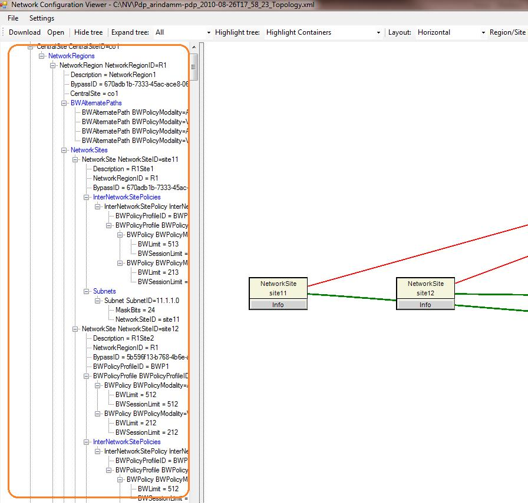

# <a name="skype-for-business-server-2015-resource-kit-tools-documentation"></a>Documentation sur les outils du Kit de ressources techniques Skype Entreprise Server 2015

Cette rubrique décrit les outils dans le Skype pour le Kit de ressources 2015 Business Server, y compris l’objectif de chaque outil et des exemples de son utilisation. Le Skype pour le Kit de ressources Business Server 2015 contribue à simplifier les tâches de routine pour les administrateurs informatiques qui déploient et gèrent Skype pour Business Server 2015. Par exemple, l’outil **Web Conf Data** permet de contrôler aisément les données téléchargées par les utilisateurs au cours d’une réunion en ligne. L’outil **SEFAUtil** permet de définir le transfert des appels de délégué et le répondeur automatique pour les utilisateurs. Nous recommandons d’utiliser ces outils pour gérer plus efficacement Skype pour Business Server 2015, les administrateurs informatiques.

## <a name="installation-of-the-resource-kit-tools"></a>Installation des outils du kit de ressources

Pour installer le Skype pour le Kit de ressources Business Server 2015, téléchargez [OCSReskit.msi](https://www.microsoft.com/en-us/download/details.aspx?id=52631) à partir du centre de téléchargement.

Exécutez **OCSResKit.msi ** pour effectuer une installation simple. Le fichier .msi installe tous les outils dans le chemin d’accès suivant :  **%Program Files%\Skype for Business Server 2015\ResKit**. Les outils exécutables autonomes se trouvent dans ce dossier. Les outils comportant également des fichiers de prise en charge se trouvent dans leur propre sous-dossier.

## <a name="supported-environments"></a>Environnements pris en charge

Le Skype pour le Kit de ressources 2015 Business Server doit être installé sur un serveur qui répond aux spécifications requises pour Skype pour Business Server 2015, généralement un utilisé pour exécuter Skype pour Business Server 2015.

## <a name="resource-kit-tools-overview"></a>Présentation des outils du kit de ressources

Voici une liste des outils fournis dans le Skype pour le Kit de ressources Business Server 2015. Une description de chaque outil (configuration requise et exemple d’utilisation compris) est incluse dans les sections suivantes.

- [ABSConfig](resource-kit-tools.md#ABSConfig)

- [Bandwidth Policy Service Monitor](resource-kit-tools.md#bpsm)

- [Bandwidth Utilization Analyzer](resource-kit-tools.md#bua)

- [Call Parkometer](resource-kit-tools.md#callpark)

- [DBAnalyze](resource-kit-tools.md#dba)

- [Import Storage Service Data](resource-kit-tools.md#Issd)

- [LCSSync](resource-kit-tools.md#LCSSync)

- [Lookup User Console](resource-kit-tools.md#LUC)

- [MsTurnPing](resource-kit-tools.md#MsTurnPing)

- [Network Configuration Viewer](resource-kit-tools.md#NCV)

- [Response Group Agent Live](resource-kit-tools.md#RGAL)

- [SEFAUtil](resource-kit-tools.md#SEFAUtil)

- [SYSPrep.ps1](resource-kit-tools.md#SYSPrep)

- [Unassigned Number Announcements Migration](resource-kit-tools.md#UNAM)

- [Web Conf Data](resource-kit-tools.md#WebConfData)

## <a name="absconfig"></a>ABSConfig
<a name="ABSConfig"> </a>

L’outil de Configuration du Service carnet adresse (ABSConfig) est un outil d’administration qui permet aux administrateurs de personnaliser la configuration du Service carnet d’adresses dans Skype pour Business Server 2015. Cet outil permet également de Skype pour les administrateurs d’entreprise Server 2015 restaurer les paramètres du Service carnet d’adresses par défaut.

### <a name="description"></a>Description

ABSConfig est une application d’interface utilisateur graphique qui permet aux administrateurs de configurer les attributs de Services de domaine Active Directory qui sont liées au Service de carnet d’adresses.

Les principaux scénarios suivants s’appliquent à l’outil :

- Pour permettre aux administrateurs de mapper des attributs dans les Services de domaine Active Directory pour les attributs pour Skype pour Business Server 2015.

- permettre aux administrateurs de spécifier un attribut des services de domaine Active Directory à inclure dans les fichiers du service de carnet d’adresses ou à exclure de ceux-ci ;

- permettre aux administrateurs de restaurer les paramètres par défaut du service de carnet d’adresses.

L’outil ABSConfig peut être démarré à l’aide du fichier ABSConfig.exe. L’outil s’ouvre dans l’onglet **Configurer les attributs** . Cette table contient les options pour mapper les attributs Active Directory Domain Services pour les champs d’attribut pour Skype pour Business Server 2015 et pour spécifier les utilisateurs à inclure ou exclure des fichiers du Service carnet d’adresses en fonction de filtres d’attribut spécifique. D’autres options permettent de personnaliser la valeur du numéro de téléphone à inclure dans le fichier de carnet d’adresses. L’option **Restore Defaults (Paramètres par défaut) ** permet aux administrateurs de restaurer les valeurs par défaut des paramètres du service de carnet d’adresses.

> [!NOTE]
> Mappage d’attributs Active Directory à des noms de champ OC différents ne fonctionnera seulement pour le téléchargement de fichier de carnet d’adresses et n’est pas pris en charge par la requête sur le Web du carnet d’adresses.

### <a name="output"></a>Sortie

ABSConfig stocke la configuration du service de carnet d’adresses dans la base de données.

```
Path: %ProgramFiles%\Skype for Business Server 2015\Reskit
```

### <a name="purpose"></a>Objectif

ABSConfig fournit un moyen simple et rapide pour personnaliser Skype pour le Service de carnet d’adresses Business Server 2015.

### <a name="requirements"></a>Configuration requise

#### <a name="computer"></a>Ordinateur

ABSConfig peut être exécutée que sur un ordinateur à un domaine avec Skype pour Business Server 2015 est installé. Dans le cas de Skype pour Business Server 2015, Enterprise Edition, cet outil peut être exécuté sur tous les serveurs frontaux dont le Service de carnet d’adresses pendant l’installation.

#### <a name="network"></a>Réseau

L’ordinateur doit pouvoir se connecter au pool frontal et à la base de données principale.

#### <a name="software"></a>Logiciels

Les composants logiciels suivants doivent être installés avant d’exécuter l’outil ABSConfig :

- Skype Entreprise Server 2015

#### <a name="users"></a>Utilisateurs

Administrateurs qui disposent des autorisations requises pour mettre à jour le Skype pour le déploiement de Business Server 2015.

### <a name="examples"></a>Exemples

ABSConfig peut être démarré en tapant **ABSConfig.exe** dans une invite de commandes. L’interface utilisateur de l’outil ABSConfig se présente comme suit :


### <a name="summary"></a>Résumé

L’outil ABSConfig fournit aux administrateurs un outil rapide et facile à utiliser pour personnaliser Skype pour le Service de carnet d’adresses Business Server 2015.

## <a name="bandwidth-policy-service-monitor"></a>Bandwidth Policy Service Monitor
<a name="bpsm"> </a>

L’outil Bandwidth Policy Service Monitor permet aux administrateurs d’afficher la liste des éléments suivants :

1. Tous le Skype configuré pour les services de stratégie de bande passante Business Server 2015 (authentification et Core) dans la topologie

2. connexions effectuées par chaque service aux autres services de stratégie de bande passante et aux serveurs Edge ;

3. liaisons configurées dans le document de configuration du réseau et utilisation de la bande passante en temps réel, telle que signalée par les services de stratégie de bande passante individuels.

### <a name="description"></a>Description

L’outil Bandwidth Policy Service Monitor est implémenté sous la forme d’une application à interface utilisateur graphique. Les administrateurs démarrent l’outil en exécutant PDPMonUI.exe.

Lorsque l’outil démarre, il tente de découvrir la liste des services de stratégie de bande passante dans la topologie. Une fois la mise à jour initiale effectuée, le volet situé à gauche de la fenêtre reçoit une liste de services regroupés selon les clusters auxquels ils appartiennent.

Lorsque les administrateurs sélectionnent un service de stratégie de bande passante particulier, le volet situé à droite affiche les informations relatives à ce service particulier. Ce volet inclut également deux onglets principaux qui affichent des informations.

#### <a name="machine-info-tab"></a>Onglet Machine Info (Informations sur l’ordinateur)

L’onglet **Machine Info (Informations sur l’ordinateur)** fournit des informations sur le service de stratégie de bande passante sélectionné, ainsi que la liste et l’état des connexions effectuées par le service de stratégie de bande passante sélectionné aux autres services.

#### <a name="topology-info-tab"></a>Onglet Topology Info (Informations sur la topologie)

L’onglet **Topology Info (Informations sur la topologie)** affiche la liste des liaisons configurées dans les paramètres de configuration du réseau. Pour chaque liaison, la capacité de bande passante audio et vidéo est indiquée. La bande passante actuellement utilisée est également indiquée, en Kbps et en pourcentage de la capacité. L’outil utilise des couleurs pour mettre en valeur les liaisons dont l’utilisation atteint presque la capacité maximale afin que les administrateurs puissent les isoler rapidement.

> [!NOTE]
>  Si l’outil Analyseur de Service de stratégie de bande passante défaillance lorsqu’il se connecte à un service de stratégie de bande passante configuré, les informations contenues dans les onglets **Des informations de topologie** et les **Informations de l’ordinateur** ne sont pas remplies. Il est toutefois possible que l’outil se connecte avant de perdre la connexion au service. En pareil cas, les administrateurs peuvent voir des informations obsolètes. Les onglets incluent des informations d’horodatage (**Last Updated (Dernière mise à jour)**) qui permettent aux administrateurs de voir la date/l’heure de la dernière mise à jour des données pour un service de stratégie de bande passante particulier.

### <a name="output"></a>Sortie

Il n’y a aucune sortie de ligne de commande. La sortie du programme apparaît dans l’interface utilisateur graphique principale.

### <a name="purpose"></a>Objectif

L’outil Bandwidth Policy Service Monitor permet aux administrateurs de consulter l’état des services de stratégie de bande passante définis dans la topologie. Ils peuvent également voir l’utilisation de la bande passante en temps réel pour toutes les liaisons définies dans le document de configuration du réseau.

### <a name="requirements"></a>Configuration requise

L’outil Analyseur de Service de stratégie de bande passante doit être exécuté sur un ordinateur qui fait partie de la Skype pour la topologie du serveur d’entreprise.

### <a name="summary"></a>Résumé

L’outil Bandwidth Policy Service Monitor est utile pour contrôler l’état des services de stratégie de bande passante dans la topologie et connaître l’utilisation de la bande passante en temps réel pour les liaisons définies dans les paramètres de configuration du réseau.

## <a name="bandwidth-utilization-analyzer"></a>Bandwidth Utilization Analyzer
<a name="bua"> </a>

L’outil Bandwidth Utilization Analyzer crée des rapports sur divers affichages de la consommation de bande passante par les points de terminaison d’UC entre les liaisons de réseau étendu dans le réseau d’entreprise. Ces rapports permettent d’identifier le modèle actuel de consommation de la bande passante et de planifier la capacité de bande passante.

### <a name="description"></a>Description

Bandwidth Utilization Analyzer est implémenté sous la forme d’une application à interface utilisateur graphique. Cet outil génère des rapports spécifiques sur l’utilisation de la bande passante audio dans le réseau et constitue une aide pour planifier la capacité. Il traite également la capacité de bande passante affectée aux diverses liaisons par itération.

### <a name="output"></a>Sortie

Bandwidth Utilization Analyzer offre une représentation graphique de la capacité de bande passante et de l’utilisation de la bande passante audio pour les liaisons de réseau étendu configurées dans le système.

### <a name="purpose"></a>Objectif

Dans n’importe quel vocal et vidéo déploiement, il est fondamental pour surveiller et comprendre les tendances d’utilisation de la bande passante du trafic multimédia entre le réseau d’entreprise. L’outil Bandwidth Utilization Analyzer permet aux administrateurs d’y parvenir. L’outil effectue les opérations suivantes :

- génère des rapports spécifiques sur l’utilisation de la bande passante audio dans le réseau ;

- permet de planifier la capacité plus efficacement et de traiter la capacité de bande passante affectée aux diverses liaisons par itération.

Bandwidth Utilization Analyzer peut générer une représentation graphique des rapports sur la capacité et l’utilisation de la bande passante, comme suit :

- liaisons de réseau étendu au sein du réseau d’entreprise ;

- filtrage des liaisons de réseau étendu sélectionnées ;

- filtrage des liaisons de réseau étendu ayant dépassé leur capacité ;

- filtrage des liaisons de réseau étendu ayant sous-utilisé la bande passante approvisionnée ;

- filtrage des liaisons de réseau étendu ayant atteint des niveaux critiques (utilisation de la bande passante supérieure à 90 % de la capacité de bande passante de la liaison de réseau étendu) ;

- filtrage selon le type de liaison de réseau étendu (liaisons réseau-site, liaisons inter-régions et liaisons au sein d’un site) ;

- filtrage par région réseau.

#### <a name="applications"></a>Applications

Bandwidth Utilization Analyzer inclut les deux applications (outils) suivantes :

- **WanLinkLogCollector.exe** cet outil permet à un utilisateur d’entrer les informations requises.

- **BandwidthUtilizationAnalyzer.xlsm** rapport de logiciel de feuille de calcul Excel de Microsoft A lancé automatiquement par WanLinkLogCollector.exe. Cette application permet à l’utilisateur d’appliquer des filtres au rapport, comme indiqué plus loin dans cet article.

#### <a name="phases-of-using-bandwidth-utilization-analyzer"></a>Phases d’utilisation de Bandwidth Utilization Analyzer

L’utilisation de Bandwidth Utilization Analyzer implique deux phases :

- collecte des journaux, effectuée à l’aide de WanLinkLogCollector.exe ;

- personnalisation des rapports, effectuée à l’aide de BandwidthUtilizationAnalyzer.xlsm.

> [!IMPORTANT]
> Il est recommandé que BandwidthUtilizationAnalyzer.xlsm ne soit pas démarré manuellement par les utilisateurs finaux.

#### <a name="starting-bandwidth-utilization-analyzer"></a>Démarrage de Bandwidth Utilization Analyzer

Démarrez WanLinkLogCollector.exe dans une invite de commandes ou à l’aide de l’Explorateur Windows.

 **Utilisation de WanLinkLogCollector.exe**

L’utilisation de WanLinkLogCollector.exe comporte trois étapes :

1. **Journal de la chronologie** Fournir la chronologie qui doit être généré pour le rapport

2. **Spécifiez le répertoire de fichiers** Fournir des informations d’emplacement de fichier

3. **Collecter les journaux et lancer la visionneuse de rapports** Exécutez la commande de génération du rapport

#### <a name="step-1---log-the-timeline"></a>Étape 1 - Définition de la chronologie

La définition de la chronologie permet à l’utilisateur de l’outil de spécifier les éléments suivants, comme indiqué dans la figure suivante. 

1. **Date de début** Date de début de la chronologie pour laquelle le rapport doit être généré (par exemple, 1er août 2010).

2. **Date de fin** Date de fin de la chronologie pour laquelle le rapport doit être généré (par exemple, 30 septembre 2010).

     

#### <a name="step-2---specify-the-file-directories"></a>Étape 2 - Définition des répertoires de fichiers

Les répertoires de fichiers suivants peuvent être spécifiés par l’utilisateur, comme indiqué.

- **Emplacement des fichiers journaux serveur** L’emplacement du dossier où sont stockés les journaux de serveur de stratégie de bande passante. Il s’agit généralement de \<réussies\>\\<choice de FE\>\AppServerFiles\PDP.

- **Emplacement de stockage des fichiers temporaires** L’emplacement de fichier temporaire où sont stockés les fichiers intermédiaires pendant que le rapport est généré.


> [!NOTE]
> Vérifiez que l’utilisateur de l’outil dispose d’un accès suffisant aux journaux de serveur et au dossier du magasin des fichiers temporaires.

#### <a name="step-3---collect-the-logs-and-start-the-report-viewer"></a>Étape 3 - Collecte des journaux et démarrage de la visionneuse de rapports

Pour collecter les journaux et démarrer la visionneuse de rapports, cliquez sur **Execute (Exécuter)** comme indiqué ci-dessous. Cette opération permet de collecter les données requises.


Une fois le contenu saisi validé, le message suivant apparaît.


Cliquez sur **OK**. BandwidthUtilizationAnalyzer.xlsm démarre automatiquement. Suivez les instructions du message. Pour plus d’informations, voir **Utilisation de BandwidthUtilizationAnalyzer.xlsm ** dans la section suivante.


### <a name="using-bandwidthutilizationanalyzerxlsm"></a>Utilisation de BandwidthUtilizationAnalyzer.xlsm

1. Une fois BandwidthUtilizationAnalyzer.xlsm démarré automatiquement, cliquez sur **Refresh (Actualiser)**, comme indiqué ci-dessous.

     

2. Si un dossier de fichiers est ouvert, sélectionnez consolidated.csv à l’emplacement spécifié dans le message, comme indiqué ci-dessous. L’emplacement du répertoire **C:\Temp** est également indiqué.

     

3. Cliquez sur **Import (Importer)**.

4. La représentation graphique est générée automatiquement. Elle est disponible lorsque le pointeur de traitement en arrière-plan disparaît.

     

#### <a name="applying-filters-to-the-report-view"></a>Application de filtres à l’affichage du rapport

Les filtres suivants peuvent être appliqués à l’affichage du rapport :


1. **Name (Nom)** Filtrage des liaisons de réseau étendu (le filtre apparaît dans la partie droite du graphique). Le préfixe représente les types de liaisons suivants (voir l’encadré bleu vertical) :

   - **S Site (S (site))** Liaison de réseau étendu entre un site réseau et une région réseau

   - **IS Inter-Site (IS (intersite))** Liaison de réseau étendu entre deux sites réseau

   - **R Inter-Region (R (inter-régions))** Liaison de réseau étendu entre deux régions réseau

2. **Exceeded limit (Limite dépassée)** Filtrage des liaisons de réseau étendu pour lesquelles l’utilisation de la bande passante est supérieure à la capacité de bande passante

3. **Critical levels (Niveaux critiques)** Filtrage des liaisons de réseau étendu pour lesquelles l’utilisation de la bande passante a atteint 90 % ou plus de la capacité de bande passante

4. **Under-utilized (Sous-utilisé)** Filtrage des liaisons de réseau étendu pour lesquelles l’utilisation de la bande passante est inférieure à 25 % de la capacité de bande passante

5. **Link type (Type de liaison)** Filtrage des types de liaisons de réseau étendu suivants :

   - **Network site (Site réseau)**

   - **Inter-site (intersite)**

   - **Inter-Region (Inter-régions)**

6. **Region (Région)** Filtrage de la région réseau

Les figures suivantes présentent les filtres décrits précédemment.

Filtrage sur **Name (Nom)**. Sélectionnez la liste des liaisons devant être affichées dans le graphique.


Filtrage sur **Exceeded limit (Limite dépassée)**. Sélectionnez **True ** pour appliquer le filtre.


Filtrage sur **Critical levels (Niveaux critiques)**. Sélectionnez **True** pour appliquer le filtre.


Filtrage sur **Under utilized (Sous-utilisé)**. Sélectionnez **True** pour appliquer le filtre.


Filtrage sur **Link Type (Type de liaison)**. Sélectionnez le ou les types devant être affichés.


Filtrage sur **Region (Région)**. Sélectionnez la liste des régions pour lesquelles afficher les liaisons.


### <a name="requirements"></a>Configuration requise

- .NET Framework 3.5

- Microsoft Excel 2010 ou Excel 2007

### <a name="summary"></a>Résumé

Bandwidth Utilization Analyzer permet de représenter l’utilisation de la bande passante audio pour le trafic des communications unifiées dans le réseau. Il permet également de créer des rapports sur l’utilisation de la bande passante vidéo dans le réseau.

## <a name="call-parkometer"></a>Call Parkometer
<a name="callpark"> </a>

L’application en ligne de commande Call Parkometer permet d’accéder facilement à la base de données des orbites de parcage d’appel.

### <a name="description"></a>Description

L’outil Call Parkometer permet de suivre les appels actuellement parqués. Il collecte également des statistiques sur les orbites et l’utilisation du serveur de parcage d’appel. Cet outil de ligne de commande fournit à la fois en lecture et accès en écriture à l’orbite CPS de base de données SQL Server à partir d’un ordinateur local ou connecté à distance.

Toutes les options s’excluent mutuellement. La syntaxe suivante est appliquée à la ligne de commande :

- paramètre **-o** — listes des orbites toutes les plages configurées pour ce pool.

- paramètre **n-** — listes utilisées toutes les orbites de ce pool. Les informations suivantes sont affichées :

  - URI (Uniform Resource Identifier) SIP du parqué et du parqueur.

  - Nom d’hôte du serveur de parcage d’appel sur lequel l’appel est parqué.

  - Date/heure du parcage de l’appel.

- paramètre **-f** — indique le nombre d’orbites libres dans le pool.

- **r - \<n\> ** paramètre — répertorie les \<n\> dernier mis en garde d’appels. Les informations suivantes sont affichées :

  - URI SIP du parqué.

  - URI SIP du parqueur.

  - Nom d’hôte du serveur de parcage d’appel sur lequel l’appel est parqué.

  - Date/heure de récupération ou d’abandon de l’appel.

- **-t\<n\> ** paramètre - teste la réservation d’une orbite dans la base de données pour afficher le caractère aléatoire des numéros d’orbite affecté.

### <a name="output"></a>Sortie

Selon les paramètres d’entrée spécifiés dans l’invite de commandes, l’outil Call Parkometer affiche la sortie suivante :

- plages d’orbites configurées pour ce pool ;

- appels actuellement parqués ;

- nombre d’orbites libres (disponibles) ;

- appels parqués récemment ;

- orbites réservées pour le test des valeurs d’orbite uniformes et aléatoires.

### <a name="purpose"></a>Objectif

L’outil CPS vie à fournir un accès par ligne de commande à la base de données du serveur de parcage d’appel. L’administrateur peut consulter l’utilisation du serveur de parcage d’appel et déterminer le nombre d’orbites affectées à un pool.

### <a name="requirements"></a>Configuration requise

Aucune configuration n’est requise si cet outil est exécuté sur l’ordinateur qui exécute le serveur de parcage d’appel. Si cet outil est exécuté sur un ordinateur distant, la base de données SQL Server utilisé par Skype pour Business Server 2015 doit être configuré pour autoriser l’accès à distance. Appel Parkometer doit être configuré avec une chaîne de connexion de base de données SQL Server pour se connecter à SQL Server du pool. Cette chaîne de connexion de base de données SQL Server est définie dans le fichier de configuration **parkometer.exe.config**. Il doit être placé dans le même répertoire où se trouve parkometer.exe. Le fichier XML suivant est un exemple d’un parkometer.exe.config. Les paramètres qui doivent être configurés sont nom d’utilisateur (par exemple, mydomain\Administrator), le mot de passe (par exemple, MonMotdePasse) et nom d’hôte (par exemple, myserver).

```
<?xml version="1.0" encoding="utf-8" ?>
<configuration>
  <appSettings>
   <add key="SQL" value="server=myserver\RTC;
database=cpsdyn;
User Id=mydomain\Administrator;
Password=mypassword.;
Integrated Security=false;"/>
  </appSettings>
</configuration>
```

### <a name="examples"></a>Exemples

Déployé les plages d’orbites : le paramètre -o répertorie toutes les plages d’orbites qui sont configurés pour ce pool comme


Actuellement mis en garde d’appels : le paramètre - n répertorie toutes les orbites actuellement utilisés dans ce pool comme


Nombre d’orbites gratuits : le paramètre -f indique le nombre d’orbites libres dans le pool comme


Récemment mis en garde d’appels : - r \<n\> listes de paramètres de la \<n\> dernier parcage d’appels comme


Réservation de l’orbite de test : -t \<n\> paramètre teste réserver une orbite dans la base de données comme


### <a name="summary"></a>Résumé

L’outil en ligne de commande Call Parkometer fournit des informations détaillées sur le serveur de parcage d’appel.

## <a name="dbanalyze"></a>DBAnalyze
<a name="dba"> </a>

### <a name="description"></a>Description

DBAnalyze est un outil de ligne de commande qui aide les administrateurs à collecter les rapports d’analyse sur le Skype pour les bases de données métiers Server 2015. DBAnalyze inclut les modes suivants : diagnostic, données des utilisateurs, conférence, unités de contrôle multipoint et fragmentation des disques :

- **Mode de diagnostic** Crée un rapport qui consacrée des informations sur les tables (nombre d’enregistrements, la fragmentation, taille des données et taille de l’index), taille des fichiers journaux et de données, la dernière exécution de sauvegarde, distribution des contacts entre les serveurs qui exécutent Microsoft Office Communications Server, le Nombre moyen d’autorisations, contacts, conteneurs, abonnements, publications, points de terminaison par utilisateur, les utilisateurs mal hébergés, les utilisateurs qui ne peuvent pas être routés, le nombre moyen de conférences organisées par utilisateur, les conférences planifiées, les conférences actives, et la version de base de données.

    > [!NOTE]
    > L’exécution du mode Diagnostic peut affecter les performances des serveurs.

- **Mode de données utilisateur** Contact de rapports, conteneur, abonnement, publication, autorisation et données groupe de contacts d’un utilisateur spécifié ou pour les utilisateurs qui disposent de cet utilisateur dans leurs listes de contacts et d’autorisation. Ce mode transmet également des données résumées sur les conférences organisées par un utilisateur ou auxquelles il est invité.

- **Mode conférence** Rapports des données détaillées pour une conférence spécifique, y compris toutes les informations de planification au moment de la conférence, la liste de l’invité, la liste des types de médias autorisés pour la conférence, active MCU (unités de contrôle multipoint), la liste des participants active et chacun état de signalisation du participant.

- **ID de la réunion de décodage** Décode un réseau téléphonique commuté (RTC) ID qui est spécifiée par le commutateur **/pstnid** , mais ne pas se connecte au serveur principal pour des informations détaillées de la réunion.

- **Résoudre la conférence** Décode un ID de conférence PSTN qui est spécifié par le commutateur **/pstnid** et affiche des informations sur la conférence indiquée par le code.

- **Mode MCU** Rapporte les ID, type de média, URL, état de pulsation, charge de conférence et charge participant pour chaque MCU dans le pool.

- **Mode de la fragmentation de disque** Affiche l’état de la fragmentation de tous les disques.

Cet outil permet de diagnostiquer plusieurs problèmes ou de planifier la capacité. Par exemple, si la plupart des utilisateurs hébergés sur un serveur A définissent des utilisateurs hébergés sur le serveur B comme contacts, l’administrateur peut déplacer les utilisateurs du serveur A vers le serveur B afin de réduire le trafic entre les serveurs.

### <a name="output"></a>Sortie

Cet outil génère des rapports sur le Skype pour la base de données Business Server 2015 prédéfinis. **Chemin d’accès**: %ProgramFiles%\Skype for Business Server 2015\Reskit

### <a name="purpose"></a>Objectif

Installer Dbanalyze.exe, copiez-le dans un dossier local, puis exécuter l’outil. Pour utiliser l’outil, exécutez la commande suivante à partir de la ligne de commande. `dbanalyze.exe [/v] [/report:value] [/sqlserver:value] [/user:user@domain.com] [/conf:value][/pstnid:Value] [/maxcontacts:value]`Les descriptions des options de ligne de commande sont présentées ci-dessous.


### <a name="requirements"></a>Configuration requise

 **Ordinateur** DBAnalyze peut être exécutée que sur un ordinateur à un domaine avec Skype pour Business Server 2015 est installé.

 **Réseau** L’ordinateur doit pouvoir se connecter à la base de données principale.

 **Logiciel** Skype pour les composants logiciels Business Server 2015 doit être installé avant d’exécuter DBAnalyze.

 **Utilisateurs** Le tableau ci-dessous indique les administrateurs disposant des autorisations nécessaires pour accéder à des bases de données métiers Server 2015 Skype.


> [!NOTE]
> Un compte d’administrateur local est nécessaire pour le mode **/report:disk**.

### <a name="examples"></a>Exemples

Les exemples suivants constituent des commandes Dbanalyze.exe correctes :

```
dbanalyze.exe /report:diag
dbanalyze.exe /report:user /user:usera@domainb.com
dbanalyze.exe /report:conf /user:bob@example.com /conf:1W9J71SKSX2X
dbanalyze.exe /report:resolve /pstnid:12345
dbanalyze.exe /report:mcus
dbanalyze.exe /report:disk
```

### <a name="summary"></a>Résumé

DBAnalyzer fournit aux administrateurs un rapide et facile à analyser Skype pour les bases de données métiers Server 2015.

## <a name="import-storage-service-data"></a>Import Storage Service Data
<a name="Issd"> </a>

L’outil de kit de ressources ImportStorageServiceData permet de réimporter les données de file d’attente et de point de terminaison éliminées du service de stockage Lync Server dans le service de stockage.

### <a name="description"></a>Description

L’élimination de données du service de stockage peut être automatique (périodique) selon le statut des éléments de file d’attente ou la taille de la base de données. Elle peut survenir suite à l’invocation manuelle de l’applet de commande de basculement du pool ou StorageServiceFullFlush (invoquée par l’applet de commande de basculement du pool). Notez que les données doivent idéalement pas être nouveau importées si un de la taille de base de données de Service de stockage (LYSS) sur les serveurs frontaux est supérieure au niveau normal, car cela simplement risque de plus de données doivent être exportées arrière. En outre, les problèmes qui aurait peuvent contribuer à des erreurs qui a provoqué la file d’attente du Service de stockage pour augmenter au doivent tout d’abord être résolus (pour les erreurs de point de terminaison exemple Exchange, problèmes liés au réseau ou d’autres problèmes).

 **Scénario 1 :** lors du basculement du pool, les fichiers peuvent être éliminés du service de stockage de chaque serveur frontal. Une fois le basculement terminé, l’outil doit être exécuté pour réimporter les données.

 **Scénario 2 :** les données sont éliminées automatiquement chaque jour ou suite au dépassement de certains seuils de taille par la base de données du service de stockage (par exemple, 60 %, 80 %, 90 % de remplissage). Ces données éliminées automatiquement doivent être régulièrement réimportées par l’administrateur. Dans ce cas, si le pack SCOM surveillance n’est pas déployé, il existe événements pour Skype pour Service de stockage Business Server relatives aux données à partir du Service de stockage en cours de vidage. Les ID d’événement 32075 (démarrage du vidage complet), 32076 (fin du vidage complet), 32082 (démarrage du vidage de niveau maintenance), 32083 (fin du vidage de niveau maintenance), 32089 (vidage effectué à cause du remplissage de la base de données). Notez que ces ID d’événement correspondent à la version finale. Lorsqu’un administrateur voit ces événements, cela signifie qu’il existe des fichiers qui ont été vidées. Ces données doivent être importées régulièrement à l’aide de cet outil, par exemple une fois par semaine.

Pour la version de Service en ligne, si l’intégrité de la surveillance pack SCOM Skype pour Business Server est déployée, il existe nouvelles alertes qui peuvent être déclenchés demandez à l’administrateur réimporter les données vidées au Service de stockage. Il y aura un événement correspondant dans le journal des événements sur le serveur frontal qui a déclenché l’alerte. L’événement fournira une description du chemin Parent sous lequel se trouvent les fichiers de données vidées, ainsi que la manière dont beaucoup de fichiers est qui répondent aux critères d’alerte. Les critères d’alerte est que sont X ou plusieurs fichiers sous le chemin d’accès parent particulier qui sont moins Y jours (où X et Y sont prédéfinies dans la StorageService mais peuvent être remplacé en modifiant le fichier APPCONFIG.) Deux exemples d’événements qui peuvent déclencher l’alerte d’intégrité sont présentés ci-dessous, avec la différence en cours de leur chemin d’accès parent. Il est possible sous partage de fichiers du service Web, tandis que l’autre est le répertoire de données d’Application local de chaque serveur frontal. (par exemple c:\ProgramData\Microsoft\Skype pour 2015\StorageService Business Server). L’administrateur exécuter cet outil du Kit de ressources.

Cet outil augmente la charge processeur et d’E/S sur le serveur frontal sur lequel il est exécuté, ainsi que sur les autre serveurs frontaux, si les données n’appartiennent pas au serveur frontal sur lequel l’outil est exécuté. Il est recommandé d’exécuter cet outil lorsque les serveurs frontaux ne sont pas soumis à une charge processeur et d’E/S importante, par exemple en dehors des heures de pointe. Deuxièmement, cet outil peut prendre 2 à 3 minutes pour importer un fichier de données. Vous devez garder cette information à l’esprit lorsque vous cherchez à estimer le délai d’exécution de l’outil. Le fichier journal détaillé généré par l’outil apparaît par défaut dans le magasin de fichiers. Supprimez-le si aucune erreur n’est signalée, car la taille de celui-ci peut atteindre plusieurs Mo, voire davantage.


### <a name="requirements"></a>Configuration requise

Installez le Skype pour les outils du Kit de ressources Business Server 2015. L’outil s’exécute sur des ordinateurs à un domaine où sont installés Skype pour Business Server et Skype pour Business Server Management Shell. L’outil utilise une applet de commande management shell pour identifier tous les serveurs frontaux du pool. Ensuite, l’outil doit être exécuté à partir d’un ordinateur dans le pool qui a installé la base de données **RtcLocal** . Cette base de données est utilisée par l’outil pour récupérer l’emplacement du partage de fichier WEBSERVICE pour le pool. En outre, avant d’utiliser l’outil, chaque serveur frontal devez d’abord activer Windows PowerShell distante à l’aide de **Enable-PSRemoting** sur chaque serveur frontal, ainsi que l’ordinateur sur lequel l’outil est exécuté. Dans le cas contraire, les commandes Windows PowerShell à distance à partir de cet outil échoue. Accès à distance de Windows PowerShell peut être désactivée sur tous les serveurs frontaux du pool après que l’opération est terminée. Enfin, l’ou les informations d’identification de l’appel de l’outil doivent disposer d’autorisation de lecture/écriture pour le partage de fichiers webservice pour qu’ils sont exécutent cet outil sur le pool de. Dans le cas contraire, l’outil échouera avec des erreurs d’autorisation d’e/s.

> [!NOTE]
> Sur Windows Server 2012, la communication à distance de Windows PowerShell est activée par défaut, mais pas sur le système d’exploitation Windows Server 2008.

### <a name="examples"></a>Exemples

```
>  C:\StorageService>ImportStorageServiceData.exe
Description:
This tool will re-import Storage Service (LYSS) flushed queue data back in.  For a pool: you are required to run this tool on a machine inside the pool which has the Lync Server Management Shell installed.  Additionally, all front end machines need to have Windows Powershell Remoting enabled before executing this tool by executing Enable-PSRemoting.  Also, please ensure that all Storage Service instance DB Size are at the 'Normal' level (verify this by viewing Eventlog events). Otherwise re-importing may cause data to be flushed out again if any Storage Service instance DB size level goes above 'Normal'.
Usage: Default behavior is to Import data from web service file share as well as any files on all Front End machines in pool.
Additional Options:
-Verbose                    : Turn verbose output on.

-StorageServiceHostName     : Host Name of Storage Service WCF endpoint.  ( Default=localhost netnamedpipe binding. )

-FileSharePath              : Import only all data from just under the UNC path specified.

ActivityID: cc3b62ff-bb66-4e61-a6e2-96cb3626315c. <-- Use this to correlate with StorageService trace logs if troubleshooting.
Type Server name (TCP binding) or press <enter> for localhost (NamePipe binding):
Using NetNamedPipeBinding...
OnTopologyChanged Event received
Web Service File Share: \\dc.vdomain.com\OcsFileStore\co1-WebServices-1\StorageService

Front Ends:
server.vdomain.com
server2.vdomain.com
server1.vdomain.com
server3.vdomain.com
Looking under directory: \\dc.vdomain.com\OcsFileStore\co1-WebServices-1\StorageService for exported data.
# Files found: 8
Starting Import for file:\\dc.vdomain.com\OcsFileStore\co1-WebServices-1\StorageService\DataExport\2
0120910\SERVER.vdomain.com\944f5724c65c5f93900dc1c8c898b102__0.xml
Items deserialized: 20

All items in file were enqueued successfully, will try to delete file: \\dc.vdomain.com\OcsFileStore\co1-WebServices-1\StorageService\DataExport\20120910\SERVER.vdomain.com\944f5724c65c5f93900dc1c8c898b102__0.xml

All items in file failed to enqueue so file will not be deleted.  File path: \\dc.vdomain.com\OcsFileStore\co1-WebServices-1\StorageService\DataExport\20120910\SERVER.vdomain.com\944f5724c65c5f93900dc1c8c898b102__0.xml

Summary for file \\dc.vdomain.com\OcsFileStore\co1-WebServices-1\StorageService\DataExport\20120910\SERVER.vdomain.com\944f5724c65c5f93900dc1c8c898b102__0.xml: succeeded: 20, failed: 0

Starting Import for file:\\dc.vdomain.com\OcsFileStore\co1-WebServices-1\StorageService\DataExport\20120910\SERVER1.vdomain.com\17d5435ae40259f7bbdf1866776386e4__0.xml
Items deserialized: 20

[cc3b62ff-bb66-4e61-a6e2-96cb3626315c] Send EnqueueMessages to redirected, targetServer=server1.vdomain.com, queueItems=20

All items in file were enqueued successfully, will try to delete file: \\dc.vdomain.com\OcsFileStore\co1-WebServices-1\StorageService\DataExport\20120910\SERVER1.vdomain.com\17d5435ae40259f7bbdf1866776386e4__0.xml

All items in file failed to enqueue so file will not be deleted.  File path: \\dc.vdomain.com\OcsFileStore\co1-WebServices-1\StorageService\DataExport\20120910\SERVER1.vdomain.com\17d5435ae40259f7bbdf1866776386e4__0.xml

Summary for file \\dc.vdomain.com\OcsFileStore\co1-WebServices-1\StorageService\DataExport\20120910\
SERVER1.vdomain.com\17d5435ae40259f7bbdf1866776386e4__0.xml: succeeded: 20, failed: 0

Starting Import for file:\\dc.vdomain.com\OcsFileStore\co1-WebServices-1\StorageService\DataExport\20120910\SERVER1.vdomain.com\904f6c9b8ac951ae8b3c86684d3832e4__0.xml

Items deserialized: 20
[cc3b62ff-bb66-4e61-a6e2-96cb3626315c] Send EnqueueMessages to redirected, targetServer=server1.vdomain.com, queueItems=20

All items in file were enqueued successfully, will try to delete file: \\dc.vdomain.com\OcsFileStore
\co1-WebServices-1\StorageService\DataExport\20120910\SERVER1.vdomain.com\904f6c9b8ac951ae8b3c86684d
3832e4__0.xml

All items in file failed to enqueue so file will not be deleted.  File path: \\dc.vdomain.com\OcsFil
eStore\co1-WebServices-1\StorageService\DataExport\20120910\SERVER1.vdomain.com\904f6c9b8ac951ae8b3c
86684d3832e4__0.xml

Summary for file \\dc.vdomain.com\OcsFileStore\co1-WebServices-1\StorageService\DataExport\20120910\
SERVER1.vdomain.com\904f6c9b8ac951ae8b3c86684d3832e4__0.xml: succeeded: 20, failed: 0

Starting Import for file:\\dc.vdomain.com\OcsFileStore\co1-WebServices-1\StorageService\DataExport\2
0120910\SERVER2.vdomain.com\69844a271e6c5633a1f2b46a42287dd6__0.xml

Items deserialized: 20

[cc3b62ff-bb66-4e61-a6e2-96cb3626315c] Send EnqueueMessages to redirected, targetServer=server2.vdom
ain.com, queueItems=20

All items in file were enqueued successfully, will try to delete file: \\dc.vdomain.com\OcsFileStore
\co1-WebServices-1\StorageService\DataExport\20120910\SERVER2.vdomain.com\69844a271e6c5633a1f2b46a42
287dd6__0.xml

All items in file failed to enqueue so file will not be deleted.  File path: \\dc.vdomain.com\OcsFil
eStore\co1-WebServices-1\StorageService\DataExport\20120910\SERVER2.vdomain.com\69844a271e6c5633a1f2
b46a42287dd6__0.xml

Summary for file \\dc.vdomain.com\OcsFileStore\co1-WebServices-1\StorageService\DataExport\20120910\
SERVER2.vdomain.com\69844a271e6c5633a1f2b46a42287dd6__0.xml: succeeded: 20, failed: 0

Starting Import for file:\\dc.vdomain.com\OcsFileStore\co1-WebServices-1\StorageService\DataExport\2
0120910\SERVER3.vdomain.com\3313935458e35b9b9759e08a15d251e6__0.xml

Items deserialized: 20

[cc3b62ff-bb66-4e61-a6e2-96cb3626315c] Send EnqueueMessages to redirected, targetServer=server3.vdom
ain.com, queueItems=1

All items in file were enqueued successfully, will try to delete file: \\dc.vdomain.com\OcsFileStore
\co1-WebServices-1\StorageService\DataExport\20120910\SERVER3.vdomain.com\3313935458e35b9b9759e08a15
d251e6__0.xml

All items in file failed to enqueue so file will not be deleted.  File path: \\dc.vdomain.com\OcsFil
eStore\co1-WebServices-1\StorageService\DataExport\20120910\SERVER3.vdomain.com\3313935458e35b9b9759
e08a15d251e6__0.xml

Summary for file \\dc.vdomain.com\OcsFileStore\co1-WebServices-1\StorageService\DataExport\20120910\
SERVER3.vdomain.com\3313935458e35b9b9759e08a15d251e6__0.xml: succeeded: 20, failed: 0

Starting Import for file:\\dc.vdomain.com\OcsFileStore\co1-WebServices-1\StorageService\DataExport\2
0120910\SERVER3.vdomain.com\4501e04eae4856059346949ff817c220__0.xml
Items deserialized: 20
[cc3b62ff-bb66-4e61-a6e2-96cb3626315c] Send EnqueueMessages to redirected, targetServer=server3.vdom
ain.com, queueItems=1
All items in file were enqueued successfully, will try to delete file: \\dc.vdomain.com\OcsFileStore
\co1-WebServices-1\StorageService\DataExport\20120910\SERVER3.vdomain.com\4501e04eae4856059346949ff8
17c220__0.xml
All items in file failed to enqueue so file will not be deleted.  File path: \\dc.vdomain.com\OcsFil
eStore\co1-WebServices-1\StorageService\DataExport\20120910\SERVER3.vdomain.com\4501e04eae4856059346
949ff817c220__0.xml

Summary for file \\dc.vdomain.com\OcsFileStore\co1-WebServices-1\StorageService\DataExport\20120910\
SERVER3.vdomain.com\4501e04eae4856059346949ff817c220__0.xml: succeeded: 20, failed: 0
Starting Import for file:\\dc.vdomain.com\OcsFileStore\co1-WebServices-1\StorageService\DataExport\2
0120910\SERVER3.vdomain.com\5ad77443ad955a22a876749be66d5317__0.xml

Items deserialized: 20
[cc3b62ff-bb66-4e61-a6e2-96cb3626315c] Send EnqueueMessages to redirected, targetServer=server3.vdom
ain.com, queueItems=20
All items in file were enqueued successfully, will try to delete file: \\dc.vdomain.com\OcsFileStore
\co1-WebServices-1\StorageService\DataExport\20120910\SERVER3.vdomain.com\5ad77443ad955a22a876749be6
6d5317__0.xml
All items in file failed to enqueue so file will not be deleted.  File path: \\dc.vdomain.com\OcsFil
eStore\co1-WebServices-1\StorageService\DataExport\20120910\SERVER3.vdomain.com\5ad77443ad955a22a876
749be66d5317__0.xml
Summary for file \\dc.vdomain.com\OcsFileStore\co1-WebServices-1\StorageService\DataExport\20120910\
SERVER3.vdomain.com\5ad77443ad955a22a876749be66d5317__0.xml: succeeded: 20, failed: 0
Starting Import for file:\\dc.vdomain.com\OcsFileStore\co1-WebServices-1\StorageService\DataExport\2
0120910\SERVER3.vdomain.com\a11e27ae439a582288d4657eda86b565__0.xml
Items deserialized: 20
[cc3b62ff-bb66-4e61-a6e2-96cb3626315c] Send EnqueueMessages to redirected, targetServer=server3.vdom
ain.com, queueItems=20
All items in file were enqueued successfully, will try to delete file: \\dc.vdomain.com\OcsFileStore
\co1-WebServices-1\StorageService\DataExport\20120910\SERVER3.vdomain.com\a11e27ae439a582288d4657eda
86b565__0.xml
All items in file failed to enqueue so file will not be deleted.  File path: \\dc.vdomain.com\OcsFil
eStore\co1-WebServices-1\StorageService\DataExport\20120910\SERVER3.vdomain.com\a11e27ae439a582288d4
657eda86b565__0.xml
Summary for file \\dc.vdomain.com\OcsFileStore\co1-WebServices-1\StorageService\DataExport\20120910\
SERVER3.vdomain.com\a11e27ae439a582288d4657eda86b565__0.xml: succeeded: 20, failed: 0
All files have been imported into Storage Service for path: \\dc.vdomain.com\OcsFileStore\co1-WebSer
vices-1\StorageService
Importing files for: server.vdomain.com
No files founds.
Importing files for: server2.vdomain.com
No files founds.
Importing files for: server1.vdomain.com
No files founds.
Importing files for: server3.vdomain.com
No files founds.
Writing log: \\dc.vdomain.com\OcsFileStore\co1-WebServices-1\StorageService\ImportStorageServiceData
Log20120910_1609SS
Tool has finished execution.
>  C:\StorageService>
```

## <a name="lcssync"></a>LCSSync
<a name="LCSSync"> </a>

L’outil LCSSync permet de déployer Skype pour le logiciel de communication Business Server 2015 dans un environnement à forêts multiples. Cet outil est utilisé pour synchroniser les utilisateurs et groupes différentes forêts d’utilisateurs comme un Active Directory Domain Services contact, objet à une forêt centrale où Skype pour Business Server 2015 est installé.

### <a name="description"></a>Description

 LCSSync utilise les Services de domaine Active Directory synchronisés objets contacts de la forêt centrale pour permettre aux utilisateurs de Skype pour Business Server. Pour fournir de connexion unique, le compte d’utilisateur principal doit être mappé à l’objet de contact des Services de domaine Active Directory dans la forêt centrale pour Skype pour Business Server 2015. Cet outil aide à effectuer l’opération de mappage. Il fournit des modèles pour la création des agents de gestion dans Microsoft Identity Integration Server.

### <a name="summary"></a>Résumé

L’outil LCSSync permet de déployer Skype pour Business Server 2015 dans un environnement à forêts multiples.

## <a name="lookup-user-console"></a>Lookup User Console
<a name="LUC"> </a>

L’outil LookupUserConsole affiche interne Skype Business Server routage des informations pour des utilisateurs spécifiques. Ces informations peuvent être utiles au personnel du support technique Microsoft dans le cadre du diagnostic des problèmes de déploiement et de routage.

### <a name="description"></a>Description

 L’exécution de LookupUserConsole.exe, une invite de commandes qui accepte les adresses SIP et tente d’afficher interne Skype pour associer des informations de routage Business Server s’ouvre. Tapez **exit** pour quitter l’outil LookupUserConsole.

### <a name="requirements"></a>Configuration requise

Installez le Skype pour le Kit de ressources Business Server 2015. L’outil s’exécute sur des ordinateurs à un domaine dans lequel Skype pour Business Server est installé.

### <a name="examples"></a>Exemples

C:\Program Files\Skype for Business Server 2015\ResKit\>LookupUserConsole.exe

```
> sip:john.doe@vdomain.com

  Execution time (ms):                            171.094
  Exeuction result:                               Success
  SIP URI:                                        sip:john.doe@vdomain.com
  User info:
    SID:                                          S-1-5-21-2831376166-29632525...    Display name:                                     John Doe
    Grouping ID:                                  00000000-0000-0000-0000-...
    Line URI:                                     <null>
    Policy assignment:                            TenantId={00000000--0000-000....
    SIP enabled:                                  True
    UC enabled:                                   False
    Tenant ID:                                    00000000-0000-0000-0000-...  Cluster info:
    Active cluster:                               pool0.vdomain.com
    Backup registrar cluster:                     <null>
    Deployment location:                          <null>
    Home Front-End FQDN:                          SERVER.vdomain.com
    Primary Registrar cluster:                    pool0.vdomain.com
    Remote Director external SIP FQDN:            <null>
    Remote Director internal SIP FQDN:            <null>
    Remote Director Web FQDN:                     <null>
    Routing group ID:                             4501e04e-ae48-5605-9346...
    Service tag ID:                               1266953005
    User Front-End resolved:                      True
    User in local forest:                         True
    User in remote forest:                        False
    User in split domain:                         False
    User-Services cluster:                        pool0.vdomain.com

> sip:nouser@vdomain.com

  Execution time (ms):                            948.7574
  Exeuction result:                               UserDoesNotExist

> exit
```

## <a name="msturnping"></a>MsTurnPing
<a name="MsTurnPing"> </a>

L’outil MSTurnPing permet à un administrateur de Skype pour le logiciel de communication Business Server 2015 pour vérifier l’état des serveurs exécutant les services Edge Audio/vidéo et authentification Audio/vidéo, ainsi que les serveurs qui exécutent la stratégie de bande passante Services de la topologie.

### <a name="description"></a>Description

L’outil MSTurnPing permet à un administrateur de Skype pour le logiciel de communication Business Server 2015 pour vérifier l’état des serveurs exécutant les services Edge Audio/vidéo et authentification Audio/vidéo, ainsi que les serveurs qui exécutent la stratégie de bande passante Services de la topologie.

L’outil permet d’effectuer les tests suivants :

1. Test des serveurs Edge A/V : l’outil effectue des tests sur tous les serveurs Edge A/V dans la topologie comme suit :

   - Vérification que le Skype pour le service d’authentification de Business Server Audio/vidéo est démarré et qu’il peut émettre des informations d’identification appropriées.

   - Vérification que le Skype pour le service Business serveur Edge Audio/vidéo est démarré et peut affecter les ressources du périmètre externe avec succès.

2. Test des services de stratégie de bande passante : l’outil effectue des tests sur tous les serveurs exécutant les services de stratégie de bande passante dans la topologie comme suit :

   - Vérification que le Skype pour le Service de stratégie de bande passante Business Server (authentification) est démarré et qu’il peut émettre des informations d’identification appropriées.

   - Vérification que le Skype pour le Service de stratégie de bande passante Business Server (principal) est démarré et peut effectuer la vérification de la bande passante avec succès.

Cet outil doit être exécuté à partir d’un ordinateur qui fait partie de la topologie et sur lequel le magasin local est installé. 

### <a name="output"></a>Sortie

L’outil génère des résultats pour chacune des opérations.

- Pour le test **AudioVideoEdgeServer**, l’outil génère les résultats suivants :

  - Les résultats des tests des ordinateurs qui fournissent la Skype pour le service d’authentification de Business Server 2015 Audio/vidéo dans la topologie

  - Les résultats des tests des ordinateurs qui fournissent la Skype pour le service Edge de serveur 2015 Audio/vidéo d’entreprise dans la topologie

- Pour le test **BandwidthPolicyServer**, l’outil génère les résultats suivants :

  - Les résultats des tests des ordinateurs qui fournissent la Skype pour la bande passante stratégie de Service (authentification) Business Server 2015 dans la topologie

  - Les résultats des tests des ordinateurs qui fournissent la Skype pour Business Server 2015 bande passante stratégie de Service (principal) dans la topologie

### <a name="requirements"></a>Configuration requise

- Cet outil doit être exécuté à partir d’un ordinateur de la topologie sur lequel le magasin local est installé.

- L’outil doit être exécuté par un administrateur ayant accès au magasin local.

### <a name="examples"></a>Exemples

Voici un exemple de saisie pour l’outil.

```
MsTurnPing -ServerRole AudioVideoEdgeServer

MsTurnPing -ServerRole BandwidthPolicyServer
```

### <a name="summary"></a>Résumé

Cet outil peut être une ressource Skype précieuse pour les administrateurs Business Server 2015 qui souhaitent pour vérifier l’état des serveurs qui exécutent audio/vidéo et des services de stratégie de bande passante.

## <a name="network-configuration-viewer"></a>Network Configuration Viewer
<a name="NCV"> </a>

Visionneuse de Configuration réseau utilisable par Skype pour les administrateurs de logiciels de communications Business Server 2015 pour afficher la topologie du réseau appel d’admission des appels (CAC) de contrôle pour une entreprise qui est configurée pour autoriser des sessions de communication en temps réel, tels que appels vocaux ou vidéo en fonction de la capacité de bande passante spécifiée. Skype pour les administrateurs d’entreprise Server 2015 définissez des stratégies CAC, qui sont appliquées par les services de stratégie de bande passante qui sont installés avec Skype pour Business Server 2015.

### <a name="description"></a>Description

Network Configuration Viewer (NetworkConfigurationViewer.exe) permet aux administrateurs d’effectuer les tâches suivantes :

- Chargez et afficher la topologie du réseau à partir d’un Skype pour le déploiement de Business Server 2015 CAC dans un format graphique.

- charger et afficher la topologie réseau de contrôle d’admission des appels à partir d‘un fichier journal de serveur de stratégie de bande passante dans un format graphique ;

- enregistrer et stocker la topologie réseau de contrôle d’admission des appels dans un format XML sur le disque ;

- enregistrer et stocker le diagramme de la topologie réseau de contrôle d’admission des appels au format JPG ou BMP ;

- afficher les données de configuration de la topologie réseau de contrôle d’admission des appels ;

- afficher la topologie réseau de contrôle d’admission des appels dans une arborescence ;

- définir des connecteurs personnalisés pour les liaisons de la topologie réseau de contrôle d’admission des appels (par exemple, liaisons site-région, région-région et site-site) ;

- afficher les informations de site, informations de région, stratégies de bande passante et liaisons réseau approvisionnées de la topologie réseau de contrôle d’admission des appels.

### <a name="purpose"></a>Objectif

Afficher les liaisons de la topologie réseau de contrôle d’admission des appels dans une interface graphique.

### <a name="examples"></a>Exemples

 **Topologie du réseau CAC charge et d’affichage à partir d’un Skype pour le déploiement dans un format graphique Business Server 2015**: Skype pour les administrateurs d’entreprise Server 2015 peut charger et afficher la configuration de topologie réseau CAC sur n’importe quel Skype pour ordinateur Business Server 2015 par à l’aide de l’option de **Configuration du téléchargement du réseau** comme indiqué dans la figure ci-dessous. L’outil ne parvient pas à télécharger ou afficher une configuration lors du déploiement sur un ordinateur qui n’a pas de connectivité à la Skype pour le magasin de configurations Business Server 2015.


 **Charge et affichage CAC topologie du réseau à partir d’un fichier de journal de serveur de stratégie de bande passante dans un format graphique :** Skype pour les serveurs de stratégie de bande passante Business Server 2015 enregistrer la topologie du réseau CAC dans le cadre du mécanisme de journalisation sous le Skype pour l’emplacement de partage de fichier Business Server 2015. Skype pour les administrateurs d’entreprise Server 2015 peut afficher ce fichier dans un format graphique à l’aide de l’option de **Configuration réseau ouvert** comme indiqué ci-dessous.


Enregistrer et stocker la topologie du réseau CAC au format XML sur le disque : Skype pour les administrateurs d’entreprise Server 2015 peut enregistrer le fichier de configuration de topologie réseau CAC au format XML à l’aide de l’option **Enregistrer une copie de la Configuration réseau** comme indiqué ci-dessous. Le fichier de configuration enregistré peut ensuite être utilisé en mode hors connexion à des fins d’affichage graphique.


Enregistrer et diagramme de topologie réseau CAC magasin au format JPG ou BMP : Skype pour les administrateurs d’entreprise Server 2015 peut enregistrer la configuration de topologie réseau CAC dans un format graphique (formats de fichiers JPG et BMP) à l’aide du diagramme **Enregistrer la Configuration du réseau en tant que image** option comme indiqué ci-dessous.


 <strong>Données de configuration de topologie réseau CAC affichage :</strong> Skype pour les administrateurs d’entreprise Server 2015 peut afficher les données de configuration réseau associés tels que des régions réseau, les sites réseau, les profils de bande passante et les adresses IP de sous-réseau site sous forme de texte à l’aide de l’option de données de Configuration du réseau comme ci-dessous.


 **Topologie de réseau CAC affichage dans un style d’affichage de l’arborescence :** Skype pour les administrateurs d’entreprise Server 2015 peut afficher les données de configuration réseau associés dans un style d’affichage graphique d’arborescence à l’aide du Panneau de configuration sur le côté gauche de la fenêtre outil comme indiqué ci-dessous.



 **Définir des connecteurs personnalisés pour CAC réseau des liens de topologie (tels que les liens de région-site-région et site à) :** Skype pour les administrateurs d’entreprise Server 2015 peut définir des connecteurs de graphiques personnalisés pour les liaisons WAN de configuration de réseau CAC à l’aide de l’option paramètres comme indiqué ci-dessous. Ceci permet de différencier divers types de liaisons réseau approvisionnées dans la configuration du réseau.


 **Affichage CAC site informations sur la topologie, les informations de région et les stratégies de bande passante mis en service :** Skype pour Business Server 2015 les administrateurs permettre afficher les informations de région réseau CAC, les informations de site et la bande passante CAC mise en service des informations à l’aide des options ci-dessous. (Par exemple, cliquez sur **Info** dans une région de réseau ou d’un objet de site réseau.)


### <a name="summary"></a>Résumé

Cet outil peut être une ressource Skype précieuse pour les administrateurs Business Server 2015 qui souhaite afficher la topologie du réseau CAC pour leur déploiement dans un format graphique.

## <a name="response-group-agent-live"></a>Response Group Agent Live
<a name="RGAL"> </a>

L’application Response Group permet aux agents d’accéder à des informations utiles en temps réel via son service web intégré. Aucun affichage graphique de ces données n’est toutefois disponible en dehors de l’application. L’outil du Kit de ressources Live Response Group Agent résout ce problème en fournissant un moyen simple et graphique pour accéder à ces informations améliorées avec Skype en temps réel pour Business communications logiciel informations telles que la présence d’autres agents.

### <a name="description"></a>Description

L’application Windows Response Group Agent Live fournit des fonctionnalités de connexion et de déconnexion et donne des informations en temps réel (appartenance aux groupes, nombre actuel d’appels, etc.) aux agents Response Group. Il est destiné à une version améliorée de la page groupes d’agents (accessible à partir de Skype pour les entreprises.

### <a name="purpose"></a>Objectif

L’application Response Group place les appels entrants en file d’attente avant de les acheminer vers des groupes d’agents. Pour identifier les appels à traiter de façon appropriée, les agents peuvent accéder à des informations en temps réel sur leurs groupes d’agents (agents disponibles, nombre d’appels en attente dans chaque file d’attente, etc.). Ces informations, à l’origine accessibles via le service Response Group uniquement, sont mises à disposition de façon intuitive par Response Group Agent Live.

#### <a name="features"></a>Fonctionnalités

L’outil Live d’Agent Response Group est basé sur le service Response Group et la Skype pour Business Server 2015 SDK. Il fournit aux agents Response Group les informations et fonctionnalités disponibles via le service Response Group (appartenance à des groupes, présence des autres agents, nombre d’appels en attente, etc.).

La figure suivante illustre l’interface principale de Response Group Agent Live.


Les trois fonctionnalités principales suivantes sont accessibles aux agents dans Response Group Agent Live :

- **Connexion/déconnexion :** Contrairement à la page groupes d’agents (accessible à partir de Skype pour Business Server 2015), Live d’Agent Response Group permet aux agents uniquement pour la connexion ou hors de l’agent de tous les groupes à la fois. Cette application propose trois méthodes rapides pour les agents se connectent ou l’extraction :

  - Cliquer sur les boutons Sign-in/out (Connexion/Déconnexion) (vert et rouge) dans l’application.

  - Cliquer avec le bouton droit sur la barre d’état système, et sélectionner Sign in (Connexion) ou Sign out (Déconnexion).

  - Utiliser des raccourcis clavier configurables.

- **Appartenances de groupe :** Lorsqu’un groupe d’agents est sélectionné, Live d’Agent Response Group affiche la liste des agents dans ce groupe dans le volet droit. Si Skype pour Business Server 2015 s’exécute sur le même ordinateur que cette application, les informations de présence et de la carte de visite sont affichent dans l’Agent de groupe de réponse Live. Les agents peuvent envoyer un message instantané ou autres agents d’appel directement à partir de là.

- **Statistiques en temps réel :** Response Group Agent Live fournit des statistiques en temps réel pour tous les groupes d’agents. La fréquence de mise à jour est d’une minute. Lorsqu’un Response Group répond à un appel, un indicateur visuel est ajouté près du nom du groupe et le nombre actuel d’appels placés en file d’attente est indiqué. Pour afficher le délai d’attente le plus long, il suffit de placer le pointeur de la souris sur un groupe.

### <a name="requirements"></a>Configuration requise

Response Group Agent Live nécessite .NET Framework 4.0. En outre, pour tirer parti des fonctionnalités de présence et de contact carte, Skype pour les entreprises doit être installé localement (et être en cours d’exécution).

#### <a name="configuration"></a>Configuration

Response Group Agent Live peut être personnalisé selon les préférences individuelles via la boîte de dialogue Options de l’application. L’administrateur peut également définir l’adresse de l’hôte par défaut en modifiant directement la propriété defaultHostAddress du fichier RGAgentLive.exe.config.

La figure suivante illustre la boîte de dialogue Options qui permet aux agents de configurer l’adresse de l’hôte et les raccourcis clavier. Pour accéder à cette boîte de dialogue, il suffit de cliquer sur le bouton Options dans la partie supérieure droite de l’interface principale.


Les trois paramètres suivants peuvent être personnalisés dans la configuration de Response Group Agent Live :

- Adresse hôte : il s’agit généralement le site web appartenant au pool d’accueil de l’agent de domaine complet du pool. L’adresse exacte du service Response Group est dérivée automatiquement en arrière-plan à partir de ces informations (en ajoutant le chemin d’accès correct après l’hôte).

- Shortcuts (Raccourcis) : les raccourcis exacts pour la connexion/déconnexion peuvent être personnalisés. La seule limitation est que les deux raccourcis doivent contenir la clé « Logo Windows » (en plus d’au moins une autre clé).

- Start with Windows (Démarrer avec Windows) : l’application peut être configurée pour démarrer automatiquement avec Windows.

### <a name="examples"></a>Exemples

La figure suivante illustre l’appel d’un autre agent ou l’envoi d’un message instantané à un autre agent en cliquant avec le bouton droit sur le contact dans le volet droit.


La figure suivante illustre l’affichage par Response Group Agent Live du nombre actuel d’appels dans la file d’attente et le délai d’attente le plus long parmi tous les appels entrants.


### <a name="summary"></a>Résumé

Les connexion et déconnexion rapides, l’appartenance aux groupes et les statistiques de base en temps réel constituent des fonctionnalités intéressantes de Response Group Agent seulement disponibles en dehors de l’application à partir du service Response Group. Avec l’outil de Kit de ressources Live Response Group Agent, Skype pour les administrateurs d’entreprise Server 2015 peut fournir leurs agents avec une application Windows qui leur permet d’effectuer des tâches de manière plus rapide et graphique.

## <a name="sefautil"></a>SEFAUtil
<a name="SEFAUtil"> </a>

SEFAUtil (activation de la fonctionnalité extension secondaire) est un outil de ligne de commande qui permet de Skype pour les administrateurs de logiciel Business Server 2015 communications et les agents de support technique configurer simultanée de délégué, transfert d’appel, sonnerie simultanée, paramètres d’appel d’équipe et de groupe ou d’appel au nom d’un Skype pour utilisateur Business Server 2015. L’outil permet également aux administrateurs d’interroger les paramètres de routage d’appels qui sont publiés pour un utilisateur particulier. L’outil SEFAUtil permet à l’administrateur à activer/désactiver/Modifier un appel transfert ou de la sonnerie simultanée au nom de l’utilisateur. L’administrateur peut spécifier la cible (sous la forme d’un URI SIP) ou utiliser une cible qui a déjà été publiée par l’utilisateur. Cet outil permet également aux administrateurs d’ajouter ou supprimer des délégués ou appel d’équipe membres du groupe au nom de l’utilisateur. Cet outil repose sur Microsoft Unified Communications Managed API (UCMA) 3.0 et nécessite que les administrateurs de créer une application approuvée dans le magasin Central de gestion pour SEFAUtil.

SEFAUtil (activation de la fonctionnalité extension secondaire) permet de Skype pour les administrateurs Business Server 2015 et agents de support technique pour configurer simultanée de délégué, transfert d’appel, sonnerie simultanée, paramètres appel d’équipe et un Skype pour le compte de groupe ou d’appel pour un utilisateur Business Server 2015. L’outil permet également aux administrateurs d’interroger les paramètres de routage des appels publiés pour un utilisateur particulier.

### <a name="description"></a>Description

La version actuelle de SEFAUtil n’est qu’un outil en ligne de commande, sans interface utilisateur graphique. Cet outil est basé sur Microsoft Unified Communications Managed API (UCMA) 3.0. Ses fonctionnalités permettent aux administrateurs et agents du support technique d’effectuer les tâches suivantes :

- afficher les paramètres de routage des appels d’un utilisateur (transfert d’appel, délégation, sonnerie simultanée, appel d’équipe et prise d’appel de groupe inclus) ;

- activer/désactiver/modifier les paramètres de transfert d’appel (destination et minuteur d’absence de réponse inclus) ;

- activer/désactiver/modifier les configurations immédiates de transfert d’appel ;

- activer/désactiver/modifier les paramètres de délégation ;

- activer/désactiver/modifier les paramètres d’appel d’équipe ;

    > [!NOTE]
    > Nouveauté de Skype pour l’outil Business Server 2015 SEFAUtil

- activer/désactiver/modifier les paramètres de sonnerie simultanée (destination incluse) ;

    > [!NOTE]
    > Nouveauté de Skype pour l’outil Business Server 2015 SEFAUtil

- activer/désactiver/modifier les paramètres de prise d’appel de groupe.

    > [!CAUTION]
    > Nouveauté de Skype pour l’outil Business Server 2015 SEFAUtil

Cet outil présente les limitations suivantes :

- Prise en charge uniquement pour les utilisateurs hébergés dans un Skype pour le pool de serveurs d’entreprise

- modification en bloc des paramètres de routage des appels de plusieurs utilisateurs non prise en charge.

### <a name="output"></a>Sortie

La version actuelle de cet outil génère une sortie dans la fenêtre d’invite de commandes uniquement. Pour plus d’informations, voir la section Exemples plus loin dans ce document.

### <a name="purpose"></a>Objectif

Voici certains des principaux scénarios d’utilisation de cet outil :

- Bob est un responsable et a été déplacé vers Skype pour la téléphonie Business Server. Il dispose d’une délégation sur son système PBX existant. Dans le cadre de la migration vers Skype pour Business Server 2015, l’administrateur peut configurer le routage de Bob pour refléter sa configuration délégation existant.

- En plein déplacement, Alice réalise qu’elle attend un appel important d’un de ses clients. Elle se trouve toutefois à l’hôtel et n’a accès à aucun ordinateur. Elle contacte le support technique pour leur demander de transférer vers son numéro de téléphone portable tous les appels reçus sur son numéro de téléphone professionnel. Les membres du personnel du support technique peuvent effectuer cette opération de configuration pour elle.

- Appels de Joe à son numéro Professionnel sont accédant à sa messagerie vocale mobile chaque fois qu’il est au travail ; Toutefois, les choses semblent fonctionner correctement dans la plupart des autres emplacements. Le technicien du support technique est en mesure d’afficher la configuration du routage de Joe et détecte que Joe a la sonnerie simultanée configurées de façon à son téléphone mobile. Le technicien demande Joe sur la couverture mobile à son bureau et est en mesure de déterminer que la règle de sonnerie simultanée est d'où les appels accéder à la messagerie vocale de Joe mobile lors de son réseau est faible.

- Mike est un nouvel employé de Contoso et il rejoint une nouvelle équipe sur lequel tous les membres sont configurés pour l’appel d’équipe, lorsqu’il est en cours activé pour Skype pour Business Server 2015, l’administrateur est en mesure de définir des paramètres de groupe afin d’inclure tous les membres de l’équipe son nouveau son appel d’équipe , en outre, l’administrateur ajoute Mike en tant que membre du groupe appel d’équipe pour chacun des membres de son équipe.

- Une pratique du service client dépendant du service Ressources humaines de Contoso consiste à offrir un service personnel à tous les appelants dès le premier appel. Tous les membres du service étant assis à proximité les uns des autres, la sonnerie de tous les téléphones en même temps en raison de l’activation de l’appel d’équipe est très perturbant pour le personnel. Pour fournir le meilleur service sans modifier les membres d’équipe, le Skype pour administrateur Business Server 2015 tire parti de la fonctionnalité collecte d’appel de groupe. Il ajoute tous les membres du service à un groupe de prise d’appel et communique le numéro de ce groupe au service. Pierre remarque que le téléphone de Samira sonne, alors que celle-ci s’est absentée, et prend donc l’appel à partir de son propre bureau.

### <a name="requirements"></a>Configuration requise

L’outil SEFAUtil peut seulement être exécuté sur un ordinateur faisant partie d’un pool d’applications approuvées. UCMA 3.0 doit être installé sur cet ordinateur. Pour exécuter l’outil, une application approuvée avec l’ID d’application SEFAUtil doit être créée sur ce pool.

### <a name="creating-a-new-trusted-application-for-the-sefautil-tool"></a>Création d’une application approuvée pour l’outil SEFAUtil

1. L’outil SEFAUtil ne peut être exécuté que sur un ordinateur qui fait partie d’un pool d’applications approuvées. Le cas échéant, ajout d’un pool en tant qu’un nouveau pool d’applications approuvées peut être effectué via le Skype pour Business Server Management Shell avec l’applet de commande suivante :

   ```
   New-CsTrustedApplicationPool -id <Pool FQDN> -Registrar <Pool Registrar FQDN> -site Site:<Pool Site>
   ```

    > [!NOTE]
    > UCMA 3.0 doit être installé sur les ordinateurs qui seront utilisés pour exécuter l’outil SEFAUtil.

2. Une application approuvée doit être définie dans la topologie pour l’outil SEFAUtil. Pour définir SEFAUtil comme une nouvelle application approuvée, utilisez le Skype pour Business Server Management Shell et exécutez l’applet de commande suivante :

   ```
   New-CsTrustedApplication -ApplicationId sefautil -TrustedApplicationPoolFqdn <Pool FQDN> -Port 7489
   ```

    > [!NOTE]
    > Un autre port peut être utilisé au besoin.
    
    > [!NOTE]
    > Nom de domaine complet de pool : Nom de domaine complet du serveur ou du pool qui hébergera l’application SEFAUtil (généralement un Skype > du serveur frontal métiers ou du pool).
    > Registrar nom de domaine complet de pool : Nom de domaine complet de le Skype pour Business frontal ou pool associé à ce pool d’applications.
    > Site de pool : L’ID de Site du site sur lequel ce pool est hébergé.

3. Les modifications apportées à la topologie doivent être activées. Les modifications de topologie peut être activé via le Skype pour Business Server Management Shell en exécutant l’applet de commande suivante :

   ```
   Enable-CsToplogy
   ```

4. Si nécessaire, installez le Skype pour les outils du Kit de ressources Business Server 2015 sur le serveur qui sera utilisé pour exécuter l’outil SEFAUtil (le serveur doit faire partie d’un pool d’applications approuvées).

5. Vérifiez que SEFAUtil est correctement exécuté. Pour ce faire, exécutez l’outil à partir d’une invite de commandes de Windows avec des privilèges d’administrateur pour afficher les paramètres de transfert d’appel d’un utilisateur dans le déploiement. Par défaut, l’outil sera situé dans : « ...\Program Files\Skype pour 2015\Reskit Business Server ». Pour afficher les paramètres de transfert d’appel d’un utilisateur, utilisez la commande suivante :

   ```
   SEFAUtil.exe <user SIP address> /server:<Skype for Business Server/Pool FQDN>
   ```

    Les paramètres de transfert d’appel de l’utilisateur doivent s’afficher.

#### <a name="group-call-pickup"></a>Prise d’appel de groupe

Groupe d’appel collecte nécessite une configuration supplémentaire Skype pour Business Server 2015 pour la fonctionnalité à activer entièrement. Avant d’affecter les groupes de prise d’appels aux utilisateurs, consultez la documentation sur la prise d’appel de groupe pour connaître les étapes de planification et de déploiement de cette fonctionnalité.

### <a name="examples"></a>Exemples

#### <a name="display-current-call-handling-settings"></a>Afficher les paramètres actuels de gestion des appels

La commande suivante affiche le traitement des appels pour l’utilisateur.  `SEFAUtil.exe /server:SfBS2015server.contoso.com katarina@contoso.com`

> [!NOTE]
> Cet exemple utilise le commutateur **/server** pour spécifier la Skype pour Business Server pour se connecter à.

 **Sortie**

```
User Aor: sip:katarina@contoso.com
Display Name: Katarina Larsson
UM Enabled: True
Simulring enabled: False
User Ring time: 00:00:20
Call Forward No Answer to: voicemail
```

#### <a name="set-the-call-forwardno-answer-destination"></a>Définir la destination du transfert d’appel/en cas d’absence de réponse

Cet exemple définit la destination de transférer/aucune réponse d’appel et le délai de sonnerie. Ici, le commutateur /server n’est pas fourni ; SEFAUtil tente de découverte automatique la Skype pour Business Server 2015.

```
SEFAUtil.exe /server:SfBserver.contoso.com sip:katarina@contoso.com /enablefwdnoanswer /callanswerwaittime:30 /setfwddestination:+1425555 0126@contoso.com;user=phone
```

 **Sortie**

```
User Aor: sip:katarina@contoso.com
Display Name: Katarina Larsson
UM Enabled: True
Simulring enabled: False
User Ring time: 00:00:30
Call Forward No Answer to: sip:+14255550126@contoso.com;user=phone
```

#### <a name="enable-call-forwarding-immediately"></a>Activer le transfert d’appel immédiatement

Cet exemple active immédiatement le transfert d’appel vers un autre utilisateur.

```
SEFAUtil.exe sip:katarina@contoso.com /enablefwdimmediate /setfwddestination:anders@contoso.com
```

 **Sortie**

```
User Aor: sip:katarina@contoso.com
Display Name: Katarina Larsson
UM Enabled: True
Simulring enabled: False
Forward immediate to: sip:anders@contoso.com
```

#### <a name="disable-call-forwarding-immediately"></a>Désactiver immédiatement le transfert d’appel

Cet exemple désactivé immédiatement le transfert d’appel.

```
SEFAUtil.exe /server:SfBserver.contoso.com katarina@contoso.com  /disablefwdimmediate
```

 **Sortie**

```
User Aor: sip:katarina@contoso.com
Display Name: Katarina Larsson
UM Enabled: True
Simulring enabled: False
User Ring time: 00:00:30
Call Forward No Answer to: voicemail
```

#### <a name="add-a-user-as-a-delegate-and-set-up-simultaneous-ringing-of-delegates"></a>Ajouter un utilisateur en tant que délégué et définir la sonnerie simultanée des délégués

Cet exemple ajoute un utilisateur en tant que délégué et définit la sonnerie simultanée des délégués.

```
SEFAUtil.exe /server:SfBserver.contoso.com sip:katarina@contoso.com /adddelegate:joe@contoso.com /simulringdelegates
```

 **Sortie**

```
User Aor: sip:katarina@contoso.com
Display Name: Katarina Larsson
UM Enabled: True
Simultaneously Ringing Delegates: sip:joe@contoso.com
```

#### <a name="change-simultaneous-ringing-rule-of-delegates"></a>Modifier la règle de sonnerie simultanée des délégués

Cet exemple modifie la règle de sonnerie simultanée définie dans l’exemple précédent en règle de sonnerie différée.

```
SEFAUtil.exe /server:SfBserver.contoso.com sip:katarina@contoso.com /delayringdelegates:10
```

 **Sortie**

```
User Aor: sip:katarina@contoso.com
Display Name: Katarina Larsson
UM Enabled: True
Simulring enabled: False
Delay Ringing Delegates (delay:10 seconds): sip:joe@contoso.com
```

#### <a name="remove-the-delegate"></a>Supprimer le délégué

Cet exemple supprime le délégué.

> [!NOTE]
> Une fois le dernier délégué supprimé, la sonnerie sur le poste de délégués est désactivée automatiquement.

```
SEFAUtil.exe /server:SfBserver.contoso.com sip:katarina@contoso.com /removedelegate:joe@contoso.com
```

 **Sortie**

```
User Aor: sip:katarina@contoso.com
Display Name: Katarina Larsson
UM Enabled: True
Simulring enabled: False
User Ring time: 00:00:30
Call Forward No Answer to: voicemail
```

#### <a name="add-a-delegate-and-set-up-the-call-forward-to-delegates-rule"></a>Ajouter un délégué et définir la règle de transfert d’appel aux délégués

Cet exemple ajoute un délégué et définit la règle de transfert d’appel aux délégués.

```
SEFAUtil.exe /server:SfBserver.contoso.com sip:katarina@contoso.com /adddelegate:anders@contoso.com /fwdtodelegates
```

 **Sortie**

```
User Aor: sip:katarina@contoso.com
Display Name: Katarina Larsson
UM Enabled: True
Forwarding calls to Delegates: sip:anders@contoso.com
```

#### <a name="enable-simultaneous-ringing-and-set-a-destination-number"></a>Activer la sonnerie simultanée et définir un numéro de destination

Cet exemple active la sonnerie simultanée et définit un numéro de destination pour la sonnerie simultanée.

```
SEFAUtil.exe /server:SfBserver.contoso.com sip:katarina@contoso.com /setsimulringdestination:+14255550126 /enablesimulring
```

> [!NOTE]
> Pour modifier le numéro de destination de la sonnerie simultanée d’un utilisateur pour lequel la sonnerie simultanée est déjà activée, conservez la commande avec le commutateur /enablesimulring, sans quoi le numéro de destination ne sera pas modifié.

 **Sortie**

```
User Aor: sip:katarina@contoso.com
Display Name: Katarina Larsson
UM Enabled: True
Simulring enabled: True
Simul_Ringing to: sip:+14255550126@contoso.com;user=phone
```

#### <a name="disable-simultaneous-ringing"></a>Désactiver la sonnerie simultanée

Cet exemple désactive la sonnerie simultanée.

```
SEFAUtil.exe /server:SfBserver.contoso.com sip:katarina@contoso.com /disablesimulring
```

 **Sortie**

```
User Aor: sip:katarina@contoso.com
Display Name: Katarina Larsson
UM Enabled: True
Simulring enabled: False
User Ring time: 00:00:30
Call Forward No Answer to: voicemail
```

#### <a name="add-a-team-member-for-team-call-and-set-up-simultaneous-ringing-to-the-team-call-members-group"></a>Ajouter un membre d’équipe pour l’appel d’équipe et définir la sonnerie simultanée sur le groupe d’appel d’équipe

Cet exemple ajoute un membre d’équipe au groupe d’appel d’équipe d’un utilisateur et active la sonnerie simultanée sur le groupe d’appel d’équipe.

```
SEFAUtil.exe /server:SfBserver.contoso.com sip:katarina@contoso.com /addteammember:anders@contoso.com /simulringteam
```

> [!NOTE]
> L’ajout d’un membre au groupe d’appel d’équipe d’un utilisateur définit automatiquement les paramètres de sonnerie simultanée des utilisateurs sur la sonnerie simultanée de son groupe d’appel d’équipe.

 **Sortie**

```
User Aor: sip:katarina@contoso.com
Display Name: Katarina Larsson
UM Enabled: True
Team ringing enabled. Team: sip:anders@contoso.com
```

#### <a name="remove-a-member-from-the-team-call-group"></a>Supprimer un membre du groupe d’appel d’équipe

Cet exemple supprime un membre d’équipe du groupe d’appel d’équipe d’un utilisateur.

```
SEFAUtil.exe /server:SfBserver.contoso.com sip:katarina@contoso.com /removeteammember:anders@contoso.com
```

> [!NOTE]
> Si le membre supprimé est le seul du groupe d’appel d’équipe, la sonnerie simultanée du groupe d’appel d’équipe est automatiquement désactivée.

 **Sortie**

```
User Aor: sip:katarina@contoso.com
Display Name: Katarina Larsson
UM Enabled: True
User Ring time: 00:00:30
Call Forward No Answer to: voicemail
```

#### <a name="set-the-delayed-ring-to-the-team-call-group"></a>Définir la sonnerie différée sur le groupe d’appel d’équipe

Cet exemple définit la sonnerie différée sur le paramètre d’heure du groupe d’appel d’équipe.

```
SEFAUtil.exe /server:SfBserver.contoso.com sip:katarina@contoso.com /delayringteam:5
```

 **Sortie**

```
User Aor: sip:katarina@contoso.com
Display Name: Katarina Larsson
UM Enabled: True
Delay Ringing Team (delay:5 seconds). Team: sip:anders@contoso.com
```

#### <a name="enable-team-call"></a>Activer l’appel d’équipe

Cet exemple active l’appel d’équipe pour un utilisateur donné.

```
SEFAUtil.exe /server:SfBserver.contoso.com sip:katarina@contoso.com /simulringteam
```

> [!NOTE]
> Si le groupe d’appel d’équipe de l’utilisateur ne possède aucun membre, appel d’équipe ne sont pas activé.

 **Sortie**

#### <a name="disable-team-call"></a>Désactiver l’appel d’équipe

Cet exemple désactive l’appel d’équipe pour un utilisateur donné.

```
SEFAUtil.exe /server:SfBserver.contoso.com sip:katarina@contoso.com /disableteamcall
```

 **Sortie**

```
User Aor: sip:katarina@contoso.com
Display Name: Katarina Larsson
UM Enabled: True
User Ring time: 00:00:30
Call Forward No Answer to: voicemail
```

#### <a name="enable-group-call-pickup-and-assign-a-pickup-group-to-a-user"></a>Activer la prise d’appel de groupe et affecter un groupe de prise d’appel à un utilisateur

Cet exemple affecte un groupe de prise d’appel à un utilisateur et active la prise d’appel de groupe.

```
SEFAUtil.exe /server:SfBserver.contoso.com sip:katarina@contoso.com /enablegrouppickup:199
```

 **Sortie**

```
User Aor: sip:katarina@contoso.com
Display Name: Katarina Larsson
UM Enabled: True
Group Pickup Orbit: sip:199;phone-context=user-default@ contoso.com;user=phone
```

#### <a name="disable-group-call-pickup"></a>Désactiver la prise d’appel de groupe

Cet exemple désactive la prise d’appel de groupe pour un utilisateur donné.

```
SEFAUtil.exe /server:SfBserver.contoso.com sip:katarina@contoso.com /disablegrouppickup
```

> [!NOTE]
> Lorsque vous désactivez la prise d’appel de groupe pour un utilisateur, le numéro de groupe affecté à cet utilisateur n’est pas conservé. Si vous souhaitez ultérieurement réactiver la prise d’appel de groupe pour cet utilisateur, vous devez réaffecter le numéro de groupe avec le commutateur /enablegrouppickup.

```
User Aor: sip:katarina@contoso.com
Display Name: Katarina Larsson
UM Enabled: True
```

## <a name="sysprepps1"></a>SYSPrep.ps1
<a name="SYSPrep"> </a>

### <a name="description"></a>Description

SYSPrep.ps1 est un script Windows PowerShell qui installe le Skype pour les composants requis Business Server 2015 suivant sur votre ordinateur de système d’exploitation Windows Server 2008.

- Microsoft .Net Framework 4.5

- Microsoft SQL Server Express ;

- Windows Powershell version 3.0

- Visual C++ 2010 Redistributable

- Mises à jour d’Internet Information Services

- Windows Identity Foundation

- Skype pour les fichiers Business Server Core 2015

  Si le nom du script est semblable à l’outil de préparation du système pour les systèmes d’exploitation Microsoft Windows, ils sont toutefois différents. Ce script installera uniquement les composants requis pour Skype pour Business Server 2015. Une fois ceux-ci installés, l’outil Windows SYSPrep peut ensuite être utilisé pour créer une image du serveur.

### <a name="requirements"></a>Configuration requise

Avant d’exécuter le script SYSPrep.ps1, vous devez copier les fichiers requis dans un dossier local sur l’ordinateur du système d’exploitation Windows Server 2008 (par exemple **D:\Setup)**. Ce dossier doit également inclure une copie de la Skype pour les fichiers Business Server 2015, spécifiquement **Setup.exe.** Les fichiers des logiciels prérequis peuvent être téléchargés aux emplacements suivants :


| **Logiciels prérequis**                                | **Emplacement**                                                            |
|:------------------------------------------------|:------------------------------------------------------------------------|
| Microsoft .Net Framework 4.5  <br/>             | <https://go.microsoft.com/?linkid=9816306>  <br/>                       |
| Microsoft SQL Server Express 2008 R2  <br/>     | <https://www.microsoft.com/en-us/download/details.aspx?id=23650>  <br/> |
| Windows Powershell version 3.0  <br/>           | <https://www.microsoft.com/en-us/download/details.aspx?id=34595>  <br/> |
| Visual C++ 2010 Redistributable  <br/>          | <https://www.microsoft.com/en-us/download/details.aspx?id=5555>  <br/>  |
| Mises à jour d’Internet Information Services  <br/>      | <https://www.microsoft.com/en-us/download/details.aspx?id=34869>  <br/> |
| Windows Identity Foundation  <br/>              | <https://www.microsoft.com/en-us/download/details.aspx?id=17331>  <br/> |
| Skype pour Business Server 2015 Setup.exe  <br/> | Copie de Skype Business Server 2015 multimédia  <br/>                   |

### <a name="parameter"></a>Paramètre

Le paramètre **- SetupFolder** prend comme argument l’emplacement du répertoire de fichiers requis

### <a name="examples"></a>Exemples

Pour exécuter le script SYSPrep.ps1 et installer le Skype pour les composants requis Business Server 2015, exécutez la commande suivante à partir d’une invite de commandes avec élévation de privilèges :

```
./SysPrep.PS1 -SetupFolder D:\Setup
```

## <a name="unassigned-number-announcements-migration"></a>Unassigned Number Announcements Migration
<a name="UNAM"> </a>

L’outil de Migration d’annonces numéro non attribué permet une Skype pour administrateur Business Server 2015 déplacer la configuration de numéros non attribués est traitée par l’application d’annonce à partir d’une source de Skype pour Business Server ou Pool à un destination Skype pour Business Server ou le Pool.

### <a name="description"></a>Description

L’outil Unassigned Number Announcements Migration est un script Windows PowerShell qui déplace la configuration des numéros non attribués pris en charge par l’application d’annonce entre un pool ou un serveur source et un autre pool ou serveur.

Lorsqu’il est exécuté, le script Unassigned Number Announcements Migration effectue les opérations suivantes :

1. Déplacer tous les fichiers audio utilisés par les annonces de numéros non attribués de l’application d’annonce hébergée sur le pool ou serveur source vers le magasin de fichiers du pool ou serveur de destination.

    > [!NOTE]
    > Les fichiers audio sont supprimés du pool source une fois qu’ils sont copiés vers le pool de destination.

2. Déplacer les annonces de numéros non attribués configurées pour l’application d’annonce hébergée dans le pool ou serveur source vers le pool ou serveur de destination.

3. Réaffecter toutes les plages de numéros non attribués prises en charge par l’application d’annonce hébergée dans le pool ou serveur source vers le pool ou serveur de destination.

Une fois le script correctement exécuté, toutes les plages de numéros affectés prises en charge par l’application d’annonce hébergée dans le pool ou serveur source sont à présent prises en charge avec la même configuration par le pool ou le serveur de destination.

### <a name="output"></a>Sortie

Le script **Move-CsAnnouncementConfiguration** indique la Skype pour fenêtre Business Server Management Shell dans lequel il a exécuté la réussite ou l’échec de l’opération de migration.

Si l’exécution de l’opération est interrompue par une erreur, les plages de numéros non attribués correctement déplacées vers la destination sont conservées dans la destination sous une forme opérationnelle et le reste des plages de numéros non attribués à migrer sont conservés dans la source sous une forme opérationnelle également. Pour migrer entièrement le reste de la configuration, exécutez à nouveau le script après avoir traité l’erreur.

### <a name="purpose"></a>Objectif

Le script Unassigned Number Announcements Migration peut être utilisé dans le cadre des scénarios suivants :

- **Paramètres de configuration de migration vers une nouvelle version de Skype pour Business Server :** Contoso est en cours de migration à Skype pour Business Server 2015 et dans le cadre du processus de migration le Skype pour Business Server administrateur souhaite déplacer la configuration de numéros non attribués pris en charge par l’application d’annonce à partir de Lync Déploiement Server 2013 pour la nouvelle Skype pour le déploiement de Business Server 2015. Pour déplacer les paramètres de configuration, la Skype pour administrateur Business Server utilise l’outil de Migration d’annonces numéro non attribué.

- **Restauration d’un déploiement de Skype pour Business Server 2015 vers Lync Server 2013 :** Échéance des facteurs inattendus, Contoso a annuler la migration vers la nouvelle Skype pour le déploiement de Business Server 2015. Pour limiter les interruptions de service pour le service, le Skype pour administrateur Business Server utilise l’outil de Migration d’annonces numéro non attribué pour restaurer la configuration de la Skype pour le déploiement de Business Server 2015 vers le déploiement de Lync Server 2013.

- **Déplacement des données entre les déploiements :** Contoso est en cours de remplacement de tous les serveurs d’un pool avec des serveurs plus récentes. Leur stratégie consiste à déployer une nouvelle Skype pour le pool d’entreprise Server 2015, déplacer toutes les données de l’ancien vers le nouveau pool, puis supprimer des ancien pool. Une fois le nouveau pool déployé, l’outil Unassigned Number Announcements Migration est utilisé pour déplacer la configuration de l’ancien pool vers le nouveau.

#### <a name="requirements"></a>Configuration requise

Les principaux éléments de configuration suivants sont requis pour exécuter correctement l’outil :

1. Le script doit être exécuté à partir d’un ordinateur ayant Skype pour Business Server Management Shell est installé.

2. L’application d’annonce doit être déployé avec succès dans la source et de destination Skype pour des serveurs ou des Pools.

#### <a name="move-csannouncementconfiguration-script"></a>Script Move-CsAnnouncementConfiguration.

Le script Move-CsAnnouncementConfiguration nécessite les deux paramètres décrits dans le tableau suivant. 


### <a name="examples"></a>Exemples

#### <a name="moving-the-unassigned-number-announcements-configuration-from-a-lync-server-2013-pool-to-a-skype-for-business-server-2015-pool"></a>Déplacement de la Configuration des numéros non affectés d’annonces à partir d’un Pool Lync Server 2013 vers une Skype pour le Pool de serveurs 2015 Business

Cet exemple déplace les annonces de numéros non attribués dans le pool source (Lync Server 2013) vers le pool de destination (Skype pour Business Server 2015).

```
Move-CsAnnouncementConfiguration.ps1 -Source LS2013Pool.contoso.com -Destination SfBS2015Pool.contoso.com
```

#### <a name="moving-the-unassigned-number-announcements-configuration-from-a-skype-for-business-server-2015-pool-to-a-lync-server-2013-pool"></a>Glissant la Configuration des numéros non affectés d’annonces un Skype pour Business Server 2015 Pool vers un Pool Lync Server 2013

Cet exemple déplace les annonces de numéros non attribués dans le pool source (Skype pour Business Server 2015) vers le pool de destination (Lync Server 2013).

```
Move-CsAnnouncementConfiguration.ps1 -Source SfBS2015Pool.contoso.com -Destination LS2013Pool.contoso.com
```

## <a name="web-conf-data"></a>Web Conf Data
<a name="WebConfData"> </a>

L’outil de données de conférence Web permet à un administrateur de Skype pour le logiciel de communication Business Server 2015 pour contrôler davantage les données associées aux conférences Web de l’un organisateur. Les scénarios incluent la possibilité de supprimer des données de réunion d’un utilisateur spécifique basées sur un critère de date et heure.

### <a name="description"></a>Description

Cet outil permet aux administrateurs d’effectuer les opérations suivantes :

1. Rechercher les données de conférence web associées à un utilisateur.

2. Supprimer les données de conférence web associées à un utilisateur.

3. Supprimer les données de conférence web associées à un utilisateur antérieures à une date donnée.

4. Déplacer les données de conférence web associées à un utilisateur lorsque celui-ci est déplacé d’un pool vers un autre.

> [!NOTE]
> Les outils du Kit de ressources pour Lync Server 2010 prises en charge le déplacement de toutes les données de conférence Web associées à un seul utilisateur lorsque cet utilisateur est déplacé d’un pool vers un autre. Cette fonctionnalité a été supprimée de cet outil et remplacée par le paramètre  **MoveConferenceData**. Pour plus d’informations sur ce paramètre, voir l’applet de commande [Move-CsUser](https://docs.microsoft.com/powershell/module/skype/move-csuser.md?view=skype-ps) .

L’outil supprime les données de réunion uniquement pour les réunions inactives. Les réunions actives (ou réunions en sessions) ne peuvent pas être supprimées.

Cet outil doit être exécuté à partir d’un ordinateur situé dans le même pool que l’utilisateur cible. L’utilisateur dont les données de contenu de réunion sont gérées par cet outil doit être hébergé dans le même pool d’utilisateurs.

### <a name="output"></a>Sortie

L’outil génère des résultats pour chacune des opérations :

- Si une requête est exécutée, l’outil génère la liste de tous les dossiers de données des réunions inactives organisées par cet utilisateur.

- En cas de suppression, l’outil génère la liste des dossiers de données de toutes les réunions pour lesquelles les données seront supprimées.

### <a name="requirements"></a>Configuration requise

L’outil doit être exécuté dans le même pool qui héberge actuellement l’organisateur.

L’outil doit être exécuté à l’aide de privilèges d’administrateur avec un accès au magasin de fichiers de contenu.

### <a name="examples"></a>Exemples

Le tableau suivant décrit les paramètres (certains d’entre eux sont utilisés dans les exemples).


```
WebConfDataTool.exe /User:user0@contoso.com /Action:query ""/ExpirationDate:08/09/2010 12:00:00""
```

L’exemple précédent montre le fonctionnement d’une commande de requête. La sortie d’une telle commande est une liste des dossiers de contenu de réunion affectés par cet outil.

```
WebConfDataTool.exe /User:user0@contoso.com /Action:delete
```

L’exemple précédent est une commande de suppression. Cette commande supprime les dossiers des réunions inactives pour cet utilisateur.

### <a name="summary"></a>Résumé

Cet outil offre aux administrateurs un contrôle plus précis sur les données de réunion de conférence.


