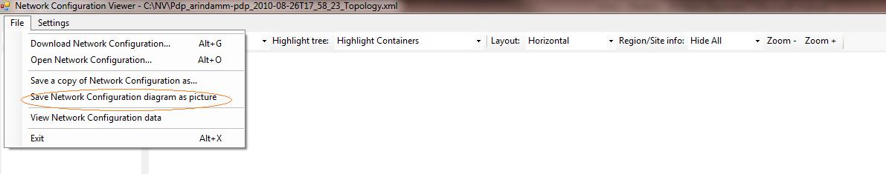

# <a name="skype-for-business-server-2015-resource-kit-tools-documentation"></a>documentation des outils du Kit de ressources Skype Entreprise Server 2015

Cet article décrit les outils du kit de ressources Skype Entreprise Server 2015, y compris l’objectif de chaque outil et des exemples d’utilisation. Le kit de ressources Skype Entreprise Server 2015 facilite les tâches courantes pour les administrateurs informatiques qui déploient et gèrent Skype Entreprise Server 2015. Par exemple, l’outil **Web Conf Data** peut être utilisé pour contrôler facilement les données chargées par les utilisateurs lors d’une réunion en ligne. L’outil **SEFAUtil** peut être utilisé pour configurer le transfert et la réponse des appels délégués pour les utilisateurs. Nous encourageons les administrateurs informatiques à utiliser ces outils pour gérer plus efficacement Skype Entreprise Server 2015.

## <a name="installation-of-the-resource-kit-tools"></a>Installation des outils du Kit de ressources

Pour installer le kit de ressources Skype Entreprise Server 2015, téléchargez [OCSReskit.msi](https://www.microsoft.com/download/details.aspx?id=52631) à partir du Centre de téléchargement.

Exécutez **OCSResKit.msi** pour effectuer une installation simple. Le .msi installe tous les outils dans le chemin suivant : **%Program Files%\Skype Entreprise Server 2015\ResKit**. Les outils qui sont des exécutables autonomes se trouvent dans ce dossier. Les outils qui ont également des fichiers de prise en charge se trouvent dans leurs propres sous-dossiers.

## <a name="supported-environments"></a>Environnements pris en charge

Le kit de ressources Skype Entreprise Server 2015 doit être installé sur un serveur qui répond aux spécifications requises pour Skype Entreprise Server 2015, généralement utilisé pour exécuter Skype Entreprise Server 2015.

## <a name="resource-kit-tools-overview"></a>Vue d’ensemble des outils du Kit de ressources

Voici une liste des outils fournis dans le kit de ressources Skype Entreprise Server 2015. Une description de chaque outil, y compris les exigences et l’exemple d’utilisation, est décrite dans les sections suivantes.

- [ABSConfig](resource-kit-tools.md#ABSConfig)

- [Moniteur de service de stratégie de bande passante](resource-kit-tools.md#bpsm)

- [Analyseur d’utilisation de la bande passante](resource-kit-tools.md#bua)

- [Call Parkometer](resource-kit-tools.md#callpark)

- [DBAnalyze](resource-kit-tools.md#dba)

- [Importer des données de service Stockage](resource-kit-tools.md#Issd)

- [LCSSync](resource-kit-tools.md#LCSSync)

- [Lookup User Console](resource-kit-tools.md#LUC)

- [MsTurnPing](resource-kit-tools.md#MsTurnPing)

- [Visionneuse de configuration réseau](resource-kit-tools.md#NCV)

- [Response Group Agent Live](resource-kit-tools.md#RGAL)

- [SEFAUtil](resource-kit-tools.md#SEFAUtil)

- [SYSPrep.ps1](resource-kit-tools.md#SYSPrep)

- [Migration des annonces numériques non attribuées](resource-kit-tools.md#UNAM)

- [Web Conf Data](resource-kit-tools.md#WebConfData)

## <a name="absconfig"></a>ABSConfig
<a name="ABSConfig"> </a>

L’outil de configuration du service carnet d’adresses (ABSConfig) est un outil d’administration qui permet aux administrateurs de personnaliser la configuration du service carnet d’adresses dans Skype Entreprise Server 2015. Cet outil permet également aux administrateurs Skype Entreprise Server 2015 de restaurer les paramètres par défaut du service carnet d’adresses.

### <a name="description"></a>Description

ABSConfig est une application graphique d’interface utilisateur qui permet aux administrateurs de configurer services de domaine Active Directory attributs liés au service carnet d’adresses.

Les principaux scénarios de l’outil sont les suivants :

- Pour permettre aux administrateurs de mapper des attributs dans services de domaine Active Directory aux attributs pour Skype Entreprise Server 2015.

- Pour permettre aux administrateurs de spécifier l’attribut services de domaine Active Directory à inclure ou à exclure dans les fichiers du service carnet d’adresses.

- Pour permettre aux administrateurs de restaurer, paramètres par défaut du service carnet d’adresses.

L’outil ABSConfig peut être démarré à l’aide du fichier ABSConfig.exe. L’outil s’ouvre sous l’onglet **Configurer les attributs**. Ce tableau propose des options permettant de mapper services de domaine Active Directory attributs aux champs d’attribut pour Skype Entreprise Server 2015 et de spécifier les utilisateurs à inclure ou exclure dans les fichiers du service carnet d’adresses en fonction de filtres d’attributs spécifiques. Il dispose également d’options pour personnaliser la valeur du numéro de téléphone à inclure dans le fichier carnet d’adresses. L’option **Restaurer par défaut** permet aux administrateurs de restaurer les paramètres du service Carnet d’adresses aux valeurs par défaut.

> [!NOTE]
> Le mappage des attributs AD à différents noms de champs OC fonctionne uniquement pour le téléchargement du fichier de carnet d’adresses et n’est pas pris en charge par la requête web carnet d’adresses.

### <a name="output"></a>Sortie

ABSConfig stocke la configuration du service carnet d’adresses dans la base de données.

```console
Path: %ProgramFiles%\Skype for Business Server 2015\Reskit
```

### <a name="purpose"></a>Objectif

ABSConfig offre un moyen rapide et simple de personnaliser Skype Entreprise Server service carnet d’adresses 2015.

### <a name="requirements"></a>Configuration requise

#### <a name="computer"></a>Ordinateur*

ABSConfig peut être exécuté uniquement à partir d’un ordinateur joint à un domaine sur lequel Skype Entreprise Server 2015 est installé. Dans le cas de Skype Entreprise Server 2015, Êdition Entreprise, cet outil peut être exécuté sur n’importe quel serveur Front-End pour lequel le service carnet d’adresses est activé pendant l’installation.

#### <a name="network"></a>Réseau

L’ordinateur doit être en mesure de se connecter au pool de Front-End et à la base de données principale.

#### <a name="software"></a>Logiciels

Les composants logiciels suivants doivent être installés avant d’exécuter l’outil ABSConfig :

- Skype Entreprise Server 2015

#### <a name="users"></a>Utilisateurs

Administrateurs disposant des autorisations nécessaires pour mettre à jour le déploiement Skype Entreprise Server 2015.

### <a name="examples"></a>Exemples

ABSConfig peut être démarré en tapant **ABSConfig.exe** à une invite de commandes. L’interface utilisateur de l’outil ABSConfig est illustrée ci-dessous.


### <a name="summary"></a>Résumé

L’outil ABSConfig fournit aux administrateurs un outil rapide et facile à utiliser pour personnaliser Skype Entreprise Server service carnet d’adresses 2015.

## <a name="bandwidth-policy-service-monitor"></a>Moniteur de service de stratégie de bande passante
<a name="bpsm"> </a>

L’outil Analyse du service de stratégie de bande passante est destiné à permettre aux administrateurs d’afficher la liste des éléments suivants :

1. Tous les services de stratégie de bande passante configurés Skype Entreprise Server 2015 (Authentification et Cœur) dans la topologie

2. Connexions établies par chaque service à d’autres services de stratégie de bande passante et aux serveurs Edge

3. Tous les liens configurés dans le document de configuration réseau et l’utilisation de la bande passante en temps réel, comme indiqué par chacun des services de stratégie de bande passante

### <a name="description"></a>Description

L’outil Analyse du service de stratégie de bande passante est implémenté en tant qu’application basée sur l’interface graphique utilisateur. Les administrateurs démarrent l’outil en exécutant PDPMonUI.exe.

Lorsque l’outil démarre, il tente de découvrir la liste des services de stratégie de bande passante dans la topologie. Une fois la mise à jour initiale effectuée, le volet à gauche de la fenêtre est rempli avec une liste de services regroupés par les clusters auxquels ils appartiennent.

Lorsque les administrateurs sélectionnent un service de stratégie de bande passante particulier, le volet de droite affiche les informations sur ce service particulier. Ce volet comporte également deux onglets principaux qui affichent des informations.

#### <a name="machine-info-tab"></a>Onglet Informations sur la machine

L’onglet Informations sur la **machine** affiche les détails du service de stratégie de bande passante sélectionné, ainsi que la liste et l’état de toutes les connexions établies par le service de stratégie de bande passante sélectionné à d’autres services.

#### <a name="topology-info-tab"></a>Onglet Informations sur la topologie

L’onglet **Informations de topologie** affiche la liste de tous les liens configurés dans les paramètres de configuration réseau. Pour chaque lien, la capacité de bande passante audio et vidéo s’affiche. En outre, la bande passante actuellement utilisée s’affiche, en Kbits/s et en pourcentage de la capacité. L’outil utilise le codage en couleurs pour mettre en évidence les liens dont l’utilisation est proche de la capacité, ce qui permet aux administrateurs d’isoler rapidement ces liens.

> [!NOTE]
>  Si l’outil Moniteur du service de stratégie de bande passante rencontre un échec lorsqu’il se connecte à l’un des services de stratégie de bande passante configurés, les informations contenues dans les onglets **Informations sur la machine** et **Informations de topologie** ne sont pas renseignées. Toutefois, il est possible que l’outil se connecte initialement, mais qu’il perde par la suite sa connexion au service. Dans ce cas, les administrateurs peuvent voir des informations obsolètes. Il existe un horodatage **de la dernière mise à jour** sur chacun des onglets qui peut permettre aux administrateurs de voir quand les données ont été mises à jour pour la dernière fois pour un service de stratégie de bande passante particulier.

### <a name="output"></a>Sortie

Il n’y a pas de sortie de ligne de commande ; la sortie du programme est contenue dans l’interface utilisateur graphique principale.

### <a name="purpose"></a>Objectif

L’objectif de l’outil Analyse du service de stratégie de bande passante est de permettre aux administrateurs de voir l’état de chacun des services de stratégie de bande passante définis dans la topologie. En outre, les administrateurs peuvent voir l’utilisation de la bande passante en temps réel pour tous les liens définis dans le document de configuration réseau.

### <a name="requirements"></a>Configuration requise

L’outil Analyse du service de stratégie de bande passante doit être exécuté sur un ordinateur qui fait partie de la topologie Skype Entreprise Server.

### <a name="summary"></a>Résumé

L’outil Analyse du service de stratégie de bande passante peut être une ressource précieuse pour les administrateurs afin qu’ils puissent inspecter l’état de tous les services de stratégie de bande passante dans la topologie, et plus important encore, ils peuvent obtenir une utilisation de la bande passante en temps réel pour les liens définis dans les paramètres de configuration réseau.

## <a name="bandwidth-utilization-analyzer"></a>Analyseur d’utilisation de la bande passante
<a name="bua"> </a>

L’analyseur d’utilisation de la bande passante est un outil qui crée des rapports sur les différentes vues de la consommation de bande passante par les points de terminaison UC sur les liaisons WAN du réseau d’entreprise. Ces rapports peuvent être utilisés pour comprendre le modèle de consommation de bande passante actuel et faciliter la planification de la capacité de bande passante.

### <a name="description"></a>Description

L’analyseur d’utilisation de la bande passante est implémenté en tant qu’application basée sur l’interface graphique utilisateur. Cet outil génère des rapports spécifiquement pour l’utilisation audio sur le réseau et facilite la planification de la capacité. Il itère également sur la capacité de bande passante affectée à différents liens.

### <a name="output"></a>Sortie

L’analyseur d’utilisation de la bande passante fournit des tracés graphiques de la capacité de bande passante et de l’utilisation de l’audio pour tous les liens WAN configurés dans le système.

### <a name="purpose"></a>Objectif

Dans tout déploiement vocal et vidéo, il est essentiel de surveiller et de comprendre la tendance de l’utilisation de la bande passante du trafic multimédia sur le réseau d’entreprise. L’outil Analyseur d’utilisation de la bande passante permet à un administrateur d’y parvenir. Cet outil effectue les opérations suivantes :

- Génère des rapports spécifiques pour l’utilisation audio sur le réseau

- Aide à une planification et une itération de capacité plus efficaces sur la capacité de bande passante affectée à différents liens

L’analyseur d’utilisation de la bande passante peut générer des tracés graphiques de la capacité de bande passante et des rapports d’utilisation ; ils sont les suivants :

- Tous les liens WAN dans le réseau d’entreprise

- Filtré par les liens WAN sélectionnés qui ont été choisis

- Filtré par les liens WAN qui ont dépassé la capacité de liaison

- Filtré par les liens WAN qui ont sous-utilisé la bande passante approvisionnée

- Filtrer par liens WAN qui ont atteint des niveaux critiques (utilisation de la bande passante supérieure à 90 % de la capacité de bande passante de la liaison WAN)

- Filtré par type de lien WAN : liens réseau-site, liens interrégionaux et liens au sein d’un site

- Filtré par région réseau

#### <a name="applications"></a>Applications

L’analyseur d’utilisation de la bande passante a les deux applications suivantes (outils) :

- **WanLinkLogCollector.exe** Cet outil permet à son utilisateur d’entrer les informations requises.

- **BandwidthUtilizationAnalyzer.xlsm** Un rapport logiciel de feuille de calcul Microsoft Excel est lancé automatiquement par WanLinkLogCollector.exe. Cette application permet à l’utilisateur d’appliquer des filtres au rapport, comme indiqué plus loin dans cet article.

#### <a name="phases-of-using-bandwidth-utilization-analyzer"></a>Phases de l’utilisation de l’analyseur d’utilisation de la bande passante

Il existe deux phases lors de l’utilisation de l’analyseur d’utilisation de la bande passante :

- Collecter les journaux, qui sont effectués à l’aide de WanLinkLogCollector.exe

- Personnaliser les rapports, qui sont effectués à l’aide de BandwidthUtilizationAnalyzer.xlsm

  > [!IMPORTANT]
  > Nous recommandons vivement que BandwidthUtilizationAnalyzer.xlsm ne soit pas lancé manuellement par les utilisateurs finaux.

#### <a name="starting-bandwidth-utilization-analyzer"></a>Démarrage de l’analyseur d’utilisation de la bande passante

Démarrez WanLinkLogCollector.exe à l’invite de commandes ou à l’aide de Windows Explorer.

 **Utilisation de WanLinkLogCollector.exe**

Il existe trois étapes pour utiliser WanLinkLogCollector.exe :

1. **Journaliser la chronologie** Indiquez la chronologie pour laquelle le rapport doit être généré

2. **Spécifier les répertoires de fichiers** Fournir des informations d’emplacement de fichier

3. **Collecter les journaux et lancer la visionneuse de rapports** Exécuter la commande pour générer le rapport

#### <a name="step-1---log-the-timeline"></a>Étape 1 : journaliser la chronologie

La journalisation de la chronologie permet à l’utilisateur de l’outil de spécifier ce qui suit, comme illustré dans la figure ci-dessous.

1. **Date de début** Il s’agit de la date de début de la chronologie pour laquelle le rapport doit être généré ; par exemple, le 1er août 2010.

2. **Date de fin** Il s’agit de la date de fin de la chronologie pour laquelle le rapport doit être généré; par exemple, le 30 septembre 2010.

     

#### <a name="step-2---specify-the-file-directories"></a>Étape 2 : spécifier les répertoires de fichiers

Les répertoires de fichiers suivants peuvent être spécifiés par l’utilisateur comme indiqué.

- **Emplacement des fichiers journaux du serveur** Emplacement du dossier où les journaux du serveur de stratégie de bande passante sont stockés. Cela se trouve généralement dans \<fileserver\>\\<choix de FE\>\AppServerFiles\PDP.

- **Emplacement de stockage de fichiers temporaire** Emplacement de fichier temporaire où les fichiers intermédiaires sont stockés pendant la génération du rapport.

  

  > [!NOTE]
  > Assurez-vous que l’utilisateur de l’outil dispose d’un accès suffisant aux journaux du serveur et au dossier du magasin de fichiers temporaire.

#### <a name="step-3---collect-the-logs-and-start-the-report-viewer"></a>Étape 3 : collecter les journaux et démarrer la visionneuse de rapports

Pour collecter les journaux et démarrer la visionneuse de rapports, cliquez sur **Exécuter** comme indiqué ci-dessous. Cette étape collecte les données requises.


Une fois la validation d’entrée réussie, le message ci-dessous s’affiche.


Cliquez sur **OK**. BandwidthUtilizationAnalyzer.xlsm est démarré automatiquement. Suivez les instructions de la boîte de message. Pour plus d’informations, consultez **Using BandwidthUtilizationAnalyzer.xlsm** dans la section suivante.


### <a name="using-bandwidthutilizationanalyzerxlsm"></a>Utilisation de BandwidthUtilizationAnalyzer.xlsm

1. Lorsque BandwidthUtilizationAnalyzer.xlsm est démarré automatiquement, cliquez sur **Actualiser** comme indiqué ci-dessous.

     

2. Lorsqu’un dossier de fichiers est ouvert, sélectionnez consolidated.csv à partir de l’emplacement spécifié dans la boîte de message, comme indiqué ci-dessous. Il affiche également l’emplacement en tant que **C:\Temp**.

     

3. Cliquez sur **Importer**.

4. Le tracé graphique est généré automatiquement. Il est disponible lorsque le pointeur de travail en arrière-plan disparaît.

     

#### <a name="applying-filters-to-the-report-view"></a>Application de filtres à l’affichage Rapport

Les filtres qui peuvent être appliqués à la vue de rapport comme indiqué ci-dessous sont décrits comme suit :


1. **Nom** Filtrer par liens WAN (le filtre se trouve sur le côté droit du graphique). Le préfixe indique les types de liens suivants ; voir la zone verticale (bleue) :

   - **Site S** Lien WAN d’un site réseau vers une région réseau

   - **IS Inter-Site** Lien WAN entre deux sites réseau

   - **R Interrégion** Lien WAN entre deux régions réseau

2. **Limite dépassée** Filtrer par liaisons WAN dont l’utilisation de la bande passante est supérieure à la capacité de bande passante

3. **Niveaux critiques** Filtrer par liaisons WAN dont l’utilisation de la bande passante a atteint 90 % ou plus que la capacité de bande passante

4. **Sous-utilisé** Filtrer par liaisons WAN dont l’utilisation de la bande passante a été inférieure à 25 % de la capacité de bande passante

5. **Type de lien** Filtrez selon les types de liens WAN suivants :

   - **Type de site réseau**

   - **Type intersite**

   - **Type de lien interrégion**

6. **Région** Filtrer par région réseau

Les figures suivantes montrent les filtres décrits précédemment.

Filtrer par **nom**. Sélectionnez la liste des liens qui doivent être affichés dans le graphique.


Filtrer par **limite dépassée**. Sélectionnez **True** pour appliquer le filtre.


Filtrer par **niveau critique**. Sélectionnez **True** pour appliquer le filtre.


Filtrer par **Sous utilisé**. Sélectionnez **True** pour appliquer le filtre.


Filtrer par **type de lien**. Sélectionnez le ou les types qui doivent être affichés.


Filtrer par **région**. Sélectionnez une liste de régions dont les liens doivent être affichés.


### <a name="requirements"></a>Configuration requise

- Le .NET Framework 3.5

- Microsoft Excel 2010 ou Excel 2007

### <a name="summary"></a>Résumé

L’analyseur d’utilisation de la bande passante est utilisé pour tracer l’utilisation de la bande passante audio pour le trafic UC sur le réseau. Cet outil peut également être utilisé pour signaler l’utilisation de la bande passante vidéo sur le réseau.

## <a name="call-parkometer"></a>Call Parkometer
<a name="callpark"> </a>

Call Parkometer est une application en ligne de commande qui fournit un accès facile à la base de données d’orbite call park.

### <a name="description"></a>Description

Call Parkometer est un outil permettant de suivre les appels actuellement parqués. Il collecte également des statistiques sur les orbites et l’utilisation de Call Park Server (CPS). Cet outil en ligne de commande fournit un accès en lecture et en écriture à l’orbite CPS SQL Server base de données à partir d’un ordinateur local ou connecté à distance.

Toutes les options s’excluent mutuellement. La syntaxe de ligne de commande est la suivante :

- **Paramètre -o** : répertorie toutes les plages d’orbites configurées pour ce pool.

- **Paramètre -n** : répertorie toutes les orbites actuellement utilisées dans ce pool. Les informations affichées sont les suivantes :

  - URI (Uniform Resource Identifier) SIP du parkee et parker.

  - Nom d’hôte du service CPS où l’appel est garé.

  - Horodatage du moment où l’appel a été garé.

- **Paramètre -f** : répertorie le nombre d’orbites actuellement libres dans le pool.

- **-r \<n\>** parameter—lists the \<n\> last parked calls. Les informations affichées sont les suivantes :

  - URI SIP Parkee.

  - URI PARKER SIP.

  - Nom d’hôte du cps où l’appel a été garé.

  - Horodatage du moment où l’appel a été récupéré ou supprimé.

- **-t\<n\>** paramètre : teste la réservation d’une orbite dans la base de données pour montrer le caractère aléatoire des numéros d’orbite affectés.

### <a name="output"></a>Sortie

Selon les paramètres d’entrée spécifiés à l’invite de commandes, Call Parkometer affiche la sortie suivante :

- Toutes les plages d’orbites configurées pour ce pool

- Appels actuellement parqués

- Nombre d’orbites libres (disponibles)

- Appels récemment parqués

- Orbites réservées pour tester des valeurs d’orbite uniformes et aléatoires

### <a name="purpose"></a>Objectif

L’objectif de l’outil CPS est de fournir un accès en ligne de commande à la base de données CPS. L’administrateur peut afficher l’utilisation de CPS et déterminer le nombre d’orbites affectées à un pool.

### <a name="requirements"></a>Configuration requise

Il n’existe aucune exigence si cet outil est exécuté sur le même ordinateur que celui qui exécute CPS. Si cet outil est exécuté sur un ordinateur distant, la base de données SQL Server utilisée par Skype Entreprise Server 2015 doit être configurée pour autoriser l’accès à distance. Call Parkometer doit être configuré avec une chaîne de connexion de base de données SQL Server pour se connecter au SQL Server du pool. Cette chaîne de connexion de base de données SQL Server est définie dans le fichier de configuration, **parkometer.exe.config**. Il doit être placé dans le même répertoire que celui où se trouve parkometer.exe. Le fichier XML suivant est un exemple de parkometer.exe.config. Les paramètres qui doivent être configurés sont le nom d’utilisateur (par exemple, mydomain\Administrator), le mot de passe (par exemple, mypassword) et le nom d’hôte (par exemple, myserver).

```xml
<?xml version="1.0" encoding="utf-8" ?>
<configuration>
  <appSettings>
   <add key="SQL" value="server=myserver\RTC;
database=cpsdyn;
User Id=mydomain\Administrator;
Password=mypassword.;
Integrated Security=false;"/>
  </appSettings>
</configuration>
```

### <a name="examples"></a>Exemples

Plages d’orbites déployées : le paramètre -o répertorie toutes les plages d’orbites configurées pour ce pool, comme indiqué


Appels actuellement parqués : le paramètre -n répertorie toutes les orbites actuellement utilisées sur ce pool, comme indiqué


Nombre d’orbites libres : le paramètre -f répertorie le nombre d’orbites actuellement libres dans le pool, comme indiqué


Appels récemment parqués : le paramètre -r \<n\> répertorie les \<n\> derniers appels parqués comme indiqué


Réservation d’orbite de test : le paramètre -t \<n\> teste la réservation d’une orbite dans la base de données comme indiqué


### <a name="summary"></a>Résumé

Call Parkometer est un outil en ligne de commande qui fournit des informations détaillées sur call park server.

## <a name="dbanalyze"></a>DBAnalyze
<a name="dba"> </a>

### <a name="description"></a>Description

DBAnalyze est un outil en ligne de commande qui permet aux administrateurs de collecter des rapports d’analyse sur les bases de données Skype Entreprise Server 2015. DBAnalyze a les modes suivants : diagnostic, données utilisateur, conférence, GPU et fragmentation de disque :

- **Mode de diagnostic** Crée un rapport qui inclut des informations sur les tables (nombre d’enregistrements, fragmentation, taille des données et taille d’index), la taille des fichiers journaux et des données, la dernière durée de sauvegarde, la distribution des contacts entre les serveurs qui exécutent Microsoft Office Communications Server, le nombre moyen d’autorisations, de contacts, de conteneurs, d’abonnements, de publications, de points de terminaison par utilisateur, les utilisateurs mal hébergés, les utilisateurs qui ne peuvent pas être routées,  nombre moyen de conférences organisées par utilisateur, de conférences planifiées, de conférences actives et de la version de la base de données.

    > [!NOTE]
    > L’exécution du mode de diagnostic peut affecter les performances du serveur.

- **Mode de données utilisateur** Signale les données de contact, de conteneur, d’abonnement, de publication, d’autorisation et de groupe de contacts pour un utilisateur spécifié ou pour les utilisateurs qui ont cet utilisateur dans leurs listes de contacts et d’autorisations. Ce mode signale également les données récapitulatives pour les conférences auxquelles un utilisateur organise ou est invité.

- **Mode conférence** Fournit des données détaillées pour une conférence spécifique, y compris tous les détails de planification de la conférence, la liste des invités, la liste des types de médias autorisés pour la conférence, les GPU actifs (unités de contrôle multipoint), la liste des participants actifs et l’état de signalisation de chaque participant.

- **Décoder l’ID de réunion** Décode un ID de réunion de réseau téléphonique commuté (RTC) qui est spécifié par le commutateur **/pstnid** , mais qui ne se connecte pas au serveur principal pour obtenir des informations détaillées.

- **Résoudre la conférence** Décode un ID de réunion RTC spécifié par le commutateur **/pstnid** et affiche des informations sur la conférence indiquée par l’ID.

- **Mode GPU** Signale l’ID, le type de média, l’URL, l’état de pulsation, la charge de conférence et le chargement des participants pour chaque unité MCU du pool.

- **Mode de fragmentation de disque** Affiche l’état de fragmentation de tous les disques.

Cet outil peut être utilisé pour diagnostiquer différents problèmes ou aider les administrateurs à planifier la capacité. Par exemple, si la plupart des utilisateurs hébergés sur le serveur A choisissent les utilisateurs hébergés sur le serveur B comme contacts, l’administrateur peut déplacer les utilisateurs du serveur A vers le serveur B pour réduire le trafic inter-serveurs.

### <a name="output"></a>Sortie

Cet outil génère des rapports prédéfinis sur la base de données Skype Entreprise Server 2015. **Chemin d’accès** : %ProgramFiles%\Skype Entreprise Server 2015\Reskit

### <a name="purpose"></a>Objectif

Pour installer Dbanalyze.exe, copiez-le dans un dossier local, puis exécutez l’outil. Pour utiliser l’outil, exécutez la commande suivante à partir de la ligne de commande. `dbanalyze.exe [/v] [/report:value] [/sqlserver:value] [/user:user@domain.com] [/conf:value][/pstnid:Value] [/maxcontacts:value]` Les descriptions des options de ligne de commande sont indiquées ci-dessous.


### <a name="requirements"></a>Configuration requise

 **Ordinateur** DBAnalyze peut être exécuté uniquement à partir d’un ordinateur joint à un domaine sur lequel Skype Entreprise Server 2015 est installé.

 **Réseau** L’ordinateur doit être en mesure de se connecter à la base de données back-end.

 **Les** composants logiciels Skype Entreprise Server 2015 doivent être installés avant d’exécuter DBAnalyze.

 **Utilisateurs** Le tableau ci-dessous montre les administrateurs qui disposent des autorisations nécessaires pour accéder aux bases de données Skype Entreprise Server 2015.


> [!NOTE]
> Un compte d’administrateur local est requis pour **/report:disk** mode.

### <a name="examples"></a>Exemples

Voici des exemples de commandes Dbanalyze.exe valides :

```console
dbanalyze.exe /report:diag
dbanalyze.exe /report:user /user:usera@domainb.com
dbanalyze.exe /report:conf /user:bob@example.com /conf:1W9J71SKSX2X
dbanalyze.exe /report:resolve /pstnid:12345
dbanalyze.exe /report:mcus
dbanalyze.exe /report:disk
```

### <a name="summary"></a>Résumé

DBAnalyzer fournit aux administrateurs une analyse rapide et facile Skype Entreprise Server bases de données 2015.

## <a name="import-storage-service-data"></a>Importer des données de service Stockage
<a name="Issd"> </a>

L’outil kit de ressources ImportStorageServiceData permet de réimporter les données de file d’attente et de point de terminaison qui ont été vidées du service Stockage (LYSS) dans le service Stockage.

### <a name="description"></a>Description

Les données vidées du service Stockage peuvent avoir été automatiques (périodiques) en fonction de l’état de l’élément de file d’attente ou de la taille de la base de données. Cela aurait pu se produire en raison de l’appel manuel de l’applet de commande de basculement de pool, ou de l’applet de commande StorageServiceFullFlush (appelée par l’applet de commande de basculement du pool). Notez que les données ne doivent pas être réimportées dans l’idéal si l’une des tailles de base de données du service Stockage (LYSS) sur les serveurs frontaux est supérieure au niveau normal, car cela entraînera probablement simplement l’exportation d’un plus grand nombre de données. En outre, tous les problèmes qui auraient pu contribuer aux erreurs qui ont provoqué l’expansion de la file d’attente de service Stockage doivent d’abord être résolus (par exemple, Exchange erreurs de point de terminaison, problèmes réseau ou autres problèmes).

 **Scénario 1 :** pendant le basculement du pool, les fichiers peuvent être vidés du service de stockage pour chaque serveur frontal. Une fois le basculement terminé, l’outil doit être exécuté pour réimporter les données.

 **Scénario 2 :** les données sont vidées automatiquement chaque jour ou en réponse à Stockage base de données de service dépassant certains seuils de taille (par exemple, 60 %, 80 %, 90 % plein). Ces données vidées automatiquement doivent être réimportées régulièrement par l’administrateur. Dans la situation ci-dessus, si le pack SCOM de surveillance n’est pas déployé, il existe des événements pour Skype Entreprise Server Stockage Service liés au vidage des données du service Stockage. ID d’événement 32075 (opération de vidage complète démarrée), 32076 (vidage complet terminé), 32082 (vidage au niveau de maintenance démarré), 32083 (vidage du niveau de maintenance terminé), 32089 (vidage dû au remplissage de la base de données). Notez que ces ID d’événement correspondent à la version RTM. Lorsqu’un administrateur voit ces événements, cela signifie qu’il y a des fichiers qui ont été vidés. Ces données doivent être régulièrement réimportées à l’aide de cet outil, par exemple une fois par semaine.

Pour la version du service en ligne, si le pack SCOM de surveillance de l’intégrité pour Skype Entreprise Server est déployé, de nouvelles alertes peuvent être déclenchées qui demandent à l’administrateur de réimporter les données vidées dans Stockage Service. Il y aura un événement correspondant dans le journal des événements sur le serveur Front-End qui a déclenché l’alerte. L’événement fournit une description du chemin parent sous lequel se trouvent les fichiers de données vidés et du nombre de fichiers qui répondent aux critères d’alerte. Les critères d’alerte sont qu’il existe des fichiers X ou plus sous le chemin parent particulier qui datent d’au moins Y jours (où X et Y sont prédéfinies dans storageService, mais peuvent être remplacés en modifiant le fichier APPCONFIG.) Deux exemples d’événements pouvant déclencher l’alerte d’intégrité sont indiqués ci-dessous, la différence étant leur chemin parent. Une possibilité se présente sous le partage de fichiers du service web, tandis que l’autre possibilité est le répertoire Application Data local de chaque serveur frontal. (par exemple c:\ProgramData\Microsoft\Skype Entreprise Server 2015\StorageService). L’administrateur exécute ensuite cet outil reskit.

Cet outil augmente la charge du processeur et des E/S sur le serveur frontal sur lequel il s’exécute, et d’autres serveurs frontaux, dans la situation où les données ne sont pas détenues par le serveur frontal sur lequel l’outil est exécuté. Nous vous recommandons d’exécuter cet outil lorsque les serveurs frontaux ne sont pas soumis à une charge importante du processeur et des E/S, par exemple en dehors des heures de pointe. Deuxièmement, cet outil peut prendre de 2 à 3 minutes pour importer un fichier de données. Gardez cela à l’esprit lors de l’estimation de la durée d’exécution de l’outil. Le fichier journal détaillé généré par l’outil s’affiche par défaut dans le magasin de fichiers. Supprimez-le s’il n’y a aucune erreur signalée, car le fichier journal peut être de plusieurs dizaines de Mo.


### <a name="requirements"></a>Configuration requise

Installez les outils du Kit de ressources Skype Entreprise Server 2015. L’outil s’exécute sur les machines jointes à un domaine sur lesquelles Skype Entreprise Server et Skype Entreprise Server Management Shell sont installés. L’outil utilise une applet de commande de l’interpréteur de commandes de gestion pour identifier tous les serveurs Front-End dans le pool. Deuxièmement, l’outil doit être exécuté à partir d’un ordinateur du pool sur lequel la base de données **RtcLocal** est installée. Cette base de données est utilisée par l’outil pour récupérer l’emplacement du partage de fichiers WEBSERVICE pour le pool. En outre, avant d’utiliser l’outil, chaque serveur Front-End doit d’abord activer la communication à distance Windows PowerShell à l’aide **d’Enable-PSRemoting** sur chaque serveur Front-End, et la machine à partir de laquelle l’outil est exécuté. Sinon, les commandes de Windows PowerShell distantes de cet outil échoueront. Windows PowerShell la communication à distance peut être désactivée sur tous les serveurs Front-End du pool une fois l’opération terminée. Enfin, le compte ou les informations d’identification appelant l’outil doivent disposer d’une autorisation de lecture/écriture sur le partage de fichiers de service web pour le pool sur lequel ils exécutent cet outil. Sinon, l’outil échoue avec des erreurs d’autorisation d’E/S.

> [!NOTE]
> Sur Windows Server 2012, Windows PowerShell communication à distance est activée par défaut, mais pas sur le système d’exploitation Windows Server 2008.

### <a name="examples"></a>Exemples

```console
>  C:\StorageService>ImportStorageServiceData.exe
Description:
This tool will re-import Storage Service (LYSS) flushed queue data back in.  For a pool: you are required to run this tool on a machine inside the pool which has the Lync Server Management Shell installed.  Additionally, all front end machines need to have Windows Powershell Remoting enabled before executing this tool by executing Enable-PSRemoting.  Also, please ensure that all Storage Service instance DB Size are at the 'Normal' level (verify this by viewing Eventlog events). Otherwise re-importing may cause data to be flushed out again if any Storage Service instance DB size level goes above 'Normal'.
Usage: Default behavior is to Import data from web service file share as well as any files on all Front End machines in pool.
Additional Options:
-Verbose                    : Turn verbose output on.

-StorageServiceHostName     : Host Name of Storage Service WCF endpoint.  ( Default=localhost netnamedpipe binding. )

-FileSharePath              : Import only all data from just under the UNC path specified.

ActivityID: cc3b62ff-bb66-4e61-a6e2-96cb3626315c. <-- Use this to correlate with StorageService trace logs if troubleshooting.
Type Server name (TCP binding) or press <enter> for localhost (NamePipe binding):
Using NetNamedPipeBinding...
OnTopologyChanged Event received
Web Service File Share: \\dc.vdomain.com\OcsFileStore\co1-WebServices-1\StorageService

Front Ends:
server.vdomain.com
server2.vdomain.com
server1.vdomain.com
server3.vdomain.com
Looking under directory: \\dc.vdomain.com\OcsFileStore\co1-WebServices-1\StorageService for exported data.
# Files found: 8
Starting Import for file:\\dc.vdomain.com\OcsFileStore\co1-WebServices-1\StorageService\DataExport\2
0120910\SERVER.vdomain.com\944f5724c65c5f93900dc1c8c898b102__0.xml
Items deserialized: 20

All items in file were enqueued successfully, will try to delete file: \\dc.vdomain.com\OcsFileStore\co1-WebServices-1\StorageService\DataExport\20120910\SERVER.vdomain.com\944f5724c65c5f93900dc1c8c898b102__0.xml

All items in file failed to enqueue so file will not be deleted.  File path: \\dc.vdomain.com\OcsFileStore\co1-WebServices-1\StorageService\DataExport\20120910\SERVER.vdomain.com\944f5724c65c5f93900dc1c8c898b102__0.xml

Summary for file \\dc.vdomain.com\OcsFileStore\co1-WebServices-1\StorageService\DataExport\20120910\SERVER.vdomain.com\944f5724c65c5f93900dc1c8c898b102__0.xml: succeeded: 20, failed: 0

Starting Import for file:\\dc.vdomain.com\OcsFileStore\co1-WebServices-1\StorageService\DataExport\20120910\SERVER1.vdomain.com\17d5435ae40259f7bbdf1866776386e4__0.xml
Items deserialized: 20

[cc3b62ff-bb66-4e61-a6e2-96cb3626315c] Send EnqueueMessages to redirected, targetServer=server1.vdomain.com, queueItems=20

All items in file were enqueued successfully, will try to delete file: \\dc.vdomain.com\OcsFileStore\co1-WebServices-1\StorageService\DataExport\20120910\SERVER1.vdomain.com\17d5435ae40259f7bbdf1866776386e4__0.xml

All items in file failed to enqueue so file will not be deleted.  File path: \\dc.vdomain.com\OcsFileStore\co1-WebServices-1\StorageService\DataExport\20120910\SERVER1.vdomain.com\17d5435ae40259f7bbdf1866776386e4__0.xml

Summary for file \\dc.vdomain.com\OcsFileStore\co1-WebServices-1\StorageService\DataExport\20120910\
SERVER1.vdomain.com\17d5435ae40259f7bbdf1866776386e4__0.xml: succeeded: 20, failed: 0

Starting Import for file:\\dc.vdomain.com\OcsFileStore\co1-WebServices-1\StorageService\DataExport\20120910\SERVER1.vdomain.com\904f6c9b8ac951ae8b3c86684d3832e4__0.xml

Items deserialized: 20
[cc3b62ff-bb66-4e61-a6e2-96cb3626315c] Send EnqueueMessages to redirected, targetServer=server1.vdomain.com, queueItems=20

All items in file were enqueued successfully, will try to delete file: \\dc.vdomain.com\OcsFileStore
\co1-WebServices-1\StorageService\DataExport\20120910\SERVER1.vdomain.com\904f6c9b8ac951ae8b3c86684d
3832e4__0.xml

All items in file failed to enqueue so file will not be deleted.  File path: \\dc.vdomain.com\OcsFil
eStore\co1-WebServices-1\StorageService\DataExport\20120910\SERVER1.vdomain.com\904f6c9b8ac951ae8b3c
86684d3832e4__0.xml

Summary for file \\dc.vdomain.com\OcsFileStore\co1-WebServices-1\StorageService\DataExport\20120910\
SERVER1.vdomain.com\904f6c9b8ac951ae8b3c86684d3832e4__0.xml: succeeded: 20, failed: 0

Starting Import for file:\\dc.vdomain.com\OcsFileStore\co1-WebServices-1\StorageService\DataExport\2
0120910\SERVER2.vdomain.com\69844a271e6c5633a1f2b46a42287dd6__0.xml

Items deserialized: 20

[cc3b62ff-bb66-4e61-a6e2-96cb3626315c] Send EnqueueMessages to redirected, targetServer=server2.vdom
ain.com, queueItems=20

All items in file were enqueued successfully, will try to delete file: \\dc.vdomain.com\OcsFileStore
\co1-WebServices-1\StorageService\DataExport\20120910\SERVER2.vdomain.com\69844a271e6c5633a1f2b46a42
287dd6__0.xml

All items in file failed to enqueue so file will not be deleted.  File path: \\dc.vdomain.com\OcsFil
eStore\co1-WebServices-1\StorageService\DataExport\20120910\SERVER2.vdomain.com\69844a271e6c5633a1f2
b46a42287dd6__0.xml

Summary for file \\dc.vdomain.com\OcsFileStore\co1-WebServices-1\StorageService\DataExport\20120910\
SERVER2.vdomain.com\69844a271e6c5633a1f2b46a42287dd6__0.xml: succeeded: 20, failed: 0

Starting Import for file:\\dc.vdomain.com\OcsFileStore\co1-WebServices-1\StorageService\DataExport\2
0120910\SERVER3.vdomain.com\3313935458e35b9b9759e08a15d251e6__0.xml

Items deserialized: 20

[cc3b62ff-bb66-4e61-a6e2-96cb3626315c] Send EnqueueMessages to redirected, targetServer=server3.vdom
ain.com, queueItems=1

All items in file were enqueued successfully, will try to delete file: \\dc.vdomain.com\OcsFileStore
\co1-WebServices-1\StorageService\DataExport\20120910\SERVER3.vdomain.com\3313935458e35b9b9759e08a15
d251e6__0.xml

All items in file failed to enqueue so file will not be deleted.  File path: \\dc.vdomain.com\OcsFil
eStore\co1-WebServices-1\StorageService\DataExport\20120910\SERVER3.vdomain.com\3313935458e35b9b9759
e08a15d251e6__0.xml

Summary for file \\dc.vdomain.com\OcsFileStore\co1-WebServices-1\StorageService\DataExport\20120910\
SERVER3.vdomain.com\3313935458e35b9b9759e08a15d251e6__0.xml: succeeded: 20, failed: 0

Starting Import for file:\\dc.vdomain.com\OcsFileStore\co1-WebServices-1\StorageService\DataExport\2
0120910\SERVER3.vdomain.com\4501e04eae4856059346949ff817c220__0.xml
Items deserialized: 20
[cc3b62ff-bb66-4e61-a6e2-96cb3626315c] Send EnqueueMessages to redirected, targetServer=server3.vdom
ain.com, queueItems=1
All items in file were enqueued successfully, will try to delete file: \\dc.vdomain.com\OcsFileStore
\co1-WebServices-1\StorageService\DataExport\20120910\SERVER3.vdomain.com\4501e04eae4856059346949ff8
17c220__0.xml
All items in file failed to enqueue so file will not be deleted.  File path: \\dc.vdomain.com\OcsFil
eStore\co1-WebServices-1\StorageService\DataExport\20120910\SERVER3.vdomain.com\4501e04eae4856059346
949ff817c220__0.xml

Summary for file \\dc.vdomain.com\OcsFileStore\co1-WebServices-1\StorageService\DataExport\20120910\
SERVER3.vdomain.com\4501e04eae4856059346949ff817c220__0.xml: succeeded: 20, failed: 0
Starting Import for file:\\dc.vdomain.com\OcsFileStore\co1-WebServices-1\StorageService\DataExport\2
0120910\SERVER3.vdomain.com\5ad77443ad955a22a876749be66d5317__0.xml

Items deserialized: 20
[cc3b62ff-bb66-4e61-a6e2-96cb3626315c] Send EnqueueMessages to redirected, targetServer=server3.vdom
ain.com, queueItems=20
All items in file were enqueued successfully, will try to delete file: \\dc.vdomain.com\OcsFileStore
\co1-WebServices-1\StorageService\DataExport\20120910\SERVER3.vdomain.com\5ad77443ad955a22a876749be6
6d5317__0.xml
All items in file failed to enqueue so file will not be deleted.  File path: \\dc.vdomain.com\OcsFil
eStore\co1-WebServices-1\StorageService\DataExport\20120910\SERVER3.vdomain.com\5ad77443ad955a22a876
749be66d5317__0.xml
Summary for file \\dc.vdomain.com\OcsFileStore\co1-WebServices-1\StorageService\DataExport\20120910\
SERVER3.vdomain.com\5ad77443ad955a22a876749be66d5317__0.xml: succeeded: 20, failed: 0
Starting Import for file:\\dc.vdomain.com\OcsFileStore\co1-WebServices-1\StorageService\DataExport\2
0120910\SERVER3.vdomain.com\a11e27ae439a582288d4657eda86b565__0.xml
Items deserialized: 20
[cc3b62ff-bb66-4e61-a6e2-96cb3626315c] Send EnqueueMessages to redirected, targetServer=server3.vdom
ain.com, queueItems=20
All items in file were enqueued successfully, will try to delete file: \\dc.vdomain.com\OcsFileStore
\co1-WebServices-1\StorageService\DataExport\20120910\SERVER3.vdomain.com\a11e27ae439a582288d4657eda
86b565__0.xml
All items in file failed to enqueue so file will not be deleted.  File path: \\dc.vdomain.com\OcsFil
eStore\co1-WebServices-1\StorageService\DataExport\20120910\SERVER3.vdomain.com\a11e27ae439a582288d4
657eda86b565__0.xml
Summary for file \\dc.vdomain.com\OcsFileStore\co1-WebServices-1\StorageService\DataExport\20120910\
SERVER3.vdomain.com\a11e27ae439a582288d4657eda86b565__0.xml: succeeded: 20, failed: 0
All files have been imported into Storage Service for path: \\dc.vdomain.com\OcsFileStore\co1-WebSer
vices-1\StorageService
Importing files for: server.vdomain.com
No files founds.
Importing files for: server2.vdomain.com
No files founds.
Importing files for: server1.vdomain.com
No files founds.
Importing files for: server3.vdomain.com
No files founds.
Writing log: \\dc.vdomain.com\OcsFileStore\co1-WebServices-1\StorageService\ImportStorageServiceData
Log20120910_1609SS
Tool has finished execution.
>  C:\StorageService>
```

## <a name="lcssync"></a>LCSSync
<a name="LCSSync"> </a>

L’outil LCSSync permet de déployer Skype Entreprise Server logiciel de communication 2015 dans un environnement à forêts multiples. Cet outil est utilisé pour synchroniser les utilisateurs et les groupes de différentes forêts d’utilisateurs en tant qu’objet de contact services de domaine Active Directory vers une forêt centrale où Skype Entreprise Server 2015 est installé.

### <a name="description"></a>Description

 LCSSync utilise les objets de contact services de domaine Active Directory synchronisés dans la forêt centrale pour permettre aux utilisateurs de Skype Entreprise Server. Pour fournir une connexion unique, le compte d’utilisateur principal doit être mappé à l’objet de contact services de domaine Active Directory dans la forêt centrale pour Skype Entreprise Server 2015. Cet outil permet d’effectuer ce mappage. Cet outil fournit des modèles pour la création d’agents de gestion dans Microsoft Identity Integration Server.

### <a name="summary"></a>Résumé

L’outil LCSSync permet de déployer Skype Entreprise Server 2015 dans un environnement multi-forêts.

## <a name="lookup-user-console"></a>Lookup User Console
<a name="LUC"> </a>

L’outil LookupUserConsole affiche des informations de routage internes Skype Entreprise Server sur des utilisateurs spécifiques. Ces informations peuvent être utiles pour le support personnel de Microsoft lors du diagnostic des problèmes de déploiement et de routage.

### <a name="description"></a>Description

 L’exécution de LookupUserConsole.exe ouvre une invite de commandes qui accepte les adresses SIP et tente d’afficher des informations de routage Skype Entreprise Server internes les concernant. Tapez **quitter** pour quitter l’outil LookupUserConsole.

### <a name="requirements"></a>Configuration requise

Installez le kit de ressources Skype Entreprise Server 2015. L’outil s’exécute sur les machines jointes au domaine sur lesquelles Skype Entreprise Server est installé.

### <a name="examples"></a>Exemples

C:\Program Files\Skype Entreprise Server 2015\ResKit\>LookupUserConsole.exe

```console
> sip:john.doe@vdomain.com

  Execution time (ms):                            171.094
  Exeuction result:                               Success
  SIP URI:                                        sip:john.doe@vdomain.com
  User info:
    SID:                                          S-1-5-21-2831376166-29632525...    Display name:                                     John Doe
    Grouping ID:                                  00000000-0000-0000-0000-...
    Line URI:                                     <null>
    Policy assignment:                            TenantId={00000000--0000-000....
    SIP enabled:                                  True
    UC enabled:                                   False
    Tenant ID:                                    00000000-0000-0000-0000-...  Cluster info:
    Active cluster:                               pool0.vdomain.com
    Backup registrar cluster:                     <null>
    Deployment location:                          <null>
    Home Front-End FQDN:                          SERVER.vdomain.com
    Primary Registrar cluster:                    pool0.vdomain.com
    Remote Director external SIP FQDN:            <null>
    Remote Director internal SIP FQDN:            <null>
    Remote Director Web FQDN:                     <null>
    Routing group ID:                             4501e04e-ae48-5605-9346...
    Service tag ID:                               1266953005
    User Front-End resolved:                      True
    User in local forest:                         True
    User in remote forest:                        False
    User in split domain:                         False
    User-Services cluster:                        pool0.vdomain.com

> sip:nouser@vdomain.com

  Execution time (ms):                            948.7574
  Exeuction result:                               UserDoesNotExist

> exit
```

## <a name="msturnping"></a>MsTurnPing
<a name="MsTurnPing"> </a>

L’outil MSTurnPing permet à un administrateur de Skype Entreprise Server logiciel de communication 2015 de vérifier l’état des serveurs exécutant les services Audio/Video Edge, Audio/Video Authentication et les serveurs qui exécutent les services de stratégie de bande passante dans la topologie.

### <a name="description"></a>Description

L’outil MSTurnPing permet à un administrateur de Skype Entreprise Server logiciel de communication 2015 de vérifier l’état des serveurs exécutant les services Audio/Video Edge, Audio/Video Authentication et les serveurs qui exécutent les services de stratégie de bande passante dans la topologie.

L’outil permet à l’administrateur d’effectuer les tests suivants :

1. Test du serveur Edge A/V : l’outil effectue des tests sur tous les serveurs Edge A/V de la topologie en procédant comme suit :

   - Vérifier que le service d’authentification audio/vidéo Skype Entreprise Server est démarré et qu’il peut émettre les informations d’identification appropriées.

   - Vérification du démarrage du service Audio/Video Edge Skype Entreprise Server et de l’allocation des ressources sur la périphérie externe.

2. Test du service de stratégie de bande passante : l’outil effectue des tests sur tous les serveurs qui exécutent les services de stratégie de bande passante dans la topologie en procédant comme suit :

   - Vérifier que le service de stratégie de bande passante Skype Entreprise Server (authentification) est démarré et qu’il peut émettre les informations d’identification appropriées.

   - Vérifier que le service de stratégie de bande passante Skype Entreprise Server (Core) est démarré et peut effectuer la vérification de la bande passante avec succès.

Cet outil doit être exécuté à partir d’un ordinateur qui fait partie de la topologie et où le magasin local est installé.

### <a name="output"></a>Sortie

L’outil génère les résultats de chacune des opérations.

- Si le test **AudioVideoEdgeServer** est effectué, les sorties de l’outil sont les suivantes :

  - Résultats des tests des ordinateurs qui fournissent le service d’authentification audio/vidéo Skype Entreprise Server 2015 dans la topologie

  - Résultats des tests des ordinateurs qui fournissent le Skype Entreprise Server service Audio/Video Edge 2015 dans la topologie

- Si le test **BandwidthPolicyServer** est effectué, les sorties de l’outil sont les suivantes :

  - Résultats des tests des ordinateurs qui fournissent le service de stratégie de bande passante Skype Entreprise Server 2015 (authentification) dans la topologie

  - Résultats des tests des ordinateurs qui fournissent le service de stratégie de bande passante Skype Entreprise Server 2015 (core) dans la topologie

### <a name="requirements"></a>Configuration requise

- Cet outil doit être exécuté à partir d’un ordinateur qui se trouve dans la topologie et qui possède le magasin local.

- L’outil doit être exécuté en tant qu’administrateur ayant accès au magasin local.

### <a name="examples"></a>Exemples

Voici un exemple de l’entrée de l’outil.

```console
MsTurnPing -ServerRole AudioVideoEdgeServer

MsTurnPing -ServerRole BandwidthPolicyServer
```

### <a name="summary"></a>Résumé

Cet outil peut être une ressource précieuse pour les administrateurs Skype Entreprise Server 2015 qui souhaitent vérifier l’état des serveurs qui exécutent des services de stratégie audio/vidéo et de bande passante.

## <a name="network-configuration-viewer"></a>Visionneuse de configuration réseau
<a name="NCV"> </a>

La visionneuse de configuration réseau peut être utilisée par Skype Entreprise Server administrateurs logiciels de communication 2015 pour afficher la topologie réseau du contrôle d’admission des appels (CAC) pour une entreprise approvisionnée pour autoriser des sessions de communication en temps réel, telles que des appels vocaux ou vidéo en fonction de la capacité de bande passante spécifiée. Skype Entreprise Server 2015, les administrateurs définissent des stratégies CAC, qui sont appliquées par les services de stratégie de bande passante installés avec Skype Entreprise Server 2015.

### <a name="description"></a>Description

La visionneuse de configuration réseau (NetworkConfigurationViewer.exe) permet aux administrateurs d’effectuer les tâches suivantes :

- Chargez et affichez la topologie de réseau CAC à partir d’un déploiement Skype Entreprise Server 2015 dans un format graphique.

- Chargez et affichez la topologie de réseau CAC à partir d’un fichier journal du serveur de stratégie de bande passante dans un format graphique.

- Enregistrez et stockez la topologie de réseau CAC dans un format XML sur le disque.

- Enregistrez et stockez le diagramme de topologie de réseau CAC au format JPG ou BMP.

- Affichez les données de configuration de la topologie de réseau CAC.

- Affichez la topologie de réseau CAC dans un style d’arborescence.

- Définissez des connecteurs personnalisés pour les liens de topologie de réseau CAC (par exemple, des liens de site à région, de région à région et de site à site).

- Affichez les informations de site de topologie de réseau CAC, les informations de région et les stratégies de bande passante approvisionnées et les liens réseau.

### <a name="purpose"></a>Objectif

Afficher les liens de topologie de réseau CAC d’entreprise dans une interface graphique.

### <a name="examples"></a>Exemples

 **Charger et afficher la topologie de réseau CAC à partir d’un déploiement Skype Entreprise Server 2015 dans un format graphique** : Skype Entreprise Server 2015, les administrateurs peuvent charger et afficher la configuration de la topologie de réseau CAC sur n’importe quel ordinateur Skype Entreprise Server 2015 à l’aide du **réseau de téléchargement Option de configuration**, comme illustré dans la figure ci-dessous. L’outil ne peut pas télécharger ou afficher une telle configuration lorsqu’il est déployé sur un ordinateur qui n’a pas de connectivité au magasin de configuration Skype Entreprise Server 2015.


 **Chargez et affichez la topologie de réseau CAC à partir d’un fichier journal de serveur de stratégie de bande passante dans un format graphique :** Skype Entreprise Server serveurs de stratégie de bande passante 2015 enregistre la topologie réseau CAC dans le cadre du mécanisme de journalisation sous l’emplacement du partage de fichiers Skype Entreprise Server 2015. Skype Entreprise Server 2015, les administrateurs peuvent afficher un tel fichier dans un format graphique à l’aide de l’option **Ouvrir la configuration réseau**, comme indiqué ci-dessous.


Enregistrez et stockez la topologie de réseau CAC dans un format XML sur le disque : Skype Entreprise Server 2015, les administrateurs peuvent enregistrer le fichier de configuration de la topologie réseau CAC dans un format XML à l’aide de l’option **Enregistrer une copie de la configuration réseau**, comme indiqué ci-dessous. Le fichier de configuration enregistré peut ensuite être utilisé hors connexion à des fins d’affichage graphique.


Enregistrer et stocker le diagramme de topologie de réseau CAC au format JPG ou BMP : Skype Entreprise Server 2015, les administrateurs peuvent enregistrer la configuration de la topologie réseau CAC dans un format graphique (formats de fichier JPG et BMP) à l’aide du **diagramme Enregistrer la configuration réseau en tant qu’option d’image**, comme indiqué ci-dessous.



 <strong>Afficher les données de configuration de la topologie de réseau CAC :</strong>Skype Entreprise Server les administrateurs 2015 peuvent afficher les données de configuration réseau associées telles que les régions réseau, les sites réseau, les profils de bande passante et les adresses IP de sous-réseau de site dans un format textuel à l’aide de l’option Afficher les données de configuration réseau, comme indiqué ci-dessous.


 **Afficher la topologie de réseau CAC dans un style** arborescence : Skype Entreprise Server 2015, les administrateurs peuvent afficher les données de configuration réseau associées dans un style d’arborescence graphique à l’aide du panneau de configuration situé à gauche de la fenêtre outil, comme indiqué ci-dessous.


 **Définir des connecteurs personnalisés pour les liens de topologie de réseau CAC (par exemple, des liens de site à région, de région à région et de site à site) :** Skype Entreprise Server 2015, les administrateurs peuvent définir des connecteurs graphiques personnalisés pour les liens WAN de configuration réseau CAC à l’aide de l’option Paramètres comme indiqué ci-dessous. Cela permet de différencier les différents types de liens réseau approvisionnés dans la configuration réseau.


 **Afficher les informations de site de topologie de réseau CAC, les informations de région et les stratégies de bande passante approvisionnées :** Skype Entreprise Server 2015, les administrateurs peuvent afficher les informations relatives à la région réseau, aux informations de site et à l’approvisionnement de bande passante DU CAC en utilisant les options ci-dessous. (Par exemple, cliquez sur **Informations** dans une région réseau ou un objet de site réseau.)


### <a name="summary"></a>Résumé

Cet outil peut être une ressource précieuse pour Skype Entreprise Server administrateurs 2015 qui souhaitent afficher la topologie de réseau CAC pour leur déploiement dans un format graphique.

## <a name="response-group-agent-live"></a>Response Group Agent Live
<a name="RGAL"> </a>

L’application Response Group permet aux agents d’accéder à des informations utiles en temps réel à l’aide de son service Web intégré. Malheureusement, aucune vue graphique de ces données n’est disponible en dehors de l’application. L’outil Response Group Agent Live Resource Kit résout ce problème en fournissant un moyen simple et graphique d’accéder à ces informations, amélioré avec des informations logicielles de communication en temps réel Skype Entreprise telles que la présence d’autres agents.

### <a name="description"></a>Description

Response Group Agent Live est une application Windows qui fournit des fonctionnalités de connexion et de déconnexion, ainsi que des informations en temps réel (telles que l’appartenance au groupe et le nombre actuel d’appels) aux agents Response Group. Il s’agit d’une version améliorée de la page Groupes d’agents (accessible à partir de Skype Entreprise.

### <a name="purpose"></a>Objectif

L’application Response Group met en file d’attente les appels entrants, puis les achemine vers des groupes d’agents. Pour prendre des décisions éclairées sur les appels au service, les agents peuvent accéder à des informations en temps réel sur leurs groupes d’agents, telles que les autres agents disponibles et le nombre d’appels en attente dans chaque file d’attente. Ces informations, initialement accessibles uniquement via le service Response Group, sont rendues disponibles de manière intuitive par Response Group Agent Live.

#### <a name="features"></a>Fonctionnalités

L’outil Response Group Agent Live repose sur le service Response Group et le SDK Skype Entreprise Server 2015. Il fournit aux agents response group les informations et fonctionnalités disponibles à partir du service Response Group (par exemple, appartenance au groupe, présence d’autres agents et nombre d’appels en attente).

La figure ci-dessous illustre l’interface principale de Response Group Agent Live.


Les trois principales fonctionnalités suivantes sont disponibles pour les agents dans Response Group Agent Live :

- **Connexion/déconnexion :** Contrairement à la page Groupes d’agents (accessible à partir de Skype Entreprise Server 2015), Response Group Agent Live autorise uniquement les agents à se connecter ou à se déconnecter de tous les groupes d’agents à la fois. Cette application offre trois moyens rapides aux agents de se connecter ou de se déconnecter :

  - Cliquez sur les boutons de connexion/déconnexion (vert et rouge) dans l’application.

  - Cliquez avec le bouton droit sur l’icône de la barre d’état système, puis sélectionnez Se connecter ou se déconnecter.

  - Utilisation de raccourcis clavier configurables.

- **Appartenance à un groupe :** Lorsqu’un groupe d’agents est sélectionné, Response Group Agent Live affiche la liste des agents de ce groupe dans le volet droit. Si Skype Entreprise Server 2015 s’exécute sur le même ordinateur que cette application, les informations de présence et la carte de visite sont affichées dans l’agent Response Group En direct. Les agents peuvent envoyer un message instantané ou appeler d’autres agents directement à partir de là.

- **Statistiques en temps réel :** Response Group Agent Live fournit des statistiques en temps réel pour tous les groupes d’agents. La fréquence de mise à jour est d’une minute. Lorsqu’un appel est répondu par un groupe de réponses, un indicateur visuel est ajouté en regard du nom du groupe avec le nombre actuel d’appels en file d’attente. La suspension du pointeur sur un groupe affiche également le temps d’attente le plus long.

### <a name="requirements"></a>Configuration requise

Response Group Agent Live requiert .NET Framework 4.0. En outre, pour tirer parti des fonctionnalités de présence et de carte de visite, Skype Entreprise doivent être installés localement (et en cours d’exécution).

#### <a name="configuration"></a>Configuration

Response Group Agent Live peut être personnalisé en fonction des préférences individuelles à l’aide de la boîte de dialogue Options de l’application. En outre, l’administrateur peut définir l’adresse hôte par défaut en modifiant directement la propriété defaultHostAddress du fichier RGAgentLive.exe.config.

La figure ci-dessous illustre la boîte de dialogue Options que les agents peuvent utiliser pour configurer l’adresse hôte et les touches de raccourci. Pour accéder à cette boîte de dialogue, cliquez sur le bouton Options en haut à droite de l’interface principale.


Les trois paramètres suivants peuvent être personnalisés dans la configuration live de l’agent Response Group :

- Adresse de l’hôte : il s’agit généralement du nom de domaine complet du pool web appartenant au pool d’accueil de l’agent. L’adresse exacte du service Response Group est automatiquement dérivée en arrière-plan de ces informations (en ajoutant le chemin d’accès approprié après l’hôte).

- Raccourcis : les raccourcis exacts pour se connecter/se déconnecter peuvent être personnalisés. La seule limitation est que les deux raccourcis doivent contenir la touche « Windows Logo » (en plus d’au moins une autre clé).

- Commencez par Windows : l’application peut être configurée pour démarrer automatiquement avec Windows.

### <a name="examples"></a>Exemples

La figure ci-dessous montre comment appeler ou envoyer un message instantané à un autre agent en cliquant avec le bouton droit sur le contact dans le volet droit.


La figure ci-dessous illustre comment Response Group Agent Live affiche le nombre actuel d’appels dans la file d’attente et le temps d’attente le plus long parmi tous ces appels entrants.


### <a name="summary"></a>Résumé

La connexion et la déconnexion rapides, l’appartenance au groupe et les statistiques en temps réel de base sont des fonctionnalités intéressantes de l’agent Response Group qui ne sont disponibles qu’en dehors de l’application à partir du service Response Group. Avec l’outil Response Group Agent Live Resource Kit, les administrateurs Skype Entreprise Server 2015 peuvent fournir à leurs agents une application Windows qui leur permet d’effectuer des tâches de manière plus rapide et graphique.

## <a name="sefautil"></a>SEFAUtil
<a name="SEFAUtil"> </a>

SEFAUtil (activation de fonctionnalité d’extension secondaire) est un outil en ligne de commande qui permet aux administrateurs logiciels de communication et aux agents du support technique Skype Entreprise Server 2015 de configurer la sonnerie de délégués, le transfert d’appels, la sonnerie simultanée, les paramètres d’appel d’équipe et la prise en charge des appels de groupe pour le compte d’un utilisateur Skype Entreprise Server 2015. L’outil permet également aux administrateurs d’interroger les paramètres de routage des appels publiés pour un utilisateur particulier. L’outil SEFAUtil permet à l’administrateur d’activer/désactiver/modifier le transfert d’appel ou de sonner simultanément pour le compte de l’utilisateur. L’administrateur peut spécifier la cible (sous la forme d’un URI SIP) ou utiliser une cible qui a déjà été publiée par l’utilisateur. Cet outil permet également aux administrateurs d’ajouter ou de supprimer des délégués ou des membres du groupe d’appels d’équipe pour le compte de l’utilisateur. Cet outil repose sur l’API managée microsoft unifiée des communications (UCMA) 3.0 et exige que les administrateurs créent une application approuvée dans le magasin de gestion centrale pour SEFAUtil.

SEFAUtil (activation de fonctionnalité d’extension secondaire) permet aux administrateurs et agents du support technique Skype Entreprise Server 2015 de configurer la sonnerie de délégués, le transfert d’appels, la sonnerie simultanée, les paramètres d’appel d’équipe et l’enlèvement des appels de groupe pour le compte d’un utilisateur Skype Entreprise Server 2015. Cet outil permet également aux administrateurs d’interroger les paramètres de routage des appels publiés pour un utilisateur particulier.

### <a name="description"></a>Description

La version actuelle de SEFAUtil est uniquement un outil en ligne de commande ; il n’existe aucune interface utilisateur graphique prise en charge. Cet outil est basé sur Microsoft Unified Communications Managed API (UCMA) 3.0. Les fonctionnalités de cet outil permettent aux administrateurs et aux agents du support technique d’effectuer les opérations suivantes :

- Afficher tous les paramètres de routage des appels pour un utilisateur (inclut le transfert d’appel, la délégation, la sonnerie simultanée, l’appel d’équipe et la prise en charge des appels de groupe)

- Activer/désactiver/modifier le paramètre de transfert d’appel (inclut la destination et le minuteur sans réponse)

- Activer/désactiver/modifier les configurations immédiates de transfert d’appel

- Activer/désactiver/modifier les paramètres de délégation

- Activer/désactiver/modifier les paramètres du groupe d’appels d’équipe

    > [!NOTE]
    > Nouveautés de Skype Entreprise Server’outil SEFAUtil 2015

- Activer/désactiver/modifier les paramètres de sonnerie simultanée (inclut la destination)

    > [!NOTE]
    > Nouveautés de Skype Entreprise Server’outil SEFAUtil 2015

- Activer/désactiver/modifier les paramètres de prise d’appel de groupe

    > [!CAUTION]
    > Nouveautés de Skype Entreprise Server’outil SEFAUtil 2015

Cet outil présente les limitations suivantes :

- Prise en charge uniquement pour les utilisateurs hébergés dans un pool Skype Entreprise Server

- La modification en bloc des paramètres de routage des appels pour plusieurs utilisateurs n’est pas prise en charge

### <a name="output"></a>Sortie

La version actuelle de cet outil fournit la sortie uniquement dans la fenêtre d’invite de commandes. Pour plus d’informations, consultez la section Exemples plus loin dans ce document.

### <a name="purpose"></a>Objectif

Voici quelques-uns des scénarios clés dans lesquels cet outil peut être utilisé :

- Bob est cadre et a été déplacé vers Skype Entreprise Server téléphonie. Il a une délégation sur son système PBX existant. Dans le cadre du passage à Skype Entreprise Server 2015, l’administrateur est en mesure de configurer le routage de Bob pour refléter sa configuration de délégation préexistante.

- Alice voyage et se rend compte qu’elle attend un appel important de l’un de ses clients. Cependant, elle est dans un hôtel et n’a pas accès à un ordinateur. Elle appelle le support technique et demande qu’ils transfèrent à son numéro de téléphone mobile tous les appels passés à son numéro de travail. Le personnel du support technique est en mesure d’effectuer la configuration en son nom.

- Les appels de Joe à son numéro de travail vont à sa messagerie vocale mobile chaque fois qu’il est au travail; toutefois, les choses semblent fonctionner correctement dans la plupart des autres emplacements. Le technicien du support technique est en mesure de voir la configuration de routage de Joe et découvre que joe a sonnerie simultanée configurée sur son téléphone mobile. Le technicien demande à Joe sur la couverture mobile à son bureau et est en mesure de déterminer que la règle de sonnerie simultanée est ce qui provoque les appels à la messagerie vocale mobile de Joe lorsque sa couverture réseau est médiocre.

- Mike est un nouvel employé chez Contoso et il rejoint une nouvelle équipe sur laquelle tous les membres sont configurés pour l’appel d’équipe. Lorsqu’il est activé pour Skype Entreprise Server 2015, l’administrateur est en mesure de définir ses paramètres de groupe d’appels d’équipe pour inclure tous ses nouveaux membres d’équipe. En outre, l’administrateur ajoute Mike en tant que membre du groupe d’appels d’équipe pour chacun des membres de son équipe.

- Une pratique de service à la clientèle dans le service des ressources humaines de Contoso consiste à fournir un service personnel à tous les appelants depuis le premier appel. Étant donné que tous les membres du département sont très proches les uns des autres, le fait de faire sonner tous les téléphones en même temps avec l’appel d’équipe est perturbateur pour l’équipe. Pour fournir le meilleur service sans perturber les membres de l’équipe, l’administrateur Skype Entreprise Server 2015 tire parti de la fonctionnalité prise d’appel de groupe. L’administrateur ajoute tous les membres du service à un groupe de collecte et communique au service le numéro du groupe de collecte. Quand Elle est absente de son bureau, Joe remarque que son téléphone sonne et il répond à l’appel de son bureau.

### <a name="requirements"></a>Configuration requise

L’outil SEFAUtil ne peut être exécuté que sur un ordinateur qui fait partie d’un pool d’applications approuvées. UCMA 3.0 doit être installé sur cet ordinateur. Pour exécuter l’outil, une nouvelle application approuvée avec l’ID d’application SEFAUtil doit être créée sur ce pool.

### <a name="creating-a-new-trusted-application-for-the-sefautil-tool"></a>Création d’une application approuvée pour l’outil SEFAUtil

1. L’outil SEFAUTil ne peut être exécuté que sur un ordinateur qui fait partie d’un pool d’applications approuvé. Si nécessaire, l’ajout d’un pool en tant que nouveau pool d’applications approuvées peut être effectué via le Skype Entreprise Server Management Shell avec l’applet de commande suivante :

   ```powershell
   New-CsTrustedApplicationPool -id <Pool FQDN> -Registrar <Pool Registrar FQDN> -site Site:<Pool Site>
   ```

    > [!NOTE]
    > UCMA 3.0 doit être installé sur n’importe quel ordinateur qui sera utilisé pour exécuter l’outil SEFAUtil.

2. Une application approuvée doit être définie dans la topologie de l’outil SEFAUtil. Pour définir SEFAUtil en tant que nouvelle application approuvée, utilisez l’interpréteur de commandes Skype Entreprise Server Management Shell et exécutez l’applet de commande suivante :

   ```powershell
   New-CsTrustedApplication -ApplicationId sefautil -TrustedApplicationPoolFqdn <Pool FQDN> -Port 7489
   ```

    > [!NOTE]
    > Un autre port peut être utilisé si nécessaire.
    
    > [!NOTE]
    > Nom de domaine complet du pool : nom de domaine complet du serveur ou du pool qui hébergera l’application SEFAUtil (généralement un Skype Entreprise serveur frontal > ou pool).
    > Nom de domaine complet du serveur d’inscriptions de pool : nom de domaine complet du serveur frontal ou du pool Skype Entreprise associé à ce pool d’applications.
    > Site du pool : ID de site du site sur lequel ce pool est hébergé.

3. Les modifications de topologie doivent être activées. L’activation des modifications de topologie peut être effectuée via l’interpréteur de commandes Skype Entreprise Server Management Shell en exécutant l’applet de commande suivante :

   ```powershell
   Enable-CsToplogy
   ```

4. Si nécessaire, installez les outils de kit de ressources Skype Entreprise Server 2015 sur le serveur qui seront utilisés pour exécuter l’outil SEFAUtil (le serveur doit faire partie d’un pool d’applications approuvé).

5. Vérifiez que SEFAUtil s’exécute correctement. Pour ce faire, exécutez l’outil à partir d’une invite de commandes Windows avec des privilèges d’administrateur pour afficher les paramètres de transfert d’appel d’un utilisateur dans le déploiement. Par défaut, l’outil se trouve dans : « ...\Program Files\Skype Entreprise Server 2015\Reskit ». Pour afficher les paramètres de transfert d’appel d’un utilisateur, utilisez la commande suivante :

   ```console
   SEFAUtil.exe <user SIP address> /server:<Skype for Business Server/Pool FQDN>
   ```

    Les paramètres de transfert d’appel de l’utilisateur doivent être affichés.

#### <a name="group-call-pickup"></a>Prise d’appel de groupe

La prise d’appel de groupe nécessite une configuration supplémentaire dans Skype Entreprise Server 2015 pour que la fonctionnalité soit entièrement activée. Avant d’affecter des groupes de prise en charge aux utilisateurs, reportez-vous à la documentation du produit prise d’appel de groupe pour connaître les étapes de planification et de déploiement de cette fonctionnalité.

### <a name="examples"></a>Exemples

#### <a name="display-current-call-handling-settings"></a>Afficher les Paramètres de gestion des appels actuels

La commande suivante affiche la gestion des appels pour l’utilisateur.  `SEFAUtil.exe /server:SfBS2015server.contoso.com katarina@contoso.com`

> [!NOTE]
> Cet exemple utilise le commutateur **/server** pour spécifier le Skype Entreprise Server auquel se connecter.

 **Résultat**

```console
User Aor: sip:katarina@contoso.com
Display Name: Katarina Larsson
UM Enabled: True
Simulring enabled: False
User Ring time: 00:00:20
Call Forward No Answer to: voicemail
```

#### <a name="set-the-call-forwardno-answer-destination"></a>Définir le transfert d’appel/aucune destination de réponse

Cet exemple montre comment définir la destination de l’appel avant/sans réponse et le délai de l’anneau. Ici, le commutateur /server n’est pas fourni ; SEFAUtil tente de découvrir automatiquement le Skype Entreprise Server 2015.

```console
SEFAUtil.exe /server:SfBserver.contoso.com sip:katarina@contoso.com /enablefwdnoanswer /callanswerwaittime:30 /setfwddestination:+14255550126@contoso.com;user=phone
```

 **Résultat**

```console
User Aor: sip:katarina@contoso.com
Display Name: Katarina Larsson
UM Enabled: True
Simulring enabled: False
User Ring time: 00:00:30
Call Forward No Answer to: sip:+14255550126@contoso.com;user=phone
```

#### <a name="enable-call-forwarding-immediately"></a>Activer immédiatement le transfert d’appel

Cet exemple active immédiatement le transfert d’appel vers un autre utilisateur.

```console
SEFAUtil.exe sip:katarina@contoso.com /enablefwdimmediate /setfwddestination:anders@contoso.com
```

 **Résultat**

```console
User Aor: sip:katarina@contoso.com
Display Name: Katarina Larsson
UM Enabled: True
Simulring enabled: False
Forward immediate to: sip:anders@contoso.com
```

#### <a name="disable-call-forwarding-immediately"></a>Désactiver immédiatement le transfert d’appel

Cet exemple désactive immédiatement le transfert d’appel.

```console
SEFAUtil.exe /server:SfBserver.contoso.com katarina@contoso.com /disablefwdimmediate
```

 **Résultat**

```console
User Aor: sip:katarina@contoso.com
Display Name: Katarina Larsson
UM Enabled: True
Simulring enabled: False
User Ring time: 00:00:30
Call Forward No Answer to: voicemail
```

#### <a name="add-a-user-as-a-delegate-and-set-up-simultaneous-ringing-of-delegates"></a>Ajouter un utilisateur en tant que délégué et configurer la sonnerie simultanée des délégués

Cet exemple montre comment ajouter un utilisateur en tant que délégué et configurer la sonnerie simultanée des délégués.

```console
SEFAUtil.exe /server:SfBserver.contoso.com sip:katarina@contoso.com /adddelegate:joe@contoso.com /simulringdelegates
```

 **Résultat**

```console
User Aor: sip:katarina@contoso.com
Display Name: Katarina Larsson
UM Enabled: True
Simultaneously Ringing Delegates: sip:joe@contoso.com
```

#### <a name="change-simultaneous-ringing-rule-of-delegates"></a>Modifier la règle de sonnerie simultanée des délégués

Cet exemple remplace la règle de sonnerie simultanée définie dans l’exemple précédent par la règle de sonnerie différée.

```console
SEFAUtil.exe /server:SfBserver.contoso.com sip:katarina@contoso.com /delayringdelegates:10
```

 **Résultat**

```console
User Aor: sip:katarina@contoso.com
Display Name: Katarina Larsson
UM Enabled: True
Simulring enabled: False
Delay Ringing Delegates (delay:10 seconds): sip:joe@contoso.com
```

#### <a name="remove-the-delegate"></a>Supprimer le délégué

Cet exemple montre comment supprimer le délégué.

> [!NOTE]
> Lorsque le dernier délégué est supprimé, la sonnerie du délégué est automatiquement désactivée.

```console
SEFAUtil.exe /server:SfBserver.contoso.com sip:katarina@contoso.com /removedelegate:joe@contoso.com
```

 **Résultat**

```console
User Aor: sip:katarina@contoso.com
Display Name: Katarina Larsson
UM Enabled: True
Simulring enabled: False
User Ring time: 00:00:30
Call Forward No Answer to: voicemail
```

#### <a name="add-a-delegate-and-set-up-the-call-forward-to-delegates-rule"></a>Ajouter un délégué et configurer la Call-Forward à la règle Délégués

Cet exemple montre comment ajouter un délégué et configurer la règle de transfert d’appel aux délégués.

```console
SEFAUtil.exe /server:SfBserver.contoso.com sip:katarina@contoso.com /adddelegate:anders@contoso.com /fwdtodelegates
```

 **Résultat**

```console
User Aor: sip:katarina@contoso.com
Display Name: Katarina Larsson
UM Enabled: True
Forwarding calls to Delegates: sip:anders@contoso.com
```

#### <a name="enable-simultaneous-ringing-and-set-a-destination-number"></a>Activer la sonnerie simultanée et définir un numéro de destination

Cet exemple active la sonnerie simultanée et définit un numéro de destination de sonnerie simultané.

```console
SEFAUtil.exe /server:SfBserver.contoso.com sip:katarina@contoso.com /setsimulringdestination:+14255550126 /enablesimulring
```

> [!NOTE]
> Pour modifier le numéro de destination de sonnerie simultanée d’un utilisateur pour lequel la sonnerie simultanée est déjà activée, conservez la commande avec le commutateur /enablesimulring. Sinon, le numéro de destination ne sera pas modifié.

 **Résultat**

```console
User Aor: sip:katarina@contoso.com
Display Name: Katarina Larsson
UM Enabled: True
Simulring enabled: True
Simul_Ringing to: sip:+14255550126@contoso.com;user=phone
```

#### <a name="disable-simultaneous-ringing"></a>Désactiver la sonnerie simultanée

Cet exemple désactive la sonnerie simultanée.

```console
SEFAUtil.exe /server:SfBserver.contoso.com sip:katarina@contoso.com /disablesimulring
```

 **Résultat**

```console
User Aor: sip:katarina@contoso.com
Display Name: Katarina Larsson
UM Enabled: True
Simulring enabled: False
User Ring time: 00:00:30
Call Forward No Answer to: voicemail
```

#### <a name="add-a-team-member-for-team-call-and-set-up-simultaneous-ringing-to-the-team-call-members-group"></a>Ajouter un membre d’équipe pour Team-Call et configurer la sonnerie simultanée au groupe de membres Team-Call

Cet exemple montre comment ajouter un membre d’équipe au groupe d’appels d’équipe d’un utilisateur et activer la sonnerie simultanée au groupe d’appels d’équipe.

```console
SEFAUtil.exe /server:SfBserver.contoso.com sip:katarina@contoso.com /addteammember:anders@contoso.com /simulringteam
```

> [!NOTE]
> L’ajout d’un membre au groupe d’appels d’équipe d’un utilisateur change automatiquement les settigs de sonnerie simultanés des utilisateurs pour sonner simultanément son groupe d’appels d’équipe.

 **Résultat**

```console
User Aor: sip:katarina@contoso.com
Display Name: Katarina Larsson
UM Enabled: True
Team ringing enabled. Team: sip:anders@contoso.com
```

#### <a name="remove-a-member-from-the-team-call-group"></a>Supprimer un membre du groupe Team-Call

Cet exemple supprime un membre d’équipe du groupe d’appels d’équipe d’un utilisateur.

```console
SEFAUtil.exe /server:SfBserver.contoso.com sip:katarina@contoso.com /removeteammember:anders@contoso.com
```

> [!NOTE]
> Si le membre supprimé est le seul membre du groupe d’appels d’équipe, la sonnerie simultanée vers le groupe d’appels d’équipe est automatiquement désactivée.

 **Résultat**

```console
User Aor: sip:katarina@contoso.com
Display Name: Katarina Larsson
UM Enabled: True
User Ring time: 00:00:30
Call Forward No Answer to: voicemail
```

#### <a name="set-the-delayed-ring-to-the-team-call-group"></a>Définir l’anneau différé sur le groupe Team-Call

Cet exemple montre comment modifier l’anneau différé pour qu’il corresponde au paramètre de temps du groupe d’appels d’équipe.

```console
SEFAUtil.exe /server:SfBserver.contoso.com sip:katarina@contoso.com /delayringteam:5
```

 **Résultat**

```console
User Aor: sip:katarina@contoso.com
Display Name: Katarina Larsson
UM Enabled: True
Delay Ringing Team (delay:5 seconds). Team: sip:anders@contoso.com
```

#### <a name="enable-team-call"></a>Activer Team-Call

Cet exemple active l’appel d’équipe pour un utilisateur donné.

```console
SEFAUtil.exe /server:SfBserver.contoso.com sip:katarina@contoso.com /simulringteam
```

> [!NOTE]
> Si le groupe d’appels d’équipe de l’utilisateur n’a aucun membre, l’appel d’équipe n’est pas activé.

 **Résultat**

#### <a name="disable-team-call"></a>Désactiver Team-Call

Cet exemple désactive l’appel d’équipe pour un utilisateur donné.

```console
SEFAUtil.exe /server:SfBserver.contoso.com sip:katarina@contoso.com /disableteamcall
```

 **Résultat**

```console
User Aor: sip:katarina@contoso.com
Display Name: Katarina Larsson
UM Enabled: True
User Ring time: 00:00:30
Call Forward No Answer to: voicemail
```

#### <a name="enable-group-call-pickup-and-assign-a-pickup-group-to-a-user"></a>Activer la prise d’appel de groupe et affecter un groupe de prise à un utilisateur

Cet exemple montre comment affecter un groupe d’enlèvement à un utilisateur et activer la prise d’appel de groupe.

```console
SEFAUtil.exe /server:SfBserver.contoso.com sip:katarina@contoso.com /enablegrouppickup:199
```

 **Résultat**

```console
User Aor: sip:katarina@contoso.com
Display Name: Katarina Larsson
UM Enabled: True
Group Pickup Orbit: sip:199;phone-context=user-default@contoso.com;user=phone
```

#### <a name="disable-group-call-pickup"></a>Désactiver la prise d’appel de groupe

Cet exemple montre comment désactiver la prise d’appel de groupe pour un utilisateur donné.

```console
SEFAUtil.exe /server:SfBserver.contoso.com sip:katarina@contoso.com /disablegrouppickup
```

> [!NOTE]
> Lorsque vous désactivez la prise d’appel de groupe pour un utilisateur, le numéro de groupe qui a été affecté à l’utilisateur n’est pas conservé. Si vous souhaitez réactiver la prise d’appel de groupe pour cet utilisateur, vous devez assigner à nouveau le numéro de groupe avec le commutateur /enablegrouppickup.

```console
User Aor: sip:katarina@contoso.com
Display Name: Katarina Larsson
UM Enabled: True
```

## <a name="sysprepps1"></a>SYSPrep.ps1
<a name="SYSPrep"> </a>

### <a name="description"></a>Description

SYSPrep.ps1 est un script Windows PowerShell qui installe les prérequis suivants Skype Entreprise Server 2015 sur votre machine de système d’exploitation Windows Server 2008.

- Microsoft .NET Framework 4.5

- Microsoft SQL Server Express

- Windows PowerShell version 3.0

- Visual C++ 2010 Redistributable

- Mises à jour du serveur d’informations Internet

- Windows Identity Foundation

- fichiers core Skype Entreprise Server 2015

  Bien que le nom du script soit similaire à l’outil de préparation du système pour les systèmes d’exploitation Microsoft Windows, ils sont différents. Ce script installe uniquement les conditions préalables requises pour Skype Entreprise Server 2015. Une fois ces prérequis installés, l’outil Windows SYSPrep peut ensuite être utilisé pour créer une image du serveur.

### <a name="requirements"></a>Configuration requise

Avant d’exécuter le script SYSPrep.ps1, vous devez copier les fichiers requis dans un dossier local sur la machine du système d’exploitation Windows Server 2008 (par exemple **, D:\Setup).** Ce dossier doit également inclure une copie des fichiers Skype Entreprise Server 2015, en particulier **Setup.exe.** Les fichiers prérequis peuvent être téléchargés à partir des emplacements suivants :


| **Conditions préalables**                                | **Emplacement**                                                            |
|:------------------------------------------------|:------------------------------------------------------------------------|
| Microsoft .NET Framework 4.5  <br/>             | <https://go.microsoft.com/?linkid=9816306>  <br/>                       |
| Microsoft SQL Server Express 2008 R2  <br/>     | <https://www.microsoft.com/download/details.aspx?id=23650>  <br/> |
| Windows PowerShell version 3.0  <br/>           | <https://www.microsoft.com/download/details.aspx?id=34595>  <br/> |
| Visual C++ 2010 Redistributable  <br/>          | <https://support.microsoft.com/en-us/topic/the-latest-supported-visual-c-downloads-2647da03-1eea-4433-9aff-95f26a218cc0>  <br/>  |
| Mises à jour du serveur d’informations Internet  <br/>      | <https://www.microsoft.com/download/details.aspx?id=34869>  <br/> |
| Windows Identity Foundation  <br/>              | <https://www.microsoft.com/download/details.aspx?id=17331>  <br/> |
| Skype Entreprise Server 2015 Setup.exe  <br/> | Copier à partir d’un média Skype Entreprise Server 2015  <br/>                   |

### <a name="parameter"></a>Paramètre

Le paramètre **-SetupFolder** prend comme argument l’emplacement du répertoire des fichiers prérequis

### <a name="examples"></a>Exemples

Pour exécuter le script SYSPrep.ps1 et installer les prérequis Skype Entreprise Server 2015, exécutez la commande suivante à partir d’une invite de commandes avec élévation de privilèges :

```console
./SysPrep.PS1 -SetupFolder D:\Setup
```

## <a name="unassigned-number-announcements-migration"></a>Migration des annonces numériques non attribuées
<a name="UNAM"> </a>

L’outil de migration des annonces de numéros non attribués permet à un administrateur Skype Entreprise Server 2015 de déplacer la configuration des numéros non attribués qui est traitée par l’application d’annonce d’un Skype Entreprise Server source ou d’un pool vers une destination Skype Entreprise Server ou Piscine.

### <a name="description"></a>Description

L’outil de migration des annonces de numéros non attribués est un script Windows PowerShell qui déplace la configuration des numéros non attribués pris en charge par l’application d’annonce d’un serveur ou d’un pool source vers un autre serveur ou pool.

Une fois exécuté, le script de migration des annonces numériques non attribuées effectue les opérations suivantes :

1. Déplacez tous les fichiers audio utilisés par les annonces numériques non attribuées de l’application d’annonce hébergée dans le serveur ou le pool source vers le magasin de fichiers du serveur ou du pool de destination.

    > [!NOTE]
    > Les fichiers audio sont supprimés du pool source une fois copiés dans le pool de destination.

2. Déplacez toutes les annonces numériques non attribuées configurées pour l’application d’annonce hébergée dans le serveur ou le pool source vers le serveur ou le pool de destination.

3. Réattribuez toutes les plages de nombres non attribuées qui sont suivies par l’application d’annonce hébergée dans le serveur source ou le pool au serveur ou au pool de destination.

Une fois le script exécuté, toutes les plages de nombres non affectées qui ont été suivies par l’application d’annonce hébergée dans le serveur ou le pool source sont désormais mises en service avec la même configuration par le serveur ou le pool de destination.

### <a name="output"></a>Sortie

Le script **Move-CsAnnouncementConfiguration** indique dans la fenêtre Skype Entreprise Server Management Shell à partir de laquelle il a exécuté la réussite ou l’échec de l’opération de migration.

Si l’exécution de l’opération est interrompue par une erreur, les plages de nombres non affectés qui ont été déplacées vers la destination restent dans la destination sous une forme opérationnelle et le reste des plages de nombres non affectées à migrer restent dans la source également dans un formulaire opérationnel. Pour migrer entièrement le reste de la configuration, réexécutez le script après avoir résolu l’erreur.

### <a name="purpose"></a>Objectif

Le script de migration des annonces numériques non attribuées peut être utilisé dans les trois scénarios suivants :

- **Migration des paramètres de configuration vers une nouvelle version de Skype Entreprise Server :** Contoso est en train de migrer vers Skype Entreprise Server 2015 et, dans le cadre du processus de migration, le Skype Entreprise Server  l’administrateur souhaite déplacer la configuration des numéros non attribués pris en charge par l’application d’annonce du déploiement Lync Server 2013 vers le nouveau déploiement Skype Entreprise Server 2015. Pour déplacer les paramètres de configuration, l’administrateur Skype Entreprise Server utilise l’outil de migration des annonces de numéros non attribués.

- **Restauration d’un déploiement de Skype Entreprise Server 2015 à Lync Server 2013 :** En raison de facteurs inattendus, Contoso doit restaurer la migration vers le nouveau déploiement Skype Entreprise Server 2015. Pour réduire les interruptions du service, l’administrateur Skype Entreprise Server utilise l’outil de migration des annonces numériques non attribuées pour restaurer la configuration du déploiement Skype Entreprise Server 2015 vers le déploiement Lync Server 2013.

- **Déplacement de données entre des déploiements :** Contoso est en train de remplacer tous les serveurs d’un pool par des serveurs plus nouveaux. Leur stratégie consiste à déployer un nouveau pool Skype Entreprise Server 2015, à déplacer toutes les données de l’ancien vers le nouveau pool, puis à déprécier l’ancien pool. Une fois le nouveau pool déployé, l’outil De migration des annonces de numéros non attribués est utilisé pour déplacer la configuration de l’ancien pool vers le nouveau.

#### <a name="requirements"></a>Configuration requise

Voici les principales exigences nécessaires à l’exécution de l’outil :

1. Le script doit être exécuté à partir d’un ordinateur sur lequel Skype Entreprise Server Management Shell est installé.

2. L’application d’annonce doit être déployée avec succès dans les serveurs ou pools source et de destination Skype Entreprise.

#### <a name="move-csannouncementconfiguration-script"></a>script Move-CsAnnouncementConfiguration

Le script Move-CsAnnouncementConfiguration requiert les deux paramètres décrits dans le tableau ci-dessous.


### <a name="examples"></a>Exemples

#### <a name="moving-the-unassigned-number-announcements-configuration-from-a-lync-server-2013-pool-to-a-skype-for-business-server-2015-pool"></a>Déplacement de la configuration des annonces de numéros non attribués d’un pool Lync Server 2013 vers un pool Skype Entreprise Server 2015

Cet exemple déplace les annonces de nombre non attribué du pool source (Lync Server 2013) vers le pool de destination (Skype Entreprise Server 2015).

```powershell
Move-CsAnnouncementConfiguration.ps1 -Source LS2013Pool.contoso.com -Destination SfBS2015Pool.contoso.com
```

#### <a name="moving-the-unassigned-number-announcements-configuration-from-a-skype-for-business-server-2015-pool-to-a-lync-server-2013-pool"></a>Déplacement de la configuration des annonces de numéros non attribués d’un pool Skype Entreprise Server 2015 vers un pool Lync Server 2013

Cet exemple déplace les annonces numériques non attribuées du pool source (Skype Entreprise Server 2015) vers le pool de destination (Lync Server 2013).

```powershell
Move-CsAnnouncementConfiguration.ps1 -Source SfBS2015Pool.contoso.com -Destination LS2013Pool.contoso.com
```

## <a name="web-conf-data"></a>Web Conf Data
<a name="WebConfData"> </a>

L’outil Web Conf Data Tool permet à un administrateur de Skype Entreprise Server logiciel de communication 2015 de mieux contrôler les données associées aux conférences Web d’un organisateur. Les scénarios incluent la possibilité de supprimer les données de réunion d’un utilisateur spécifique en fonction d’un critère d’horodatage.

### <a name="description"></a>Description

Cet outil permet à l’administrateur d’effectuer les opérations suivantes :

1. Recherchez toutes les données de conférence Web associées à un seul utilisateur.

2. Supprimez toutes les données de conférence Web associées à un seul utilisateur.

3. Supprimez toutes les données de conférence Web associées à un seul utilisateur antérieur à une certaine date.

4. Déplacez toutes les données de conférence Web associées à un seul utilisateur lorsque cet utilisateur est déplacé d’un pool à un autre.

  > [!NOTE]
  > Resource Kit Tools pour Lync Server 2010 a pris en charge le déplacement de toutes les données de conférence Web associées à un seul utilisateur lorsque cet utilisateur est déplacé d’un pool à un autre. Cette fonctionnalité est désormais déconseillée par cet outil en faveur du paramètre **MoveConferenceData** . Pour plus d’informations sur ce paramètre, consultez l’applet [de commande Move-CsUser](/powershell/module/skype/move-csuser?) .

L’outil supprime les données de réunion uniquement pour les réunions inactives. Les réunions actives (ou les réunions dans les sessions) ne peuvent pas être supprimées.

Cet outil doit être exécuté à partir d’un ordinateur qui se trouve dans le même pool que l’utilisateur cible. L’utilisateur dont les données de contenu de réunion sont gérées par cet outil doit être hébergé dans le même pool d’utilisateurs.

### <a name="output"></a>Sortie

Cet outil génère les résultats de chacune des opérations :

- Si une requête est effectuée, l’outil génère la liste de tous les dossiers de données de réunion inactifs qui ont cet utilisateur comme organisateur.

- Si une suppression est effectuée, l’outil génère la liste de tous les dossiers de données de réunion dont les données seront supprimées.

### <a name="requirements"></a>Configuration requise

L’outil doit être exécuté dans le même pool que celui où l’organisateur est actuellement hébergé.

L’outil doit être exécuté à l’aide de privilèges d’administrateur avec accès au magasin de fichiers de contenu.

### <a name="examples"></a>Exemples

Le tableau suivant décrit les paramètres, dont certains sont utilisés dans les exemples.


```console
WebConfDataTool.exe /User:user0@contoso.com /Action:query ""/ExpirationDate:08/09/2010 12:00:00""
```

L’exemple précédent montre comment une commande de requête fonctionne. La sortie d’une telle commande serait une liste de tous les dossiers de contenu de réunion qui seraient affectés par cet outil.

```console
WebConfDataTool.exe /User:user0@contoso.com /Action:delete
```

La commande précédente est un exemple de commande delete. La commande delete supprime tous les dossiers de réunion inactifs de cet utilisateur.

### <a name="summary"></a>Résumé

Cet outil peut être une ressource précieuse pour les administrateurs qui ont besoin d’un contrôle plus précis sur les données de réunion de conférence.
