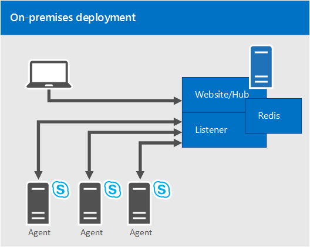

# Planifier le gestionnaire de statistiques pour Skype Entreprise ServerPlan for Statistics Manager for Skype for Business Server

**Résumé :** Consultez cette rubrique pour en savoir plus sur le gestionnaire de statistiques pour Skype entreprise Server.**Summary:** Read this topic to learn about Statistics Manager for Skype for Business Server.

 Le Gestionnaire de statistiques pour Skype Entreprise Server est un outil puissant qui permet de consulter Skype pour l’état et les performances des données entreprise Server en temps réel.Statistics Manager for Skype for Business Server is a powerful tool that allows you to view Skype for Business Server health and performance data in real time. Vous pouvez interroger les données de performances sur des centaines de serveurs à des intervalles de quelques secondes et afficher les résultats instantanément sur le site Web de Gestionnaire de Statistiques.You can poll performance data across hundreds of servers every few seconds, and view the results instantly on the Statistics Manager Website.

Vous pouvez utiliser le gestionnaire de statistiques pour identifier les problèmes de performances en cours, afficher les résultats d’un changement planifié pour votre environnement, suivre la résolution des pannes et bien plus encore.You can use Statistics Manager to identify ongoing performance issues, view the results of a planned change to your environment, track resolution of outages, and much more. Le gestionnaire de statistiques est configuré à l’aide des seuils d’indicateur d’intégrité clé (KHI) et peut être personnalisé pour répondre aux besoins uniques de votre déploiement.Out of the box, Statistics Manager is configured with Key Health Indicator (KHI) thresholds, and can be customized to suit your deployment's unique needs.

Vous pouvez déployer le gestionnaire de statistiques dans un déploiement local dans lequel un serveur unique héberge tous les composants gestionnaires de statistiques côté serveur.You can deploy Statistics Manager in an on-premises deployment in which a single server hosts all of the server-side Statistics Manager components. Pour plus d’informations sur le déploiement du gestionnaire de statistiques, voir [déploiement de statistiques pour Skype entreprise Server](deploy.md).For more information about deploying Statistics Manager, see [Deploy Statistics Manager for Skype for Business Server](deploy.md). Si vous disposez déjà d’un déploiement de Statistics Manager, mais que vous n’avez pas encore effectué la mise à niveau vers la version 2,0, voir [Nouveautés de la version 2,0](plan.md#BKMK_WhatsNew) et [mise à niveau du gestionnaire de statistiques pour Skype entreprise Server](upgrade.md).If you already have an existing deployment of Statistics Manager, but you have not yet upgraded to Release 2.0, see [What's new in Release 2.0](plan.md#BKMK_WhatsNew) and [Upgrade Statistics Manager for Skype for Business Server](upgrade.md).

Cette rubrique contient les sections suivantes :This topic contains the following sections:

- [Fonctionnalités et fonctionnalitésFeatures and capabilities](plan.md#BKMK_Features)

- [Nouveautés de la version 2,0What's new in Release 2.0](plan.md#BKMK_WhatsNew)

- [ComposantsComponents](plan.md#BKMK_Components)

- [Déploiement localOn-premises deployment](plan.md#BKMK_DeploymentOptions)

- [Configuration requiseRequirements](plan.md#BKMK_Requirements)

- [Considérations en matière de sécuritéSecurity considerations](plan.md#BKMK_Security)

## Fonctionnalités et fonctionnalitésFeatures and capabilities

Le gestionnaire de statistiques vous permet d’effectuer les opérations suivantes :Statistics Manager allows you to:

- Affichez des données brutes pour tous les serveurs en temps réel.View raw data for all servers in real time. (Les données sont échantillonnées à un tarif très élevé et envoyées au site Web en moins d’une seconde.)(Data is sampled at a very high rate and sent to the website in less than one second.)

- Afficher des données agrégées pour un rôle spécifique ; par exemple, serveur frontal, serveur de médiation, serveur Edge, etc.View data that is aggregated for a specific role; for example, Front End Server, Mediation Server, Edge Server, and so on.

- Explorez les données vers le bas pour afficher les données de sites spécifiques, des pools spécifiques au sein du site, puis des serveurs spécifiques au sein de la liste.Drill down to view data for specific sites, specific pools within the site, and then specific servers within the pool.

- Créez des graphiques personnalisés de telle sorte que les compteurs sélectionnés apparaissent par défaut.Create custom charts so that chosen counters are shown by default.

- Effectuer un zoom et un panoramique sur les axes x et y ou sur l’axe x uniquement.Zoom and pan on both the x- and y- axes or on the x-axis only.

- Utiliser des plages de dates ou des points dans le temps pour filtrer des données.Use date ranges or points in time to filter data.

- Affichez les performances du serveur sur la base des indicateurs d’État clés (KHIs).View server performance based on established key health indicators (KHIs). KHIs représenter une collection de compteurs de performance avec une plage correcte définie.KHIs represent a collection of performance counters with a defined healthy range.

- Affichez des mesures détaillées pour chaque compteur.View detailed metrics for each counter.

- Comparer les données entre plusieurs populations ou serveurs.Compare data across multiple populations or servers.

- Afficher les rapports de compteurs latent pour identifier les agents qui ne signalent pas de données actuelles au service de tableau de bord.View latent counter reports to identify agents that are not reporting current data to the dashboard service.

- Enregistrez une instance particulière de données de graphique dans un fichier.Save a particular instance of chart data to a file.

- Affichez KHIs en temps réel, y compris les mises à jour.View KHIs in real time, including updates. Si la vue historique est activée, seules les nouvelles erreurs sont affichées.If the history view is enabled, only new failures are shown.

  - Afficher tous les KHIs en une seule foisView all KHIs at one time

  - Afficher KHIs par serveur (vue paysage)View KHIs by server (Landscape view)

  - Afficher les définitions KHIView KHI definitions

## Nouveautés de la version 2,0What's new in Release 2.0

Les rubriques suivantes décrivent les nouveautés de la version 2,0.The following describes what's new in Release 2.0. Si vous avez un déploiement de Statistics Manager et que vous n’avez pas encore effectué la mise à niveau, reportez-vous à la rubrique [mise à niveau du gestionnaire de statistiques pour Skype entreprise Server](upgrade.md).If you have an existing deployment of Statistics Manager and you've not yet upgraded, see [Upgrade Statistics Manager for Skype for Business Server](upgrade.md).

- Des affichages de scénario ont été ajoutés pour des scénarios de média, d’intégrité de fabrique et de basculement de pool.Scenario views have been added for Edge Media, Fabric Health, Pool Failover and Registration scenarios.

- De nombreux nouveaux compteurs ont été ajoutés pour les serveurs SQL Server, d’autres compteurs d’utilisation Skype entreprise, etc.Many new counters have been added for SQL servers, more Skype for Business usage counters, and so on.

- Intégration de nœud d’observateur pour l’agent gestionnaire de statistiques-si l’agent est installé sur un nœud de l’observateur, il signalera les statistiques de transaction synthétique en tant que compteurs aux statistiques Manager.Watcher node integration for the Statistics Manager Agent - if the Agent is installed on a watcher node, it will report synthetic transaction statistics as counters back to Statistics Manager.

- De nombreuses améliorations liées à la fiabilité et aux performances.Numerous reliability and performance improvements.

Pour vérifier la version du site Web du gestionnaire de statistiques que vous exécutez :To verify the version of the Statistics Manager Website you are running:

- Dans l’Explorateur de fichiers, ouvrez (répertoire par défaut) C:\Program Files\Skype entreprise Server Stats WebSite\binIn File Explorer, open (default directory) C:\Program Files\Skype for Business Server StatsMan WebSite\bin

- Cliquer avec le bouton droit sur StatsManHubWebSite. dll et afficher ses propriétésRight click on StatsManHubWebSite.dll and view its properties

- La version du produit s’affiche dans les détails de la description.The product version will be shown in the Description details.

## ComposantsComponents

Le gestionnaire de statistiques comprend les composants suivants :Statistics Manager consists of the following components:

- **Représentant.****Agent.** Un agent léger qui s’exécute sur chaque serveur surveillé.A lightweight agent that runs on each monitored server. L’agent autorise une interrogation de haut débit configurable des compteurs de performance avec une agrégation locale.The Agent allows configurable high rate polling of performance counters with local aggregation.

- **Écouteur.****Listener.** API côté serveur qui reçoit les données de tous les agents et agrège les données entre les populations.The server side API that receives data from all Agents, and aggregates data across populations.

- **Raccord.****Hub.** Sert d’API client pour le système, s’exécute sur le ou des serveurs Web et fournit des mises à jour de données en temps réel aux clients connectés via le site Web.Serves as the client API for the system, runs on the web server(s), and provides real-time data updates to clients connected via the website. (Le concentrateur est automatiquement installé en même temps que le site Web msi.)(The Hub is automatically installed as part of the Website msi.)

- **Associates.****Website.** Une interface utilisateur qui rassemble toutes les fonctionnalités disponibles dans le système.A user interface that pulls together all the features available in the system.

De plus, le gestionnaire de statistiques nécessite des **ReDim**, un serveur de structure de données en source d’ouverture pour la mise en cache en mémoire.In addition, Statistics Manager requires **Redis**, an open-sourced data structure server for in-memory caching. Pour plus d’informations sur le téléchargement de ReDim, voir [déploiement de statistiques](deploy.md#BKMK_Deploy) .For more information about downloading Redis, see [Deploy Statistics Manager](deploy.md#BKMK_Deploy) .

## Déploiement localOn-premises deployment

Dans un déploiement local, un serveur unique héberge tous les composants du gestionnaire de statistiques côté serveur.In an on-premises deployment, a single server hosts all of the server-side Statistics Manager components.

Le diagramme suivant illustre un déploiement local, dans lequel le site Web du gestionnaire de statistiques, le concentrateur, l’écouteur et le système de mise en cache de ReDim sont hébergés sur un seul ordinateur.The following diagram shows an on-premises deployment, in which the Statistics Manager Website, Hub, Listener, and Redis caching system are hosted on a single machine. Le gestionnaire de statistiques analyse trois serveurs Skype entreprise, chacun d’eux disposant d’un seul agent pour transmettre des données à l’écouteur.Statistics Manager is monitoring three Skype for Business servers, each of which have a single Agent transmitting data to the Listener. Les utilisateurs se connectent à un site Web unique pour afficher toutes les données agrégées par le gestionnaire de statistiques :Users connect to a single Website to view all data aggregated by Statistics Manager:

## Configuration requiseRequirements

Avant de déployer Statistics Manager, vous devez tenir compte des éléments suivants concernant le logiciel, la mise en réseau et la configuration matérielle requise.You will need to consider the following software, networking, and hardware requirements before you deploy Statistics Manager.

### Configuration logicielle requiseSoftware requirements

- Windows Server 2016 et 2019Windows Server 2016 and 2019

- IIS (installé automatiquement)IIS (automatically installed)

- Redis géréRedis

- Services du gestionnaire de statistiques (installés automatiquement)Statistics Manager services (automatically installed)

- PSExec-requis pour le déploiement d’agent distantPSExec - Required to do remote agent deployment

- .NET 4,5 (inclus avec 2012 R2)-requis pour les agents et les composants côté serveur.NET 4.5 (included with 2012 R2) - Required for agents and server-side components
- Télécharger [Skype entreprise Server, gestionnaire de statistiques en temps réel (64)](https://www.microsoft.com/en-in/download/details.aspx?id=57518)Download the [Skype for Business Server, Real-Time Statistics Manager (64-bit)](https://www.microsoft.com/en-in/download/details.aspx?id=57518)

### Configuration réseau requiseNetworking requirements

|**Serveur d’hébergement****Hosting server**|**Agents****Agents**|**Écouteur****Listener**|
|:-----|:-----|:-----|
|Mise en réseau Gigabit duplex intégral minimum.Minimum gigabit full duplex networking.    |Port TCP sortant 8443 (numéro de Port personnalisable) pour communiquer avec l’écouteur.Outbound TCP port 8443 (customizable port number) to communicate with the Listener.    |Le port d’écoute doit être le même sur tous les serveurs.The Listener port must be the same on all servers.    |
|Port TCP entrant 80 ou 443 ouvert pour héberger le site Web.Inbound TCP port 80 or 443 open to host the website.    |||
|Port TCP entrant 8443 (numéro de Port personnalisable) pour que les agents puissent communiquer avec lui.Inbound TCP port 8443 (customizable port number) for the agents to communicate with it.    |||

Lors de l’installation, les ports de pare-feu pour l’écouteur et le site Web sont automatiquement créés.During installation, firewall ports for the Listener and the Website are automatically created. Pour les agents, l’installation part du principe que les connexions TCP sortantes sont autorisées par défaut.For the Agents, the installation assumes that outbound TCP connections are allowed by default.

### Configuration matérielle requiseHardware requirements

Dans un déploiement local, dans lequel un serveur unique héberge tous les composants gestionnaires de statistiques côté serveur, un serveur doté de 16 Go de mémoire vive (RAM) et de 4 UC doit être en mesure de prendre en charge des exemples de 150 par seconde en moyenne.In an on-premises deployment, in which a single server hosts all of the server-side Statistics Manager components, a server with 16 GB of RAM and 4 CPU's should be able to support about 150 samples per second on average. Pour déterminer le nombre de compteurs/agents pris en charge, procédez comme suit :To determine how many counters/agents you can support, use the following calculation:

100 serveurs \*80 compteurs \* 1 exemple par minute de chaque agent/60 secondes = ~ 133 exemples par seconde.100 servers \*80 counters \* 1 sample per minute from each agent / 60 seconds = ~ 133 samples per second.

## Considérations en matière de sécuritéSecurity considerations

Tout le trafic entre les serveurs est crypté.All traffic between servers is encrypted.

- Le trafic HTTPs chiffré sera envoyé via le port 8443 (par défaut) de l’agent au serveur d’écouteur.Encrypted HTTPS traffic will be sent over port 8443 (by default) from the Agent to the Listener server.

- L’agent vérifie l’empreinte SSL du serveur pour vérifier que le serveur de l’écouteur est le destinataire attendu.The Agent will verify the SSL thumbprint on the server to ensure the Listener server is the expected recipient. Notez que l’agent utilise la vérification de l’empreinte de certificat (au lieu de la vérification de la chaîne).Note that the Agent uses certificate thumbprint verification (instead of chain verification). Il n’effectue pas de validation de certificat complète, car il est possible d’utiliser des certificats auto-signés.It will not do full certificate validation because it is possible to use self-signed certificates.

- Dès lors que l’agent est satisfait, l’écouteur est authentifié et un mot de passe est présenté par l’agent qui est ensuite vérifié par l’écouteur.After the Agent is satisfied the Listener is authentic, a password will be presented by the Agent which is then verified by the Listener.

- L’agent commence à transmettre les données de performances par le biais de la connexion à l’écouteur.The Agent begins transmitting performance data over the connection to the Listener.

## Pour plus d'informationsFor more information

Pour plus d'informations, voir les articles suivants :For more information, see the following:

- [Déploiement du gestionnaire de statistiques pour Skype Entreprise ServerDeploy Statistics Manager for Skype for Business Server](deploy.md)

- [Mise à niveau du gestionnaire de statistiques pour Skype Entreprise ServerUpgrade Statistics Manager for Skype for Business Server](upgrade.md)

- [Dépannage du gestionnaire de statistiques pour Skype Entreprise ServerTroubleshoot Statistics Manager for Skype for Business Server](troubleshoot.md)
