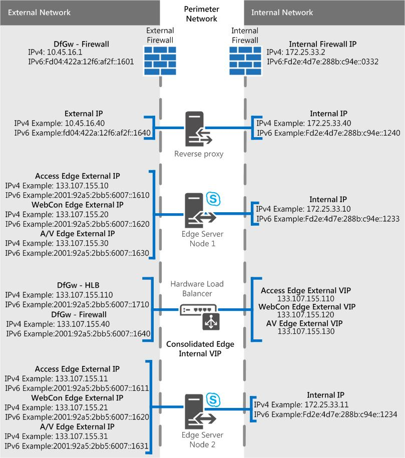

# Scénarios de serveur Edge dans Skype Entreprise Server
 
**Résumé :** Examinez ces scénarios pour vous aider à planifier votre topologie de serveur Edge dans Skype Entreprise Server.
  
Nous avons des diagrammes de scénarios pour vous aider à visualiser et à choisir la topologie Skype Entreprise Server serveur Edge que vous souhaitez implémenter. Une fois que vous avez choisi un bon candidat, vous pouvez consulter les exigences environnementales que vous devrez répondre. Les exemples suivants s’appliquent à tous les scénarios, c’est pourquoi nous le mentionnons en premier.
  
Ces chiffres, qui sont affichés à titre d’exemple uniquement (et qui contiennent des exemples de données IPv4 et IPv6), ne représentent pas le flux de communication réel, mais plutôt une vue d’ensemble de votre trafic possible. Les détails des ports sont également visibles dans les diagrammes de port pour chaque scénario ci-dessous.
  
Les diagrammes montrent .com pour l’interface externe et .net pour l’interface interne, qui est également un exemple de matériel ; Bien entendu, vos propres entrées peuvent être assez différentes lorsque vous rassemblez votre propre plan Edge final.
  
Nous n’incluons pas le directeur (qui est un composant facultatif) dans les diagrammes, mais vous pouvez en savoir plus séparément (il est mentionné dans d’autres rubriques de planification).
  
Comme indiqué ci-dessus, il existe des exemples de données IPv6 dans les diagrammes. La majeure partie de la documentation de plan pour les [déploiements](edge-server-deployments.md) de serveurs Edge dans Skype Entreprise Server fait référence à IPv4, mais vous êtes certainement pris en charge si vous souhaitez utiliser IPv6. Notez que vous aurez besoin d’adresses IPv6 dans votre espace d’adressare affecté et qu’elles devront fonctionner avec l’adressare interne et externe, comme avec les adresses IP IPv4. Grâce à Windows, vous pouvez utiliser la fonctionnalité double pile, qui est une pile réseau distincte pour IPv4 et IPv6. Cela vous permettra, si nécessaire, d’affecter simultanément des adresses IPv4 et IPv6.
  
Il existe des périphériques NAT qui autorisent NAT64 (IPv6 vers IPv4) et NAT66 (IPv6 vers IPv6)), et cela est valide pour une utilisation avec Skype Entreprise Server.
  
> [!IMPORTANT]
> Si vous utilisez le contrôle d’admission des appels (CAC), vous devez utiliser IPv4 sur l’interface interne pour qu’il fonctionne. 
  
## Serveur Edge consolidé unique Skype Entreprise Server avec adresses IP privées et NAT

Avec ce scénario, il n’existe aucune option pour la haute disponibilité. Cela signifie que vous dépensez moins sur le matériel et que vous avez un déploiement plus simple. Si la haute disponibilité est une valeur à prendre en compte, consultez les scénarios consolidés à l’échelle ci-dessous.
  

  
### Diagramme de port

Nous avons également un diagramme pour les ports pour les serveurs Edge consolidés.
  

  
## Serveur Edge Skype Entreprise Server consolidé unique avec adresses IP publiques

Avec ce scénario, il n’existe aucune option pour la haute disponibilité. Cela signifie que vous dépensez moins sur le matériel et que vous avez un déploiement plus simple. Si la haute disponibilité est une valeur à prendre en compte, consultez les scénarios consolidés à l’échelle ci-dessous.
  

  
### Diagramme de port

Nous avons également un diagramme pour les ports pour les serveurs Edge consolidés.
  

  
## Mise à l’échelle consolidée Skype Entreprise Server pool edge, avec équilibrage de charge DNS, adresses IP privées et NAT

Avec ce scénario, vous pouvez bénéficier d’une haute disponibilité dans votre déploiement Edge, ce qui vous offre les avantages de l’évolutivité et de la prise en charge duover.
  

  
### Diagramme de port

Nous avons également un diagramme pour les pools Edge consolidés à l’échelle avec équilibrage de charge DNS.
  

  
## Mise à l’échelle Skype Entreprise Server pool edge, avec équilibrage de charge DNS et adresses IP publiques

Avec ce scénario, vous pouvez bénéficier d’une haute disponibilité dans votre déploiement Edge, ce qui vous offre les avantages de l’évolutivité et de la prise en charge duover.
  

  
### Diagramme de port

Nous avons également un diagramme pour les pools Edge consolidés à l’échelle avec équilibrage de charge DNS.
  

  
## Mise à l’échelle consolidée Skype Entreprise Server pool Edge, avec équilibrage de la charge matérielle

Avec ce scénario, vous pouvez bénéficier d’une haute disponibilité dans votre déploiement Edge, ce qui vous offre les avantages de l’évolutivité et de la prise en charge duover.
  

 
