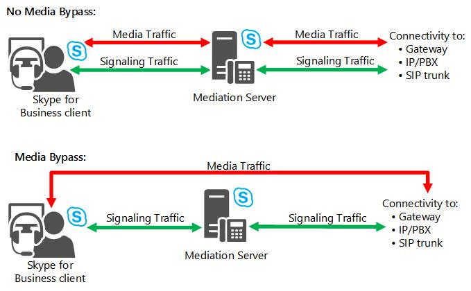

# Planifier le contrôle d’admission des appels dans Skype Entreprise Server

Découvrez le contrôle d’admission des appels, qui peut empêcher les appels d’avoir lieu s’ils auraient une qualité multimédia médiocre, Skype Entreprise Server Voix Entreprise.

Pour les applications IP telles que la téléphonie, la vidéo et le partage d’applications, la bande passante disponible des réseaux d’entreprise n’est généralement pas considérée comme un facteur limitant dans les environnements LAN. Toutefois, sur les liaisons WAN qui interconnectent des sites, la bande passante réseau peut être limitée.

Lorsque le trafic réseau surabonne une liaison de réseau wan, les mécanismes actuels tels que la mise en file d’accès, la mise en mémoire tampon et la suppression de paquets sont utilisés pour résoudre la congestion. Le trafic supplémentaire est généralement retardé jusqu’à ce que la congestion du réseau soit plus facile ou, si nécessaire, que le trafic soit abandonné. Pour le trafic de données classique dans de telles situations, le client de réception peut récupérer. Toutefois, pour le trafic en temps réel tel que les communications unifiées, la congestion du réseau ne peut pas être résolue de cette manière, car le trafic de communications unifiées est sensible à la latence et à la perte de paquets. La congestion du réseau wan wan peut entraîner une mauvaise qualité de l’expérience (QoE) pour les utilisateurs. Pour le trafic en temps réel dans des conditions saturées, il est préférable de refuser des appels plutôt que de fournir des connexions de qualité médiocre.

Le contrôle d’admission des appels (CAC) détermine si la bande passante réseau est suffisante pour établir une session en temps réel de qualité acceptable. Dans Skype Entreprise Server, cac contrôle le trafic en temps réel uniquement pour l’audio et la vidéo, mais il n’affecte pas le trafic de données. Si la bande passante n’est pas suffisante sur le chemin du réseau étendu par défaut, le contrôle d’admission des appels peut essayer d’acheminer l’appel via un chemin Internet ou sur le réseau téléphonique commuté (PSTN).

Cette section décrit le contrôle d’admission des appels et explique comment le planifier.

> [!NOTE]
> Skype Entreprise Server offre trois fonctionnalités Voix Entreprise avancées : le contrôle d’admission des appels (CAC), les services d’urgence (E9-1-1) et le contournement de média. Pour une vue d’ensemble des informations de planification communes à ces trois [fonctionnalités,](network-settings-for-advanced-features.md)voir Paramètres réseau pour les fonctionnalités Voix Entreprise avancées dans Skype Entreprise Server .

La conception cac dans Skype Entreprise Server offre quatre attributs principaux :

- Le contrôle d’admission des appels est simple à déployer et à gérer sans recours à un équipement supplémentaire, tel que des routeurs configurés spécialement.

- Il traite les scénarios d’utilisation des communications unifiées critiques, tels que les utilisateurs itinérants et les points de présence multiples. Les stratégies du contrôle d’admission des appels sont appliquées selon l’emplacement du système d’extrémité et non pas de l’emplacement où est hébergé l’utilisateur.

- Outre les appels vocaux, ce contrôle peut être appliqué à d’autres trafics, tels que les appels vidéo et les sessions de conférence audio/vidéo.

- Il fournit suffisamment de flexibilité pour permettre la représentation de différents types de topologies réseau.

Si ou nouvelle session audio ou vidéo dépasse les limites de bande passante définies sur une liaison WAN, la session est bloquée ou (pour les appels téléphoniques uniquement) réacheminée sur PSTN.

Le contrôle d’admission des appels contrôle le trafic en temps réel pour la voix et la vidéo uniquement. Il ne contrôle pas le trafic de données.

Les administrateurs définissent les stratégies cac, qui sont appliquées par le service de stratégie de bande passante installé avec chaque pool frontal. Les paramètres cac sont automatiquement propagés à tous Skype Entreprise Server serveurs frontaux de votre réseau.

Pour les appels qui échouent en raison des stratégies de contrôle d’admission des appels, l’ordre de priorité de réacheminement des appels est le suivant :

1. Internet

2. RTCP

3. Messagerie vocale

L’enregistrement des détails des appels capture les informations concernant les appels qui sont réacheminés vers PSTN ou la messagerie vocale. L’enregistrement des détails des appels ne capture pas les informations des appels non réacheminés sur Internet, car Internet est traité comme un autre chemin d’accès plutôt qu’une autre option.

> [!NOTE]
> Les dépôts de messages vocaux ne seront pas refusés en raison des contraintes de bande passante.

Le service de stratégie de bande passante génère deux types de fichiers journaux au format CSV (valeurs séparées par des virgules). Le fichier journal du **nombre d’échecs de vérification** capture les informations lorsque les demandes de bande passante sont refusées. Le fichier journal d’**utilisation des liaisons** capture un instantané de la topologie réseau et de l’utilisation de la bande passante de la liaison WAN. Ces deux fichiers journaux peuvent vous aider à affiner vos stratégies de contrôle d’admission des appels en fonction de l’utilisation.

## Considérations relatives au contrôle d’admission des appels

L’administrateur choisit d’installer le service de stratégie de bande passante sur le premier pool configuré dans le site central. Puisqu’il existe un seul site central par région réseau, il existe un seul service de stratégie de bande passante par région réseau, lequel gère la stratégie de bande passante pour cette région, ses sites associés et les liens vers ces sites. Le service de stratégie de bande passante s’exécute dans le cadre des serveurs frontux et, par conséquent, la haute disponibilité est intégrée dans ce pool. Le service de stratégie de bande passante s’exécutant sur chaque serveur frontal se synchronise toutes les 15 secondes. En cas d’échec du pool frontal, les stratégies cac ne sont plus appliquées pour ce site tant que le pool frontal et, par conséquent, le service de stratégie de bande passante ne sont plus opérationnels. Cela signifie que tous les appels sont transmis pendant la durée d’interruption du service de stratégie de bande passante. Par conséquent, il existe un risque de surabonnement de bande passante pour vos liens durant cette période.

Le service de stratégie de bande passante fournit une haute disponibilité au sein d’un pool frontal ; toutefois, il ne fournit pas de redondance entre les pools frontux. Le service de stratégie de bande passante ne peut pas faire l’aller d’un pool frontal à un autre. Une fois le service sur le pool frontal restauré, le service de stratégie de bande passante reprend et peut à nouveau appliquer des vérifications de stratégie de bande passante.

### Considérations relatives au réseau

Bien que la restriction de bande passante pour l’audio et la vidéo soit appliquée par le service de stratégie de bande passante dans Skype Entreprise Server, cette restriction n’est pas appliquée au routeur réseau (couches 2 et 3). Cac cannot prevent a data application, for example, from consuming the entire network bandwidth on a WAN link, including the bandwidth that is reserved for audio and video by your CAC policy. Pour protéger la bande passante nécessaire sur votre réseau, vous pouvez déployer un protocole de qualité de service (QoS), tel que DiffServ (Differentiated Services). Par conséquent, une meilleure pratique consiste à coordonner les stratégies de bande passante CAC que vous définissez avec les paramètres QoS que vous pourriez déployer.

### Chemins d’accès des médias et de la signalisation sur réseau privé virtuel (VPN)

Si votre entreprise prend en charge les médias via VPN, assurez-vous que les flux multimédia et de signalisation passent tous deux via le VPN ou qu’ils sont routés par le biais d’Internet. Par défaut, les flux multimédia et de signalisation passent par le tunnel VPN.

### Contrôle d’admission des appels des utilisateurs extérieurs

Le contrôle d’admission des appels n’est pas appliqué au-delà des limites de l’Skype Entreprise Server organisation. Le contrôle d’accès au contrôle d’accès ne peut pas être appliqué au trafic multimédia via Internet, qui n’est pas géré par Skype Entreprise Server. Les contrôles d’admission des appels seront effectués sur la partie de l’appel qui passe par le réseau d’entreprise si le point de terminaison appelé appartient à l’organisation et que le serveur Edge a été ajouté à la configuration réseau, comme décrit dans le déploiement du contrôle [d’admission](../../deploy/deploy-enterprise-voice/final-checklist.md)des appels : liste de vérification finale pour Skype Entreprise Server . Si le point de terminaison appelé n’appartient pas à l’organisation, tel qu’un utilisateur fédéré ou PIC, aucune vérification de stratégie de bande passante n’est effectuée et l’appel sortant ignore les restrictions cac.

### Contrôle d’admission des appels des connexions PSTN

Le contrôle d’admission des appels peut être appliqué sur le serveur de médiation, qu’il soit connecté à un système IP/PBX, à une passerelle PSTN ou à une connexion SIP. Étant donné que le serveur de médiation est un agent utilisateur dos à dos (B2BUA), il met fin au média. Il dispose de deux côtés de connexion : un côté connecté à Skype Entreprise Server et un côté passerelle, qui est connecté à des passerelles PSTN, des ip/PBX ou des trunks SIP. Pour plus d’informations sur les connexions PSTN, voir Planifier la connectivité [PSTN dans Skype Entreprise Server](pstn-connectivity-0.md).

Cac can be enforced on both sides of the Mediation Server unless media bypass is enabled. Si la déviation du trafic multimédia est activée, le trafic multimédia ne traverse pas le serveur de médiation, mais passe directement entre le client Skype Entreprise et la passerelle. Dans ce cas, le contrôle d’admission des appels n’est pas nécessaire. Pour plus d’informations, [voir Plan for media bypass in Skype Entreprise](media-bypass.md).

La figure suivante illustre la façon dont le contrôle d’admission des appels est appliqué sur les connexions PSTN avec ou sans le contournement de média activé.

**Application du contrôle d’admission des appels sur des connexions PSTN**

## Définition des conditions requises pour le contrôle d’admission des appels

La planification du contrôle d’admission des appels (CAC) requiert des informations détaillées sur votre topologie de réseau d’entreprise. Pour vous aider à planifier vos stratégies de contrôle d’admission des appels, procédez comme suit.

1. Identifiez les concentrateurs/dorsales principales (appelés régions réseau) dans votre réseau d’entreprise.

2. Identifiez les bureaux et emplacements (appelés sites réseau) dans chaque région réseau.

3. Déterminez l’itinéraire réseau entre chaque paire de régions réseau.

4. Déterminez les limites de bande passante pour chaque liaison réseau étendu (WAN).

    > [!NOTE]
    > Les limites de bande passante font référence à la quantité de bande passante sur une liaison WAN allouée au trafic Voix Entreprise et audio/vidéo. Lorsqu’une liaison de réseau wan est décrite comme « à bande passante limitée », la liaison de réseau wan a une limite de bande passante inférieure au trafic de pointe attendu sur la liaison.

5. Identifiez les sous-réseaux IP qui sont affectés à chaque site réseau.

Pour expliquer ces concepts, nous allons utiliser l’exemple de topologie réseau illustré dans la figure suivante.

**Exemple de topologie pour le contrôle d’admission des appels**

> [!NOTE]
> Tous les sites réseau sont associés à une région réseau. Par exemple, Portland, Reno et Albuquerque sont inclus dans la région Amérique du Nord. Dans cette figure, seules les liaisons réseau étendu auxquelles des stratégies de service Contrôle d’admission des appels sont appliquées sont présentées, avec des limites de bande passante. Les sites réseau Chicago, New York et Détroit apparaissent dans l’ovale de la région Amérique du Nord, car ils ne sont soumis à aucune limite de bande passante et ne nécessitent donc aucune stratégie de service Contrôle d’admission des appels.

Les composants de cet exemple de topologie sont décrits dans les sections suivantes. Pour plus d’informations sur la façon dont cette topologie a été planifiée, y compris les limites de bande passante, voir Exemple : Collecte des exigences pour le contrôle d’admission des appels [dans Skype Entreprise Server](example-gathering-requirements.md).

### Identifier les régions réseau

Une région réseau représente une dorsale principale ou un concentrateur réseau.

Une dorsale principale ou un concentrateur réseau fait partie de l’infrastructure réseau informatique qui interconnecte différents éléments du réseau, fournissant ainsi un chemin pour l’échange des informations entre différents réseaux locaux (LAN) ou sous-réseaux. Une dorsale principale peut lier divers réseaux d’un petit emplacement à une zone géographique étendue. La capacité de la dorsale principale est généralement plus grande que celle des réseaux qui s’y connectent.

Notre exemple de topologie comporte trois régions réseau : Amérique du Nord, EMEA et APAC. Une région réseau contient un ensemble de sites réseau (voir la définition des sites réseau plus loin dans cette rubrique). Collaborez avec votre équipe responsable des opérations réseau pour identifier vos régions réseau.

### Association d’un site central avec chaque région réseau

Le cac nécessite qu’Skype Entreprise Server site central soit défini pour chaque région réseau. Le site central est sélectionné en fonction de la meilleure connectivité réseau et de la bande passante la plus élevée parmi les autres sites de la région réseau. L’exemple précédent de topologie réseau montre trois régions réseau, chacune comportant un site central qui gère les décisions du service Contrôle d’admission des appels. Dans l’exemple précédent, l’association appropriée est indiquée dans le tableau ci-après.

> [!NOTE]
> Les sites centraux ne correspondent pas nécessairement aux sites réseau. Dans les exemples de cette documentation, certains sites centraux (Chicago, Londres et Pékin) ont les mêmes noms que les sites réseau. Toutefois, même si un site central et un site réseau partagent le même nom, le site central est un élément de la topologie Skype Entreprise Server, alors que le site réseau fait partie du réseau global dans lequel réside la topologie Skype Entreprise Server.

**Régions réseau, sites centraux et sites réseau**

|**Région réseau**|**Central Site**|**Sites réseau**|
|:-----|:-----|:-----|
|Amérique du Nord    |Chicago    |Chicago    New York    Détroit    Portland    Reno    Albuquerque    |
|EMEA    |Londres    |Londres    Kole    |
|APAC    |Beijing    |Beijing    Centre d’asie    |

### Identifier les sites réseau

Un site réseau représente un lieu physique pour votre organisation, par exemple des bureaux, un ensemble de bâtiments ou un campus. Tout lieu physique qui comporte un réseau local (LAN) et une connectivité de réseau étendu (WAN) vers d’autres sites est considéré comme un site réseau. Commencez par inventorier tous les bureaux de votre organisation. Dans notre exemple de topologie, la région réseau Amérique du Nord comporte les sites réseau suivants : New York, Chicago, Détroit, Portland, Reno et Albuquerque.

Vous devez associer chaque site réseau à une région réseau. Selon que le site réseau dispose d’une liaison réseau étendu restreinte, une stratégie de bande passante est associée au site réseau. Pour plus d’informations sur les stratégies de service Contrôle d’admission des appels et la bande passante que vous allouez en les utilisant, voir « Définir des stratégies de bande passante » plus loin dans cette rubrique. Pour configurer le service Contrôle d’admission des appels, associez des sites réseau à des régions réseau, puis créez des stratégies d’allocation de bande passante qui doivent être appliquées aux connexions à bande passante restreinte entre un site ou une région spécifique, mais aussi aux connexions réseau étendu entre des sites et des régions.

### Identifier des liaisons réseau

Les liaisons réseau représentent les connexions au réseau étendu physique qui relient différentes régions et différents sites. Dans notre exemple de topologie, il y a deux liaisons réseau régionales, cinq liaisons réseau entre des régions et des sites, et une liaison réseau entre deux sites.

Les deux liaisons régionales sont entre Amérique du Nord et EMEA, représentés par NA-EMEA-LINK, et entre APAC et EMEA, représentés par EMEA-APAC-LINK.

Les liaisons de sites sont indiquées par des traits connectant Portland, Reno et Albuquerque à la région Amérique du Nord, Manille à la région APAC, et Cologne à la région EMEA. Le trait entre Reno et Albuquerque indique une liaison réseau directe entre ces deux sites.

### Définir des stratégies de bande passante

Collaborez avec votre équipe responsable des opérations réseau pour déterminer la quantité de bande passante de réseau étendu mise à disposition du trafic audio et vidéo en temps réel sur les liaisons réseau étendu de votre organisation. Les stratégies de bande passante sont généralement appliquées aux liaisons réseau étendu si l’utilisation de la bande passante est restreinte ; c’est-à-dire, si on pense qu’elle sera supérieure à la bande passante pouvant être allouée aux modes audio et vidéo.

Les stratégies de bande passante du service Contrôle d’admission des appels définissent la bande passante maximale qui peut être réservée aux modes audio et vidéo en temps réel. Comme le service Contrôle d’admission des appels ne limite pas la bande passante d’un autre trafic de données, il ne peut pas empêcher les autres trafics de données (par exemple, un transfert de fichiers volumineux ou la diffusion en continu de morceaux de musique) d’utiliser toute la bande passante réseau.

Les stratégies de bande passante CAC peuvent définir un ou plusieurs des éléments suivants :

- Bande passante totale maximale allouée à l’audio.

- Bande passante totale maximale allouée à la vidéo.

- Bande passante maximale allouée à un appel audio unique (session).

- Bande passante maximale allouée à un appel vidéo unique (session).

> [!NOTE]
> Toutes les valeurs de bande passante CAC représentent les limites  *maximales de bande*  passante unidirectionnelle.

> [!NOTE]
> Les fonctionnalités Skype Entreprise Server stratégie de voix permettent de remplacer les contrôles de stratégie de bande passante pour les appels entrants à l’utilisateur (et non pour les appels sortants qui sont placés par l’utilisateur). Une fois la session établie, la consommation de bande passante est calculée avec précision. Ce paramètre doit être utilisé avec modération. Pour plus d’informations, voir Create [or modify a voice policy and configure PSTN usage records in Skype Entreprise](../../deploy/deploy-enterprise-voice/voice-policy-and-pstn-usage-records.md) or Modify a Voice Policy and [Configure PSTN Usage Records](/previous-versions/office/lync-server-2013/lync-server-2013-modify-a-voice-policy-and-configure-pstn-usage-records) in the Deployment documentation.

Pour optimiser l’utilisation de la bande passante par session, tenez compte du type des codecs audio et vidéo qui seront utilisés. Plus particulièrement, allouez suffisamment de bande passante pour un codec que vous pensez utiliser fréquemment. À l’inverse, si vous souhaitez empêcher le média d’utiliser un codec nécessitant davantage de bande passante, définissez une bande passante maximale par session qui soit suffisamment basse pour décourager ce type d’utilisation. Pour l’audio, tous les codecs ne sont pas disponibles pour chaque scénario. Par exemple :

- Les appels audio d’égal à égal entre les points de terminaison Skype Entreprise utiliseront RTAudio (8 kHz) ou RTAudio (16 KHz) lorsque vous prendrez en compte la bande passante et la hiérérisation des codecs.

- Les téléconférences entre Skype Entreprise et le service de conférence A/V utiliseront G.722 ou Siren.

- Les appels vers le réseau téléphonique commuté (PSTN) vers ou depuis les points de terminaison Skype Entreprise utiliseront G.711 ou RTAudio (8 KHz).

Utilisez le tableau suivant pour optimiser les paramètres de bande passante par session maximale.

**Utilisation de la bande passante par codecs**

|**Codec**|**Besoin en bande passante sans correction des erreurs de transfert (FEC)**|**Besoin en bande passante avec correction des erreurs de transfert (FEC)**|
|:-----|:-----|:-----|
|RTAudio (8 kHz)    |49,8 Kbits/s    |61,6 Kbits/s    |
|RTAudio (16 kHz)    |67 Kbits/s    |96 Kbits/s    |
|Siren    |57,6 Kbits/s    |73,6 Kbits/s    |
|G.711    |102 Kbits/s    |166 Kbits/s    |
|G.722    |105,6 Kbits/s    |169,6 Kbits/s    |
|RTVideo (CIF 15 i/s)    |260 Kbits/s    |Non applicable    |
|RTVideo (VGA 30 i/s)    |610 Kbits/s    |Non applicable    |

> [!NOTE]
> Les besoins en bande passante prennent en compte le traitement des éléments suivants : Ethernet II, IP, UDP (User Datagram Protocol), RTP (Real-Time Transport Protocol) et SRTP (Secure Real-Time Transport Protocol). Ils incluent également 10 Kbits/s pour le traitement RTCP.

Les codecs G.722.1 et Siren sont similaires, mais offrent différentes vitesses de transmission.

G.722, le codec par défaut pour Skype Entreprise Server conférence, est complètement différent des codecs G.722.1 et Siren.

Le codec Siren est utilisé dans Skype Entreprise Server dans les situations suivantes :

- La stratégie de bande passante est définie sur une valeur trop basse pour permettre l’utilisation de G.722.

- Si un client Communications Server 2007 ou Communications Server 2007 R2 se connecte à un service de conférence Skype Entreprise Server (car ces clients ne sont pas en charge le codec G.722).

**Utilisation de la bande passante par scénario**

|**Scénario**|**Besoins en bande passante optimisés pour la quantité (Kbits/s)**|**Besoins en bande passante pour le mode équilibré (Kbits/s)**|**Besoins en bande passante optimisés pour la qualité (Kbits/s)**|
|:-----|:-----|:-----|:-----|
|Appels audio d’égal à égal    |45 Kbits/s    |62 Kbits/s    |91 Kbits/s    |
|Téléconférences    |53 Kbits/s    |101 Kbits/s    |165 Kbits/s    |
|Appels PSTN (entre la passerelle Skype Entreprise et la passerelle PSTN, avec contournement de média)    |97 Kbits/s    |97 Kbits/s    |161 Kbits/s    |
|Appels PSTN (entre Skype Entreprise serveur de médiation, sans contournement de média)    |45 Kbits/s    |97 Kbits/s    |161 Kbits/s    |
|Appels PSTN (entre le serveur de médiation et la passerelle PSTN, sans contournement de média)    |97 Kbits/s    |97 Kbits/s    |161 Kbits/s    |
|Skype Entreprise - Appels Polycom    |101 Kbits/s    |101 Kbits/s    |101 Kbits/s    |

### Identifier les sous-réseaux IP

Pour chaque site réseau, vous devrez collaborer avec votre administrateur réseau pour déterminer les sous-réseaux IP affectés à chaque site réseau. Si votre administrateur réseau a déjà organisé les sous-réseaux IP en régions réseau et sites réseau, votre travail est considérablement simplifié.

Dans notre exemple, le site New York de la région Amérique du Nord se voit affecter les sous-réseaux IP suivants : 172.29.80.0/23, 157.57.216.0/25, 172.29.91.0/23, 172.29.81.0/24. Supposons que Bob, qui travaille généralement à Détroit, se rende dans les bureaux de New York pour suivre une formation. Quand il allume son ordinateur et se connecte au réseau, son ordinateur obtient une adresse IP dans l’une des quatre plages réservées à New York (par exemple, 172.29.80.103).

> [!CAUTION]
> Les sous-réseaux IP spécifiés pendant la configuration du réseau sur le serveur doivent correspondre au format fourni par les ordinateurs clients afin d’être correctement utilisés pour le contournement de média. Un client Skype Entreprise prend son adresse IP locale et masque l’adresse IP avec le masque de sous-réseau associé. Lors de la détermination de l’ID de contournement associé à chaque client, le serveur d’inscriptions comparera la liste des sous-réseaux IP associés à chaque site réseau avec le sous-réseau fourni par le client pour obtenir une correspondance exacte. Pour cette raison, il est important que les sous-réseaux entrés lors de la configuration du réseau sur le serveur soient des sous-réseaux réels et non des sous-réseaux virtuels. (Si vous déployez le contrôle d’admission des appels, mais pas le contournement de média, le contrôle d’admission des appels fonctionne correctement même si vous configurez des sous-réseaux virtuels.) Par exemple, si un client se signe sur un ordinateur avec une adresse IP 172.29.81.57 avec un masque de sous-réseau IP 255.255.255.0, Skype Entreprise demande l’ID de contournement associé au sous-réseau 172.29.81.0. Si le sous-réseau est défini comme 172.29.0.0/16, bien que le client appartienne au sous-réseau virtuel, le serveur d’inscriptions ne considérera pas cela comme une correspondance, car le serveur d’inscriptions recherche spécifiquement le sous-réseau 172.29.81.0. Par conséquent, il est important que l’administrateur entre les sous-réseaux exactement tels que fournis par les clients Skype Entreprise (qui sont fournis avec des sous-réseaux lors de la configuration réseau de manière statique ou par DHCP).)

## Meilleures pratiques en matière de contrôle d’admission des appels

Pour améliorer les performances et faciliter le déploiement, appliquez les meilleures pratiques suivantes lorsque vous déployez le contrôle d’admission des appels :

- Assurez-vous que les réseaux sans accès sans accès sont correctement provisionés pour le trafic multimédia actuel et anticipé.

    > [!NOTE]
    > Nous vous recommandons de prendre en compte les limites de bande passante dans une mémoire tampon. Il existe des scénarios tels que les conditions de course qui affectent la bande passante totale utilisée et peuvent entraîner des situations où la limite de bande passante est dépassée. Par exemple, si deux appels tentent de démarrer alors que le trafic multimédia approche d’une limite de bande passante, l’un d’eux peut être refusé, car l’autre a réussi à démarrer en premier.

- Surveillez l’utilisation du réseau et les enregistrements des détails des appels afin de pouvoir choisir des paramètres CAC optimaux et de mettre à jour les paramètres cac en cas de modification de l’utilisation du réseau.

- Utilisez des stratégies de bande passante CAC pour compléter les paramètres QoS.

- Si vous souhaitez ré-router les appels bloqués vers le réseau téléphonique (PSTN), vérifiez la capacité et la fonctionnalité PSTN. Pour plus d’informations, voir [Planning Outbound Call Routing](/previous-versions/office/lync-server-2013/lync-server-2013-planning-outbound-voice-routing).

    > [!NOTE]
    > La capacité fait référence au nombre de ports que vous devez ouvrir pour prendre en charge un éventuel ré-routage PSTN.