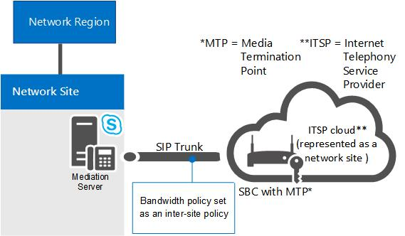

# Composants et topologies utilisés pour le contrôle d’admission des appels dans Skype Entreprise 2015Components and topologies for call admission control in Skype for Business 2015
 
Planification du contrôle d’admission des appels si vous disposez d’un réseau MPLS, d’une jonction SIP (Session Initiation Protocol) ou d’une passerelle RTC ou d’un système PBX tiers.Planning for call admission control (CAC) if you have an MPLS network, a SIP trunk, or a third-party PSTN gateway or PBX. S’applique à Skype Business Server Voix Entreprise.Applies to Skype for Business Server Enterprise Voice.
  
Les rubriques de cette section donnent des informations sur les considérations spécifiques de déploiement du contrôle d’admission des appels (CAC) avec différents types de topologies réseau.The topics in this section provide information about special considerations for deploying call admission control (CAC) with various types of network topologies.
  
## Contrôle d’admission des appels sur un réseau MPLSCall admission control on an MPLS network

Dans un réseau MPLS (Multiprotocol Label Switching), tous les sites sont connectés par un maillage. C’est-à-dire que tous les sites sont connectés directement au segment principal MPLS du fournisseur de services Internet, chaque site recevant la bande passante à utiliser sur une liaison de réseau étendu au cloud MPLS. Il n’y a aucun concentrateur réseau ou site central pour contrôler le routage IP. La figure suivante montre un réseau simple basé sur la technologie MPLS.In a Multiprotocol Label Switching (MPLS) network, all sites are connected by a full-mesh. That is, all sites are connected directly to the MPLS backbone of the Internet service provider, and each site is provisioned bandwidth to be used across a WAN link to the MPLS cloud. There is no network hub or central site to control IP routing. The following figure shows a simple network based on MPLS technology.
  
**Exemple de réseau MPLS****Example MPLS network**

  
Pour déployer le contrôle d’admission des appels dans un réseau MPLS, vous devez créer une région sur le réseau pour représenter le cloud MPLS et créer un site réseau pour représenter chaque site satellite MPLS. La figure suivante montre comment la région et les sites du réseau doivent être configurés pour représenter le réseau MPLS exemple dans la figure précédente. Les limites globales de bande passante et de session de bande passante sont ensuite basées sur la capacité de la liaison de réseau étendu de chaque site vers la région qui représente le cloud MPLS.To deploy call admission control (CAC) in an MPLS network, you create a network region to represent the MPLS cloud, and create a network site to represent each MPLS satellite site. The following figure illustrates how the network region and network sites should be configured to represent the example MPLS network in the previous figure. The overall bandwidth limits and bandwidth session limits are then based on the capacity of the WAN link from each network site to the network region that represents the MPLS cloud.
  
**Région de réseau et les sites de réseau pour un réseau MPLS****Network region and network sites for an MPLS network**

  
## Contrôle d’admission des appels sur une jonction SIPCall admission control on a SIP trunk

Pour déployer le contrôle d’admission des appels sur une jonction SIP, vous créez un site réseau pour représenter le fournisseur de services de téléphonie Internet (ITSP). Pour appliquer la stratégie de bande passante sur la jonction SIP, vous créez une stratégie intersite entre le site réseau dans votre entreprise et le site réseau créé pour représenter le fournisseur de services de téléphonie Internet.To deploy call admission control (CAC) on a SIP trunk, you create a network site to represent the Internet telephony service provider (ITSP). To apply bandwidth policy values on the SIP trunk, you create an inter-site policy between the network site in your enterprise and the network site that you create to represent the ITSP.
  
La figure suivante montre un exemple de déploiement du contrôle d’admission des appels sur une jonction SIP.The following figure shows an example CAC deployment on a SIP trunk.
  
**Configuration de CAC sur un SIP trunk****CAC configuration on a SIP trunk**

  
Pour configurer le contrôle d’admission des appels sur une jonction SIP, vous devrez exécuter les tâches suivantes pendant le déploiement du contrôle d’admission des appels :To configure CAC on a SIP trunk, you will have to perform the following tasks during CAC deployment:
  
1. Créez un site réseau pour représenter le fournisseur de services de téléphonie Internet.Create a network site to represent the ITSP. Associez le site réseau à une région réseau appropriée, et allouez une bande passante nulle pour l’audio et la vidéo pour ce site réseau.Associate the network site to an appropriate network region, and allocate bandwidth of zero for audio and video for this network site. Pour plus d’informations, consultez [Configurer les Sites de réseau pour la CAC](http://technet.microsoft.com/library/afcea38f-5789-45ec-97af-c6e38364950c.aspx) dans la documentation de déploiement.For details, see [Configure Network Sites for CAC](http://technet.microsoft.com/library/afcea38f-5789-45ec-97af-c6e38364950c.aspx) in the Deployment documentation.
    
    > [!NOTE]
    > Pour le fournisseur de services de téléphonie Internet, cette configuration de site réseau n’est pas fonctionnelle. Les valeurs de stratégie de bande passante sont en fait appliquées à l’étape 2.For the ITSP, this network site configuration is not functional. Bandwidth policy values are actually applied in step 2. 
  
2. Créez un lien intersite pour la jonction SIP à l’aide des valeurs de paramètre pertinentes pour le site créé à l’étape 1.Create an inter-site link for the SIP trunk using the relevant parameter values for the site you created in step 1. Par exemple, utilisez le nom du site réseau dans votre entreprise comme valeur du paramètre NetworkSiteID1 et le site réseau du fournisseur de services de téléphonie Internet comme valeur du paramètre NetworkSiteID2.For example, use the name of the network site in your enterprise as the value of the NetworkSiteID1 parameter, and the ITSP network site as the value of the NetworkSiteID2 parameter. Pour plus d’informations, consultez [créer les stratégies réseau intersites dans Skype pour Business Server 2015](../../deploy/deploy-enterprise-voice/create-network-intersite-policies.md) dans la documentation sur le déploiement et [New-CsNetworkInterSitePolicy](https://docs.microsoft.com/powershell/module/skype/new-csnetworkintersitepolicy?view=skype-ps).For details, see [Create network intersite policies in Skype for Business Server 2015](../../deploy/deploy-enterprise-voice/create-network-intersite-policies.md) in the Deployment documentation, and [New-CsNetworkInterSitePolicy](https://docs.microsoft.com/powershell/module/skype/new-csnetworkintersitepolicy?view=skype-ps).
    
3. Obtenir l’adresse IP du contrôleur bordure Session (SCB) de Point de terminaison du média à partir de votre ITSP.Get the IP address of the Session Border Controller's (SCB) Media Termination Point from your ITSP. Ajoutez cette adresse IP avec un masque de sous-réseau de 32 au site réseau qui représente le fournisseur de services de téléphonie Internet.Add that IP address with a subnet mask of 32 to the network site that represents the ITSP. Pour plus d’informations, voir [associer un sous-réseau à un Site de réseau](http://technet.microsoft.com/library/aa69e3ac-542a-4ba1-9582-2e6bee29f633.aspx).For details, see [Associate a Subnet with a Network Site](http://technet.microsoft.com/library/aa69e3ac-542a-4ba1-9582-2e6bee29f633.aspx).
    
## Contrôle d’admisson des appels avec une passerelle RTC ou un système PBX tiersCall admission control with a third-party PSTN gateway or PBX

Cette rubrique décrit les exemples de l’appel de contrôle d’admission (CAC) peut être déployé sur le lien entre l’interface de passerelle du serveur de médiation et une passerelle de réseau téléphonique commuté tiers ou un autocommutateur privé (PBX).This topic describes examples of how call admission control (CAC) can be deployed on the link between the Mediation Server's gateway interface and a third-party public switched telephone network (PSTN) gateway or private branch exchange (PBX).
  
### Exemple 1 : Contrôle d’admission des appels entre le serveur de médiation et une passerelle RTCCase 1: CAC between the Mediation Server and a PSTN gateway

CAC peut être déployé sur le réseau étendu lien à partir de l’interface du serveur de médiation de passerelle à passerelle PBX ou PSTN tiers.CAC can be deployed on the WAN link from the Mediation Server's gateway interface to a third-party PBX or PSTN gateway.
  
**Cas 1 : CAC entre le serveur de médiation et une passerelle PSTN****Case 1: CAC between the Mediation Server and a PSTN gateway**

  
Dans cet exemple, CAC est appliqué entre le serveur de médiation et une passerelle PSTN.In this example, CAC is applied between the Mediation Server and a PSTN gateway. Si un Skype pour utilisateur de client d’entreprise au réseau Site 1 place un appel RTC via la passerelle RTC dans un réseau de Site 2, les supports passe par la liaison réseau étendu.If a Skype for Business client user at Network Site 1 places a PSTN call through the PSTN gateway in Network Site 2, the media flows through the WAN link. Par conséquent, deux vérifications de contrôle d’admission des appels sont effectuées pour chaque session RTC :Therefore, two CAC checks are performed for each PSTN session:
  
- Entre le Skype pour application de client d’entreprise et le serveur de médiationBetween the Skype for Business client application and the Mediation Server
    
- Entre le serveur de médiation et la passerelle RTCBetween the Mediation Server and the PSTN gateway
    
Cet exemple s’applique aux appels RTC entrants vers un client dans Site réseau 1, ainsi qu’aux appels RTC sortants issus d’une application cliente dans Site réseau n1.This works for both incoming PSTN calls to a client in Network Site 1, and for outgoing PSTN calls originating from a client application in Network Site 1.
  
> [!NOTE]
> Assurez-vous que le sous-réseau IP auquel appartient la passerelle RTC est configuré et associé au Site réseau 2.Make sure that the IP subnet that the PSTN gateway belongs to is configured and associated with Network Site 2. 
  
> [!NOTE]
> Assurez-vous que le sous-réseau IP appartenant à deux interfaces du serveur de médiation est configuré et associé au réseau Site 1.Make sure that the IP subnet that both interfaces of the Mediation Server belong to is configured and associated with Network Site 1. 
  
> [!NOTE]
> Pour plus d’informations, voir [associer un sous-réseau à un Site de réseau](http://technet.microsoft.com/library/aa69e3ac-542a-4ba1-9582-2e6bee29f633.aspx).For details, see [Associate a Subnet with a Network Site](http://technet.microsoft.com/library/aa69e3ac-542a-4ba1-9582-2e6bee29f633.aspx). 
  
### Cas 2 : CAC entre le serveur de médiation et d’un PBX tiers avec le Point de terminaison du médiaCase 2: CAC between the Mediation Server and a third-party PBX with Media Termination Point

Cette configuration est semblable à l’exemple 1.This configuration is similar to Case 1. Dans les deux cas, le serveur de médiation sait quel périphérique termine media à l’extrémité opposée de la liaison WAN, et l’adresse IP de la passerelle PSTN ou PBX avec arrêt Point protocole MTP (Media) est configuré sur le serveur de médiation comme tronçon suivant.In both the cases, the Mediation Server knows what device terminates media at the opposite end of the WAN link, and the IP address of the PSTN gateway or PBX with Media Termination Point (MTP) is configured on the Mediation Server as the next hop.
  
**Cas 2 : CAC entre le serveur de médiation et d’un PBX tiers avec MTP****Case 2: CAC between the Mediation Server and a third-party PBX with MTP**

  
Dans cet exemple, CAC est appliqué entre le serveur de médiation et le PBX/plan de référence.In this example, CAC is applied between the Mediation Server and the PBX/MTP. Si un Skype pour utilisateur de client entreprise sur le Site de réseau 1 place un appel RTC via le PBX/MTP situé dans un réseau de Site 2, les supports passe par la liaison réseau étendu.If a Skype for Business client user at the Network Site 1 places a PSTN call through the PBX/MTP located in Network Site 2, the media flows through the WAN link. Par conséquent, pour chaque session RTC, deux vérifications de contrôle d’admission des appels sont effectuées :Therefore, for each PSTN session two CAC checks are performed:
  
- Entre le Skype pour application de client d’entreprise et le serveur de médiationBetween the Skype for Business client application and the Mediation Server
    
- Entre le serveur de médiation et le PBX/MTPBetween the Mediation Server and the PBX/MTP
    
Cet exemple s’applique aux appels RTC entrants vers un client dans Site réseau n° 1, ainsi qu’aux appels RTC sortants issus d’un client dans Site réseau n° 1.This works for both incoming PSTN calls to a client in Network Site 1, and outgoing PSTN calls originating from a client in Network Site 1.
  
> [!NOTE]
> Assurez-vous que le sous-réseau IP auquel appartient le MTP est configuré et associé au Site réseau 2.Make sure that the IP subnet that the MTP belongs to is configured and associated with Network Site 2. 
  
> [!NOTE]
> Assurez-vous que le sous-réseau IP appartenant à deux interfaces du serveur de médiation est configuré et associé au réseau Site 1.Make sure that the IP subnet that both interfaces of the Mediation Server belong to is configured and associated with Network Site 1. 
  
> [!NOTE]
> Pour plus d’informations, voir [associer un sous-réseau à un Site de réseau](http://technet.microsoft.com/library/aa69e3ac-542a-4ba1-9582-2e6bee29f633.aspx).For details, see [Associate a Subnet with a Network Site](http://technet.microsoft.com/library/aa69e3ac-542a-4ba1-9582-2e6bee29f633.aspx). 
  
### Cas 3 : Les CAC entre le serveur de médiation et d’un PBX tiers sans un Point de terminaison du médiaCase 3: CAC between the Mediation Server and a third-party PBX without a Media Termination Point

L’exemple 3 est légèrement différent des deux premiers.Case 3 is slightly different from the first two cases. S’il n’existe aucun plan de référence sur le PBX tiers, pour une session sortante demande au PBX tiers le serveur de médiation ne sait pas où media va se terminer dans la limite de PBX.If there is no MTP on the third-party PBX, for an outgoing session request to the third-party PBX the Mediation Server does not know where media will terminate in the PBX boundary. Dans ce cas, le média circule directement entre le serveur de médiation et le périphérique de point de terminaison fournisseur tiers.In this case, the media flows directly between the Mediation Server and the third-party endpoint device.
  
**Cas 3 : Les CAC entre le serveur de médiation et d’un PBX tiers sans MTP****Case 3: CAC between the Mediation Server and a third-party PBX without MTP**

  
Dans cet exemple, si un Skype pour utilisateur de client d’entreprise au réseau Site 1 place un appel à un utilisateur par le PBX, le serveur de médiation peut effectuer des vérifications CAC uniquement sur la jambe de proxy entre (le Skype pour application de client d’entreprise) et serveur de médiation.In this example, if a Skype for Business client user at Network Site 1 places a call to a user through the PBX, the Mediation Server is able to perform CAC checks only on the proxy leg (between the Skype for Business client application and Mediation Server). Car le serveur de médiation n’a pas d’informations sur le périphérique de point de terminaison pendant que la session est demandée, les vérifications CAC n’est pas possible sur le réseau étendu lien (entre le serveur de médiation et le point de terminaison fournisseur tiers) avant l’établissement d’un appel.Because the Mediation Server does not have information about the endpoint device while the session is being requested, CAC checks cannot be performed on the WAN link (between the Mediation Server and the third-party endpoint) prior to call establishment. Une fois la session établie, toutefois, le serveur de médiation facilite dans la comptabilité pour la bande passante utilisée du tronc.After the session is established, however, the Mediation Server facilitates in accounting for the bandwidth used on the trunk.
  
Pour les appels qui proviennent du point de terminaison fournisseur tiers, les informations sur ce périphérique de point de terminaison sont disponibles au moment de la demande de session et contrôle CAC peut être effectué sur les deux côtés du serveur de médiation.For calls that originate from the third-party endpoint, the information about that endpoint device is available at the time of session request and CAC check can be performed on both the sides of the Mediation Server.
  
> [!NOTE]
> Assurez-vous que le sous-réseau IP auquel appartiennent les périphériques de point de terminaison est configuré et associé au Site réseau 2.Make sure that the IP subnet that the endpoint devices belong to is configured and associated with Network Site 2. 
  
> [!NOTE]
> Assurez-vous que le sous-réseau IP appartenant à deux interfaces du serveur de médiation est configuré et associé au réseau Site 1.Make sure that the IP subnet that both interfaces of the Mediation Server belong to is configured and associated with Network Site 1. 
  
> [!NOTE]
> Pour plus d’informations, voir [associer un sous-réseau à un Site de réseau](http://technet.microsoft.com/library/aa69e3ac-542a-4ba1-9582-2e6bee29f633.aspx).For details, see [Associate a Subnet with a Network Site](http://technet.microsoft.com/library/aa69e3ac-542a-4ba1-9582-2e6bee29f633.aspx). 
  

