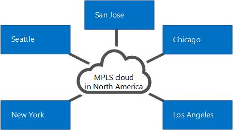

# Composants et topologies utilisés pour le contrôle d’admission des appels dans Skype Entreprise 2015
 
Planification du contrôle d’admission des appels si vous disposez d’un réseau MPLS, d’une jonction SIP (Session Initiation Protocol) ou d’une passerelle RTC ou d’un système PBX tiers. S’applique à Skype Business Server Voix Entreprise.
  
Les rubriques de cette section donnent des informations sur les considérations spécifiques de déploiement du contrôle d’admission des appels (CAC) avec différents types de topologies réseau.
  
## Contrôle d’admission des appels sur un réseau MPLS

Dans un réseau MPLS (Multiprotocol Label Switching), tous les sites sont connectés par un maillage. C’est-à-dire que tous les sites sont connectés directement au segment principal MPLS du fournisseur de services Internet, chaque site recevant la bande passante à utiliser sur une liaison de réseau étendu au cloud MPLS. Il n’y a aucun concentrateur réseau ou site central pour contrôler le routage IP. La figure suivante montre un réseau simple basé sur la technologie MPLS.
  
**Exemple de réseau MPLS**

  
Pour déployer le contrôle d’admission des appels dans un réseau MPLS, vous devez créer une région sur le réseau pour représenter le cloud MPLS et créer un site réseau pour représenter chaque site satellite MPLS. La figure suivante montre comment la région et les sites du réseau doivent être configurés pour représenter le réseau MPLS exemple dans la figure précédente. Les limites globales de bande passante et de session de bande passante sont ensuite basées sur la capacité de la liaison de réseau étendu de chaque site vers la région qui représente le cloud MPLS.
  
**Région de réseau et les sites de réseau pour un réseau MPLS**

  
## Contrôle d’admission des appels sur une jonction SIP

Pour déployer le contrôle d’admission des appels sur une jonction SIP, vous créez un site réseau pour représenter le fournisseur de services de téléphonie Internet (ITSP). Pour appliquer la stratégie de bande passante sur la jonction SIP, vous créez une stratégie intersite entre le site réseau dans votre entreprise et le site réseau créé pour représenter le fournisseur de services de téléphonie Internet.
  
La figure suivante montre un exemple de déploiement du contrôle d’admission des appels sur une jonction SIP.
  
**Configuration de CAC sur un SIP trunk**

  
Pour configurer le contrôle d’admission des appels sur une jonction SIP, vous devrez exécuter les tâches suivantes pendant le déploiement du contrôle d’admission des appels :
  
1. Créez un site réseau pour représenter le fournisseur de services de téléphonie Internet. Associez le site réseau à une région réseau appropriée, et allouez une bande passante nulle pour l’audio et la vidéo pour ce site réseau. Pour plus d’informations, consultez [Configurer les Sites de réseau pour la CAC](http://technet.microsoft.com/library/afcea38f-5789-45ec-97af-c6e38364950c.aspx) dans la documentation de déploiement.
    
    > [!NOTE]
    > Pour le fournisseur de services de téléphonie Internet, cette configuration de site réseau n’est pas fonctionnelle. Les valeurs de stratégie de bande passante sont en fait appliquées à l’étape 2. 
  
2. Créez un lien intersite pour la jonction SIP à l’aide des valeurs de paramètre pertinentes pour le site créé à l’étape 1. Par exemple, utilisez le nom du site réseau dans votre entreprise comme valeur du paramètre NetworkSiteID1 et le site réseau du fournisseur de services de téléphonie Internet comme valeur du paramètre NetworkSiteID2. Pour plus d’informations, consultez [créer les stratégies réseau intersites dans Skype pour Business Server 2015](../../deploy/deploy-enterprise-voice/create-network-intersite-policies.md) dans la documentation sur le déploiement et [New-CsNetworkInterSitePolicy](https://docs.microsoft.com/powershell/module/skype/new-csnetworkintersitepolicy?view=skype-ps).
    
3. Obtenir l’adresse IP du contrôleur bordure Session (SCB) de Point de terminaison du média à partir de votre ITSP. Ajoutez cette adresse IP avec un masque de sous-réseau de 32 au site réseau qui représente le fournisseur de services de téléphonie Internet. Pour plus d’informations, voir [associer un sous-réseau à un Site de réseau](http://technet.microsoft.com/library/aa69e3ac-542a-4ba1-9582-2e6bee29f633.aspx).
    
## Contrôle d’admisson des appels avec une passerelle RTC ou un système PBX tiers

Cette rubrique décrit les exemples de l’appel de contrôle d’admission (CAC) peut être déployé sur le lien entre l’interface de passerelle du serveur de médiation et une passerelle de réseau téléphonique commuté tiers ou un autocommutateur privé (PBX).
  
### Exemple 1 : Contrôle d’admission des appels entre le serveur de médiation et une passerelle RTC

CAC peut être déployé sur le réseau étendu lien à partir de l’interface du serveur de médiation de passerelle à passerelle PBX ou PSTN tiers.
  
**Cas 1 : CAC entre le serveur de médiation et une passerelle PSTN**

  
Dans cet exemple, CAC est appliqué entre le serveur de médiation et une passerelle PSTN. Si un Skype pour utilisateur de client d’entreprise au réseau Site 1 place un appel RTC via la passerelle RTC dans un réseau de Site 2, les supports passe par la liaison réseau étendu. Par conséquent, deux vérifications de contrôle d’admission des appels sont effectuées pour chaque session RTC :
  
- Entre le Skype pour application de client d’entreprise et le serveur de médiation
    
- Entre le serveur de médiation et la passerelle RTC
    
Cet exemple s’applique aux appels RTC entrants vers un client dans Site réseau 1, ainsi qu’aux appels RTC sortants issus d’une application cliente dans Site réseau n1.
  
> [!NOTE]
> Assurez-vous que le sous-réseau IP auquel appartient la passerelle RTC est configuré et associé au Site réseau 2. 
  
> [!NOTE]
> Assurez-vous que le sous-réseau IP appartenant à deux interfaces du serveur de médiation est configuré et associé au réseau Site 1. 
  
> [!NOTE]
> Pour plus d’informations, voir [associer un sous-réseau à un Site de réseau](http://technet.microsoft.com/library/aa69e3ac-542a-4ba1-9582-2e6bee29f633.aspx). 
  
### Cas 2 : CAC entre le serveur de médiation et d’un PBX tiers avec le Point de terminaison du média

Cette configuration est semblable à l’exemple 1. Dans les deux cas, le serveur de médiation sait quel périphérique termine media à l’extrémité opposée de la liaison WAN, et l’adresse IP de la passerelle PSTN ou PBX avec arrêt Point protocole MTP (Media) est configuré sur le serveur de médiation comme tronçon suivant.
  
**Cas 2 : CAC entre le serveur de médiation et d’un PBX tiers avec MTP**

  
Dans cet exemple, CAC est appliqué entre le serveur de médiation et le PBX/plan de référence. Si un Skype pour utilisateur de client entreprise sur le Site de réseau 1 place un appel RTC via le PBX/MTP situé dans un réseau de Site 2, les supports passe par la liaison réseau étendu. Par conséquent, pour chaque session RTC, deux vérifications de contrôle d’admission des appels sont effectuées :
  
- Entre le Skype pour application de client d’entreprise et le serveur de médiation
    
- Entre le serveur de médiation et le PBX/MTP
    
Cet exemple s’applique aux appels RTC entrants vers un client dans Site réseau n° 1, ainsi qu’aux appels RTC sortants issus d’un client dans Site réseau n° 1.
  
> [!NOTE]
> Assurez-vous que le sous-réseau IP auquel appartient le MTP est configuré et associé au Site réseau 2. 
  
> [!NOTE]
> Assurez-vous que le sous-réseau IP appartenant à deux interfaces du serveur de médiation est configuré et associé au réseau Site 1. 
  
> [!NOTE]
> Pour plus d’informations, voir [associer un sous-réseau à un Site de réseau](http://technet.microsoft.com/library/aa69e3ac-542a-4ba1-9582-2e6bee29f633.aspx). 
  
### Cas 3 : Les CAC entre le serveur de médiation et d’un PBX tiers sans un Point de terminaison du média

L’exemple 3 est légèrement différent des deux premiers. S’il n’existe aucun plan de référence sur le PBX tiers, pour une session sortante demande au PBX tiers le serveur de médiation ne sait pas où media va se terminer dans la limite de PBX. Dans ce cas, le média circule directement entre le serveur de médiation et le périphérique de point de terminaison fournisseur tiers.
  
**Cas 3 : Les CAC entre le serveur de médiation et d’un PBX tiers sans MTP**

  
Dans cet exemple, si un Skype pour utilisateur de client d’entreprise au réseau Site 1 place un appel à un utilisateur par le PBX, le serveur de médiation peut effectuer des vérifications CAC uniquement sur la jambe de proxy entre (le Skype pour application de client d’entreprise) et serveur de médiation. Car le serveur de médiation n’a pas d’informations sur le périphérique de point de terminaison pendant que la session est demandée, les vérifications CAC n’est pas possible sur le réseau étendu lien (entre le serveur de médiation et le point de terminaison fournisseur tiers) avant l’établissement d’un appel. Une fois la session établie, toutefois, le serveur de médiation facilite dans la comptabilité pour la bande passante utilisée du tronc.
  
Pour les appels qui proviennent du point de terminaison fournisseur tiers, les informations sur ce périphérique de point de terminaison sont disponibles au moment de la demande de session et contrôle CAC peut être effectué sur les deux côtés du serveur de médiation.
  
> [!NOTE]
> Assurez-vous que le sous-réseau IP auquel appartiennent les périphériques de point de terminaison est configuré et associé au Site réseau 2. 
  
> [!NOTE]
> Assurez-vous que le sous-réseau IP appartenant à deux interfaces du serveur de médiation est configuré et associé au réseau Site 1. 
  
> [!NOTE]
> Pour plus d’informations, voir [associer un sous-réseau à un Site de réseau](http://technet.microsoft.com/library/aa69e3ac-542a-4ba1-9582-2e6bee29f633.aspx). 
  

