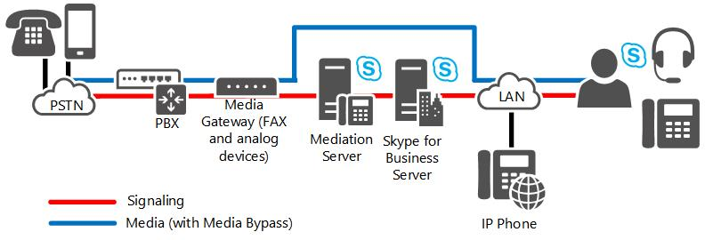

# Connexions SIP directes dans Skype Entreprise Server

Les connexions SIP directes sont Skype Entreprise Server entre les passerelles PSTN et les passerelles PSTN et IP-PBX dans Voix Entreprise.

Vous pouvez utiliser des connexions SIP directes pour Skype Entreprise Server à l’une des connexions suivantes :

- Un PBX IP

- Une passerelle PSTN

Pour mettre en œuvre une connexion SIP directe, vous devez essentiellement suivre la même procédure de déploiement que pour mettre en œuvre une jonction SIP. Dans les deux cas, vous implémentez la connexion à l’aide de l’interface externe d’un serveur de médiation. La seule différence est que vous connectez les jonctions SIP à une entité externe, comme une passerelle ITSP, et connectez les connexions SIP directes à une entité interne dans le réseau local, comme un PBX IP ou une passerelle PSTN.

## Options de déploiement SIP direct

### Skype Entreprise Server Stand-Alone

Si votre organisation utilise l’un des déploiements décrits dans cette section, vous pouvez utiliser Skype Entreprise Server comme seule solution téléphonique pour une partie ou l’ensemble d’une organisation. Cette section décrit en détail les déploiements suivants :

- **Déploiement incrémentielle :** Cette option suppose que vous avez une infrastructure PBX (Private Branch Exchange) existante et que vous avez l’intention d’introduire Voix Entreprise de manière incrémentielle pour les groupes ou les équipes de plus petite taille au sein de votre organisation.

- **Déploiement VoIP uniquement** : cette option suppose que vous envisagez de déployer Voix Entreprise sur un site qui n’a pas d’infrastructure téléphonique traditionnelle.

#### Déploiement incrémentielle

Dans un déploiement incrémentielle, Skype Entreprise Server est l’unique solution téléphonique pour des équipes ou des services individuels, tandis que le reste des utilisateurs d’une organisation continuent d’utiliser un PBX. Cette stratégie de déploiement incrémentielle offre un moyen d’introduire la téléphonie IP dans votre entreprise via des programmes pilotes contrôlés. Les groupes de travail dont les besoins de communication sont mieux servis par Microsoft Unified Communications sont déplacés vers Voix Entreprise, tandis que d’autres utilisateurs restent sur le PBX existant. Des groupes de travail supplémentaires peuvent être migrés vers Voix Entreprise, selon les besoins.

L’option incrémentielle est recommandée si vous avez clairement défini des groupes d’utilisateurs qui ont des exigences de communication en commun et qui se prêtent à la gestion centralisée. Cette option est également efficace si vous avez des équipes ou des services répartis sur des zones géographiques étendues, où les économies en frais longue distance peuvent être importantes. En fait, cette option est utile pour créer des équipes virtuelles dont les membres peuvent être dispersés dans le monde entier. Vous pouvez créer, modifier ou débander de telles équipes en réponse rapidement au changement d’exigence de l’entreprise.

La figure suivante illustre la topologie générique pour le déploiement de Voix Entreprise derrière un PBX. Il s’agit de la topologie recommandée pour le déploiement incrémentielle.

**Option de déploiement incrémentielle**

> [!NOTE]
> Si vous connectez votre déploiement Skype Entreprise Server à un partenaire SIP direct certifié, une passerelle PSTN (réseau téléphonique commuté) entre le serveur de médiation et le PBX n’est pas nécessaire. Pour obtenir la liste des partenaires SIP directs certifiés, voir le programme d’interopérabilité d’ouverture des [communications unifiées microsoft.](../../../SfbPartnerCertification/lync-cert/qualified-ip-pbx-gateway.md)

> [!NOTE]
> Le chemin d’accès au média illustré dans cette figure a la déviation du média activée (configuration recommandée). Si vous choisissez de désactiver le contournement de média, le chemin d’accès du média est acheminé via le serveur de médiation.

Dans cette topologie, les services ou groupes de travail sélectionnés sont activés pour les Voix Entreprise. Une passerelle PSTN relie le groupe de travail voIP (Voice over Internet Protocol) au PBX. Les utilisateurs activés pour Voix Entreprise, y compris les travailleurs à distance, communiquent sur le réseau IP. Les appels Voix Entreprise les utilisateurs vers le réseau téléphonique (PSTN) et les collègues qui ne sont pas activés pour Voix Entreprise sont acheminés vers la passerelle PSTN appropriée. Les appels provenant de collègues qui sont encore sur le système PBX ou d’appelants sur le réseau téléphonique public (RSTN) sont acheminés vers la passerelle PSTN, qui les a transmis à Skype Entreprise Server pour le routage.

Il existe deux configurations recommandées pour la connexion de Voix Entreprise à une infrastructure PBX existante pour l’interopérabilité : Voix Entreprise derrière le PBX et Voix Entreprise devant le PBX.

#### Voix Entreprise Derrière le PBX

Lorsque Voix Entreprise est déployé derrière le PBX, tous les appels du PSTN arrivent au PBX, qui route les appels vers les utilisateurs Voix Entreprise vers une passerelle PSTN et les appels aux utilisateurs PBX vers le PBX.

#### Voix Entreprise devant le PBX

Lorsque Voix Entreprise est déployé devant le PBX, tous les appels arrivent à la passerelle PSTN, qui approvisionnement les appels pour les utilisateurs Voix Entreprise vers Skype Entreprise Server et les appels pour les utilisateurs PBX vers le PBX. Les appels vers le réseau téléphonique public (PSTN) des utilisateurs Voix Entreprise et PBX sont acheminés sur le réseau IP vers la passerelle PSTN la plus économique. Le tableau suivant présente les avantages et les inconvénients de cette configuration.

**Avantages et inconvénients du déploiement de Voix Entreprise frontal du PBX**

|**Avantages**|**Inconvénients**|
|:-----|:-----|
|PBX sert toujours les utilisateurs non activés pour Voix Entreprise.    |Les passerelles existantes peuvent ne pas prendre en charge les fonctionnalités ou la capacité que vous souhaitez.    |
|PBX gère tous les appareils précédents.    |Nécessite une passerelle de passerelle vers le PBX et de la passerelle vers le serveur de médiation. Vous aurez peut-être besoin de plus de trunks du fournisseur de services.    |
|Voix Entreprise utilisateurs conservent les mêmes numéros de téléphone.    |   |

#### VoIP-Only déploiement

Voix Entreprise offre de nouvelles entreprises, ainsi que de nouveaux sites office pour les entreprises existantes, la possibilité d’implémenter une solution VoIP complète sans avoir à vous soucier de l’intégration de PBX ou des coûts importants de déploiement et de maintenance d’une infrastructure IP-PBX. Cette solution prend en charge les travailleurs sur site et à distance.

Dans ce déploiement, tous les appels sont acheminés sur le réseau IP. Les appels vers le PSTN sont acheminés vers la passerelle PSTN appropriée. Skype Entreprise ou Lync Téléphone Edition fait office de téléphone portable. Le contrôle d’appel distant est indisponible et inutile, car les utilisateurs ne peuvent contrôler aucun téléphone PBX. Les services de messagerie vocale et de attendant automatique sont disponibles via le déploiement facultatif de la messagerie unifiée Exchange messagerie unifiée.

> [!NOTE]
> Outre l’infrastructure réseau requise pour prendre en charge Skype Entreprise Server, un déploiement VoIP uniquement peut utiliser une petite passerelle qualifiée pour prendre en charge les télécopieurs et les périphériques analogiques.

La figure suivante illustre une topologie classique pour un déploiement VoIP uniquement.

**Option de déploiement VoIP uniquement**

> [!NOTE]
> Le chemin d’accès au média illustré dans cette figure a la déviation du média activée (configuration recommandée). Si vous choisissez de désactiver le contournement de média, le chemin d’accès du média est acheminé via le serveur de médiation.

## Options de déploiement de passerelle PSTN

### Passerelles PSTN

Les passerelles du réseau téléphonique commuté (PSTN) sont des composants matériels tiers qui convertissent la signalisation et les médias entre l’infrastructure Voix Entreprise et le réseau téléphonique commuté, directement ou via une connexion à des jonctions SIP. Quelle que soit la topologie utilisée, la passerelle permet le raccordement au réseau téléphonique commuté. La passerelle est isolée dans son propre sous-réseau et est connectée au réseau d’entreprise via le serveur de médiation.

Une entreprise constituée de plusieurs sites déploie généralement une ou plusieurs passerelles sur chaque site. Les sites de succursale peuvent se connecter au réseau PSTN par le biais d’une passerelle ou d’un Survivable Branch Appliance, qui combine la passerelle et les serveurs dans une seule zone. Si les sites de succursale utilisent une passerelle, un serveur d’inscriptions et un serveur de médiation sont requis sur le site, sauf si la liaison wan est résiliente. Un ou plusieurs serveurs de médiation, c collocés sur des serveurs frontaux, peuvent router les appels pour une ou plusieurs passerelles sur chaque site. Nous recommandons que le serveur d’inscriptions, le serveur de médiation et la passerelle requis sur le site soient déployés en tant que Survivable Branch Appliance.

Déterminer le nombre, la taille et l’emplacement des passerelles PSTN est peut-être la décision la plus importante et la plus coûteuse que vous devez prendre lors de la planification de votre infrastructure Voix Entreprise réseau.

Voici les principales questions à se poser. N’oubliez pas que les réponses à ces questions sont toutes interdépendantes.

- Combien de passerelles PSTN sont nécessaires ? La réponse dépend du nombre d’utilisateurs, du nombre anticipé d’appels simultanés (charge du trafic) et du nombre de sites (chaque site a besoin d’une passerelle).

- Quelle doit être la taille des passerelles ? La réponse dépend du nombre d’utilisateurs sur le site et de la charge du trafic.

- Quel doit être l’emplacement des passerelles ? La réponse dépend en partie de la topologie et de la répartition géographique de votre entreprise.

  Vous devriez également tenir compte des options au niveau de la topologie de votre passerelle (pour plus d’informations, voir la section Topologies de passerelles plus loin dans cette rubrique).

#### M:N Prise en charge des jonctions

Les serveurs de médiation peuvent router les appels via plusieurs passerelles, des contrôleurs de frontière de session (SCS) fournis par des fournisseurs de services de téléphonie Internet ou une combinaison des deux. En outre, plusieurs serveurs de médiation du pool peuvent interagir avec plusieurs passerelles. L’itinéraire logique défini entre un serveur de médiation et une passerelle est appelé une liaison. Lorsqu’un utilisateur interne passe un appel PSTN, la logique de routage sortant sur le pool frontal choisit la ligne à router parmi toutes les combinaisons possibles disponibles pour le routage de cet appel particulier. Avec l’équilibrage de charge DNS, si un appel ne parvient pas à atteindre une passerelle en raison d’un problème avec un serveur de médiation particulier dans le pool, l’appel est retenté vers un autre serveur de médiation du pool.

Pour plus d’informations sur la planification de plusieurs passerelles, voir [la](m-n-trunk.md)Skype Entreprise Server .

Pour plus d’informations sur les autres améliorations apportées au routage du trafic sortant, voir [Call Routes](/previous-versions/office/lync-server-2013/lync-server-2013-voice-routes).

#### Topologies de passerelles

Quand vous examinez les questions fondamentales relatives au déploiement des passerelles, procédez comme suit :

1. Comptez les sites sur lesquels vous souhaitez fournir une connectivité PSTN à l’aide Voix Entreprise.

2. Évaluez le trafic sur chacun d’eux (nombre d’utilisateurs et nombre moyen d’appels par heure et par utilisateur).

3. Déployez une ou plusieurs passerelles sur chaque site pour gérer le trafic prévu.

Avec cette topologie, les appels entre collaborateurs sur chaque site et entre les sites sont tous routés sur votre intranet. Les appels qui parviennent au réseau téléphonique commuté sont routés sur le réseau IP de l’entreprise vers les passerelles les plus proches de l’emplacement des numéros de destination. Mais que se passe-t-il si votre entreprise prend en charge des douzaines ou des centaines, voire des milliers de sites répartis sur plusieurs continents, comme c’est le cas de nombreuses institutions financières et grandes entreprises ? Dans ces cas, le déploiement d’une passerelle distincte sur chaque site n’est pas pratique.

Pour résoudre ce problème, de nombreuses grandes entreprises préfèrent déployer un ou plusieurs sites centraux de téléphonie de grande taille.

Dans cette topologie, plusieurs passerelles de grande taille suffisantes pour prendre en charge la charge utilisateur prévue sont déployées sur chaque site central. Tous les appels à destination des utilisateurs de l’entreprise sont transmis par le fournisseur de services téléphoniques de la société vers un site central. La logique de routage sur le site central détermine si l’appel doit être acheminé sur l’intranet ou vers le réseau téléphonique principal.

#### Emplacement de la passerelle

L’emplacement de la passerelle peut également déterminer les types de passerelles que vous choisissez et leur configuration. Il existe des douzaines de protocoles PSTN, dont aucun n’est un standard mondial. Si toutes vos passerelles se situent dans un seul pays ou une seule région, cela n’est pas un problème, mais si vous les placez dans plusieurs pays/régions, chacune d’elles doit être configurée en fonction des normes PSTN du pays ou de la région. De plus, les passerelles qui sont certifiées pour fonctionner, par exemple, au Canada, peuvent ne pas être certifiées en Inde, au Brésil ou dans l’Union européenne.

#### Taille et nombre des passerelles

La taille des passerelles PSTN que la plupart des entreprises envisagent de déployer peut aller de 2 et 960 ports. (Il existe des passerelles encore plus importantes, mais celles-ci sont principalement utilisées par des fournisseurs de services téléphoniques.) Lors de l’estimation du nombre de ports requis dans votre entreprise, suivez les instructions suivantes :

- Les entreprises dont l’utilisation de la téléphonie est faible (un appel PSTN par utilisateur et par heure) doivent allouer un port pour 15 utilisateurs. Par exemple, si votre entreprise regroupe 20 utilisateurs, vous avez besoin d’une passerelle dotée de deux ports.

- Les entreprises dont l’utilisation de la téléphonie est modérée (deux appels PSTN par utilisateur et par heure) doivent allouer un port pour 10 utilisateurs. Par exemple, si votre entreprise regroupe 100 utilisateurs, vous avez besoin d’un total de 10 ports alloués sur une ou plusieurs passerelles.

- Les entreprises dont l’utilisation de la téléphonie est forte (trois appels PSTN ou plus par utilisateur et par heure) doivent allouer un port pour cinq utilisateurs. Par exemple, si votre entreprise regroupe 47 000 utilisateurs, vous avez besoin d’un total de 9 400 ports alloués sur au moins 10 passerelles de grande envergure.

- D’autres ports peuvent être acquis à mesure que le nombre d’utilisateurs ou la quantité de trafic augmente dans votre entreprise.

Pour un nombre donné d’utilisateurs à prendre en charge, vous pouvez choisir de déployer plusieurs passerelles de petite taille, ou bien un nombre inférieur de passerelles de grande taille. En règle générale, il est recommandé d’installer au moins deux passerelles dans l’entreprise pour garantir la disponibilité en cas de panne de l’une d’elles.

Chaque passerelle PSTN que vous déployez doit avoir au moins un serveur de médiation correspondant.