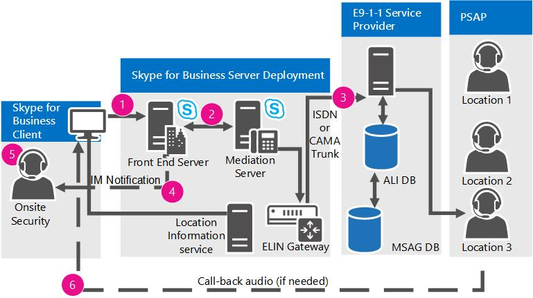

# Plan des services d’urgence dans Skype pour Business Server 2015
 
En savoir plus sur les services Enhanced 9-1-1 (E9-1-1) dans Skype pour de Voix Entreprise Server Business, y compris l’acquisition d’emplacement et d’acheminement des appels.
  
Skype pour Business Server prend en charge les services Enhanced 9-1-1 (E9-1-1) au sein des États-Unis dans le cadre d’un déploiement de Voix Entreprise. E9-1-1 est une fonctionnalité de réponse aux appels d’urgence qui associe un appel au 911 à un emplacement de réponse d’urgence (ERL, Emergency Response Location) qui est constitué d’une adresse (c’est-à-dire, une rue) et d’informations d’emplacement spécifiques, telles qu’un numéro d’étage, pour les appels provenant d’immeubles de bureaux et d’habitation. À l’aide de l’emplacement de réponse d’urgence fourni, un centre téléphonique de sécurité publique (Public Safety Answering Point ou PSAP) peut immédiatement transférer les appels de détresse aux services d’urgence appropriés sans risquer de leur fournir de mauvaises informations.
  
> [!NOTE]
> Skype pour Business Server prend désormais en charge la configuration de plusieurs numéros d’urgence pour un client. Pour plus d’informations, consultez [planification pour plusieurs numéros d’urgence dans Skype pour Business Server 2015](multiple-emergency-numbers.md). 
  
> [!NOTE]
> Skype pour Business Server dispose de trois fonctionnalités de Voix Entreprise : appel de contrôle d’admission, les services d’urgence (E9-1-1) et contournement de média. Pour une vue d’ensemble de la planification des informations qui sont communes aux trois de ces fonctionnalités, consultez [les paramètres de réseau pour les fonctionnalités avancées de Voix Entreprise dans Skype pour Business Server 2015](network-settings-for-advanced-features.md). 
  
Skype pour Business Server prend en charge Enhanced 9-1-1 (E9-1-1) appelant à partir de Skype pour les clients de l’entreprise et de périphériques Lync Phone Edition. Lorsque vous configurez Skype pour Business Server pour les appels E9-1-1, en cas d’urgence, placés par Skype pour entreprise ou Lync Phone Edition inclut des informations d’emplacement de réponse d’urgence (ERL) à partir de la base de données du service informations d’emplacement. ERLs se composent de civique (c'est-à-dire, rue) adresses et autres informations permettant d’identifier un emplacement plus précis dans les bâtiments et autres installations mutualisées. Lorsqu’un utilisateur effectue un appel d’urgence, Skype pour Business Server achemine l’appel audio, ainsi que les informations d’emplacement et de rappel, via un serveur de médiation pour un fournisseur de services E9-1-1. Le fournisseur de service E9-1-1 utilise l’adresse postale de l’appelant d’acheminer l’appel vers le Public sécurité répondant Point (PSAP) qui sert d’emplacement de l’appelant et envoie le long d’une urgence Service requête clé (ESQK) le PSAP utilise pour rechercher ERL l’appelant. 
  
Skype pour Business Server prend en charge deux méthodes d’acheminement d’appels d’urgence à un fournisseur de service E9-1-1 :
  
- une connexion de jonction SIP (Session Initiation Protocol) vers un fournisseur de services E9-1-1 certifié ;
    
- une passerelle ELIN (Emergency Location Identification Number) vers un fournisseur de services E9-1-1 du réseau téléphonique commuté (RTC).
    
Lorsque vous utilisez un fournisseur de service SIP trunk E9-1-1, ajoutez ERLs à la base de données du service de coordonnées et puis valider les emplacements contre un maître rue adresse Guide (MSAG) qui est gérée par le fournisseur de service de E9-1-1. Si un fournisseur de services E9-1-1 reçoit un appel qui n’a pas d’informations emplacement ou a un emplacement qui n’a pas été validé par rapport à la MSAG, le fournisseur de service E9-1-1 achemine l’appel à un nationales/régionales d’urgence appeler réponse Centre (ECRC), qui est composé du personnel spécialement formé verbalement obtenir emplacement de l’appelant, si possible et manuellement acheminer l’appel vers le PSAP approprié. (Certains fournisseurs de services E9-1-1 de jonction SIP transmettent également aux clients un numéro SDA (sélection directe à l’arrivée) RTC vers le centre ECRC, qui offre un autre moyen d’acheminer les appels 9-1-1 si la jonction SIP échoue pour une raison quelconque.)
  
À la différence de temps (TDM) de multiplexage par répartition et des téléphones sur IP de branche privée exchange (PBX), qui ont des endroits fixes, un Skype pour point de terminaison métier peut être très mobile. Lorsque vous déployez la fonctionnalité E9-1-1, Skype pour Business Server permet de garantir que, peu importe où se trouve l’appelant, l’appel d’urgence peut être routé à la PSAP qui sert d’emplacement de l’appelant. Par exemple, si le siège principal de l’utilisateur se trouve dans Redmond, Washington, mais que l’utilisateur place un appel d’urgence à partir d’un ordinateur dans une succursale dans Wichita, Kansas, le SIP trunk ou fournisseur de services basés sur le RTPC E9-1-1 redirige l’appel vers le PSAP dans Wichita , pas pour le PSAP à Redmond.
  
Lorsque vous utilisez une passerelle ELIN, vous ajoutez également ERLs à la base de données du service informations d’emplacement, mais vous inclure également un numéro ELIN pour chaque emplacement. Ce numéro devient le numéro d’appel d’urgence durant l’appel d’urgence. Vous devez alors vous assurer que votre opérateur RTC télécharge les numéros ELIN vers la base de données ALI (Automatic Location Identification. 
  
> [!NOTE]
> Skype pour entreprise connectés à des périphériques analogiques ne peuvent pas recevoir des informations sur l’emplacement du service d’informations d’emplacement ou transmettre l’emplacement pour le fournisseur de service E9-1-1. 
  
 Si vous faites appel à un fournisseur de services E9-1-1 de jonction SIP et souhaitez permettre l’utilisation de la fonction E9-1-1 à partir de téléphones analogiques, vous avez deux options :
  
- **Option de PS-ALI traditionnel** Si vous avez des passerelles RTPC locales sur chaque site où téléphones analogues sont déployées, et chaque ligne de téléphone analogique a un DID, vous pouvez prévoir l’emplacement de l’appareil analogique directement avec un fournisseur de service d’Identification d’emplacement automatique/commutateur privé (PS-ALI). Dans ce cas, vous configurez spécialement des Skype pour les stratégies de voix entreprise et attribuez à l’appareil analogique des objets contact afin que les appels E9-1-1 à partir de ces téléphones router directement par l’intermédiaire de la passerelle locale au fournisseur PSTN (à la place des services du site de l’appel à un fournisseur de services E9-1-1 de routage SIP trunk). Lorsqu’un appel d’urgence est passé, une base de données d’un fournisseur PS-ALI associé à la jonction RTC mappe le numéro SDA de chaque téléphone analogique à un emplacement physique et fournit cet emplacement au centre PSAP. Ces enregistrements doivent être mis à jour avec le fournisseur de services PS-ALI chaque fois que les téléphones changent d’ERL.
    
- **Option de fournisseur de service E9-1-1** Vous pouvez enregistrer les DIDs téléphonique analogique et leurs ERLs correspondantes avec le fournisseur de service E9-1-1, si cela est pris en charge par le fournisseur de service E9-1-1. Si le fournisseur reçoit un appel Skype pour Business Server qui n’inclut pas les données format PIDF-LO, le fournisseur peut voir s’il existe une correspondance de base de données sur le numéro de l’appelant DID. À l’aide de la ERL automatiquement récupérée à partir de sa base de données, le fournisseur peut acheminer l’appel d’urgence à la PSAP correct et le PSAP recevra le DID de l’appareil analogique et un enregistrement ESQK qui permet du répartiteur rechercher l’emplacement de l’appelant.
    
Si vous utilisez l’option de passerelle ELIN et souhaitez permettre l’utilisation de la fonction E9-1-1 à partir de téléphones analogiques, vous pouvez configurer l’emplacement du périphérique analogique directement avec le fournisseur de services PS-ALI, comme décrit dans la première option ci-dessus.
  
À partir d’un Skype pour un point de vue Business Server, le processus E9-1-1 peuvent être séparé en deux étapes :
  
- Étape 1 : acquisition d’un emplacement
    
- Étape 2 : acheminement de l’appel d’urgence vers un fournisseur de services E9-1-1
    
Cette section décrit le déroulement de ces deux étapes.
  
Si vous souhaitez configurer votre infrastructure pour détecter automatiquement l’emplacement du client, vous devez d’abord décider quels éléments réseau vous utiliserez pour mapper les appelants aux emplacements. Pour plus d’informations sur les options possibles, consultez [définir les éléments de réseau utilisés pour déterminer l’emplacement dans Skype pour Business Server 2015](network-location.md). 
  
## Acquisition d’un emplacement

Dans un Skype pour le déploiement de Business Server E9-1-1, chaque Skype connectés de façon interne pour client entreprise ou Lync Phone Edition acquiert activement son propre emplacement. Après l’inscription SIP, le client fournit toutes les informations de connectivité de réseau qu’il connaît lui-même il dans une demande d’emplacement pour le service d’informations d’emplacement, qui est un service web par une base de données SQL Server répliquée. Chaque pool de site central est un service d’informations d’emplacement, qui utilise les informations de réseau pour interroger ses enregistrements d’emplacement correspondant. S’il existe une correspondance, le service d’informations d’emplacement renvoie un emplacement pour le client. Dans le cas inverse, l’utilisateur peut être invité à entrer manuellement un emplacement (en fonction des paramètres de la stratégie d’emplacement). Les données d’emplacement sont retransmises au client dans un format XML normalisé IETF (Internet Engineering Task Force) appelé PIDF-LO (Presence Information Data Format Location Object).
  
Le Skype pour client d’entreprise inclut les données de format PIDF-LO dans le cadre d’un appel d’urgence, et ces données sont utilisées par le fournisseur de service E9-1-1 pour déterminer la PSAP approprié et à acheminer l’appel vers ce PSAP avec le ESQK correct, qui permet le répartiteur PSAP obtenir l’emplacement de l’appelant.
  
Le diagramme suivant illustre comment un Skype pour client d’entreprise acquiert un emplacement (à l’exception de la méthode d’emplacement basé sur l’adresse MAC client tiers) :
  

  
Pour qu’un client acquière un emplacement, les étapes suivantes doivent se produire :
  
1. L’administrateur les remplit la base de données de service d’informations d’emplacement avec le wiremap réseau (les tables qui mappent les différents types d’adresses de réseau à des emplacements de réponse d’urgence correspondant (ERLs)).
    
2. Si vous utilisez un fournisseur de service E9-1-1 de jonction SIP, l’administrateur valide les parties d’adresse civile des ERL par rapport à la base de données MSAG (Master Street Address Guide) maintenue par le fournisseur de service E9-1-1. Si vous utilisez une passerelle ELIN, l’administrateur s’assure que l’opérateur RTC télécharge les ELIN dans la base de données ALI (Automatic Location Identification).
    
3. Lors de l’inscription, ou chaque fois qu’une modification du réseau se produit, un client connectés de façon interne envoie une demande d’emplacement qui contient le client de découvert les adresses réseau pour le service d’informations d’emplacement.
    
4. Le service d’informations d’emplacement ses enregistrements publiés pour un emplacement et, si une correspondance est trouvée, retourne la ERL au client au format PIDF-LO format.
    
## Routage des appels E9-1-1 avec une jonction SIP

Se connecter à un fournisseur de services E9-1-1 éligible à l’aide d’une jonction SIP vous permet de déployer E9-1-1. Pour plus d’informations sur l’utilisation d’une passerelle ELIN pour vous connecter à un réseau téléphonique public commuté (RTPC)-base E9-1-1 fournisseur de services, voir [Routage des appels E9-1-1 à l’aide d’une passerelle de ELIN](http://technet.microsoft.com/library/5a3997e3-898d-49cb-922a-4184c3373350.aspx).
  
Le diagramme suivant illustre comment un appel d’urgence est routé de Skype pour le serveur de l’entreprise pour le Public sécurité répondant Point PSAP () lorsque vous utilisez un SIP trunk et le fournisseur de service qualifié E9-1-1.
  
**Acheminement d’appels E9-1-1 via un SIP trunk**

  
Lorsqu’un appel d’urgence est placé dans un Skype compatible pour le client Business Server :
  
1. Une commande SIP INVITE qui contient l’emplacement, le numéro de l’appelant rappel et le numéro de rappel de conférence et URL de Notification (facultatif) est acheminée à Skype pour Business Server.
    
2. Skype pour Business Server correspond au numéro d’urgence et achemine l’appel (basé sur la valeur **d’Utilisation de TLS** qui est définie dans la stratégie d’emplacement applicable) à un serveur de médiation et de là, via un SIP trunk au fournisseur de services E9-1-1.
    
3. Le fournisseur de services E9-1-1 route l’appel d’urgence vers le centre téléphonique de sécurité publique (PSAP) adéquat en fonction de l’emplacement fourni avec l’appel. Lorsque le client inclut un emplacement de situation d’urgence (ERL) validé dans l’appel d’urgence, le fournisseur route automatiquement l’appel vers le PSAP approprié. Si l’emplacement a été entré manuellement par l’utilisateur, le centre de réponse aux appels d’urgence vérifie d’abord verbalement la précision de l’emplacement auprès de l’appelant avant de router l’appel d’urgence vers le PSAP.
    
4. Si vous avez configuré la stratégie d’emplacement pour les notifications, une ou plusieurs des responsables de la sécurité de votre organisation sont envoyés à un Skype spécial pour la messagerie instantanée de Business notification en cas d’urgence. Ce message s’affiche sur les écrans des agents de sécurité toujours et contient le nom de l’appelant, numéro de téléphone, temps et emplacement, permettant au personnel de sécurité répondre rapidement à l’appelant en cas d’urgence à l’aide d’un message instantané ou une voix.
    
5. Si vous avez configuré la stratégie d’emplacement pour les conférences et qu’elle est prise en charge par le fournisseur de services E9-1-1, un service de sécurité interne est intégré à l’appel avec des données audio unidirectionnelles ou bidirectionnelles.
    
6. Si l’appel se termine prématurément, le PSAP utilise le numéro de rappel pour contacter directement l’appelant.
    
## Routage des appels E9-1-1 via une passerelle ELIN

Certains partenaires du programme Unified Communications Open Interoperability fournissent des passerelles compatibles avec les numéros ELIN (Emergency Location Identification Number), ce qui peut servir de solution de remplacement pour une connexion de jonction SIP à un fournisseur de services E9-1-1 qualifié. Les passerelles ELIN prennent en charge la connectivité RNIS (réseau numérique à intégration de services) ou CAMA (Centralized Automatic Message Accounting) aux services E9-1-1 basés sur un réseau téléphonique commuté. Pour plus d’informations sur les partenaires qui fournissent des passerelles ELIN et des liens vers leur documentation, voir [Infrastructure validé pour Microsoft Lync](https://go.microsoft.com/fwlink/p/?LinkId=248425) et [Infrastructure de téléphonie pour Skype pour les entreprises](https://technet.microsoft.com/en-us/office/dn947483). 
  
Comme SIP trunk des connexions aux fournisseurs de services E9-1-1, passerelles ELIN permettent également de routage d’un appel d’urgence à l’appelant plus approprié Public sécurité répondant Point PSAP (), mais ces passerelles utilisent une ELIN en tant qu’identificateur de l’emplacement. Vous définissez ELINs pour chaque emplacement de réponse d’urgence (ERL) dans votre organisation (pour plus d’informations, voir [gérer des emplacements pour les passerelles ELIN dans Skype pour Business Server 2015](elin-gateways.md)). 
  
Lorsque vous utilisez une passerelle ELIN pour les appels d’urgence, vous utilisez le même Skype pour l’infrastructure de Business Server E9-1-1 que vous utiliseriez pour une connexion de jonction SIP. Autrement dit, la base de données du service d’informations emplacement fournit l’emplacement pour le Skype pour client d’entreprise et la stratégie d’emplacement Active la fonctionnalité d’et définit la gamme. Avec une passerelle ELIN, toutefois, vous devez ajouter les ELINs à la base de données du service information concernant votre emplacement et votre opérateur RTPC les télécharger vers la base de données d’Identification d’emplacement automatique (ALI).
  
Lorsqu’un Skype pour client d’entreprise obtient son emplacement à partir du service d’informations d’emplacement, l’emplacement inclut le ELIN. Lors d’un appel d’urgence, le ELIN est inclus avec l’emplacement envoyée à la passerelle ELIN. La passerelle ELIN identifie l’appel comme un appel d’urgence et remplace le numéro de l’appelant avec le ELIN. La passerelle ELIN achemine ensuite l’appel au RTC avec la ELIN en tant que numéro de l’appelant. Le fournisseur RTPC E9-1-1 recherche l’ELIN dans la base de données ALI, qui est une base de données associé à la base de données Master rue adresse Guide (MSAG). RTC envoie l’appel à la PSAP plus approprié en fonction de la recherche de ALI et le PSAP envoie les premiers intervenants à l’emplacement de l’appelant en fonction de la recherche de ALI. Le numéro d’appel est mis en cache sur la passerelle ELIN pour une durée prédéfinie pour les rappels. Au cours d’un rappel, la PSAP atteint la passerelle ELIN, qui permute le ELIN pour le numéro de l’appelant la numérotation directe (DID) vers l’intérieur.
  
Les passerelles ELIN prennent en charge les appels d’urgence effectués au sein du réseau de votre organisation. Elles ne prennent pas en charge les appels d’urgence effectués hors de votre réseau.
  
> [!NOTE]
> Pour plus d’informations sur l’utilisation d’une connexion de jonction SIP pour les appels d’urgence, consultez [Routage des appels E9-1-1 à l’aide d’une jonction SIP](http://technet.microsoft.com/library/157753c3-fe74-4e2c-81da-ee06911d4cc2.aspx). 
  
Le diagramme suivant illustre comment un appel d’urgence est routé de Skype pour Business Server à la PSAP lorsque vous utilisez une passerelle ELIN.
  
**Acheminement d’appels E9-1-1 avec une passerelle ELIN**

  
1. Une commande SIP INVITE contenant l’emplacement, numéro de rappel de l’appelant et le numéro de rappel de conférence et URL de Notification (facultatif) est acheminée à Skype pour Business Server.
    
2. Skype pour Business Server correspond au numéro d’urgence et les achemine ensuite l’appel (basé sur la valeur **d’Utilisation de TLS** définie dans la stratégie d’emplacement applicable) à un serveur de médiation et de là vers une passerelle ELIN.
    
3. La passerelle ELIN achemine l’appel via une jonction RNIS ou CAMA vers le réseau téléphonique commuté.
    
4. Le réseau téléphonique commuté identifie l’appel comme un appel d’urgence et l’achemine vers un routeur sélectif E9-1-1 du réseau. Le routeur sélectif E9-1-1 recherche le numéro de l’appelant dans la base de données ALI afin d’obtenir l’emplacement géographique correspondant. Le routeur sélectif E9-1-1 envoie l’appel au centre PSAP le plus approprié en fonction des informations d’emplacement récupérées à partir de la base de données ALI.  
    
5. Si vous avez configuré la stratégie d’emplacement pour les notifications, une ou plusieurs des responsables de la sécurité de votre organisation sont envoyés à un Skype spécial pour la messagerie instantanée de Business notification en cas d’urgence. Ce message s’affiche sur les écrans des agents de sécurité toujours et contient le nom de l’appelant, numéro de téléphone, temps et emplacement, permettant au personnel de sécurité répondre rapidement à l’appelant en cas d’urgence à l’aide d’un message instantané ou une voix.
    
6. Si l’appel est interrompu prématurément, le centre PSAP utilise le numéro ELIN pour contacter directement l’appelant. La passerelle ELIN remplace le numéro ELIN par le numéro direct de l’appelant.
    

