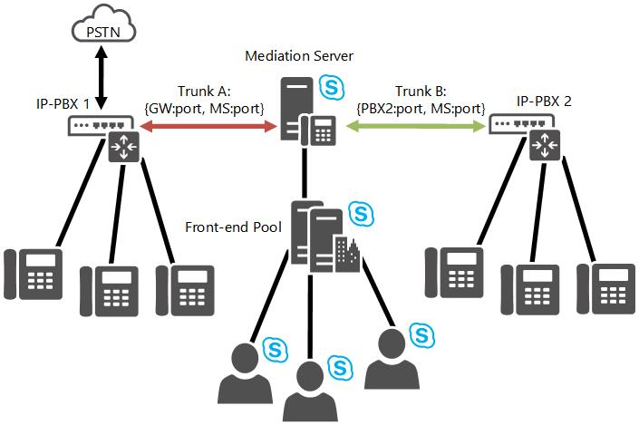

# Routage inter-acheminements dans Skype Entreprise ServerInter-trunk routing in Skype for Business Server
 
Découvrez comment Skype Entreprise Server Voix Entreprise prend en charge le routage inter-acheminements.Learn how Skype for Business Server Enterprise Voice supports inter-trunk routing.
  
Skype Entreprise Server offre une gestion de session de base par le biais de la prise en charge du routage entre les éléments.Skype for Business Server provides basic session management through the support of intertrunk routing. Cela permet à Skype Entreprise Server de fournir des fonctionnalités de contrôle des appels aux systèmes téléphoniques en aval.This enables Skype for Business Server to provide call control functionalities to downstream telephony systems. Le routage entre les connexions peut interconnecter un SYSTÈME IP-PBX à une passerelle de réseau téléphonique commuté (PSTN) afin que les appels provenant d’un téléphone PBX (autoconnexion privé) soient acheminés vers le réseau téléphonique commuté et que les appels PSTN entrants soient acheminés vers un téléphone PBX.Intertrunk routing can interconnect an IP-PBX to a public switched telephone network (PSTN) gateway so that calls from a private branch exchange (PBX) phone can be routed to the PSTN, and incoming PSTN calls can be routed to a PBX phone. De même, Skype Entreprise Server peut interconnecter au moins deux systèmes IP-PBX afin que les appels soient passé et reçus entre des téléphones PBX à partir des différents systèmes IP-PBX.Similarly, Skype for Business Server can interconnect two or more IP-PBX systems so that calls can be placed and received between PBX phones from the different IP-PBX systems. 
  
La figure suivante illustre Skype Entreprise Server fournissant une interconnectivité entre une passerelle PSTN et un système IP-PBX.The following figure illustrates Skype for Business Server providing interconnectivity between a PSTN gateway and an IP-PBX.
  

  
La figure suivante illustre la connexion de deux systèmes IP-PBX à Skype Entreprise Server.The next figure illustrates Skype for Business Server connecting two IP-PBX systems.
  

  

