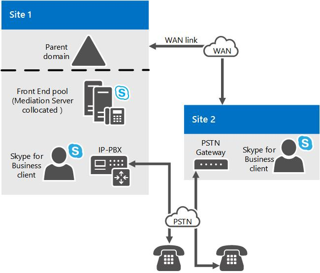

# Composant serveur de médiation dans Skype Entreprise Server
 
Découvrez les serveurs de médiation dans Skype Entreprise Server, notamment ses topologies pris en charge et ses relations avec les trunks M:N, le contournement de média et le contrôle d’admission des appels.
  
Pour déployer Voix Entreprise, vous devez déployer un ou plusieurs serveurs de médiation. 
  
Le serveur de médiation traduit la signalisation entre votre infrastructure Voix Entreprise interne et une passerelle de réseau téléphonique commuté (PSTN) ou une passerelle SIP (Session Initiation Protocol). Dans certains déploiements, il traduit également le média lui-même entre ces points.
  
Du côté Skype Entreprise Server, le serveur de médiation écoute sur une seule adresse de transport MTLS (Mutual TLS). Du côté passerelle, le serveur de médiation écoute sur tous les ports d’écoute associés aux trunks. Toutes les passerelles qualifiées doivent prendre en charge le protocole TLS mais peuvent aussi activer le protocole TCP. Le protocole TCP est pris en charge pour les passerelles qui ne prennent pas en charge le protocole TLS.
  
Si vous avez également un PBX (Public Branch Exchange) existant dans votre environnement, le serveur de médiation gère les appels entre les utilisateurs Voix Entreprise et le PBX. Si votre PBX est un PBX IP, vous pouvez créer une connexion SIP directe entre le PBX et le serveur de médiation. Si votre PBX est un PBX TDM (Multiplex Time Division Multiplex), vous devez également déployer une passerelle PSTN entre le serveur de médiation et le PBX.
  
Le serveur de médiation est coqueté avec le serveur frontal par défaut. Le serveur de médiation peut également être déployé dans un pool autonome.
  
## Ce que fait le serveur de médiation

Les principales fonctions du serveur de médiation sont les suivantes :
  
- Chiffrement et déchiffrement de SRTP du côté Skype Entreprise Server côté. 
    
- Traduction de SIP sur TCP (pour les passerelles qui ne sont pas en charge TLS) en SIP sur Mutual TLS.
    
- Traduction des flux multimédias entre Skype Entreprise Server et l’homologue de passerelle du serveur de médiation.
    
- Connexion de clients extérieurs au réseau à des composants ICE internes, qui permettent la traversée multimédia de NAT et de pare-feu.
    
- Rôle d’intermédiaire pour les flux d’appels qu’une passerelle ne prend pas en charge, tels que les appels de travailleurs à distance sur Voix Entreprise clien.t
    
- Dans les déploiements qui incluent une trunking SIP, en collaboration avec le fournisseur de services de trunking SIP pour fournir la prise en charge PSTN, ce qui élimine le besoin d’une passerelle PSTN.
    
La figure suivante illustre les protocoles de signalisation et multimédias utilisés par le serveur de médiation lors de la communication avec une passerelle PSTN de base et l’infrastructure Voix Entreprise réseau.
  
**Protocoles de signalisation et de données multimédias utilisés par le serveur de médiation**

  
> [!NOTE]
> Si vous utilisez TCP ou RTP/RTCP (au lieu de SRTP ou SRTCP) sur le réseau entre la passerelle PSTN et le serveur de médiation, nous vous recommandons de prendre des mesures pour garantir la sécurité et la confidentialité du réseau. 
  
## Jonction M:N

Skype Entreprise Server prend en charge la flexibilité dans la définition d’une ligne à des fins de routage des appels. Une trunk est une association logique entre un serveur de médiation et un numéro de port d’écoute, avec une passerelle et un numéro de port d’écoute. Cela implique plusieurs choses : un serveur de médiation peut avoir plusieurs branches vers la même passerelle ; un serveur de médiation peut avoir plusieurs branches vers différentes passerelles ; inversement, une passerelle peut avoir plusieurs branches vers différents serveurs de médiation.
  
Vous devez toujours créer une trunk racine lorsque vous ajoutez une passerelle à votre topologie Skype Entreprise à l’aide du Générateur de topologie. Le nombre de passerelles qu’un serveur de médiation donné peut gérer dépend de la capacité de traitement du serveur pendant les heures de pointe. Si vous déployez un serveur de médiation sur du matériel qui répond à la configuration matérielle minimale requise pour Skype Entreprise Server, comme décrit dans la configuration requise pour le serveur pour [Skype Entreprise Server 2015](../../plan-your-deployment/requirements-for-your-environment/server-requirements.md), un serveur de médiation autonome peut gérer environ 1 000 appels. Le serveur de médiation effectue le transcodage, mais continue d’router les appels pour plusieurs passerelles, même si les passerelles ne la prise en charge du contournement de média.
  
Lors de la définition d’un itinéraire d’appels, vous spécifiez les trunks associés à cet itinéraire, mais vous ne spécifiez pas les serveurs de médiation associés à cet itinéraire. Au lieu de cela, vous utilisez le Générateur de topologie pour associer des trunks à des serveurs de médiation. En d’autres termes, le routage détermine la trunk à utiliser pour un appel et, par la suite, le serveur de médiation associé à cette trunk est envoyé la signalisation pour cet appel.
  
Le serveur de médiation peut être déployé en tant que pool . Ce pool peut être cocisé avec un pool frontal, ou il peut être déployé en tant que pool autonome. Lorsqu’un serveur de médiation est coqueté avec un pool frontal, la taille du pool peut être au maximum 12 (limite de la taille du pool de serveurs d’inscriptions). Ensemble, ces fonctionnalités augmentent la fiabilité et la flexibilité de déploiement des serveurs de médiation, mais elles nécessitent des fonctionnalités similaires dans les éléments suivants :
  
- **Passerelle PSTN.** Une passerelle Skype Entreprise Server qualifiée doit implémenter l’équilibrage de la charge DNS, ce qui permet à une passerelle de réseau téléphonique commuté (PSTN) qualifiée d’agir en tant qu’équilibreur de charge pour un pool de serveurs de médiation, et par conséquent d’équilibrer la charge des appels dans le pool.
    
- **Contrôleur de frontière de session.** Pour une connexion SIP, l’entité homologue est un contrôleur SBC (Session Border Controller) chez un fournisseur de services de téléphonie Internet. Dans le sens entre le pool de serveurs de médiation et le SBC, le SBC peut recevoir des connexions à partir de n’importe quel serveur de médiation du pool. Dans le sens entre le contrôleur SBC et le pool, le trafic peut être envoyé à n’importe quel serveur de médiation du pool. Une méthode pour y parvenir consiste à équilibrer la charge DNS, si elle est prise en charge par le fournisseur de services et le SBC. Une autre solution consiste à fournir au fournisseur de services les adresses IP de tous les serveurs de médiation du pool, et le fournisseur de services les met en service dans leur SBC comme une ligne SIP distincte pour chaque serveur de médiation. Le fournisseur de services gère ensuite l’équilibrage de charge pour ses propres serveurs. Tous les fournisseurs de services ou SCS ne peuvent pas prendre en charge ces fonctionnalités. En outre, le fournisseur de services peut facturer des frais supplémentaires pour cette fonctionnalité. En règle générale, chaque branche SIP vers le SBC implique des frais mensuels.
    
- **IP-PBX.** Dans le sens entre le pool de serveurs de médiation et la terminaison SIP IP-PBX, le SYSTÈME IP-PBX peut recevoir des connexions à partir de n’importe quel serveur de médiation du pool. Dans le sens entre le système IP-PBX et le pool, le trafic peut être envoyé à n’importe quel serveur de médiation du pool. Étant donné que la plupart IP-PBXs ne pas prendre en charge l’équilibrage de charge DNS, nous vous recommandons de définir des connexions SIP directes individuelles à partir du SYSTÈME IP-PBX vers chaque serveur de médiation du pool. Le système IP-PBX gère ensuite son propre équilibrage de charge en répartissant le trafic dans le groupe de jonctions. Le groupe de jonctions est supposé avoir un ensemble cohérent de règles de routage sur le système IP-PBX. Vous devez déterminer si un SYSTÈME IP-PBX particulier prend en charge ce concept de groupe de trunks et comment il se coupe avec la redondance et l’architecture de clustering de l’IP-PBX avant de pouvoir déterminer si un cluster de serveur de médiation peut interagir correctement avec un IP-PBX.
    
Un pool de serveurs de médiation doit avoir une vue uniforme de la passerelle homologue avec laquelle il interagit. Cela signifie que tous les membres du pool accèdent à la même définition de passerelle homologue à partir du magasin de configurations et qu’ils ont tous autant de chances d’interagir avec elle pour les appels sortants. Par conséquent, il n’existe aucun moyen de segmenter le pool afin que certains serveurs de médiation communiquent uniquement avec certains homologues de passerelle pour les appels sortants. Si une telle segmentation est nécessaire, un pool distinct de serveurs de médiation doit être utilisé. Ce serait le cas, par exemple, si les fonctionnalités associées dans les passerelles PSTN, jonctions SIP ou systèmes IP-PBX pour interagir avec un pool n’étaient pas présentes (voir plus haut dans cette rubrique).
  
Une passerelle PSTN, un système IP-PBX ou un homologue de trunk SIP particulier peut être acheminé vers plusieurs serveurs de médiation ou plusieurs trunks. Le nombre de passerelles qu’un pool particulier de serveurs de médiation peut contrôler dépend du nombre d’appels qui utilisent le contournement de média. Si un grand nombre d’appels utilisent le contournement de média, un serveur de médiation dans le pool peut gérer beaucoup plus d’appels, car seul le traitement de couche de signalisation est nécessaire. 
  
## Contrôle d’admission des appels et serveur de médiation

Le contrôle d’admission des appels (CAC) gère l’établissement de sessions en temps réel, en fonction de la bande passante disponible, pour éviter une qualité de l’expérience médiocre (QoE) pour les utilisateurs sur des réseaux saturés. Pour ce faire, le serveur de médiation est responsable de la gestion de la bande passante pour ses deux interactions côté Skype Entreprise Server et côté passerelle. Dans le cadre du contrôle d’admission des appels, l’entité qui met fin à l’appel gère la réservation de la bande passante. Les homologues de passerelle (passerelle PSTN, IP-PBX, SBC) avec qui le serveur de médiation interagit côté passerelle ne peuvent pas prendre en charge Skype Entreprise Server d’admission des appels. Par conséquent, le serveur de médiation doit gérer les interactions de bande passante pour le compte de son homologue de passerelle. Dans la mesure du possible, le serveur de médiation réserve la bande passante à l’avance. Si c’est impossible (par exemple si la localité du système d’extrémité final du média du côté passerelle est inconnue pour un appel sortant vers l’homologue de passerelle), la bande passante est réservée quand l’appel est passé. Ce comportement peut entraîner une sur-souscription de bande passante, mais c’est le seul moyen d’empêcher les sonneries factices.
  
Le contournement de média et la réservation de bande passante s’excluent mutuellement. Si le contournement de média est utilisé pour un appel, le contrôle d’admission des appels n’est pas effectué pour cet appel. L’hypothèse repose sur le fait qu’aucun lien avec bande passante restreinte n’est impliqué dans l’appel. Si le contrôle d’admission des appels est utilisé pour un appel particulier qui implique le serveur de médiation, cet appel ne peut pas utiliser le contournement de média.
  
Pour plus d’informations sur le contournement de média ou le contrôle d’admission des appels, voir [Plan for media bypass in Skype Entreprise](media-bypass.md) or [Plan for call admission control in Skype Entreprise Server](call-admission-control.md).
  
## Enhanced 9-1-1 (E9-1-1) et serveur de médiation

Le serveur de médiation dispose de fonctionnalités étendues pour interagir correctement avec les fournisseurs de services Enhanced 9-1-1 (E9-1-1). Aucune configuration spéciale n’est nécessaire sur le serveur de médiation. Les extensions SIP requises pour l’interaction E9-1-1 sont, par défaut, incluses dans le protocole SIP du serveur de médiation pour ses interactions avec un homologue de passerelle (passerelle PSTN, IP-PBX ou SBC d’un fournisseur de services de téléphonie Internet, y compris les fournisseurs de services E9-1-1)
  
La capacité du contrôleur de frontière de session E9-1-1 à interagir avec un pool de serveurs de médiation déterminera si la jonction SIP à un fournisseur de services E9-1-1 peut être raccordée à un pool de serveurs de médiation existant ou nécessitera des serveurs de médiation autonomes. Pour plus d’informations, [voir la ligne M:N dans Skype Entreprise Server](m-n-trunk.md).
  
## Contournement de média et serveur de médiation

La déviation du trafic multimédia est une fonctionnalité Skype Entreprise Server qui permet à un administrateur de configurer le routage des appels pour qu’il circule directement entre le point de terminaison de l’utilisateur et la passerelle du réseau téléphonique commuté (PSTN) sans passer par le serveur de médiation. Le contournement de média améliore la qualité des appels en réduisant la latence, la traduction inutile, le risque de perte de paquets et le nombre de points de défaillance potentiels. Lorsqu’un site distant sans serveur de médiation est connecté à un site central par une ou plusieurs liaisons WAN avec bande passante limitée, le contournement de média réduit les besoins en bande passante en permettant aux médias d’un client d’un site distant de circuler directement vers sa passerelle locale sans avoir à traverser la liaison wan vers un serveur de médiation sur le site central et vers l’arrière. Cette réduction du traitement multimédia complète également la capacité du serveur de médiation à contrôler plusieurs passerelles.
  
Le contournement de média et le contrôle d’admission des appels s’excluent mutuellement. Si le contournement de média est utilisé pour un appel, le contrôle d’admission des appels n’est pas effectué pour cet appel. L’hypothèse repose sur le fait qu’aucun lien avec bande passante restreinte n’est impliqué dans l’appel.
  
## Topologies pour le serveur de médiation

Par Skype Entreprise Server, le serveur de médiation est coqueté par défaut avec Édition Standard serveur, un pool frontal ou un Survivable Branch Appliance. Tous les serveurs de médiation d’un pool frontal doivent être configurés de manière identique.
  
Lorsque les performances sont un problème, il peut être préférable de déployer un ou plusieurs serveurs de médiation dans un pool autonome dédié. Nous vous recommandons sans aucun doute un pool autonome si vous déployez une trunking SIP. 
  
Si vous déployez des connexions SIP directes sur une passerelle PSTN qualifiée qui prend en charge le contournement de média et l’équilibrage de charge DNS, un pool de serveurs de médiation autonome n’est pas nécessaire. Cela est dû au fait que les passerelles qualifiées sont capables d’équilibrer la charge DNS avec un pool de serveurs de médiation et qu’elles peuvent recevoir du trafic à partir de n’importe quel serveur de médiation d’un pool.
  
Nous vous recommandons également de céqueifier le serveur de médiation sur un pool frontal lorsque vous avez déployé IP-PBXs ou de vous connecter au contrôleur SBC (Session Border Controller) d’un fournisseur de serveur de téléphonie Internet, à condition que l’une des conditions suivantes soit remplie :
  
- Le système IP-PBX ou le contrôleur SBC est configuré pour recevoir du trafic de n’importe quel serveur de médiation du pool et peut acheminer les données de ce trafic de manière uniforme sur tous les serveurs de médiation du pool.
    
- Le système IP-PBX ne prend pas en charge le contournement de média, mais le pool frontal qui héberge le serveur de médiation peut gérer le transcodage vocal pour les appels pour lesquels le contournement de média ne s’applique pas.
    
Vous pouvez utiliser l’outil de planification Microsoft Lync Server 2013 pour évaluer si le pool frontal sur lequel vous souhaitez céqueriser le serveur de médiation peut gérer la charge. Si votre environnement ne remplit pas les conditions requises, vous devez alors déployer un pool de serveurs de médiation autonome.
  
La figure suivante montre une topologie simple constituée de deux sites connectés par une liaison WAN. Le serveur de médiation est coqueté sur un pool frontal sur le site 1. Les serveurs de médiation du site 1 contrôlent à la fois la passerelle PSTN sur site 1 et la passerelle sur le site 2. Dans cette topologie, le contournement de média est activé globalement afin d’utiliser les informations de site et de région, et le contournement est activé sur les jonctions vers chaque passerelle PSTN (GW1 et GW2).
  
**Exemple de sites connectés par une liaison WAN avec un serveur de médiation sur Site 1 et une passerelle PSTN sur Site 2**

  
La figure suivante illustre une topologie simple dans laquelle le serveur de médiation est coqueté sur le pool frontal sur le site 1 et dispose d’une connexion SIP directe au PBX IP sur le site 1. Dans cette figure, le serveur de médiation contrôle également une passerelle PSTN sur le site 2. Supposons que Skype Entreprise utilisateurs existants aux sites 1 et 2. Supposons également que le SYSTÈME IP-PBX possède un processeur multimédia associé qui doit être parcouru par tous les médias provenant de points de terminaison Skype Entreprise avant d’être envoyé aux points de terminaison multimédia contrôlés par le SYSTÈME IP-PBX. Dans cette topologie, le contournement de média est activé globalement pour utiliser les informations de site et de région, et il est activé pour les jonctions vers la passerelle PBX et PSTN.
  
**Exemple de sites connectés par une liaison WAN avec un serveur de médiation sur Site 1 et un PBX sur Site 2**

  
La dernière figure de cette rubrique montre une topologie où le serveur de médiation est connecté au SBC d’un fournisseur de services de téléphonie Internet. 
  
## Décisions de planification pour le serveur de médiation

Cette rubrique décrit les décisions de planification que vous devez prendre pour votre déploiement de serveur de médiation.
  
### Serveur de médiation c colloté ou autonome ?

Le serveur de médiation est colocalisé par défaut sur le serveur Standard Edition Server ou frontal dans un pool frontal sur les sites centraux. Le nombre d’appels PSTN (réseau téléphonique commuté) qui peuvent être gérés et le nombre d’ordinateurs requis dans le pool dépendent des facteurs suivants :
  
- Nombre d’homologues de passerelle que contrôle le pool de serveurs de médiation
    
- Périodes de trafic à volume élevé via ces passerelles
    
- Pourcentage d’appels dont le média contourne le serveur de médiation
    
Lors de la planification, n’oubliez pas de prendre en compte les exigences de traitement multimédia pour les appels PSTN et les conférences A/V qui ne sont pas configurées pour le contournement de média, ainsi que le traitement nécessaire pour gérer les interactions de signalisation pour le nombre d’appels aux heures de pointe qui doivent être pris en charge. S’il n’y a pas assez de processeur, vous devez déployer un pool autonome de serveurs de médiation . Et les passerelles PSTN, les SYSTÈMES IP-PBX et les SCS doivent être divisés en sous-ensembles contrôlés par les serveurs de médiation cococérés dans un pool et les serveurs de médiation autonomes dans un ou plusieurs pools autonomes.
  
Si vous avez déployé des passerelles PSTN, des PBX IP ou des contrôleurs de frontière de session (SCS) qui ne sont pas en charge des fonctionnalités correctes pour interagir avec un pool de serveurs de médiation, notamment les suivantes, ils devront être associés à un pool autonome constitué d’un seul serveur de médiation :
  
- Effectuer l’équilibrage de charge DNS (Domain Name System) de couche réseau sur les serveurs de médiation dans un pool (ou router le trafic de manière uniforme vers tous les serveurs de médiation d’un pool)
    
- Accepter le trafic d’un serveur de médiation dans un pool
    
Vous pouvez utiliser l’outil de planification Microsoft Lync Server 2013 pour évaluer si la cococation du serveur de médiation avec votre pool frontal peut gérer la charge. Si votre environnement ne remplit pas les conditions requises, vous devez alors déployer un pool de serveurs de médiation autonome.
  
### Considérations relatives au site central et aux sites de succursale

 Les serveurs de médiation sur le site central peuvent être utilisés pour router les appels sur les sites de succursale pour les passerelles PSTN ou les IP-PBX. Si vous déployez des jonctions SIP, cependant, vous devez déployer un serveur de médiation sur le site où s’arrête chaque jonction. Le fait de disposer d’un serveur de médiation sur le site central qui route les appels sur un site de succursale pour un IP/PBX ou une passerelle PSTN ne requiert pas l’utilisation du contournement de média. Toutefois, si vous pouvez activer le contournement de média, cela permet de réduire la latence du chemin d’accès du média et d’améliorer la qualité des médias, car le chemin d’accès du média n’est plus nécessaire pour suivre le chemin de signalisation. Le contournement de média réduit également la charge de traitement sur le pool.
  
> [!NOTE]
> Le contournement de média ne fonctionnera pas avec chaque passerelle PSTN, système IP-PBX et SBC. Microsoft a testé un ensemble de passerelles PSTN et de SCS avec des partenaires certifiés et a effectué des tests avec des PBX IP Cisco. Le contournement de média est pris en charge uniquement avec les produits et versions répertoriés dans [le programme Unified Communications Open Interoperability Program - Lync Server](../../../SfbPartnerCertification/lync-cert/qualified-ip-pbx-gateway.md). 
  
Si la résistance de site de succursale est requise, un Survivable Branch Appliance ou une combinaison d’un serveur frontal, d’un serveur de médiation et d’une passerelle doit être déployé sur le site de succursale. (L’hypothèse avec la résilience de site de succursale est que la présence et les conférences ne sont pas résilientes sur le site.) Pour obtenir des conseils sur la planification des sites de succursale pour la voix, voir [Plan for Voix Entreprise resiliency in Skype Entreprise Server](enterprise-voice-resiliency.md).
  
Pour les interactions avec un IP-PBX, si le PBX IP ne prend pas correctement en charge les interactions multimédias précoces avec plusieurs boîtes de dialogue anticipées et les interactions RFC 3960, il peut y avoir un découpage des premiers mots du message d’accueil pour les appels entrants du SYSTÈME IP-PBX vers les points de terminaison Skype Entreprise. Ce problème peut être plus grave si un serveur de médiation d’un site central a acheminé des appels pour un IP-PBX dont l’itinéraire s’achève sur un site de succursale, car la signalisation doit prendre plus de temps. Si vous faites l’expérience de ce comportement, le déploiement d’un serveur de médiation sur le site de succursale est le seul moyen de réduire le découpage des premiers mots.
  
Pour finir, si votre site central comporte un TDM PBX ou que votre IP-PBX ne supprime pas le besoin d’une passerelle PSTN, vous devez alors déployer une passerelle sur l’itinéraire d’appel qui se connecte au serveur de médiation et au PBX.
  
> [!NOTE]
> Pour améliorer les performances multimédias du serveur de médiation autonome, vous devez activer la mise à l’échelle côté réception (RSS) sur les cartes réseau sur ces serveurs. RSS permet de gérer les paquets entrants en parallèle à l’aide de plusieurs processeurs sur le serveur. Pour plus d’informations, [voir « Receive-Side Scaling Enhancements in Windows Server ».](/previous-versions/windows/it-pro/windows-server-2012-R2-and-2012/hh997036(v=ws.11)) Pour plus d’informations sur l’activer, consultez la documentation de votre carte réseau. 
