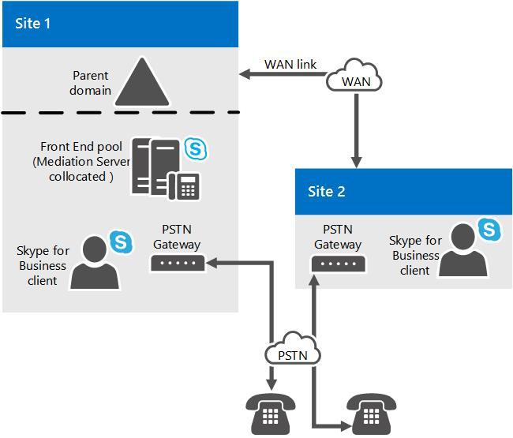

# Composant serveur de médiation dans Skype entreprise Server
 
Apprenez-en davantage sur les serveurs de médiation dans Skype entreprise Server, notamment ses topologies prises en charge et ses relations avec les Trunks M:N, le contournement du contenu multimédia et le contrôle d’admission des appels.
  
Pour déployer Enterprise Voice, vous devez déployer un ou plusieurs serveurs de médiation. 
  
Le serveur de médiation translate la signalisation entre votre infrastructure vocale d’entreprise interne et une passerelle de réseau téléphonique commuté (PSTN) ou un Trunk de protocole SIP (Session Initiation Protocol). Dans certains déploiements, il convertit également les éléments multimédias eux-mêmes entre ces points.
  
Sur le côté Skype entreprise Server, le serveur de médiation écoute une seule adresse de transport Mutual TLS (MTLS). Sur le côté passerelle, le serveur de médiation écoute tous les ports d’écoute associés aux Trunks. Toutes les passerelles qualifiées doivent prendre en charge le protocole TLS mais peuvent aussi activer le protocole TCP. Le protocole TCP est pris en charge pour les passerelles qui ne prennent pas en charge le protocole TLS.
  
Si vous avez également un échange de succursale publique (PBX) existant dans votre environnement, le serveur de médiation gère les appels entre les utilisateurs voix entreprise et le PBX. S’il s’agit d’un PBX IP, vous pouvez créer une connexion SIP directe entre le PBX et le serveur de médiation. S’il s’agit d’un système PBX (TDM) PBX, vous devez également déployer une passerelle RTC entre le serveur de médiation et le PBX.
  
Le serveur de médiation est colocalisé par défaut avec le serveur frontal. Le serveur de médiation peut également être déployé dans un pool autonome.
  
## Rôle du serveur de médiation

Les principales fonctions du serveur de médiation sont les suivantes:
  
- Le chiffrement et le déchiffrement de SRTP du côté Skype entreprise Server. 
    
- Conversion SIP sur TCP (pour les passerelles non compatibles TLS) vers SIP sur MTLS (Mutual TLS).
    
- Traduction de flux multimédias entre Skype entreprise Server et l’homologue de passerelle du serveur de médiation.
    
- Connexion des clients situés hors du réseau aux composants ICE internes, ce qui permet aux données multimédias de traverser les convertisseurs d’adresses réseau (NAT) et les pare-feu.
    
- Agissant en tant qu’intermédiaire pour les flux d’appels qui n’est pas pris en charge par une passerelle, comme les appels de travailleurs à distance sur une voix d’entreprise clien. t
    
- Dans les déploiements qui incluent la jonction SIP, collaboration avec le fournisseur de services de jonction SIP pour fournir la prise en charge RTC, de sorte qu’il ne soit plus nécessaire de disposer d’une passerelle RTC.
    
La figure suivante illustre les protocoles de signalisation et de média utilisés par le serveur de médiation pour communiquer avec une passerelle RTC de base et l’infrastructure voix entreprise.
  
**Protocoles de signalisation et de données multimédias utilisés par le serveur de médiation**

  
> [!NOTE]
> Si vous utilisez TCP ou RTP/RTCP (au lieu de SRTP ou SRTCP) sur le réseau entre la passerelle RTC et le serveur de médiation, nous vous conseillons de prendre des mesures pour garantir la sécurité et la confidentialité du réseau. 
  
## Jonction M:N

Skype entreprise Server prend en charge la souplesse dans la définition d’un Trunk pour le routage des appels. Un Trunk est une association logique entre un serveur de médiation et un numéro de port d’écoute, avec une passerelle et un numéro de port d’écoute. Cela implique plusieurs facteurs: un serveur de médiation peut avoir plusieurs Trunks vers la même passerelle; un serveur de médiation peut avoir plusieurs Trunks pour différentes passerelles. à l’inverse, une passerelle peut avoir plusieurs Trunks pour différents serveurs de médiation.
  
Vous devez tout de même créer un Trunk racine lorsque vous ajoutez une passerelle à votre topologie Skype entreprise à l’aide du générateur de topologie. Le nombre de passerelles qu’un serveur de médiation peut gérer dépend de la capacité de traitement du serveur pendant les heures de pointe. Si vous déployez un serveur de médiation sur du matériel qui répond à la configuration minimale requise pour Skype entreprise Server, comme indiqué dans la [Configuration requise pour Skype entreprise server 2015](../../plan-your-deployment/requirements-for-your-environment/server-requirements.md), un serveur de médiation autonome peut gérer approximativement appels 1000. Le serveur de médiation effectue le transcodage, mais route les appels pour plusieurs passerelles, même si les passerelles ne prennent pas en charge la dérivation multimédia.
  
Lors de la définition d’un itinéraire d’appel, vous spécifiez les Trunks associés à cet itinéraire, mais vous ne spécifiez pas les serveurs de médiation associés à cet itinéraire. À la place, vous utilisez le générateur de topologie pour associer des Trunks aux serveurs de médiation. En d’autres termes, le routage détermine le Trunk à utiliser pour un appel et, par la suite, le serveur de médiation associé à cette ligne envoie le signalement pour cet appel.
  
Le serveur de médiation peut être déployé en tant que pool. ce pool peut être colocalisé avec un pool frontal ou déployé en tant que pool autonome. Lorsqu’un serveur de médiation est colocalisé avec un pool frontal, la taille du pool peut être 12 (la limite de la taille du pool d’inscriptions). Ces fonctionnalités, telles que la fiabilité et la flexibilité de déploiement, permettent d’améliorer la fiabilité et la souplesse de déploiement des serveurs de médiation, mais ils nécessitent des fonctionnalités similaires:
  
- **Passerelle RTC.** Une passerelle éligible de Skype entreprise Server doit implémenter l’équilibrage de charge DNS, ce qui permet à une passerelle RTC (réseau téléphonique commuté) qualifiée d’un équilibreur de charge d’un pool de serveurs de médiation, et donc de répartir les appels sur le pool. .
    
- **Contrôleur de bordure de session.** Dans le cas d’un Trunk SIP, l’entité homologue est un contrôleur de bordure de session (SBC) sur un fournisseur de services de téléphonie Internet. Dans la direction du pool de serveurs de médiation vers SBC, l’SBC peut recevoir des connexions à partir d’un serveur de médiation du pool. Dans la direction de l’SBC vers le pool, le trafic peut être envoyé à un serveur de médiation du pool. Il est possible d’effectuer cette opération par le biais de l’équilibrage de charge DNS, le cas échéant par le fournisseur de services et SBC. Une autre solution consiste à fournir à l’opérateur de service les adresses IP de tous les serveurs de médiation du pool, et le prestataire de services les mettra en service dans leur SBC en tant que serveur SIP distinct pour chaque serveur de médiation. Le prestataire de services doit alors gérer l’équilibrage de charge de ses propres serveurs. Tous les fournisseurs de services ou SBCs ne prennent pas en charge ces fonctionnalités. Par ailleurs, le prestataire de services pourra facturer des frais supplémentaires pour cette fonctionnalité. En règle générale, chaque ligne SIP de l’SBC entraîne des frais mensuels.
    
- **PBX IP.** Dans la direction du pool de serveurs de médiation vers arrêt SIP IP-PBX, le PBX IP peut recevoir des connexions à partir de n’importe quel serveur de médiation du pool. Dans la direction du système PBX IP vers le pool, le trafic peut être envoyé à un serveur de médiation du pool. Étant donné que la plupart des PBX IP ne prennent pas en charge l’équilibrage de charge DNS, il est recommandé de définir des connexions SIP directes individuelles entre le PBX IP et chaque serveur de médiation du pool. Le PBX IP doit alors gérer son propre équilibrage de charge en répartissant le trafic via le groupe de lignes. L’hypothèse est que le groupe Trunk dispose d’un ensemble cohérent de règles de routage au PBX IP. Si un PBX IP particulier prend en charge ce concept de groupe de lignes et comment il s’intersecte avec la redondance et l’architecture de regroupement du PBX IP, vous devez déterminer si un cluster de serveurs de médiation peut interagir correctement avec un PBX IP.
    
Un pool de serveurs de médiation doit avoir une vue uniforme de la passerelle homologue avec laquelle il interagit. Cela signifie que tous les membres du pool accèdent à la même définition de passerelle homologue à partir du magasin de configurations et qu’ils ont tous autant de chances d’interagir avec elle pour les appels sortants. Par conséquent, il n’existe aucun moyen de segmenter le pool de façon à ce que certains serveurs de médiation communiquent uniquement avec certains homologues de passerelle pour les appels sortants. Si une telle segmentation est nécessaire, il est nécessaire d’utiliser une réserve distincte de serveurs de médiation. Ce serait le cas, par exemple, si les fonctionnalités associées dans les passerelles RTC, jonctions SIP ou systèmes IP-PBX pour interagir avec un pool n’étaient pas présentes (voir plus haut dans cette rubrique).
  
Une passerelle RTC, un PBX IP ou un homologue de réseau SIP en particulier peuvent être routés vers plusieurs serveurs ou Trunks de médiation. Le nombre de passerelles qu’un pool particulier de serveurs de médiation peut contrôler dépend du nombre d’appels utilisant une dérivation multimédia. Si un grand nombre d’appels utilise le contournement du contenu multimédia, un serveur de médiation du pool peut gérer de nombreux appels, car seul le traitement de la couche de signalisation est nécessaire. 
  
## Contrôle d’admission des appels et serveur de médiation

Le contrôle d’admission des appels (CAC) gère l’établissement de session en temps réel en tenant compte de la bande passante disponible pour éviter toute dégradation de la qualité de l’expérience (QoE) pour les utilisateurs sur des réseaux saturés. Pour prendre cela en charge, le serveur de médiation est responsable de la gestion de la bande passante pour ses deux interactions sur le côté Skype entreprise Server et sur le côté passerelle. Dans le cadre du contrôle d’admission des appels, l’entité qui met fin à l’appel gère la réservation de la bande passante. Les homologues de passerelle (passerelle RTC, PBX IP, SBC) pour lesquels le serveur de médiation interagit sur le côté de la passerelle ne prennent pas en charge le contrôle d’admission des appels Skype entreprise Server. C’est pourquoi le serveur de médiation doit gérer les interactions de bande passante pour le compte de son homologue de passerelle. Dans la mesure du possible, le serveur de médiation réserve de la bande passante à l’avance. Si c’est impossible (par exemple, si la localité du point de terminaison multimédia final du côté passerelle est inconnue pour un appel sortant vers l’homologue de passerelle), la bande passante est réservée quand l’appel est passé. Ce comportement peut entraîner une sur-souscription de bande passante, mais c’est le seul moyen d’empêcher les sonneries factices.
  
La déviation du trafic multimédia et la réservation de bande passante s’excluent mutuellement. Si la déviation du trafic multimédia est utilisée pour un appel, le contrôle d’admission des appels n’est pas effectué pour cet appel. L’hypothèse repose sur le fait qu’aucun lien avec bande passante restreinte n’est impliqué dans l’appel. Si le contrôle d’admission des appels est utilisé pour un appel particulier qui implique le serveur de médiation, cet appel ne peut pas recourir à une dérivation multimédia.
  
Pour plus d’informations sur le contrôle de dérivation multimédia ou le contrôle d’admission des appels, voir [planifier une dérivation de médias dans Skype entreprise](media-bypass.md) ou [planifier le contrôle d’admission des appels dans Skype entreprise Server](call-admission-control.md).
  
## Enhanced 9-1-1 (E9-1-1) et serveur de médiation

Le serveur de médiation dispose de fonctionnalités étendues afin qu’il puisse interagir correctement avec les fournisseurs de services 9-1-1 (E9-1-1) améliorés. Aucune configuration spéciale n’est nécessaire sur le serveur de médiation. Les extensions SIP requises pour l’interaction E9-1-1 sont par défaut incluses dans le protocole SIP du serveur de médiation pour ses interactions avec un homologue de passerelle (passerelle RTC, PBX IP ou l’SBC d’un fournisseur de services de téléphonie Internet, y compris le service E9-1-1 Moteurs
  
Le trunking SIP pour un fournisseur de services E9-1-1 peut être arrêté sur un pool de serveurs de médiation existant ou exiger des serveurs de médiation autonomes, selon que l’élément SBC E9-1-1 peut interagir avec un pool de serveurs de médiation. Pour plus d’informations, reportez-vous à [M:N Trunk dans Skype entreprise Server](m-n-trunk.md).
  
## Déviation du trafic multimédia et serveur de médiation

La fonctionnalité de contournement de média est une fonctionnalité de Skype entreprise Server qui permet à un administrateur de configurer le routage des appels pour qu’il passe directement entre le point de terminaison de l’utilisateur et la passerelle RTC (réseau téléphonique commuté) sans traverser le serveur de médiation. La dérivation de médias améliore la qualité des appels en réduisant la latence, la traduction inutile, le risque de perte de paquets et le nombre de points de défaillance potentiels. Dans le cas où un site distant dépourvu d’un serveur de médiation est connecté à un site central par le biais d’un ou de plusieurs liens WAN dotés de la bande passante contrainte, le contournement du contenu multimédia limite les exigences de bande passante en permettant à un client distant tout d’abord, le lien réseau étendu doit être transmis à un serveur de médiation sur le site central. Cette réduction du traitement des contenus multimédias complète également la capacité du serveur de médiation à contrôler plusieurs passerelles.
  
La déviation du trafic multimédia et le contrôle d’admission des appels s’excluent mutuellement. Si la déviation du trafic multimédia est utilisée pour un appel, le contrôle d’admission des appels n’est pas effectué pour cet appel. L’hypothèse repose sur le fait qu’aucun lien avec bande passante restreinte n’est impliqué dans l’appel.
  
## Topologies du serveur de médiation

Le serveur de médiation Skype entreprise Server est par défaut colocalisé sur un serveur Standard Edition Server, un pool frontal ou une unité de branchement Survivable. Tous les serveurs de médiation dans un pool frontal doivent être configurés de la même manière.
  
Lorsque la performance est un problème, il peut être préférable de déployer un ou plusieurs serveurs de médiation dans un pool autonome dédié. Nous vous conseillons absolument un pool autonome si vous déployez une jonction SIP. 
  
Si vous déployez des connexions SIP directes vers une passerelle RTC qualifiée qui prend en charge le contournement du contenu multimédia et l’équilibrage de charge DNS, vous n’avez pas besoin d’un pool de serveurs de médiation autonome. En effet, les passerelles qualifiées sont capables d’équilibrer la charge DNS vers un pool de serveurs de médiation et ils peuvent recevoir le trafic de n’importe quel serveur de médiation dans un pool.
  
Nous vous recommandons également de collocate le serveur de médiation sur un pool frontal lorsque vous avez déployé des PBX IP ou de vous connecter à un contrôleur de bordure de session du fournisseur de téléphonie Internet (SBC), à condition que l’une des conditions suivantes soit remplie:
  
- Le PBX IP ou le SBC est configuré pour recevoir le trafic de n’importe quel serveur de médiation dans le pool et peut acheminer le trafic uniformément vers tous les serveurs de médiation du pool.
    
- Le PBX IP ne prend pas en charge la dérivation multimédia, mais le pool frontal qui héberge le serveur de médiation peut gérer le transcodage de la voix pour les appels pour lesquels aucune dérivation de média ne s’applique.
    
Vous pouvez utiliser l’outil de planification de Microsoft Lync Server 2013 pour déterminer si le pool frontal sur lequel vous souhaitez collocate le serveur de médiation peut gérer le chargement. Si votre environnement ne peut pas répondre à ces exigences, vous devez déployer un pool de serveurs de médiation autonome.
  
La figure suivante montre une topologie simple constituée de deux sites connectés par une liaison de réseau étendu. Le serveur de médiation est colocalisé sur un pool frontal sur le site 1. Les serveurs de médiation du site 1 contrôlent à la fois la passerelle RTC sur le site 1 et la passerelle sur le site 2. Dans cette topologie, la déviation du trafic multimédia est activée globalement afin d’utiliser les informations de site et de région, et le contournement est activé sur les jonctions vers chaque passerelle RTC (GW1 et GW2).
  
**Exemple de sites connectés par une liaison de réseau étendu avec un serveur de médiation pour Site 1 et une passerelle RTC pour Site 2**

  
La figure suivante montre une topologie simple où le serveur de médiation est colocalisé sur le pool frontal sur le site 1 et dispose d’une connexion SIP directe au PBX IP sur le site 1. Dans cette figure, le serveur de médiation contrôle également une passerelle RTC sur le site 2. Supposez que les utilisateurs Skype entreprise existent sur les sites 1 et 2. Par ailleurs, supposez que le PBX IP possède un processeur de média associé qui doit être parcouru par tous les éléments multimédias provenant de points de terminaison Skype entreprise avant d’être envoyés aux points de terminaison média contrôlés par le PBX IP. Dans cette topologie, la déviation du trafic multimédia est activée globalement pour utiliser les informations de site et de région, et il est activé pour les jonctions vers la passerelle PBX et RTC.
  
**Exemple de sites connectés par une liaison de réseau étendu avec un serveur de médiation pour Site 1 et un PBX pour Site 2**

  
La dernière figure de cette rubrique montre une topologie dans laquelle le serveur de médiation est connecté à l’SBC d’un fournisseur de services de téléphonie Internet. 
  
## Décisions de planification relatives au serveur de médiation

Cette rubrique décrit les décisions de planification que vous devez prendre pour le déploiement de votre serveur de médiation.
  
### Serveur de médiation autonome ou colocalisé

Le serveur de médiation est par défaut colocalisé sur le serveur principal ou le serveur frontal standard dans un pool frontal de sites centraux. Le nombre d’appels RTC (réseau téléphonique commuté) pouvant être gérés et le nombre d’ordinateurs requis dans le pool dépendront des éléments suivants :
  
- Nombre d’homologues de passerelle que le pool de serveurs de médiation contrôle
    
- des périodes de trafic aux heures de pointe via ces passerelles ;
    
- Pourcentage d’appels dont le média ignore le serveur de médiation
    
Lors de la planification, veillez à prendre en compte les exigences de traitement multimédia pour les appels RTC et les conférences A/V qui ne sont pas configurées pour le recours au contenu multimédia, ainsi que le traitement requis pour gérer les interactions de signalisation en fonction du nombre d’appels vers des heures de disponibilité qui doivent être pris en charge. S’il n’y a pas assez d’UC, vous devez déployer un pool autonome de serveurs de médiation. les passerelles RTC, IP PBX et SBCs doivent être divisées en sous-ensembles contrôlés par les serveurs de médiation colocalisés dans un pool et les serveurs de médiation autonomes dans un ou plusieurs pools autonomes.
  
Si vous avez déployé des passerelles RTC, des PBX IP ou des contrôleurs de frontière de session (SBCs) qui ne prennent pas en charge les fonctionnalités appropriées pour interagir avec un pool de serveurs de médiation, y compris les suivants, ils devront être associés à un pool autonome composé de d’un serveur de médiation unique:
  
- Effectuer l’équilibrage de charge DNS (Layer Domain Name System) entre les serveurs de médiation d’un pool (ou sinon, le trafic est uniformément routé vers tous les serveurs de médiation d’un pool)
    
- Accepter le trafic de n’importe quel serveur de médiation dans un pool
    
Vous pouvez utiliser l’outil de planification de Microsoft Lync Server 2013 pour déterminer si collocating du serveur de médiation avec votre pool frontal peut gérer le chargement. Si votre environnement ne peut pas répondre à ces exigences, vous devez déployer un pool de serveurs de médiation autonome.
  
### Aspects relatifs au site central et aux sites de succursale

 Les serveurs de médiation sur le site central peuvent être utilisés pour acheminer les appels pour les PBX IP ou les passerelles RTC dans les sites de succursale. Toutefois, si vous déployez des Trunks SIP, vous devez déployer un serveur de médiation sur le site où chaque Trunk est arrêté. Le fait de disposer d’un serveur de médiation au niveau du site central pour les appels pour un PBX IP ou une passerelle RTC sur un site de succursale ne nécessite pas l’utilisation de la fonctionnalité de contournement de média. Cependant, si vous pouvez l’activer, vous pourrez réduire la latence du chemin d’accès des médias et améliorer la qualité des médias car le chemin d’accès des médias n’est plus nécessaire pour suivre le chemin de signalisation. La fonction de contournement de média réduit également la charge de traitement de la liste.
  
> [!NOTE]
> La déviation du trafic multimédia ne fonctionnera pas avec chaque passerelle RTC, système IP-PBX et SBC. Microsoft a testé une série de passerelles RTC et de SBC avec l’aide de partenaires agréés et a réalisé des tests avec les systèmes IP-PBX de Cisco. La dérivation de média est uniquement prise en charge avec les produits et les versions répertoriés dans [le programme d’interopérabilité d’ouverture de communications unifiées-Lync Server](https://go.microsoft.com/fwlink/p/?LinkId=268730). 
  
Si la résilience du site de succursale est requise, il est nécessaire d’avoir une branche ou une combinaison d’un serveur frontal, d’un serveur de médiation et d’une passerelle dans le site de succursale. (L’hypothèse de la résilience du site de succursale est que la présence et les conférences ne sont pas résilientes sur le site.) Pour obtenir des instructions sur la planification du site de succursale pour les appels vocaux, voir [planifier la résilience vocale d’entreprise dans Skype entreprise Server](enterprise-voice-resiliency.md).
  
S’il s’agit d’interactions avec un PBX IP, si ce n’est 3960 pas le cas, vous pouvez découper les premiers mots du message d’accueil pour les appels entrants du PBX IP vers Skype pour les appels entrants. Points de terminaison d’entreprise. Ce problème peut être plus grave si un serveur de médiation sur un site central effectue le routage des appels pour un PBX IP à l’endroit où l’itinéraire se termine sur un site de succursale, car il est nécessaire de disposer de davantage de temps pour que le signalement se termine. Si vous subissez ce comportement, le déploiement d’un serveur de médiation sur le site de la succursale est le seul moyen de réduire l’écrêtage des premiers mots.
  
Enfin, si votre site central possède un PBX TDM ou si votre PBX IP n’élimine pas la nécessité d’une passerelle RTC, vous devez déployer une passerelle sur l’itinéraire d’appel connexion du serveur de médiation et du PBX.
  
> [!NOTE]
> Pour améliorer les performances multimédias d’un serveur de médiation autonome, activez RSS (Receive-Side Scaling) sur les cartes réseau de ces serveurs. RSS permet la gestion en parallèle des paquets entrants par plusieurs processeurs sur le serveur. Pour plus d’informations, consultez la section [«améliorations apportées à l’échelle de réception dans Windows Server»](https://go.microsoft.com/fwlink/p/?LinkId=268731). Pour plus d’informations sur l’activation de RSS, reportez-vous à la documentation de votre carte réseau. 
  

