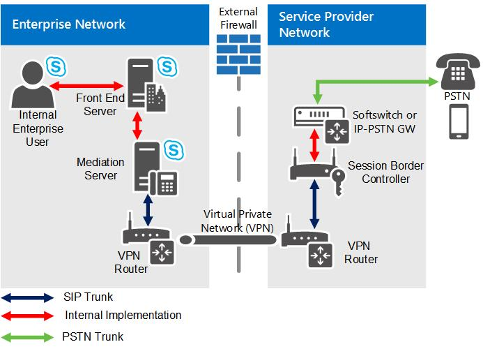

# Trunking SIP in Skype Entreprise Server

En savoir plus sur la trunking SIP dans Skype Entreprise Server Voix Entreprise

Le protocole SIP (Session Initiation Protocol) sert à initier et à gérer les sessions de communications Voix sur IP (VoIP) pour le service téléphonique de base et d’autres services de communication en temps réel, tels que messagerie instantanée, conférence, détection de présence et multimédia. Cette section fournit des informations de planification pour l’implémentation de jonctions SIP, un type de connexion SIP qui s’étend au-delà des limites de votre réseau local.

## Qu’est-ce que la jonction SIP ?

Une jonction SIP est une connexion IP qui établit un lien de communications SIP entre votre organisation et un fournisseur de services de téléphonie Internet (ITSP) à l’extérieur de votre pare-feu. En règle générale, une connexion SIP est utilisée pour connecter le site central de votre organisation à un itsp. Dans certains cas, vous pouvez également décider d’utiliser la jonction SIP pour connecter votre site de succursale à un fournisseur de services de téléphonie Internet (ITSP).

Le déploiement d’une trunking SIP peut être un grand pas vers la simplification des télécommunications de votre organisation et la préparation aux améliorations à jour apportées aux communications en temps réel. L’un des principaux avantages de la connexion SIP est que vous pouvez consolider les connexions de votre organisation au réseau téléphonique commuté (PSTN) sur un site central, par opposition à son prédécesseur, le multiplexage de division du temps (TDM), qui nécessite généralement une connexion distincte de chaque site de succursale.

### Économies

Les économies associées à la jonction SIP peuvent être substantielles :

- Les appels longue distance coûtent en général moins cher via une jonction SIP.

- Vous pouvez réduire les coûts de gestion et la complexité du déploiement.

- Les coûts d’accès de base (Basic rate interface, BRI) et d’accès primaire (Primary Rate Interface, PRI) sont éliminés si vous connectez une jonction SIP directement à votre fournisseur de services de téléphonie Internet pour un coût nettement plus bas. Avec une jonction TDM, les fournisseurs de service facturent les appels à la minute. Le coût d’une jonction SIP peut être basé sur l’utilisation de la bande passante, que vous pouvez acheter en plus petites tranches plus économiques. (Le coût réel dépend du modèle de service du fournisseur de services de téléphonie Internet que vous choisissez.)

#### Jonction SIP comparée à l’hébergement d’une passerelle PSTN ou d’un PBX IP

Étant donné que les jonctions SIP se connectent directement à votre fournisseur de service, vous pouvez éliminer les passerelles PSTN et éviter le coût et la complexité de leur gestion. L’utilisation d’une jonction SIP peut se traduire par des économies substantielles, car les tâches de maintenance et d’administration sont réduites.

### Services VoIP étendus

Bénéficier de fonctionnalités vocales est souvent la principale motivation pour déployer une jonction SIP, mais la prise en charge de fonctionnalités vocales n’est que la première étape. Avec la trunking SIP, vous pouvez étendre les fonctionnalités VoIP et Skype Entreprise Server pour fournir un ensemble de services plus riche. Par exemple :

- La détection de présence améliorée pour les appareils qui n’exécutent pas Skype Entreprise Server peut fournir une meilleure intégration avec les téléphones mobiles, ce qui vous permet de voir quand un utilisateur passe un appel mobile.

- Les appels d’urgence E9-1-1 permettent aux autorités qui répondent aux appels 911 de déterminer l’emplacement de l’appelant à partir de son numéro de téléphone.

> [!NOTE]
> Contactez votre fournisseur de services de téléphonie Internet pour savoir quels services il prend en charge et peut activer pour votre organisation.

### Différences entre les jonctions SIP et les connexions SIP directes

Le terme jonction est dérivé de la technologie de commutation. Il fait référence à une ligne physique dédiée qui connecte les équipements téléphoniques de commutation. Comme leurs prédécesseurs, les liaisons TDM (multiplexage de division du temps), les connexions SIP sont des connexions entre deux réseaux SIP distincts : l’entreprise Skype Entreprise Server et le groupe itsp. Contrairement aux jonctions de commutation, les jonctions SIP sont des connexions virtuelles pouvant être établies sur n’importe quel type de connexion de jonction SIP pris en charge.

En revanche, les connexions SIP directes sont des connexions SIP qui ne franchissent pas les limites du réseau local (c’est-à-dire qu’elles se connectent à une passerelle PSTN ou à un PBX dans votre réseau interne). Pour plus d’informations sur l’utilisation des connexions SIP directes avec Skype Entreprise Server, voir [Connexions SIP directes dans Skype Entreprise Server](direct-sip.md).

## Comment implémenter une trunking SIP ?

Pour implémenter une liaison SIP, vous devez router la connexion via un serveur de médiation, qui agit en tant que proxy pour les sessions de communication entre les clients Skype Entreprise Server et le fournisseur de services et transcode le média, le cas échéant.

Chaque serveur de médiation dispose d’une interface réseau interne et d’une interface réseau externe. L’interface interne se connecte aux serveurs frontaux. L’interface externe est communément appelée interface de passerelle, car elle est traditionnellement utilisée pour connecter le serveur de médiation à une passerelle PSTN (réseau téléphonique commuté) ou à un SYSTÈME IP-PBX. Pour implémenter une trunk SIP, vous connectez l’interface externe du serveur de médiation au composant Edge externe du itsp. Ce dernier peut être un contrôleur SBC, un routeur ou une passerelle.

Pour plus d’informations sur les serveurs de médiation, voir composant serveur de [médiation dans Skype Entreprise Server](mediation-server.md).

### Comparatif entre jonction SIP centralisée et jonction SIP distribuée

Une trunking SIP centralisée a pour effet d’approvisionnement tout le trafic VoIP, y compris le trafic de site de succursale, via votre site central. Le modèle de déploiement centralisé est simple, rentable et est généralement l’approche recommandée pour implémenter des trunks SIP avec Skype Entreprise Server.

La trunking SIP distribuée est un modèle de déploiement dans lequel vous implémentez des trunks SIP locaux sur un ou plusieurs sites de succursale. Le trafic VoIP est ensuite acheminé du site de succursale directement vers un fournisseur de services sans passer par le site central.

La jonction SIP distribuée n’est requise que dans les cas suivants :

- Le site de succursale nécessite une connectivité téléphonique de secours (par exemple, en cas de panne de la liaison WAN). Cette exigence doit être analysée pour chaque site de succursale . Certaines de vos succursales peuvent nécessiter une redondance et un failover, alors que d’autres peuvent ne pas le faire.

- La résilience est requise entre deux sites centraux. Vous devez vous assurer qu’une trunk SIP s’est terminée sur chaque site central. Par exemple, si vous avez des sites centraux Dublin et Tukwila et que les deux n’utilisent qu’une seule ligne SIP de site, si la ligne est en panne, les utilisateurs de l’autre site ne peuvent pas effectuer d’appels PSTN.

- Le site de succursale et le site central sont situés dans différents pays/régions. Pour des raisons de compatibilité et légales, vous devez disposer d’au moins une jonction SIP par pays/région. Par exemple, dans l’Union Européenne, les communications ne peuvent pas sortir d’un pays ou d’une région sans terminaison locale à un point centralisé.

En fonction de l’emplacement géographique des sites et du trafic anticipé au sein de votre entreprise, vous ne souhaitez peut-être pas router tous les utilisateurs via la liaison SIP centrale ou vous pouvez choisir d’router certains utilisateurs via une trunk SIP sur leur site de succursale. Pour vous aider à établir vos besoins, répondez aux questions suivantes :

- Quelle est la taille de chaque site (c’est-à-dire, combien d’utilisateurs sont activés pour Voix Entreprise) ?

- Quels numéros de Sélection directe à l’arrivée (SDA) reçoivent le plus grand nombre d’appels sur chaque site ?

La décision d’opter pour une jonction SIP centralisée ou distribuée doit être basée sur une analyse des coûts-avantages. Dans certains cas, il peut être plus avantageux d’opter pour un modèle de déploiement distribué, même s’il n’est pas nécessaire. Dans un déploiement complètement centralisé, tout le trafic du site de succursale est acheminé via des liaisons WAN. Au lieu de payer pour la bande passante requise pour la liaison WAN, il est peut-être préférable d’utiliser une jonction SIP distribuée. Par exemple, vous pouvez déployer un serveur Édition Standard sur un site de succursale avec fédération sur le site central ou un Survivable Branch Appliance ou un serveur Survivable Branch Server avec une petite passerelle.

> [!NOTE]
> Pour plus d’informations sur la trunking SIP distribuée, voir [Branch site SIP trunking in Skype Entreprise Server](branch-site.md).

### Types de connexion de jonction SIP pris en charge

Skype Entreprise Server prend en charge les types de connexion suivants pour la connexion SIP :

- Le réseau privé MPLS (Multiprotocol Label Switching) dirige et transporte les données d’un nœud du réseau vers le suivant. La bande passante d’un réseau MPLS est partagée avec d’autres abonnés, et une étiquette est attribuée à chaque paquet de données pour distinguer les données d’un abonné des autres. Ce type de connexion ne requiert pas de réseau privé virtuel (VPN). Un des inconvénients possibles est que le trafic IP excessif peut interférer avec le trafic VoIP à moins qu’une priorité ne soit affectée au trafic VoIP.

- Une connexion privée sans autre trafic, par exemple une connexion à fibre optique louée ou une ligne T1, est généralement le type de connexion le plus fiable et le plus sûr. En effet, elle offre la capacité la plus élevée en matière de transport des appels. Toutefois, elle est généralement plus chère. Un VPN n’est pas nécessaire. Les connexions privées sont adaptées aux organisations à grands volumes d’appels ou soumises à des exigences strictes en matière de sécurité et de disponibilité.

- Internet est le type de connexion le moins cher, mais aussi le moins fiable. La connexion Internet est le seul Skype Entreprise Server type de connexion SIP nécessitant un VPN.

#### Sélection d’un type de connexion

Le type de connexion de jonction SIP le plus approprié à votre entreprise dépend de vos besoins et de votre budget.

- Pour les grandes et moyennes entreprises, un réseau MPLS offre en général la meilleure valeur. Il est capable de fournir la bande passante nécessaire à un tarif moindre qu’un réseau privé spécialisé.

- Pour les grandes entreprises, une connexion privée à fibre optique, T1, T3 ou supérieure (E1, E3 ou supérieure dans l’Union Européenne) peut être adaptée.

- Pour une petite entreprise ou un site de succursale avec un volume d’appels faible, une connexion SIP via Internet peut être la meilleure solution. Ce type de connexion n’est pas recommandé pour les sites de taille moyenne ou de grande taille.

### Bande passante requise

La capacité d’appels (c’est-à-dire le nombre d’appels simultanés devant être pris en charge) détermine la bande passante requise pour votre implémentation. Vous devez prendre en compte la disponibilité de la bande passante pour pouvoir tirer parti de la capacité maximale facturée. Calculez vos besoins en bande passante de jonction SIP maximale à l’aide de la formule suivante :

Bande passante de jonction SIP maximale = Nbre max. d’appels simultanés (64 Kbits/s + taille d’en-tête)

> [!NOTE]
> La taille d’en-tête maximale est de 20 octets.

### Prise en charge de codec

Skype Entreprise Server prend en charge uniquement les codecs suivants :

- G.711 a-law (utilisé principalement en dehors de l’Amérique du Nord)

- G.711 µ-law (utilisé en Amérique du Nord)

### Fournisseur de services de téléphonie Internet

La manière dont vous mettez en œuvre le côté fournisseur de services d’une connexion de jonction SIP varie d’un fournisseur de services de téléphonie Internet à l’autre. Pour plus d’informations sur le déploiement, contactez votre fournisseur de services. Pour obtenir la liste des fournisseurs de services de trunking SIP certifiés, consultez le site web du programme d’interopérabilité d’ouverture des communications unifiées [Microsoft.](../../../SfbPartnerCertification/lync-cert/qualified-ip-pbx-gateway.md)

Pour plus d’informations sur les fournisseurs de jonctions SIP approuvés par Microsoft, contactez votre représentant Microsoft.

> [!IMPORTANT]
> Vous devez utiliser un fournisseur de services approuvé par Microsoft pour garantir que votre fournisseur de services de téléphonie Internet prend en charge toutes les fonctionnalités qui transitent par la jonction SIP (par exemple la configuration et la gestion des sessions, et la prise en charge des services VoIP étendus). Le support technique Microsoft ne s’étend pas aux configurations qui utilisent des fournisseurs non approuvés. Si vous utilisez actuellement un fournisseur de services Internet non approuvé pour la jonction SIP, vous pouvez envisager de continuer à utiliser ce fournisseur en tant que FAI et utiliser un fournisseur approuvé par Microsoft pour la jonction SIP.

### Topologies et composants pour la trunking SIP

La figure suivante illustre la topologie de la trunking SIP dans Skype Entreprise Server.

**Topologie de jonction SIP**

Comme le montre le diagramme, un réseau privé virtuel (VPN) IP est utilisé pour la connectivité entre le réseau d’entreprise et le fournisseur de services de réseau téléphonique commuté. L’objectif de ce réseau privé est de fournir la connectivité IP, d’améliorer la sécurité et (éventuellement) d’obtenir des garanties de qualité de service. En raison de la nature d’un VPN, vous n’avez pas besoin d’utiliser TLS pour le trafic de signalisation SIP, ni SRTP pour le trafic multimédia. De ce fait, les connexions entre l’entreprise et le fournisseur de services consistent en des connexions TCP ordinaires pour SIP et des connexions RTP ordinaires (avec le protocole UDP) pour les médias traités par tunnel via un réseau VPN IP. Veillez à ce que tous les pare-feu situés entre les routeurs VPN disposent de ports ouverts pour permettre aux routeurs VPN de communiquer. Par ailleurs, les adresses IP des périmètres externes des routeurs VPN doivent être publiquement routables.

> [!IMPORTANT]
> Contactez votre fournisseur de services pour déterminer s’il fournit la prise en charge pour la disponibilité élevée, notamment le basculement. Si c’est le cas, vous devrez déterminer les procédures pour la configurer. Par exemple, devez-vous configurer une seule adresse IP et une seule ligne SIP sur chaque serveur de médiation, ou devez-vous configurer plusieurs trunks SIP sur chaque serveur de médiation ? > si vous avez plusieurs sites centraux, demandez également si le fournisseur de services a la possibilité d’activer les connexions vers et à partir d’un autre site central.

> [!NOTE]
> Pour la trunking SIP, nous vous recommandons vivement de déployer des serveurs de médiation autonomes. Pour plus d’informations, voir [Deploying Mediation Servers and Defining Peers](/previous-versions/office/lync-server-2013/lync-server-2013-deploying-mediation-servers-and-defining-peers) dans la documentation de déploiement.

### Sécurisation du serveur de médiation pour la jonction SIP

Pour des raisons de sécurité, vous devriez configurer un réseau local virtuel (VLAN) pour chaque connexion entre deux routeurs VPN. Le processus courant de configuration d’un VLAN varie d’un fabricant de routeur à l’autre. Pour plus d’informations, contactez le fournisseur de votre routeur.

Nous vous conseillons de suivre les directives suivantes :

- Configurer un réseau local virtuel (VLAN) entre le serveur de médiation et le routeur VPN dans le réseau de périmètre (également appelé DMZ, zone démilitarisée et sous-réseau filtré).

- N’autorisez pas le transfert des paquets de diffusions ou de multidiffusions entre le routeur et le réseau local virtuel.

- Bloquez toutes les règles de routage qui routent le trafic du routeur vers n’importe où sauf vers le serveur de médiation.

Si vous utilisez un serveur VPN, bous vous conseillons de suivre les directives suivantes :

- Configurer un VLAN entre le serveur VPN et le serveur de médiation.

- N’autorisez pas la transmission des paquets de diffusions ou de multidiffusions du serveur VPN vers le réseau local virtuel.

- Bloquez toute règle de routage qui approvisionnement le trafic de serveur VPN vers n’importe où sauf vers le serveur de médiation.

- Chiffrez les données sur le réseau privé virtuel (VPN) à l’aide de l’encapsulation générique de routage (GRE).

## Voir aussi

[Branch site SIP trunking in Skype Entreprise Server](branch-site.md)