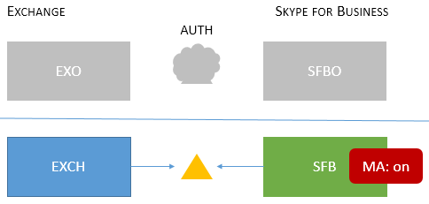

# Topologies Skype Entreprise prises en charge avec l’authentification moderne

Cet article répertorie les topologies en ligne et sur site qui sont pris en charge avec l’authentification moderne dans Skype Entreprise, ainsi que les fonctionnalités de sécurité qui s’appliquent à chaque topologie.

## Authentification moderne dans Skype Entreprise

Skype Entreprise tirer parti des avantages de sécurité de l’authentification moderne. Étant donné Skype Entreprise fonctionne en étroite collaboration avec Exchange, le comportement de connexion Skype Entreprise les utilisateurs clients seront également affectés par l’état de l’Exchange. Cela s’applique également si vous avez un Skype Entreprise hybride à domaine partagé. Il s’agit d’un grand nombre de composants mobiles, mais le but ici est de visualiser facilement la liste des topologies pris en charge.

Quelles topologies sont Skype Entreprise, Skype Entreprise en ligne, Exchange Server et Exchange en ligne, quelles topologies sont pris en charge avec MA ?

<!--  > [!TIP] > Not sure what Modern Authentication even is? No worries.  This Skype for Business article  4e6a99cd-7859-4062-8a30-5ac79ba36b52  explains it in the first paragraphs. -->

### Topologies MA pris en charge dans Skype Entreprise

Il existe potentiellement deux applications serveur et deux charges Microsoft 365 ou Office 365 charges de travail, impliquées dans Skype Entreprise topologies utilisées par MA.

- Skype Entreprise serveur local (CU 5)

- Skype Entreprise online (SFBO)

- Exchange serveur local

- Exchange server online (EXO)

Une autre partie importante de MA est de savoir où l’authentification (authN) et l’autorisation (authZ) des utilisateurs auront lieu. Les deux options sont :

- Azure AD, en ligne dans Microsoft Cloud

- Serveur ADFS (Active Directory Federation Server) local

Il ressemble donc un peu à ceci, avec EXO et SFBO dans le cloud avec Azure AD, et Exchange Server (EXCH) et Skype Entreprise server (SFB) sur site.

Voici les topologies pris en charge. Notez la clé des graphiques :

- Si l’icône est estommée ou grisée, elle n’est pas utilisée dans le scénario.

- EXO est Exchange Online.

- SFBO est Skype Entreprise Online.

- EXCH est Exchange local.

- SFB est Skype Entreprise local.

- Les serveurs d’autorisation sont représentés par des triangles, par exemple, le Azure AD est un triangle avec un nuage derrière lui.

- Les flèches pointent vers le serveur d’autorisation qui sera utilisé lorsque les clients essaieront d’atteindre la ressource serveur spécifiée.

Tout d’abord, nous allons couvrir MA avec Skype Entreprise dans les topologies en local uniquement ou en nuage uniquement.

> [!IMPORTANT]
> Êtes-vous prêt à configurer l’authentification moderne dans Skype Entreprise Online ? Les étapes permettant d’activer cette fonctionnalité sont [ici.](https://social.technet.microsoft.com/wiki/contents/articles/34339.skype-for-business-online-enable-your-tenant-for-modern-authentication.aspx)

|Nom de la topologie    |Exemple    |Description    |Pris en charge    |
|:-----|:-----|:-----|:-----|
|Cloud uniquement    |Utilisateurs d’accueil/boîtes aux lettres situées : En ligne    |MA est en place pour EXO et SFBO.    Par conséquent, le serveur d’autorisation est Azure AD.    |Authentification multifacteur (MFA), authentification basée sur le certificat client (CBA), accès conditionnel (CA)/Gestion des applications mobiles (MAM) avec Intune. \*    |
|Sur place uniquement    |Utilisateurs homed/mailboxes located: On-premises    |MA est en cours pour SFB en local.    Par conséquent, le serveur d’autorisation est ADFS.    Pour plus d’informations sur la configuration, consultez [cet article.](/microsoft-365/enterprise/hybrid-modern-auth-overview)   |MFA (Windows Bureau uniquement - les clients mobiles ne sont pas pris en charge). Aucune fonctionnalité Exchange’intégration.   
 **Cette approche n’est pas recommandée. Consultez les informations ci-après :** [https://aka.ms/ModernAuthOverview](/microsoft-365/enterprise/hybrid-modern-auth-overview)
 |

> [!IMPORTANT]
> Il est recommandé que l’état ma soit le même dans Skype Entreprise et Exchange (et leurs équivalents en ligne) pour réduire le nombre d’invites.

Les topologies mixtes impliquent des combinaisons d’hybrides de domaine partagé SFB. Voici les topologies mixtes actuellement pris en charge :

|Nom de la topologie    |Exemple    |Description    |Pris en charge    |
|:-----|:-----|:-----|:-----|
|Mixte 1    |             Utilisateurs d’accueil/boîtes aux lettres situées : EXO et SFB    |Ma n’est pas activée pour SFB ; aucune fonctionnalité MA SFB disponible dans cette topologie.    |Aucune fonctionnalité MA pour SFB.    |
|Mixte 2    |             Utilisateurs homed/mailboxes located: EXCH and SFBO    |MA est uniquement sur SFBO. Le serveur d’autorisation est Azure AD pour les utilisateurs dos à dos SFBO, mais AD pour EXCH en local.    |MFA, CBA, CA/MAM avec Intune.\*    |
|Mixte 3    |             Utilisateurs d’accueil/boîtes aux lettres situées : EXO + SFB ou EXCH + SFB    |Aucune fonctionnalité MA SFB disponible dans cette topologie    |Aucune fonctionnalité MA pour SFB.    |
|Mixte 4    |             Utilisateurs homed/mailboxes located: EXCH +SFBO or EXCH + SFB    |MA est sur pour SFBO. Par conséquent, le serveur d’autorisation est Azure AD pour les utilisateurs doms dans SFBO. Les utilisateurs sur site dans SFB et EXO utilisent AD.    |MFA, CBA, CA/MAM avec Intune pour les utilisateurs en ligne uniquement.\*    |
|Mixte 5    |             Utilisateurs d’accueil/boîtes aux lettres situées : EXO + SFBO, EXO + SFB, EXCH + SFBO ou EXCH + SFB    |MA est à la fois sur EXO et SFBO. Par conséquent, le serveur d’autorisation est Azure AD pour les utilisateurs dompés dans SFBO ; Les utilisateurs sur site dans EXCH et SFB utilisent AD.    |MFA, CBA, CA/MAM avec Intune pour les utilisateurs en ligne uniquement.\*    |
|Mixte 6    |             Utilisateurs d’accueil/boîtes aux lettres situées : EXO + SFBO, EXO + SFB, EXCH + SFBO ou EXCH + SFB    |Ma est sur n’importe où, par conséquent le serveur d’autorisation est Azure AD pour tous les utilisateurs. (en ligne et en local)     Veuillez consulter les [https://aka.ms/ModernAuthOverview](/microsoft-365/enterprise/hybrid-modern-auth-overview) étapes de déploiement.   |MFA, CBA et CA/MAM (via Intune) pour tous les utilisateurs.    |

\*- L’mf inclut Windows ordinateurs de bureau, MAC, iOS, android et Windows mobiles ; L’ba inclut Windows ordinateurs de bureau, iOS et Android ; CA/MAM avec Intune, inclut les appareils Android et iOS.

> [!IMPORTANT]
> Il est très important de noter que les utilisateurs peuvent voir plusieurs **invites** dans certains cas, notamment lorsque l’état de l’ma n’est pas le même sur toutes les ressources serveur dont les clients peuvent avoir besoin et demander, comme c’est le cas pour toutes les versions des topologies mixtes.

> [!IMPORTANT]
> Notez également que dans certains cas (mixte 1, 3 et 5 spécifiquement), une clé de Registre [AllowADALForNonLyncIndependentOfLync](https://support.microsoft.com/help/3082803/info-about-the-allowadalfornonlyncindependentoflync-setting-in-skype-for-business,-lync-2013,-and-exchange-online) doit être définie pour une configuration appropriée pour les clients de bureau Windows.