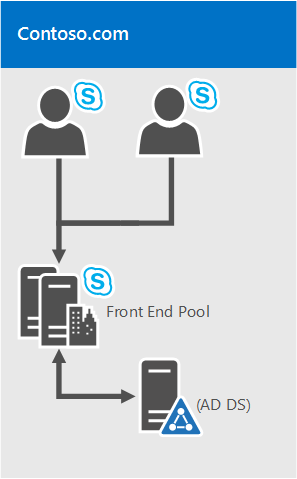
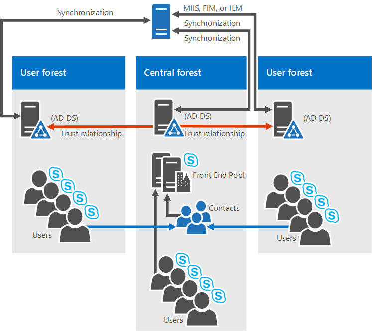

# Exigences environnementales pour Skype Entreprise Server 2015
 
**Résumé :** Configurez la configuration requise non-serveur pour Skype Entreprise Server 2015. Il existe plusieurs éléments que vous souhaitez configurer avant de déployer, notamment Active Directory, DNS, Certs et Fileshares.
  
Qu’est-ce qu’une exigence environnementale Skype Entreprise Server 2015 ? Nous avons placé tout ce qui n’est pas directement lié au serveur dans cette rubrique, donc vous n’avez pas besoin de cliquer autant autour de vous. Si vous recherchez les conditions préalables du serveur, vous pouvez consulter les conditions  requises pour le serveur pour la [documentation Skype Entreprise Server 2015.](server-requirements.md) La planification de la mise en réseau est également documentée séparément. Dans le cas contraire, voici ce que nous avons obtenu dans cet article :
  
- [Active Directory](environmental-requirements.md#AD)
  
- [DNS (Domain Name System)](environmental-requirements.md#DNS)
  
- [Certificats](environmental-requirements.md#Certs)
  
- [Partage de fichiers](environmental-requirements.md#Fileshare)
  
## Active Directory

Bien que de nombreuses données de configuration pour les serveurs et les services soient stockées dans le magasin central de gestion de Skype Entreprise Server 2015, certains éléments sont toujours stockés dans Active Directory :
  
|**Objets Active Directory**|**Types d’objets**|
|:-----|:-----|
|Extensions de schéma    |Extensions de l’objet utilisateur    |
||Extensions pour Lync Server 2013 et Lync Server 2010, afin de maintenir la compatibilité ascendante avec les versions précédentes.    |
|Données    |URI SIP utilisateur et autres paramètres utilisateur    |
||Objets contact pour les applications (comme l’application Response Group et le application Assistant de conférence).    |
||Données publiées pour des raisons de compatibilité ascendante.    |
||Point de contrôle de service (SCP) pour le magasin central de gestion.    |
||Compte d’authentification Kerberos (objet ordinateur facultatif).    |
   
### Système d’exploitation pour contrôleurs de domaine

Quel système d’exploitation du contrôleur de domaine peut-il être utilisé ? Nous avons la liste suivante :

- Windows Server 2019 (vous devez avoir Skype Entreprise Server mise à jour cumulative 5 2015 ou ultérieure)
  
- Windows Server 2016
    
- Windows Server 2012 R2
    
- Windows Server 2012
    
- Windows Server 2008 R2
    
- Windows Server 2008
    
À présent, le niveau fonctionnel de domaine de n’importe quel domaine dans qui vous déployez Skype Entreprise Server 2015 et le niveau fonctionnel de forêt de n’importe quelle forêt dans qui vous déployez Skype Entreprise Server 2015 doivent être l’un des suivants :

- Windows Server 2019 (vous devez avoir Skype Entreprise Server mise à jour cumulative 5 2015 ou ultérieure)
  
- Windows Server 2016
    
- Windows Server 2012 R2
    
- Windows Server 2012
    
- Windows Server 2008 R2
    
- Windows Server 2008
    
- Windows Server 2003
    
Pouvez-vous avoir des contrôleurs de domaine en lecture seule dans ces environnements ? Bien sûr, tant qu’il existe également des contrôleurs de domaine accessibles en Skype Entreprise Server.
  
À présent, il est important de savoir que Skype Entreprise Server 2015 ne prend pas en charge les domaines en une seule partie. Qu'est-ce que c'est ? Si vous avez un domaine racine étiqueté contoso.local, cela va être correct. Si vous avez un domaine racine qui vient d’être nommé local, cela ne fonctionne pas et n’est donc pas pris en charge. Un peu plus d’informations à ce sujet ont été [écrites dans cet article de la Base de connaissances.](https://support.microsoft.com/kb/300684/en-us)
  
Skype Entreprise Server 2015 ne prend pas en charge le changement de nom des domaines. Si vous devez vraiment le faire, vous devrez désinstaller Skype Entreprise Server 2015, renommer le domaine, puis réinstaller Skype Entreprise Server 2015.
  
Enfin, il se peut que vous traitiez un domaine avec un environnement AD DS verrouillé, ce qui est tout à fait possible. Nous avons plus d’informations sur la façon de déployer Skype Entreprise Server 2015 dans ce type d’environnement dans les documents de déploiement.
  
### AD Topologies

Skype Entreprise Server topologies de 2015 sont :
  
- Forêt unique avec domaine unique
    
- Forêt unique avec un arbre unique et plusieurs domaines
    
- Forêt unique avec plusieurs arbres et des espaces de noms disjoints
    
- Plusieurs forêts dans une topologie de forêt centrale
    
- Plusieurs forêts dans une topologie de forêt de ressources
    
- Plusieurs forêts dans une topologie de Skype Entreprise ressource avec des Exchange Online
    
- Plusieurs forêts dans une topologie de forêt ressource avec Skype Entreprise Online et Azure Active Directory Connecter
    
Nous avons des diagrammes et des descriptions pour vous aider à déterminer la topologie dont vous avez besoin dans votre environnement ou ce que vous devrez peut-être configurer avant d’installer Skype Entreprise Server 2015. Pour des raisons de simplicité, nous insérons également une clé :
  

  
#### Forêt unique avec domaine unique

  
Cela n’est pas plus simple, il s’agit d’une forêt de domaines unique, il s’agit d’une topologie commune.
  
#### Forêt unique avec un arbre unique et plusieurs domaines

  
Ce diagramme montre une forêt unique, encore une fois, mais il possède également un ou plusieurs domaines enfants (il en existe trois dans cet exemple spécifique). Le domaine dans qui les utilisateurs sont créés peut donc être différent du domaine Skype Entreprise Server 2015 est déployé. Pourquoi vous vous inquiétez ? Il est important de se souvenir que lorsque vous déployez un pool frontal Skype Entreprise Server, tous les serveurs de ce pool doivent se trouver dans un seul domaine. Vous pouvez avoir une administration entre domaines via Skype Entreprise Server prise en charge de Windows groupes d’administrateurs universels.
  
Revenir au diagramme ci-dessus, vous pouvez voir que les utilisateurs d’un domaine peuvent accéder aux pools de Skype Entreprise Server à partir du même domaine ou de domaines différents, même si ces utilisateurs sont dans un domaine enfant.
  
#### Forêt unique avec plusieurs arbres et des espaces de noms disjoints

  
Il se peut que vous avez une topologie semblable à ce diagramme, où vous avez une forêt, mais dans cette forêt se trouve plusieurs domaines, avec des espaces de noms AD distincts. Si tel est le cas, ce diagramme est une bonne illustration, car nous avons des utilisateurs dans trois domaines différents qui accèdent à Skype Entreprise Server 2015. Les lignes pleines indiquent qu’ils accèdent à un pool Skype Entreprise Server dans leur propre domaine, tandis qu’une ligne en pointillé indique qu’ils accèdent à un pool dans une arborescence différente.
  
Comme vous pouvez le constater, les utilisateurs du même domaine, de la même arborescence ou même d’une autre arborescence peuvent accéder aux pools avec succès.
  
#### Plusieurs forêts dans une topologie de forêt centrale

  
Skype Entreprise Server 2015 prend en charge plusieurs forêts configurées dans une topologie de forêt centrale. Si vous n’êtes pas sûr de ce que vous avez, la forêt centrale de la topologie utilise des objets dans celle-ci pour représenter les utilisateurs des autres forêts et héberge des comptes d’utilisateurs pour tous les utilisateurs de la forêt.
  
Comment cela fonctionne-t-il ? Un produit de synchronisation d’annuaires (tel que Forefront Identity Manager ou FIM) gère les comptes d’utilisateurs de votre organisation tout au long de leur existence. Lorsqu’un compte est créé ou supprimé d’une forêt, cette modification est synchronisée avec le contact correspondant dans la forêt centrale.
  
De toute évidence, si votre infrastructure AD est en place pour le déplacement vers cette topologie peut ne pas être facile, mais si vous êtes déjà là, ou si vous planifiez encore votre infrastructure de forêt, cela peut être un bon choix. Vous pouvez centraliser votre déploiement Skype Entreprise Server 2015 au sein d’une forêt unique, tandis que les utilisateurs peuvent rechercher, communiquer et afficher la présence d’autres utilisateurs dans n’importe quelle forêt. Toutes les mises à jour des contacts utilisateur sont gérées automatiquement avec le logiciel de synchronisation.
  
#### Plusieurs forêts dans une topologie de Skype Entreprise ressource

  
Une topologie de forêt de ressources est également prise en charge ; C’est là qu’une forêt est dédiée à l’exécution de vos applications serveur, comme Microsoft Exchange Server et Skype Entreprise Server 2015. Ces forêts de ressources hébergent également une représentation synchronisée des objets utilisateur actifs, mais pas de comptes d’utilisateurs connectés. La forêt de ressources est donc un environnement de services partagés pour d’autres forêts dans lesquelles résident des objets utilisateur, et ils ont une relation de confiance au niveau de la forêt avec la forêt de ressources.
  
Notez Exchange Server peuvent être déployés dans la même forêt de ressources que Skype Entreprise Server ou dans une autre forêt.
  
Pour déployer Skype Entreprise Server 2015 dans ce type de topologie, vous devez créer un objet utilisateur désactivé dans la forêt de ressources pour chaque compte d’utilisateur dans les forêts d’utilisateurs (si Microsoft Exchange Server se trouve déjà dans l’environnement, cela peut être fait pour vous). Vous aurez ensuite besoin d’un outil de synchronisation d’annuaires (comme Forefront Identity Manager ou FIM) pour gérer les comptes d’utilisateurs tout au long de leur cycle de vie.
  
#### Plusieurs forêts dans une topologie de Skype Entreprise ressource avec des Exchange Online

Cette topologie est similaire à la topologie décrite dans Plusieurs forêts dans une topologie de forêt Skype Entreprise [ressource.](environmental-requirements.md#BKMK_multipleforestopology)
  
Dans cette topologie, il existe une ou plusieurs forêts d’utilisateurs et Skype Entreprise Server est déployé dans une forêt de ressources dédiée. Exchange Server peuvent être déployés en local dans la même forêt de ressources ou dans une autre forêt et configurés pour un déploiement hybride avec Exchange Online, ou les services de messagerie peuvent être fournis exclusivement par Exchange Online pour les comptes locaux. Il n’existe aucun diagramme disponible pour cette topologie.
  
#### Plusieurs forêts dans une topologie de forêt ressource avec Skype Entreprise Online et Azure Active Directory Connecter

  
Avec ce scénario, il existe plusieurs forêts en local, avec une topologie de forêt ressource. Il existe une relation de confiance totale entre les forêts Active Directory. L Azure Active Directory Connecter est utilisé pour synchroniser les comptes entre les forêts d’utilisateurs locaux et les Microsoft 365 ou Office 365.
  
 L’organisation dispose également Microsoft 365 ou Office 365 et utilise [Azure Active Directory Connecter](/previous-versions/azure/azure-services/dn832695(v=azure.100)) pour synchroniser ses comptes locaux avec Microsoft 365 ou Office 365. Les utilisateurs activés pour Skype Entreprise sont activés via Microsoft 365 ou Office 365 et Skype Entreprise Online. Skype Entreprise Server n’est pas déployé en local.
  
L’authentification unique est fournie par une batterie des services de fédération Active Directory située dans la forêt d’utilisateurs.
  
Dans ce scénario, il est possible de déployer Exchange sur site, Exchange Online, une solution Exchange hybride ou de ne pas Exchange déployés du tout. (Le diagramme montre uniquement Exchange local, mais les autres solutions Exchange sont également entièrement pris en charge.)
  
#### Plusieurs forêts dans une topologie de forêt ressource avec des Skype Entreprise

Dans ce scénario, il existe une ou plusieurs forêts d’utilisateurs locaux, et Skype Entreprise est déployé dans une forêt de ressources dédiée et est configuré pour le mode hybride avec Skype Entreprise Online. Exchange Server peuvent être déployés en local dans la même forêt de ressources ou dans une autre forêt et peuvent être configurés pour un déploiement hybride avec Exchange Online. Sinon, les services de messagerie peuvent être fournis exclusivement Exchange Online pour les comptes locaux.
  
Pour plus d’informations, [voir Configure a multi-forest environment for hybrid Skype Entreprise](../../../SfbHybrid/hybrid/configure-a-multi-forest-environment-for-hybrid.md?bc=%2fSkypeForBusiness%2fbreadcrumb%2ftoc.json&toc=%2fSkypeForBusiness%2ftoc.json).
  
## DNS (Domain Name System)

Skype Entreprise Server 2015 nécessite DNS, pour les raisons suivantes :
  
- DNS permet à Skype Entreprise Server 2015 de découvrir des serveurs ou pools internes, ce qui permet des communications de serveur à serveur.
    
- DNS permet aux ordinateurs clients de découvrir le pool frontal ou le serveur Édition Standard utilisé pour les transactions SIP.
    
- Il associe des URL simples pour les conférences aux serveurs hébergeant ces conférences.
    
- DNS permet aux utilisateurs externes et aux ordinateurs clients de se connecter à vos serveurs Edge, ou au proxy inverse HTTP, pour la messagerie instantanée ou la conférence.
    
- Il permet aux périphériques de communications unifiées qui ne sont pas connectés de découvrir le pool frontal ou le serveur Édition Standard qui exécute le service web de mise à jour des périphériques pour obtenir des mises à jour et envoyer des journaux.
    
- L’utilisation de DNS permet aux clients mobiles de découvrir automatiquement les ressources des services web sans obliger les utilisateurs à entrer manuellement des URL dans leurs paramètres d’appareil.
    
- Il est également utilisé dans l’équilibrage de charge DNS.
    
Il est important de noter que Skype Entreprise Server 2015 ne prend pas en charge les noms de domaine internationaux (IDN).
  
Il est extrêmement important de ne pas oublier que tout nom dans le DNS doit être identique au nom d’ordinateur configuré sur n’importe quel serveur utilisé par Skype Entreprise Server 2015. Plus précisément, nous ne pouvons pas avoir de noms courts dans l’environnement et nous devons avoir des FQDN pour le Générateur de topologies.
  
Cela semble logique pour tout ordinateur déjà joint à un domaine, mais si vous avez un serveur Edge qui n’est pas joint à votre domaine, il peut avoir par défaut un nom court, sans suffixe de domaine. Assurez-vous que ce n’est pas le cas, que ce soit dans DNS ou sur le serveur Edge, ou n’importe quel serveur ou pool Skype Entreprise Server 2015, d’ailleurs.
  
Et n’utilisez absolument pas de caractères Unicode ou de traits de soulignement. Les caractères standard (A-Z, a-z, 0-9 et traits d’union) sont ceux qui vont être pris en charge par le DNS externe et les autorités de certification publiques (vous devrez affecter des noms de domaine complets au nom de domaine complet dans le certificat, n’oubliez pas), donc vous éviterez beaucoup de tâches si vous donnez un nom à ce sujet.
  
Pour en savoir plus sur les exigences DNS pour la mise en réseau, consultez la section [Mise en](../../plan-your-deployment/network-requirements/network-requirements.md) réseau de notre documentation de planification.
  
## Certificats

L’une des choses les plus importantes que vous pouvez faire avant de déployer est de vous assurer que vos certificats sont en ordre. Skype Entreprise Server 2015 a besoin d’une infrastructure à clé publique (PKI) pour les connexions TLS (Transport Layer Security) et MTLS (Mutual Transport Layer Security). Fondamentalement, pour communiquer en toute sécurité de manière normalisée, Skype Entreprise Server utilise des certificats émis par les autorités de certification.
  
Voici quelques-uns des éléments pour Skype Entreprise Server 2015 utilise des certificats pour :
  
- Connexions TLS entre les clients et les serveurs
    
- Connexions MTLS entre serveurs
    
- Fédération à l’aide de la découverte automatique de partenaires via le DNS
    
- Accès des utilisateurs distants à la messagerie instantanée
    
- Accès des utilisateurs externes aux sessions audio/vidéo (AV), au partage d’application et aux conférences
    
- Parler aux applications web et Outlook Web Access (OWA)
    
La planification des certificats est donc un must. Examinons maintenant une liste de certains éléments que vous devez garder à l’esprit lors de la demande de certificats :
  
- Tous les certificats de serveur doivent prendre en charge l’autorisation serveur (utilisation améliorée de la clé du serveur).
    
- Tous les certificats de serveur doivent contenir un point de distribution de liste de révocation de certificats (CDP).
    
- Tous les certificats doivent être signés à l’aide d’un algorithme de signature pris en charge par le système d’exploitation. Skype Entreprise Server 2015 prend en charge la suite sha-1 et SHA-2 de tailles de condensé (224, 256, 384 et 512 bits) et répond ou dépasse la taille requise du système d’exploitation.
    
- L’inscription automatique est prise en charge pour les serveurs internes Skype Entreprise Server 2015.
    
- L’inscription automatique n’est pas prise en charge Skype Entreprise Server serveurs Edge 2015.
    
- Pour soumettre une demande de certificat web à une Autorité de certification Windows Server 2003, vous devez utiliser un ordinateur exécutant Windows Server 2003 avec SP2 ou Windows XP.
    
> [!NOTE]
> Bien que la KB922706 assure la prise en charge de la résolution des problèmes d’inscription de certificats web à une inscription web des services de certificats Windows Server 2003, elle ne permet pas d’utiliser Windows Server 2008, Windows Vista ou Windows 7 pour demander un certificat auprès d’une ca Windows Server 2003. 
  
> [!NOTE]
> L’utilisation de l’algorithme de signature RSASSA-PSS n’est pas pris en compte et peut entraîner des erreurs sur les problèmes de connexion et de forwarding d’appel, entre autres problèmes. 

> [!NOTE]
> Skype Entreprise Server 2015 ne prend pas en charge les certificats CNG.
  
- Les longueurs de clé de chiffrement 1024, 2048 et 4096 sont pris en charge. Des longueurs clés de 2 048 et plus sont recommandées.
    
- L’algorithme de chiffrement par défaut, ou de signature de hachage, est RSA. Les algorithmes ECDH_P256, ECDH_P384 et ECDH_P521 sont également pris en charge.
    
Il y a donc beaucoup de choses à penser, et c’est certain qu’il existe divers niveaux de confort lors de la demande de certificats auprès d’une cae. Nous vous fournirons des conseils supplémentaires ci-dessous pour faciliter autant que possible votre planification.
  
### Certificats pour vos serveurs internes

Vous aurez besoin de certificats pour la plupart de vos serveurs internes et, le plus probablement, vous les aurez auprès d’une ca interne (c’est-à-dire celle située dans votre domaine). Si vous le souhaitez, vous pouvez demander ces certificats à une ca externe (située sur Internet). Si vous vous demandez à quelle ca publique vous devez vous rendre, vous pouvez consulter la liste des partenaires de [certificats communications](../../../SfbPartnerCertification/certification/services-ssl.md) unifiées.
  
Vous aurez également besoin de certificats lorsque Skype Entreprise Server 2015 communiquera avec d’autres applications et serveurs, tels que Microsoft Exchange Server. Il s’agit évidemment d’un certificat que ces autres applications et serveurs peuvent utiliser de manière prise en charge. Skype Entreprise Server 2015 et d’autres produits Microsoft utilisent le protocole Open Authorization (OAuth) pour l’authentification et l’autorisation de serveur à serveur. Si cela vous intéresse, nous avons un article de planification supplémentaire pour OAuth et Skype Entreprise Server 2015.
  
Skype Entreprise Server 2015 inclut également la prise en charge (sans nécessiter) de certificats signés à l’aide de la fonction de hachage de chiffrement SHA-256. Pour prendre en charge l’accès externe à l’aide de SHA-256, le certificat externe doit être émis par une ca publique utilisant SHA-256.
  
Pour essayer de garder les choses simples, nous avons placé les exigences de certificat pour les serveurs Édition Standard, les pools frontux et d’autres rôles dans les tableaux suivants, avec le contoso.com fictif utilisé pour des exemples (vous utiliserez probablement autre chose pour votre environnement). Ce sont tous des certificats de serveur web standard, avec des clés privées non exportables. Voici quelques éléments supplémentaires à noter :
  
- L’utilisation améliorée de la clé (EKU) du serveur est automatiquement configurée lorsque vous utilisez l’Assistant Certificat pour demander des certificats.
    
- Chaque nom convivial de certificat doit être unique dans le magasin d’ordinateurs.
    
- Selon les exemples de noms ci-dessous, si vous avez configuré sipinternal.contoso.com ou sipexternal.contoso.com dans votre DNS, ils doivent être ajoutés à l’autre nom de l’objet (SAN) du certificat.
    
Certificats pour Édition Standard serveurs :
  
|**Certificat**|**Nom du sujet/Nom commun**|**Autre nom du sujet**|**Exemple**|**Comments**|
|:-----|:-----|:-----|:-----|:-----|
|Par défaut    |Nom de domaine complet du pool    |FQDN du pool et FQDN du serveur    Si vous disposez de plusieurs domaines SIP et avez activé la configuration automatique des clients, l’Assistant Certificat détecte et ajoute le nom complet de chaque domaine SIP pris en charge.    Si ce pool est le serveur d’ouverture de session automatique pour les clients et si la correspondance DNS (Domain Name System) stricte est requise dans la stratégie de groupe, vous avez également besoin d’entrées pour sip.sipdomain (pour chacun des domaines SIP dont vous disposez).    |SN=se01.contoso.com; SAN=se01.contoso.com    Si ce pool est le serveur d’ouverture de session automatique pour les clients et si la correspondance DNS stricte est requise dans la stratégie de groupe, SAN=sip.contoso.com et SAN=sip.fabrikam.com sont également nécessaires.    |Sur le serveur Standard Edition Server, le nom de domaine complet du serveur est le même que celui du pool.    L’Assistant détecte tous les domaines SIP que vous avez spécifiés lors de l’installation et les ajoute automatiquement en tant qu’autres noms du sujet.    Vous pouvez également utiliser ce certificat pour l’authentification de serveur à serveur.    |
|Web interne    |Nom de domaine complet du serveur    |Pour chaque élément suivant :    • FQDN web interne (qui est identique au nom de groupe du serveur)    AND    • Rencontrez des URL simples    • URL simple de numérotation    • URL simple d’administration    OR    • Une entrée générique pour les URL simples    |SN=se01.contoso.com; SAN=se01.contoso.com; SAN=meet.contoso.com; SAN=meet.fabrikam.com; SAN=dialin.contoso.com; SAN=admin.contoso.com    Utilisation d’un certificat de caractère générique :    SN=se01.contoso.com; SAN=se01.contoso.com; SAN= \* .contoso.com    |Vous ne pouvez pas remplacer le FQDN web interne dans le Générateur de topologies.    Si vous avez plusieurs URL simples Meet, vous devez les inclure toutes en tant que NOM DE LAS.    Les entrées de caractères génériques sont prises en charge pour les entrées d’URL simples.    |
|Web externe    |Nom de domaine complet du serveur    |Pour chaque élément suivant :    • FQDN web externe    AND    • URL simple de numérotation    • Rencontrez des URL simples par domaine SIP    OR    • Une entrée générique pour les URL simples    |SN=se01.contoso.com; SAN=webcon01.contoso.com; SAN=meet.contoso.com; SAN=meet.fabrikam.com; SAN=dialin.contoso.com    Utilisation d’un certificat de caractère générique :    SN=se01.contoso.com; SAN=webcon01.contoso.com; SAN= \* .contoso.com    |Si vous avez plusieurs URL simples Meet, vous devez les inclure toutes en tant qu’autres noms du sujet.    Les entrées de caractères génériques sont prises en charge pour les entrées d’URL simples.    |
   
Certificats pour les serveurs frontaux dans un pool Êdition Entreprise frontal :
  
|**Certificat**|**Nom du sujet/Nom commun**|**Autre nom du sujet**|**Exemple**|**Comments**|
|:-----|:-----|:-----|:-----|:-----|
|Par défaut    |Nom de domaine complet du pool    |FQDN du pool et FQDN du serveur    Si vous disposez de plusieurs domaines SIP et avez activé la configuration automatique des clients, l’Assistant Certificat détecte et ajoute le nom complet de chaque domaine SIP pris en charge.    Si ce pool est le serveur d’ouverture de session automatique pour les clients et si la correspondance DNS (Domain Name System) stricte est requise dans la stratégie de groupe, vous avez également besoin d’entrées pour sip.sipdomain (pour chacun des domaines SIP dont vous disposez).    |SN=eepool.contoso.com; SAN=eepool.contoso.com; SAN=ee01.contoso.com    Si ce pool est le serveur d’ouverture de session automatique pour les clients et si la correspondance DNS stricte est requise dans la stratégie de groupe, SAN=sip.contoso.com et SAN=sip.fabrikam.com sont également nécessaires.    |L’Assistant détecte les domaines SIP indiqués lors de l’installation et les ajoute automatiquement à l’autre nom du sujet.    Vous pouvez également utiliser ce certificat pour l’authentification de serveur à serveur.    |
|Web interne    |Nom de domaine complet du pool    |Pour chaque élément suivant :    • FQDN web interne (qui n’est PAS le même que le nom de groupe du serveur)    • FQDN du serveur    • Skype Entreprise FQDN du pool    AND    • Rencontrez des URL simples    • URL simple de numérotation    • URL simple d’administration    OR    • Une entrée générique pour les URL simples    |SN=ee01.contoso.com; SAN=ee01.contoso.com; SAN=meet.contoso.com; SAN=meet.fabrikam.com; SAN=dialin.contoso.com; SAN=admin.contoso.com    Utilisation d’un certificat de caractère générique :    SN=ee01.contoso.com; SAN=ee01.contoso.com; SAN= \* .contoso.com    |Si vous avez plusieurs URL simples Meet, vous devez les inclure toutes en tant qu’autres noms du sujet.    Les entrées de caractères génériques sont prises en charge pour les entrées d’URL simples.    |
|Web externe    |Nom de domaine complet du pool    |Pour chaque élément suivant :    • FQDN web externe    AND    • URL simple de numérotation    • URL simple d’administration    OR    • Une entrée générique pour les URL simples    |SN=ee01.contoso.com; SAN=webcon01.contoso.com; SAN=meet.contoso.com; SAN=meet.fabrikam.com; SAN=dialin.contoso.com    Utilisation d’un certificat de caractère générique :    SN=ee01.contoso.com; SAN=webcon01.contoso.com; SAN= \* .contoso.com    |Si vous avez plusieurs URL simples Meet, vous devez les inclure toutes en tant qu’autres noms du sujet.    Les entrées de caractères génériques sont prises en charge pour les entrées d’URL simples.    |
   
Certificats pour le directeur :
  
|**Certificat**|**Nom du sujet/Nom commun**|**Autre nom du sujet**|**Exemple**|
|:-----|:-----|:-----|:-----|
|Par défaut    |pool directeur    |FQDN du directeur, FQDN du pool directeur.    Si ce pool est le serveur d’accès automatique pour les clients et que la correspondance DNS stricte est requise dans la stratégie de groupe, vous aurez également besoin d’entrées pour sip.sipdomain (pour chaque domaine SIP dont vous avez).    |pool.contoso.com; SAN=dir01.contoso.com    Si ce pool directeur est le serveur d’ouverture de session automatique pour les clients et si la correspondance DNS stricte est requise dans la stratégie de groupe, SAN=sip.contoso.com et SAN=sip.fabrikam.com sont également nécessaires.    |
|Web interne    |Nom de domaine complet du serveur    |Pour chaque élément suivant :    • FQDN web interne (qui est identique au nom de groupe du serveur)    • FQDN du serveur    • Skype Entreprise FQDN du pool    AND    • Rencontrez des URL simples    • URL simple de numérotation    • URL simple d’administration    OR    • Une entrée générique pour les URL simples    |SN=dir01.contoso.com; SAN=dir01.contoso.com; SAN=meet.contoso.com; SAN=meet.fabrikam.com; SAN=dialin.contoso.com; SAN=admin.contoso.com    Utilisation d’un certificat de caractère générique :    SN=dir01.contoso.com; SAN=dir01.contoso.com SAN= \* .contoso.com    |
|Web externe    |Nom de domaine complet du serveur    |Pour chaque élément suivant :    • FQDN web externe    AND    • Rencontrez des URL simples par domaine SIP    • URL simple de numérotation    OR    • Une entrée générique pour les URL simples    |Le FQDN web externe du directeur doit être différent du pool frontal ou du serveur frontal.    SN=dir01.contoso.com; SAN=directorwebcon01.contoso.com SAN=meet.contoso.com; SAN=meet.fabrikam.com; SAN=dialin.contoso.com    Utilisation d’un certificat de caractère générique :    SN=dir01.contoso.com; SAN=directorwebcon01.contoso.com SAN= \* .contoso.com    |
   
Certificats pour le serveur de médiation autonome :
  
|**Certificat**|**Nom du sujet/Nom commun**|**Autre nom du sujet**|**Exemple**|
|:-----|:-----|:-----|:-----|
|Par défaut    |Nom de domaine complet du pool    |Nom de domaine complet du pool    FQDN du serveur membre du pool    |SN=medsvr-pool.contoso.net; SAN=medsvr-pool.contoso.net; SAN=medsvr01.contoso.net    |
   
Certificats pour le Survivable Branch Appliance :
  
|**Certificat**|**Nom du sujet/Nom commun**|**Autre nom du sujet**|**Exemple**|
|:-----|:-----|:-----|:-----|
|Par défaut    |Nom de domaine complet de l’appliance    |SIP.\<sipdomain\> (Vous n’avez besoin que d’une seule entrée par domaine SIP)    |SN=sba01.contoso.net; SAN=sip.contoso.com; SAN=sip.fabrikam.com    |
   
### Certificats pour votre serveur de conversation permanente

Lors de l’installation de votre serveur de conversation permanente, vous aurez besoin d’un certificat émis par la même cae que celui utilisé par vos serveurs internes Skype Entreprise Server 2015. Cette étape doit être effectuée pour chaque serveur exécutant les services web de conversation permanente pour le Télécharger/téléchargement. Nous vous recommandons vivement d’avoir les certificats requis avant de commencer votre installation de conversation permanente, et si votre ca est externe, plus encore (l’émission de ces éléments peut prendre un peu de temps).
  
### Certificats pour l’accès des utilisateurs externes (Edge)

Skype Entreprise Server 2015 prend en charge l’utilisation d’un certificat **public** unique pour les interfaces externes Edge d’accès et de conférence web, ainsi que le service d’authentification A/V, qui est fourni via les serveurs Edge. Votre interface interne Edge utilise généralement un certificat privé émis par votre ca interne, mais si vous préférez, vous pouvez également utiliser un certificat public s’il est émis par une cae de confiance.
  
Votre proxy inverse (RP) va également utiliser un certificat public et chiffre la communication entre votre rp et les clients, ainsi que la rp vers les serveurs internes à l’aide du protocole HTTP (ou plus précisément, TLS sur HTTP).
  
### Certificats pour la mobilité

Si vous déployez la mobilité et que vous prisez en charge la découverte automatique pour les clients mobiles, vous devrez inclure des entrées supplémentaires d’autres noms de sujet sur vos certificats pour prendre en charge les connexions sécurisées à partir des clients mobiles.
  
Quels sont les certs ? Vous aurez besoin de noms SAN pour la découverte automatique sur les certificats ici :
  
- pool directeur
    
- pool frontal
    
- Proxy inverse
    
Nous allons énumérer les spécificités dans chaque tableau ci-dessous.
  
C’est là qu’une petite planification préalable est bonne, mais parfois, vous avez déployé Skype Entreprise Server 2015 sans avoir l’intention de déployer la mobilité, ce qui revient à la ligne lorsque vous avez déjà des certificats dans votre environnement. Leur réédité via une cae interne est généralement assez simple, mais avec des certificats publics d’une ca publique, cela peut être un peu plus coûteux.
  
Si c’est ce que vous cherchez, et si vous avez un grand nombre de domaines SIP (ce qui rendrait l’ajout sans plus coûteux), vous pouvez configurer votre proxy inverse pour utiliser HTTP pour la demande initiale du service de découverte automatique, au lieu d’utiliser HTTPS (qui est la configuration par défaut). La rubrique Planification de la mobilité présente plus d’informations à ce sujet.
  
Exigences relatives aux certificats de pool directeur et de pool frontal :
  
|**Description**|**Entrée SAN**|
|:-----|:-----|
|URL du service de découverte automatique interne    |SAN=lyncdiscoverinternal.\<sipdomain\>    |
|URL du service de découverte automatique externe    |SAN=lyncdiscover.\<sipdomain\>    |
   
Vous pouvez également utiliser SAN= \* .\<sipdomain\>
  
Conditions requises pour le certificat de proxy inverse (CA publique) :
  
|**Description**|**Entrée SAN**|
|:-----|:-----|
|URL du service de découverte automatique externe    |SAN=lyncdiscover.\<sipdomain\>    |
   
Ce SAN doit être affecté au certificat affecté à l’écoute SSL sur votre proxy inverse.
  
> [!NOTE]
> Votre listener de proxy inverse aura des réseaux sans pour vos URL de services web externes. San=skypewebextpool01.contoso.com et dirwebexternal.contoso.com exemples, si vous avez déployé le directeur (facultatif). 
  
## Partage de fichiers

Skype Entreprise Server 2015 peut utiliser le même partage de fichiers pour tout le stockage de fichiers. Vous devez garder les choses suivantes à l’esprit :
  
- Un partage de fichiers doit se trouver sur un stockage DAS (Direct Attached Storage) ou un réseau san (storage area network), ce qui inclut le système de fichiers distribués (DFS), ainsi qu’un tableau redondant de disques indépendants (RAID) pour les magasins de fichiers. Pour en savoir plus sur DFS pour Windows Server 2012, consultez [cette page DFS.](/previous-versions/windows/it-pro/windows-server-2012-R2-and-2012/jj127250(v=ws.11))
    
- Nous recommandons un cluster partagé pour le partage de fichiers. Si vous en utilisez un, vous devez Windows Server 2012 cluster ou Windows Server 2012 R2. Windows Server 2008 R2 est également acceptable. Pourquoi la dernière Windows ? Il se peut que les versions antérieures ne disposent pas des autorisations permettant d’activer toutes les fonctionnalités. Vous pouvez utiliser l’administrateur de cluster pour créer les partages de fichiers, et cet article sur la création de partages de fichiers sur un [cluster](https://support.microsoft.com/help/224967/how-to-create-file-shares-on-a-cluster) vous aidera avec ces détails.
    
> [!CAUTION] 
> Vous devez savoir que l’utilisation du stockage connecté au réseau (NAS) en tant que partage de fichiers n’est pas prise en charge. Utilisez donc l’une des options répertoriées ci-dessus. 
