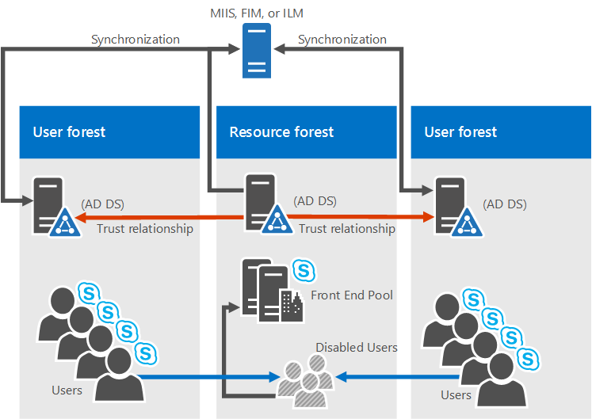

# Environmental requirements for Skype for Business Server 2015
 
**Résumé :** Configurer votre serveur non des Skype pour Business Server 2015. Il existe plusieurs choses que vous souhaiterez configuré avant de procéder à votre déploiement, notamment Active Directory, DNS, des certificats et partages.
  
Qu’est une spécification de l’environnement pour Skype pour Business Server 2015 ? Eh bien, nous avons créé tout ce qui n’est pas directement liées dans cette rubrique, afin que vous n’avez à faire en tant que mesure en cliquant sur autour. Si vous recherchez des conditions préalables du serveur, vous pouvez extraire la [configuration serveur requise pour Skype pour Business Server 2015](server-requirements.md) doc la[Planification du réseau](../../plan-your-deployment/network-requirements/network-requirements.md) est également documenté séparément. Sinon, c’est ce que nous avons dans cet article :
  
- [Active Directory](environmental-requirements.md#AD)
  
- [Domain Name System (DNS)](environmental-requirements.md#DNS)
  
- [Certificats](environmental-requirements.md#Certs)
  
- [Partage de fichiers](environmental-requirements.md#Fileshare)
  
## Active Directory

Pendant un grand nombre de données de configuration pour les serveurs et services est stocké dans Skype pour le magasin Central de gestion de 2015 Business Server, il existe certaines choses encore stockées dans Active Directory :
  
|**Objets Active Directory**|**Types d’objets**|
|:-----|:-----|
|Extensions de schéma    |Extensions de l’objet utilisateur    |
||Extensions pour Lync Server 2013 et Lync Server 2010, pour conserver la compatibilité descendante avec les précédentes versions prises en charge.    |
|Données    |URI SIP de l’utilisateur et autres paramètres utilisateur    |
||Objets contact pour les applications (telles que l’application Response Group et l’application intendant Conférence).    |
||Données publiées pour la compatibilité descendante    |
||Un service point de contrôle (SCP) pour le magasin Central de gestion.    |
||Compte d’authentification Kerberos (un objet ordinateur facultatif)    |
   
### Système d’exploitation pour les contrôleurs de domaine

Quel système d’exploitation de contrôleur de domaine faut-il alors utiliser ? Nous avons la liste suivante :
  
- Windows Server 2016
    
- Windows Server 2012 R2
    
- Windows Server 2012
    
- Windows Server 2008 R2
    
- Windows Server 2008
    
À présent, le niveau fonctionnel du domaine de n’importe quel domaine que vous déployez Skype pour Business Server 2015 dans et le niveau fonctionnel de forêt de n’importe quelle forêt que vous déployez Skype pour Business Server 2015, doivent être une des options suivantes :
  
- Windows Server 2016
    
- Windows Server 2012 R2
    
- Windows Server 2012
    
- Windows Server 2008 R2
    
- Windows Server 2008
    
- Windows Server 2003
    
Pouvez-vous avoir des contrôleurs de domaine en lecture seule dans ces environnements ? Bien sûr, dans la mesure où un contrôleur de domaine accessible en écriture est disponible.
  
À présent, il est important de savoir que Skype pour Business Server 2015 ne prennent en charge une seule partie des domaines. Que sont-ils ? Si vous avez un domaine racine intitulé contoso.local, qui va être précise. Si vous avez un domaine racine nommé simplement local, qui est incorrect, et n’est pas accepté par conséquent. Un peu plus à ce sujet a été écrit [dans cet article de la Base de connaissances](https://support.microsoft.com/kb/300684/en-us).
  
Skype pour Business Server 2015 également ne prend en charge les domaines du changement de nom. Si vous avez vraiment pour ce faire, puis vous aurez besoin pour désinstaller Skype pour Business Server 2015, effectuez le changement de nom de domaine, puis réinstaller Skype pour Business Server 2015.
  
Enfin, vous pouvez être confronté à un domaine avec un environnement de domaine Active Directory verrouillé, et qui convient. Nous avons plus d’informations sur la façon de déployer Skype pour Business Server 2015 dans ce type d’environnement dans la documentation de déploiement.
  
### Topologies AD

Skype pour les topologies prises en charge de 2015 Business Server sont les suivants :
  
- Forêt unique avec domaine unique
    
- Forêt unique avec un arbre unique et plusieurs domaines
    
- Forêt unique avec plusieurs arbres et des espaces de noms disjoints
    
- Plusieurs forêts dans une topologie de forêt centrale
    
- Plusieurs forêts dans une topologie de forêt de ressources
    
- Plusieurs forêts d’une topologie de forêts de ressources Skype Entreprise avec Exchange Online
    
- Plusieurs forêts dans une topologie de forêt de ressources Skype Entreprise Online et Azure Active Directory Connect
    
Nous disposons des diagrammes et des descriptions pour vous aider à déterminer quelle topologie que vous avez dans votre environnement, ou que vous devrez peut-être configurer avant d’installer Skype pour Business Server 2015. Pour plus de simplicité, nous incluons une clé :
  

  
#### Forêt unique avec domaine unique

  
Il n’obtient pas plus simple, il s’agit d’une forêt de domaine unique, il s’agit d’une topologie courante.
  
#### Forêt unique avec un arbre unique et plusieurs domaines

  
Ce diagramme illustre de nouveau une forêt unique, mais elle a un ou plusieurs domaines enfants aussi (il en existe trois dans cet exemple spécifique). Le domaine que les utilisateurs sont créés dans peut être différent du domaine Skype pour Business Server 2015 est déployé. Est-ce problématique ? Il est important de noter que lorsque vous déployez un Skype pour Business Server un pool frontal, tous les serveurs de ce pool doivent se trouver dans un seul domaine. Vous pouvez avoir administration inter-domaines via Skype pour la prise en charge du serveur d’entreprise des groupes d’administrateurs universels Windows.
  
Sur le schéma ci-dessus, vous pouvez voir que les utilisateurs d’un domaine sont en mesure d’accéder aux Skype pour les pools Business Server dans le même domaine ou dans des domaines différents, même si ces utilisateurs sont dans un domaine enfant.
  
#### Forêt unique avec plusieurs arbres et des espaces de noms disjoints

  
Il peut s’avérer que vous avez sélectionné une topologie semblable à ce diagramme où vous disposez d’une forêt, mais au sein de la forêt sont plusieurs domaines, avec des espaces de noms Active Directory distincts. Si tel est le cas, ce diagramme s une bonne illustration, comme nous disposons d’utilisateurs dans des domaines différents trois accès à Skype pour Business Server 2015. Traits continus indiquent qu’ils accédez à un Skype pour le pool de serveurs de l’entreprise dans leur propre domaine, tandis qu’une ligne en pointillés indique ils vont entièrement à un pool dans un arbre différent.
  
Comme vous pouvez le voir, les utilisateurs dans le même domaine, la même arborescence ou même dans une arborescence différente sont en mesure d’accéder aux pools avec succès.
  
#### Plusieurs forêts dans une topologie de forêt centrale

  
Skype pour Business Server 2015 ne prend en charge plusieurs forêts configurées dans une topologie à forêt centrale. Si vous n’êtes pas certain c’est ce que vous devez, la topologie de la forêt centrale utilise des objets dans ce pour représenter des utilisateurs dans les autres forêts et les comptes d’utilisateur hôtes pour tous les utilisateurs de la forêt.
  
Comment cela fonctionne-t-il ? Eh bien, un produit de synchronisation d’annuaires (tels que Forefront Identity Manager ou FIM) gère les comptes d’utilisateurs de votre organisation tout au long de leur existence. Lorsqu’un compte est créé ou supprimé d’une forêt, ce changement est synchronisé avec le contact correspondant dans la forêt centrale.
  
De toute évidence, si votre infrastructure Active Directory est place déplacement vers cette topologie peuvent ne pas être facile, mais si vous êtes déjà y, ou encore planification votre infrastructure de la forêt, il peut être un choix judicieux. Vous pouvez centraliser votre Skype pour le déploiement d’entreprise Server 2015 dans une forêt unique, alors que les utilisateurs peuvent rechercher, communiquer et afficher la présence des autres utilisateurs dans n’importe quelle forêt. Toutes les mises à jour des contacts utilisateur sont gérées automatiquement à l’aide du logiciel de synchronisation.
  
#### Plusieurs forêts dans une topologie de forêt de ressources Skype Entreprise

  
Une topologie de forêt de ressources est également pris en charge ; Il est où une forêt est consacrée à l’exécution de vos applications serveur, telles que Microsoft Exchange Server et Skype pour Business Server 2015. Cette forêt de ressources héberge également une représentation synchronisée des objets d’utilisateurs actifs, mais aucun compte utilisateur à connexion activée. La forêt de ressources est donc un environnement de services partagés pour les autres forêts dans lesquelles les objets utilisateur résident et ceux-ci ont une relation de confiance au niveau de la forêt avec la forêt de ressources.
  
Notez que Exchange Server peuvent être déployé dans la même forêt de ressources que Skype pour Business Server ou dans une forêt différente.
  
Pour déployer Skype pour Business Server 2015 dans ce type de topologie, vous devez créer un objet utilisateur désactivé dans la forêt de ressources pour chaque compte d’utilisateur dans les forêts d’utilisateurs (si Microsoft Exchange Server est déjà dans l’environnement, il peut être fait pour vous). Vous devrez alors un outil de synchronisation d’annuaires (tels que Forefront Identity Manager ou FIM) pour gérer les comptes d’utilisateurs par le biais de leur cycle de vie.
  
#### Plusieurs forêts d’une topologie de forêts de ressources Skype Entreprise avec Exchange Online

Cette topologie est similaire à celle décrite dans la rubrique [Plusieurs forêts d’une topologie de forêts de ressources Skype Entreprise avec Exchange Online](environmental-requirements.md#BKMK_multipleforestopology).
  
Dans cette topologie, il existe un ou plusieurs forêts d’utilisateurs, et Skype pour Business Server est déployé dans une forêt de ressources dédié. Exchange Server peut être déployé localement dans la même forêt de ressources ou d’une autre forêt et configuré pour l’environnement hybride avec Exchange Online ou les services de messagerie peuvent être fournis en mode exclusif par Exchange Online pour les comptes locaux. Aucun diagramme n’est disponible pour cette topologie.
  
#### Plusieurs forêts dans une topologie de forêt de ressources Skype Entreprise Online et Azure Active Directory Connect

  
Dans ce scénario, il existe plusieurs forêts sur site avec une topologie de forêt de ressources. Il existe une relation d’approbation totale entre les forêts Active Directory. L’outil Azure Active Directory Connect est utilisé pour synchroniser des comptes entre les forêts d’utilisateurs sur site et Office 365.
  
 L’organisation a Office 365 et utilise [Azure Active Directory se connecter](https://go.microsoft.com/fwlink/p/?LinkId=614836) pour synchroniser leurs comptes locaux avec Office 365. Les utilisateurs activés pour Skype pour les entreprises sont activées via Office 365 et Skype pour Business en ligne. Skype pour Business Server n’est pas déployés en local.
  
Ouverture de session d’authentification unique est fournie par une batterie de serveurs Active Directory Federation Services situé dans la forêt de l’utilisateur.
  
Dans ce scénario, il est pris en charge pour déployer Exchange local, Exchange Online, une solution Exchange hybride, ou de ne pas du tout de déploiement d’Exchange. (Le schéma présente uniquement Exchange en local, mais les autres solutions Exchange sont entièrement prises en charge.)
  
#### Plusieurs forêts dans une topologie de forêt de ressources et un déploiement hybride de Skype Entreprise 

Dans ce scénario, il existe un ou plusieurs locaux forêts d’utilisateurs et Skype pour les entreprises est déployé dans une forêt de ressources dédiées et est configuré pour le mode hybride avec Skype pour Business Online. Exchange Server peut être déployé localement dans la même forêt de ressources ou d’une autre forêt et peut être configuré pour l’environnement hybride avec Exchange Online. Vous pouvez également des services de messagerie peuvent être fournis exclusivement par Exchange Online pour les comptes locaux.
  
Pour plus d’informations, consultez [configurer un environnement à forêts multiples pour un environnement hybride Skype pour les entreprises](../../skype-for-business-hybrid-solutions/deploy-hybrid-connectivity/configure-a-multi-forest-environment-for-hybrid.md).
  
## Domain Name System (DNS)

Skype pour Business Server 2015 nécessite le système DNS, pour les raisons suivantes :
  
- DNS permet de Skype pour Business Server 2015 découvrir les serveurs internes ou des pools, autorisant les communications de serveur à serveur.
    
- DNS permet aux clients de machines à détecter le pool frontal ou un serveur Standard Edition server utilisé pour les transactions SIP.
    
- Il associe des URL simples pour des conférences avec les serveurs hébergeant ces conférences.
    
- DNS permet aux utilisateurs externes et les ordinateurs clients pour se connecter à vos serveurs de périphérie, ou le proxy inverse HTTP, pour la messagerie instantanée (IM) ou de conférence.
    
- Il vous permet de communications unifiées (UC) périphériques qui ne sont pas connectés de détecter le pool frontal ou un serveur Standard Edition server qui exécute le service web de mise à jour de périphérique pour obtenir des mises à jour et envoyer des journaux.
    
- L’utilisation de DNS permet aux clients mobiles de découvrir automatiquement les ressources de services web sans que les utilisateurs aient besoin d’entrer manuellement les URL dans les paramètres des appareils.
    
- De plus, DNS utilise l’équilibrage de charges.
    
Il est important de noter que Skype pour Business Server 2015 ne prennent en charge les noms de domaine internationaux (IDN).
  
Et il est très important de n’oubliez pas que n’importe quel nom dans le système DNS est identique au nom d’ordinateur configuré sur n’importe quel serveur utilisé par Skype pour Business Server 2015. Plus précisément, nous ne peut pas avoir des noms de short dans l’environnement et doit avoir des noms de domaine complets pour le Générateur de topologie.
  
Cela semble qu’il serait logique pour n’importe quel ordinateur déjà relié à un domaine, mais si vous avez un serveur Edge qui n’est pas lié à votre domaine, elle peut avoir un nom court, avec aucun suffixe de domaine par défaut. Assurez-vous que qui n’est pas le cas, dans le système DNS ou sur le serveur de périphérie, ou n’importe quel Skype pour Business Server 2015 serveur ou pool, dans notre exemple.
  
Et sans aucun doute n’utilisez pas les caractères Unicode ni trait de soulignement. Des caractères standard (qui sont A-Z, a-z, 0-9 et tirets) sont ceux qui est sur le point d’être pris en charge par les DNS externes et les autorités de certification publique (vous devez attribuer des noms de domaine complets pour le nom de service dans le certificat, n’oubliez pas), de sorte que vous aurez de rechange vous-même beaucoup de démo si nom cela à l’esprit.
  
Pour en savoir plus sur les exigences du DNS pour le réseau, consultez la section [Networking](../../plan-your-deployment/network-requirements/network-requirements.md) de notre documentation consacrée à la planification.
  
## Certificats

L’une des tâches les plus importantes à effectuer avant le déploiement est de vérifier que les certificats sont en ordre. Skype pour Business Server 2015 a besoin d’une infrastructure à clé publique (PKI) pour le transport layer security (TLS) et les connexions mutual transport layer security (MTLS). En fait, pour sécuriser les communications d’une manière standardisée, Skype pour Business Server utilise des certificats émis par des autorités de certification (CA).
  
Voici certaines des choses que Skype pour Business Server 2015 utilise des certificats pour :
  
- Connexions TLS entre clients et serveurs
    
- Connexions MTLS entre serveurs
    
- Fédération utilisant la découverte automatique de partenaires via le DNS
    
- Accès des utilisateurs distants à la messagerie instantanée
    
- Accès des utilisateurs externes aux sessions audio/vidéo (AV), au partage d’application et aux conférences
    
- En train de parler à Outlook Web Access (OWA) et les applications web
    
Ainsi, la planification de certificat s doit. À présent, examinons une liste de certaines des choses que vous devez garder à l’esprit lors de la demande de certificats :
  
- Tous les certificats de serveur doivent prendre en charge l’autorisation serveur (utilisation améliorée de la clé du serveur).
    
- Tous les certificats de serveur doivent contenir un point de distribution de liste de révocation de certificats (CDP).
    
- Tous les certificats doivent être signés à l’aide de l’algorithme de signature pris en charge par le système d’exploitation. Skype pour Business Server 2015 prend en charge le SHA-1 et SHA-2 suite du résumé dimensionne (224, 256, 384 et 512 bits) et est conforme ou dépasse la configuration système d’exploitation requise.
    
- L’inscription automatique est prise en charge pour les serveurs internes exécutant Skype pour Business Server 2015.
    
- L’inscription automatique n’est pas pris en charge pour Skype pour les serveurs de périphérie Business Server 2015.
    
- Lorsque vous envoyez une demande de certificat web à une autorité de certification Windows Server 2003, vous devez l’envoyer à partir d’un ordinateur exécutant Windows Server 2003 avec SP2 ou Windows XP.
    
> [!NOTE]
> Bien que l’article de la Base de connaissances Microsoft KB922706 indique comment résoudre les problèmes relatifs à l’inscription de certificats web lors d’une inscription auprès des services de certificat Windows Server 2003, il n’est pas possible d’utiliser Windows Server 2008, Windows Vista ou Windows 7 pour demander un certificat auprès d’une autorité de certification Windows Server 2003. 
  
> [!NOTE]
> L’algorithme de signature RSASSA-PSS n’est pas pris en charge et peut entraîner entre autres des erreurs de connexion et de transfert d’appels.  
  
- Les longueurs de clé de chiffrement 1024, 2048 et 4096 sont prises en charge. Les longueurs de clé supérieures ou égales à 2048 sont recommandées.
    
- L’algorithme digest, ou de signature de hachage, par défaut est RSA. Les algorithmes ECDH_P256, ECDH_P384 et ECDH_P521 sont également pris en charge.
    
C’est un lot à prendre en compte et sans aucun doute, il existe différents niveaux de confort à demander des certificats à partir d’une autorité de certification. Nous vous donnerons des indications supplémentaires ci-dessous pour rendre votre planification aussi simple que possible.
  
### Certificats pour vos serveurs internes

Vous aurez besoin des certificats pour la plupart de vos serveurs internes, et le plus souvent, vous obtenez les à partir d’une autorité de certification interne (qui est situé dans votre domaine). Le cas échéant, vous pouvez demander ces certificats à une autorité de certification externe (située sur Internet). Si vous vous demandez quels autorité de certification publique vous devez atteindre, vous pouvez extraire la liste des [partenaires de certificat de Communications unifiées](https://support.microsoft.com/kb/929395/en-us) .
  
Vous aurez également besoin des certificats lorsque Skype pour Business Server 2015 communique avec les autres applications et serveurs, telle que Microsoft Exchange Server. Ce certificat doit bien entendu être un certificat que ces autres applications et serveurs peuvent utiliser en mode de prise en charge. Skype pour Business Server 2015 et d’autres produits Microsoft prend en charge le protocole Open Authorization (OAuth) pour l’autorisation et authentification de serveur à serveur. Si vous êtes intéressé par cela, nous avons un article de planification supplémentaire pour OAuth et Skype Business Server 2015.
  
Skype pour Business Server 2015 prend également en charge (sans nécessiter) certificats signés à l’aide de la fonction de hachage cryptographique SHA-256. Pour favoriser l’accès externe à l’aide de SHA-256, le certificat externe doit être émis par une autorité de certification publique utilisant SHA-256.
  
Pour essayer de conserver une simple, nous avons créé les certificats requis pour les serveurs Standard Edition Server, pools frontaux et d’autres rôles, dans les tableaux suivants, avec le contoso.com fictive utilisée pour obtenir des exemples (probablement à utiliser quelque chose un autre emplacement pour votre environnement). Il s’agit de tous les certificats de serveur web standard, avec des clés privées qui ne sont pas exportables. Quelques points supplémentaires à noter :
  
- L’utilisation améliorée de la clé (EKU) pour l’authentification des serveurs est automatiquement configurée lorsque vous utilisez l’Assistant Certificat pour demander des certificats.
    
- Le nom convivial de chaque certificat doit être unique dans le magasin de l’ordinateur.
    
- Selon les exemples de noms ci-dessous, si vous avez configuré sipinternal.contoso.com ou sipexternal.contoso.com dans votre DNS, ils doivent être ajoutés à l’autorité Subject Alternative nom (SAN).
    
Certificats pour les serveurs Standard Edition Server :
  
|**Certificat**|**Nom du sujet/Nom courant**|**Autre nom du sujet**|**Exemple**|**Commentaires**|
|:-----|:-----|:-----|:-----|:-----|
|Par défaut    |Nom de domaine complet du pool    |Nom de domaine complet du pool et nom de domaine complet du serveur.    Si vous disposez de plusieurs domaines SIP et avez activé la configuration automatique des clients, l’Assistant Certificat détecte et ajoute le nom complet de chaque domaine SIP pris en charge.    Si ce pool est le serveur d’ouverture de session automatique pour les clients et si la correspondance DNS (Domain Name System) stricte est requise dans la stratégie de groupe, vous avez également besoin d’entrées pour sip.sipdomain (pour chacun des domaines SIP dont vous disposez).    |SN=se01.contoso.com; SAN=se01.contoso.com    Si ce pool est le serveur d’ouverture de session automatique pour les clients et si la correspondance DNS stricte est requise dans la stratégie de groupe, SAN=sip.contoso.com et SAN=sip.fabrikam.com sont également nécessaires.    |Sur le serveur Standard Edition serveurs Standard Edition server, le nom de domaine complet du serveur est le même que le nom de domaine complet du pool.    L’Assistant détecte les domaines SIP indiqués lors de l’installation et les ajoute automatiquement à l’autre nom du sujet.    Vous pouvez aussi utiliser ce certificat pour l’authentification de serveur à serveur.    |
|Web interne    |Nom de domaine complet du serveur    |Pour chaque élément suivant :    Web interne • nom de domaine complet (qui est le même que le nom de domaine complet du serveur)    ET    • Les URL simples meet    • Rendez-vous des URL simples    • D’administration simples    OU    • Une entrée de caractère générique pour les URL simples    |SN=se01.contoso.com; SAN=se01.contoso.com; SAN=meet.contoso.com; SAN=meet.fabrikam.com; SAN=dialin.contoso.com; SAN=admin.contoso.com    Utilisation d’un certificat de caractère générique :    SN=se01.contoso.com ; SAN=se01.contoso.com ; SAN =\*. contoso.com    |Vous ne pouvez pas remplacer le nom de domaine complet dans le Générateur de topologie de site web interne.    Si vous disposez de plusieurs URL simples de réunion, vous devez les inclure toutes en tant qu’autres noms du sujet (SAN).    Les entrées de caractères génériques sont prises en charge pour les entrées d’URL simples.    |
|Web externe    |Nom de domaine complet du serveur    |Pour chaque élément suivant :    • Domaine complet web externe    ET    • Rendez-vous des URL simples    • Les URL simples meet par domaine SIP    OU    • Une entrée de caractère générique pour les URL simples    |SN=se01.contoso.com; SAN=webcon01.contoso.com; SAN=meet.contoso.com; SAN=meet.fabrikam.com; SAN=dialin.contoso.com    Utilisation d’un certificat de caractère générique :    SN=se01.contoso.com ; SAN=webcon01.contoso.com ; SAN =\*. contoso.com    |Si vous avez plusieurs URL simples Meet, vous devez inclure tous les noms de sujet.    Les entrées de caractères génériques sont prises en charge pour les entrées d’URL simples.    |
   
Certificats pour les serveurs frontaux dans un pool frontal :
  
|**Certificat**|**Nom du sujet/Nom courant**|**Autre nom du sujet**|**Exemple**|**Commentaires**|
|:-----|:-----|:-----|:-----|:-----|
|Par défaut    |Nom de domaine complet du pool    |Nom de domaine complet du pool et nom de domaine complet du serveur.    Si vous disposez de plusieurs domaines SIP et avez activé la configuration automatique des clients, l’Assistant Certificat détecte et ajoute le nom complet de chaque domaine SIP pris en charge.    Si ce pool est le serveur d’ouverture de session automatique pour les clients et si la correspondance DNS (Domain Name System) stricte est requise dans la stratégie de groupe, vous avez également besoin d’entrées pour sip.sipdomain (pour chacun des domaines SIP dont vous disposez).    |SN=eepool.contoso.com; SAN=eepool.contoso.com; SAN=ee01.contoso.com     Si ce pool est le serveur d’ouverture de session automatique pour les clients et si la correspondance DNS stricte est requise dans la stratégie de groupe, SAN=sip.contoso.com et SAN=sip.fabrikam.com sont également nécessaires.    |L’Assistant détecte les domaines SIP indiqués lors de l’installation et les ajoute automatiquement à l’autre nom du sujet.    Vous pouvez aussi utiliser ce certificat pour l’authentification de serveur à serveur.    |
|Web interne    |Nom de domaine complet du pool    |Pour chaque élément suivant :    Web interne • nom de domaine complet (qui n’est pas le même que le nom de domaine complet du serveur)    • FQDN du serveur    • Skype pour le pool d’entreprise nom de domaine complet    ET    • Les URL simples meet    • Rendez-vous des URL simples    • D’administration simples    OU    • Une entrée de caractère générique pour les URL simples    |SN=ee01.contoso.com; SAN=ee01.contoso.com; SAN=meet.contoso.com; SAN=meet.fabrikam.com; SAN=dialin.contoso.com; SAN=admin.contoso.com    Utilisation d’un certificat de caractère générique :    SN=ee01.contoso.com ; SAN=ee01.contoso.com ; SAN =\*. contoso.com    |Si vous avez plusieurs URL simples Meet, vous devez inclure tous les noms de sujet.    Les entrées de caractères génériques sont prises en charge pour les entrées d’URL simples.    |
|Web externe    |Nom de domaine complet du pool    |Pour chaque élément suivant :    • Domaine complet web externe    ET    • Rendez-vous des URL simples    • D’administration simples    OU    • Une entrée de caractère générique pour les URL simples    |SN=ee01.contoso.com; SAN=webcon01.contoso.com; SAN=meet.contoso.com; SAN=meet.fabrikam.com; SAN=dialin.contoso.com    Utilisation d’un certificat de caractère générique :    SN=ee01.contoso.com ; SAN=webcon01.contoso.com ; SAN =\*. contoso.com    |Si vous avez plusieurs URL simples Meet, vous devez inclure tous les noms de sujet.    Les entrées de caractères génériques sont prises en charge pour les entrées d’URL simples.    |
   
Certificats pour le directeur :
  
|**Certificat**|**Nom du sujet/Nom courant**|**Autre nom du sujet**|**Exemple**|
|:-----|:-----|:-----|:-----|
|Par défaut    |pool de directeurs    |Nom de domaine complet du directeur, nom de domaine complet du pool directeur.    Si ce pool est le serveur d’ouverture de session automatique pour les clients et la correspondance DNS stricte requise dans la stratégie de groupe, vous aurez également besoin des entrées pour sip.sipdomain (pour chaque domaine SIP que vous avez).    |pool.contoso.com; SAN=dir01.contoso.com     Si ce pool directeur est le serveur d’ouverture de session automatique pour les clients et la correspondance DNS stricte est requise dans la stratégie de groupe, également nécessaires ; SAN=SIP.fabrikam.com    |
|Web interne    |Nom de domaine complet du serveur    |Pour chaque élément suivant :    Web interne • nom de domaine complet (qui est le même que le nom de domaine complet du serveur)    • FQDN du serveur    • Skype pour le pool d’entreprise nom de domaine complet    ET    • Les URL simples meet    • Rendez-vous des URL simples    • D’administration simples    OU    • Une entrée de caractère générique pour les URL simples    |SN=dir01.contoso.com; SAN=dir01.contoso.com; SAN=meet.contoso.com; SAN=meet.fabrikam.com; SAN=dialin.contoso.com; SAN=admin.contoso.com    Utilisation d’un certificat de caractère générique :    SN=dir01.contoso.com ; SAN=dir01.contoso.com SAN =\*. contoso.com    |
|Web externe    |Nom de domaine complet du serveur    |Pour chaque élément suivant :    • Domaine complet web externe    ET    • Les URL simples meet par domaine SIP    • Rendez-vous des URL simples    OU    • Une entrée de caractère générique pour les URL simples    |Le nom de domaine complet du directeur externe web doit être différent à partir du pool frontal ou un serveur frontal.    SN=dir01.contoso.com; SAN=directorwebcon01.contoso.com SAN=meet.contoso.com; SAN=meet.fabrikam.com; SAN=dialin.contoso.com    Utilisation d’un certificat de caractère générique :    SN=dir01.contoso.com ; SAN=directorwebcon01.contoso.com SAN =\*. contoso.com    |
   
Certificats pour le serveur de médiation autonome :
  
|**Certificat**|**Nom du sujet/Nom courant**|**Autre nom du sujet**|**Exemple**|
|:-----|:-----|:-----|:-----|
|Par défaut    |Nom de domaine complet du pool    |Nom de domaine complet du pool    Nom de domaine complet du serveur membre du pool    |SN=medsvr-pool.contoso.net; SAN=medsvr-pool.contoso.net; SAN=medsvr01.contoso.net    |
   
Certificats pour les Survivable Branch Appliance :
  
|**Certificat**|**Nom du sujet/Nom courant**|**Autre nom du sujet**|**Exemple**|
|:-----|:-----|:-----|:-----|
|Par défaut    |Nom de domaine complet de l’appareil    |SIP. \<sipdomain\> (vous avez besoin qu’une seule entrée par domaine SIP)    |SN=sba01.contoso.net; SAN=sip.contoso.com; SAN=sip.fabrikam.com    |
   
### Certificats pour votre serveur de conversation permanente

Lors de l’installation de votre serveur de conversation permanente, vous aurez besoin d’un certificat émis par la même autorité de certification que celle utilisée par votre Skype pour les serveurs internes Business Server 2015. Cette opération doit être effectuée pour chaque serveur qui exécute le Persistent Chat des Services Web de téléchargement de fichier. Il est vivement recommandé d’avoir les certificats requis avant de commencer votre installation de conversation permanente, et si votre autorité de certification externe, encore plus (Cela peut prendre un peu de temps à émettre).
  
### Certificats pour l’accès des utilisateurs externes (Edge)

Skype pour Business Server 2015 prend en charge l’utilisation d’un **seul certificat public** interfaces externes des Edge de conférence web et accès plus A / service d’authentification V, qui est fourni par le biais du ou des serveurs Edge. L’interface interne Edge l'on utilise généralement un certificat privé émis par votre autorité de certification interne, mais si vous préférez, vous pouvez utiliser un certificat public pour cela, s’il s’agit d’une autorité de certification approuvée.
  
Votre proxy inverse (RP) utilise également un certificat public et chiffre la communication de votre RP aux clients et du RP aux serveurs internes via HTTP (ou plus précisément, TLS sur HTTP).
  
### Certificats pour la mobilité

Si vous déployez la mobilité et que vous êtes en charge la découverte automatique pour les clients mobiles, vous aurez besoin d’inclure certaines entrées de l’autre nom du sujet supplémentaires sur vos certificats pour prendre en charge les connexions sécurisées à partir des clients mobiles.
  
Quels certificats ? Vous aurez besoin de noms SAN pour la découverte automatique sur les certificats ici :
  
- pool de directeurs
    
- pool de serveurs frontaux
    
- Proxy inverse
    
Les spécificités sont répertoriées dans chaque tableau ci-dessous.
  
Maintenant, c’est là un peu de planification préalable est correcte, mais parfois vous avez déployé Skype pour Business Server 2015 sans ayant l’intention de déployer la mobilité, et qui s’affiche vers le bas de la ligne lorsque vous avez déjà des certificats dans votre environnement. Les relance par le biais d’une autorité de certification interne est généralement assez facile, mais avec des certificats publics à partir d’une autorité de certification publique, qui peut être un peu plus pricy.
  
Si c’est ce que vous cherchez à, et si vous disposez d’un grand nombre de domaines SIP (qui fera ajoute SAN plus onéreux), vous pouvez configurer votre serveur proxy inverse pour utiliser le protocole HTTP pour la demande initiale de Autodiscover Service, au lieu d’utiliser le protocole HTTPS (qui est la valeur par défaut configuration). La rubrique de planification de la mobilité contient plus d’informations à ce sujet.
  
Configuration requise du certificat pool directeur et le pool frontal :
  
|**Description**|**Entrée SAN**|
|:-----|:-----|
|URL du service de découverte automatique interne    |SAN = lyncdiscoverinternal. \<sipdomain\>    |
|URL du service de découverte automatique externe    |SAN = lyncdiscover. \<sipdomain\>    |
   
Vous pouvez également utiliser SAN =\*. \<sipdomain\>
  
Exigences relatives au certificat de proxy inverse (autorité de certification publique)
  
|**Description**|**Entrée SAN**|
|:-----|:-----|
|URL du service de découverte automatique externe    |SAN = lyncdiscover. \<sipdomain\>    |
   
Ce SAN doit être attribué au certificat qui est affecté à l’écouteur SSL sur votre proxy inverse.
  
> [!NOTE]
> Allez dans votre écouteur proxy inverse ont SAN pour votre URL de Services Web externes. Il peut s’agir SAN=skypewebextpool01.contoso.com et dirwebexternal.contoso.com, si vous avez déployé le directeur (qui est facultatif). 
  
## Partage de fichiers

Skype pour Business Server 2015 est en mesure d’utiliser le même partage de fichiers pour le stockage des fichiers. Gardez à l’esprit ce qui suit :
  
- Un partage de fichiers doit se trouver sur un stockage DAS (Direct Attached Storage) ou un réseau de stockage SAN (Storage Area Network), dont un système de fichiers distribués (DFS) et sur une solution RAID (Redundant Array Of Independent Disks) pour les magasins de fichiers. Pour plus d’informations sur DFS pour Windows Server 2012, consultez la rubrique [cette page DFS](https://technet.microsoft.com/en-us/library/jj127250.aspx).
    
- Nous vous recommandons d’un cluster partagé pour le partage de fichiers. Si vous utilisez, vous devez de cluster Windows Server 2012 ou Windows Server 2012 R2. Windows Server 2008 R2 est également acceptable. Pourquoi Windows le plus récent ? Les versions antérieures n’est peut-être pas les autorisations pour activer toutes les fonctionnalités. Vous pouvez utiliser l’administrateur de Cluster pour créer les partages de fichiers, et cet article de [la création de partages de fichiers sur un cluster de](https://support.microsoft.com/en-us/help/224967/how-to-create-file-shares-on-a-cluster) vous aider avec les détails.
    
> [!CAUTION] 
> Vous devez savoir que le dispositif de stockage réseau (NAS) ne prend pas en charge le partage de fichiers. Vous devez donc utiliser l’une des options proposées ci-après. 
  

