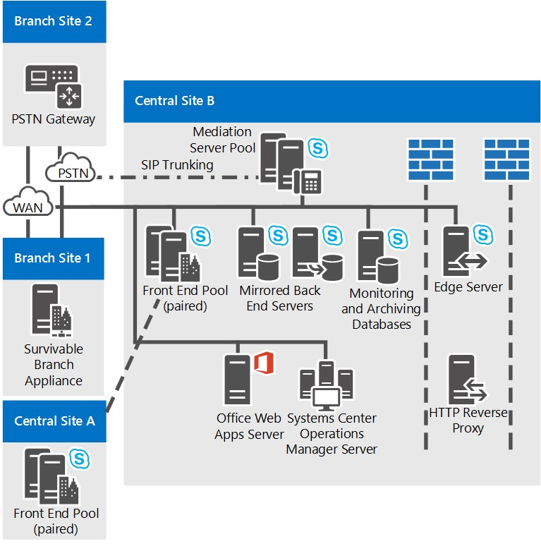

# Topologies de référence pour Skype Entreprise ServerReference topologies for Skype for Business Server

Topologies de référence pour Skype Entreprise Server, y compris les diagrammes et les décisions à prendre pour les grandes, moyennes et petites organisations.Reference topologies for Skype for Business Server, including diagrams and decisions to make for large, medium, and small organizations.

La meilleure topologie Skype Entreprise Server pour vous dépend de la taille de votre organisation, des charges de travail que vous souhaitez déployer et de vos préférences en matière de haute disponibilité et de coût d’investissement.The best Skype for Business Server topology for you depends on your organization's size, the workloads you want to deploy, and your preferences for high availability versus cost of investment.

Cette section décrit trois exemples de topologies de référence, y compris le raisonnement sous-fondé de nombreuses décisions prises en compte dans chaque topologie.This section outlines three sample reference topologies, including the reasoning behind many of the decisions that factored into each topology.

## Topologie de référence pour une petite organisationReference topology for a small organization

La topologie de référence pour les petites organisations montre comment déployer une solution robuste et hautement disponible en déployant uniquement trois serveurs exécutant Skype Entreprise Server.The reference topology for small organizations shows how you can deploy a robust, highly available solution by deploying only three servers running Skype for Business Server.

**Topologie de référence pour les petites organisations****Reference topology for small organizations**

- **Paire de serveurs Standard Edition Déployés** Cette organisation compte 4 000 utilisateurs sur son site central.**Pair of Standard Edition Servers Deployed** This organization has 4,000 users at their central site. Ils ont déployé deux serveurs Standard Edition Et les ont associés pour activer la haute disponibilité et la récupération d’urgence.They have deployed two Standard Edition servers and paired them together to enable high availability and disaster recovery. Chaque serveur a 2 000 utilisateurs, mais les informations sur tous les utilisateurs sont synchronisées entre les deux serveurs.Each server homes 2,000 users, but information about all users is synchronized between the two servers. En cas de panne, un administrateur peut faire échouer ces utilisateurs pour qu’ils soient servis par l’autre serveur, avec un minimum de perturbation pour les utilisateurs.If one goes down, an administrator can fail over those users to be served by the other server, with a minimum of disruption to users. Pour plus d’informations sur les fonctionnalités de haute disponibilité et de récupération d’urgence dans Skype Entreprise Server, voir [Plan for high availability and disaster recovery in Skype for Business Server](../../plan-your-deployment/high-availability-and-disaster-recovery/high-availability-and-disaster-recovery.md).For more information about high availability and disaster recovery features in Skype for Business Server, see [Plan for high availability and disaster recovery in Skype for Business Server](../../plan-your-deployment/high-availability-and-disaster-recovery/high-availability-and-disaster-recovery.md).

- **Le déploiement d’un serveur Edge est recommandé.****Edge Server deployment is recommended.** Bien qu’il ne soit pas nécessaire de déployer un serveur Edge pour la messagerie instantanée interne ainsi que pour les fonctionnalités de présence et de conférence, nous recommandons de le faire même pour des petits déploiements.Although deploying an Edge Server is not required for internal IM, presence and conferencing, we recommend it even for small deployments. Vous pouvez optimiser votre investissement Skype Entreprise Server en déployant un serveur Edge pour fournir un service aux utilisateurs actuellement en dehors des pare-feu de votre organisation.You can maximize your Skype for Business Server investment by deploying an Edge Server to provide service to users currently outside your organization's firewalls. Les avantages sont les suivants :The benefits include the following:

  - Les utilisateurs de votre organisation peuvent utiliser la fonctionnalité Skype Entreprise Server, s’ils travaillent à domicile ou sont en déplacement.Your organization's own users can use Skype for Business Server functionality, if they are working from home or are out on the road.

  - Les utilisateurs de votre organisation peuvent inviter des utilisateurs externes à participer à des réunions.Your users can invite outside users to participate in meetings.

  - Si vous avez un partenaire, un fournisseur ou une organisation cliente qui utilise également Skype Entreprise Server, vous pouvez créer une relation fédérée avec cette organisation.If you have a partner, vendor or customer organization that also uses Skype for Business Server, you can form a federated relationship with that organization. Votre déploiement Skype Entreprise Server reconnaîtra ensuite les utilisateurs de cette organisation fédérée, ce qui améliorerait la collaboration.Your Skype for Business Server deployment would then recognize users from that federated organization, leading to better collaboration.

  - Vos utilisateurs peuvent échanger des messages instantanés avec des utilisateurs de certains services de messagerie instantanée publics.Your users can exchange instant messages with users of some public IM services.

- **Survivabilité du site de succursale.****Branch site survivability.** Cette organisation exécute un programme pilote de la Voix Entreprise de Skype Entreprise Server.This organization is running a pilot program of the Enterprise Voice feature of Skype for Business Server. Certains utilisateurs utilisent Skype Entreprise Server comme seule solution vocale.Some users are using Skype for Business Server as their sole voice solution. Certains de ces utilisateurs Voix Entreprise pilotes se trouvent sur le site de succursale.Some of these Enterprise Voice pilot users are located at the branch site. Le site de succursale n’ayant pas de liaison réseau large (WAN) fiable au site central, un Survivable Branch Appliance y est déployé.The branch site does not have a reliable wide area network (WAN) link to the central site, so a Survivable Branch Appliance is deployed there. Avec ce déploiement, si la liaison wan est en panne, les utilisateurs du site de succursale peuvent toujours effectuer et recevoir des appels (appels au sein de l’organisation et appels PSTN), avoir des fonctionnalités de messagerie vocale et communiquer avec la messagerie instantanée à deux personnes.With this deployed, if the WAN link goes down, users at the branch site can still make and receive calls (both calls within the organization and PSTN calls), have voice mail functionality, and communicate with two-party instant messaging (IM). Les utilisateurs peuvent également être authentifiés lorsque la liaison WAN n’est plus disponible.Users can also be authenticated when the WAN link is unavailable as well. Pour plus d’informations, [voir Plan for Voix Entreprise resiliency in Skype for Business Server](../../plan-your-deployment/enterprise-voice-solution/enterprise-voice-resiliency.md).For more information, see [Plan for Enterprise Voice resiliency in Skype for Business Server](../../plan-your-deployment/enterprise-voice-solution/enterprise-voice-resiliency.md).

- **Déploiement de la messagerie unifiée Exchange****Exchange UM deployment.** Cette topologie de référence inclut un serveur de messagerie unifiée Exchange, qui s’exécute Microsoft Exchange Server, et non Skype Entreprise Server.This reference topology includes an Exchange Unified Messaging (UM) Server, which runs Microsoft Exchange Server, not Skype for Business Server.

- **Office Web Apps Server.****Office Web Apps Server.** Nous vous recommandons de déployer une batterie Office Web Apps Server ou Office Web Apps Server dans chaque organisation qui utilise la conférence web.We recommend deploying an Office Web Apps Server or Office Web Apps Server farm in every organization that uses web conferencing. Office Web Apps Server permet aux diapositives PowerPoint d’être présentées dans des conférences web.Office Web Apps Server makes it possible for PowerPoint slides to be presented in web conferences..

## Topologie de référence pour une organisation de taille moyenneReference topology for a medium organization

La topologie de référence avec haute disponibilité et centre de données unique est conçue pour une entreprise de taille petite ou moyenne dotée d’un site central.The reference topology with high availability and a single data center is designed for a small-to-medium size organization with one central site. La topologie exacte dans le diagramme suivant est pour une organisation de 20 000 utilisateurs.The exact topology in the following diagram is for an organization of 20,000 users.

**Topologie de référence pour les organisations de taille moyenne****Reference topology for medium organizations**

- **Augmentez le nombre d’utilisateurs pris en charge en ajoutant des serveurs frontaux supplémentaires.****Accommodate more users by adding more Front End Servers.** La topologie exacte de ce diagramme dispose de trois serveurs frontaux pour prendre en charge 20 000 utilisateurs.The exact topology in this diagram has three Front End Servers to provide support for 20,000 users. Si vous avez un site central unique et plus d’utilisateurs, vous pouvez simplement ajouter d’autres serveurs frontaux au pool.If you have a single central site and more users, you can simply add more Front End Servers to the pool. Le nombre maximal d’utilisateurs par pool est de 80 000, avec douze serveurs frontaux.The maximum number of users per pool is 80,000, with twelve Front End Servers.

    Néanmoins, la topologie sur site unique peut prendre en charge davantage d’utilisateurs en ajoutant un autre pool frontal au site.However, the single site topology can support even more users by adding another Front End pool to the site.

- **La récupération d’urgence peut être ajoutée.****Disaster Recovery could be added.** Pour cette organisation, la haute disponibilité de ses services Skype Entreprise Server est une fonctionnalité nécessaire, mais pas la récupération d’urgence.For this organization, high availability for their Skype for Business Server services is a necessary feature, but disaster recovery is not. Le pool de serveurs frontux qu’ils ont déployé fournit une haute disponibilité.The pool of Front End Servers they have deployed provides high availability.

    S’ils souhaitent ajouter une capacité de récupération d’urgence, ils peuvent envisager d’établir un autre centre de données et d’y ajouter un autre pool frontal et de le jumeler avec le pool frontal dans leur centre de données actuel.If they wanted to add disaster recovery ability, they could consider establishing another datacenter and adding another Front End pool there, and pairing it with the Front End pool in their current datacenter. Ensuite, en cas d’urgence affectant leur pool principal, les administrateurs peuvent faire échouer les utilisateurs vers le pool de sauvegarde.Then, if there was a disaster affecting their primary pool, the administrators could fail over users to the backup pool.

- **Les serveurs back end sont en miroir** Pour fournir une plus grande disponibilité pour les fonctionnalités utilisateur de base, l’organisation a déployé une paire de serveurs frontux en miroir pour chaque pool frontal.**Back End Servers are mirrored** To provide more high availability for basic user features, the organization has deployed a mirrored pair of Back End Servers for each Front End pool.

- **Options de base de données du serveur de surveillance.****Monitoring Server database options.** Cette organisation a déployé la surveillance pour garantir la qualité des appels Voix Entreprise et des conférences A/V.This organization has deployed Monitoring to ensure the quality of Enterprise Voice calls and A/V conferences. La surveillance est déployée sur chaque serveur frontal et la base de données de surveillance est coquetée avec les serveurs frontux.Monitoring is deployed on every Front End Server, and the Monitoring database is collocated with the Back End Servers. Nous prise en charge également les topologies dans lesquelles la base de données de surveillance se trouve sur un serveur distinct.We also support topologies in which the Monitoring database is located on a separate server.

- **Haute disponibilité du serveur Edge** Dans cet exemple d’organisation avec 20 000 utilisateurs, un seul serveur Edge serait suffisant pour les performances.**Edge Server high availability** In this example organization with 20,000 users, just one Edge Server would be sufficient for performance. Toutefois, ils ont déployé un pool de deux serveurs Edge déployés pour fournir une haute disponibilité.However, they have deployed a pool of two Edge Servers deployed to provide high availability.

- **Options de déploiement de site de succursale.****Branch site deployment options.** L’organisation dans cette topologie a Voix Entreprise déployée en tant que solution vocale.The organization in this topology has Enterprise Voice deployed as their voice solution. Le site de succursale 1 ne dispose pas d’une liaison DEN (Wide Area Network) résiliente au site central. Il dispose donc d’un Survivable Branch Appliance déployé pour gérer de nombreuses fonctionnalités Skype Entreprise Server en cas de panne de la liaison wan vers le site central.Branch Site 1 does not have a resilient wide area network (WAN) link to the central site, so it has a Survivable Branch Appliance deployed to maintain many Skype for Business Server features in case the WAN link to the central site goes down. Toutefois, le site de succursale 2 dispose d’une liaison réseau wan résiliente, de sorte que seule une passerelle PSTN (réseau téléphonique commuté) est nécessaire.Branch Site 2 however has a resilient WAN link, so only a public switched telephone network (PSTN) gateway is needed. La passerelle PSTN déployée ici prend en charge le contournement de média, de sorte qu’aucun serveur de médiation n’est nécessaire sur le site de succursale 2.The PSTN gateway deployed there supports media bypass, so no Mediation Server is needed at Branch Site 2. Pour plus d’informations, [voir Plan for Voix Entreprise resiliency in Skype for Business Server](../../plan-your-deployment/enterprise-voice-solution/enterprise-voice-resiliency.md).For more information, see [Plan for Enterprise Voice resiliency in Skype for Business Server](../../plan-your-deployment/enterprise-voice-solution/enterprise-voice-resiliency.md).

- **Équilibrage de la charge DNS.****DNS load balancing.** Le pool frontal et le pool de serveurs Edge ont un équilibrage de charge DNS pour le trafic SIP déployé.The Front End pool and Edge Server pool, have DNS load balancing for SIP traffic deployed. Cela vous évite de devoir recourir à des programmes d’équilibrage de la charge pour les serveurs Edge et cela réduit significativement la configuration et la maintenance des programmes d’équilibrage de la charge pour les autres pools, étant donné que les programmes d’équilibrage de la charge sont uniquement requis pour le trafic HTTP.This eliminates the need for hardware load balancers for the Edge Servers, and significantly lessens the setup and maintenance of the hardware load balancers for the other pools, as the hardware load balancers are needed only for HTTP traffic. Pour plus d’informations, voir [l’équilibrage de charge DNS.](../../plan-your-deployment/network-requirements/load-balancing.md#BKMK_DNSLoadBalancing)For more information, see [DNS load balancing](../../plan-your-deployment/network-requirements/load-balancing.md#BKMK_DNSLoadBalancing).

- **Déploiement de la messagerie unifiée Exchange****Exchange UM deployment.** Cette topologie de référence inclut un serveur de messagerie unifiée Exchange, qui s’exécute Microsoft Exchange Server, et non Skype Entreprise Server.This reference topology includes an Exchange Unified Messaging (UM) Server, which runs Microsoft Exchange Server, not Skype for Business Server.

- **Office Web Apps Server.****Office Web Apps Server.** Nous vous recommandons de déployer une batterie Office Web Apps Server ou Office Web Apps Server dans chaque organisation qui utilise la conférence web.We recommend deploying an Office Web Apps Server or Office Web Apps Server farm in every organization that uses web conferencing. Office Web Apps Server permet aux diapositives Powerpoint d’être présentées dans des conférences web.Office Web Apps Server makes it possible for Powerpoint slides to be presented in web conferences.

- **Les directeurs peuvent être ajoutés.****Directors could be added.** Si cette organisation souhaitait renforcer la sécurité contre les attaques par déni de service, elle pourrait également déployer un pool de directeurs.If this organization wanted to help to increase security against denial of service attacks, it could also deploy a pool of Directors. Un directeur est un rôle serveur distinct et facultatif dans Skype Entreprise Server qui ne prend pas en compte les comptes d’utilisateurs, ni ne fournit de services de présence ou de conférence.A Director is a separate, optional server role in Skype for Business Server that does not home user accounts, or provide presence or conferencing services. Il sert de serveur de saut suivant interne vers lequel un serveur Edge approvisionnement le trafic SIP entrant destiné aux serveurs internes.It serves as an internal next hop server to which an Edge Server routes inbound SIP traffic destined for internal servers. Le directeur authentifier préalablement les demandes entrantes et les redirige vers le pool ou le serveur d’accueil de l’utilisateur.The Director pre-authenticates inbound requests and redirects them to the user's home pool or server. La pré-authentification au niveau du directeur permet d’abandonner les demandes provenant de comptes d’utilisateurs inconnus du déploiement.Pre-authentication at the Director allows for dropping of requests from user accounts unknown to the deployment. Un directeur permet d’isoler les serveurs frontaux du trafic malveillant tel que les attaques par déni de service.A Director helps insulate Front End Servers from malicious traffic such as denial-of-service (DoS) attacks. Si le réseau est submergé par du trafic externe non valide dans une telle attaque, le trafic se termine au niveau du directeur.If the network is flooded with invalid external traffic in such an attack, the traffic ends at the Director.

- **System Center Operations Manager est recommandé.****System Center Operations Manager is recommended.** Nous vous recommandons de surveiller l’état de votre déploiement de Skype Entreprise Server pour garantir la disponibilité du service pour les utilisateurs finaux.We recommend that you monitor the health of your Skype for Business Server deployment to help ensure service availability for end-users. Vous pouvez utiliser le pack d’administration System Center Operations Manager pour Skype Entreprise disponible en téléchargement gratuit à partir de Microsoft.You can use the System Center Operations Manager Management Pack for Skype for Business that is available as a free download from Microsoft. Avec le pack d’administration Skype Entreprise, vous pouvez obtenir de manière proactive des alertes en temps réel lorsque des problèmes se produisent, exécuter des transactions synthétiques pour tester les fonctionnalités de Skype Entreprise de bout en bout, obtenir des rapports sur la disponibilité du service, etc.With the Skype for Business Management Pack, you can proactively get real-time alerts when issues occur, run synthetic transactions to test end-to-end Skype for Business functionality, get reports for service availability, and so on. Cela vous permet de répondre de manière proactive aux problèmes de votre déploiement avant que les utilisateurs finaux ne les utilisent.This helps you to proactively respond to issues with your deployment before end-users experience them.

## Topologie de référence pour une grande organisationReference topology for a large organization

La topologie de référence pour une grande organisation avec plusieurs centres de données est prise en charge pour n’importe quelle taille d’organisation avec plusieurs sites centraux.The reference topology for a large organization with multiple data centers support is for any size of organization with more than one central site. La topologie exacte dans le diagramme suivant est pour une organisation de 50 000 utilisateurs, avec 20 000 utilisateurs sur le site central A, 20 000 sur le site central B et un total de 10 000 sur le site central C et les sites de succursale.The exact topology in the following diagram is for an organization of 50,000 users, with 20,000 users at Central Site A, 20,000 at Central Site B. and a total of 10,000 at Central Site C and branch sites. Le type de topologie présenté dans ce diagramme peut prendre en charge les organisations avec n’importe quel nombre d’utilisateurs.The type of topology shown in this diagram can accommodate organizations with any number of users.

Outre la haute disponibilité fournie par les pools de serveurs frontux, cette topologie ajoute la prise en charge de la récupération d’urgence.In addition to the high availability provided by pools of Front End Servers, this topology adds disaster recovery support. Les pools frontux des sites centraux A et B sont associés.The Front End pools at Central Sites A and B are paired together. Si l’un de ces pools est en panne, l’administrateur peut déplacer les services des utilisateurs affectés vers le pool couplé sur le site non affecté.If one of these pools goes down, the administrator can shift the services for the affected users to the paired pool at the unaffected site.

Cette topologie est présentée dans plusieurs diagrammes, avec une vue d’ensemble tout d’abord suivie d’affichages détaillés des sites centraux.This topology is shown in multiple diagrams, with an overview first followed by detailed views of the central sites.

**Vue d’ensemble de la topologie de référence pour les grandes organisations avec plusieurs centres de données****Overview of the reference topology for large organizations with multiple data centers**

**Topologie de référence pour les grandes organisations : vue détaillée du site central A****Reference topology for large organizations: Detailed view of Central Site A**

**Topologie de référence pour les grandes organisations : vue détaillée du site central B****Reference topology for large organizations: Detailed view of Central Site B**

**Topologie de référence pour les grandes organisations : vue détaillée du site central C****Reference topology for large organizations: Detailed view of Central Site C**

- **Les pools frontux sont associés pour activer la récupération d’urgence.****Front End pools Are Paired to Enable Disaster Recovery.** Les pools frontux du site A et du site B sont associés les uns aux autres, pour assurer la prise en charge de la récupération d’urgence.The Front End pools at Site A and Site B are paired with each other, to provide disaster recovery support. Si le pool d’un site échoue, l’administrateur peut faire échouer les utilisateurs de ce site vers le pool frontal couplé sur l’autre site, avec un minimum d’interruption de service pour les utilisateurs.If the pool at one site fails, the administrator can fail over the users from that site to the paired Front End pool at the other site, with a minimum of service interruption for users. Chacun de ces deux pools frontaux dispose de six serveurs, ce qui est suffisant pour les 40 000 utilisateurs des deux pools en cas de failover.Each of these two Front End pools has six servers, which is enough for all 40,000 users in both pools in case of failover. Pour plus d’informations, voir [Planifier la haute disponibilité et la récupération d’urgence dans Skype Entreprise Server.](../../plan-your-deployment/high-availability-and-disaster-recovery/high-availability-and-disaster-recovery.md)For more information, see [Plan for high availability and disaster recovery in Skype for Business Server](../../plan-your-deployment/high-availability-and-disaster-recovery/high-availability-and-disaster-recovery.md).

- **Les serveurs back end sont en miroir** Pour fournir une plus grande disponibilité pour les fonctionnalités utilisateur de base, l’organisation a déployé une paire de serveurs frontux en miroir pour chaque pool frontal.**Back End Servers are mirrored** To provide more high availability for basic user features, the organization has deployed a mirrored pair of Back End Servers for each Front End pool. Il s’agit d’une topologie facultative et vous pouvez choisir de déployer un serveur principal unique à la place.This is an optional topology, and you could choose to deploy a single Back End Server instead. SQL clustering et les groupes de disponibilité AlwaysOn sont également pris en charge.SQL clustering and AlwaysOn Availability groups are also supported. Pour plus d’informations, voir La haute disponibilité du serveur [principal dans Skype Entreprise Server.](../../plan-your-deployment/high-availability-and-disaster-recovery/back-end-server.md)For more information, see [Back End Server high availability in Skype for Business Server](../../plan-your-deployment/high-availability-and-disaster-recovery/back-end-server.md).

- **Utilisation du serveur Standard Edition server sur un site de succursale.****Using Standard Edition server at a branch site.** Cette organisation considère le site C comme un site de succursale, car il ne compte que 600 employés.This organization considers Site C as a branch site because it has only 600 employees. Toutefois, les utilisateurs ont de nombreuses conférences A/V entre eux.However, the users there have many A/V conferences among themselves. S’il a été déployé dans Skype Entreprise Server en tant que site de succursale, les médias de ces conférences s’exécutent sur le réseau wan (WAN) à partir d’un site central où un serveur frontal est déployé.If it was deployed in Skype for Business Server as a branch site, the media for these conferences would run across the wide area network (WAN) to and from a central site that has a Front End Server deployed. Pour éviter cette charge potentielle de bande passante, ils ont installé deux serveurs Standard Edition sur ce site, qui hébergeront ces conférences.To avoid this potential bandwidth load, they have installed a pair of Standard Edition servers at this site, which will host these conferences. Dans la mesure où les serveurs Standard Edition sont installés à cet emplacement, Skype Entreprise Server considère par définition qu’il s’agit d’un site central et il est traité comme tel dans le Générateur de topologie et l’outil de planification.And because Standard Edition servers are installed there, Skype for Business Server by definition considers it a central site, and it is treated as such in Topology Builder and the Planning Tool.

    Un seul serveur Standard Edition serait suffisant pour les performances ici, mais l’organisation en a déployé deux et les a associés pour fournir une haute disponibilité en cas de panne d’un serveur.Just one Standard Edition server would be enough for performance here, but the organization has deployed two and paired them together to provide high availability in case one server goes down.

    Bien que le site C soit considéré comme un site central, vous n’avez pas besoin d’y déployer des serveurs Edge.Although Site C is considered a central site, you do not have to deploy Edge Servers there. Dans cet exemple, le site C utilise les serveurs Edge déployés sur le site A.In this example, Site C will use the Edge Servers deployed at Site A.

- **Surveillance et archivage** Cette organisation a déployé la surveillance et l’archivage.**Monitoring and Archiving** This organization has deployed both Monitoring and Archiving. Lorsque vous déployez la surveillance ou l’archivage, il s’exécute sur chaque serveur frontal.When you deploy Monitoring or Archiving, it runs on every Front End Server. Les bases de données de ces fonctionnalités peuvent être coclaquées avec la base de données principale ou situées sur un serveur distinct.The databases for these features can be collocated with the Back End Database, or located on a separate server. Cette organisation a localisé ces bases de données sur un serveur distinct des serveurs centraux, dans le site central B. Les bases de données reçoivent ici des données de surveillance et d’archivage des serveurs frontaux de tous les sites.This organization has located these databases on a server separate from the Back End Servers, in Central Site B. The databases here receive Monitoring and Archiving data from the Front End Servers in all sites.

- **Options de déploiement de site de succursale.****Branch site deployment options.** Cette organisation possède en fait plus de 50 sites de succursale, dont deux seulement sont affichés dans les diagrammes détaillés.This organization actually has over 50 branch sites, only two of which are shown in the detailed diagrams. Le site de succursale 1 n’a pas de liaison de réseau wan résilient vers le site central, de sorte que les Survivable Branch Appliances sont déployés pour fournir un service téléphonique en cas de panne de la liaison wan vers le site central.Branch Site 1 does not have a resilient WAN link to the central site, so they have Survivable Branch Appliances deployed to provide telephone service in case the WAN link to the central site goes down. Toutefois, le site de succursale 2 dispose d’une liaison réseau wan résiliente, de sorte qu’il n’a besoin que d’une passerelle PSTN (réseau téléphonique commuté).Branch Site 2 however has a resilient WAN link, so it needs only a public switched telephone network (PSTN) gateway. La passerelle PSTN déployée ici prend en charge le contournement de média, de sorte qu’aucun serveur de médiation n’est nécessaire sur le site de succursale 2.The PSTN gateway deployed there supports media bypass, so no Mediation Server is needed at Branch Site 2. Pour plus d’informations sur les choix d’installation sur un site de succursale, voir [Plan for Voix Entreprise resiliency in Skype for Business Server](../../plan-your-deployment/enterprise-voice-solution/enterprise-voice-resiliency.md).For details about deciding what to install at a branch site, see [Plan for Enterprise Voice resiliency in Skype for Business Server](../../plan-your-deployment/enterprise-voice-solution/enterprise-voice-resiliency.md).

- **Une trunking SIP et un serveur de médiation.****SIP trunking and Mediation Server.** Notez que sur le site central B, le serveur de médiation n’est pas coqueté avec les serveurs frontux.Notice that at Central Site B, Mediation Server is not collocated with the Front End Servers. Cela est dû au fait que le serveur de médiation autonome est recommandé pour les sites qui utilisent une trunking SIP.This is because stand-alone Mediation Server is recommended for sites that use SIP trunking. Dans la plupart des autres cas, nous vous recommandons de cocérer le serveur de médiation avec le serveur frontal.In most other instances, we recommend you collocate Mediation Server with Front End Server. Pour plus d’informations sur les topologies de serveur de médiation, voir [Components and Topologies for Mediation Server](https://technet.microsoft.com/library/71397168-36c3-4d21-b8ef-db6a751634ee.aspx) dans la documentation de planification.For details about Mediation Server topologies, see [Components and Topologies for Mediation Server](https://technet.microsoft.com/library/71397168-36c3-4d21-b8ef-db6a751634ee.aspx) in the Planning documentation.

- **La conversation permanente est déployée.****Persistent Chat is Deployed.** Cette organisation a déployé les serveurs nécessaires pour activer la conversation permanente.This organization has deployed the servers necessary to enable Persistent Chat. Il a déployé plusieurs serveurs frontaux de conversation permanente pour gérer la charge pour le nombre d’utilisateurs dans le pool et fournir la haute disponibilité.It has deployed multiple Persistent Chat Front End Servers to both handle the load for the number of users in the pool, and to provide high availability. Il a également déployé la conformité pour la conversation permanente et a localisé le magasin de conversation permanente et le magasin de conformité de conversation permanente sur des serveurs distincts.It has also deployed Compliance for Persistent Chat, and located the Persistent Chat Store and the Persistent Chat Compliance Store on separate servers. Ces magasins peuvent être cocifiés et peuvent même être cocérés avec le serveur principal, mais cette organisation a choisi de les séparer pour fournir de meilleures performances.These stores could be collocated, and can even be collocated with the Back End Server, but this organization has chosen to separate them to provide better performance.

    > [!NOTE]
    > La conversation permanente est disponible dans Skype Entreprise Server 2015, mais n’est plus prise en charge dans Skype Entreprise Server 2019.Persistent chat is available in Skype for Business Server 2015 but is no longer supported in Skype for Business Server 2019. La même fonctionnalité est disponible dans Teams.The same functionality is available in Teams. Pour plus d’informations, voir [La mise à niveau de Microsoft Teams.](/microsoftteams/upgrade-start-here)For more information, see [Getting started with your Microsoft Teams upgrade](/microsoftteams/upgrade-start-here). Si vous devez utiliser la conversation permanente, vous pouvez migrer les utilisateurs nécessitant cette fonctionnalité vers Teams ou continuer à utiliser Skype Entreprise Server 2015.If you need to use Persistent chat, your choices are to either migrate users requiring this functionality to Teams, or to continue using Skype for Business Server 2015.

- **Équilibrage de la charge DNS.****DNS load balancing.** Le pool frontal et le pool de serveurs Edge utilisent l’équilibrage de charge DNS.The Front End pool and Edge Server pool use DNS load balancing. Cela élimine la nécessité d’équilibrages de la charge matérielle pour l’interface interne des serveurs Edge et réduit considérablement le temps que vous devez consacrer à la configuration et à la maintenance des équilibreurs de la charge matérielle pour les autres pools, car les équilibreurs de charge matérielle sont nécessaires uniquement pour le trafic HTTP.This eliminates the need for hardware load balancers for the internal interface of the Edge Servers, and significantly decreases the amount of time you have to spend on the setup and maintenance of the hardware load balancers for the other pools, as the hardware load balancers are needed only for HTTP traffic. Pour plus d’informations, voir (.. /.. /plan-your-deployment/network-requirements/load-balancing.md#BKMK_DNSLoadBalancing).For more information, see (../../plan-your-deployment/network-requirements/load-balancing.md#BKMK_DNSLoadBalancing).

- **Déploiement de la messagerie unifiée Exchange****Exchange UM deployment.** Skype Entreprise Server fonctionne avec les déploiements locaux de la messagerie unifiée Exchange et la messagerie unifiée Exchange hébergée.Skype for Business Server works with both on-premises deployments of Exchange Unified Messaging (UM) and hosted Exchange UM. Le site central A inclut un serveur de messagerie unifiée Exchange, qui s’exécute Microsoft Exchange Server, et non Skype Entreprise Server.Central Site A includes an Exchange Unified Messaging (UM) Server, which runs Microsoft Exchange Server, not Skype for Business Server. La fonctionnalité de messagerie unie Exchange pour Skype Entreprise Server s’exécute sur le pool frontal.The Exchange UM functionality for Skype for Business Server runs on the Front End pool.

    Le site central B utilise Exchange hébergé, de sorte que la fonctionnalité serveur de messagerie unie Exchange est également hébergée.Central Site B uses hosted Exchange, so the Exchange UM Server functionality is also hosted.

    Pour plus d’informations sur la messagerie unifiée Exchange, voir Intégration de la messagerie unifiée [Exchange](https://technet.microsoft.com/library/e7c63a71-2d99-4aa9-b649-36c1a431bdf1.aspx) locale et Intégration de la messagerie unifiée [Exchange](https://technet.microsoft.com/library/f4de0165-da3b-499e-98fc-28ddd0db02d5.aspx) hébergée dans la documentation de planification.For details about Exchange UM, see [On-Premises Exchange Unified Messaging Integration](https://technet.microsoft.com/library/e7c63a71-2d99-4aa9-b649-36c1a431bdf1.aspx) and [Hosted Exchange Unified Messaging Integration](https://technet.microsoft.com/library/f4de0165-da3b-499e-98fc-28ddd0db02d5.aspx) in the Planning documentation.

- **Office Web Apps Server.****Office Web Apps Server.** Nous vous recommandons de déployer une batterie Office Web Apps Server ou Office Web Apps Server dans chaque organisation qui utilise la conférence web.We recommend deploying an Office Web Apps Server or Office Web Apps Server farm in every organization that uses web conferencing. Vous pouvez déployer une batterie Office Web Apps Server unique dans un site qui sert le trafic de tous les sites, ou la déployer dans chaque site.You could deploy a single Office Web Apps Server farm in one site which serves traffic from all sites, or deploy it in each site. Office Web Apps Server permet aux diapositives Powerpoint d’être présentées dans des conférences web.Office Web Apps Server makes it possible for Powerpoint slides to be presented in web conferences.

- **Les directeurs peuvent être ajoutés.****Directors could be added.** Si cette organisation souhaitait renforcer la sécurité contre les attaques par déni de service, elle pourrait également déployer un pool de directeurs.If this organization wanted to increase security against denial of service attacks, it could also deploy a pool of Directors. Un directeur est un rôle serveur distinct et facultatif dans Skype Entreprise Server qui ne prend pas en compte les comptes d’utilisateurs, ni ne fournit de services de présence ou de conférence.A Director is a separate, optional server role in Skype for Business Server that does not home user accounts, or provide presence or conferencing services. Il sert de serveur de saut suivant interne vers lequel un serveur Edge approvisionnement le trafic SIP entrant destiné aux serveurs internes.It serves as an internal next hop server to which an Edge Server routes inbound SIP traffic destined for internal servers. Le directeur authentifier préalablement les demandes entrantes et les redirige vers le pool ou le serveur d’accueil de l’utilisateur.The Director pre-authenticates inbound requests and redirects them to the user's home pool or server. La pré-authentification au niveau du directeur permet d’abandonner les demandes provenant de comptes d’utilisateurs inconnus du déploiement.Pre-authentication at the Director allows for dropping of requests from user accounts unknown to the deployment. Un directeur permet d’isoler les serveurs frontaux du trafic malveillant tel que les attaques par déni de service.A Director helps insulate Front End Servers from malicious traffic such as denial-of-service (DoS) attacks. Si le réseau est submergé par du trafic externe non valide dans une telle attaque, le trafic se termine au niveau du directeur.If the network is flooded with invalid external traffic in such an attack, the traffic ends at the Director.

- **System Center Operations Manager est recommandé.****System Center Operations Manager is recommended.** Nous vous recommandons de surveiller l’état de votre déploiement de Skype Entreprise Server pour garantir la disponibilité du service pour les utilisateurs finaux.We recommend that you monitor the health of your Skype for Business Server deployment to help ensure service availability for end-users. Vous pouvez utiliser le pack d’administration System Center Operations Manager pour Skype Entreprise disponible en téléchargement gratuit à partir de Microsoft.You can use the System Center Operations Manager Management Pack for Skype for Business that is available as a free download from Microsoft. Avec le pack d’administration Skype Entreprise, vous pouvez obtenir de manière proactive des alertes en temps réel lorsque des problèmes se produisent, exécuter des transactions synthétiques pour tester les fonctionnalités de Skype Entreprise de bout en bout, obtenir des rapports sur la disponibilité du service, etc.With the Skype for Business Management Pack, you can proactively get real-time alerts when issues occur, run synthetic transactions to test end-to-end Skype for Business functionality, get reports for service availability, and so on. Cela vous permet de répondre de manière proactive aux problèmes de votre déploiement avant que les utilisateurs finaux ne les utilisent.This helps you to proactively respond to issues with your deployment before end-users experience them.

