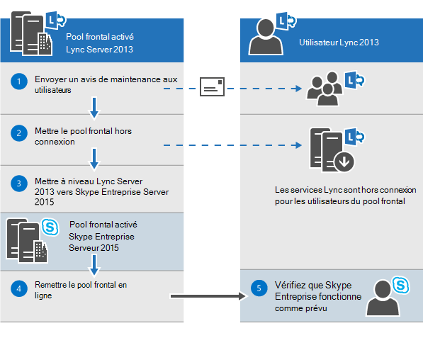
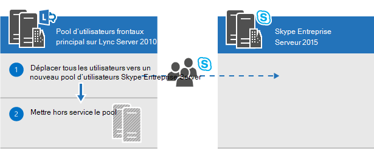
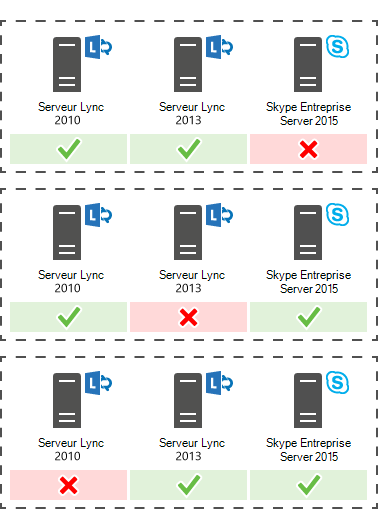

# Planifier la mise à niveau vers Skype Entreprise Server 2015
 
Résumé : Découvrez les éléments à prendre en compte lorsque vous planifiez une mise à niveau vers Skype Entreprise Server 2015. Téléchargez une version d’évaluation gratuite Skype Entreprise Server 2015 à partir du Centre d’évaluation Microsoft à [https://www.microsoft.com/evalcenter/evaluate-skype-for-business-server](https://www.microsoft.com/evalcenter/evaluate-skype-for-business-server) l':.
  
Dans le cadre de votre plan de mise à niveau vers Skype Entreprise Server 2015, utilisez cette rubrique pour comprendre les chemins de mise à niveau recommandés vers Skype Entreprise Server 2015, le fonctionnement de la mise à niveau In-Place, les scénarios de coexistence pris en charge et l’apparence du processus de mise à niveau.

> [!NOTE]
> Les mises à niveau sur place étaient disponibles Skype Entreprise Server 2015, mais ne sont plus Skype Entreprise Server 2019. La coexistence côte à côte est prise en charge, voir [Migration vers Skype Entreprise Server 2019](../../SfBServer2019/migration/migration-to-skype-for-business-server-2019.md) pour plus d’informations.
  
## Chemins de mise à niveau recommandés Skype Entreprise Server 2015

 Pour mettre à niveau Lync Server 2013, Lync Server 2010 ou Office Communications Server 2007 R2 vers Skype Entreprise Server 2015, utilisez les chemins de mise à niveau suivants :
  
> [!CAUTION]
> In-Place mise à niveau déplace automatiquement les annuaires des conférences de Lync Server 2013 vers Skype Entreprise Server 2015. Toutefois, si vous envisagez de déplacer manuellement des annuaires des conférences, il est très important d’utiliser Skype Entreprise Server 2015 Management Shell. Si vous essayez d’utiliser Lync Server 2013 Management Shell pour déplacer les annuaires des conférences de Lync Server 2013 vers Skype Entreprise Server 2015, une perte de données peut se produire. En règle générale, chaque fois que vous utilisez Skype Entreprise Server 2015 à n’importe quelle capacité, vous devez utiliser l’ensemble d’outils Skype Entreprise Server 2015.  
  
|**Version**|**Recommandations**|
|:-----|:-----|
|Lync Server 2013    | Pour mettre à niveau, utilisez Skype Entreprise Server générateur de topologie et la nouvelle fonctionnalité In-Place mise à niveau sur chacun des serveurs associés au pool. pour obtenir la procédure détaillée, voir Planifier la mise à niveau de [Lync Server 2013 vers Skype Entreprise Server 2015](upgrade.md#BKMK_PlanUpgradeFromLync2013) et la mise à niveau vers [Skype Entreprise Server 2015.](../deploy/upgrade-to-skype-for-business-server.md)   |
|Lync Server 2010 + Lync Server 2013 (double mode)    |Tout d’abord, mise à niveau vers Lync Server 2013, puis mise à niveau vers Skype Entreprise Server 2015 à l’aide de la nouvelle fonctionnalité In-Place mise à niveau. Toutefois, si votre topologie est Lync Server 2010 principale, vous pouvez également revenir aux composants Lync Server 2013 vers Lync Server 2010, puis mettre à niveau directement vers Skype Entreprise Server 2015. Dans ce cas, vous ne pourrez pas tirer parti de In-Place Upgrade et utiliseriez la coexistence simple entre Lync Server 2010 et Skype Entreprise Server 2015. La triexistence n’est pas prise en charge, mais la coexistence est prise en charge.    |
|Lync Server 2010    |Faites monter un nouveau pool Skype Entreprise Server 2015, puis migrez les utilisateurs vers ce nouveau pool. Vous pouvez ensuite désaffecter l’ancien pool Lync Server 2010. La mise à niveau de Lync Server 2010 vers Skype Entreprise Server 2015 est similaire à la mise à niveau de Lync Server 2010 vers Lync Server 2013. Voir [Migration de Lync Server 2010 vers Lync Server 2013.](/previous-versions/office/lync-server-2013/migration-from-lync-server-2010-to-lync-server-2013)    |
|Office Communications Server 2007 R2    | Choisissez l’une des deux options :    Configurer un nouvel environnement Skype Entreprise Server 2015.    Ou si votre matériel et vos logiciels répondent aux exigences de Skype Entreprise Server 2015, de la mise à niveau vers Lync Server 2013, puis de la mise à niveau vers Skype Entreprise Server 2015 à l’aide de la nouvelle fonctionnalité de mise à niveau In-Place. Pour plus d’informations, voir Server [requirements for Skype Entreprise Server 2015](requirements-for-your-environment/server-requirements.md) and [Migration from Office Communications Server 2007 R2 to Lync Server 2013](/previous-versions/office/lync-server-2013/migration-from-office-communications-server-2007-r2-to-lync-server-2013).    |
   
> [!NOTE]
> SQL Server 2014 est pris en charge dans Skype Entreprise Server 2015, mais n’est pas pris en charge dans Lync Server 2013. Si vous souhaitez mettre à niveau de SQL Server 2012 vers SQL Server 2014, le pool doit d’abord être mis à niveau vers Skype Entreprise Server 2015 à l’aide de la méthode In-Place Upgrade, comme décrit dans ce document. Vous pouvez ensuite mettre à niveau SQL Server 2012 vers SQL Server 2014, voir Mise à niveau vers [SQL Server 2014](/sql/database-engine/install-windows/upgrade-sql-server?viewFallbackFrom=sql-server-2014). Pour en savoir plus sur la base de données requise, voir [Server requirements for Skype Entreprise Server 2015](requirements-for-your-environment/server-requirements.md). 
  
## Planifier la mise à niveau de Lync Server 2013 vers Skype Entreprise Server 2015

Vous pouvez mettre à niveau les systèmes Lync Server 2013 vers Skype Entreprise Server 2015 à l’aide de la nouvelle fonctionnalité In-Place mise à niveau. La mise à niveau sur place fournit une solution en un clic qui permet de back up certificates, uninstalls server components, upgrades local databases, and installs the Skype Entreprise Server 2015 roles. La mise à niveau sur place vise à préserver les investissements matériels et serveur existants, réduisant ainsi le coût global de déploiement Skype Entreprise Server 2015.
  
> [!NOTE]
> In-Place mise à niveau vous permet d’utiliser le même matériel lors de la mise à niveau vers Skype Entreprise Server. Toutefois, la réutilisation du même matériel ne se traduit pas par la même capacité de performances. Vous ne devez pas vous attendre à ce que les charges de performances pour Lync Server 2013 et Skype Entreprise Server 2015 soient identiques. 
  
> [!NOTE]
> In-Place mise à niveau ne prend pas en charge la haute disponibilité ou la récupération d’urgence pour Skype Entreprise Server. 
  
La mise à niveau sur place implique de mettre le pool Lync Server 2013 hors connexion et de le mettre à niveau vers un pool Skype Entreprise Server 2015. 
  
### Créer un plan In-Place mise à niveau

Planifiez une offre qui inclut :
  
1. Une compréhension de votre topologie actuelle.
    
    > [!NOTE]
    > Veillez à désinstaller l’outil d’administration LRS pour Lync Server 2013 avant d'In-Place mise à niveau. L’outil d’administration LRS pour Lync Server 2013 ne peut pas coexister avec Skype Entreprise Server 2015. Après avoir In-Place mettre à niveau, installez le nouvel outil d’administration LRS. Pour plus [d’informations, voir Microsoft Lync Room System Administrative Web Portal Skype Entreprise Server 2015.](https://go.microsoft.com/fwlink/?LinkID=544807)
  
2. Pool principal pour la mise à niveau.
    
3. Vous devez mettre à niveau les bases de données d’archivage et de surveillance ou en créer de nouvelles.
    
4. La In-Place mise à niveau à utiliser : Hors connexion ou Déplacer des utilisateurs. Dans le cadre du déplacement des utilisateurs, vous devrez également migrer les annuaires des conférences globaux associés au pool principal. 
    
5. Un plan de communication pour les utilisateurs touchés.
    
6. Un plan de sauvegarde en cas d’échec des mises à niveau.
    
Les utilisateurs qui se trouveront dans le pool principal pendant sa mise à niveau ne pourront pas utiliser les services tant que la mise à niveau n’est pas terminée. Si vous avez un pool secondaire de travail, vous pouvez éviter d’avoir un impact sur les utilisateurs en les déplaçant vers le pool secondaire avant la mise à niveau. Après la mise à niveau, déplacez les utilisateurs vers le pool principal.
  
### Méthodes de mise à niveau sur place

Il existe deux scénarios pour In-Place mise à niveau : 
  
- Méthode Move User, qui ne nécessite aucun temps d’arrêt pour les utilisateurs. 
    
- Méthode hors connexion, qui nécessite un temps d’arrêt.
    
Nous vous recommandons de planifier une mise à niveau de méthode hors connexion pendant une fenêtre de maintenance et les utilisateurs sont avertis du temps d’arrêt.
  
> [!NOTE]
> Lors de la mise à niveau d’un pool couplé sur Lync Server 2013 et que vous souhaitez mettre à niveau les deux pools vers Skype Entreprise Server 2015. Veillez à mettre à niveau le deuxième pool immédiatement après la mise à niveau du premier pool. Lorsqu’un pool exécute Lync Server 2013 et que le deuxième pool exécute Skype Entreprise Server 2015, les options de récupération d’urgence sont réduites. Par exemple, si un pool est en cours d’exécution 2013 et que le deuxième est 2015 et qu’il y a un sinistre, vous pouvez faire face à une perte de données, car le failover de pool n’est pas pris en charge en mode d’urgence lorsque les pools couplés ne sont pas de la même version. 
  
#### Méthode de mise à niveau sur place hors connexion

Utilisez cette méthode si vous ne souhaitez pas déplacer d’utilisateurs entre des pools d’utilisateurs. Pendant la mise à niveau, les utilisateurs ne pourront pas utiliser Lync ou Skype Entreprise services. 
  
Le diagramme suivant présente une vue d’ensemble de ce processus.
  

  
> [!NOTE]
> Si vous avez des pools couplés, ne les déboyez pas avant la mise à niveau. 
  
Une fois que vous avez commencé à mettre à niveau un pool de serveurs, vous devez terminer la mise à niveau de l’intégralité du pool. Skype Entreprise Server ne prend pas en charge la mise à niveau d’une partie seulement du pool. 
  
#### Méthode Move Users (aucun temps d’arrêt de l’utilisateur)

Pour utiliser cette méthode, vous déplacez les utilisateurs vers un autre pool avant de commencer la mise à niveau. Pendant la mise à niveau, les utilisateurs peuvent utiliser les services Lync. Une fois déplacés vers le pool mis à niveau, ils peuvent utiliser Skype Entreprise. Le diagramme suivant présente une vue d’ensemble de ce processus.
  
> [!IMPORTANT]
> Dans le cadre du déplacement des utilisateurs, vous devrez également migrer les annuaires des conférences globaux associés au pool principal. La conférence d’accès PSTN résoudra toujours ConferenceID sur le pool en cours de mise à niveau, au lieu du pool couplé. Vous devez donc déplacer les annuaires des conférences si vous souhaitez que les conférences PSTN prévues dans le pool soient accessibles pendant la mise à niveau. 
  

  
#### Déplacer des utilisateurs pour la mise à niveau matérielle

 Si votre matériel ne répond pas à la configuration requise pour le serveur [pour Skype Entreprise Server 2015,](requirements-for-your-environment/server-requirements.md)configurer un nouvel environnement Skype Entreprise Server 2015 et y déplacer les utilisateurs. Le diagramme suivant présente une vue d’ensemble de ce processus de mise à niveau à partir de Lync Server 2010. 
  

  
### Processus de mise à niveau sur place

 Mettre à niveau de Lync Server 2013 vers Skype Entreprise Server 2015 en suivant les étapes suivantes :
  
1. Back up all databases before the upgrade.
    
2. Assurez-vous que tous les services qui doivent être mis à niveau sont en cours d’exécution.
    
3. Mettre à niveau et publier le fichier de topologie à l’aide du générateur de topologie.
    
4. Arrêtez tous les services sur tous les serveurs frontaux.
    
5. Installez les nouvelles conditions préalables requises pour Skype Entreprise Server.
    
6. Sur chaque serveur frontal, démarrez la In-Place mise à niveau.
    
7. Une fois la mise à niveau terminée, redémarrez tous les services.
    
   - Pour le pool frontal, redémarrez les services à l’aide de la commande Start-CsPool.
    
   - Pour les serveurs non frontaux, utilisez Start-CSWindowsService.
    
> [!NOTE]
>  Si vous ne souhaitez pas mettre à niveau vos bases de données d’archivage et de surveillance existantes, supprimez la dépendance avant de mettre à niveau la topologie. Si vous souhaitez créer de nouvelles bases de données d’archivage et de surveillance, pendant la mise à niveau, vous pouvez créer un magasin SQL et l’associer au pool. Vous trouverez les étapes à suivre dans la rubrique « Mise à niveau[vers Skype Entreprise Server 2015](../deploy/upgrade-to-skype-for-business-server.md)». > mise à niveau sur place ne prend pas en charge la haute disponibilité ou la récupération d’urgence pour Skype Entreprise Server. Pour éviter d’interrompre les services des utilisateurs, utilisez la méthode [Move Users (aucun](upgrade.md#bkmk_MoveUsersMethod) temps mort utilisateur) pour mettre à niveau.> Pendant le processus de mise à niveau, le réplica xds est placé dans le dossier partagé local sur le lecteur de disque avec le plus d’espace libre. Si ce disque est supprimé ultérieurement, vous pouvez exécuter des problèmes tels que les services qui ne démarrent pas.
  
### Ordre de mise à niveau

Mettre à niveau la topologie de l’intérieur vers l’extérieur. Tout d’abord, mettre à niveau tous vos pools, puis les serveurs Edge et enfin le pool du magasin central de gestion (CMS). 
  
### Considérations sur l’authentification Kerberos

Si vous utilisez l’authentification Kerberos pour les services Web, vous devez réaffecter des comptes Kerberos et réinitialiser le mot de passe une fois la mise à niveau In-Place terminée. Pour savoir comment faire, voir [Configuration de l’authentification Kerberos.](/previous-versions/office/lync-server-2013/lync-server-2013-setting-up-kerberos-authentication)
  
## Prise en charge de la coexistence avec Lync Server 2013 et Lync Server 2010

Vous pouvez exécuter Skype Entreprise Server 2015 dans la même topologie que Lync Server 2013 ou Lync Server 2010, mais vous ne pouvez pas avoir les trois dans la même topologie.
  
Si vous avez une coexistence entre Lync Server 2010 et Lync Server 2013, il est recommandé de mettre à niveau l’intégralité de la topologie vers Lync Server 2013, puis de la mettre à niveau vers Skype Entreprise Server 2015 à l’aide de la mise à niveau In-Place. Pour plus d’informations, voir [Migration de Lync Server 2010 vers Lync Server 2013.](/previous-versions/office/lync-server-2013/migration-from-lync-server-2010-to-lync-server-2013)
  
Si votre topologie est principalement Lync Server 2010, retournez les composants Lync Server 2013 vers Lync Server 2010 avant de mettre à niveau la topologie vers Skype Entreprise Server 2015. Dans ce cas, vous perdez les avantages de la mise à niveau In-Place et avez une topologie de coexistence entre Lync Server 2010 et Skype Entreprise Server 2015.
  
Le diagramme suivant illustre la prise en charge de la coexistence de Skype Entreprise Server 2015 avec Lync Server 2013 et Lync Server 2010.
  

  
## Processus de mise à niveau avec un Survivable Branch Appliance et un serveur Survivable Branch Server existants

Skype Entreprise Server 2015 ne prend pas en charge une mise à niveau In-Place d’un Survivable Branch Appliance (SBA) ou d’un serveur Survivable Branch Server (SBS).
  
Toutefois, la coexistence de centres de données Skype Entreprise Server est prise en charge avec Lync Server 2010 ou Lync Server 2013 SBA/SBS. 
  
Lors de la planification d’une mise à niveau In-Place d’un pool frontal Lync Server 2013 avec une branche associée, vous pouvez laisser les utilisateurs existants sur le SBA/SBS Lync Server 2013. Pendant la mise à niveau, les utilisateurs SBA/SBS passeront en mode résistance et reviennent à des fonctionnalités normales une fois la mise à niveau terminée. Pour plus d’informations sur l’expérience des utilisateurs pendant le mode de résilience, voir fonctionnalités de résilience de site de succursale dans [Lync Server 2013.](/previous-versions/office/lync-server-2013/lync-server-2013-branch-site-resiliency-features)
  
Lors de la migration d’une topologie Lync Server 2010 vers Skype Entreprise Server 2015, le SBA/SBS doit être ajouté à nouveau à la topologie, comme pour la migration vers Lync Server 2013. Pour les étapes requises, lisez Connexion du Survivable Branch Appliance au pool frontal [Lync Server 2013.](/previous-versions/office/lync-server-2013/lync-server-2013-connecting-survivable-branch-appliance-to-lync-server-2013-front-end-pool)
  
Pour les topologies de coexistence de Lync Server 2010 et Lync Server 2013, alignez-vous d’abord sur les recommandations de la section « Prise en charge de la coexistence avec Lync Server 2013 et Lync Server 2010 ».
  
## Voir aussi

[Mise à niveau vers Skype Entreprise Server 2015](../deploy/upgrade-to-skype-for-business-server.md)
  
[Exigences environnementales pour Skype Entreprise Server 2015](requirements-for-your-environment/environmental-requirements.md)
  
[Server requirements for Skype Entreprise Server 2015](requirements-for-your-environment/server-requirements.md)