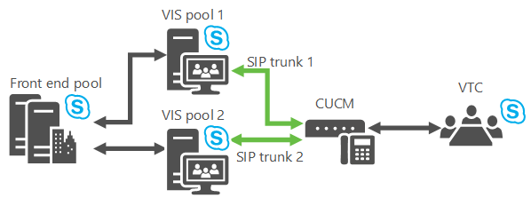

# Planifier le serveur d’interconnexion vidéo dans Skype Entreprise Server
 
**Résumé :** Examinez cette rubrique lors de la planification de l Skype Entreprise Server des périphériques de téléconférence tiers.
  
Skype Entreprise Server vous permet désormais d’intégrer certaines solutions VTC (Video Teleconferencing System) tierces. Le nouveau rôle serveur qui permet cette interopérabilité de visioconférence est le serveur d’interopérabilité vidéo (VIS), actuellement implémenté en tant que rôle serveur autonome disponible uniquement pour les installations sur site. Un VIS fait office d’intermédiaire entre un système de téléconférence tiers et un Skype Entreprise Server déploiement. Pour cette version, le VIS se concentre sur l’interopérabilité avec les systèmes vidéo Cisco/Tandberg. Examinez cet article pour déterminer s’il faut utiliser cette fonctionnalité dans votre installation Skype Entreprise Server’installation.
  
## Interopérabilité des appareils

L’interopération est testée et prise en charge avec les VTC Cisco inscrits auprès de Cisco Unified Communications Manager (CallManager, ou CUCM) version 10.5 et des branches SIP TCP définies entre CUCM et le VIS.
  
Les VTC actuellement pris en charge sont :
  
- Cisco C40
    
- Cisco C60
    
- Cisco C90
    
- Cisco MX200
    
- Cisco MX300
    
- Cisco DX80
    
- Cisco EX60
    
- Cisco EX90
    
- Cisco SX20
    
> [!NOTE]
>  Cisco software release TC7.0.0 or above is required on these systems for integration with Skype Entreprise Server to work as expected.
  
## Trunks SIP

Le serveur d’opation vidéo fonctionne en mode de troncation SIP, où les VTC continuent à s’inscrire auprès de l’infrastructure Cisco existante , par exemple, Cisco Call Manager (CUCM). Une trunk SIP vidéo est définie entre CUCM et le VIS afin que les appels soient acheminés entre les deux systèmes. Seuls les appels via la trunk SIP du VTC vers le VIS sont pris en charge. Ainsi, les VTC peuvent prendre part à une conférence Skype Entreprise (en composant le numéro de téléphone associé au service De surveillance automatisée des appels), mais ne peuvent pas être glissés et déposés dans la conférence.
  

  
## Fonctionnalités

Ce rôle serveur fournit :
  
- Conversion entre les formats H.264 utilisés par les systèmes vidéo tiers et le Skype Entreprise Server déploiement.
    
- Conversion d’un flux vidéo unique à une résolution donnée à partir d’un VTC en plusieurs flux de diffusion simulcast de différentes résolutions à utiliser dans le Skype Entreprise Server déploiement. Ces flux peuvent être envoyés à l’AVMCU, puis Skype Entreprise Server points de terminaison et autres systèmes vidéo qui ont demandé différentes résolutions. Cette conversion est également utilisée lorsque le système vidéo tiers est impliqué dans une conférence Skype Entreprise A/V. Une fois la limite de transcodage atteinte sur un serveur VIS particulier, les demandes suivantes de résolutions différentes reçoivent uniquement un flux avec la résolution la plus faible. 
    
- Prise en charge d’une trunk SIP vidéo entre la passerelle CUCM et un serveur Skype Entreprise Server Video Interop Server ; Les VTC continuent à s’inscrire auprès de la passerelle Cisco et à lancer des appels vers Skype Entreprise déploiement via la passerelle. Les appels sont acheminés de la passerelle vers le Skype Entreprise d’interopation vidéo sur la passerelle SIP vidéo.
    
- Prise en charge d’un utilisateur dans une salle de conférence avec un système vidéo pris en charge pour composer un numéro à partir de ce système pour participer à une conférence ouverte ou fermée. Cet appel traversera la ligne SIP vidéo.
    
- Prise en charge d’un utilisateur dans une salle de conférence avec un système vidéo pris en charge pour appeler Skype Entreprise client. L’appel traverse la ligne SIP.
    
- Prise en charge du contrôle d’appel intermédiaire du côté Skype Entreprise Server ou du système VTC pris en charge pour les appels point à point et multipoint, y compris le son de désin mute/désinserrement du son, la pause/reprise de la vidéo, le verrouillage vidéo et l’appel de mise en attente/désinsoutrement.
    
## Limitations connues

Ce rôle serveur présente les limitations suivantes :
  
- Les nouveaux appels du déploiement Skype Entreprise vers les VTC via la trunk SIP vidéo ne sont pas pris en charge. . Cela signifie que seuls les nouveaux appels des VTC dans le déploiement Skype Entreprise sont pris en charge via la trunk SIP vidéo. La présence du système vidéo pris en charge ne sera pas disponible sur la trunk SIP vidéo vers le VIS. 
    
- Seul un pool VIS autonome est pris en charge pour le mode de troncation SIP vidéo.
    
-  TLS + SRTP ou TCP + RTP sera pris en charge pour les communications entre le VTC et le VIS via la vidéo de la trunk SIP.
    
- Le partage d’application n’est pas pris en charge. Un utilisateur Skype Entreprise de la salle de conférence doit participer à la conférence Skype Entreprise (via un ordinateur portable par exemple) et afficher les écrans de partage d’application sur l’un des moniteurs gratuits de la salle de conférence non associés au VTC.
    
- La possibilité pour un VTC de participer à une réunion fédérée via le VIS n’est pas prise en charge.
    
- La possibilité pour un VTC de participer à une réunion en ligne via le VIS n’est pas prise en charge.
    
- Les appels d’un VTC vers le PSTN via le VIS ne sont pas pris en charge.
    
- Les appels du réseau téléphonique (RTC) vers un VTC via le VIS ne sont pas pris en charge.
    
## Mécanismes de résilience

Le VIS prend en charge les appels entrants provenant d’un CUCM qui sont effectués sur une trunk SIP vidéo. Il est possible de perdre la connectivité en amont ou en aval. Pour une résilience robuste, envisagez les deux possibilités :
  
1. **Failover du pool VIS** Si le pool VIS principal vers qui pointe la passerelle vidéo est en panne, la récupération est possible si la passerelle vidéo a défini des trunks vers deux (ou plusieurs) pools VIS. Si la passerelle vidéo détermine qu’elle ne peut pas effectuer d’appels vers le pool VIS principal, elle route simplement les appels vers un pool VIS secondaire.
    
     
  
    Un pool VIS particulier peut avoir des trunks vers plusieurs passerelles, mais normalement, une passerelle particulière ne peut pas avoir de trunks vers plusieurs pools VIS. Une astuce doit donc être effectuée pour prendre en charge ce failover : Définissez 2 FDQN dans le DNS qui sont résolus en la même adresse IP d’une passerelle vidéo. Représentez chaque nom de groupe (FQDN) en tant que passerelle vidéo distincte dans le document de topologie, où chaque passerelle vidéo dispose d’une passerelle vers un pool VIS différent, et la récupération est désormais possible. (Si TLS est utilisé, les noms multiples doivent être dans le SAN du certificat de passerelle vidéo.)
    
    > [!NOTE]
    > Le VIS autorise uniquement les appels entrants provenant de passerelles configurées dans le document de topologie. 
  
2. **Failover frontal** Si un pool VIS reçoit un appel de CUCM mais qu’il ne peut pas atteindre son pool frontal ou son bureau d’enregistrement principal, les appels sont acheminés vers un pool frontal de sauvegarde.
    
     
  
    Le VIS gardera le suivi de l’état de son pool frontal principal et de son pool frontal de sauvegarde (le paramètre se trouve dans le paramètre de sauvegarde du service Registrar dans le document de topologie). Il envoie des sondages Options une fois par minute aux deux pools, et s’il y a cinq échecs consécutifs, le VIS suppose qu’un pool frontal particulier est en panne. Si le pool frontal principal est marqué comme étant en panne et qu’une sauvegarde configurée est disponible, le VIS envoie de nouveaux appels de la passerelle au pool frontal de sauvegarde. Une fois que le pool frontal principal revient, le VIS reprendra l’utilisation du pool frontal principal pour les nouveaux appels.
    
    Le VIS implémente également un timer de 10 secondes pour les appels à partir de la trunk SIP vidéo. Si le pool frontal du prochain saut principal a été utilisé pour un appel à partir de la trunke SIP vidéo et que le pool frontal du prochain saut principal n’a pas répondu avec un message SIP (y compris 100 Trying) à l’invitation qui lui a été envoyée au cours de cette valeur de timer, le proxy du prochain saut de sauvegarde de l’appel doit être essayé s’il est configuré. 
    
    > [!NOTE]
    > Si le saut suivant de sauvegarde a été testé en premier, le principal n’est pas testé ensuite. 
  
    L’administrateur peut également utiliser la commande de Windows PowerShell pour forcer le VIS à utiliser le pool frontal de sauvegarde, par exemple, lorsque la maintenance doit être effectuée sur le pool frontal principal.
    
## Coexistence de passerelles vocales et vidéo vers le même homologue de passerelle

Skype Entreprise Server prend en charge le fait que les branches SIP vocales et vidéo utilisent le même homologue de passerelle. Le même déploiement CUCM peut donc avoir des branches SIP vocales vers le serveur de médiation et des trunks SIP vidéo vers le VIS.
  
- Une passerelle PSTN doit être définie avec un FQDN particulier dans le document de topologie pour les branches SIP vocales.
    
- L’homologue de la passerelle PSTN sera le serveur de médiation.
    
- Plusieurs branches vocales peuvent être définies, d’une passerelle PSTN à plusieurs pools de serveurs de médiation si nécessaire.
    
- Une passerelle vidéo doit être définie dans le document de topologie pour la passerelle SIP vidéo avec le même nom de groupe que pour la passerelle PSTN.
    
- L’homologue de la passerelle vidéo sera VIS.
    
- Une seule passerelle vidéo peut être définie à partir d’une passerelle vidéo vers un pool VIS particulier.
    
- CUCM doit être configuré pour router correctement les appels sur la boîte vocale par rapport à la vidéo. Par exemple, un préfixe de numérotation spécial peut être utilisé lors de la numérotation à partir du VTC ; CUCM pourrait associer ce préfixe de numérotation à des appels au VIS, et les règles de traduction appropriées dédraient ce préfixe de l’invitation SIP au VIS.
    
## Coexistence du VIS dans la version Skype Entreprise avec les versions précédentes de Lync

Le vis ne peut être déployé que dans le cadre d Skype Entreprise déploiement. Il peut interopérer avec les conférences et les clients Lync 2013 qui font partie d’un déploiement existant ; Dans ce cas, le pool VIS doit faire partie d’un déploiement Skype Entreprise qui inclut un pool de bureaux d’inscriptions/fe qui est le saut suivant pour le pool VIS.
  
Le VIS ne prend pas en charge le transcodage entre RTV et H.264. Il n’existe aucune interopérabilité vidéo entre les clients pré-Lync 2013 et les participants VTC dans une conférence.
  
Le fait d’avoir des clients préconférences Lync 2013 dans une conférence entraîne l’envoi de clients mobiles à l’aide de RTV, ce qui entraîne l’absence de vidéo sur les VTC lorsque le client mobile devient le haut-parleur dominant.
  
Pour que Lync 2013 fonctionne correctement avec le VIS qui fait partie d’un déploiement Skype Entreprise, Lync 2013 a besoin de la mise à jour de mise à jour à jour client Lync 2013, CAA et AVMCU pour fonctionner avec le VIS.
  
L’interopérabilité du VIS avec Lync 2013 et Skype Entreprise clients de bureau a été testée et est prise en charge.
  
Interopérabilité du VIS avec les appareils hors bureau (Android, Ipad, Iphone, Windows Phone, LMX, etc.) Skype Entreprise clients disponibles à partir de l’Apps Store applicable au moment de la publication du VIS a été testé et est pris en charge.
  
## Récupération à partir d’une perte de paquets via fec

La fec peut être désactivée pour faciliter la récupération suite à une perte de paquets. S’il est allumé, 50 % de bande passante vidéo en plus seront utilisées dans le sens VIS vers VTC.
  
## Coût de resserrisation et de transcodage vis

Le transcodage des flux vidéo à partir du VTC Cisco vers plusieurs flux de diffusion simultanée utilise la capacité du processeur. Environ 16 VTC peuvent avoir leur vidéo transcodée (en supposant qu’un flux vidéo 720p à partir de chaque VTC est transcodé en 3 flux de simulcast distincts à 720p, 360p et 180p) dans un seul VIS s’exécutant sur l’équivalent de la plateforme FE Lync 2013 recommandée. Si le transcodage est désactivé, cela permet d’économiser sur le processeur VIS. Toutefois, l’image vidéo demandée par le VIS à partir du VTC sera la résolution commune la plus faible pour satisfaire tous les récepteurs Skype Entreprise côté vidéo. Notez que même avec le transcodage, le transcodage peut être activé lorsque Skype Entreprise clients demandent certaines résolutions basse que les VTC ne peuvent pas envoyer.
  
## Distribution des appels de la passerelle vidéo vers le VIS

La distribution s’effectue via l’un des mécanismes de distribution CUCM :
  
- Utilisation dynamique du DNS.
    
- Côté CUCM, vous pouvez définir des trunks individuelles, où chaque trunk s’termine sur un serveur différent dans le pool VIS. CUCM route les appels sur les différentes liaisons.
    
## Aucune interopérabilité hybride

La prise en charge des VTC qui rejoignent des réunions en ligne via le VIS local ne fait pas partie des Skype Entreprise.
  
## Aucune prise en charge de la fédération

La prise en charge des VTC rejoignant des réunions fédérées via le VIS ne fait pas partie des Skype Entreprise.
  
## Voir aussi

[Déployer le serveur d’interconnexion vidéo dans Skype Entreprise Server](../deploy/deploy-video-interop-server/deploy-video-interop-server.md)
