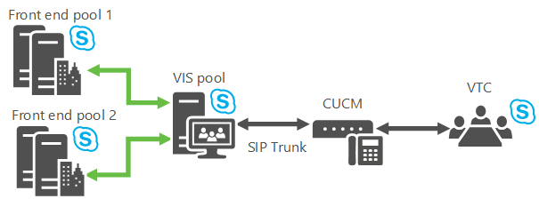

# Planification du serveur d’interopérabilité vidéo dans Skype Entreprise Server 2015
 
**Résumé :** Passez en revue cette rubrique lors de la planification intégrer Skype de Business Server 2015 avec dispositifs de téléconférence de tiers.
  
Skype pour Business Server vous permet maintenant d’intégrer avec certaines solutions VTC (système de téléconférence vidéo) tiers. Le nouveau rôle de serveur qui permet cette interopérabilité de conférence vidéo est vidéo Interop Server (VIS), qui est actuellement mis en œuvre sous la forme d’un rôle de serveur autonome disponible uniquement pour les installations locales. Une VIS joue le rôle d’intermédiaire entre un système de téléconférence de tiers et un Skype pour le déploiement du serveur de l’entreprise. Pour cette version, le VIS se concentre sur l’interopérabilité avec les systèmes vidéo Cisco/Tandberg. Lisez cet article pour déterminer s’il faut utiliser cette fonctionnalité dans votre Skype pour l’installation du serveur de l’entreprise.
  
## Interopérabilité des dispositifs

L’interopérabilité est testée et prise en charge avec les systèmes de vidéoconférence (VTC) Cisco enregistrés dans CUCM version 10.5 et les jonctions SIP (Session Initiation Protocol) TCP mises en place entre CUCM et le serveur d’interopérabilité vidéo (VIS).
  
Les VTC actuellement pris en charge sont :
  
- Cisco C40
    
- Cisco C60
    
- Cisco C90
    
- Cisco MX200
    
- Cisco MX300
    
- Cisco DX80
    
- Cisco EX60
    
- Cisco EX90
    
- Cisco SX20
    
> [!NOTE]
>  Logiciel Cisco version TC7.0.0 ou supérieure est nécessaire sur ces systèmes pour l’intégration avec Skype pour Business Server de fonctionner comme prévu.
  
## Jonctions SIP

Les fonctions vidéo Interop serveur en mode de jonction SIP, où les VTCs continuent à inscrire avec l’infrastructure existante de Cisco - par exemple, Gestionnaire d’appeler Cisco (CUCM). Un tronçon SIP vidéo est défini entre CUCM et le VIS de manière à acheminer les appels entre les deux systèmes. Seuls les appels via le tronçon SIP entre le VTC et le VIS sont pris en charge. Par conséquent, VTCs peut composer en un Skype pour des conférences professionnelles (par numérotation téléphonique associé avec le standard automatique d’appeler), mais ne peuvent pas glisser- déposer dans la conférence.
  

  
## Fonctionnalités

Ce rôle serveur fournit :
  
- Conversion entre les formats H.264 utilisé par les systèmes de vidéo 3ème partie et le Skype pour le déploiement du serveur de l’entreprise.
    
- Conversion d’un seul flux vidéo à une résolution donnée à partir d’un VTC en plusieurs flux de diffusion simultanée de différentes résolutions pour une utilisation dans le Skype pour le déploiement du serveur de l’entreprise. Ces flux peut être envoyés à la AVMCU, puis à Skype pour les points de terminaison de serveur d’entreprise et d’autres systèmes de vidéo qui ont demandé des résolutions différentes. Cette conversion est également utilisée lorsque le système vidéo tiers est impliqué dans un Skype pour entreprise A / appel de conférence de V. Une fois atteinte la limite de transcodage dans un serveur particulier de la VIS, toutes les requêtes suivantes pour différentes résolutions reçoit un flux de données avec la résolution la plus basse. 
    
- Prise en charge pour un vidéo SIP trunk entre la passerelle CUCM et un Skype pour serveur Business Server vidéo Interop ; VTCs continuer à enregistrer avec la passerelle Cisco et initier des appels à la Skype pour le déploiement d’entreprise par le biais de la passerelle. Les appels sont routés depuis la passerelle vers le Skype pour Business vidéo Interop Server via le trunk SIP vidéo.
    
- Prise en charge d’un utilisateur dans une salle de conférence avec un système de vidéo pris en charge à composer à partir de ce système à participer à une conférence ouverte ou fermée. Cet appel va parcourir le SIP trunk vidéo.
    
- Prise en charge d’un utilisateur dans une salle de conférence avec un système de vidéo pris en charge appeler un Skype pour client d’entreprise. L’appel ne parcourt pas le SIP trunk.
    
- Prise en charge du contrôle d’appel de milieu de gamme de la Skype pour le côté serveur de l’entreprise ou à partir du système VTC pris en charge pour les appels point à point et multipoints, y compris audio muette/non-sélectionné-mute, suspendre/reprendre vidéo, verrouillage vidéo et appels en attente/ONU-attente.
    
## Limitations connues

Ce rôle serveur présente les limitations suivantes :
  
- Nouveaux appels à partir de la Skype pour le déploiement de l’entreprise pour les VTCs via le trunk SIP vidéo ne sont pas pris en charge. . Cela signifie que les seuls nouveaux appels à partir des VTCs dans le Skype pour le déploiement de l’entreprise sont pris en charge via le trunk SIP vidéo. Présence pour le système de vidéo pris en charge ne seront pas disponible via le trunk SIP vidéo à la vis 
    
- Seul un pool VIS autonome est pris en charge en mode tronçon SIP vidéo.
    
-  TLS + SRTP ou TCP + RTP est pris en charge pour les communications entre le VTC et le VIS via le tronçon SIP vidéo.
    
- Le partage d’applications n’est pas pris en charge. Un Skype pour l’utilisateur professionnel dans la salle de conférence doit rejoindre le Skype pour des conférences professionnelles (via un ordinateur portable par exemple) et d’afficher l’application partage des écrans sur l’un des moniteurs libres dans la salle de conférence n’est ne pas associé à le VTC.
    
- La capacité d’un VTC à rejoindre une réunion fédérée via le VIS n’est pas prise en charge.
    
- La capacité d’un VTC à rejoindre une réunion en ligne via le VIS n’est pas prise en charge.
    
- Les appels d’un VTC à un réseau RTC via le VIS ne sont pas pris en charge.
    
- Les appels du réseau RTC à un VTC via le VIS ne sont pas pris en charge.
    
## Mécanismes de résilience

Le VIS prend en charge les appels entrants d’un CUCM transitant par un tronçon SIP vidéo. Une perte de connectivité en amont ou en aval étant possible, vous devez envisager les deux possibilités suivantes pour profiter d’une résilience robuste :
  
1. **Basculement de Pool de VIS** Si le pool principal vis-À-vis la passerelle vidéo vers est arrêté, la récupération est possible si la passerelle vidéo a défini les puits qui y aboutissent à des pools de VIS de deux (ou plus). Si la passerelle vidéo détermine qu’elle ne peut pas passer les appels vers le pool VIS principal, elle achemine simplement les appels vers le pool VIS secondaire.
    
     
  
    Un pool de VIS particulier peut avoir plusieurs passerelles puits y, mais normalement une passerelle spécifique ne peut avoir de puits à plusieurs pools de VIS, un pli doit être effectué pour prendre en charge de ce basculement : définir les FDQNs 2 dans le système DNS qui se résoudre à la même adresse IP d’une passerelle de vidéo. Représentent chaque nom de domaine complet sous la forme d’une passerelle vidéo séparée dans le Document où chaque passerelle vidéo a un tronc à un autre pool de VIS de la topologie, et récupération est désormais possible. (Si TLS est utilisé, les noms de plusieurs devez être dans le SAN, le certificat de passerelle vidéo.)
    
    > [!NOTE]
    > Le VIS autorise uniquement les appels entrants provenant des passerelles configurées dans le document de topologie. 
  
2. **Basculement de Front-End** Si un pool de VIS reçoit un appel de CUCM, mais ne peut pas atteindre son pool de Front-End ou le greffier principal tronçon suivant, les appels sont routés vers un pool de sauvegarde Front-End.
    
     
  
    La VIS est suivi de l’état de son pool de Front-End principal et son pool de Front-End de sauvegarde (le paramètre se trouve dans le paramètre de sauvegarde pour le service serveur d’inscriptions dans le Document de la topologie). Il envoie deux pools de sondages d’Options une fois par minute, et s’il y a cinq échecs consécutifs la VIS suppose qu’un pool frontal particulier est en panne. Si le pool frontal primaire comme étant vers le bas et il existe un configuré sauvegarde la VIS envoie des nouveaux appels depuis la passerelle vers le pool de sauvegarde Front-End. Une fois le pool frontal principal revient, la VIS va reprendre en utilisant le pool frontal principal de nouveaux appels.
    
    Le VIS implémente également un minuteur de 10 secondes pour les appels qui proviennent du tronçon SIP vidéo. Si le pool de Front-End de tronçon suivant principal a été utilisé pour un appel à partir de la vidéo SIP trunk et le tronçon suivant principal Front-End en pool n’a pas répondu avec un message SIP (y compris Trying 100) à l’invitation adressée dans ce délai, le proxy sauvegarde de saut suivant pour l’appel de s hould tester si configuré. 
    
    > [!NOTE]
    > Si le saut suivant sauvegarde a été tenté en premier, le serveur principal n’est pas tenté ensuite. 
  
    L’administrateur peut également utiliser la commande de basculement de Windows PowerShell pour forcer les VIS à utiliser Front-End pool de sauvegarde, par exemple, lors de la maintenance doit être effectuée sur le pool frontal principal.
    
## Coexistence de tronçons audio et vidéo sur le même homologue de passerelle

Skype pour Business Server gère voix et vidéo SIP trunks utilisent le même homologue de passerelle. C’est pourquoi le même déploiement CUCM peut comprendre des tronçons SIP audio sur le serveur de médiation et des tronçons SIP vidéo sur le VIS.
  
- Il est nécessaire de définir une passerelle PSTN avec un nom de domaine complet particulier dans le document de topologie pour les tronçons SIP audio.
    
- L’homologue de la passerelle PSTN est le serveur de médiation.
    
- Il est possible de définir plusieurs tronçons audio répartis entre une passerelle PSTN et plusieurs pools de serveur de médiation, si nécessaire.
    
- Une passerelle vidéo doit être définie dans le document de topologie pour le tronçon SIP vidéo possédant le même nom de domaine complet que la passerelle PSTN.
    
- L’homologue de la passerelle vidéo est le VIS.
    
- Il est possible de ne définir qu’un seul tronçon vidéo entre une passerelle vidéo et un pool VIS particulier.
    
- CUCM doit être configuré pour acheminer correctement les appels via le tronçon audio et le tronçon vidéo. Par exemple, vous pouvez utiliser un préfixe de numérotation spécial lors de la numérotation à partir du VTC ; CUCM peut associer ce préfixe aux appels du VIS et appliquer les règles de conversion appropriées entre SIP Invite et le VIS.
    
## Coexistence de VIS dans Skype Entreprise avec les versions précédentes de Lync

VIS peuvent uniquement être déployées dans le cadre de Skype pour le déploiement de l’entreprise. Il peut fonctionner avec Lync 2013 conférences et les clients qui font partie d’un déploiement existant ; Dans ce cas, le pool de VIS devrez faire partie d’un Skype pour le déploiement d’entreprise qui inclut un pool Registrar/FE le saut suivant pour le pool de VIS.
  
Le VIS ne prend pas en charge le transcodage entre RTV et H.264. Il n’existe pas d’interopérabilité entre les clients pré-Lync 2013 et les participants VTC dans une conférence.
  
Ayant pre-Lync 2013 clients dans une conférence entraîne des clients mobiles à envoyer à l’aide de RTV résultant dans VTCs reçoit aucun signal vidéo lorsque le client mobile devient le haut-parleur dominant.
  
Lync 2013 fonctionner correctement avec VIS qui fait partie d’un Skype pour le déploiement de l’entreprise, Lync 2013 doit la CU approprié à appliquer qui met à niveau le client de Lync 2013 TCHA et AVMCU pour travailler avec des vis
  
L’interopérabilité des VIS avec Lync 2013 et Skype pour les clients de bureau d’entreprise a été testée et est pris en charge.
  
Interopérabilité des VIS avec non-bureau (Android, Ipad, Iphone, Windows Phone, LMX, etc.) Skype pour les clients d’entreprise disponibles à partir du magasin d’applications applicables au moment de la publication du rapport a été testée et est pris en charge.
  
## Récupération de la perte de paquets via la correction des erreurs de transfert (FEC)

Vous pouvez activer la FEC pour faciliter la récupération des pertes de paquets. Lorsqu’elle est activée, les transmissions entre le VIS et le VTC utilisent 50 % de bande passante en plus.
  
## Taille du VIS et coûts de transcodage

Transcoder les flux vidéo simples entre le VTC de Cisco et plusieurs flux simulcast consomme des ressources processeur. Environ 16 VTCs peuvent avoir leur vidéo transcodée (en supposant qu’un flux de données vidéo 720p de chaque VTC est transcodé en 3 flux séparé de diffusion simultanée à 720p, 360p et p 180) dans une seule VIS en cours d’exécution sur l’équivalent de la Lync 2013 recommandé de plate-forme de FE. Si le transcodage est désactivé, vous économisez les ressources du processeur du VIS. Cependant, l’image vidéo que le VIS demande au VTC sera d’une résolution standard inférieure pour satisfaire tous les destinataires côté Skype Entreprise. Notez que même si le transcodage est désactivé, il est possible de l’activer lorsque des clients Skype Entreprise exigent certaines basses résolutions non prise en charge par les VTC.
  
## Distribution des appels de la passerelle vidéo vers le VIS

La distribution est réalisée via l’un des mécanismes de distribution CUCM suivants :
  
- Dynamiquement à l’aide de DNS.
    
- Côté CUCM, vous pouvez définir des tronçons individuels, chaque tronçon étant relié à un serveur différent dans le pool VIS. CUCM achemine les appels sur les différents tronçons.
    
## Absence d’interopérabilité hybride

La prise en charge des VTC permettant de rejoindre des réunions en ligne via le VIS installé dans les locaux n’est pas intégrée à Skype Entreprise.
  
## Aucune prise en charge fédérée

La prise en charge des VTC permettant de rejoindre des réunions fédérées via le VIS n’est pas intégrée à Skype Entreprise.
  
## Voir aussi

#### 

[Déployer le serveur interopérabilité vidéo dans Skype pour Business Server 2015](../deploy/deploy-video-interop-server/deploy-video-interop-server.md)

