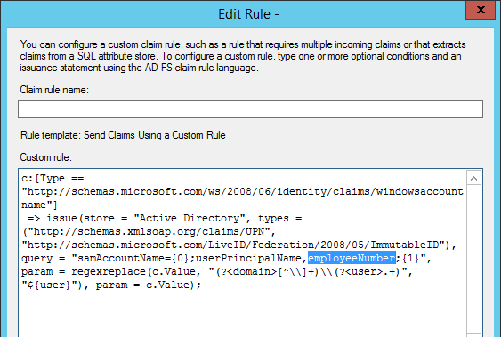

# Configurer un environnement à plusieurs forêts pour hybride Skype pour entrepriseConfigure a multi-forest environment for hybrid Skype for Business
 
Les sections suivantes fournissent des instructions sur la configuration d’un environnement comportant plusieurs forêts dans un modèle de forêt ressource/utilisateur pour fournir Skype pour les fonctionnalités d’entreprise dans un scénario hybride.The following sections provide guidance on how to configure an environment that has multiple forests in a Resource/User forest model to provide Skype for Business functionality in a hybrid scenario. 
  

  
## Validation de la topologie de forêtValidate the Forest Topology

Les forêts d’utilisateurs multiples sont prises en charge. Tenez compte des points suivants :  Multiple user forests are supported. Keep the following in mind: 
  
- Pour une forêt à utilisateur unique ou déploiement dans plusieurs forêts utilisateur, il doit y avoir un déploiement unique de Skype pour Business Server.For either a single user forest or multiple user forest deployment, there must be a single deployment of Skype for Business Server.
    
- Pour les versions prises en charge dans une configuration hybride de Lync Server et Skype pour Business Server, consultez [exigences topologiques](../../skype-for-business-hybrid-solutions/plan-hybrid-connectivity.md#BKMK_Topology) dans la [planification de la connectivité d’hybride entre Skype pour Business Server et Skype pour l’activité en ligne](../../skype-for-business-hybrid-solutions/plan-hybrid-connectivity.md).For supported versions of Lync Server and Skype for Business Server in a hybrid configuration, see [Topology requirements](../../skype-for-business-hybrid-solutions/plan-hybrid-connectivity.md#BKMK_Topology) in [Plan hybrid connectivity between Skype for Business Server and Skype for Business Online](../../skype-for-business-hybrid-solutions/plan-hybrid-connectivity.md).
    
- Exchange Server peut être déployé dans une ou plusieurs forêts, ce qui peuvent incluent ou non la forêt contenant Skype pour Business Server.Exchange Server can be deployed in one or more forests, which may or may not include the forest containing Skype for Business Server. Assurez-vous que vous avez appliqué la mise à jour Cumulative.Make sure you have applied the latest Cumulative Update.
    
- Pour plus d’informations sur la coexistence avec Exchange Server, y compris la prise en charge critères et les restrictions dans différentes combinaisons de locaux et en ligne, voir [fonctionnalité prise en charge](../../plan-your-deployment/integrate-with-exchange/integrate-with-exchange.md#feature_support) de [planifier l’intégration de Skype pour les entreprises et Exchange](../../plan-your-deployment/integrate-with-exchange/integrate-with-exchange.md).For details on co-existence with Exchange Server, including support criteria and limitations in various combinations of on-premises and online, see [Feature support](../../plan-your-deployment/integrate-with-exchange/integrate-with-exchange.md#feature_support) in [Plan to integrate Skype for Business and Exchange](../../plan-your-deployment/integrate-with-exchange/integrate-with-exchange.md).
    
Pour plus d’informations, reportez-vous à [exigences environnementales pour Skype pour Business Server 2015](../../plan-your-deployment/requirements-for-your-environment/environmental-requirements.md).For more information, please refer to [Environmental requirements for Skype for Business Server 2015](../../plan-your-deployment/requirements-for-your-environment/environmental-requirements.md).
  
## Aspects relatifs à l’hébergement des utilisateursUser homing considerations

Pour les utilisateurs professionnels hébergement dans les locaux de Skype peut avoir Exchange hébergée sur site ou en ligne.Skype for Business users homed on premises can have Exchange homed on premises or online. Skype pour les utilisateurs professionnels en ligne doit utiliser Exchange Online pour une expérience optimale ; Toutefois, cela n’est pas nécessaire.Skype for Business Online users should use Exchange Online for an optimal experience; however, this is not required. Exchange sur site n’est pas nécessaire d’implémenter Skype pour les entreprises dans tous les cas.Exchange on premises is not required to implement Skype for Business in either case.
  
## Configuration des approbations de forêtConfigure Forest Trusts

Les approbations nécessaires sont des approbations transitives bidirectionnelles entre la forêt de ressources et chacune des forêts d’utilisateurs.The trusts required are two-way transitive trusts between the resource forest and each of the user forests. Si vous disposez de plusieurs forêts d’utilisateurs, il est important que le routage des suffixes de noms soit activé pour chacune de ces approbations de forêt pour pouvoir utiliser l’authentification inter-forêt.If you have multiple user forests, to enable cross-forest authentication it is important that Name Suffix Routing is enabled for each of these forest trusts. Pour obtenir des instructions, reportez-vous à la section [Gestion des approbations de forêt](https://technet.microsoft.com/en-us/library/cc772440.aspx).For instructions, see [Managing Forest Trusts](https://technet.microsoft.com/en-us/library/cc772440.aspx). 
  
## Synchroniser les comptes dans la forêt Skype pour les entreprises d’hébergementSynchronize Accounts into the forest hosting Skype for Business

Lorsque Skype pour Business Server est déployé dans une forêt (forêt ressource), mais fournit des fonctionnalités pour les utilisateurs dans un ou plusieurs autres forêts (forêts de comptes), les utilisateurs des autres forêts doivent être représentées en tant qu’objets utilisateur désactivés dans la forêt où Skype pour Business Server est déployé.When Skype for Business Server is deployed in one forest (a resource forest), but provides functionality to users in one or more other forests (account forests), users in the other forests must be represented as disabled user objects in the forest where Skype for Business Server is deployed. Un produit de gestion des identités, telles que Microsoft Identity Manager, doit être déployé et configuré pour la mise en service et synchroniser les utilisateurs de forêts de comptes dans la forêt où Skype pour Business Server est déployé.An identity management product, such as Microsoft Identity Manager, needs to be deployed and configured to provision and synchronize the users from the account forests into the forest where Skype for Business Server is deployed. Les utilisateurs doivent être synchronisés dans la forêt qui héberge Skype pour Business Server en tant qu’objets utilisateur désactivés.Users must be synchronized into the forest hosting Skype for Business Server as disabled user objects. Les utilisateurs ne peut pas être synchronisés en tant qu’objets de contact Active Directory, car Azure Active Directory se connecter ne sera pas correctement synchronisé contacts dans AD Azure pour une utilisation avec Skype.Users cannot be synchronized as Active Directory contact objects, because Azure Active Directory Connect will not properly synchronize contacts into Azure AD for use with Skype.
  
Que n’importe quelle configuration de plusieurs forêt, la forêt hébergeant Skype pour Business Server peut également fournir des fonctionnalités pour tous les utilisateurs activés qui existent dans la même forêt.Regardless of any multi-forest configuration, the forest hosting Skype for Business Server can also provide functionality for any enabled users that exist in the same forest.
  
Pour une synchronisation correcte des identités, les attributs suivants doivent être synchronisés :To get proper identity synchronization, the following attributes need to be synchronized: 
  
|**Forêts d’utilisateurs****User Forests**|**Forêts de ressources****Resource Forests**|
|:-----|:-----|
|attribut de lien du compte choisichosen account link attribute    |attribut de lien du compte choisichosen account link attribute    |
|mail mail    |mail mail    |
|ProxyAddressesProxyAddresses    |ProxyAddressesProxyAddresses    |
|ObjectSIDObjectSID    |msRTCSIP-OriginatorSIDmsRTCSIP-OriginatorSID    |
   
Le [choisi d’attribut de lien compte](https://azure.microsoft.com/en-us/documentation/articles/active-directory-aadconnect-design-concepts/) sera utilisé comme le point d’ancrage de la Source.The [chosen account link attribute](https://azure.microsoft.com/en-us/documentation/articles/active-directory-aadconnect-design-concepts/) will be used as the Source Anchor. Si vous préférez utiliser un autre attribut immuable, c’est possible, mais veillez à modifier la règle des revendications AD FS et à sélectionner l’attribut lors de la configuration d’AAD Connect.If you have a different and immutable attribute that you would prefer to use, you may do so, just be sure you edit the AD FS claims rule and select the attribute during the AAD Connect configuration.
  
Ne pas synchroniser l’UPN entre les forêts.Do not sync the UPN's between the forests. Lors des tests, nous avons découvert qu’il fallait utiliser un UPN unique pour chaque forêt d’utilisateurs, car il est impossible d’utiliser le même UPN dans plusieurs forêts.We found during testing that we needed to use a unique UPN for each user forest, as you cannot use the same UPN across multiple forests. Il reste par conséquent deux possibilités : synchroniser l’UPN ou non.As a result, we were presented with two possibilities, to synchronize the UPN or to not synchronize. 
  
-  Si l’UPN de chaque forêt d’utilisateurs n’est pas synchronisé avec l’objet désactivé associé dans la forêt de ressources, l’authentification unique sera interrompue pour au moins la première tentative de connexion (en supposant que l’utilisateur a sélectionné l’option permettant d’enregistrer le mot de passe). Dans le client Skype Entreprise, nous partons du principe que les valeurs SIP/UPN sont identiques. Étant donné que l’adresse SIP dans ce scénario est user@company.com, mais que l’UPN de l’objet activé dans la forêt est en fait user@contoso.company.com, la tentative de connexion initiale échouera et l’utilisateur sera invité à entrer ses informations d’identification. En entrant l’UPN correct/réel, la demande d’authentification sera effectuée sur les contrôleurs de domaine dans la forêt d’utilisateurs, et la connexion aboutira.If the unique UPN from each user forest was not synchronized to the associated disabled object in the resource forest, Single Sign-on would be broken for at least the initial sign-in attempt (assuming the user selected the option to save password). In the SfB client, we assume that the SIP/UPN values are the same. Since the SIP address in this scenario is user@company.com, but the UPN of the enabled object in the user forest is in fact user@contoso.company.com, the initial login attempt would fail and the user would be prompted to enter credentials. Upon entering their correct/actual UPN, the authentication request would be completed against the domain controllers in the user forest, and sign-in would be successful.
    
- Si l’UPN unique de chaque forêt d’utilisateurs a été synchronisé avec l’objet désactivé associé dans la forêt de ressources, l’authentification AD FS échouera. La règle de correspondance recherchera l’UPN principal sur l’objet dans la forêt de ressources, qui a été désactivé et ne peut être utilisé pour l’authentification.If the unique UPN from each user forest was synchronized to the associated disabled object in resource forest, AD FS authentication would fail. The matching rule would find the UPN on the object in the resource forest, which was disabled and could not be used for authentication. 
    
## Création d’un client Office 365Create an Office 365 tenant

Vous devez ensuite fournir un client Office 365 pour le déploiement.You will next need to provision an Office 365 tenant to use with your deployment. Pour plus d’informations, consultez les [Étapes de mise en service Office 365](https://social.technet.microsoft.com/wiki/contents/articles/22808.office-365-provisioning-steps.aspx).For more information, please see [Office 365 Provisioning Steps](https://social.technet.microsoft.com/wiki/contents/articles/22808.office-365-provisioning-steps.aspx). 
  
## Configuration des services AD FSConfigure AD FS

Une fois que vous disposez d’un client, vous devez configurer les services AD FS (Active Directory Federation Services) dans chacune des forêts d’utilisateurs. Cela suppose que vous disposez d’un SIP, d’une adresse SMTP et d’un nom d’utilisateur principal (UPN) uniques dans chaque forêt. AD FS est facultatif et est utilisé ici pour obtenir une authentification unique. DirSync avec synchronisation des mots de passe est également pris en charge et peut aussi être utilisé à la place d’AD FS.Once you have a tenant, you will next need to configure Active Directory Federation Services (AD FS) ineach of the user forests. This assumes you have a unique SIP and SMTP address and User Principal Name (UPN) for each forest. AD FS is optional and is used here to get single-sign on. DirSync with Password Sync is also supported and can also be used in place of AD FS. 
  
Seuls les déploiements avec SIP/SMTP et UPN correspondants ont été testés. Des SIP/SMTP/UPN divergents peuvent avoir pour résultat une perte de fonctionnalités. Vous pouvez par exemple rencontrer des problèmes avec l’authentification unique et l’intégration Exchange.Only deployments with matching SIP/SMTP and UPNs were tested. Not having matching SIP/SMTP/UPNs may result in reduced functionality, such as problems with Exchange integration and single-sign on. 
  
Sauf si vous utilisez un SIP/SMTP/UPN unique pour les utilisateurs de chaque forêt, vous pouvez toujours exécuter Single Sign-on (SSO) des problèmes - quel que soit l’emplacement de déploiement AD FS :Unless you use a unique SIP/SMTP/UPN for users from each forest, you can still run into Single Sign-on (SSO) problems - regardless of where AD FS is deployed: 
  
- Des approbations unidirectionnelles et bidirectionnelles entre les forêts ressource/utilisateur avec une batterie de serveurs AD FS déployée dans chaque forêt utilisateur. Tous les utilisateurs partagent le même domaine SIP/SMTP mais l’UPN est unique pour chaque forêt d’utilisateur.One-way or two-way trusts between resource/user forests with AD FS farm deployed in each user forest, all users share common SIP/SMTP domain but unique UPN for each user forest. 
    
- Des approbations bidirectionnelles entre forêts ressource/utilisateur avec une batterie de serveurs AD FS uniquement déployée dans les forêts de ressources. Tous les utilisateurs partagent le même domaine SIP/SMTP mais l’UPN est unique pour chaque forêt d’utilisateur.Two-way trusts between resource/user forests with AD FS farm deployed only in resource forest, all users share common SIP/SMTP domain but unique UPN for each user forest. 
    
Pour résoudre le problème, placez une batterie de serveurs AD FS dans chaque forêt utilisateur et utilisez des SIP/SMTP/UPN uniques pour chaque forêt. Seuls les comptes de cette forêt d’utilisateurs seront pris en compte lors des tentatives d’authentification. Cela vous permettra de proposer une procédure d’authentification plus transparente.By placing an AD FS farm in each user forest and using a unique SIP/SMTP/UPN for each forest, we resolve both issues. Only the accounts in that specific user forest would be searched and matched during authentication attempts. This will help provide a more seamless authentication process. 
  
Il s’agit d’un déploiement standard de Windows Server 2012 R2 AD FS qui doit être fonctionnel avant de poursuivre.This will be a standard deployment of the Windows Server 2012 R2 AD FS and should be working before continuing. Pour obtenir des instructions, reportez-vous à la section [comment installer AD FS des R2 2012 pour Office 365](https://blogs.technet.com/b/rmilne/archive/2014/04/28/how-to-install-adfs-2012-r2-for-office-365.aspx).For instructions, see [How To Install AD FS 2012 R2 For Office 365](https://blogs.technet.com/b/rmilne/archive/2014/04/28/how-to-install-adfs-2012-r2-for-office-365.aspx). 
  
Une fois le déploiement effectué, vous devez modifier la règle des revendications pour qu’elle corresponde à l’ancre source précédemment sélectionnée. Dans la console MMC AD FS, dans Approbations de la partie de confiance, cliquez avec le bouton droit sur Plateforme d’identité Microsoft Office 365 puis sur Modifier les règles de revendication. Dans la première règle, modifiez l’ObjectSID en employeeNumber.Once deployed, you then have to edit the claims rule to match the Source Anchor selected earlier. In the AD FS MMC, under Relying Party Trusts, right-click Microsoft Office 365 Identity Platform and then click Edit Claim Rules. Edit the first rule and change ObjectSID to employeeNumber. 
  

  
## Configuration d’AAD ConnectConfigure AAD Connect

AAD Connect fusionnera les comptes entre les différentes forêts et entre les forêts et Office 365. Vous devez déployer AAD Connect dans la forêt de ressources. Ceci est nécessaire pour pouvoir synchroniser plusieurs forêts et Office 365, en l’absence de prise en charge par DirSync.AAD Connect will be used to merge the accounts between the different forests and between the forests and Office 365. You should deploy AAD Connect in the resource forest. It is required to be able to synchronize multiple forests and Office 365, which is not supported by Dirsync. 
  
AAD Connect ne synchronise pas les comptes entre forêts locales. Il utilise des connecteurs AD pour lire les objets qui sont déjà synchronisés entre les forêts locales (par FIM ou produits similaires). Il tire ensuite parti des règles de filtrage pour créer une représentation unique des objets activé et désactivé correspondants dans son métaverse, et réplique cet objet unique fusionné dans Office 365.AAD Connect does not synchronize the accounts between on-premises forests. It uses AD connectors to read objects that are already synchronized across on-premises forests (by FIM or similar products). It then leverages filtering rules to create a single representation of both the matching enabled and disabled object in its metaverse, and then replicates that single, merged object into Office 365. 
  
Lorsque vous avez terminé et qu’AAD Connect est en cours de fusion, un objet examiné dans le métaverse ressemble à ceci :When finished and AAD Connect is merging, if you look at an object in the metaverse, you should see something similar to this: 
  

  
Les attributs surlignés en vert ont été fusionnés à partir d’Office 365, ceux en jaune proviennent de la forêt utilisateur et ceux en bleu de la forêt de ressources.The green highlighted attributes were merged from Office 365, the yellow are from the user forest and the blue are from the resource forest. 
  
Il s’agit d’un utilisateur test. Vous pouvez voir qu’AAD Connect a identifié le sourceAnchor et le cloudSourceAnchor des objets de forêts utilisateur/ressource et d’Office 365, en l’occurrence 1101, qui est l’employeeNumber précédemment sélectionné. Il a ensuite pu fusionner cet objet dans ce que vous voyez ci-dessus.This is a test user, and you can see that AAD Connect has identified the sourceAnchor and the cloudSourceAnchor from the user and the resource forest objects and from Office 365, in our case 1101 which is the employeeNumber selected earlier. It then was able to merge this object into what you see above. 
  
Pour plus d’informations, voir [intégration des identités avec Azure Active Directory local](https://azure.microsoft.com/en-us/documentation/articles/active-directory-aadconnect/).For more information, see [Integrating your on-premises identities with Azure Active Directory](https://azure.microsoft.com/en-us/documentation/articles/active-directory-aadconnect/). 
  
AAD Connect doit être installé avec la plupart des valeurs par défaut, à l’exception des étapes suivantes :AAD Connect should be installed using mostly the defaults. Except for the following steps: 
  
1.  Seul signe-dans - avec AD FS est déjà déployé et de travail, sélectionnez n’est pas configuréSingle sign-in - with AD FS already deployed and working, select Do not configure
    
2. Connecter vos répertoires - ajouter tous les domainesConnect your directories - add all of the domains 
    
3.  Identifier les utilisateurs dans des répertoires locaux : sélectionnez **les identités utilisateur existent sur plusieurs annuaires** , attributs **ObjectSID** et **msExchangeMasterAccountSID**Identify users in on-premises directories: Select **User identities exist across multiple directories** and select **ObjectSID** and **msExchangeMasterAccountSID** attributes
    
4. Identifier les utilisateurs dans Active Directory Azure : ancre de Source - Sélectionnez l’attribut que vous avez choisi après avoir lu la [sélection d’un attribut de bonne sourceAnchor](https://azure.microsoft.com/en-us/documentation/articles/active-directory-aadconnect-design-concepts/), le nom d’utilisateur Principal - **userPrincipalName**Identify users in Azure AD: Source Anchor - Select the attribute you've chosen after reading [Selecting a good sourceAnchor attribute](https://azure.microsoft.com/en-us/documentation/articles/active-directory-aadconnect-design-concepts/), User Principal Name - **userPrincipalName**
    
5.  Options - Sélectionner si vous avez Exchange hybride déployé ou non.Optional features - select whether you have Exchange hybrid deployed or not.
    
    > [!NOTE]
    >  Si vous ne disposez que d’Exchange Online, il peut y avoir un problème avec les échecs OAuth pendant la découverte automatique en raison d’une redirection CNAME.If you have only Exchange Online, there could be an issue with OAuth failures during autodiscover because of CNAME redirection. Pour résoudre ce problème, vous devez définir l’URL de découverte automatique Exchange en exécutant l’applet de commande suivante à partir de la Skype pour Business Server Management Shell :To correct this, you will need to set the Exchange Autodiscover URL by running the following cmdlet from the Skype for Business Server Management Shell:
  
    Set-CsOAuthConfiguration - ExchangeAutoDiscoverURLhttps://autodiscover-s.outlook.com/autodiscover/autodiscover.svcSet-CsOAuthConfiguration -ExchangeAutoDiscoverURL https://autodiscover-s.outlook.com/autodiscover/autodiscover.svc 
    
6.  Batterie de serveurs AD FS : sélectionnez **Utilisation d’une batterie de serveurs Windows Server 2012 R2 AD FS existante** et entrez le nom du serveur AD FS.AD FS Farm: Select **Use an existing Windows Server 2012 R2 AD FS farm** and enter the name of the AD FS server.
    
7.  Terminez les étapes de l’assistant et effectuez les validations nécessaires.Finish the wizard and perform the necessary validations.
    
## Configurer le mode hybrique pour Skype Entreprise ServerConfigure Hybrid mode for Skype for Business Server

Suivez les méthodes conseillées pour la configuration de Skype pour hybride de l’entreprise.Follow the best practices for configuring Skype for Business hybrid. Pour plus d’informations sur la planification, voir [planification du déploiement hybride pour Skype pour Business Server 2015](https://technet.microsoft.com/en-us/library/jj205403.aspx)et des informations de configuration voir [hybride de configurer avec Skype pour l’activité en ligne](https://technet.microsoft.com/en-us/library/jj204669.aspx).For more planning information, see [Plan your hybrid deployment for Skype for Business Server 2015](https://technet.microsoft.com/en-us/library/jj205403.aspx), and for configuration information see [Configure hybrid with Skype for Business Online](https://technet.microsoft.com/en-us/library/jj204669.aspx). 
  
## Configurer le mode hybrique pour Exchange ServerConfigure hybrid mode for Exchange Server

Si nécessaire, suivez les meilleures pratiques pour la configuration hybride d’Exchange.If necessary, follow the best practices for configuring Exchange hybrid. Pour plus d’informations, consultez [Déploiement d’Exchange Server hybride](https://technet.microsoft.com/en-us/library/jj200581%28v=exchg.150%29.aspx).For more information, see [Exchange Server Hybrid Deployments](https://technet.microsoft.com/en-us/library/jj200581%28v=exchg.150%29.aspx). 
  

