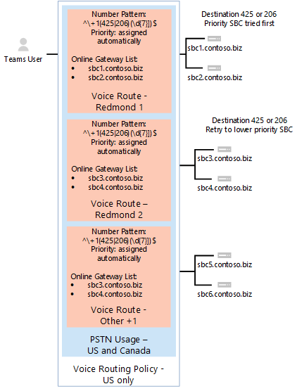

# <a name="configure-direct-routing"></a><span data-ttu-id="06860-103">Configurer le routage Direct</span><span class="sxs-lookup"><span data-stu-id="06860-103">Configure Direct Routing</span></span>

  > [!NOTE]
  > <span data-ttu-id="06860-104">Il s’agit d’une version préliminaire de routage Direct de Microsoft Phone System.</span><span class="sxs-lookup"><span data-stu-id="06860-104">This is a preview release of Microsoft Phone System Direct Routing.</span></span>  <span data-ttu-id="06860-105">Documentation et des fonctionnalités du produit peuvent être modifiées.</span><span class="sxs-lookup"><span data-stu-id="06860-105">Product functionality and documentation are subject to change.</span></span>

<span data-ttu-id="06860-106">Si vous n’avez pas déjà fait, lisez la [Planifier le routage Direct](plan-direct-routing.md) pour les composants requis et pour passer en revue les autres étapes, vous devrez prendre avant de configurer votre réseau de système téléphonique de Microsoft.</span><span class="sxs-lookup"><span data-stu-id="06860-106">If you have not already done so, read [Plan Direct Routing](plan-direct-routing.md) for prerequisites and to review  other steps you’ll need to take before you configure your Microsoft Phone System network.</span></span> 

  > [!NOTE]
  > <span data-ttu-id="06860-107">Ce document est destiné aux professionnels de l’informatique.</span><span class="sxs-lookup"><span data-stu-id="06860-107">This document is intended for IT professionals.</span></span>  

<span data-ttu-id="06860-108">Cet article explique comment configurer le routage Direct de Microsoft Phone System.</span><span class="sxs-lookup"><span data-stu-id="06860-108">This article describes how to configure Microsoft Phone System Direct Routing.</span></span> <span data-ttu-id="06860-109">Il décrit en détail comment associer un contrôleur de bordure Session pris en charge (SBC) pour le routage Direct et configurer les utilisateurs de Microsoft Teams pour utiliser le routage directe pour se connecter à la Public téléphone réseau commuté (RTC).</span><span class="sxs-lookup"><span data-stu-id="06860-109">It details how to pair a supported Session Border Controller (SBC) to Direct Routing and how to configure Microsoft Teams users to use Direct Routing to connect to the Public Switched Telephone Network (PSTN).</span></span> <span data-ttu-id="06860-110">Pour effectuer les étapes décrites dans cet article, les administrateurs doivent se familiariser avec les applets de commande PowerShell.</span><span class="sxs-lookup"><span data-stu-id="06860-110">To complete the steps explained in this article, administrators need some familiarity with PowerShell cmdlets.</span></span> <span data-ttu-id="06860-111">Pour plus d’informations sur l’utilisation de PowerShell, voir [configurer votre ordinateur pour Windows PowerShell](https://technet.microsoft.com/library/dn362831.aspx).</span><span class="sxs-lookup"><span data-stu-id="06860-111">For more information about using PowerShell, see [Set up your computer for Windows PowerShell](https://technet.microsoft.com/library/dn362831.aspx).</span></span> 

<span data-ttu-id="06860-112">Nous vous recommandons de vérifier que votre contrôleur SBC a déjà été configuré comme recommandé par votre fournisseur SBC :</span><span class="sxs-lookup"><span data-stu-id="06860-112">We recommend that you confirm that your SBC has already been configured as recommended by your SBC vendor's:</span></span> 

- <span data-ttu-id="06860-113">Documentation de déploiement AudioCodes</span><span class="sxs-lookup"><span data-stu-id="06860-113">AudioCodes deployment documentation</span></span> 
- <span data-ttu-id="06860-114">Documentation de déploiement du ruban</span><span class="sxs-lookup"><span data-stu-id="06860-114">Ribbon deployment documentation</span></span>

<span data-ttu-id="06860-115">Vous pouvez configurer votre système téléphonique de Microsoft et permettre aux utilisateurs d’utiliser le routage Direct, puis configurer Teams Microsoft en tant que client appelant par défaut en procédant comme suit :</span><span class="sxs-lookup"><span data-stu-id="06860-115">You can configure your Microsoft Phone System and enable  users to use Direct Routing, then set up Microsoft Teams as the preferred calling client by completing the following procedures:</span></span> 

- [<span data-ttu-id="06860-116">Paire le contrôleur SBC avec un système téléphonique de Microsoft et valider l’appariement</span><span class="sxs-lookup"><span data-stu-id="06860-116">Pair the SBC with a Microsoft Phone System and validate the pairing</span></span>](#pair-the-sbc-to-direct-routing-service-of-phone-system)
- [<span data-ttu-id="06860-117">Activer les utilisateurs pour le Service de routage Direct</span><span class="sxs-lookup"><span data-stu-id="06860-117">Enable users for Direct Routing Service</span></span>](#enable-users-for-direct-routing-service)
- [<span data-ttu-id="06860-118">Assurez-vous que Microsoft Teams est le client appelant par défaut pour les utilisateurs</span><span class="sxs-lookup"><span data-stu-id="06860-118">Ensure that Microsoft Teams is the preferred calling client for the users</span></span>](#set-microsoft-teams-as-the-preferred-calling-client-for-the-users) 

## <a name="pair-the-sbc-to-direct-routing-service-of-phone-system"></a><span data-ttu-id="06860-119">Paire le contrôleur SBC pour diriger le Service de routage du système téléphonique</span><span class="sxs-lookup"><span data-stu-id="06860-119">Pair the SBC to Direct Routing Service of Phone System</span></span> 

<span data-ttu-id="06860-120">Voici les trois étapes principales pour vous permettre de vous connecter, ou paire, le contrôleur SBC à l’interface de routage Direct :</span><span class="sxs-lookup"><span data-stu-id="06860-120">The following are the three high-level steps to let you connect, or pair, the SBC to the Direct Routing interface:</span></span> 

- <span data-ttu-id="06860-121">Se connecter au centre d’administration de **Skype pour Business Online** à l’aide de PowerShell</span><span class="sxs-lookup"><span data-stu-id="06860-121">Connect to **Skype for Business Online** admin center using PowerShell</span></span> 
- <span data-ttu-id="06860-122">Paire le contrôleur SBC</span><span class="sxs-lookup"><span data-stu-id="06860-122">Pair the SBC</span></span> 
- <span data-ttu-id="06860-123">Valider l’appariement</span><span class="sxs-lookup"><span data-stu-id="06860-123">Validate the pairing</span></span> 

### <a name="connect-to--skype-for-business-online-by-using-powershell"></a><span data-ttu-id="06860-124">Se connecter à Skype pour Business Online à l’aide de PowerShell</span><span class="sxs-lookup"><span data-stu-id="06860-124">Connect to  Skype for Business Online by using PowerShell</span></span> 

<span data-ttu-id="06860-125">Vous pouvez utiliser une session PowerShell connectée au client pour le couplage le contrôleur SBC à l’interface de routage Direct.</span><span class="sxs-lookup"><span data-stu-id="06860-125">You can use a PowerShell session connected to the tenant to pair the SBC to the Direct Routing interface.</span></span> <span data-ttu-id="06860-126">Pour ouvrir une session PowerShell, suivez les étapes décrites dans la [configuration de votre ordinateur pour Windows PowerShell](https://technet.microsoft.com/library/dn362831.aspx).</span><span class="sxs-lookup"><span data-stu-id="06860-126">To open a PowerShell session, please follow the steps outlined in [Set up your computer for Windows PowerShell](https://technet.microsoft.com/library/dn362831.aspx).</span></span> 
 
<span data-ttu-id="06860-127">Après avoir établi une session PowerShell distante, vérifiez que vous pouvez voir les commandes pour gérer le contrôleur SBC.</span><span class="sxs-lookup"><span data-stu-id="06860-127">After you establish a remote PowerShell session, please validate that you can see the commands to manage the SBC.</span></span> <span data-ttu-id="06860-128">Pour valider les commandes, tapez ou copier/coller dans ce qui suit dans la session PowerShell et appuyez sur ENTRÉE :</span><span class="sxs-lookup"><span data-stu-id="06860-128">To validate the commands, type or copy/paste in the following in the PowerShell session and press Enter:</span></span> 

```
gcm *onlinePSTNGateway*
```

<span data-ttu-id="06860-129">Votre commande renverra les quatre fonctions indiquées ici qui vous permet de gérer les SBCs.</span><span class="sxs-lookup"><span data-stu-id="06860-129">Your command will return the four functions shown here that will let you manage the SBCs.</span></span> 

```
CommandType    Name                       Version    Source 
-----------    ----                       -------    ------ 
Function       Get-CsOnlinePSTNGateway    1.0        tmp_v5fiu1no.wxt 
Function       New-CsOnlinePSTNGateway    1.0        tmp_v5fiu1no.wxt 
Function       Remove-CsOnlinePSTNGateway 1.0        tmp_v5fiu1no.wxt 
Function       Set-CsOnlinePSTNGateway    1.0        tmp_v5fiu1no.wxt
```   


### <a name="pair-the-sbc-to-the-tenant"></a><span data-ttu-id="06860-130">Paire le contrôleur SBC au client</span><span class="sxs-lookup"><span data-stu-id="06860-130">Pair the SBC to the tenant</span></span> 

<span data-ttu-id="06860-131">Pour associer le contrôleur SBC au client, dans la session PowerShell, tapez ce qui suit et appuyez sur ENTRÉE :</span><span class="sxs-lookup"><span data-stu-id="06860-131">To pair the SBC to the tenant, in the PowerShell session type the following and press Enter:</span></span> 

```
New-CsOnlinePSTNGateway -Fqdn <SBC FQDN> -SipSignallingPort <SBC SIP Port> -MaxConcurrentSessions <Max Concurrent Sessions the SBC can handle> -Enabled $true 
```
  > [!NOTE]
  > 1. <span data-ttu-id="06860-132">Nous vous recommandons la définition d’une limite pour le contrôleur SBC, en utilisant les informations que vous trouverez dans la documentation de SBC.</span><span class="sxs-lookup"><span data-stu-id="06860-132">We highly recommend setting a limit for the SBC, using information that can be found in the SBC documentation.</span></span> <span data-ttu-id="06860-133">La limite de déclencher une notification si le contrôleur SBC est au niveau de la capacité.</span><span class="sxs-lookup"><span data-stu-id="06860-133">The limit will trigger a notification if SBC is at the capacity level.</span></span>
  > 2. <span data-ttu-id="06860-134">Vous pouvez uniquement paire le contrôleur SBC avec le nom de domaine complet, où la partie domaine du nom correspond à l’un des domaines enregistrés dans votre client, à l’exception de \*. onmicrosoft.com. À l’aide de \*. omicrosoft.com les noms de domaine n’est pas pris en charge pour les noms FQDN SBC.</span><span class="sxs-lookup"><span data-stu-id="06860-134">You can only pair the SBC with FQDN, where the domain portion of the name matches one of the domains registered in your tenant, except \*.onmicrosoft.com. Using \*.omicrosoft.com domain names is not supported for the SBC FQDN names.</span></span> <span data-ttu-id="06860-135">Par exemple, si vous avez deux noms de domaine :</span><span class="sxs-lookup"><span data-stu-id="06860-135">For example, if you have two domain names:</span></span><br/><br/>
  > <span data-ttu-id="06860-136">.xyz **ABC**</span><span class="sxs-lookup"><span data-stu-id="06860-136">**abc**.xyz</span></span><br/><span data-ttu-id="06860-137">**ABC**. onmicrosoft.com</span><span class="sxs-lookup"><span data-stu-id="06860-137">**abc**.onmicrosoft.com</span></span><br/><br/>
  > <span data-ttu-id="06860-138">Pour le nom SBC, vous pouvez utiliser le nom sbc.abc.xyz.</span><span class="sxs-lookup"><span data-stu-id="06860-138">For the SBC name, you can use the name sbc.abc.xyz.</span></span> <span data-ttu-id="06860-139">Si vous essayez de paire le contrôleur SBC avec un nom de sbc.xyz.abc, le système ne vous permettra pas, comme le domaine n’est pas détenu par ce client.</span><span class="sxs-lookup"><span data-stu-id="06860-139">If you try to pair the SBC with a name sbc.xyz.abc, the system will not let you, as the domain is not owned by this tenant.</span></span>

```
New-CsOnlinePSTNGateway -Identity sbc.contoso.com -Enabled $true -SipSignallingPort 5067 -MaxConcurrentSessions 100 
```
<span data-ttu-id="06860-140">Propriété renvoie :</span><span class="sxs-lookup"><span data-stu-id="06860-140">Returns:</span></span>
``` 
Identity              : sbc.contoso.com 
Fqdn                  : sbc.contoso.com 
SipSignallingPort     : 5067 
FailoverTimeSeconds   : 10 
ForwardCallHistory    : False 
ForwardPai            : False 
SendSipOptions        : True 
MaxConcurrentSessions : 100 
Enabled               : True   
```
<span data-ttu-id="06860-141">Il existe des options supplémentaires qui peuvent être définies lors de l’appariement.</span><span class="sxs-lookup"><span data-stu-id="06860-141">There are additional options that can be set during the pairing.</span></span> <span data-ttu-id="06860-142">Dans l’exemple précédent, toutefois, seulement la configuration minimale requise paramètres sont affichés.</span><span class="sxs-lookup"><span data-stu-id="06860-142">In the previous example, however, only the minimum required parameters are shown.</span></span> 
 
<span data-ttu-id="06860-143">Le tableau suivant répertorie les paramètres supplémentaires que vous pouvez utiliser dans la définition des paramètres de *New-CsOnlinePstnGateway*.</span><span class="sxs-lookup"><span data-stu-id="06860-143">The following table lists the additional parameters that you can use in setting parameters for *New-CsOnlinePstnGateway*.</span></span> 

|<span data-ttu-id="06860-144">**Obligatoire ?**</span><span class="sxs-lookup"><span data-stu-id="06860-144">**Required?**</span></span>|<span data-ttu-id="06860-145">**Nom**</span><span class="sxs-lookup"><span data-stu-id="06860-145">**Name**</span></span>|<span data-ttu-id="06860-146">**Description**</span><span class="sxs-lookup"><span data-stu-id="06860-146">**Description**</span></span>|<span data-ttu-id="06860-147">**Par défaut**</span><span class="sxs-lookup"><span data-stu-id="06860-147">**Default**</span></span>|<span data-ttu-id="06860-148">**Valeurs possibles**</span><span class="sxs-lookup"><span data-stu-id="06860-148">**Possible values**</span></span>|<span data-ttu-id="06860-149">**Type et restrictions**</span><span class="sxs-lookup"><span data-stu-id="06860-149">**Type and restrictions**</span></span>|
|:-----|:-----|:-----|:-----|:-----|:-----|
|<span data-ttu-id="06860-150">Oui</span><span class="sxs-lookup"><span data-stu-id="06860-150">Yes</span></span>|<span data-ttu-id="06860-151">FQDN</span><span class="sxs-lookup"><span data-stu-id="06860-151">FQDN</span></span>|<span data-ttu-id="06860-152">Le nom de domaine complet de le SBC</span><span class="sxs-lookup"><span data-stu-id="06860-152">The FQDN name of the SBC</span></span> |<span data-ttu-id="06860-153">Aucun</span><span class="sxs-lookup"><span data-stu-id="06860-153">None</span></span>|<span data-ttu-id="06860-154">Nom de NoneFQDN, limite 63 caractères</span><span class="sxs-lookup"><span data-stu-id="06860-154">NoneFQDN name, limit 63 characters</span></span>|<span data-ttu-id="06860-155">Chaîne, liste de caractères autorisés et non autorisés sur [les conventions d’attribution de noms dans Active Directory pour les ordinateurs, les domaines, les sites et les unités d’organisation](https://support.microsoft.com/en-us/help/909264)</span><span class="sxs-lookup"><span data-stu-id="06860-155">String,  list of allowed and disallowed characters on [Naming conventions in Active Directory for computers, domains, sites, and OUs](https://support.microsoft.com/en-us/help/909264)</span></span>|
|<span data-ttu-id="06860-156">Non</span><span class="sxs-lookup"><span data-stu-id="06860-156">No</span></span>|<span data-ttu-id="06860-157">MediaBypass</span><span class="sxs-lookup"><span data-stu-id="06860-157">MediaBypass</span></span> |<span data-ttu-id="06860-158">Le paramètre est réservé pour une utilisation future.</span><span class="sxs-lookup"><span data-stu-id="06860-158">The parameter reserved for future use.</span></span> <span data-ttu-id="06860-159">Paramètre indiqué du contrôleur SBC prend en charge le contournement de média et l’administrateur souhaite l’utiliser.</span><span class="sxs-lookup"><span data-stu-id="06860-159">Parameter indicated of the SBC supports Media Bypass and the administrator wants to use it.</span></span>|<span data-ttu-id="06860-160">Aucun</span><span class="sxs-lookup"><span data-stu-id="06860-160">None</span></span>|<span data-ttu-id="06860-161">True</span><span class="sxs-lookup"><span data-stu-id="06860-161">True</span></span><br/><span data-ttu-id="06860-162">Faux</span><span class="sxs-lookup"><span data-stu-id="06860-162">False</span></span>|<span data-ttu-id="06860-163">Boléen</span><span class="sxs-lookup"><span data-stu-id="06860-163">Boolean</span></span>|
|<span data-ttu-id="06860-164">Oui</span><span class="sxs-lookup"><span data-stu-id="06860-164">Yes</span></span>|<span data-ttu-id="06860-165">SipSignallingPort</span><span class="sxs-lookup"><span data-stu-id="06860-165">SipSignallingPort</span></span> |<span data-ttu-id="06860-166">Port d’écoute utilisé pour communiquer avec les services de routage Direct à l’aide du protocole de Transport Layer Security (TLS).</span><span class="sxs-lookup"><span data-stu-id="06860-166">Listening port used for communicating with Direct Routing services by using the Transport Layer Security (TLS) protocol.</span></span>|<span data-ttu-id="06860-167">Aucun</span><span class="sxs-lookup"><span data-stu-id="06860-167">None</span></span>|<span data-ttu-id="06860-168">N’importe quel port</span><span class="sxs-lookup"><span data-stu-id="06860-168">Any port</span></span>|<span data-ttu-id="06860-169">comprise entre 0 et 65535</span><span class="sxs-lookup"><span data-stu-id="06860-169">0 to 65535</span></span> |
|<span data-ttu-id="06860-170">Non</span><span class="sxs-lookup"><span data-stu-id="06860-170">No</span></span>|<span data-ttu-id="06860-171">FailoverTimeSeconds</span><span class="sxs-lookup"><span data-stu-id="06860-171">FailoverTimeSeconds</span></span> |<span data-ttu-id="06860-172">Lorsque la valeur 10 (valeur par défaut), les appels sortants qui ne sont pas traitées par la passerelle dans les 10 secondes sont routés vers le tronçon suivant disponible ; s’il n’y a aucune jonctions supplémentaires, l’appel est automatiquement supprimé.</span><span class="sxs-lookup"><span data-stu-id="06860-172">When set to 10 (default value), outbound calls that are not answered by the gateway within 10 seconds are routed to the next available trunk; if there are no additional trunks, then the call is automatically dropped.</span></span> <span data-ttu-id="06860-173">Dans une organisation avec des réponses de passerelle ou réseau lentes, cela peut entraîner l’abandon de nombreux appels.</span><span class="sxs-lookup"><span data-stu-id="06860-173">In an organization with slow networks and gateway responses, that could potentially result in calls being dropped unnecessarily.</span></span> <span data-ttu-id="06860-174">La valeur par défaut est 10.</span><span class="sxs-lookup"><span data-stu-id="06860-174">The default value is 10.</span></span>|<span data-ttu-id="06860-175">10</span><span class="sxs-lookup"><span data-stu-id="06860-175">10</span></span>|<span data-ttu-id="06860-176">Numéro</span><span class="sxs-lookup"><span data-stu-id="06860-176">Number</span></span>|<span data-ttu-id="06860-177">Int</span><span class="sxs-lookup"><span data-stu-id="06860-177">Int</span></span>|
|<span data-ttu-id="06860-178">Non</span><span class="sxs-lookup"><span data-stu-id="06860-178">No</span></span>|<span data-ttu-id="06860-179">ForwardCallHistory</span><span class="sxs-lookup"><span data-stu-id="06860-179">ForwardCallHistory</span></span> |<span data-ttu-id="06860-180">Indique si les informations d’historique d’appel sont transférées par le biais de la jonction.</span><span class="sxs-lookup"><span data-stu-id="06860-180">Indicates whether call history information will be forwarded through the trunk.</span></span> <span data-ttu-id="06860-181">Si activé, le Proxy de PSTN Office 365 envoie deux en-têtes : historique-info et visé par.</span><span class="sxs-lookup"><span data-stu-id="06860-181">If enabled, the Office 365 PSTN Proxy sends two headers: History-info and Referred-By.</span></span> <span data-ttu-id="06860-182">La valeur par défaut est **False** ($False).</span><span class="sxs-lookup"><span data-stu-id="06860-182">The default value is **False** ($False).</span></span> |<span data-ttu-id="06860-183">Faux</span><span class="sxs-lookup"><span data-stu-id="06860-183">False</span></span>|<span data-ttu-id="06860-184">True</span><span class="sxs-lookup"><span data-stu-id="06860-184">True</span></span><br/><span data-ttu-id="06860-185">Faux</span><span class="sxs-lookup"><span data-stu-id="06860-185">False</span></span>|<span data-ttu-id="06860-186">Boléen</span><span class="sxs-lookup"><span data-stu-id="06860-186">Boolean</span></span>|
|<span data-ttu-id="06860-187">Non</span><span class="sxs-lookup"><span data-stu-id="06860-187">No</span></span>|<span data-ttu-id="06860-188">ForwardPAI</span><span class="sxs-lookup"><span data-stu-id="06860-188">ForwardPAI</span></span>|<span data-ttu-id="06860-189">Indique si l’en-tête P-Asserted-Identity (PAI) sera transféré avec l’appel.</span><span class="sxs-lookup"><span data-stu-id="06860-189">Indicates whether the P-Asserted-Identity (PAI) header will be forwarded along with the call.</span></span> <span data-ttu-id="06860-190">L’en-tête PAI est un moyen de vérifier l’identité de l’appelant.</span><span class="sxs-lookup"><span data-stu-id="06860-190">The PAI header provides a way to verify the identity of the caller.</span></span> <span data-ttu-id="06860-191">La valeur par défaut est **False** ($False).</span><span class="sxs-lookup"><span data-stu-id="06860-191">The default value is **False** ($False).</span></span>|<span data-ttu-id="06860-192">Faux</span><span class="sxs-lookup"><span data-stu-id="06860-192">False</span></span>|<span data-ttu-id="06860-193">True</span><span class="sxs-lookup"><span data-stu-id="06860-193">True</span></span><br/><span data-ttu-id="06860-194">Faux</span><span class="sxs-lookup"><span data-stu-id="06860-194">False</span></span>|<span data-ttu-id="06860-195">Boléen</span><span class="sxs-lookup"><span data-stu-id="06860-195">Boolean</span></span>|
|<span data-ttu-id="06860-196">Non</span><span class="sxs-lookup"><span data-stu-id="06860-196">No</span></span>|<span data-ttu-id="06860-197">SendSIPOptions</span><span class="sxs-lookup"><span data-stu-id="06860-197">SendSIPOptions</span></span> |<span data-ttu-id="06860-198">Définit si un contrôleur SBC sera ou n’envoie pas les options SIP.</span><span class="sxs-lookup"><span data-stu-id="06860-198">Defines if an SBC will or will not send the SIP options.</span></span> <span data-ttu-id="06860-199">Si désactivé, le contrôleur SBC sera exclu de système de surveillance et d’alerte.</span><span class="sxs-lookup"><span data-stu-id="06860-199">If disabled, the SBC will be excluded from Monitoring and Alerting system.</span></span> <span data-ttu-id="06860-200">Il est vivement recommandé d’activer les options de SIP.</span><span class="sxs-lookup"><span data-stu-id="06860-200">We highly recommend that you enable SIP options.</span></span> <span data-ttu-id="06860-201">Valeur par défaut est **True**.</span><span class="sxs-lookup"><span data-stu-id="06860-201">Default value is **True**.</span></span> |<span data-ttu-id="06860-202">True</span><span class="sxs-lookup"><span data-stu-id="06860-202">True</span></span>|<span data-ttu-id="06860-203">True</span><span class="sxs-lookup"><span data-stu-id="06860-203">True</span></span><br/><span data-ttu-id="06860-204">Faux</span><span class="sxs-lookup"><span data-stu-id="06860-204">False</span></span>|<span data-ttu-id="06860-205">Boléen</span><span class="sxs-lookup"><span data-stu-id="06860-205">Boolean</span></span>|
|<span data-ttu-id="06860-206">Non</span><span class="sxs-lookup"><span data-stu-id="06860-206">No</span></span>|<span data-ttu-id="06860-207">MaxConcurrentSessions</span><span class="sxs-lookup"><span data-stu-id="06860-207">MaxConcurrentSessions</span></span> |<span data-ttu-id="06860-208">Utilisé par le système d’alerte.</span><span class="sxs-lookup"><span data-stu-id="06860-208">Used by alerting system.</span></span> <span data-ttu-id="06860-209">Lorsqu’une valeur est définie, le système d’alerte génère une alerte à l’administrateur de clients lorsque le nombre de sessions simultanées est 90 % ou supérieure à cette valeur.</span><span class="sxs-lookup"><span data-stu-id="06860-209">When any value is set, the alerting system will generate an alert to the tenant administrator when the number of concurrent session is 90% or higher than this value.</span></span> <span data-ttu-id="06860-210">Si le paramètre n’est pas défini, les alertes ne sont pas générés.</span><span class="sxs-lookup"><span data-stu-id="06860-210">If parameter is not set, the alerts are not generated.</span></span> <span data-ttu-id="06860-211">Toutefois, le système de surveillance signalera nombre de sessions simultanées toutes les 24 heures.</span><span class="sxs-lookup"><span data-stu-id="06860-211">However, the monitoring system will report number of concurrent session every 24 hours.</span></span> |<span data-ttu-id="06860-212">Null</span><span class="sxs-lookup"><span data-stu-id="06860-212">Null</span></span>|<span data-ttu-id="06860-213">Null</span><span class="sxs-lookup"><span data-stu-id="06860-213">Null</span></span><br/><span data-ttu-id="06860-214">1 et 100 000</span><span class="sxs-lookup"><span data-stu-id="06860-214">1 to 100,000</span></span> ||
|<span data-ttu-id="06860-215">Non</span><span class="sxs-lookup"><span data-stu-id="06860-215">No</span></span>|<span data-ttu-id="06860-216">Activé \*</span><span class="sxs-lookup"><span data-stu-id="06860-216">Enabled\*</span></span>|<span data-ttu-id="06860-217">Permet d’activer cette SBC pour les appels sortants.</span><span class="sxs-lookup"><span data-stu-id="06860-217">Used to enable this SBC for outbound calls.</span></span> <span data-ttu-id="06860-218">Peut être utilisée pour supprimer temporairement le contrôleur SBC, pendant qu’il est en cours de mise à jour ou lors de la maintenance.</span><span class="sxs-lookup"><span data-stu-id="06860-218">Can be used to temporarily remove the SBC, while it is being updated or during maintenance.</span></span> |<span data-ttu-id="06860-219">Faux</span><span class="sxs-lookup"><span data-stu-id="06860-219">False</span></span>|<span data-ttu-id="06860-220">True</span><span class="sxs-lookup"><span data-stu-id="06860-220">True</span></span><br/><span data-ttu-id="06860-221">Faux</span><span class="sxs-lookup"><span data-stu-id="06860-221">False</span></span>|<span data-ttu-id="06860-222">Boléen</span><span class="sxs-lookup"><span data-stu-id="06860-222">Boolean</span></span>|
 
### <a name="verify-the-sbc-pairing"></a><span data-ttu-id="06860-223">Vérifiez l’appariement SBC</span><span class="sxs-lookup"><span data-stu-id="06860-223">Verify the SBC pairing</span></span> 

<span data-ttu-id="06860-224">Vérifiez la connexion :</span><span class="sxs-lookup"><span data-stu-id="06860-224">Verify the connection:</span></span> 
- <span data-ttu-id="06860-225">Vérifiez si le contrôleur SBC est dans la liste des paires SBCs.</span><span class="sxs-lookup"><span data-stu-id="06860-225">Check if the SBC is on the list of paired SBCs.</span></span> 
- <span data-ttu-id="06860-226">Valider les Options SIP.</span><span class="sxs-lookup"><span data-stu-id="06860-226">Validate SIP Options.</span></span> 
 
#### <a name="validate-if-sbc-is-on-the-list-of-paired-sbcs"></a><span data-ttu-id="06860-227">Valider si SBC se trouve dans la liste des paires SBCs</span><span class="sxs-lookup"><span data-stu-id="06860-227">Validate if SBC is on the list of paired SBCs</span></span> 

<span data-ttu-id="06860-228">Après avoir paire le contrôleur SBC, vérifier que le contrôleur SBC est présent dans la liste des paires SBCs en exécutant la commande suivante dans une session PowerShell distante :`Get-CSOnlinePSTNGateway`</span><span class="sxs-lookup"><span data-stu-id="06860-228">After you pair the SBC, validate that the SBC is present in the list of paired SBCs by running the following command  in a remote PowerShell session: `Get-CSOnlinePSTNGateway`</span></span>

<span data-ttu-id="06860-229">La passerelle couplée doit apparaissent dans la liste, comme illustré dans l’exemple ci-dessous, puis vérifiez que le paramètre *Enabled* affiche la valeur **True**.</span><span class="sxs-lookup"><span data-stu-id="06860-229">The paired gateway should appear in the list as shown in the example below, and verify that the parameter *Enabled* displays the value **True**.</span></span> <span data-ttu-id="06860-230">Entrez :</span><span class="sxs-lookup"><span data-stu-id="06860-230">Enter:</span></span>

```
Get-CsOnlinePSTNGateway -Identity sbc.contoso.com  
```
<span data-ttu-id="06860-231">Qui retourne :</span><span class="sxs-lookup"><span data-stu-id="06860-231">Which returns:</span></span>
``` 
Identity              : sbc.contoso.com  
Fqdn                  : sbc.contoso.com 
SipSignallingPort     : 5067 
CodecPriority         : SILKWB,SILKNB,PCMU,PCMA 
ExcludedCodecs        :  
FailoverTimeSeconds   : 10 
ForwardCallHistory    : False 
ForwardPai            : False 
SendSipOptions        : True 
MaxConcurrentSessions : 100 
Enabled               : True 
```

#### <a name="validate-sip-options-flow"></a><span data-ttu-id="06860-232">Contrôler le flux d’Options SIP</span><span class="sxs-lookup"><span data-stu-id="06860-232">Validate SIP Options flow</span></span> 

<span data-ttu-id="06860-233">Pour valider l’association à l’aide des Options SIP sortant, utilisez l’interface de gestion SBC et voir que le contrôleur SBC 200 OK réponses aux OPTIONS sortantes.</span><span class="sxs-lookup"><span data-stu-id="06860-233">To validate the pairing using outgoing SIP Options, use the SBC management interface and see that the SBC get 200 OK responses to the outgoing OPTIONS.</span></span>
  
<span data-ttu-id="06860-234">Lorsque le routage Direct voit des OPTIONS entrantes, il démarre sortantes options d’envoi pour le nom de domaine complet SBC configuré dans le champ en-tête de Contact dans le message entrant d’OPTIONS.</span><span class="sxs-lookup"><span data-stu-id="06860-234">When Direct Routing sees incoming OPTIONS, it will start sending outgoing options to the SBC FQDN configured in the Contact header field in the incoming OPTIONS message.</span></span> 

<span data-ttu-id="06860-235">Pour valider l’association à l’aide des Options SIP entrants, utilisez l’interface de gestion SBC et voir que le contrôleur SBC réponse sur les messages OPTIONS provenant routage Direct, et que le code de réponse est 200 OK.</span><span class="sxs-lookup"><span data-stu-id="06860-235">To validate the pairing using incoming SIP Options, use the SBC management interface and see that the SBC gets reply on the OPTIONS messages coming in from Direct Routing and that the response code is 200 OK.</span></span>  

## <a name="enable-users-for-direct-routing-service"></a><span data-ttu-id="06860-236">Activer les utilisateurs pour le Service de routage Direct</span><span class="sxs-lookup"><span data-stu-id="06860-236">Enable users for Direct Routing Service</span></span> 

<span data-ttu-id="06860-237">Lorsque vous êtes prêt à activer les utilisateurs pour le Service de routage Direct, procédez comme suit :</span><span class="sxs-lookup"><span data-stu-id="06860-237">When you are ready to enable users for the Direct Routing Service, follow these steps:</span></span> 

1. <span data-ttu-id="06860-238">Créer un utilisateur dans Office 365 et attribuer une licence de système téléphonique.</span><span class="sxs-lookup"><span data-stu-id="06860-238">Create a user in Office 365 and assign a phone system license.</span></span> 
2. <span data-ttu-id="06860-239">Assurez-vous que l’utilisateur est hébergé dans Skype pour Business Online.</span><span class="sxs-lookup"><span data-stu-id="06860-239">Ensure that the user is homed in Skype for Business Online.</span></span> 
3. <span data-ttu-id="06860-240">Configurer le numéro de téléphone et activer la messagerie vocale et enterprise voice.</span><span class="sxs-lookup"><span data-stu-id="06860-240">Configure the phone number and enable enterprise voice and voicemail.</span></span> 
4. <span data-ttu-id="06860-241">Configurer le routage des communications vocales.</span><span class="sxs-lookup"><span data-stu-id="06860-241">Configure voice routing.</span></span> <span data-ttu-id="06860-242">L’itinéraire est automatiquement validé.</span><span class="sxs-lookup"><span data-stu-id="06860-242">The route is automatically validated.</span></span>  

### <a name="create-a-user-in-office-365-and-assign-the-license"></a><span data-ttu-id="06860-243">Créer un utilisateur dans Office 365 et attribuer la licence</span><span class="sxs-lookup"><span data-stu-id="06860-243">Create a user in Office 365 and assign the license</span></span> 

<span data-ttu-id="06860-244">Il existe deux options pour la création d’un nouvel utilisateur dans Office 365.</span><span class="sxs-lookup"><span data-stu-id="06860-244">There are two options for creating a new user in Office 365.</span></span> <span data-ttu-id="06860-245">Toutefois, nous conseillons de votre organisation sélectionner une option permet d’éviter les problèmes de routage :</span><span class="sxs-lookup"><span data-stu-id="06860-245">However, we recommend that your organization select and use one option to avoid routing issues:</span></span> 

- <span data-ttu-id="06860-246">Créer l’utilisateur dans Active Directory de locaux et synchroniser l’utilisateur vers le nuage.</span><span class="sxs-lookup"><span data-stu-id="06860-246">Create the user in on-premise Active Directory and sync the user to the cloud.</span></span> <span data-ttu-id="06860-247">Voir les [répertoires intégrer votre locale avec Azure Active Directory](https://docs.microsoft.com/en-us/azure/active-directory/connect/active-directory-aadconnect).</span><span class="sxs-lookup"><span data-stu-id="06860-247">See [Integrate your on-premises directories with Azure Active Directory](https://docs.microsoft.com/en-us/azure/active-directory/connect/active-directory-aadconnect).</span></span>  
- <span data-ttu-id="06860-248">Créer l’utilisateur directement dans le portail d’administrateur Office 365.</span><span class="sxs-lookup"><span data-stu-id="06860-248">Create the user directly in the Office 365 Administrator Portal.</span></span> <span data-ttu-id="06860-249">Consultez la rubrique [Ajouter des utilisateurs individuellement ou par lot pour Office 365 - aide d’administration](https://support.office.com/en-us/article/Add-users-individually-or-in-bulk-to-Office-365-Admin-Help-1970f7d6-03b5-442f-b385-5880b9c256ec).</span><span class="sxs-lookup"><span data-stu-id="06860-249">See [Add users individually or in bulk to Office 365 - Admin Help](https://support.office.com/en-us/article/Add-users-individually-or-in-bulk-to-Office-365-Admin-Help-1970f7d6-03b5-442f-b385-5880b9c256ec).</span></span> 

  <span data-ttu-id="06860-250">Si vous générez le système coexiste avec Skype pour Business 2015 ou Lync 2010/2013 locale, la seule option prise en charge consiste à créer l’utilisateur dans l’annuaire local et synchronisation de l’utilisateur vers le nuage (Option 1).</span><span class="sxs-lookup"><span data-stu-id="06860-250">If you build the system that co-exists with Skype for Business 2015 or Lync 2010/2013 on-premises, the only supported option is to create the user in on-premises Active Directory and sync the user to the cloud (Option 1).</span></span> 

<span data-ttu-id="06860-251">Licences requises :</span><span class="sxs-lookup"><span data-stu-id="06860-251">Required licenses:</span></span> 

- <span data-ttu-id="06860-252">Office 365 entreprise E3 (y compris SfB Plan2, Plan2 Exchange et les équipes) + système de téléphone.</span><span class="sxs-lookup"><span data-stu-id="06860-252">Office 365 Enterprise E3 (including SfB Plan2, Exchange Plan2, and Teams) + Phone System</span></span>  
- <span data-ttu-id="06860-253">Office 365 entreprise E5 (y compris SfB Plan2 Plan2 Exchange et les équipes système téléphonique)</span><span class="sxs-lookup"><span data-stu-id="06860-253">Office 365 Enterprise E5  (including SfB Plan2, Exchange Plan2, Teams, and Phone System)</span></span> 

<span data-ttu-id="06860-254">Licences facultatifs :</span><span class="sxs-lookup"><span data-stu-id="06860-254">Optional licenses:</span></span> 

- <span data-ttu-id="06860-255">Appel de Plan</span><span class="sxs-lookup"><span data-stu-id="06860-255">Calling Plan</span></span> 
- <span data-ttu-id="06860-256">Audioconférence</span><span class="sxs-lookup"><span data-stu-id="06860-256">Audio Conferencing</span></span> 

### <a name="ensure-that-the-user-is-homed-in-skype-for-business-online"></a><span data-ttu-id="06860-257">Assurez-vous que l’utilisateur est hébergé dans Skype pour Business Online</span><span class="sxs-lookup"><span data-stu-id="06860-257">Ensure that the user is homed in Skype for Business Online</span></span> 

<span data-ttu-id="06860-258">Routage direct, l’utilisateur doit être hébergé dans Skype pour Business Online.</span><span class="sxs-lookup"><span data-stu-id="06860-258">Direct Routing requires the user to be homed in Skype for Business Online.</span></span> <span data-ttu-id="06860-259">Vous pouvez le vérifier en regardant le paramètre RegistrarPool.</span><span class="sxs-lookup"><span data-stu-id="06860-259">You can check this by looking at the RegistrarPool parameter.</span></span> <span data-ttu-id="06860-260">Il doit avoir une valeur dans le domaine infra.lync.com.</span><span class="sxs-lookup"><span data-stu-id="06860-260">It needs to have a value in the infra.lync.com domain.</span></span>

1. <span data-ttu-id="06860-261">Se connecter à PowerShell à distance.</span><span class="sxs-lookup"><span data-stu-id="06860-261">Connect to remote PowerShell.</span></span>
2. <span data-ttu-id="06860-262">Exécutez la commande :</span><span class="sxs-lookup"><span data-stu-id="06860-262">Issue the command:</span></span> 

```
Get-CsOnlineUser -Identity "<User name>" | fl RegistrarPool
``` 

### <a name="configure-the-phone-number-and-enable-enterprise-voice-and-voicemail"></a><span data-ttu-id="06860-263">Configurer le numéro de téléphone et activer la messagerie vocale et enterprise voice</span><span class="sxs-lookup"><span data-stu-id="06860-263">Configure the phone number and enable enterprise voice and voicemail</span></span> 

<span data-ttu-id="06860-264">Après avoir créé l’utilisateur et attribué une licence, l’étape suivante consiste à configurer leur numéro de téléphone et la messagerie vocale.</span><span class="sxs-lookup"><span data-stu-id="06860-264">After you have created the user and assigned a license, the next step is to configure their phone number and voicemail.</span></span> <span data-ttu-id="06860-265">Pour cela, en une seule étape.</span><span class="sxs-lookup"><span data-stu-id="06860-265">This can be done in one step.</span></span> 

<span data-ttu-id="06860-266">Pour ajouter le numéro de téléphone et activer pour la messagerie vocale :</span><span class="sxs-lookup"><span data-stu-id="06860-266">To add the phone number and enable for voicemail:</span></span>
 
1. <span data-ttu-id="06860-267">Se connecter à une session PowerShell distante.</span><span class="sxs-lookup"><span data-stu-id="06860-267">Connect to a remote PowerShell session.</span></span> 
2. <span data-ttu-id="06860-268">Entrez la commande :</span><span class="sxs-lookup"><span data-stu-id="06860-268">Enter the command:</span></span> 
    
```
Set-CsUser -Identity "<User name>" -EnterpriseVoiceEnabled $true -HostedVoiceMail $true -OnPremLineURI tel:+ phone number
```

<span data-ttu-id="06860-269">Par exemple, pour ajouter un numéro de téléphone pour l’utilisateur « Spencer faible », entrez ce qui suit :</span><span class="sxs-lookup"><span data-stu-id="06860-269">For example, to add a phone number for user “Spencer Low,” you would enter the following:</span></span> 

```
Set-CsUser - “Spencer Low" -OnPremisLineURI tel:+14255388797 -EnterpriseVoiceEnabled $true -HostedVoiceMail $true
```

<span data-ttu-id="06860-270">Le numéro de téléphone utilisé doit être configuré comme un numéro de téléphone E.164 complète avec le code de pays.</span><span class="sxs-lookup"><span data-stu-id="06860-270">The phone number used has to be configured as a full E.164 phone number with country code.</span></span> 

  > [!NOTE]
  > <span data-ttu-id="06860-271">Si le numéro de téléphone de l’utilisateur est géré sur site, utilisez locale Skype pour Business Management Shell ou le panneau de configuration pour configurer le numéro de téléphone de l’utilisateur.</span><span class="sxs-lookup"><span data-stu-id="06860-271">If the user’s phone number is managed on premises, use on-premises Skype for Business Management Shell or Control Panel to configure the user's phone number.</span></span> 

### <a name="configure-voice-routing"></a><span data-ttu-id="06860-272">Configurer le routage des communications vocales</span><span class="sxs-lookup"><span data-stu-id="06860-272">Configure Voice Routing</span></span> 

<span data-ttu-id="06860-273">Système téléphonique de Microsoft dispose d’un mécanisme de routage qui permet à un appel à envoyer à un SBC spécifique en fonction de :</span><span class="sxs-lookup"><span data-stu-id="06860-273">Microsoft Phone System has a routing mechanism that allows a call to be sent to a specific SBC based on:</span></span> 

- <span data-ttu-id="06860-274">Modèle de numéro appelé</span><span class="sxs-lookup"><span data-stu-id="06860-274">Called number pattern</span></span> 
- <span data-ttu-id="06860-275">Modèle de numéro appelé + utilisateur spécifique qui effectue l’appel</span><span class="sxs-lookup"><span data-stu-id="06860-275">Called number pattern + Specific User who makes the call</span></span>
 
<span data-ttu-id="06860-276">SBC peut être désignés comme actif et de sauvegarde.</span><span class="sxs-lookup"><span data-stu-id="06860-276">SBCs can be designated as active and backup.</span></span> <span data-ttu-id="06860-277">Cela signifie que lorsque la SBC est configuré comme active pour ce modèle de numéro, ou un modèle de numéro + un utilisateur spécifique, n’est pas disponible, puis les appels sont acheminés vers un contrôleur SBC sauvegarde.</span><span class="sxs-lookup"><span data-stu-id="06860-277">That means when the SBC that is configured as active for this number pattern, or number pattern + specific user, is not available, then the calls will be routed to a backup SBC.</span></span>
 
<span data-ttu-id="06860-278">Routage des appels est composé des éléments suivants :</span><span class="sxs-lookup"><span data-stu-id="06860-278">Call routing is made up of the following elements:</span></span> 
- <span data-ttu-id="06860-279">Stratégie de routage voix – conteneur pour les utilisations RTC ; peuvent être attribuées à un utilisateur ou à plusieurs utilisateurs</span><span class="sxs-lookup"><span data-stu-id="06860-279">Voice Routing Policy – container for PSTN Usages; can be assigned to a user or to multiple users</span></span> 
- <span data-ttu-id="06860-280">Utilisations PSTN – conteneur pour les itinéraires de communications vocales et les utilisations RTC ; peuvent être partagées dans différentes stratégies de routage des communications vocales</span><span class="sxs-lookup"><span data-stu-id="06860-280">PSTN Usages – container for Voice Routes and PSTN Usages; can be shared in different Voice Routing Policies</span></span> 
- <span data-ttu-id="06860-281">Itinéraires-modèle de numéro et un ensemble de Online passerelles PSTN à utiliser pour les appels où l’appel de numéro correspond au modèle de voix</span><span class="sxs-lookup"><span data-stu-id="06860-281">Voice Routes – number pattern and set of Online PSTN Gateways to use for calls where calling number matches the pattern</span></span> 
- <span data-ttu-id="06860-282">Passerelle PSTN Online - pointeur SBC, stocke également la configuration est appliquée lors de l’appel est passé via le contrôleur SBC, telles que le transfert P-Asserted-Identity (PAI) ou Codecs par défaut ; peuvent être ajoutés à des itinéraires de communications vocales</span><span class="sxs-lookup"><span data-stu-id="06860-282">Online PSTN Gateway - pointer at SBC, also stores the configuration that is applied when call is placed via the SBC, such as forward P-Asserted-Identity (PAI) or Preferred Codecs; can be added to Voice Routes</span></span> 

#### <a name="creating-a-voice-routing-policy-with-one-pstn-usage"></a><span data-ttu-id="06860-283">Création d’une stratégie de routage des communications vocales avec une seule utilisation PSTN</span><span class="sxs-lookup"><span data-stu-id="06860-283">Creating a voice routing policy with one PSTN Usage</span></span> 

<span data-ttu-id="06860-284">Le diagramme suivant illustre les deux exemples de stratégies de routage voix dans le flux d’appels.</span><span class="sxs-lookup"><span data-stu-id="06860-284">The following diagram shows two examples of voice routing policies in call flow.</span></span>

<span data-ttu-id="06860-285">**Appel flux 1 (à gauche) :** Si un utilisateur effectue un appel à XXX-XX-XX +1 425 ou XXX-XX-XX +1 206, l’appel est acheminé vers SBC sbc1<span></span>. contoso.biz ou sbc2<span></span>. contoso.biz.</span><span class="sxs-lookup"><span data-stu-id="06860-285">**Call Flow 1 (on the left):** If a user makes a call to  +1 425 XXX XX XX or +1 206 XXX XX XX, the call is routed  to SBC sbc1<span></span>.contoso.biz or sbc2<span></span>.contoso.biz.</span></span> <span data-ttu-id="06860-286">Si ni sbc1<span></span>. contoso.biz, ni sbc2<span></span>. contoso.biz sont disponibles, l’appel est abandonné.</span><span class="sxs-lookup"><span data-stu-id="06860-286">If neither sbc1<span></span>.contoso.biz nor sbc2<span></span>.contoso.biz are available, the call is dropped.</span></span> 

<span data-ttu-id="06860-287">**Call flux 2 (à droite) :** Si un utilisateur effectue un appel à XXX-XX-XX +1 425 ou XXX-XX-XX +1 206, l’appel est tout d’abord dirigé vers SBC sbc1<span></span>. contoso.biz ou sbc2<span></span>. contoso.biz.</span><span class="sxs-lookup"><span data-stu-id="06860-287">**Call Flow 2 (on the right):** If a user makes a call to  +1 425 XXX XX XX or +1 206 XXX XX XX, the call is first routed to SBC sbc1<span></span>.contoso.biz or sbc2<span></span>.contoso.biz.</span></span> <span data-ttu-id="06860-288">Si aucun contrôleur SBC est disponible, l’itinéraire dont la priorité est tentée (sbc3<span></span>. contoso.biz et sbc4<span></span>. contoso.biz).</span><span class="sxs-lookup"><span data-stu-id="06860-288">If neither SBC is available, the route with lower priority will be tried (sbc3<span></span>.contoso.biz and sbc4<span></span>.contoso.biz).</span></span> <span data-ttu-id="06860-289">Si aucune des SBCs n’est disponibles, l’appel est abandonné.</span><span class="sxs-lookup"><span data-stu-id="06860-289">If none of the SBCs are available, the call is dropped.</span></span> 


<span data-ttu-id="06860-291">Dans les deux exemples, tandis que l’itinéraire de communications vocales est assignée les priorités, les SBCs dans les itinéraires sont traités dans l’ordre aléatoire.</span><span class="sxs-lookup"><span data-stu-id="06860-291">In both examples, while the Voice Route is assigned priorities, the SBCs in the routes are tried in random order.</span></span>

  > [!NOTE]
  > <span data-ttu-id="06860-292">À moins que l’utilisateur a également une licence Plan de l’appel de Microsoft, les appels vers n’importe quel nombre à l’exception des numéros qui correspondent à des modèles + XXX-XX-XX +1 425 ou +1 206 XXX XX XX dans l’exemple de configuration sont supprimées.</span><span class="sxs-lookup"><span data-stu-id="06860-292">Unless the user also has a Microsoft Calling Plan license, calls to any number except numbers matching the patterns + +1 425 XXX XX XX or +1 206 XXX XX XX in the example configuration are dropped.</span></span> <span data-ttu-id="06860-293">Si l’utilisateur possède une licence de planifier l’appel, l’appel est acheminé automatiquement en fonction des stratégies de l’appel de Plan Microsoft.</span><span class="sxs-lookup"><span data-stu-id="06860-293">If the user has a Calling Plan license, the call is automatically routed according to the policies of  the Microsoft Calling Plan.</span></span> 

<span data-ttu-id="06860-294">Le Plan d’appel de Microsoft s’applique automatiquement en tant que dernier à tous les utilisateurs dont la licence de l’appel de Plan de Microsoft et ne nécessite pas de configuration du routage des appels supplémentaires.</span><span class="sxs-lookup"><span data-stu-id="06860-294">The Microsoft Calling Plan applies automatically as the last route to all users with the Microsoft Calling Plan license and does not require additional call routing configuration.</span></span>

<span data-ttu-id="06860-295">Dans l’exemple illustré dans le diagramme suivant, un itinéraire de communications vocales est ajouté pour envoyer les appels vers tous les autres États-Unis et du Canada numéro (appels qui accèdent à un modèle de numéro appelé + 1 XXX XXX XX XX).</span><span class="sxs-lookup"><span data-stu-id="06860-295">In the example shown in the following diagram, a voice route is added to send calls to all other US and Canadian number (calls that go to called number pattern +1 XXX XXX XX XX).</span></span>



<span data-ttu-id="06860-297">Si l’utilisateur a les deux licences (système téléphonique de Microsoft et Microsoft appel de Plan) itinéraire automatique est utilisée pour tous les autres appels.</span><span class="sxs-lookup"><span data-stu-id="06860-297">For all other calls, if a user has both licenses (Microsoft Phone System and Microsoft Calling Plan), Automatic Route is used.</span></span> <span data-ttu-id="06860-298">Si rien ne correspond au numéros modèles créés par l’administrateur en ligne itinéraires des communications vocales, l’itinéraire par le biais de l’appel de Plan de Microsoft.</span><span class="sxs-lookup"><span data-stu-id="06860-298">If nothing matches the number patterns in the administrator-created online voice routes, route via Microsoft Calling Plan.</span></span>

<span data-ttu-id="06860-299">Si l’utilisateur a Microsoft Phone System, l’appel est supprimé, car aucune règle correspondante n’est disponibles.</span><span class="sxs-lookup"><span data-stu-id="06860-299">If the user has only Microsoft Phone System, the call is dropped because no matching rules are available.</span></span>

  > [!NOTE]
  > <span data-ttu-id="06860-300">Valeur de la priorité d’itinéraire « Autres + 1 » n’a aucune importance dans ce cas, comme c’est le seul itinéraire qui correspond au modèle + 1 XXX XXX XX XX.</span><span class="sxs-lookup"><span data-stu-id="06860-300">The Priority value for route “Other +1” doesn’t matter in this case, as there is only one route that matches the pattern +1 XXX XXX XX XX.</span></span> <span data-ttu-id="06860-301">Si un utilisateur effectue un appel à + 1 324 567 89 89 et à la fois sbc5.contoso.biz et sbc6.contoso.biz ne sont pas disponibles, l’appel est abandonné.</span><span class="sxs-lookup"><span data-stu-id="06860-301">If a user makes a call to +1 324 567 89 89 and both sbc5.contoso.biz and sbc6.contoso.biz are unavailable, the call is dropped.</span></span>

<span data-ttu-id="06860-302">Le tableau suivant récapitule la configuration à l’aide de trois itinéraires de communications vocales.</span><span class="sxs-lookup"><span data-stu-id="06860-302">The following table summarizes the configuration using three voice routes.</span></span> <span data-ttu-id="06860-303">Dans cet exemple, tous les itinéraires de trois font partie de la même utilisation PSTN « Nous et Canada ».</span><span class="sxs-lookup"><span data-stu-id="06860-303">In this example, all three routes are part of the same PSTN Usage “US and Canada”.</span></span>

|<span data-ttu-id="06860-304">**Utilisation PSTN**</span><span class="sxs-lookup"><span data-stu-id="06860-304">**PSTN usage**</span></span>|<span data-ttu-id="06860-305">**Itinéraire de communications vocales**</span><span class="sxs-lookup"><span data-stu-id="06860-305">**Voice route**</span></span>|<span data-ttu-id="06860-306">**Schéma de numéro**</span><span class="sxs-lookup"><span data-stu-id="06860-306">**Number pattern**</span></span>|<span data-ttu-id="06860-307">**Priorité**</span><span class="sxs-lookup"><span data-stu-id="06860-307">**Priority**</span></span>|<span data-ttu-id="06860-308">**SBC**</span><span class="sxs-lookup"><span data-stu-id="06860-308">**SBC**</span></span>|<span data-ttu-id="06860-309">**Description**</span><span class="sxs-lookup"><span data-stu-id="06860-309">**Description**</span></span>|
|:-----|:-----|:-----|:-----|:-----|:-----|
|<span data-ttu-id="06860-310">Nous uniquement</span><span class="sxs-lookup"><span data-stu-id="06860-310">US only</span></span>|<span data-ttu-id="06860-311">« Redmond 1 »</span><span class="sxs-lookup"><span data-stu-id="06860-311">“Redmond 1”</span></span>|<span data-ttu-id="06860-312">^\\+ 1 (425\|206)(\d{7})$</span><span class="sxs-lookup"><span data-stu-id="06860-312">^\\+1(425\|206)(\d{7})$</span></span>|<span data-ttu-id="06860-313">1</span><span class="sxs-lookup"><span data-stu-id="06860-313">1</span></span>|<span data-ttu-id="06860-314">sbc1<span></span>. contoso.biz</span><span class="sxs-lookup"><span data-stu-id="06860-314">sbc1<span></span>.contoso.biz</span></span><br/><span data-ttu-id="06860-315">sbc2<span></span>. contoso.biz</span><span class="sxs-lookup"><span data-stu-id="06860-315">sbc2<span></span>.contoso.biz</span></span>|<span data-ttu-id="06860-316">Itinéraire actif pour les numéros appelés XXX-XX-XX +1 425 ou XXX-XX-XX +1 206</span><span class="sxs-lookup"><span data-stu-id="06860-316">Active route for called numbers +1 425 XXX XX XX or +1 206 XXX XX XX</span></span>|
|<span data-ttu-id="06860-317">Nous uniquement</span><span class="sxs-lookup"><span data-stu-id="06860-317">US only</span></span>|<span data-ttu-id="06860-318">« Redmond 2 »</span><span class="sxs-lookup"><span data-stu-id="06860-318">“Redmond 2”</span></span>|<span data-ttu-id="06860-319">^\\+ 1 (425\|206)(\d{7})$</span><span class="sxs-lookup"><span data-stu-id="06860-319">^\\+1(425\|206)(\d{7})$</span></span>|<span data-ttu-id="06860-320">2</span><span class="sxs-lookup"><span data-stu-id="06860-320">2</span></span>|<span data-ttu-id="06860-321">SBC3<span></span>. contoso.biz</span><span class="sxs-lookup"><span data-stu-id="06860-321">sbc3<span></span>.contoso.biz</span></span><br/><span data-ttu-id="06860-322">sbc4<span></span>. contoso.biz</span><span class="sxs-lookup"><span data-stu-id="06860-322">sbc4<span></span>.contoso.biz</span></span>|<span data-ttu-id="06860-323">Itinéraire alternatif pour les numéros appelés XXX-XX-XX +1 425 ou XXX-XX-XX +1 206</span><span class="sxs-lookup"><span data-stu-id="06860-323">Backup route for called numbers +1 425 XXX XX XX or +1 206 XXX XX XX</span></span>|
|<span data-ttu-id="06860-324">Nous uniquement</span><span class="sxs-lookup"><span data-stu-id="06860-324">US only</span></span>|<span data-ttu-id="06860-325">« Autres + 1 »</span><span class="sxs-lookup"><span data-stu-id="06860-325">"Other +1”</span></span>|<span data-ttu-id="06860-326">^\\+ 1 (\d{10}) $</span><span class="sxs-lookup"><span data-stu-id="06860-326">^\\+1(\d{10})$</span></span>|<span data-ttu-id="06860-327">3</span><span class="sxs-lookup"><span data-stu-id="06860-327">3</span></span>|<span data-ttu-id="06860-328">sbc5<span></span>. contoso.biz</span><span class="sxs-lookup"><span data-stu-id="06860-328">sbc5<span></span>.contoso.biz</span></span><br/><span data-ttu-id="06860-329">sbc6<span></span>. contoso.biz</span><span class="sxs-lookup"><span data-stu-id="06860-329">sbc6<span></span>.contoso.biz</span></span>|<span data-ttu-id="06860-330">Routage de numéros appelés + 1 XXX XXX XX XX (sauf XXX-XX-XX +1 425 ou XXX-XX-XX +1 206)</span><span class="sxs-lookup"><span data-stu-id="06860-330">Route for called numbers +1 XXX XXX XX XX (except +1 425 XXX XX XX or +1 206 XXX XX XX)</span></span>|
|||||||

<span data-ttu-id="06860-331">Tous les itinéraires sont associés à l’utilisation PSTN « Nous et Canada » et l’utilisation RTC est associée à la stratégie de routage voix « US uniquement ».</span><span class="sxs-lookup"><span data-stu-id="06860-331">All routes are associated with the PSTN Usage “US and Canada” and the PSTN Usage is associated with the Voice Routing Policy “US Only.”</span></span> <span data-ttu-id="06860-332">Dans cet exemple, la stratégie de routage voix est attribuée à l’utilisateur Spencer Low.</span><span class="sxs-lookup"><span data-stu-id="06860-332">In this example, the voice routing policy is assigned to user Spencer Low.</span></span>

#### <a name="examples-of-call-routes"></a><span data-ttu-id="06860-333">Exemples d’itinéraires d’appels</span><span class="sxs-lookup"><span data-stu-id="06860-333">Examples of call routes</span></span>

<span data-ttu-id="06860-334">Dans l’exemple suivant, nous vous montrer comment configurer des itinéraires, des utilisations PSTN et des stratégies de routage et nous attribuer la stratégie à l’utilisateur.</span><span class="sxs-lookup"><span data-stu-id="06860-334">In the following example,  we demonstrate how to configure Routes, PSTN Usages, and Routing policies, and we assign the policy to the user.</span></span>

<span data-ttu-id="06860-335">**Étape 1 :** Créer l’utilisation PSTN « États-Unis et au Canada. »</span><span class="sxs-lookup"><span data-stu-id="06860-335">**Step 1:** Create the PSTN Usage “US and Canada.”</span></span>

<span data-ttu-id="06860-336">Dans un Skype de session Business Remote PowerShell, tapez :</span><span class="sxs-lookup"><span data-stu-id="06860-336">In a  Skype for Business Remote PowerShell session, type:</span></span>

```
Set-CsOnlinePstnUsage  -Identity Global -Usage @{Add="US and Canada"}
```

<span data-ttu-id="06860-337">Vérifiez que l’utilisation a été créée en entrant :</span><span class="sxs-lookup"><span data-stu-id="06860-337">Validate that the usage was created by entering:</span></span> 
```
Get-CSOnlinePSTNUsage
``` 
<span data-ttu-id="06860-338">Qui retourne une liste de noms qui peuvent être tronqués :</span><span class="sxs-lookup"><span data-stu-id="06860-338">Which returns a list of names that may be truncated:</span></span>
```
  Identity  : Global
  Usage     : {testusage, US and Canada, International, karlUsage. . .}
```
<span data-ttu-id="06860-339">Dans l’exemple ci-dessous, vous pouvez voir le résultat de l’exécution de la commande PowerShell *`(Get-CSOnlinePSTNUsage).usage`* pour afficher les noms complets (non tronquées).</span><span class="sxs-lookup"><span data-stu-id="06860-339">In the example below, you can see the result of the running the PowerShell command *`(Get-CSOnlinePSTNUsage).usage`* to display full names (not truncated).</span></span>    
```
 testusage
 US and Canada
 International
 karlUsage
 New test env
 Tallinn Lab Sonus
 karlUsage2
 Unrestricted
 Two trunks
  ```

<span data-ttu-id="06860-340">**Étape 2 :** Dans une session dans Skype pour Business Online PowerShell, créez des trois itinéraires : Redmond 1, Redmond 2 et autres + 1, comme indiqué dans le tableau précédent.</span><span class="sxs-lookup"><span data-stu-id="06860-340">**Step 2:** In a PowerShell session in Skype for Business Online, create three routes: Redmond 1, Redmond 2, and Other+1, as detailed in the previous table.</span></span> 

<span data-ttu-id="06860-341">Pour créer l’itinéraire « Redmond 1 », entrez :</span><span class="sxs-lookup"><span data-stu-id="06860-341">To create the “Redmond 1” route, enter:</span></span>

  ```
  New-CsOnlineVoiceRoute -Identity "Redmond 1" -NumberPattern "^+1(425|206)
  (\d{7})$" -OnlinePstnGatewayList sbc1.contoso.biz, sbc2.contoso.biz -Priority 1 -OnlinePstnUsages "US and Canada"
  ```

<span data-ttu-id="06860-342">Qui retourne :</span><span class="sxs-lookup"><span data-stu-id="06860-342">Which returns:</span></span>
```
Identity                : Redmond 1
Priority            : 1
Description         :
NumberPattern       : ^\+1(425|206) (\d{7})$
OnlinePstnUsages    : {US and Canada}
OnlinePstnGatewayList   : {sbc1.contoso.biz, sbc2.contoso.biz}
Name            : Redmond 1
SuppressCallerId    :
AlternateCallerId   :
```
<span data-ttu-id="06860-343">Pour créer l’itinéraire Redmond 2, entrez :</span><span class="sxs-lookup"><span data-stu-id="06860-343">To create the Redmond 2 route, enter:</span></span>

```
New-CsOnlineVoiceRoute -Identity "Redmond 2" -NumberPattern "^\+1(425|206)
(\d{7})$" -OnlinePstnGatewayList sbc3.contoso.biz, sbc4.contoso.biz -Priority 2 -OnlinePstnUsages "US and Canada"
```

<span data-ttu-id="06860-344">Pour créer l’itinéraire de + 1 autres, entrez :</span><span class="sxs-lookup"><span data-stu-id="06860-344">To create the Other +1 route, enter:</span></span>

```
New-CsOnlineVoiceRoute -Identity "Other +1" -NumberPattern "^\+1(\d{10})$"
-OnlinePstnGatewayList sbc5.contoso.biz, sbc6.contoso.biz -OnlinePstnUsages "US and Canada"
```

  > [!CAUTION]
  > <span data-ttu-id="06860-345">Assurez-vous que votre expression régulière dans l’attribut NumberPattern est une expression valide.</span><span class="sxs-lookup"><span data-stu-id="06860-345">Make sure that your regular expression in the NumberPattern attribute is a valid expression.</span></span> <span data-ttu-id="06860-346">Vous pouvez tester à l’aide de ce site Web :[https://www.regexpal.com](https://www.regexpal.com)</span><span class="sxs-lookup"><span data-stu-id="06860-346">You can test it using this website: [https://www.regexpal.com](https://www.regexpal.com)</span></span>

<span data-ttu-id="06860-347">Dans certains cas, il est nécessaire pour acheminer tous les appels vers la même SBC ; Utilisez - NumberPattern «. \* »</span><span class="sxs-lookup"><span data-stu-id="06860-347">In some cases there is a need to route all calls to the same SBC; please use -NumberPattern “.\*”</span></span>

- <span data-ttu-id="06860-348">Tous les appels vers la même SBC</span><span class="sxs-lookup"><span data-stu-id="06860-348">Route all calls to same SBC</span></span>

    ```
    Set-CsOnlineVoiceRoute -id "Redmond 1" -NumberPattern "." 
     -OnlinePstnGatewayList sbc1.contoso.biz
    ```

<span data-ttu-id="06860-349">Valider que vous avez correctement configuré l’itinéraire en exécutant la `Get-CSOnlineVoiceRoute` commande Powershell à l’aide des options comme :</span><span class="sxs-lookup"><span data-stu-id="06860-349">Validate that you’ve correctly configured the route by running the `Get-CSOnlineVoiceRoute` Powershell command using options as shown:</span></span> 

```
New-CsOnlineVoiceRoute | Where-Object {($_.priority -eq 1) -or ($_.priority -eq 2) or ($_.priority -eq 4) -Identity "Redmond 1" -NumberPattern "^\+1(425|206) (\d{7})$" -OnlinePstnGatewayList sbc1.contoso.biz, sbc2.contoso.biz -Priority 1 -OnlinePstnUsages "US and Canada"
```
<span data-ttu-id="06860-350">Qui doit retourner :</span><span class="sxs-lookup"><span data-stu-id="06860-350">Which should return:</span></span>
```
Identity            : Redmond 1 
Priority            : 1
Description     : 
NumberPattern       : ^\+1(425|206) (\d{7})$
OnlinePstnUsages    : {US and Canada}    
OnlinePstnGatewayList   : {sbc1.contoso.biz, sbc2.contoso.biz}
Name            : Redmond 1
Identity        : Redmond 2 
Priority            : 2
Description     : 
NumberPattern       : ^\+1(425|206) (\d{7})$
OnlinePstnUsages    : {US and Canada}    
OnlinePstnGatewayList   : {sbc3.contoso.biz, sbc4.contoso.biz}
Name            : Redmond 2
    
Identity        : Other +1 
Priority            : 4
Description     : 
NumberPattern       : ^\+1(425|206) (\d{7})$
OnlinePstnUsages    : {US and Canada}    
OnlinePstnGatewayList   : {sbc5.contoso.biz, sbc6.contoso.biz}
Name            : Other +1
```

<span data-ttu-id="06860-351">Dans l’exemple, l’itinéraire « Autres + 1 » a été attribué automatiquement priorité.</span><span class="sxs-lookup"><span data-stu-id="06860-351">In the example, the route “Other +1” was automatically assigned priority.</span></span> 

<span data-ttu-id="06860-352">**Étape 3 :** Créer une stratégie de routage voix « Nous uniquement » et l’ajouter à la stratégie de l’utilisation PSTN « États-Unis et au Canada. »</span><span class="sxs-lookup"><span data-stu-id="06860-352">**Step 3:** Create a Voice Routing Policy  “US Only” and add to the policy the PSTN Usage “US and Canada.”</span></span>

<span data-ttu-id="06860-353">Dans une session dans Skype pour Business Online PowerShell, tapez :</span><span class="sxs-lookup"><span data-stu-id="06860-353">In a PowerShell session in Skype for Business Online, type:</span></span>

```
New-CsOnlineVoiceRoutingPolicy "US Only" -OnlinePstnUsages "US and Canada"
```

<span data-ttu-id="06860-354">Le résultat est indiqué dans cet exemple :</span><span class="sxs-lookup"><span data-stu-id="06860-354">The result is shown in this example:</span></span>

```
Identity        : Tag:US only
OnlinePstnUsages    : {US and Canada}
Description         :
RouteType           : BYOT
```

<span data-ttu-id="06860-355">**Étape 4 :** Accorder à l’utilisateur Spence Low une stratégie de routage voix à l’aide de PowerShell.</span><span class="sxs-lookup"><span data-stu-id="06860-355">**Step 4:** Grant to user Spence Low a voice routing policy by using PowerShell.</span></span>

- <span data-ttu-id="06860-356">Dans une session dans Skype pour Business Online Powershell, tapez :</span><span class="sxs-lookup"><span data-stu-id="06860-356">In a Powershell session in Skype for Business Online, type:</span></span>

    ```Grant-CsOnlineVoiceRoutingPolicy -Identity "Spencer Low" -PolicyName "US Only"```

- <span data-ttu-id="06860-357">Valider l’affectation de stratégie en entrant la commande suivante :</span><span class="sxs-lookup"><span data-stu-id="06860-357">Validate the policy assignment by entering this command:</span></span>

```
Get-CsOnlineUser "Spencer Low" | select OnlineVoiceRoutingPolicy
```
<span data-ttu-id="06860-358">Qui retourne :</span><span class="sxs-lookup"><span data-stu-id="06860-358">Which returns:</span></span>
```
OnlineVoiceRoutingPolicy
------------------------
US Only

```

#### <a name="creating-a-voice-routing-policy-with-several-pstn-usages"></a><span data-ttu-id="06860-359">Création d’une stratégie de routage des communications vocales avec plusieurs utilisations PSTN</span><span class="sxs-lookup"><span data-stu-id="06860-359">Creating a Voice Routing Policy with several PSTN Usages</span></span>

<span data-ttu-id="06860-360">La stratégie de routage des communications vocales créée précédemment n’autorise les appels vers les numéros de téléphone aux États-Unis et au Canada, sauf si la licence de l’appel de Plan de Microsoft est également affectée à l’utilisateur.</span><span class="sxs-lookup"><span data-stu-id="06860-360">The Voice Routing Policy created previously only allows calls to phone numbers in the US and Canada--unless the Microsoft Calling Plan license is also assigned to the user.</span></span>

<span data-ttu-id="06860-361">Dans l’exemple qui suit, vous ne pouvez créer la stratégie de routage voix « Aucune restriction ».</span><span class="sxs-lookup"><span data-stu-id="06860-361">In the example that follows, you can create the Voice Routing Policy “No Restrictions.”</span></span> <span data-ttu-id="06860-362">La stratégie réutilise l’utilisation PSTN « Nous et Canada » créé dans l’exemple précédent, ainsi que la nouvelle utilisation PSTN « International ».</span><span class="sxs-lookup"><span data-stu-id="06860-362">The policy reuses the PSTN Usage “US and Canada” created in the previous example, as well as the new PSTN Usage “International.”</span></span> 

<span data-ttu-id="06860-363">Cela achemine tous les autres appels vers le sbc2 SBCs<span></span>. contoso.biz et sbc5<span></span>. contoso.biz.</span><span class="sxs-lookup"><span data-stu-id="06860-363">This routes all other calls to the SBCs sbc2<span></span>.contoso.biz and sbc5<span></span>.contoso.biz.</span></span> <span data-ttu-id="06860-364">Les exemples figurent attribuer des États-Unis uniquement une stratégie à l’utilisateur « Spencer faible » et sans Restrictions à l’utilisateur « John Woods ».</span><span class="sxs-lookup"><span data-stu-id="06860-364">The examples that are shown assign US Only policy to user “Spencer Low,” and No Restrictions to the user “John Woods.”</span></span>

<span data-ttu-id="06860-365">Spencer faible – appels autorisés uniquement aux États-Unis et au Canada numéros.</span><span class="sxs-lookup"><span data-stu-id="06860-365">Spencer Low – Calls allowed only to US and Canadian numbers.</span></span> <span data-ttu-id="06860-366">Lors de l’appel à la plage de numéros de Redmond, le jeu spécifique de SBC doit être utilisé.</span><span class="sxs-lookup"><span data-stu-id="06860-366">When calling to Redmond number range, the specific set of SBC must be used.</span></span> <span data-ttu-id="06860-367">Les numéros non US seront acheminés pas, sauf si la licence de planifier l’appel est attribuée à l’utilisateur.</span><span class="sxs-lookup"><span data-stu-id="06860-367">Non-US numbers will not be routed unless the Calling Plan license is assigned to the user.</span></span>

<span data-ttu-id="06860-368">John Woods – appels autorisés à n’importe quel nombre.</span><span class="sxs-lookup"><span data-stu-id="06860-368">John Woods – Calls allowed to any number.</span></span> <span data-ttu-id="06860-369">Lors de l’appel à la plage de numéros de Redmond, le jeu spécifique de SBC doit être utilisé.</span><span class="sxs-lookup"><span data-stu-id="06860-369">When calling to Redmond number range, the specific set of SBC must be used.</span></span> <span data-ttu-id="06860-370">Les numéros non US seront acheminés via sbc2<span></span>. contoso.biz et sbc5<span></span>. contoso.biz.</span><span class="sxs-lookup"><span data-stu-id="06860-370">Non-US numbers will be routed via sbc2<span></span>.contoso.biz and sbc5<span></span>.contoso.biz.</span></span>


<span data-ttu-id="06860-372">Si l’utilisateur a les deux licences (système téléphonique de Microsoft et Microsoft appel de Plan) itinéraire automatique est utilisée pour tous les autres appels.</span><span class="sxs-lookup"><span data-stu-id="06860-372">For all other calls, if a user has both licenses (Microsoft Phone System and Microsoft Calling Plan), Automatic Route is used.</span></span> <span data-ttu-id="06860-373">Si rien ne correspond au numéros modèles créés par l’administrateur en ligne itinéraires des communications vocales, l’itinéraire par le biais de l’appel de Plan de Microsoft.</span><span class="sxs-lookup"><span data-stu-id="06860-373">If nothing matches the number patterns in the administrator-created online voice routes, route via Microsoft Calling Plan.</span></span>

<span data-ttu-id="06860-374">Si l’utilisateur a Microsoft Phone System, l’appel est supprimé, car aucune règle correspondante n’est disponibles.</span><span class="sxs-lookup"><span data-stu-id="06860-374">If the user has only Microsoft Phone System, the call is dropped because no matching rules are available.</span></span>


<span data-ttu-id="06860-376">Le tableau suivant récapitule les itinéraires de communications vocales et de dénomination de l’utilisation de routage stratégie « No Restrictions ».</span><span class="sxs-lookup"><span data-stu-id="06860-376">The following table  summarizes routing policy “No Restrictions” usage designations and voice routes.</span></span> 

|<span data-ttu-id="06860-377">**Utilisation PSTN**</span><span class="sxs-lookup"><span data-stu-id="06860-377">**PSTN usage**</span></span>|<span data-ttu-id="06860-378">**Itinéraire de communications vocales**</span><span class="sxs-lookup"><span data-stu-id="06860-378">**Voice route**</span></span>|<span data-ttu-id="06860-379">**Schéma de numéro**</span><span class="sxs-lookup"><span data-stu-id="06860-379">**Number pattern**</span></span>|<span data-ttu-id="06860-380">**Priorité**</span><span class="sxs-lookup"><span data-stu-id="06860-380">**Priority**</span></span>|<span data-ttu-id="06860-381">**SBC**</span><span class="sxs-lookup"><span data-stu-id="06860-381">**SBC**</span></span>|<span data-ttu-id="06860-382">**Description**</span><span class="sxs-lookup"><span data-stu-id="06860-382">**Description**</span></span>|
|:-----|:-----|:-----|:-----|:-----|:-----|
|<span data-ttu-id="06860-383">Nous uniquement</span><span class="sxs-lookup"><span data-stu-id="06860-383">US Only</span></span>|<span data-ttu-id="06860-384">« Redmond 1 »</span><span class="sxs-lookup"><span data-stu-id="06860-384">“Redmond 1”</span></span>|<span data-ttu-id="06860-385">^ + 1 (425\|206)(\d{7})$</span><span class="sxs-lookup"><span data-stu-id="06860-385">^+1(425\|206)(\d{7})$</span></span>|<span data-ttu-id="06860-386">1</span><span class="sxs-lookup"><span data-stu-id="06860-386">1</span></span>|<span data-ttu-id="06860-387">sbc1<span></span>. contoso.biz</span><span class="sxs-lookup"><span data-stu-id="06860-387">sbc1<span></span>.contoso.biz</span></span><br/><span data-ttu-id="06860-388">sbc2<span></span>. contoso.biz</span><span class="sxs-lookup"><span data-stu-id="06860-388">sbc2<span></span>.contoso.biz</span></span>|<span data-ttu-id="06860-389">Gamme active pour les numéros appelé XXX-XX-XX +1 425 ou XXX-XX-XX +1 206</span><span class="sxs-lookup"><span data-stu-id="06860-389">Active route for callee numbers +1 425 XXX XX XX or +1 206 XXX XX XX</span></span>|
|<span data-ttu-id="06860-390">Nous uniquement</span><span class="sxs-lookup"><span data-stu-id="06860-390">US Only</span></span>|<span data-ttu-id="06860-391">« Redmond 2 »</span><span class="sxs-lookup"><span data-stu-id="06860-391">“Redmond 2”</span></span>|<span data-ttu-id="06860-392">^ + 1 (425\|206)(\d{7})$</span><span class="sxs-lookup"><span data-stu-id="06860-392">^+1(425\|206)(\d{7})$</span></span>|<span data-ttu-id="06860-393">2</span><span class="sxs-lookup"><span data-stu-id="06860-393">2</span></span>|<span data-ttu-id="06860-394">SBC3<span></span>. contoso.biz</span><span class="sxs-lookup"><span data-stu-id="06860-394">sbc3<span></span>.contoso.biz</span></span><br/><span data-ttu-id="06860-395">sbc4<span></span>. contoso.biz</span><span class="sxs-lookup"><span data-stu-id="06860-395">sbc4<span></span>.contoso.biz</span></span>|<span data-ttu-id="06860-396">Itinéraire alternatif pour les numéros appelé XXX-XX-XX +1 425 ou XXX-XX-XX +1 206</span><span class="sxs-lookup"><span data-stu-id="06860-396">Backup route for callee numbers +1 425 XXX XX XX or +1 206 XXX XX XX</span></span>|
|<span data-ttu-id="06860-397">Nous uniquement</span><span class="sxs-lookup"><span data-stu-id="06860-397">US Only</span></span>|<span data-ttu-id="06860-398">« Autres + 1 »</span><span class="sxs-lookup"><span data-stu-id="06860-398">“Other +1”</span></span>|<span data-ttu-id="06860-399">^ + 1 (\d{10}) $</span><span class="sxs-lookup"><span data-stu-id="06860-399">^+1(\d{10})$</span></span>|<span data-ttu-id="06860-400">3</span><span class="sxs-lookup"><span data-stu-id="06860-400">3</span></span>|<span data-ttu-id="06860-401">sbc5<span></span>. contoso.biz</span><span class="sxs-lookup"><span data-stu-id="06860-401">sbc5<span></span>.contoso.biz</span></span><br/><span data-ttu-id="06860-402">sbc6<span></span>. contoso.biz</span><span class="sxs-lookup"><span data-stu-id="06860-402">sbc6<span></span>.contoso.biz</span></span>|<span data-ttu-id="06860-403">Itinéraire pour appelé numéros + 1 XXX XXX XX XX (sauf XXX-XX-XX +1 425 ou XXX-XX-XX +1 206)</span><span class="sxs-lookup"><span data-stu-id="06860-403">Route for callee numbers +1 XXX XXX XX XX (except +1 425 XXX XX XX or +1 206 XXX XX XX)</span></span>|
|<span data-ttu-id="06860-404">International</span><span class="sxs-lookup"><span data-stu-id="06860-404">International</span></span>|<span data-ttu-id="06860-405">International</span><span class="sxs-lookup"><span data-stu-id="06860-405">International</span></span>|<span data-ttu-id="06860-406">\d+</span><span class="sxs-lookup"><span data-stu-id="06860-406">\d+</span></span>|<span data-ttu-id="06860-407">4</span><span class="sxs-lookup"><span data-stu-id="06860-407">4</span></span>|<span data-ttu-id="06860-408">sbc2<span></span>. contoso.biz</span><span class="sxs-lookup"><span data-stu-id="06860-408">sbc2<span></span>.contoso.biz</span></span><br/><span data-ttu-id="06860-409">sbc5<span></span>. contoso.biz</span><span class="sxs-lookup"><span data-stu-id="06860-409">sbc5<span></span>.contoso.biz</span></span>|<span data-ttu-id="06860-410">Itinéraire pour n’importe quel modèle de numéro</span><span class="sxs-lookup"><span data-stu-id="06860-410">Route for any number pattern</span></span> |


  > [!NOTE]
  > - <span data-ttu-id="06860-411">L’ordre des utilisations PSTN dans les stratégies de routage voix est essentielle.</span><span class="sxs-lookup"><span data-stu-id="06860-411">The order of PSTN Usages in Voice Routing Policies is critical.</span></span> <span data-ttu-id="06860-412">Les utilisations sont appliquées dans l’ordre, et si une correspondance est trouvée dans la première utilisation, puis autres utilisations ne sont jamais évaluées.</span><span class="sxs-lookup"><span data-stu-id="06860-412">The usages are applied in order, and if a match is found in the first usage, then other usages are never evaluated.</span></span> <span data-ttu-id="06860-413">L’utilisation PSTN « International » doit être placée après l’utilisation PSTN « Nous uniquement. »</span><span class="sxs-lookup"><span data-stu-id="06860-413">The PSTN Usage “International” must be placed after the PSTN Usage “US Only.”</span></span> <span data-ttu-id="06860-414">Pour modifier l’ordre des utilisations PSTN, exécutez le `Set-CSOnlineRouteRoutingPolicy` commande.</span><span class="sxs-lookup"><span data-stu-id="06860-414">To change the order of the PSTN Usages, please run the `Set-CSOnlineRouteRoutingPolicy` command.</span></span> <br/><span data-ttu-id="06860-415">Par exemple, pour modifier l’ordre de « Nous et Canada » deuxième prénom et « International » à l’ordre inverse exécutez :</span><span class="sxs-lookup"><span data-stu-id="06860-415">For example, to change the order from “US and Canada” first and “International” second to the reverse order run:</span></span><br/>   `Set-CsOnlineVoiceRoutingPolicy -id tag:"no Restrictions" -OnlinePstnUsages @{Replace="International", "US and Canada"}`
 > - <span data-ttu-id="06860-416">La priorité de « Autres + 1 » et « International » des itinéraires sont affectés automatiquement.</span><span class="sxs-lookup"><span data-stu-id="06860-416">The priority for  “Other +1” and “International” Voice routes are assigned automatically.</span></span> <span data-ttu-id="06860-417">Ils n’a pas d’importance tant qu’ils ont des priorités inférieures à « Redmond 1 » et « Redmond 2 ».</span><span class="sxs-lookup"><span data-stu-id="06860-417">They don’t matter as long as they have lower priorities than “Redmond 1” and “Redmond 2.”</span></span>

#### <a name="example-of-voice-routing-policy-for-user-john-woods"></a><span data-ttu-id="06860-418">Exemple de la stratégie de routage voix pour l’utilisateur John Woods</span><span class="sxs-lookup"><span data-stu-id="06860-418">Example of Voice Routing Policy for user John Woods</span></span>

<span data-ttu-id="06860-419">Stratégie de routage « No Restrictions, » vocale itinéraire « International », vocale à la procédure de création d’utilisation PSTN « International », et puis en l’affectant à l’utilisateur « John Woods » sont les suivantes.</span><span class="sxs-lookup"><span data-stu-id="06860-419">The steps to create PSTN Usage “International”, voice route “International,” Voice Routing Policy “No Restrictions,” and then assigning it to the user “John Woods” are as follows.</span></span>


1.  <span data-ttu-id="06860-420">Tout d’abord, créez l’utilisation PSTN « International ».</span><span class="sxs-lookup"><span data-stu-id="06860-420">First, create the PSTN Usage “International."</span></span> <span data-ttu-id="06860-421">Dans une session PowerShell distante dans Skype pour Business Online, entrez :</span><span class="sxs-lookup"><span data-stu-id="06860-421">In a remote PowerShell session in Skype for Business Online, enter:</span></span>

  ```
  Set-CsOnlinePstnUsage  -Identity Global -Usage @{Add="International"}
  ```

2.  <span data-ttu-id="06860-422">Ensuite, créez l’itinéraire des communications vocales « International ».</span><span class="sxs-lookup"><span data-stu-id="06860-422">Next, create the new voice route “International.”</span></span>

  ```
  New-CsOnlineVoiceRoute -Identity "International" -NumberPattern "\d+" -OnlinePstnGatewayList sbc2.contoso.biz, sbc5.contoso.biz -OnlinePstnUsages "International"
  ```
  <span data-ttu-id="06860-423">Qui retourne :</span><span class="sxs-lookup"><span data-stu-id="06860-423">Which returns:</span></span>

  ```
  Identity                  : International 
  Priority                      : 5
  Description                   : 
  NumberPattern                 : \d+
  OnlinePstnUsages          : {International}    
  OnlinePstnGatewayList           : {sbc2.contoso.biz, sbc5.contoso.biz}
  Name                            : International
  SupressCallerId           :
  AlternateCallerId         :
  ```
3.  <span data-ttu-id="06860-424">Ensuite, ne créez une stratégie de routage voix « Aucune restriction ».</span><span class="sxs-lookup"><span data-stu-id="06860-424">Next, create a Voice Routing Policy “No Restrictions”.</span></span> <span data-ttu-id="06860-425">L’utilisation PSTN « Redmond 1 » et « Redmond » sont réutilisés dans cette stratégie de routage voix pour conserver les appels vers le numéro « +1 425 XX XXX XX » et « +1 206 XX XXX XX » comme des appels locaux ou dans les locaux de traitement particulier.</span><span class="sxs-lookup"><span data-stu-id="06860-425">The PSTN Usage “Redmond 1” and “Redmond “ are reused in this voice routing policy to preserve special handling for calls to number “+1 425 XXX XX XX” and “+1 206 XXX XX XX” as local or on-premise calls.</span></span>

    ```New-CsOnlineVoiceRoutingPolicy "No Restrictions" -OnlinePstnUsages "US and Canada", ”International”```

    <span data-ttu-id="06860-426">Notez l’ordre des utilisations PSTN :</span><span class="sxs-lookup"><span data-stu-id="06860-426">Take note of the order of PSTN Usages:</span></span>

    <span data-ttu-id="06860-427">a.</span><span class="sxs-lookup"><span data-stu-id="06860-427">a.</span></span> <span data-ttu-id="06860-428">Si un appel est effectué au numéro « + 1425 XXX XX XX » avec les utilisations configurées comme dans l’exemple suivant, l’appel suit l’itinéraire défini dans l’utilisation « Nous et Canada » et la logique de routage spéciale est appliquée.</span><span class="sxs-lookup"><span data-stu-id="06860-428">If a call made to number “+1425 XXX XX XX” with the usages configured as in the following example, the call follows the route set in “US and Canada” usage and the special routing logic is applied.</span></span> <span data-ttu-id="06860-429">Autrement dit, l’appel est acheminé à l’aide de sbc1<span></span>. contoso.biz et sbc2<span></span>. contoso.biz premier, puis sbc3<span></span>. contoso.biz et sbc4<span></span>. contoso.biz en tant que les itinéraires de sauvegarde.</span><span class="sxs-lookup"><span data-stu-id="06860-429">That is, the call is routed using  sbc1<span></span>.contoso.biz and sbc2<span></span>.contoso.biz first, and then  sbc3<span></span>.contoso.biz and sbc4<span></span>.contoso.biz as the backup routes.</span></span> 

    <span data-ttu-id="06860-430">b.</span><span class="sxs-lookup"><span data-stu-id="06860-430">b.</span></span>  <span data-ttu-id="06860-431">En cas d’utilisation PSTN « International » avant « Nous et Canada », les appels vers + 1425 XXX XX XX sont routé vers sbc2<span></span>. contoso.biz et sbc5<span></span>. contoso.biz dans le cadre de la logique de routage.</span><span class="sxs-lookup"><span data-stu-id="06860-431">If “International” PSTN usage is before “US and Canada,” calls to + 1425 XXX XX XX are routed to sbc2<span></span>.contoso.biz and sbc5<span></span>.contoso.biz as part of the routing logic.</span></span> <span data-ttu-id="06860-432">Entrez la commande :</span><span class="sxs-lookup"><span data-stu-id="06860-432">Enter the command:</span></span>

    ```New-CsOnlineVoiceRoutingPolicy "No Restrictions" -OnlinePstnUsages "US and Canada", ”International”```

   <span data-ttu-id="06860-433">Qui retourne</span><span class="sxs-lookup"><span data-stu-id="06860-433">Which returns</span></span>

   ```
   Identity     : International 
   OnlinePstnUsages     : {US and Canada, International}     
   Description      :  
   RouteType        : BYOT
   ```

4.  <span data-ttu-id="06860-434">Attribuer la stratégie de routage voix à l’utilisateur « John Woods » à l’aide de la commande suivante.</span><span class="sxs-lookup"><span data-stu-id="06860-434">Assign the voice routing policy to the user “John Woods” using the following command.</span></span>

  ```
  Grant-CsOnlineVoiceRoutingPolicy -Identity "John Woods" -PolicyName "No Restrictions”
  ```

  <span data-ttu-id="06860-435">Vérifiez l’affectation à l’aide de la commande :</span><span class="sxs-lookup"><span data-stu-id="06860-435">Then verify the assignment using the command:</span></span>   

  ```
  Get CsOnlineUser “John Woods” | Select OnlineVoiceRoutingPolicy
  ```
  <span data-ttu-id="06860-436">Qui retourne :</span><span class="sxs-lookup"><span data-stu-id="06860-436">Which returns:</span></span>

  ```
  OnlineVoiceRoutingPolicy
  ------------------------
  No Restrictions
  ```

<span data-ttu-id="06860-437">Le résultat est que la stratégie de voix appliquée aux appels de John Woods sont non restreint et doit suivre la logique de routage des appels disponible pour les États-Unis, au Canada et International appel.</span><span class="sxs-lookup"><span data-stu-id="06860-437">The result is that the voice policy applied to John Woods’ calls are unrestricted, and will follow the logic of call routing available for US, Canada, and International calling.</span></span>

## <a name="enable-calling-for-microsoft-teams"></a><span data-ttu-id="06860-438">Activer les appels pour les équipes Microsoft</span><span class="sxs-lookup"><span data-stu-id="06860-438">Enable Calling for Microsoft Teams</span></span>

<span data-ttu-id="06860-439">Avant d’un utilisateur d’afficher l’onglet appels dans Microsoft Teams, vous devez activer l’appel privé pour le client dans Microsoft Teams.</span><span class="sxs-lookup"><span data-stu-id="06860-439">Before a user can see the Calls tab in Microsoft Teams, you need to enable private calling for the tenant in Microsoft Teams.</span></span> <span data-ttu-id="06860-440">Pour ce faire :</span><span class="sxs-lookup"><span data-stu-id="06860-440">To do this:</span></span>

1.  <span data-ttu-id="06860-441">Connectez-vous en tant qu’administrateur client sur le centre d’administration d’Office 365.</span><span class="sxs-lookup"><span data-stu-id="06860-441">Sign in as tenant administrator on the Office 365 Admin center.</span></span>
2.  <span data-ttu-id="06860-442">Accédez à **paramètres et Services et des compléments** et sélectionnez les **Équipes Microsoft**.</span><span class="sxs-lookup"><span data-stu-id="06860-442">Go to **Settings and Services and add-ins** and select **Microsoft Teams**.</span></span> 
3.  <span data-ttu-id="06860-443">Développez des **appels et les réunions** et vérifiez que **Autoriser privée appelant** se trouve **sur**.</span><span class="sxs-lookup"><span data-stu-id="06860-443">Expand **Calls and meetings** and verify that **Allow private calling** is **On**.</span></span>

    

## <a name="set-microsoft-teams-as-the-preferred-calling-client-for-the-users"></a><span data-ttu-id="06860-445">Définissez Teams Microsoft en tant que client appelant par défaut pour les utilisateurs</span><span class="sxs-lookup"><span data-stu-id="06860-445">Set Microsoft Teams as the preferred calling client for the users</span></span>

<span data-ttu-id="06860-446">Routage direct achemine uniquement les appels aux Teams Microsoft, vous devez vous assurer que Microsoft Teams est le client appelant par défaut pour les utilisateurs.</span><span class="sxs-lookup"><span data-stu-id="06860-446">Direct Routing will route calls only to Microsoft Teams, so you need to make sure that Microsoft Teams is the preferred calling client for the users.</span></span> <span data-ttu-id="06860-447">Ceci est contrôlé par la TeamsCallingPolicy et le TeamsInteropPolicy.</span><span class="sxs-lookup"><span data-stu-id="06860-447">This is controlled by the TeamsCallingPolicy and the TeamsInteropPolicy.</span></span> 

1. <span data-ttu-id="06860-448">Tout d’abord, utilisez l’applet de commande suivante dans une session PowerShell distante dans le Skype pour le centre d’administration Business en ligne pour afficher les stratégies de l’utilisateur a été affecté.</span><span class="sxs-lookup"><span data-stu-id="06860-448">First, use the following cmdlet in a remote PowerShell session in the Skype for Business Online admin center to see which policies the user has been assigned.</span></span> 

  ```
  Get-CsOnlineUser -identity <User Name> | fl *teams*
  ```
 
2. <span data-ttu-id="06860-449">Ensuite, passez en revue les instances de stratégie différent.</span><span class="sxs-lookup"><span data-stu-id="06860-449">Next, review the different policy instances.</span></span> 

  ```
  Get-CsTeamsCallingPolicy
  ``` 
<span data-ttu-id="06860-450"> et </span><span class="sxs-lookup"><span data-stu-id="06860-450">and</span></span>

  ```
  Get-CsTeamsInteropPolicy
  ``` 

<span data-ttu-id="06860-451">Avant que les utilisateurs de Microsoft Teams peuvent utiliser le service, des étapes supplémentaires, que vous devrez peut-être suivre pour appliquer la stratégie d’appel et autoriser les appels.</span><span class="sxs-lookup"><span data-stu-id="06860-451">Before Microsoft Teams users can use the service, there are additional steps you may need to take to apply the calling policy and allow calls.</span></span>

### <a name="teams-calling-policy"></a><span data-ttu-id="06860-452">Appel de stratégie des équipes</span><span class="sxs-lookup"><span data-stu-id="06860-452">Teams Calling Policy</span></span>

<span data-ttu-id="06860-453">Vous devez vous assurer que l’utilisateur dispose d’un TeamsCallingPolicy avec AllowCalling = True.</span><span class="sxs-lookup"><span data-stu-id="06860-453">You need to make sure that the user has a TeamsCallingPolicy with AllowCalling = True.</span></span> <span data-ttu-id="06860-454">Cette stratégie peut être la stratégie globale de votre client ou une stratégie spécifique accordées à l’utilisateur.</span><span class="sxs-lookup"><span data-stu-id="06860-454">This policy can either be the Global policy in your tenant or a specific policy granted to the user.</span></span> <span data-ttu-id="06860-455">Si vous devez accorder à un utilisateur une stratégie spécifique, vous pouvez utiliser l’applet de commande :</span><span class="sxs-lookup"><span data-stu-id="06860-455">If you need to grant a user a specific policy, you can use the cmdlet:</span></span>

```
Grant-CsTeamsCallingPolicy -PolicyName <policy> -Identity <User Name>
```

### <a name="teams-interop-policy"></a><span data-ttu-id="06860-456">Stratégie d’interopérabilité de base équipes</span><span class="sxs-lookup"><span data-stu-id="06860-456">Teams Interop Policy</span></span>

<span data-ttu-id="06860-457">Assurez-vous que l’utilisateur a la valeur Microsoft Teams du client par défaut.</span><span class="sxs-lookup"><span data-stu-id="06860-457">Make sure that the user has the preferred calling client to set to Microsoft Teams.</span></span> <span data-ttu-id="06860-458">Il est possible de deux manières :</span><span class="sxs-lookup"><span data-stu-id="06860-458">This can be done in two ways:</span></span>

- <span data-ttu-id="06860-459">L’utilisateur définit le client appelant par défaut dans le client Microsoft Teams.</span><span class="sxs-lookup"><span data-stu-id="06860-459">The user sets the preferred calling client in the Microsoft Teams client.</span></span>
- <span data-ttu-id="06860-460">L’utilisateur a reçu une stratégie qui définit le client appelant par défaut.</span><span class="sxs-lookup"><span data-stu-id="06860-460">The user has been assigned a policy that sets the preferred calling client.</span></span>

<span data-ttu-id="06860-461">Pour affecter une stratégie qui définit Teams Microsoft en tant que client appelant par défaut, assurez-vous que l’utilisateur bénéficie d’une stratégie avec CallingDefaultClient = équipes.</span><span class="sxs-lookup"><span data-stu-id="06860-461">To assign a policy that sets Microsoft Teams as the preferred calling client, make sure that the user is granted a policy with CallingDefaultClient = Teams.</span></span> <span data-ttu-id="06860-462">Vous trouverez ci-dessous un exemple de commande :</span><span class="sxs-lookup"><span data-stu-id="06860-462">An example cmdlet is shown below:</span></span>

```
Grant-CsTeamsInteropPolicy -PolicyName DisallowOverrideCallingTeamsChatTeams -Identity “<User Name>”
```

## <a name="see-also"></a><span data-ttu-id="06860-463">Voir aussi</span><span class="sxs-lookup"><span data-stu-id="06860-463">See also</span></span>

[<span data-ttu-id="06860-464">Planifier le routage Direct</span><span class="sxs-lookup"><span data-stu-id="06860-464">Plan Direct Routing</span></span>](plan-direct-routing.md)
