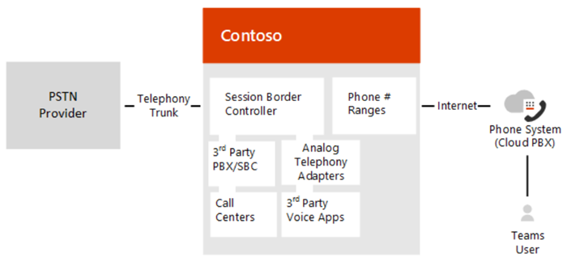

# <a name="plan-direct-routing"></a>Planifier le routage Direct

  > [!NOTE]
  > Il s’agit d’une version préliminaire de routage Direct de Microsoft Phone System.  Documentation et des fonctionnalités du produit peuvent être modifiées.

Routage Direct de Microsoft Phone système vous permet de connecter une prise en charge, fournie par le client Session contrôleur périphérie (SBC) au système téléphonique de Microsoft.  Avec cette fonctionnalité, par exemple, vous pouvez configurer une connectivité PSTN sur site avec le client Microsoft Teams, comme illustré dans le diagramme suivant : 



  > [!NOTE]
  > Skype pour Business Online vous permet également de paire un SBC fournie par le client, mais cela nécessite une Skype sur site pour le déploiement de serveurs d’entreprise ou Édition spéciale de Skype pour les entreprises, appelé connecteur sur le nuage, entre le contrôleur SBC et le Cloud Microsoft. Ce scénario est appelé voix hybride. En revanche, le routage Direct permet une connexion directe entre le contrôleur SBC pris en charge et le Cloud Microsoft. 

Avec le routage Direct, vous pouvez connecter votre contrôleur SBC quasiment n’importe quel jonction de téléphonie ou interconnect avec des équipements tiers-Public réseau de téléphonique commuté (RTC). Routage direct vous permet de : 

- Utilisez n’importe quel jonction PSTN avec système téléphonique de Microsoft. 
- Configurer l’interopérabilité entre les équipements appartenant à un client de téléphonie, comme un tiers autocommutateur privé (PBX), les périphériques analogiques et système téléphonique de Microsoft.

Microsoft propose également des solutions voix tout-en nuage, tels que l’appel de la planification.  Toutefois, une solution de voix hybride peut être adaptée à votre organisation si : 

- Appel de Plan de Microsoft n’est pas disponible dans votre pays. 
- Votre organisation nécessite une connexion à des périphériques analogiques tiers, centres d’appel et ainsi de suite. 
- Votre organisation dispose d’un contrat existant avec un opérateur RTC.

Routage direct prend également en charge les utilisateurs qui disposent de la licence supplémentaire pour le Plan d’appel de Microsoft. Pour plus d’informations, voir [Appel Plans dans Office 365](https://docs.microsoft.com/en-us/skypeforbusiness/what-are-calling-plans-in-office-365/what-are-calling-plans-in-office-365) et les [licences et les autres composants requis](#licensing-and-other-requirements). 

Avec le routage Direct, lorsque les utilisateurs participent à une conférence planifiée, le numéro d’accès est fourni par le service de conférence Microsoft, ce qui nécessite la gestion des licences approprié.  Pour les appels sortants, le service de conférence Microsoft passe l’appel en utilisant les fonctions d’appel en ligne, ce qui nécessite la gestion des licences approprié. (Notez que la connexion n’est pas réacheminé par le biais de routage Direct). Pour plus d’informations, voir [Les réunions en ligne avec des équipes](https://products.office.com/en-us/microsoft-teams/online-meeting-solutions). 
 
Planification de votre déploiement de routage Direct est une implémentation réussie. Cet article décrit l’infrastructure et des conditions de licence et fournit des informations sur la connectivité SBC : 

- [Conditions d’infrastructure requises](#infrastructure-requirements)
- [Gestion des licences et autres composants requis](#licensing-and-other-requirements)
- [Noms de domaine SBC](#sbc-domain-names)
- [Certificat de confiance public pour le contrôleur SBC](#public-trusted-certificate-for-the-sbc)
- [Signalisation SIP : Noms de domaine complets et les ports du pare-feu](#sip-signaling-fqdns-and-firewall-ports)
- [Le trafic multimédia : plages d’adresses IP et port](#media-traffic-ip-addresses-and-port-ranges)
- [SBC pris en charge](#supported-session-border-controllers-sbcs)

Pour plus d’informations sur la configuration de routage Direct, consultez [Configurer le routage Direct](configure-direct-routing.md).

## <a name="infrastructure-requirements"></a>Conditions requises pour l'infrastructure
Exigences d’infrastructure pour le SBCs pris en charge, les domaines et les autres exigences de connectivité réseau pour déployer le routage Direct sont répertoriées dans le tableau suivant :  

|**Spécification de l’infrastructure**|**Vous devez les éléments suivants**|
|:--- |:--- |
|Contrôleur de session en périphérie (SBC)|Un SBC pris en charge. Pour plus d’informations, voir [SBCs pris en charge](#supported-session-border-controllers-sbcs).|
|Le contrôleur SBC connecté jonctions de téléphonie|Une ou plusieurs jonctions téléphonie connectés pour le contrôleur SBC. À une extrémité, le contrôleur SBC se connecte au système téléphonique Microsoft via le routage Direct. Le contrôleur SBC permettre également se connecter à des entités de téléphonie tiers, telles que les systèmes PBX, cartes de téléphonie analogique et ainsi de suite. Toute option de connectivité PSTN le contrôleur SBC connectée ne fonctionne pas. (Remarque : pour la configuration des jonctions PSTN à SBC, veuillez consulter le fournisseurs SBC ou les fournisseurs de jonction.)|
|Client Office 365|Client Office 365 que vous utilisez pour héberger des utilisateurs Microsoft Teams et la configuration et la connexion pour le contrôleur SBC.|
|Serveurs d’inscriptions de l’utilisateur|Utilisateur doit être hébergé dans Office 365.<br/>Si votre société possède une Skype local pour un environnement Lync ou de l’entreprise avec connectivité hybride à Office 365, vous ne pouvez pas activer voice dans les équipes pour un utilisateur hébergé sur site.<br/><br/>Pour vérifier le serveur d’inscriptions d’un utilisateur, utilisez la Skype suivante pour l’applet de commande PowerShell en ligne d’entreprise :<br/><code>Get-CsOnlineUser -Identity \<user> \| fl HostingProvider</code> <br/><br/>Le résultat de l’applet de commande doit s’afficher :<br/><code>HostingProvider : sipfed.online.lync.com</code>|
|Domaines|Un ou plusieurs domaines ajoutés à vos clients d’Office 365.<br/><br/>**Remarque :** Vous ne pouvez pas utiliser le domaine par défaut, *. onmicrosoft.com, qui est automatiquement créée pour votre client.<br/><br/>Pour afficher les domaines, vous pouvez utiliser la Skype suivante pour l’applet de commande PowerShell Online Business :<br/><code>Get-CsTenant \| fl Domains</code><br/><br/>Pour plus d’informations sur les domaines et les clients Office 365, voir [Le Forum aux questions sur les domaines](https://support.office.com/en-us/article/Domains-FAQ-1272bad0-4bd4-4796-8005-67d6fb3afc5a).|
|Adresse IP publique pour le contrôleur SBC|Une adresse IP publique qui peut être utilisée pour se connecter à la SBC. En fonction du type de SBC, le contrôleur SBC peut utiliser NAT.|
|Nom de domaine complet (FQDN) pour le contrôleur SBC|Un nom de domaine complet du contrôleur SBC, où la partie domaine de nom de domaine complet est un des domaines de votre client Office 365. Pour plus d’informations, voir [les noms de domaine SBC](#sbc-domain-names).|
|Publique entrée DNS pour le contrôleur SBC |Une entrée DNS publique le FQDN SBC à mapper sur l’adresse IP publique. |
|Certificat de confiance public pour le contrôleur SBC |Un certificat pour le contrôleur SBC à utiliser pour toutes les communications avec le routage Direct. Pour plus d’informations, consultez la rubrique [Public certificat approuvé pour le contrôleur SBC](#public-trusted-certificate-for-the-sbc).|
|Points de connexion pour le routage Direct |Les points de connexion pour le routage Direct sont les noms de domaine trois complets suivants :<br/><br/>```sip.pstnhub.microsoft.com```– Nom de domaine complet global, doit être tenté en premier.<br/>```sip2.pstnhub.microsoft.com```– Nom de domaine complet secondaire, géographiquement mappe à la seconde région priorité.<br/>```sip3.pstnhub.microsoft.com```– Nom de domaine complet de troisième niveau, mappe géographiquement à la région de priorité de la troisième.<br/><br/>Pour plus d’informations sur la configuration requise, voir [de signalisation SIP : noms de domaine complets et les ports de pare-feu](#sip-signaling-fqdns-and-firewall-ports).|
|Adresses IP de pare-feu et les ports pour le média routage Direct |Le contrôleur SBC communique avec les services suivants dans le nuage :<br/><br/>Proxy qui gère la signalisation SIP<br/>Processeur multimédia, qui gère les données multimédias-sauf lorsque le contournement de média est activé<br/><br/>Ces deux services ont des adresses IP séparées dans le Cloud Microsoft, décrit plus loin dans ce document.<br/><br/>Pour plus d’informations, voir la [section équipes Microsoft](https://support.office.com/en-us/article/Office-365-URLs-and-IP-address-ranges-8548a211-3fe7-47cb-abb1-355ea5aa88a2#bkmk_teams) dans [Office 365 URL et plages d’adresses IP](https://support.office.com/en-us/article/Office-365-URLs-and-IP-address-ranges-8548a211-3fe7-47cb-abb1-355ea5aa88a2). |
|Profil de Transport de média|TCP/RTP/SAVP <br/>RTP/UDP/SAVP|
Adresses IP de pare-feu et les ports pour le média Microsoft Teams |Pour plus d’informations, voir [Office 365 URL et plages d’adresses IP](https://support.office.com/en-us/article/Office-365-URLs-and-IP-address-ranges-8548a211-3fe7-47cb-abb1-355ea5aa88a2). |
|||

## <a name="licensing-and-other-requirements"></a>Gestion des licences et autres composants requis 

Les utilisateurs de routage Direct doivent disposer les licences suivantes affectés dans Office 365 : 

- Skype Entreprise Online (Plan 2) 
- Système téléphonique de Microsoft 
- Microsoft Teams 
- Conférence Audio Microsoft 

La licence de conférence Audio est obligatoire pour ajouter des participants externes aux réunions planifiées, par un appel sortant leur ou en fournissant le numéro d’accès. 
 
  > [!NOTE]
  > La licence E5 inclut le système téléphonique et conférence.   

En outre, vous devez vérifier les éléments suivants :
 
- CsOnlineVoiceRoutingPolicy est affectée à l’utilisateur. 
- Autoriser que l’appel privé est activé au niveau du client pour Microsoft Teams. 

Routage direct prend également en charge les utilisateurs possédant une licence pour l’appel de Plan de Microsoft. Système téléphonique de Microsoft avec le Plan de l’appel peut acheminer des appels à l’aide de l’interface de routage Direct. Toutefois, les numéros de téléphone de l’utilisateur doivent être acquis en ligne ou prise en charge par Microsoft.  

Combinaison de connectivité de l’appel de planifier et de routage Direct pour le même utilisateur est facultatif, mais peut être utile, par exemple, lorsque l’utilisateur est affecté à un Plan de l’appel Microsoft mais souhaite acheminer des appels via le contrôleur SBC. Un des scénarios plus courants sont des appels à des systèmes PBX tiers.  Avec les systèmes PBX tiers, tous les appels, à l’exception des appels vers les téléphones connectés à ce PBX sont routés via l’appel de Plan de Microsoft ; mais les appels vers les téléphones connectés au PBX tiers sur le contrôleur SBC, par conséquent rester dans le réseau d’entreprise et non pas au réseau téléphonique commuté. 

Pour plus d’informations sur les licences de système téléphonique, voir [Options de Plan Office 365](https://technet.microsoft.com/en-us/library/office-365-plan-options.aspx)et de [tirer le meilleur parti d’Office avec Office 365](https://products.office.com/en-us/compare-all-microsoft-office-products?tab=2) . 

Pour plus d’informations sur les licences de système téléphonique, voir [Skype pour les licences d’entreprise et les équipes Microsoft module complémentaire](https://docs.microsoft.com/en-us/SkypeForBusiness/skype-for-business-and-microsoft-teams-add-on-licensing/skype-for-business-and-microsoft-teams-add-on-licensing). 

## <a name="sbc-domain-names"></a>Noms de domaine SBC

Le nom de domaine SBC doit être parmi les noms enregistrés dans « Domaines » du client. Vous ne pouvez pas utiliser le *. onmicrosoft.com client pour le nom complet de le SBC.

Le tableau suivant montre des exemples de noms DNS enregistrés pour le client, si le nom peut être utilisé comme un nom de domaine complet pour le contrôleur SBC et des exemples de noms de nom de domaine complet valides :

|**Nom DNS**|**Peut être utilisé pour SBC FQDN**|**Exemples de noms de domaine complets**|
|:--- |:--- |:--- |
Contoso.com|Oui|**Noms valides :**<br/>sbc1.contoso.com<br/>ssbcs15.contoso.com<br/>Europe.contoso.com|
|Contoso.onmicrosoft.com|Non|**Nom non valide :**<br/>sbc1.Europe.contoso.com (nécessite l’inscription d’abord europe.contoso.com de nom de domaine dans « Domaines »)
|

Il est possible qu’une société peut avoir plusieurs espaces d’adressage SIP dans un client. Par exemple, une société pourrait avoir contoso.com en tant qu’un espace d’adressage SIP et fabrikam.com comme le deuxième espace d’adresse SIP. Certains utilisateurs ont user@contoso.com adresse et certains utilisateurs ont user@fabrikam.com adresse. 

Le contrôleur SBC uniquement a besoin d’un nom de domaine complet et peut intervenir sur les utilisateurs à partir de n’importe quel espace d’adressage dans le client associé. Par exemple, un contrôleur SBC avec le nom sbc1.contoso.com peut recevoir et envoyer le trafic PSTN pour les utilisateurs avec des adresses user@contoso.com et user@fabrikam.com dans la mesure où ces espaces d’adressage SIP sont enregistrées dans le même client.  

## <a name="public-trusted-certificate-for-the-sbc"></a>Certificat de confiance public pour le contrôleur SBC

Microsoft recommande vivement que vous demandez le certificat pour le contrôleur SBC en générant une certification signing request (CSR). Pour obtenir des instructions spécifiques sur la création d’une demande CSR pour un contrôleur SBC, reportez-vous à la documentation fournie par vos fournisseurs SBC les instructions d’interconnexion. 

  > [!NOTE]
  > La plupart des autorités de certification (CA) nécessitent la taille de la clé privée pour être d’au moins 2048. Gardez à l’esprit lors de la génération de la CSR.

Le certificat doit avoir le FQDN SBC dans l’objet, nom commun ou champs de l’autre nom du sujet.

Vous pouvez également routage Direct prend en charge un caractère générique dans le nom ou le SAN courantes et le caractère générique doit être conforme à la norme [RFC HTTP sur TLS](https://tools.ietf.org/html/rfc2818#section-3.1). Utilise un exemple *. contoso.com SAN, qui correspond à la sbc.contoso.com FQDN SBC, mais ne correspond au sbc.test.contoso.com.

Le certificat doit être généré par un des autorités de certification racine suivantes :

- AddTrust externe autorité de certification racine
- Certificat racine de CyberTrust Baltimore
- Buypass
- Autorité de Certification publique principale de classe 3 
- Autorité de certification racine globale DigiCert 
- Confier
- GlobalSign
- Go daddy
- VeriSign, Inc. 
- Racine Mobile Symantec Enterprise pour Microsoft 
- Horodatage Thawte autorité de certification
- Trustwave
- T-Systems International GmbH (Deutsche Telekom)
- QuoVadis

Microsoft travaille sur l’ajout d’autorités de certification supplémentaires selon les demandes des clients. 

## <a name="sip-signaling-fqdns-and-firewall-ports"></a>Signalisation SIP : Noms de domaine complets et les ports du pare-feu 

Le point de connexion pour le routage Direct sont les noms de domaine trois complets suivants :

- **sip.pstnhub.microsoft.com** – Global FQDN – doit être tenté en premier. Lorsque le contrôleur SBC envoie une demande pour résoudre ce nom, les serveurs DNS de Microsoft Azure renvoient une adresse IP pointant vers le centre de données Azure principal affecté à la SBC. L’affectation est basée sur des mesures de performances des centres de données et le contrôleur SBC proximité géographique. L’adresse IP retournée correspond au nom de domaine complet principal.
- **sip2.pstnhub.microsoft.com** – FQDN secondaire – géographiquement mappe à la seconde région priorité.
- **sip3.pstnhub.microsoft.com** – nom de domaine complet de troisième niveau – géographiquement correspond à la région de priorité de la troisième.

Placer ces trois noms de domaines complets dans l’ordre est nécessaire pour :

- Offrent une expérience optimale (moins chargée et le plus proche du centre de données SBC affectée en interrogeant le premier nom de domaine complet).
- Fournir le basculement lors de la connexion à partir d’un contrôleur SBC est établie avec un centre de données qui rencontre un problème temporaire. Pour plus d’informations, voir le [mécanisme de basculement](#failover-mechanism-for-sip-signaling) ci-dessous.  

Les noms de domaine complets (sip.pstnhub.microsoft.com, sip2.pstnhub.microsoft.com et sip3.pstnhub.microsoft.com) sera résolus sur une des adresses IP suivantes :

- 52.114.148.0
- 52.114.132.46 
- 52.114.75.24 
- 52.114.76.76 
- 52.114.7.24 
- 52.114.14.70

Vous devez ouvrir des ports pour toutes les adresses IP dans votre pare-feu pour permettre le trafic entrant et sortant vers et depuis les adresses de signalisation.  Si votre pare-feu prend en charge les noms DNS, le nom de domaine complet sip-all.pstnhub.microsoft.com résout toutes les adresses IP ci-dessus.  Vous devez utiliser les ports suivants :

|**Trafic**|**De**|**À**|**Port source**|**Port de destination**|
|:--- |:--- |:--- |:--- |:--- |
|SIP/TLS|Proxy SIP|SBC|1024 – 65535|Défini sur le contrôleur SBC|
SIP/TLS|SBC|Proxy SIP|Défini sur le contrôleur SBC|5061|
||||||

### <a name="failover-mechanism-for-sip-signaling"></a>Mécanisme de basculement pour la signalisation SIP

Le contrôleur SBC effectue une requête DNS pour résoudre sip.pstnhub.microsoft.com. Selon l’emplacement SBC et les mesures de performances du centre de données, le centre de données principal est sélectionnée. Si le centre de données principal rencontre un problème, le contrôleur SBC essaiera sip2.pstnhub.microsoft.com, ce qui correspond à la deuxième centre de données affectée, et, dans le cas rare que centres de données dans les deux régions ne sont pas disponibles, le contrôleur SBC réessayer la dernière (nom de domaine complet sip3.pstnhub.Microsoft.com), qui fournit l’adresse IP de centre de données de troisième rang.

Le tableau ci-dessous récapitule les relations entre les centres de données primaire, secondaire et tertiaire :

|**Si le centre de données principal est**|**EMEA**|**NOAM**|**ASIE**|
|:--- |:--- |:--- |:--- |
|Le centre de données secondaire (sip2.pstnhub.microsoft.com)|NOUS|UNION EUROPÉENNE|NOUS|
|Le centre de données tertiaire (sip3.pstnhub.microsoft.com)|ASIE|ASIE|UNION EUROPÉENNE|
|||||

## <a name="media-traffic-port-ranges"></a>Le trafic multimédia : plages de ports

Le trafic multimédia est disposé vers et à partir d’un service séparé dans le Cloud de Microsoft. La plage de ports des processeurs multimédia est indiquée dans le tableau suivant : 

|**Trafic**|**De**|**À**|**Port source**|**Port de destination**|
|:--- |:--- |:--- |:--- |:--- |
|UDP/SRTP|Processeur média|SBC|49 152 – 53 247|Défini sur le contrôleur SBC|
|UDP/SRTP|SBC|Processeur média|Défini sur le contrôleur SBC|49 152 – 53 247|
|

  > [!NOTE]
  > Microsoft recommande au moins deux ports par appel simultané sur le contrôleur SBC.

## <a name="supported-session-border-controllers-sbcs"></a>Prise en charge des contrôleurs de frontière de Session (SBC)

Microsoft prend uniquement en charge le contrôleur SBC certifié pour établir une association avec le routage Direct. Enterprise Voice est essentielle pour les entreprises, Microsoft exécute des tests intensives avec les SBCs sélectionnés et fonctionne avec les fournisseurs SBC pour garantir les deux systèmes est compatibles. 

Les périphériques qui ont été validées sont répertoriés comme certifié pour les équipes de routage Direct. Les périphériques certifiés sont garanties pour fonctionner dans tous les scénarios. Il existe également un processus de support commun entre Microsoft et les fournisseurs SBC établies.  

Les fournisseurs suivants sont en cours de certification :
- [AudioCodes](https://www.audiocodes.com/solutions-products/products/products-for-microsoft-365/direct-routing-for-Microsoft-Teams)
- Ruban (anciennement Sonus) :
   - [Série de SBC Edge](https://support.sonus.net/display/UXDOC70/Best+Practice+-+Configuring+SBC+Edge+1000+-+2000+for+Microsoft+Teams+Direct+Routing)
   - [Série de base SBC TBD](https://support.sonus.net/display/IOT/PBXs+-+SBC+5k7kSWe)
- ThinkTel : ThinkTel ne vend pas les SBCs pour les entreprises, mais leur SBC est en cours certifié.  
 
## <a name="see-also"></a>Voir aussi

[Configurer le routage Direct](configure-direct-routing.md)


