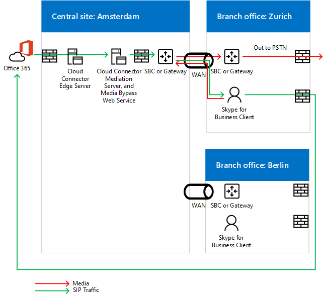

# Planifier le contournement de média dans l’édition Cloud Connector
 
Consultez cette rubrique pour passer en revue les considérations de planification pour l’implémentation de la déviation du média avec La version 2.0 de Cloud Connector et les versions ultérieures. Pour plus d’informations sur le déploiement du contournement de média, voir [Deploy media bypass in Cloud Connector Edition](deploy-media-bypass-in-cloud-connector.md).
  
La déviation du trafic multimédia permet à un client d’envoyer du trafic multimédia directement au saut suivant du réseau téléphonique commuté (PSTN) (passerelle ou contrôleur SBC) et d’éliminer le composant Cloud Connector Edition du chemin d’accès du média.
  
Le contournement de média peut améliorer la qualité de la voix en réduisant la latence, le risque de perte de paquets et le nombre de points de défaillance potentiel. L’élimination du traitement multimédia pour les appels contourné réduit la charge sur Cloud Connector, ce qui permet un plus grand nombre d’appels simultanés et peut améliorer l’évolutivité. 
  
 Libérer Cloud Connector des tâches de traitement multimédia peut réduire le nombre d’appliances Cloud Connector dont une infrastructure a besoin. Vous devez donc activer le contournement de média chaque fois que possible.
  
## Impact de la déviation du média sur les médias et les voies de signalisation

Bien que la signalisation prenne le même chemin d’accès avec ou sans déviation du trafic multimédia, le flux multimédia diffère. Les diagrammes suivants montrent les médias et les voies de signalisation dans les topologies avec et sans déviation du média. 
  
Par exemple, dans la topologie suivante ,qui n’utilise pas la déviation du trafic multimédia, un client Skype Entreprise passe un appel PSTN vers un numéro externe, la signalisation SIP est direction de Microsoft 365 ou Office 365, qui dirige le trafic de signalisation en fonction de la stratégie de voix de l’utilisateur final. Pour les utilisateurs de Cloud Connector, la stratégie de voix dirige le trafic de signalisation vers le serveur Edge cloud Connector, qui a ensuite route le trafic de signalisation vers un contrôleur SBC (Session Border Controller) ou une passerelle PSTN via le serveur de médiation Cloud Connector. Les médias circulent du client Skype Entreprise au serveur de médiation Cloud Connector, puis au SBC ou à la passerelle, comme illustré dans le diagramme suivant :
  
**Médias et voies de signalisation sans contournement de média**

  
Un appel entrant en provenance du réseau téléphonique sortant utilise le même chemin de signalisation dans le sens inverse. Pour les utilisateurs internes, les médias continueront de circuler entre le client Skype Entreprise et le serveur de médiation Cloud Connector, puis le SBC ou la passerelle.
  
Dans la topologie suivante, qui utilise la déviation du trafic multimédia, la signalisation prend le même chemin, mais les flux multimédias sont directement entre le client Skype Entreprise et le SBC ou la passerelle, comme illustré dans le diagramme suivant :
  
**Média et voie de signalisation avec contournement de média**

  
## Scénario multisessage et contournement de média

La déviation du trafic multimédia est également utile lorsque vous souhaitez fournir des services de téléphonie à plusieurs sites à l’aide d’une seule appliance Cloud Connector. Étant donné que Cloud Connector ne peut pas router les appels en fonction des numéros source ou de destination, la plupart des entreprises déploient un SBC ou une passerelle derrière Cloud Connector pour prendre des décisions de routage. Dans ce scénario, la déviation du média élimine le saut entre le client et le SBC central ou la passerelle, comme illustré dans le diagramme suivant :
  
**Application multisesse**

  
1. Le trafic SIP circule de l’utilisateur de Microsoft 365 à Office 365.
    
2. Le trafic est ensuite routage vers l’appliance Cloud Connector à Amsterdam, comme spécifié dans la stratégie de routage des voix utilisateur.
    
3. L’appliance Cloud Connector à Amsterdam envoie le trafic SIP à la passerelle centrale à Amsterdam.
    
4. La passerelle centrale d’Amsterdam prend les décisions de routage appropriées, puis envoie le trafic vers un SBC ou une passerelle à Amsterdam, tandis que les médias sont directement entre le client Skype Entreprise et le SBC ou la passerelle à Amsterdam.
    
   Cette approche permet de servir plus d’utilisateurs par déploiement Cloud Connector où Cloud Connector est centralisé. Même si Cloud Connector est éliminé du chemin d’accès multimédia, dans un scénario multisessant centralisé, le trafic multimédia peut toujours traverser le WAN deux fois plus vite que nécessaire pour passer par le SBC ou la passerelle centralisée.
  
Si un client se trouve en dehors du réseau d’entreprise passant un appel sortant, le trafic multimédia circule via les serveurs Edge et de médiation de Cloud Connector et la liaison WAN entre Amsterdam et Amsterdam, comme illustré dans le diagramme suivant :
  

  
## Clients pris en charge pour le contournement de média

Avec la première version du contournement de média, le seul client pris en charge est le client Skype Entreprise 2016 Windows qui fait partie de Applications Microsoft 365 pour les grandes entreprises, version 16.0.7870.2020 ou supérieure. Les clients peuvent utiliser n’importe quel canal : Actuel, Différé ou Première publication différée. 
  
> [!NOTE]
> Si vous utilisez une solution VPN client en combinaison avec le client Skype Entreprise, la déviation du réseau multimédia est prise en charge uniquement avec une configuration VPN en tunnel partagé. 
  
Pour plus d’informations sur les canaux de publication, voir [Vue d’ensemble des canaux](https://support.office.com/article/Overview-of-update-channels-for-Office-365-ProPlus-9ccf0f13-28ff-4975-9bd2-7e4ea2fefef4?ui=en-US&amp;rs=en-US&amp;ad=US)de mise à jour Applications Microsoft 365 pour les grandes entreprises .
  
Pour la version actuelle des clients dans différents canaux, consultez les informations de publication pour les mises à jour [Applications Microsoft 365 pour les grandes entreprises](/officeupdates/release-notes-office365-proplus). 
  
## Considérations sur la capacité cloud Connector avec contournement de média

Sans contournement de média et en fonction du matériel, une appliance Cloud Connector peut gérer entre 50 et 500 appels simultanés qui nécessitent que le média passe par un serveur de médiation. Pour plus d’informations, [voir Plan for Skype Entreprise Cloud Connector Edition](./plan-skype-for-business-cloud-connector-edition.md). 
  
Avec la déviation du média activée, les clients internes sur la version prise en charge n’utilisent pas le serveur de médiation, de sorte que le nombre de clients internes peut augmenter considérablement. 
  
Comme indiqué ci-dessus, les clients externes ou non pris en compte utiliseront les serveurs Edge et de médiation Cloud Connector pour les médias. Lors du calcul du nombre d’appliances Cloud Connector qui doivent être placées dans un site, vous devez prendre en compte le trafic provenant d’utilisateurs externes et d’utilisateurs sur des clients non pris en compte.
  
## Cloud Connector prend en charge le mode Toujours ignorer

Cloud Connector prend uniquement en charge le mode Always Bypass. Dans les environnements locaux, il existe deux options : Toujours ignorer et utiliser les informations de site et de région.
  
Always Bypass signifie que la déviation du média sera tentée pour tous les appels PSTN avec des clients internes comme point d’origine ou de destination. Pour déterminer si le client est interne ou externe, un site web sur la machine virtuelle du serveur de médiation est utilisé. Si le client peut accéder au site, il est considéré comme interne et le contournement de média est utilisé. Si le client ne peut pas accéder au site (par exemple, le client se trouve sur un réseau à domicile), le contournement de média n’est pas utilisé. 
  
Always Bypass nécessite une connectivité sans objet entre les utilisateurs et les passerelles PSTN au sein d’un site PSTN. 
  
Pour plus d’informations, [voir Plan for Skype Entreprise Cloud Connector Edition](./plan-skype-for-business-cloud-connector-edition.md). 
  
Par exemple, dans le diagramme ci-dessous, les utilisateurs européens doivent être bien connectés aux trois contrôleurs de frontière de session (SCS) à Amsterdam, tandis que les utilisateurs américains doivent être bien connectés aux deux contrôleurs de frontière de session à Seattle. Bien connectés, ils se trouvent soit sur les mêmes sites réseau que les SCS ou les passerelles, soit sur des liaisons WAN qui ont une bande passante appropriée.
  

  
> [!NOTE]
> Si un utilisateur de Seattle se rend au bureau de Seattle et que vous souhaitez utiliser le réseau interne pour fournir le trafic multimédia entre l’utilisateur itinérant et les passerelles en Europe (au lieu de passer par Internet), vous devez vous assurer que le bureau de Seattle et le bureau d’Amsterdam où se trouvent les passerelles ou les SBCs européens sont également connectés. 
  
## Codecs utilisés dans le contournement de média

Avec la déviation du trafic multimédia activée, le trafic multimédia entre un client et un contrôleur SBC ou une passerelle utilise le codec G.711. 
  
## Voir aussi

[Déployer le contournement de média dans Cloud Connector Edition](deploy-media-bypass-in-cloud-connector.md)